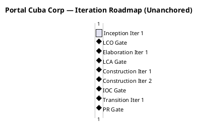
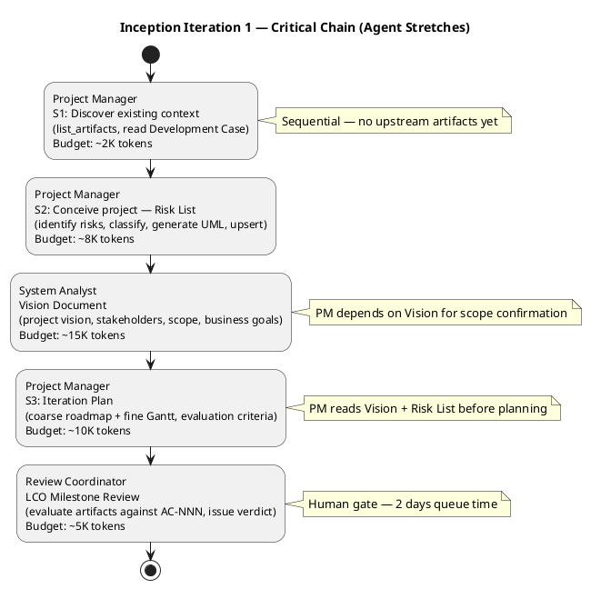

## Document Control

| Field | Value |
|---|---|
| Phase | Inception |
| Status | Draft |
| Milestone Target | End-of-Inception (LCO) |
| Iteration | 1 (Cycle 1) |
| Date | 2026-08-28 |

## Iteration Objectives

1. **Establish project viability:** Confirm that the declared scope (10 functional requirements, 4 NFRs, 5 acceptance criteria) is achievable within the technical constraints (.NET 10, Razor Pages, PostgreSQL, Keycloak OIDC, AD LDAP, internal Windows Server).
2. **Identify and classify all project risks:** Produce a complete Risk List with probability, impact, magnitude, strategy, mitigation, and contingency for each risk — confronting the highest-magnitude risks (R001, R006) first.
3. **Define the coarse cross-iteration roadmap:** Milestone sequence (LCO → LCA → IOC → PR), iteration count per phase, and agent role assignment profile — bounded by the 6±3 rule and the rubber profile.
4. **Produce the fine-grained plan for Inception Iteration 1:** Work items, owners, and token budgets for the current iteration, bounded by the iteration's budget box.
5. **Assess LCO readiness:** Determine whether the project is viable to proceed to Elaboration based on risk exposure, scope clarity, and stakeholder alignment.

## Plan and Milestones

### Coarse Cross-Iteration Roadmap

The project follows the RUP iterative lifecycle with **6 iterations** across 4 phases, consistent with the 6±3 rule for a moderate-complexity internal portal. The rubber profile starting point (Inception ~5%, Elaboration ~20%, Construction ~65%, Transition ~10%) is adjusted for this project's risk profile: R001 (AD LDAP, exposure=9) and R006 (offline operation, exposure=6) demand a robust Elaboration phase, so Elaboration receives 2 iterations rather than 1.

| Phase | Iterations | Purpose | Milestone |
|---|---|---|---|
| Inception | 1 | Scope, risk identification, project viability, initial roadmap | LCO (Life-Cycle Objectives) |
| Elaboration | 2 | Architecture baseline, AD LDAP PoC, offline mechanism design, OIDC integration, critical use-case analysis | LCA (Life-Cycle Architecture) |
| Construction | 2 | Implement all 10 functional requirements, audit trail, UI per CON-011, load testing | IOC (Initial Operational Capability) |
| Transition | 1 | User documentation, deployment to Windows Server, adoption tracking, stakeholder sign-off | PR (Product Release) |

**Total: 6 iterations** — within the 6±3 range, appropriate for a moderate-complexity intranet portal with 200 users.

**Milestone gates and human queue time:**

| Milestone | Gate Review | Human Queue Time | Decision |
|---|---|---|---|
| LCO | End of Inception Iter 1 | 2 days | Proceed to Elaboration? |
| LCA | End of Elaboration Iter 2 | 2 days | Architecture baseline stable? |
| IOC | End of Construction Iter 2 | 2 days | System operational for deployment? |
| PR | End of Transition Iter 1 | 2 days | Acceptance criteria met? Release? |

> **Note on units:** Iteration durations in the Gantt are relative ordering markers, not calendar projections. Agent work is measured in tokens and elapsed time; human gates are measured in days of queue time. No absolute dates are projected — the Gantt is unanchored by design. The "1 days" per iteration is a sequencing unit, not a duration estimate.

### Fine Plan — Inception Iteration 1

This iteration is the project's first. Its scope is bounded by a **budget box of ~40K tokens** (assumption — no prior measured actuals exist; basis: 4 agent stretches with typical Inception artifact sizes for a moderate-complexity project).

| Work Item | Owner (Agent Role) | Token Budget | Depends On | Output |
|---|---|---|---|---|
| Discover existing context | Project Manager | ~2K | — | Artifact index, Development Case read |
| Risk List | Project Manager | ~8K | Development Case | Risk List artifact (6 risks classified) |
| Vision Document | System Analyst | ~15K | Development Case, Declared Scope | Vision Document artifact |
| Iteration Plan | Project Manager | ~10K | Risk List, Vision Document | Iteration Plan artifact (coarse + fine) |
| LCO Milestone Review | Review Coordinator | ~5K | All Inception artifacts | Milestone verdict |

**Budget box total: ~40K tokens** (assumption — first iteration, no measured actuals). Human gate: LCO review = 2 days queue time.

### LCO Readiness Assessment

The project is viable to proceed to Elaboration if:
- All 6 risks are classified with strategies and mitigation plans ✓ (Risk List produced)
- Scope is clearly bounded by 10 FRs, 4 NFRs, 5 ACs, 13 constraints ✓ (Declared Scope)
- Coarse roadmap with 6 iterations across 4 phases is defined ✓ (this plan)
- No open SCOPE_QUESTION blocks the LCO gate

**Open items for LCO review:**
- AC-005 (offline operation with sync) is the most architecturally significant acceptance criterion. R006 captures this risk. The Elaboration phase must investigate the offline mechanism design before Construction commits to an implementation approach.
- R001 (AD LDAP attribute consistency) may trigger an Architectural PoC in Elaboration — the Development Case currently has this NOT TRIGGERED but re-evaluation is pending.

## Resources

### Agent Role Assignment Profile

| Phase | Iteration | Active Agent Roles | Budget Split |
|---|---|---|---|
| Inception | Iter 1 | Project Manager, System Analyst, Review Coordinator | PM: ~20K, SA: ~15K, RC: ~5K |
| Elaboration | Iter 1 | Software Architect, System Analyst, Designer, Project Manager, Review Coordinator | [ASSUMPTION — to be sized from Inception measured actuals] |
| Elaboration | Iter 2 | Software Architect, Designer, Test Designer, Project Manager, Review Coordinator | [ASSUMPTION — to be sized from Elaboration Iter 1 measured actuals] |
| Construction | Iter 1 | Designer, Implementer, Test Designer, Project Manager, Review Coordinator | [ASSUMPTION — to be sized from Elaboration measured actuals] |
| Construction | Iter 2 | Implementer, Test Designer, Deployment Manager, Project Manager, Review Coordinator | [ASSUMPTION — to be sized from Construction Iter 1 measured actuals] |
| Transition | Iter 1 | Deployment Manager, Test Designer, Technical Writer, Project Manager, Review Coordinator | [ASSUMPTION — to be sized from Construction measured actuals] |

> **Budget basis:** Inception Iter 1 budget is an explicit assumption (no prior measured actuals exist). Every subsequent phase's budget will be sized from the MEASURED actuals of the phase that preceded it — not from this assumption. The rubber profile percentages (5/20/65/10) inform iteration COUNT only, not budget allocation.

### Parallelism Assessment

Inception Iteration 1 has minimal parallelism opportunity: the Project Manager produces the Risk List before the System Analyst produces the Vision, and the Iteration Plan depends on both. This is a sequential critical chain — appropriate for a first iteration establishing project foundations. Parallelism increases in Elaboration (Architect + Designer + System Analyst can work concurrently on different artifacts) and peaks in Construction (Implementer + Test Designer work in parallel per use case).

## Use Cases and Scenarios Addressed

This iteration does not implement use cases — it establishes the project framework. The following use cases are allocated to future iterations based on risk-driven sequencing:

| Use Case | FR ID | Target Phase | Rationale |
|---|---|---|---|
| Clock In and Clock Out | FR-001 | Construction Iter 1 | Core functionality, highest user impact, NFR-002 performance requirement |
| View Own Clocking History | FR-002 | Construction Iter 1 | Depends on FR-001 data model |
| View All Employee Clockings | FR-003 | Construction Iter 1 | HR view, extends FR-001/FR-002 |
| Export Monthly Clocking Report | FR-004 | Construction Iter 2 | CSV export, lower risk |
| Publish News | FR-005 | Construction Iter 1 | Core HR function, audit trail (NFR-004) |
| Edit Published News | FR-006 | Construction Iter 1 | Extends FR-005, audit trail |
| Unpublish News | FR-007 | Construction Iter 1 | Extends FR-005, CON-013 no hard delete |
| Read and Filter News | FR-008 | Construction Iter 1 | Employee-facing, depends on FR-005 |
| Search Employee Directory | FR-009 | Elaboration Iter 1 | R001 risk — AD LDAP integration must be validated early |
| Manage Worker Category | FR-010 | Construction Iter 2 | Simple two-column table, lower risk |

**Risk-driven sequencing rationale:** FR-009 (Employee Directory) is allocated to Elaboration Iteration 1 because it directly confronts R001 (AD LDAP attribute inconsistency, exposure=9) — the highest-magnitude risk. The Elaboration phase must validate LDAP connectivity and attribute availability before Construction builds the full directory feature. FR-001 (Clock In/Out) is allocated to Construction Iteration 1 as the core feature with the most user impact and the NFR-002 performance requirement.

## Evaluation Criteria

### Layer 1: Declared Acceptance Criteria Status

| AC ID | Description | Addressed This Iteration | Evidence | Deferred To |
|---|---|---|---|---|
| AC-001 | Employee can clock in/out without HR help | No | Not implemented in Inception | Construction Iter 1 |
| AC-002 | HR can publish news without technical assistance | No | Not implemented in Inception | Construction Iter 1 |
| AC-003 | Employee finds colleague's phone/email in under 10 seconds | No | Not implemented in Inception | Elaboration Iter 1 (LDAP validation) → Construction Iter 1 (implementation) |
| AC-004 | 80% of employees complete at least one clocking with no prior training | No | Not implemented in Inception | Construction Iter 2 + Transition Iter 1 |
| AC-005 | System works temporarily offline, syncs on recovery | No | Not implemented in Inception — R006 identifies this as architecturally significant | Elaboration Iter 1 (architectural investigation) → Construction Iter 2 (implementation) |

> No acceptance criteria are addressed in Inception — this is expected. Inception establishes viability and planning, not implementation. All ACs are allocated to future iterations with explicit target phases.

### Layer 2: Inception Iteration 1 Exit Criteria

| Criterion | Met? | Evidence |
|---|---|---|
| Risk List produced with all risks classified (P, I, magnitude, strategy, mitigation, contingency) | Yes | Risk List artifact (6 risks: R001–R006) |
| Coarse cross-iteration roadmap defined with milestone sequence | Yes | This artifact, "Plan and Milestones" section |
| Fine-grained plan for Inception Iteration 1 with work items, owners, token budgets | Yes | This artifact, "Fine Plan" subsection |
| Agent role assignment profile defined per iteration | Yes | This artifact, "Resources" section |
| Use cases allocated to iterations based on risk-driven sequencing | Yes | This artifact, "Use Cases and Scenarios Addressed" section |
| LCO readiness assessed | Yes | This artifact, "LCO Readiness Assessment" subsection |
| No open SCOPE_QUESTION blocking the gate | Pending review | No SCOPE_QUESTION raised — all scope is declared |

## Traceability

| Element | Traces From | Link Type | Traces To |
|---|---|---|---|
| Iteration Plan | Development Case | Derives | Iteration Assessment (post-iteration) |
| Risk List (R001–R006) | Work Order R001, R002, CON-004, NFR-002, NFR-003, CON-011, CON-002, AC-005 | Refines | Elaboration Iteration Plan, Construction Iteration Plans |
| Coarse Roadmap | Development Case (rubber profile, 6±3 rule) | Derives | All subsequent Iteration Plans |
| Use Case Allocation (FR-001 to FR-010) | Work Order FR-001 to FR-010 | Refines | Elaboration and Construction Iteration Plans |
| AC-001 to AC-005 | Work Order AC-001 to AC-005 | Refines | Construction and Transition Iteration Plans |
| LCO Readiness Assessment | All Inception artifacts | Derives | LCO Milestone Review (Review Coordinator) |