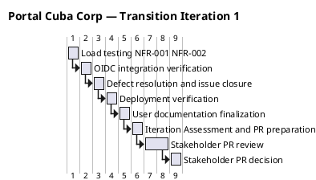

## Document Control

| Field | Value |
|---|---|
| Phase | Transition |
| Status | Active |
| Milestone Target | Product Release (PR) — **NOT YET ACHIEVED** |
| Iteration | 1 (Cycle 1) |
| Date | 2026-08-29 |
| Prior Phase | Construction C4 Cycle 1 — IOC CONDITIONAL GO; stakeholder sanction GRANTED with 3 binding conditions; 0 open PRs; CI GREEN on main (run 33256627567); 35/43 tests pass, 8 covered-by-mock; 7 open issues (1 ACCEPTED, 6 deferred) |
| Evolution | Transition Iter 1 Plan evolved from Construction C4 baseline. Three binding conditions from stakeholder sanction drive this iteration: (1) NFR-001/NFR-002 load testing with measured values, (2) real OIDC integration as named work item, (3) mock-auth expiry date documented. New risks R009 (deployment) and R010 (user acceptance) added for Transition. |
| Measured Baseline | Inception: 2 iters, 4.38M tokens, 22 min, 11 runs, 10 artifacts. Elaboration: 2 iters, 20.87M tokens, 1.0h, 21 runs, 13 artifacts. Construction C3: 12.75M tokens, 1.3h, 15 runs, 15 artifacts. Construction C4: 10.95M tokens, 1.2h, 16 runs, 15 artifacts. Cumulative: ~49.0M tokens, ~3.7h agent time, 63 runs, 53 artifacts. No Transition actuals yet — all figures below are `[ASSUMPTION — requires validation]`. |

## Iteration Objectives

1. **Execute NFR-001/NFR-002 load testing with measured values** — Stakeholder binding condition #1. Page load < 3s on corporate network (NFR-001), clock in/out response < 1s (NFR-002). Measured values required — not estimates.
2. **Verify real OIDC integration** — Stakeholder binding condition #2. Real OIDC client registered with Keycloak, login flow verified end-to-end. 8 tests currently covered-by-mock must be unblocked or explicitly deferred with stakeholder agreement. Mock-auth expiry date documented (binding condition #3).
3. **Resolve or explicitly defer all 7 open GitHub issues** — 1 blocker (R003 OIDC — ACCEPTED, addressed by objective 2), 6 deferred issues. Each must be resolved or have explicit stakeholder agreement to defer.
4. **Verify deployment to internal Windows Server** — Portal accessible from corporate network across all 3 offices. CON-006 (internal Windows Server), CON-007 (no external access).
5. **Finalize user documentation** — User docs complete and verified against deployed system. AC-001 through AC-005 acceptance criteria verified.
6. **Produce Iteration Assessment and PR milestone evidence** — Final Iteration Assessment supporting PR milestone review. All acceptance criteria addressed with evidence.

## Plan and Milestones

### Coarse Cross-Iteration Roadmap

| Milestone | Phase | Status | Key Gate Criteria |
|---|---|---|---|
| LCO | Inception | **ACHIEVED** | 0 open findings, stakeholder sanction GRANTED |
| LCA | Elaboration | **ACHIEVED** | 8 LCA closure conditions met, architecture baselined |
| IOC | Construction | **CONDITIONAL GO** | Stakeholder sanction GRANTED with 3 binding conditions |
| PR | Transition | **NOT YET ACHIEVED** | Product deployed, user acceptance achieved, project closed |



### Iteration Fine-Plan — Work Items

| # | Work Item | Owner (Agent Role) | Token Budget | Dependencies | Exit Criteria |
|---|---|---|---|---|---|
| T1 | Load testing (NFR-001/NFR-002) | Test Manager | 2.5M `[ASSUMPTION — based on C3 test eval share of 12.75M]` | None | Measured page-load < 3s, clock response < 1s; results documented |
| T2 | OIDC integration verification | Software Architect | 1.5M `[ASSUMPTION — based on Elaboration PoC avg]` | T1 (parallelizable) | Real OIDC client registered, login flow verified, mock-auth expiry documented |
| T3 | Defect resolution & issue closure | Implementer | 2.0M `[ASSUMPTION — based on C4 rework share]` | T2 (OIDC unblocks 8 tests) | 0 open Critical/Major defects; 7 open issues resolved or explicitly deferred |
| T4 | Deployment verification | Software Architect | 1.0M `[ASSUMPTION — no comparable prior phase]` | T3 | Portal deployed to internal Windows Server, accessible from corporate network |
| T5 | User documentation finalization | Technical Writer | 0.5M `[ASSUMPTION — no comparable prior phase]` | T4 | User docs complete, verified against deployed system |
| T6 | Iteration Assessment & PR preparation | Project Manager | 1.5M `[ASSUMPTION — based on C4 PM work]` | T1–T5 | Iteration Assessment complete, PR milestone evidence assembled |

**Iteration budget box:** ~9.0M tokens `[ASSUMPTION — no Transition actuals; based on proportional share of Construction C4 (10.95M) adjusted for reduced scope]`. Human gate: 3 days queue time (2 days PR review + 1 day decision).

### Critical Chain — Sequential Agent Stretches

```plantuml
@startuml
title Portal Cuba Corp — Transition Iter 1 Critical Chain

skinparam activityBackgroundColor #F0F4FF
skinparam activityBorderColor #336699

start

:Load Testing (NFR-001/NFR-002)
  Owner: Test Manager
  Budget: 2.5M tokens [ASSUMPTION — based on C3 test eval 12.75M/5 work items]
  Exit: Measured page-load < 3s, clock response < 1s;

:OIDC Integration Verification
  Owner: Software Architect
  Budget: 1.5M tokens [ASSUMPTION — based on Elaboration PoC avg 20.87M/7 work items]
  Exit: Real OIDC client registered, login flow verified, mock-auth expiry documented;

:Defect Resolution & Issue Closure
  Owner: Implementer
  Budget: 2.0M tokens [ASSUMPTION — based on C4 rework 10.95M/5 work items]
  Exit: 0 open Critical/Major defects, 7 open issues resolved or explicitly deferred;

:Deployment Verification
  Owner: Software Architect
  Budget: 1.0M tokens [ASSUMPTION — no comparable prior phase]
  Exit: Portal deployed to internal Windows Server, accessible from corporate network;

:User Documentation Finalization
  Owner: Technical Writer
  Budget: 0.5M tokens [ASSUMPTION — no comparable prior phase]
  Exit: User docs complete, deployment guide verified;

:Iteration Assessment & PR Preparation
  Owner: Project Manager
  Budget: 1.5M tokens [ASSUMPTION — based on C4 PM work]
  Exit: Iteration Assessment complete, PR milestone evidence assembled;

stop

@enduml
```

## Resources

### Agent Role Profile — Transition Iter 1

| Agent Role | Work Items | Token Budget | Rationale |
|---|---|---|---|
| Test Manager | T1 (load testing) | 2.5M | NFR-001/NFR-002 measured values — stakeholder binding condition #1 |
| Software Architect | T2 (OIDC), T4 (deployment) | 2.5M | OIDC integration + deployment verification — stakeholder binding condition #2 |
| Implementer | T3 (defects/issues) | 2.0M | Resolve remaining issues, unblock OIDC tests |
| Technical Writer | T5 (user docs) | 0.5M | Finalize user documentation for deployed system |
| Project Manager | T6 (assessment/PR) | 1.5M | Iteration Assessment, PR milestone evidence, project closeout |
| **Total** | **6 work items** | **~9.0M** | `[ASSUMPTION — no Transition actuals yet]` |

### Budget Split

| Category | Tokens | % of Box |
|---|---|---|
| Test & Verification (T1) | 2.5M | 28% |
| Architecture & Deployment (T2, T4) | 2.5M | 28% |
| Implementation (T3) | 2.0M | 22% |
| Documentation (T5) | 0.5M | 6% |
| Project Management (T6) | 1.5M | 17% |
| **Total** | **9.0M** | **100%** |

### Human Gates

| Gate | Duration | Description |
|---|---|---|
| Stakeholder PR review | 2 days queue time | STK-001 reviews PR milestone evidence, acceptance criteria, deployment verification |
| Stakeholder PR decision | 1 day queue time | STK-001 grants or refuses PR milestone — project closeout or rework |

## Use Cases and Scenarios Addressed

This Transition iteration does not implement new use cases. It verifies and validates the system built across Inception–Construction against the declared acceptance criteria.

| AC ID | Description | Work Item | Evidence Required |
|---|---|---|---|
| AC-001 | Employee clocks in/out without HR/dev help | T4 (deployment), T5 (user docs) | Deployed system test: employee completes clock in/out unassisted |
| AC-002 | HR publishes news without technical assistance | T4 (deployment), T5 (user docs) | Deployed system test: HR publishes news item unassisted |
| AC-003 | Employee finds colleague's phone/email < 10s | T1 (load testing), T4 (deployment) | Measured directory search response time < 10s |
| AC-004 | 80% of employees complete one clocking, no training | T5 (user docs), T6 (assessment) | User documentation supports no-training clocking; adoption plan documented |
| AC-005 | System works temporarily offline (5 min network drop) | T4 (deployment) | Offline clocking + sync verification on deployed system |

## Evaluation Criteria

### Stakeholder Binding Conditions (from IOC sanction)

| # | Condition | Owner | Exit Criterion |
|---|---|---|---|
| 1 | NFR-001/NFR-002 load testing with measured values | Test Manager | Measured page-load < 3s, clock response < 1s — documented with actual numbers |
| 2 | Real OIDC integration is named Transition work item with owner | Software Architect | OIDC client registered, login flow verified, 8 tests unblocked or deferred with agreement |
| 3 | Mock-auth has expiry date | Software Architect | Expiry date documented in this Iteration Plan and Risk List |

### Acceptance Criteria (from Declared Scope)

| AC ID | Addressed This Iteration | Evidence | Deferred |
|---|---|---|---|
| AC-001 | Yes | T4 deployment verification + T5 user docs | — |
| AC-002 | Yes | T4 deployment verification + T5 user docs | — |
| AC-003 | Yes | T1 load testing (measured response) + T4 deployment | — |
| AC-004 | Yes | T5 user docs + T6 assessment (adoption plan) | — |
| AC-005 | Yes | T4 deployment verification (offline sync test) | — |

### Iteration Exit Criteria

1. NFR-001 and NFR-002 measured values documented (binding condition #1)
2. OIDC integration verified or explicitly deferred with stakeholder agreement (binding condition #2)
3. Mock-auth expiry date documented (binding condition #3)
4. 0 open Critical/Major defects
5. All 7 open GitHub issues resolved or explicitly deferred with stakeholder agreement
6. Deployment verified on internal Windows Server
7. User documentation finalized
8. Iteration Assessment produced with PR milestone evidence

## Traceability

| Element | Traces From | Link Type | Traces To |
|---|---|---|---|
| T1 (load testing) | NFR-001, NFR-002, R004 | Derives | Test Evaluation Summary (Transition), Iteration Assessment |
| T2 (OIDC) | R003, CON-004, STK-003 | Derives | SAD COMP-001 (OIDC), Iteration Assessment |
| T3 (defects) | Review Record C4, Change Request C4 | Derives | SCM Issues, Iteration Assessment |
| T4 (deployment) | CON-006, CON-007, R009 | Derives | Deployment verification, Iteration Assessment |
| T5 (user docs) | AC-001, AC-002, AC-004, R002 | Derives | User Documentation (Transition), Iteration Assessment |
| T6 (assessment) | AC-001–AC-005, R010 | Derives | Iteration Assessment, PR milestone review |
| R009 (deployment) | CON-006, CON-007 | Derives | T4, Risk List |
| R010 (user acceptance) | AC-001–AC-005, BG-003 | Derives | T6, Risk List |
| Mock-auth expiry | STK-001 binding condition #3 | Refines | T2, Risk List R003 |
| Stakeholder PR gate | STK-001, AC-001–AC-005 | Refines | PR milestone review |