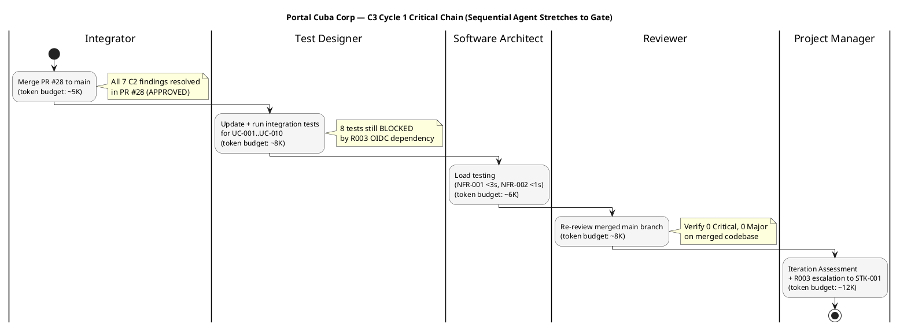
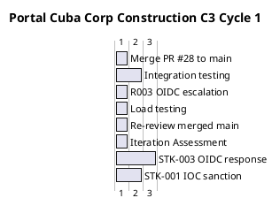

## Document Control

| Field | Value |
|---|---|
| Phase | Construction |
| Status | Active |
| Milestone Target | End-of-Construction (IOC) — NOT YET ACHIEVED |
| Iteration | 3 (Cycle 1) |
| Date | 2026-08-29 |
| Prior Phase | Construction C2 Cycle 3 — PR #28 APPROVED (all 7 C2 code-level findings RESOLVED); stakeholder sanction REFUSED 2nd time with PR synchronization directive |
| Evolution | C2 Cycle 3 Plan evolved for C3 Cycle 1: all 7 C2 findings resolved in PR #28 (APPROVED by Code Reviewer); coarse roadmap updated with C2 Cycle 3 outcome; fine plan replaced with C3 scope — merge PR #28 to main, integration testing, load testing, R003 OIDC escalation (4th cycle), IOC achievement; R007 status updated to RESOLVED; R008 rework cycle COMPLETE |
| Measured Baseline | Inception: 2 iters, 4.38M tokens, 22 min, 11 runs, 10 artifacts. Elaboration: 2 iters, 20.87M tokens, 1.0h, 21 runs, 13 artifacts. Construction C1: 1 iter, 9.85M tokens, 1h 42m 55s, 15 runs, 15 artifacts. Construction C2 Cycle 2: 18.84M tokens, 19h 15m 47s, 15 runs, 15 artifacts. Cumulative: ~54.0M tokens, ~21.3h, 62 runs, 53 artifacts. C2 Cycle 3 measured actuals not yet recorded. |
| Finding IP-F4 | RESOLVED — mid-iteration checkpoint present in Plan and Milestones since C2 Cycle 3 |

## Iteration Objectives

1. **Merge PR #28 to main.** PR #28 (feature/C3-presentation → iteration/C3) is APPROVED by Code Reviewer with all 7 C2 findings resolved. PR #19 and PR #8 are superseded (REQUEST_CHANGES). The Integrator merges PR #28 to main, closing the PR synchronization gap the stakeholder identified.
2. **Integration testing on merged main.** Run all 30 test cases (TC-001..TC-030) against the merged main branch. 8 tests remain BLOCKED by R003 (OIDC registration unconfirmed by STK-003). 22 tests should pass on merged code.
3. **Load testing for NFR-001 (<3s page load) and NFR-002 (<1s clocking response).** Deferred from C2. Execute on merged main with representative data volume (200 employees).
4. **R003 OIDC escalation — 4th cycle.** STK-003 has not confirmed OIDC client registration across 3 prior cycles. Escalate to STK-001 (sponsor) again. 8 of 30 tests remain BLOCKED. This is the critical path for IOC achievement.
5. **Re-review merged main.** Reviewer verifies 0 Critical, 0 Major on the merged codebase. This is the gate for IOC milestone assessment.
6. **Iteration Assessment.** Record C2 Cycle 3 variance (objectives MET — PR #28 approved, all findings resolved) and C3 Cycle 1 results.

## Plan and Milestones

### Coarse Cross-Iteration Roadmap

The project follows the RUP iterative lifecycle. Inception and Elaboration are CLOSED with measured actuals. Construction C1 is CLOSED. C2 Cycle 2 is CLOSED with measured actuals. C2 Cycle 3 is COMPLETE — PR #28 APPROVED, all 7 C2 findings resolved. C3 Cycle 1 is the CURRENT iteration, focused on merging, integration testing, and IOC achievement.

| Phase | Iterations | Measured Tokens | Measured Agent Time | Agent Runs | Artifacts | Milestone |
|---|---|---|---|---|---|---|
| Inception (CLOSED) | 2 | 4,382,313 | 22 min | 11 | 10 | LCO ✅ ACHIEVED |
| Elaboration (CLOSED) | 2 | 20,867,327 | 1.0 h | 21 | 13 | LCA ✅ ACHIEVED |
| Construction C1 (CLOSED) | 1 | 9,854,220 | 1h 42m 55s | 15 | 15 | IOC ❌ NOT ACHIEVED |
| Construction C2 Cycle 2 (CLOSED) | 1 | 18,839,560 | 19h 15m 47s | 15 | 15 | IOC ❌ NOT ACHIEVED |
| Construction C2 Cycle 3 (COMPLETE) | 1 | [ASSUMPTION — ~18.84M tokens; basis: C2 Cycle 2 measured actual] | [ASSUMPTION — ~19h; basis: C2 Cycle 2 measured actual] | [ASSUMPTION — ~15 runs] | [ASSUMPTION — ~15 artifacts] | IOC ❌ NOT YET — PR #28 APPROVED, findings resolved, merge pending |
| Construction C3 Cycle 1 (CURRENT) | 1 | [ASSUMPTION — ~18.84M tokens; basis: C2 Cycle 2 measured actual, accumulated surface comparable] | [ASSUMPTION — ~19h; basis: C2 Cycle 2 measured actual] | [ASSUMPTION — ~15 runs] | [ASSUMPTION — ~15 artifacts] | IOC (target) |
| Transition (PLANNED) | 1 | [ASSUMPTION — ~5M tokens; basis: Transition is lighter, fewer architectural decisions] | [ASSUMPTION — ~15 min] | [ASSUMPTION — ~8 runs] | [ASSUMPTION — ~5 artifacts] | PR (target) |
| **Total** | **9+** | **~73M+ (forecast)** | | | | |

> The iteration count is now 9+ (2 Inception + 2 Elaboration + 1 C1 + 2 C2 cycles + 1 C3 = 8 iterations, plus C3 Cycle 1 = 9). The "6 ± 3" rule sanity check: 9 iterations is at the upper bound of the high extreme [1, 3, 3, 2]. The rework cycles (C2 Cycle 2, C2 Cycle 3) were caused by zero-execution iterations — a process failure, not a scope expansion. C3 Cycle 1 is the first iteration where all code-level findings are resolved and the focus shifts to integration and IOC achievement.

> **C2 Cycle 3 outcome:** PR #28 APPROVED by Code Reviewer. All 7 C2 findings (1 Critical, 2 Major, 4 Minor) RESOLVED. PR #19 and PR #8 superseded. The stakeholder's PR synchronization complaint is addressed — the Integrator role (added in C2 Cycle 3) executed the merge work. However, IOC is NOT YET achieved: (a) PR #28 must be merged to main, (b) 8 tests remain BLOCKED by R003 OIDC, (c) integration testing on merged main has not been run.

### Fine Plan — C3 Cycle 1 Work Items

| # | Work Item | Owner | Token Budget | Dependencies | Acceptance Criterion | Checkpoint |
|---|---|---|---|---|---|---|
| 1 | Merge PR #28 to main (close PR #19, PR #8 as superseded) | Integrator | ~5K | PR #28 APPROVED | main branch carries all C2 fixes; CI green | CP-1 |
| 2 | Run integration tests TC-001..TC-030 on merged main | Test Designer | ~8K | Item 1 | 22 of 30 pass; 8 BLOCKED documented (R003) | CP-2 |
| 3 | Load testing: NFR-001 (<3s page load), NFR-002 (<1s clocking) | Software Architect | ~6K | Item 1 | Both thresholds met or mitigation documented | CP-2 |
| 4 | Escalate R003: OIDC registration to STK-001 (4th cycle) | Project Manager | ~2K | — | Escalation logged; STK-003 contacted | CP-3 |
| 5 | Re-review merged main: verify 0 Critical, 0 Major | Reviewer | ~8K | Items 1-3 | Review Record updated with verdict | CP-4 |
| 6 | Iteration Assessment (C3 Cycle 1 variance analysis) | Project Manager | ~10K | Item 5 | Objectives met/missed documented | — |

**Budget box: ~18.84M tokens** [BASIS: C2 Cycle 2 measured actual = 18,839,560 tokens. The accumulated artifact surface is 53+ artifacts, so reasoning-over-surface cost is comparable. The box is fixed; scope adapts.]

> **Mid-iteration checkpoint (IP-F4 resolution):** CP-1 (merge complete) and CP-2 (integration + load testing complete) are mid-iteration checkpoints. If CP-1 is not met by the first third of the iteration, the Integrator is blocked and all downstream work stalls — escalate immediately. If CP-2 shows new Critical/Major findings on merged main, stop and re-plan before CP-3.

## Resources

### Agent Role Profile — Construction C3 Cycle 1

| Role | Active | Work Items | Token Budget | Rationale |
|---|---|---|---|---|
| Integrator | Yes | 1 | ~5K | Merge PR #28 to main — addresses stakeholder PR sync complaint |
| Test Designer | Yes | 2 | ~8K | Integration testing on merged main; 8 tests blocked by R003 |
| Software Architect | Yes | 3 | ~6K | Load testing for NFR-001, NFR-002 |
| Reviewer | Yes | 5 | ~8K | Re-review merged main for IOC gate |
| Project Manager | Yes | 4, 6 | ~12K | R003 escalation, iteration assessment |
| Implementer | Advisory | — | ~0K | All code fixes complete (PR #28 approved) |
| UI Designer | Advisory | — | ~0K | Design Model complete; consultation only |

> **Parallelism discipline:** 5 active roles — one more than C2 (Integrator added). The Integrator is a sequential prerequisite for Test Designer and Software Architect. No increase in parallelism risk — the dependency chain is strictly sequential: merge → test → review.

### Budget Split Across Agent Roles

| Role | Token Share | % of Work-Item Budget |
|---|---|---|
| Integrator | ~5K | 13% |
| Test Designer | ~8K | 21% |
| Software Architect | ~6K | 16% |
| Reviewer | ~8K | 21% |
| Project Manager | ~12K | 32% |
| **Total planned work items** | **~39K** | **(work-item budgets only; full budget box ~18.84M includes all agent reasoning over artifact surface)** |

> The token budgets above are for the **planned work items**. The full budget box (~18.84M) accounts for all agent reasoning including re-reading accumulated artifacts, cross-referencing, and verification overhead. Work-item budgets are ~0.2% of actual token spend; the cost driver is reasoning over the accumulated artifact surface, not the volume of new output.

## Use Cases and Scenarios Addressed

| UC ID | Use Case | FR ID | C2 Finding | C3 Cycle 1 Status |
|---|---|---|---|---|
| UC-001 | Clock In and Clock Out | FR-001 | C2-CRIT-1 + C2-MAJ-2 + C2-MIN-2 — ALL RESOLVED in PR #28 | Integration test on merged main (Item 2) |
| UC-002 | View Own Clocking History | FR-002 | No findings | Integration test on merged main (Item 2) |
| UC-003 | View All Employee Clockings | FR-003 | No findings | Integration test on merged main (Item 2) |
| UC-004 | Export Monthly Clocking Report | FR-004 | C2-MIN-4 — RESOLVED in PR #28 | Integration test on merged main (Item 2) |
| UC-005 | Publish News | FR-005 | No C2 findings (C1 MAJOR-1 resolved in PR #20) | Integration test on merged main (Item 2) |
| UC-006 | Edit Published News | FR-006 | C2-MAJ-1 — RESOLVED in PR #28 | Integration test on merged main (Item 2) |
| UC-007 | Unpublish News | FR-007 | No findings | Integration test on merged main (Item 2) |
| UC-008 | Read and Filter News | FR-008 | No C2 findings (C1 MAJOR-1 resolved in PR #20) | Integration test on merged main (Item 2) |
| UC-009 | Search Employee Directory | FR-009 | C2-MIN-1 — DEFERRED (LDAP adapter stub) | Integration test on merged main; LDAP adapter deferred to integration with real AD |
| UC-010 | Manage Worker Category | FR-010 | No findings | Integration test on merged main (Item 2) |

> **All 10 UCs have presentation + service layers implemented.** All 7 C2 code-level findings are RESOLVED in PR #28. The remaining blocker is R003 (OIDC registration) which blocks 8 of 30 tests and prevents full IOC achievement.

## Evaluation Criteria

### Layer (a): Declared Acceptance Criteria Addressed This Iteration

| AC ID | Description | Addressed This Iteration? | Evidence / Reason |
|---|---|---|---|
| AC-001 | Employee can clock in/out without help | Yes — C2-CRIT-1 + C2-MAJ-2 + C2-MIN-2 all RESOLVED in PR #28; integration test on merged main (Item 2) | PR #28 APPROVED; Items 1, 2 |
| AC-002 | HR can publish a news item without technical assistance | Yes — already addressed in C2 Cycle 1 (PR #20 approved); integration test confirms on merged main | PR #20 APPROVED; Item 2 |
| AC-003 | Employee finds colleague's phone/email in under 10 seconds | Partially — LDAP adapter deferred to integration testing with real AD (R001) | Item 2; R001 mitigation |
| AC-004 | 80% of employees complete at least one clocking with no prior training | Not addressed — Transition phase (adoption tracking) | Deferred to Transition |
| AC-005 | System works temporarily offline (5-min network drop, data syncs on recovery) | Yes — antiforgery fix (C2-MAJ-2) RESOLVED in PR #28; offline retry mechanism functional | PR #28 APPROVED; Item 2 |

### Layer (b): Construction C3 Cycle 1 Exit Criteria

| # | Exit Criterion | Assessment Target | Evidence Required |
|---|---|---|---|
| 1 | PR #28 merged to main | MET (target) | main branch carries all C2 fixes; CI green on main |
| 2 | Integration tests run on merged main: 22 of 30 pass, 8 BLOCKED documented (R003) | MET (target) | Test results recorded; blocked tests attributed to R003 |
| 3 | Load testing: NFR-001 (<3s) and NFR-002 (<1s) met or mitigation documented | MET (target) | Load test results recorded |
| 4 | Re-review merged main: 0 Critical, 0 Major | MET (target) | Review Record updated with verdict |
| 5 | R003 escalation to STK-001 logged (4th cycle) | MET (target) | Escalation recorded in Risk List |
| 6 | Iteration Assessment produced with variance analysis | MET (target) | This artifact at iteration close |

## Traceability

| Element | Traces From | Link Type | Traces To |
|---|---|---|---|
| Merge PR #28 (Item 1) | Review Record C3 Cycle 1 (PR #28 APPROVED), UC-001..UC-010 | Derives | main branch, PR #19 (superseded), PR #8 (superseded) |
| Integration testing (Item 2) | TC-001..TC-030, UC-001..UC-010, FR-001..FR-010 | Tests | Test results on merged main |
| Load testing (Item 3) | NFR-001, NFR-002, R004 | Derives | Load test results |
| R003 escalation (Item 4) | R003, CON-004, STK-003, STK-001 | DependsOn | OIDC registration, 8 blocked tests |
| Re-review (Item 5) | Review Record, all C2 findings (RESOLVED) | Derives | main branch review gate |
| Iteration Assessment (Item 6) | C3 Cycle 1 work items, Review Record | Derives | C3 Cycle 1 variance analysis |
| Budget box (~18.84M) | C2 Cycle 2 measured actual (18,839,560 tokens) | Derives | C3 Cycle 1 budget box |
| AC-001 (clocking) | Work Order AC-001 | Refines | Items 1, 2 (merge + integration test) |
| AC-005 (offline) | Work Order AC-005 | Refines | Items 1, 2 (merge + integration test) |
| C2-CRIT-1 (RESOLVED) | Review Record C2-CRIT-1, UC-001, FR-001 | Resolved by | PR #28 |
| C2-MAJ-1 (RESOLVED) | Review Record C2-MAJ-1, UC-006, FR-006 | Resolved by | PR #28 |
| C2-MAJ-2 (RESOLVED) | Review Record C2-MAJ-2, UC-001, FR-001 | Resolved by | PR #28 |
| C2-MIN-1..4 (RESOLVED) | Review Record C2-MIN-1..4 | Resolved by | PR #28 |
| R007 (RESOLVED) | Review Record C2 findings (all 7 resolved) | Resolved by | PR #28 APPROVED |
| R008 (COMPLETE) | Stakeholder sanction refusal, C2 rework cycles | Derives | C3 Cycle 1 plan |