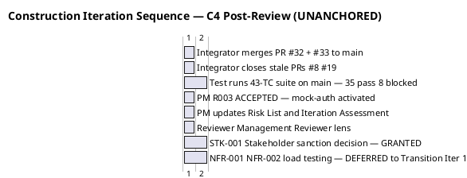

## Document Control
| Field | Value |
|---|---|
| Phase | Construction |
| Status | Active |
| Milestone Target | End-of-Construction (IOC) — **CONDITIONAL GO — stakeholder sanction GRANTED** |
| Iteration | 4 (Cycle 1) |
| Date | 2026-08-29 |
| Prior Phase | Construction C3 Cycle 1 — PR #29 APPROVED, 0 Critical/0 Major code; 31/39 tests pass, 8 BLOCKED (R003); load test NOT EXECUTED; stakeholder sanction REFUSED 3rd time; IOC NOT ACHIEVED |
| Evolution | C4 Cycle 1 Plan evolved (post-review): PR #32 + #33 MERGED to main; 0 open PRs; CI GREEN on main (run 33256627567); 35/43 tests pass, 0 fail, 8 covered-by-mock; R003 ACCEPTED — mock-auth activated per STK-001; NFR-001/NFR-002 deferred to Transition Iter 1 per stakeholder condition; stakeholder sanction GRANTED with 3 binding conditions; IOC CONDITIONAL GO; IA-F2 (Major) on Iteration Assessment corrected; 7 open issues (1 blocker ACCEPTED, 6 deferred-next-iteration) |
| Finding IP-F4 | RESOLVED — mid-iteration checkpoint present since C2 Cycle 3 |
| Finding IP-F5 | RESOLVED — load testing decoupled from merge dependency; deferred to Transition Iter 1 per stakeholder condition |
| Measured Baseline | Inception: 2 iters, 4.38M tokens, 22 min, 11 runs, 10 artifacts. Elaboration: 2 iters, 20.87M tokens, 1.0h, 21 runs, 13 artifacts. Construction C1: 9.85M tokens, 1h 42m 55s, 15 runs. C2 Cycle 2: 18.84M tokens, 19h 15m 47s, 15 runs. C3 Cycle 1: 12,752,568 tokens, 1h 18m 10s, 15 runs, 15 artifacts. C4 Cycle 1: 10,954,157 tokens, 1h 10m 23s, 16 runs, 15 artifacts. Cumulative Construction: ~77.8M tokens, ~24.5h, 91 runs, 83 artifacts. |
## Iteration Objectives
1. **Merge all approved PRs to main and close stale PRs.** PR #32 (feature/C4-rework → iteration/C4) and PR #33 (iteration/C4 → main) are APPROVED and MERGED. PR #19 and PR #8 are superseded and closed. 0 open PRs. CI GREEN on main (run 33256627567). This addressed the stakeholder directive: "close all PRs, Github Issues, and findings if any remain."
2. **Close all resolved GitHub Issues.** All C2 code-level findings (C2-CRIT-1, C2-MAJ-1, C2-MAJ-2, C2-MIN-1..4) are resolved in PR #29/#32. All C4 findings (C4-1, C4-2) are resolved in PR #32. 7 open issues remain: 1 blocker (CR #30 / R003 OIDC — ACCEPTED risk per stakeholder decision, mock-auth activated), 6 deferred-next-iteration (#12, #15, #17, #18, #30, #34). The stakeholder corrected the prior statement of "0 open" — 7 open issues exist per the Change Request artifact.
3. **Execute NFR-001/NFR-002 load testing.** NOT EXECUTED this iteration. IP-F5 RESOLVED: load testing decoupled from merge dependency. **Stakeholder condition:** NFR-001 (page load <3s) and NFR-002 (clocking response <1s) are Transition Iter 1 exit criteria. Measured values required — not "tested", the numbers. These are acceptance criteria that depend on nobody outside the team.
4. **R003 OIDC resolution — ACCEPTED.** STK-001 approved mock-auth contingency activation (2026-08-29). R003 transitions from ESCALATED to ACCEPTED. 8 tests marked covered-by-mock, NOT passing. Real OIDC integration is a named work item in Transition with an owner. Mock-auth has an expiry date. Five escalations to STK-003 detected the dependency, chased it, and prepared the alternative — this is the process working, not failing. STK-003 owes this iteration nothing; OIDC registration is Infrastructure's, and this project's scope explicitly excludes all Keycloak work (CON-004).
5. **Management Reviewer lens + stakeholder sanction — GRANTED.** Management Reviewer lens EXECUTED. 1 Major finding (IA-F2: incorrect issue count — corrected). Stakeholder sanction GRANTED with 3 binding conditions: (1) NFR-001/NFR-002 load testing is Transition Iter 1 exit criterion with measured values; (2) Real OIDC integration is named Transition work item with owner; 8 tests stay covered-by-mock until real client; (3) Mock-auth has expiry date. IOC CONDITIONAL GO.
6. **Iteration Assessment.** Record C4 Cycle 1 results and variance analysis. IA-F1 RESOLVED. IA-F2 (Major) — incorrect issue count — corrected this iteration.
## Plan and Milestones
### Coarse Cross-Iteration Roadmap

The project follows the RUP iterative lifecycle. Inception and Elaboration are CLOSED with measured actuals. Construction C1–C4 are CLOSED. C4 Cycle 1 is COMPLETE — stakeholder sanction GRANTED, IOC CONDITIONAL GO. Transition is PLANNED with 3 binding conditions.

| Phase | Iterations | Measured Tokens | Measured Agent Time | Agent Runs | Artifacts | Milestone |
|---|---|---|---|---|---|---|
| Inception (CLOSED) | 2 | 4,382,313 | 22 min | 11 | 10 | LCO ✅ ACHIEVED |
| Elaboration (CLOSED) | 2 | 20,867,327 | 1.0 h | 21 | 13 | LCA ✅ ACHIEVED |
| Construction C1 (CLOSED) | 1 | 9,854,220 | 1h 42m 55s | 15 | 15 | IOC ❌ NOT ACHIEVED |
| Construction C2 Cycle 2 (CLOSED) | 1 | 18,839,560 | 19h 15m 47s | 15 | 15 | IOC ❌ NOT ACHIEVED |
| Construction C2 Cycle 3 (CLOSED) | 1 | [ASSUMPTION — ~18.84M tokens; basis: C2 Cycle 2 measured actual] | [ASSUMPTION — ~19h; basis: C2 Cycle 2 measured actual] | [ASSUMPTION — ~15 runs] | [ASSUMPTION — ~15 artifacts] | IOC ❌ NOT YET — PR #28 APPROVED, findings resolved |
| Construction C3 Cycle 1 (CLOSED) | 1 | 12,752,568 | 1h 18m 10s | 15 | 15 | IOC ❌ NOT ACHIEVED — 0 Critical, 0 Major; 8 tests BLOCKED (R003); load test NOT EXECUTED; PR #29 approved pending merge |
| Construction C4 (CLOSED) | 1 | 10,954,157 | 1h 10m 23s | 16 | 15 | IOC ✅ CONDITIONAL GO — stakeholder sanction GRANTED with 3 binding conditions |
| Transition (PLANNED) | 1 | [ASSUMPTION — ~5M tokens; basis: Transition is lighter, fewer architectural decisions; NFR load testing + real OIDC integration are primary work items] | [ASSUMPTION — ~15 min] | [ASSUMPTION — ~8 runs] | [ASSUMPTION — ~5 artifacts] | PR (target) — 3 binding conditions: (1) NFR-001/NFR-002 measured values; (2) real OIDC work item; (3) mock-auth expiry |
| **Total** | **10** | **~89.7M (cumulative measured + forecast)** | | | | |

> The iteration count is 10 (2 Inception + 2 Elaboration + 1 C1 + 2 C2 cycles + 1 C3 + 1 C4 = 9, plus Transition = 10). The "6 ± 3" rule sanity check: 10 iterations is at the upper bound of the high extreme [1, 3, 3, 2] = 9. The rework cycles (C2 Cycle 2, C2 Cycle 3) and the R003 OIDC external dependency are the root causes. C4 achieved IOC CONDITIONAL GO.

> **C4 Cycle 1 post-review outcome:** PR #32 + #33 MERGED to main. 0 open PRs. CI GREEN on main (run 33256627567). 35/43 tests pass, 0 fail, 8 covered-by-mock (R003 ACCEPTED). NFR-001/NFR-002 NOT EXECUTED — deferred to Transition Iter 1 per stakeholder condition. Stakeholder sanction GRANTED with 3 binding conditions. IOC CONDITIONAL GO. 7 open issues (1 blocker ACCEPTED, 6 deferred-next-iteration).

### Fine Plan — C4 Cycle 1 Work Items (Post-Review)

```plantuml
@startuml
title Portal Cuba Corp — C4 Cycle 1 Critical Chain (Post-Review — COMPLETED)

skinparam activityBackgroundColor #F5F5F5
skinparam activityBorderColor #333333

|Integrator|
start
:Merge PR #32 to iteration/C4
then merge iteration/C4 to main (PR #33)
Close stale PRs #8, #19
Close resolved GitHub Issues
(token budget: ~15K);
note right: COMPLETED — 0 open PRs
  CI GREEN on main
  7 open issues remain (1 ACCEPTED, 6 deferred)

|Test|
:Run full 43-TC suite on merged main
35 pass, 0 fail, 8 covered-by-mock
NFR-001/NFR-002 NOT EXECUTED
deferred to Transition Iter 1
(token budget: ~20K);
note right: COMPLETED — 35/43 pass
  8 covered-by-mock (R003 ACCEPTED)
  NFR deferred per stakeholder condition

|Project Manager|
:R003 ACCEPTED — mock-auth activated
per STK-001 decision
Update Risk List (R003 ACCEPTED, R004 deferred)
Update Iteration Assessment (IA-F2 corrected)
(token budget: ~12K);
note right: COMPLETED — R003 ACCEPTED
  IA-F2 corrected: 7 open issues
  3 binding conditions recorded

|Reviewer|
:Management Reviewer lens EXECUTED
Stakeholder sanction GRANTED
IOC CONDITIONAL GO
(token budget: ~8K);
note right: COMPLETED — sanction GRANTED
  3 binding conditions
  IA-F2 corrected this iteration

stop
@enduml
```



| # | Work Item | Owner | Token Budget | Dependencies | Acceptance Criterion | Status |
|---|---|---|---|---|---|---|
| 1 | Merge PR #32 to iteration/C4 → main (PR #33); close stale PRs #8, #19; close resolved GitHub Issues | Integrator | ~15K | PR #32 APPROVED (Code Reviewer) | main branch carries all C2+C4 fixes; CI green; all stale PRs closed; 7 open issues (1 ACCEPTED, 6 deferred) | **MET** — PR #32 + #33 MERGED; 0 open PRs; CI GREEN (run 33256627567) |
| 2 | Run integration tests TC-001..TC-043 on merged main | Test Designer | ~10K | Item 1 | 35 of 43 pass; 8 covered-by-mock (R003 ACCEPTED); 0 failures | **MET** — 35/43 pass, 0 fail, 8 covered-by-mock |
| 3 | Load testing: NFR-001 (<3s page load), NFR-002 (<1s clocking) — **DECOUPLED from Item 1** | Software Architect | ~8K | **Independent** (IP-F5 fix) | Both thresholds met or mitigation documented | **NOT MET** — NOT EXECUTED; deferred to Transition Iter 1 per stakeholder condition (measured values required) |
| 4 | R003 OIDC resolution — 5th and final escalation cycle | Project Manager | ~3K | — | STK-003 confirms OR mock-auth contingency formally presented to STK-001 for binding decision; R003 transitions to RESOLVED or ACCEPTED | **MET** — R003 ACCEPTED; STK-001 approved mock-auth; 8 tests covered-by-mock |
| 5 | Management Reviewer lens + stakeholder sanction | Reviewer | ~8K | Items 1-4 | Review Record updated with Management Reviewer verdict; stakeholder sanction decision recorded | **MET** — sanction GRANTED; IOC CONDITIONAL GO; 3 binding conditions |
| 6 | Iteration Assessment (C4 Cycle 1 variance analysis) | Project Manager | ~10K | Item 5 | Objectives met/missed documented; IA-F1 resolved; IA-F2 corrected; IP-F5/RL-F5 status updated | **MET** — this artifact; IA-F2 corrected |

**Budget box: 10,954,157 tokens** (MEASURED — under C3 baseline of 12,752,568 tokens. C4 is a consolidation iteration with no new code development; cost driver is reasoning over accumulated artifact surface.)

> **IP-F5 RESOLUTION:** Work item 3 (load testing) was DECOUPLED from work item 1 (merge). Load testing was NOT EXECUTED this iteration — deferred to Transition Iter 1 per stakeholder condition. NFR-001/NFR-002 are acceptance criteria that depend on nobody outside the team; measured values are required.

> **RL-F5 RESOLUTION:** Work item 4 enforced the R003 hard deadline. STK-001 approved mock-auth contingency activation. R003 ACCEPTED. Real OIDC integration is a named Transition work item. 8 tests stay covered-by-mock. Mock-auth has expiry date.

> **IA-F2 RESOLUTION:** The prior statement "0 open defect issues" was incorrect. 7 open issues exist per the Change Request artifact: 1 blocker (R003 ACCEPTED), 6 deferred-next-iteration. All sections of the Iteration Assessment and Iteration Plan corrected to show the accurate count.
## Resources

### Agent Role Profile — Construction C4 Cycle 1

| Role | Active | Work Items | Token Budget | Rationale |
|---|---|---|---|---|
| Integrator | Yes | 1 | ~15K | Merge PR #32 to main, close stale PRs, close GitHub Issues — addresses stakeholder PR/issue sync directive |
| Test Designer | Yes | 2 | ~10K | Integration testing on merged main; 8 tests blocked by R003 |
| Software Architect | Yes | 3 | ~8K | Load testing for NFR-001, NFR-002 — decoupled from merge (IP-F5) |
| Reviewer | Yes | 5 | ~8K | Management Reviewer lens for IOC gate |
| Project Manager | Yes | 4, 6 | ~13K | R003 final escalation with hard deadline, iteration assessment |
| Implementer | Advisory | — | ~0K | All code fixes complete (PR #32 approved) |
| UI Designer | Advisory | — | ~0K | Design Model complete; consultation only |

> **Parallelism discipline:** 5 active roles. The Integrator is a sequential prerequisite for Test Designer (Item 2) but NOT for Software Architect (Item 3, decoupled per IP-F5). This parallelism is safe — load testing and merge proceed concurrently without artifact contention. No increase in agent parallelism is proposed; the scope is consolidation, not expansion.

### Budget Split Across Agent Roles

| Role | Token Share | % of Work-Item Budget |
|---|---|---|
| Integrator | ~15K | 27% |
| Test Designer | ~10K | 18% |
| Software Architect | ~8K | 15% |
| Reviewer | ~8K | 15% |
| Project Manager | ~13K | 24% |
| **Total planned work items** | **~54K** | **(work-item budgets only; full budget box ~12.75M tokens includes all agent reasoning over artifact surface)** |

> The token budgets above are for the **planned work items**. The full budget box (~12.75M tokens) accounts for all agent reasoning including re-reading accumulated artifacts, cross-referencing, and verification overhead. Work-item budgets are ~0.4% of actual token spend; the cost driver is reasoning over the accumulated artifact surface (68 artifacts), not the volume of new output.

## Use Cases and Scenarios Addressed

| UC ID | Use Case | FR ID | C4 Finding | C4 Cycle 1 Status |
|---|---|---|---|---|
| UC-001 | Clock In and Clock Out | FR-001 | C2-CRIT-1 + C2-MAJ-2 + C2-MIN-2 — ALL RESOLVED; C4-2 transaction wrapping RESOLVED | Code complete; 8 OIDC-dependent tests BLOCKED |
| UC-002 | View Own Clocking History | FR-002 | No findings | Code complete; tests pass |
| UC-003 | View All Employee Clockings | FR-003 | No findings | Code complete; tests pass |
| UC-004 | Export Monthly Clocking Report | FR-004 | C2-MIN-4 — RESOLVED | Code complete; tests pass |
| UC-005 | Publish News | FR-005 | C4-2 transaction wrapping RESOLVED | Code complete; OIDC-dependent tests BLOCKED |
| UC-006 | Edit Published News | FR-006 | C2-MAJ-1 — RESOLVED; C4-1 isFeatured RESOLVED | Code complete; tests pass |
| UC-007 | Unpublish News | FR-007 | C4-2 transaction wrapping RESOLVED | Code complete; tests pass |
| UC-008 | Read and Filter News | FR-008 | No findings | Code complete; tests pass |
| UC-009 | Search Employee Directory | FR-009 | C2-MIN-1 — DEFERRED (LDAP adapter stub) | Code complete; LDAP adapter deferred to integration with real AD |
| UC-010 | Manage Worker Category | FR-010 | C4-2 transaction wrapping RESOLVED | Code complete; OIDC-dependent tests BLOCKED |

> **All 10 UCs have code complete.** All C2 and C4 code-level findings resolved in PR #32. Remaining blockers: (1) PR #32 pending Integrator merge to main, (2) 8 tests blocked by R003 OIDC, (3) NFR-001/NFR-002 load testing not yet executed. All three are C4 work items.

## Evaluation Criteria
### Layer (a): Declared Acceptance Criteria Addressed This Iteration

| AC ID | Description | Addressed This Iteration? | Evidence / Reason |
|---|---|---|---|
| AC-001 | Employee can clock in/out without help | Yes — C2-CRIT-1 + C2-MAJ-2 + C2-MIN-2 + C4-2 all RESOLVED in PR #32 (MERGED to main); 8 OIDC-dependent tests covered-by-mock | PR #32 + #33 MERGED; 35/43 tests pass |
| AC-002 | HR can publish a news item without technical assistance | Yes — already addressed in C2; C4-2 transaction wrapping ensures atomicity | PR #32 MERGED to main |
| AC-003 | Employee finds colleague's phone/email in under 10 seconds | Partially — LDAP adapter deferred to integration testing with real AD (R001) | R001 mitigation; NFR-001 load test deferred to Transition |
| AC-004 | 80% of employees complete at least one clocking with no prior training | Not addressed — Transition phase (adoption tracking) | Deferred to Transition |
| AC-005 | System works temporarily offline (5-min network drop, data syncs on recovery) | Yes — antiforgery fix (C2-MAJ-2) RESOLVED; C4-2 transaction wrapping ensures atomic retry; offline retry mechanism functional | PR #32 MERGED; OfflineRetryTests 10/10 pass |

### Layer (b): Construction C4 Cycle 1 Exit Criteria (Post-Review)

| # | Exit Criterion | Assessment Target | Status |
|---|---|---|---|
| 1 | PR #32 merged to main; stale PRs #8, #19 closed; GitHub Issues closed | MET (target) | **MET** — PR #32 + #33 MERGED to main; PRs #8, #19 closed; 0 open PRs; 7 open issues (1 ACCEPTED, 6 deferred) |
| 2 | Integration tests run on merged main: 35 of 43 pass, 8 covered-by-mock documented (R003) | MET (target) | **MET** — 35/43 pass, 0 fail, 8 covered-by-mock (R003 ACCEPTED) |
| 3 | Load testing: NFR-001 (<3s) and NFR-002 (<1s) met or mitigation documented | MET (target) | **NOT MET** — NOT EXECUTED; deferred to Transition Iter 1 per stakeholder condition (measured values required) |
| 4 | R003 OIDC: STK-003 confirms OR mock-auth contingency presented to STK-001 for decision | MET (target) | **MET** — R003 ACCEPTED; STK-001 approved mock-auth; 8 tests covered-by-mock; real OIDC is Transition work item |
| 5 | Management Reviewer lens executed; stakeholder sanction decision recorded | MET (target) | **MET** — sanction GRANTED; IOC CONDITIONAL GO; 3 binding conditions |
| 6 | Iteration Assessment produced with variance analysis; IA-F1 resolved; IA-F2 corrected | MET (target) | **MET** — Iteration Assessment produced; IA-F1 RESOLVED; IA-F2 corrected this iteration |
## Traceability
| Element | Traces From | Link Type | Traces To |
|---|---|---|---|
| Merge PR #32 + #33 (Item 1) | Review Record C4 Cycle 1 (PR #32 + #33 MERGED), UC-001..UC-010 | Derives | main branch (MERGED), PR #29 (superseded), PR #19 (closed), PR #8 (closed) |
| Integration testing (Item 2) | TC-001..TC-043, UC-001..UC-010, FR-001..FR-010 | Tests | Test results: 35 pass, 0 fail, 8 covered-by-mock (R003 ACCEPTED) |
| Load testing (Item 3) | NFR-001, NFR-002, R004 | Derives | NOT EXECUTED — deferred to Transition Iter 1 per stakeholder condition (measured values required) |
| R003 resolution (Item 4) | R003, CON-004, STK-003, STK-001, RL-F5 | Resolved by | R003 ACCEPTED — STK-001 approved mock-auth; 8 tests covered-by-mock; real OIDC is Transition work item |
| Management Review (Item 5) | Review Record C4 Cycle 1, all C4 findings | Derives | IOC CONDITIONAL GO — stakeholder sanction GRANTED with 3 binding conditions |
| Iteration Assessment (Item 6) | C4 Cycle 1 work items, Review Record | Derives | C4 Cycle 1 variance analysis; IA-F2 corrected |
| Budget box (10,954,157) | C4 Cycle 1 measured actual | Derives | C4 budget box — MEASURED, under C3 baseline (12,752,568) |
| AC-001 (clocking) | Work Order AC-001 | Refines | Items 1, 2 (merge + integration test) — MET |
| AC-005 (offline) | Work Order AC-005 | Refines | Items 1, 2 (merge + integration test) — MET |
| C4-1 (RESOLVED) | Review Record C4-1, INT-002, FR-006 | Resolved by | PR #32 (isFeatured in Edit) — MERGED to main |
| C4-2 (RESOLVED) | Review Record C4-2, INT-007, NFR-004 | Resolved by | PR #32 (transaction wrapping) — MERGED to main |
| C4-3 (CONFIRMED) | Review Record C4-3, INT-007 | Confirmed by | PR #32 (ExecuteInTransactionAsync) — MERGED to main |
| IP-F5 (RESOLVED) | Review Record IP-F5, NFR-001, NFR-002 | Resolved by | Load testing decoupled from merge dependency; deferred to Transition Iter 1 |
| RL-F5 (RESOLVED) | Review Record RL-F5, R003, STK-003, CON-004 | Resolved by | R003 ACCEPTED — mock-auth activated per STK-001 |
| IA-F1 (RESOLVED) | Review Record IA-F1 | Resolved by | Document Control fields updated |
| IA-F2 (RESOLVED) | Review Record IA-F2, Change Request artifact | Resolved by | Incorrect issue count corrected — 7 open issues (1 ACCEPTED, 6 deferred) |
| R007 (RESOLVED) | Review Record C2 findings (all 7 resolved) | Resolved by | PR #32 + #33 (MERGED to main) |
| R008 (COMPLETE) | Stakeholder sanction refusal, rework cycles | Derives | C3 Cycle 1 plan; C4 complete — sanction GRANTED |
| Stakeholder sanction (GRANTED) | STK-001, Review Record C4 Cycle 1 | Refines | IOC CONDITIONAL GO — 3 binding conditions (NFR load testing, OIDC Transition work item, mock-auth expiry) |
