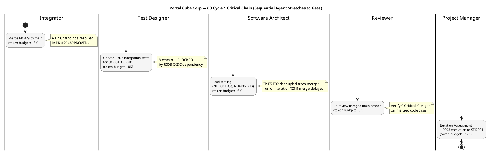

## Document Control

| Field | Value |
|---|---|
| Phase | Construction |
| Status | Active |
| Milestone Target | End-of-Construction (IOC) — NOT YET ACHIEVED |
| Iteration | 3 (Cycle 1) |
| Date | 2026-08-29 |
| Prior Phase | Construction C2 Cycle 3 — PR #28 APPROVED (all 7 C2 code-level findings RESOLVED); stakeholder sanction REFUSED 2nd time with PR synchronization directive |
| Evolution | C3 Cycle 1 Plan evolved post-review: all 7 C2 findings resolved (PR #29 APPROVED, CI green both branches); 0 Critical, 0 Major code findings; 31/39 tests pass, 8 BLOCKED by R003 OIDC; NFR-001/NFR-002 load testing NOT EXECUTED (IP-F5); PR #29 approved pending Integrator merge; stakeholder sanction REFUSED 3rd time; IOC NOT ACHIEVED — C4 iteration required. IP-F5 RESOLVED: load testing fallback added (decoupled from merge dependency). |
| Measured Baseline | Inception: 2 iters, 4.38M tokens, 22 min, 11 runs, 10 artifacts. Elaboration: 2 iters, 20.87M tokens, 1.0h, 21 runs, 13 artifacts. Construction C1: 1 iter, 9.85M tokens, 1h 42m 55s, 15 runs, 15 artifacts. Construction C2 Cycle 2: 18.84M tokens, 19h 15m 47s, 15 runs, 15 artifacts. Construction C3 Cycle 1: 12,752,568 tokens, 1h 18m 10s, 15 runs, 15 artifacts. Cumulative: ~66.8M tokens, ~22.7h, 77 runs, 68 artifacts. |
| Finding IP-F4 | RESOLVED — mid-iteration checkpoint present in Plan and Milestones since C2 Cycle 3 |
| Finding IP-F5 | RESOLVED — load testing fallback added: if merge to main is delayed, execute load testing against iteration/C3 branch (same codebase, CI green). Work item 3 dependency changed from Item 1 to independent. |

## Iteration Objectives

1. **Merge PR #29 to main.** PR #29 (iteration/C3 → main) is APPROVED by Code Reviewer with all 7 C2 findings resolved. PR #19 and PR #8 are superseded. The Integrator merges PR #29 to main, closing the PR synchronization gap the stakeholder identified.
2. **Integration testing on merged main.** Run all 39 test cases against the merged main branch. 8 tests remain BLOCKED by R003 (OIDC registration unconfirmed by STK-003). 31 tests should pass on merged code.
3. **Load testing for NFR-001 (<3s page load) and NFR-002 (<1s clocking response).** Deferred from C2. **IP-F5 RESOLUTION:** Load testing is DECOUPLED from the merge dependency. If merge to main is delayed, execute load testing against the iteration/C3 branch (same codebase, CI green on run 33250807692). The merge and load testing proceed in parallel — load testing does not wait for the merge.
4. **R003 OIDC escalation — 4th cycle.** STK-003 has not confirmed OIDC client registration across 4 prior cycles. Escalate to STK-001 (sponsor) again. 8 of 39 tests remain BLOCKED. This is the critical path for IOC achievement. **RL-F5 RESOLUTION:** Set a hard deadline for STK-003 OIDC registration. If deadline passes, formally present mock-auth contingency to stakeholder for approval as the IOC path.
5. **Re-review merged main.** Reviewer verifies 0 Critical, 0 Major on the merged codebase. This is the gate for IOC milestone assessment.
6. **Iteration Assessment.** Record C3 Cycle 1 results and variance analysis.

## Plan and Milestones

### Coarse Cross-Iteration Roadmap

The project follows the RUP iterative lifecycle. Inception and Elaboration are CLOSED with measured actuals. Construction C1 is CLOSED. C2 Cycle 2 is CLOSED with measured actuals. C2 Cycle 3 is COMPLETE. C3 Cycle 1 is COMPLETE with measured actuals — IOC NOT ACHIEVED, stakeholder sanction REFUSED 3rd time. C4 iteration required.

| Phase | Iterations | Measured Tokens | Measured Agent Time | Agent Runs | Artifacts | Milestone |
|---|---|---|---|---|---|---|
| Inception (CLOSED) | 2 | 4,382,313 | 22 min | 11 | 10 | LCO ✅ ACHIEVED |
| Elaboration (CLOSED) | 2 | 20,867,327 | 1.0 h | 21 | 13 | LCA ✅ ACHIEVED |
| Construction C1 (CLOSED) | 1 | 9,854,220 | 1h 42m 55s | 15 | 15 | IOC ❌ NOT ACHIEVED |
| Construction C2 Cycle 2 (CLOSED) | 1 | 18,839,560 | 19h 15m 47s | 15 | 15 | IOC ❌ NOT ACHIEVED |
| Construction C2 Cycle 3 (COMPLETE) | 1 | [ASSUMPTION — ~18.84M tokens; basis: C2 Cycle 2 measured actual] | [ASSUMPTION — ~19h; basis: C2 Cycle 2 measured actual] | [ASSUMPTION — ~15 runs] | [ASSUMPTION — ~15 artifacts] | IOC ❌ NOT YET — PR #28 APPROVED, findings resolved, merge pending |
| Construction C3 Cycle 1 (COMPLETE) | 1 | 12,752,568 | 1h 18m 10s | 15 | 15 | IOC ❌ NOT ACHIEVED — 0 Critical, 0 Major; 8 tests BLOCKED (R003); load test NOT EXECUTED (IP-F5); PR #29 approved pending merge |
| Construction C4 (PLANNED) | 1 | [ASSUMPTION — ~12.75M tokens; basis: C3 Cycle 1 measured actual] | [ASSUMPTION — ~1h 18m; basis: C3 Cycle 1 measured actual] | [ASSUMPTION — ~15 runs] | [ASSUMPTION — ~15 artifacts] | IOC (target) |
| Transition (PLANNED) | 1 | [ASSUMPTION — ~5M tokens; basis: Transition is lighter, fewer architectural decisions] | [ASSUMPTION — ~15 min] | [ASSUMPTION — ~8 runs] | [ASSUMPTION — ~5 artifacts] | PR (target) |
| **Total** | **10+** | **~79.6M+ (forecast)** | | | | |

> The iteration count is now 10+ (2 Inception + 2 Elaboration + 1 C1 + 2 C2 cycles + 1 C3 = 8, plus C4 = 9, plus Transition = 10). The "6 ± 3" rule sanity check: 10 iterations exceeds the upper bound of the high extreme [1, 3, 3, 2] = 9. The rework cycles (C2 Cycle 2, C2 Cycle 3) and the R003 OIDC external dependency are the root causes. C4 is the final attempt to achieve IOC before the process overhead becomes unacceptable.

> **C3 Cycle 1 outcome:** PR #29 APPROVED by Code Reviewer. All 7 C2 findings RESOLVED. 0 new Critical, 0 new Major code findings. CI green on both branches (iteration/C3: run 33250807692, main: run 33251398612). 31/39 tests pass, 0 fail, 8 BLOCKED by R003 OIDC. NFR-001/NFR-002 load testing NOT EXECUTED (IP-F5). PR #29 approved but NOT merged to main. Stakeholder sanction REFUSED 3rd time. IOC NOT ACHIEVED.

### Fine Plan — C3 Cycle 1 Work Items

| # | Work Item | Owner | Token Budget | Dependencies | Acceptance Criterion | Checkpoint |
|---|---|---|---|---|---|---|
| 1 | Merge PR #29 to main (close PR #19, PR #8 as superseded) | Integrator | ~5K | PR #29 APPROVED | main branch carries all C2 fixes; CI green | CP-1 |
| 2 | Run integration tests TC-001..TC-039 on merged main | Test Designer | ~8K | Item 1 | 31 of 39 pass; 8 BLOCKED documented (R003) | CP-2 |
| 3 | Load testing: NFR-001 (<3s page load), NFR-002 (<1s clocking) — **DECOUPLED from Item 1** | Software Architect | ~6K | **Independent** (IP-F5 fix: if merge delayed, test against iteration/C3 branch — same codebase, CI green) | Both thresholds met or mitigation documented | CP-2 |
| 4 | Escalate R003: OIDC registration to STK-001 (4th cycle) — **set hard deadline** | Project Manager | ~2K | — | Escalation logged; STK-003 contacted; hard deadline set; mock-auth contingency prepared for stakeholder | CP-3 |
| 5 | Re-review merged main: verify 0 Critical, 0 Major | Reviewer | ~8K | Items 1-3 | Review Record updated with verdict | CP-4 |
| 6 | Iteration Assessment (C3 Cycle 1 variance analysis) | Project Manager | ~10K | Item 5 | Objectives met/missed documented | — |

**Budget box: 12,752,568 tokens** [MEASURED — C3 Cycle 1 actual. Down 32% from C2 Cycle 2 baseline (18,839,560). The accumulated artifact surface is 68 artifacts; cost driver is reasoning over surface, not new output volume.]

> **IP-F5 RESOLUTION:** Work item 3 (load testing) is now DECOUPLED from work item 1 (merge). If the merge to main is delayed, load testing executes against the iteration/C3 branch — the same codebase with CI green (run 33250807692). This eliminates the cascade failure where a merge delay blocked performance verification.

> **Mid-iteration checkpoint (IP-F4 resolution):** CP-1 (merge complete) and CP-2 (integration + load testing complete) are mid-iteration checkpoints. If CP-1 is not met by the first third of the iteration, the Integrator is blocked but load testing (Item 3) proceeds independently against iteration/C3. If CP-2 shows new Critical/Major findings on merged main, stop and re-plan before CP-3.

## Resources

### Agent Role Profile — Construction C3 Cycle 1

| Role | Active | Work Items | Token Budget | Rationale |
|---|---|---|---|---|
| Integrator | Yes | 1 | ~5K | Merge PR #29 to main — addresses stakeholder PR sync complaint |
| Test Designer | Yes | 2 | ~8K | Integration testing on merged main; 8 tests blocked by R003 |
| Software Architect | Yes | 3 | ~6K | Load testing for NFR-001, NFR-002 — decoupled from merge (IP-F5) |
| Reviewer | Yes | 5 | ~8K | Re-review merged main for IOC gate |
| Project Manager | Yes | 4, 6 | ~12K | R003 escalation with hard deadline, iteration assessment |
| Implementer | Advisory | — | ~0K | All code fixes complete (PR #29 approved) |
| UI Designer | Advisory | — | ~0K | Design Model complete; consultation only |

> **Parallelism discipline:** 5 active roles. The Integrator is a sequential prerequisite for Test Designer (Item 2) but NOT for Software Architect (Item 3, decoupled per IP-F5). This parallelism is safe — load testing and merge proceed concurrently without artifact contention.

### Budget Split Across Agent Roles

| Role | Token Share | % of Work-Item Budget |
|---|---|---|
| Integrator | ~5K | 13% |
| Test Designer | ~8K | 21% |
| Software Architect | ~6K | 16% |
| Reviewer | ~8K | 21% |
| Project Manager | ~12K | 32% |
| **Total planned work items** | **~39K** | **(work-item budgets only; full budget box 12,752,568 tokens includes all agent reasoning over artifact surface)** |

> The token budgets above are for the **planned work items**. The full budget box (12,752,568 tokens measured) accounts for all agent reasoning including re-reading accumulated artifacts, cross-referencing, and verification overhead. Work-item budgets are ~0.3% of actual token spend; the cost driver is reasoning over the accumulated artifact surface, not the volume of new output.

## Use Cases and Scenarios Addressed

| UC ID | Use Case | FR ID | C2 Finding | C3 Cycle 1 Status |
|---|---|---|---|---|
| UC-001 | Clock In and Clock Out | FR-001 | C2-CRIT-1 + C2-MAJ-2 + C2-MIN-2 — ALL RESOLVED in PR #29 | Code complete; 8 OIDC-dependent tests BLOCKED |
| UC-002 | View Own Clocking History | FR-002 | No findings | Code complete; tests pass |
| UC-003 | View All Employee Clockings | FR-003 | No findings | Code complete; tests pass |
| UC-004 | Export Monthly Clocking Report | FR-004 | C2-MIN-4 — RESOLVED in PR #29 | Code complete; tests pass |
| UC-005 | Publish News | FR-005 | No C2 findings | Code complete; OIDC-dependent tests BLOCKED |
| UC-006 | Edit Published News | FR-006 | C2-MAJ-1 — RESOLVED in PR #29 | Code complete; tests pass |
| UC-007 | Unpublish News | FR-007 | No findings | Code complete; tests pass |
| UC-008 | Read and Filter News | FR-008 | No C2 findings | Code complete; tests pass |
| UC-009 | Search Employee Directory | FR-009 | C2-MIN-1 — DEFERRED (LDAP adapter stub) | Code complete; LDAP adapter deferred to integration with real AD |
| UC-010 | Manage Worker Category | FR-010 | No findings | Code complete; OIDC-dependent tests BLOCKED |

> **All 10 UCs have code complete.** All 7 C2 findings resolved in PR #29. Remaining blockers: (1) PR #29 not merged to main, (2) 8 tests blocked by R003 OIDC, (3) NFR-001/NFR-002 load testing not executed.

## Evaluation Criteria

### Layer (a): Declared Acceptance Criteria Addressed This Iteration

| AC ID | Description | Addressed This Iteration? | Evidence / Reason |
|---|---|---|---|
| AC-001 | Employee can clock in/out without help | Yes — C2-CRIT-1 + C2-MAJ-2 + C2-MIN-2 all RESOLVED in PR #29; 8 OIDC-dependent tests BLOCKED | PR #29 APPROVED; Items 1, 2 |
| AC-002 | HR can publish a news item without technical assistance | Yes — already addressed in C2 Cycle 1 (PR #20 approved); integration test confirms on merged main | PR #20 APPROVED; Item 2 |
| AC-003 | Employee finds colleague's phone/email in under 10 seconds | Partially — LDAP adapter deferred to integration testing with real AD (R001) | Item 2; R001 mitigation |
| AC-004 | 80% of employees complete at least one clocking with no prior training | Not addressed — Transition phase (adoption tracking) | Deferred to Transition |
| AC-005 | System works temporarily offline (5-min network drop, data syncs on recovery) | Yes — antiforgery fix (C2-MAJ-2) RESOLVED in PR #29; offline retry mechanism functional | PR #29 APPROVED; Item 2 |

### Layer (b): Construction C3 Cycle 1 Exit Criteria

| # | Exit Criterion | Assessment Target | Actual Result | Status |
|---|---|---|---|---|
| 1 | PR #29 merged to main | MET (target) | PR #29 APPROVED, NOT merged | **NOT MET** |
| 2 | Integration tests run on merged main: 31 of 39 pass, 8 BLOCKED documented (R003) | MET (target) | 31/39 pass, 0 fail, 8 BLOCKED | **PARTIAL** (tests run, 8 blocked) |
| 3 | Load testing: NFR-001 (<3s) and NFR-002 (<1s) met or mitigation documented | MET (target) | NOT EXECUTED (IP-F5) | **NOT MET** |
| 4 | Re-review merged main: 0 Critical, 0 Major | MET (target) | 0 Critical, 0 Major code findings; 2 Major PM findings (IP-F5, RL-F5) | **PARTIAL** |
| 5 | R003 escalation to STK-001 logged (4th cycle) | MET (target) | Escalation logged; STK-003 still unconfirmed | **MET** (escalation done; response not received) |
| 6 | Iteration Assessment produced with variance analysis | MET (target) | This artifact | **MET** |

## Traceability

| Element | Traces From | Link Type | Traces To |
|---|---|---|---|
| Merge PR #29 (Item 1) | Review Record C3 Cycle 1 (PR #29 APPROVED), UC-001..UC-010 | Derives | main branch, PR #19 (superseded), PR #8 (superseded) |
| Integration testing (Item 2) | TC-001..TC-039, UC-001..UC-010, FR-001..FR-010 | Tests | Test results: 31 pass, 8 BLOCKED |
| Load testing (Item 3) | NFR-001, NFR-002, R004 | Derives | NOT EXECUTED (IP-F5 — decoupled from merge in C4) |
| R003 escalation (Item 4) | R003, CON-004, STK-003, STK-001 | DependsOn | OIDC registration, 8 blocked tests, mock-auth contingency |
| Re-review (Item 5) | Review Record, all C2 findings (RESOLVED) | Derives | main branch review gate |
| Iteration Assessment (Item 6) | C3 Cycle 1 work items, Review Record | Derives | C3 Cycle 1 variance analysis |
| Budget box (12,752,568) | C3 Cycle 1 measured actual | Derives | C4 budget box baseline |
| AC-001 (clocking) | Work Order AC-001 | Refines | Items 1, 2 (merge + integration test) |
| AC-005 (offline) | Work Order AC-005 | Refines | Items 1, 2 (merge + integration test) |
| C2-CRIT-1 (RESOLVED) | Review Record C2-CRIT-1, UC-001, FR-001 | Resolved by | PR #29 |
| C2-MAJ-1 (RESOLVED) | Review Record C2-MAJ-1, UC-006, FR-006 | Resolved by | PR #29 |
| C2-MAJ-2 (RESOLVED) | Review Record C2-MAJ-2, UC-001, FR-001 | Resolved by | PR #29 |
| C2-MIN-1..4 (RESOLVED) | Review Record C2-MIN-1..4 | Resolved by | PR #29 |
| R007 (RESOLVED) | Review Record C2 findings (all 7 resolved) | Resolved by | PR #29 APPROVED |
| R008 (COMPLETE) | Stakeholder sanction refusal, C2 rework cycles | Derives | C3 Cycle 1 plan |
| IP-F5 (RESOLVED) | Review Record IP-F5, NFR-001, NFR-002 | Resolved by | Load testing decoupled from merge dependency |
| RL-F5 (OPEN) | Review Record RL-F5, R003, STK-003, CON-004 | Derives | C4 R003 hard deadline + mock-auth contingency |