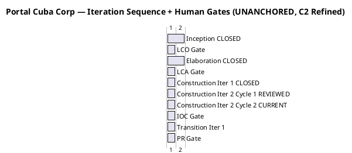
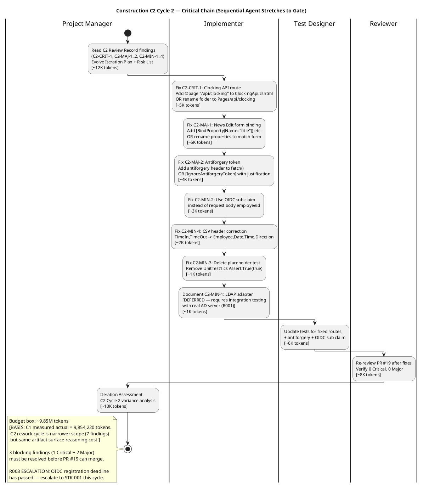

## Document Control

| Field | Value |
|---|---|
| Phase | Construction |
| Status | Active |
| Milestone Target | End-of-Construction (IOC) |
| Iteration | 2 (Cycle 2) |
| Date | 2026-08-28 |
| Prior Phase | Construction C1 (REQUEST_CHANGES — 1 Major, 4 Minor; IOC NOT achieved; stakeholder sanction REFUSED) |
| Evolution | Construction C1 Plan evolved for C2 Cycle 2: coarse roadmap updated with C1 measured actuals (9.85M tokens, 1h 42m 55s); fine plan replaced with C2 rework scope (fix C2-CRIT-1 + C2-MAJ-1..2 + C2-MIN-1..4 from PR #19 Review Record); budget box sized from C1 measured actual; R003 escalation triggered (OIDC deadline passed) |
| Measured Baseline | Inception: 2 iters, 4.38M tokens, 22 min, 11 runs, 10 artifacts. Elaboration: 2 iters, 20.87M tokens, 1.0h, 21 runs, 13 artifacts. Construction C1: 1 iter, 9.85M tokens, 1h 42m 55s, 15 runs, 15 artifacts. Cumulative: 35.10M tokens, 3.1h, 47 runs, 38 artifacts. |

## Iteration Objectives

1. **Fix C2-CRIT-1 (Critical): Clocking API route mismatch.** JS calls `fetch('/api/clocking')` but Razor Page routes to `/Api/ClockingApi`. UC-001 is non-functional (404). Fix: add `@page "/api/clocking"` to ClockingApi.cshtml, OR move to API controller, OR rename page folder to `Pages/api/clocking.cshtml`.
2. **Fix C2-MAJ-1 (Major): News Edit form field name mismatch.** Form posts `title`, `body`, `category` but BindProperties are `EditTitle`, `EditBody`, `EditCategory`. UC-006 is non-functional. Fix: add `[BindProperty(Name = "title")]` etc., OR rename properties, OR change form field names.
3. **Fix C2-MAJ-2 (Major): Missing antiforgery token on clocking POST.** `fetch()` POST has no anti-forgery token. Razor Pages validates by default — POST rejected with 400. Fix: add antiforgery token to fetch headers, OR `[IgnoreAntiforgeryToken]` with justification (OIDC bearer auth + idempotency key).
4. **Fix C2-MIN-2 (Minor): EmployeeId spoofable from request body.** API accepts `employeeId` from request body — client can spoof identity. Fix: use `User.FindFirst("sub")?.Value` instead of `request.EmployeeId`.
5. **Fix C2-MIN-4 (Minor): CSV header misleading.** Header says `TimeIn,TimeOut` but data has single time + Direction. Fix: change header to `Employee,Date,Time,Direction`.
6. **Fix C2-MIN-3 (Minor): Placeholder test.** `Assert.True(true)` in UnitTest1.cs. Fix: delete UnitTest1.cs (CR-014).
7. **Document C2-MIN-1 (Minor): LDAP adapter NotImplementedException.** All methods throw `NotImplementedException`. Known deferred to integration testing (R001). Fix: document as `[DEFERRED — requires integration testing with real AD server (R001)]`.
8. **Re-review PR #19 after fixes:** Reviewer re-evaluates; CI must pass green; target 0 Critical, 0 Major.
9. **Escalate R003 (OIDC registration):** Escalation deadline has passed. Escalate to STK-001 (sponsor) for STK-003 OIDC client registration. 8 of 30 tests remain BLOCKED without it.

## Plan and Milestones

### Coarse Cross-Iteration Roadmap

The project follows the RUP iterative lifecycle. Inception and Elaboration are CLOSED with measured actuals. Construction C1 is CLOSED with measured actuals. C2 Cycle 1 has been reviewed (PR #20 approved, PR #19 requires rework). C2 Cycle 2 is the current rework cycle. The coarse roadmap is now baselined from C1 measured actuals.

| Phase | Iterations | Measured Tokens | Measured Agent Time | Agent Runs | Artifacts | Milestone |
|---|---|---|---|---|---|---|
| Inception (CLOSED) | 2 | 4,382,313 | 22 min | 11 | 10 | LCO ✅ ACHIEVED |
| Elaboration (CLOSED) | 2 | 20,867,327 | 1.0 h | 21 | 13 | LCA ✅ ACHIEVED |
| Construction C1 (CLOSED) | 1 | 9,854,220 | 1h 42m 55s | 15 | 15 | IOC ❌ NOT ACHIEVED |
| Construction C2 (CURRENT) | 1+ cycles | [ASSUMPTION — ~9.85M tokens/cycle; basis: C1 measured actual] | [ASSUMPTION — ~1h 43m/cycle; basis: C1 measured actual] | [ASSUMPTION — ~15 runs/cycle] | [ASSUMPTION — ~15 artifacts] | IOC (target) |
| Transition (PLANNED) | 1 | [ASSUMPTION — ~5M tokens; basis: Transition is lighter, fewer architectural decisions] | [ASSUMPTION — ~15 min] | [ASSUMPTION — ~8 runs] | [ASSUMPTION — ~5 artifacts] | PR (target) |
| **Total** | **7+** | **~40M+ (forecast)** | | | | |

> The iteration count has increased beyond the original 7 due to C1 scope delivery failure (5 of 7 objectives deferred) and C2 review findings (1 Critical + 2 Major blocking). The "6 ± 3" rule sanity check: 7+ iterations is within the high extreme [1, 3, 3, 2] for a project with significant integration dependencies. The rework cycle does not add a full iteration — it is a cycle within C2.

### Iteration Sequence + Human Gates

> Gates are quoted in **days of queue time** (human waiting, not agent working). Agent work is denominated in tokens and measured elapsed time — never added to gate time.

### Fine Gantt — Construction C2 Cycle 2 Critical Chain

### Construction C2 Cycle 2 — Work Items

| # | Work Item | Owner | Token Budget | Depends On | Acceptance Criterion |
|---|---|---|---|---|---|
| 1 | Fix C2-CRIT-1: Clocking API route — add `@page "/api/clocking"` or rename folder | Implementer | ~5K | Review Record C2 | UC-001 functional (no 404) |
| 2 | Fix C2-MAJ-1: News Edit form binding — `[BindProperty(Name="title")]` etc. | Implementer | ~5K | — | UC-006 functional (form posts succeed) |
| 3 | Fix C2-MAJ-2: Antiforgery token on clocking POST | Implementer | ~4K | Item 1 | POST accepted (no 400) |
| 4 | Fix C2-MIN-2: Use OIDC sub claim instead of request body employeeId | Implementer | ~3K | — | Identity not spoofable |
| 5 | Fix C2-MIN-4: CSV header → `Employee,Date,Time,Direction` | Implementer | ~2K | — | FR-004 export correct |
| 6 | Fix C2-MIN-3: Delete UnitTest1.cs placeholder test | Implementer | ~1K | — | No placeholder tests |
| 7 | Document C2-MIN-1: LDAP adapter as `[DEFERRED — requires integration testing with real AD server (R001)]` | Implementer | ~1K | — | Deferred status documented |
| 8 | Update tests for fixed routes + antiforgery + OIDC sub claim | Test Designer | ~6K | Items 1-4 | Tests pass with fixes |
| 9 | Re-review PR #19 after fixes | Reviewer | ~8K | Items 1-8 | 0 Critical, 0 Major open |
| 10 | Escalate R003: OIDC registration to STK-001 (sponsor) | Project Manager | ~2K | — | Escalation logged; STK-003 contacted |
| 11 | Iteration Assessment (C2 Cycle 2 variance analysis) | Project Manager | ~10K | Item 9 | Objectives met/missed documented |

**Budget box: ~9.85M tokens** [BASIS: C1 measured actual = 9,854,220 tokens. C2 rework cycle is narrower in scope (7 findings vs 16 work items in C1) but the accumulated artifact surface is larger (38 artifacts vs 23), so reasoning-over-surface cost is comparable. The box is fixed; scope adapts.]

> The budget box is fixed. If work does not fit, overflow defers to the next cycle. Scope adapts to the box; the box does not grow to fit scope.

## Resources

### Agent Role Profile — Construction C2 Cycle 2

| Role | Active | Work Items | Token Budget | Rationale |
|---|---|---|---|---|
| Project Manager | Yes | 10, 11 | ~14K | Plan, escalate R003, assess iteration |
| Implementer | Yes | 1-7 | ~21K | Fix all 7 C2 findings (3 blocking + 4 minor) |
| Test Designer | Yes | 8 | ~6K | Update tests for fixed code |
| Reviewer | Yes | 9 | ~8K | Re-review PR #19 after fixes |
| Software Architect | Advisory | — | ~0K | Architecture baseline stable; consultation only |
| UI Designer | Advisory | — | ~0K | Design Model complete; consultation only |

> **Parallelism discipline:** 4 active roles — same as C1. No increase in parallelism. The rework cycle is narrower in scope; the constraint is sequential dependency (fixes → test update → re-review), not parallel capacity.

### Budget Split Across Agent Roles

| Role | Token Share | % of Work-Item Budget |
|---|---|---|
| Implementer | ~21K | 38% |
| Project Manager | ~14K | 25% |
| Reviewer | ~8K | 15% |
| Test Designer | ~6K | 11% |
| **Total planned work items** | **~49K** | **(work-item budgets only; full budget box ~9.85M includes all agent reasoning over artifact surface)** |

> The token budgets above are for the **planned work items** — the specific code, test, and review tasks. The full budget box (~9.85M) accounts for all agent reasoning including re-reading accumulated artifacts, cross-referencing, and verification overhead. C1 measured actuals showed that work-item budgets were ~0.5% of actual token spend; the cost driver is reasoning over the accumulated artifact surface, not the volume of new output.

## Use Cases and Scenarios Addressed

| UC ID | Use Case | FR ID | C1 Status | C2 Cycle 1 Status | C2 Cycle 2 Action |
|---|---|---|---|---|---|
| UC-001 | Clock In and Clock Out | FR-001 | Presentation + service implemented | **C2-CRIT-1: 404 route mismatch** + **C2-MAJ-2: antiforgery 400** + **C2-MIN-2: employeeId spoofable** | Fix route + antiforgery + sub claim (Items 1, 3, 4) |
| UC-002 | View Own Clocking History | FR-002 | Presentation + service implemented | No findings | — |
| UC-003 | View All Employee Clockings | FR-003 | Presentation + service implemented | No findings | — |
| UC-004 | Export Monthly Clocking Report | FR-004 | Presentation + service implemented | **C2-MIN-4: CSV header misleading** | Fix CSV header (Item 5) |
| UC-005 | Publish News | FR-005 | MAJOR-1 RESOLVED (PR #20) | No new findings | — |
| UC-006 | Edit Published News | FR-006 | Service implemented | **C2-MAJ-1: form field name mismatch** | Fix form binding (Item 2) |
| UC-007 | Unpublish News | FR-007 | Service implemented | No findings | — |
| UC-008 | Read and Filter News | FR-008 | MAJOR-1 RESOLVED (PR #20) | No new findings | — |
| UC-009 | Search Employee Directory | FR-009 | MINOR-1 RESOLVED (PR #20) | **C2-MIN-1: LDAP adapter NotImplementedException** | Document as DEFERRED (Item 7) |
| UC-010 | Manage Worker Category | FR-010 | Service implemented | No findings | — |

> **C2-MIN-3 (placeholder test):** Not tied to a specific UC — CR-014 cleanup. Delete UnitTest1.cs (Item 6).

## Evaluation Criteria

### Layer (a): Declared Acceptance Criteria Addressed This Iteration

| AC ID | Description | Addressed This Iteration? | Evidence / Reason |
|---|---|---|---|
| AC-001 | Employee can clock in/out without help | Yes — C2-CRIT-1 + C2-MAJ-2 + C2-MIN-2 fixes make UC-001 functional | Items 1, 3, 4: route fix, antiforgery, sub claim |
| AC-002 | HR can publish a news item without technical assistance | No — already addressed in C2 Cycle 1 (PR #20 approved, MAJOR-1 resolved) | PR #20 APPROVED |
| AC-003 | Employee finds colleague's phone/email in under 10 seconds | Partially — LDAP adapter deferred to integration testing (C2-MIN-1) | Item 7: DEFERRED documentation |
| AC-004 | 80% of employees complete at least one clocking with no prior training | Not addressed — Transition phase (adoption tracking) | Deferred to Transition |
| AC-005 | System works temporarily offline (5-min network drop, data syncs on recovery) | Partially — antiforgery fix (Item 3) enables POST; offline retry mechanism already implemented | Item 3: antiforgery token fix |

### Layer (b): Construction C2 Cycle 2 Exit Criteria

| # | Exit Criterion | Assessment Target | Evidence Required |
|---|---|---|---|
| 1 | C2-CRIT-1 resolved — Clocking API route matches fetch URL | MET | Code review confirms no 404; UC-001 functional |
| 2 | C2-MAJ-1 resolved — News Edit form binding matches field names | MET | Code review confirms form posts succeed; UC-006 functional |
| 3 | C2-MAJ-2 resolved — Antiforgery token present or justified exemption | MET | Code review confirms POST accepted (no 400) |
| 4 | C2-MIN-2 resolved — EmployeeId from OIDC sub claim, not request body | MET | Code review confirms identity not spoofable |
| 5 | C2-MIN-4 resolved — CSV header correct (Employee,Date,Time,Direction) | MET | Code review confirms FR-004 export correct |
| 6 | C2-MIN-3 resolved — UnitTest1.cs placeholder deleted | MET | No Assert.True(true) in test suite |
| 7 | C2-MIN-1 documented — LDAP adapter DEFERRED status annotated | MET | Code carries [DEFERRED] annotation |
| 8 | CI build passes green | MET | scm_get_build_status confirms PASS |
| 9 | Re-review PR #19: 0 Critical, 0 Major | MET | Review Record updated |
| 10 | R003 escalation to STK-001 logged | MET | Escalation recorded in Risk List |
| 11 | Iteration Assessment produced with variance analysis | MET | This artifact at iteration close |

## Traceability

| Element | Traces From | Link Type | Traces To |
|---|---|---|---|
| C2-CRIT-1 fix (Item 1) | Review Record C2-CRIT-1, UC-001, FR-001, AC-001 | Derives | ClockingApi.cshtml, clocking-retry.js |
| C2-MAJ-1 fix (Item 2) | Review Record C2-MAJ-1, UC-006, FR-006 | Derives | News/Edit.cshtml, News/Edit.cshtml.cs |
| C2-MAJ-2 fix (Item 3) | Review Record C2-MAJ-2, UC-001, FR-001, AC-001 | Derives | clocking-retry.js, Index.cshtml |
| C2-MIN-2 fix (Item 4) | Review Record C2-MIN-2, SEC-001, CON-004 | Derives | ClockingApi.cshtml.cs |
| C2-MIN-4 fix (Item 5) | Review Record C2-MIN-4, FR-004, CR-012 | Derives | ClockingService.cs (ExportCsv) |
| C2-MIN-3 fix (Item 6) | Review Record C2-MIN-3, CR-014 | Derives | UnitTest1.cs (deleted) |
| C2-MIN-1 doc (Item 7) | Review Record C2-MIN-1, R001, CON-005 | DependsOn | NovellLdapConnectionAdapter.cs |
| Test update (Item 8) | Items 1-4, TC-001..TC-030 | Tests | Updated test files in tests/ |
| Re-review (Item 9) | Review Record PR #19, all C2 findings | Derives | PR #19 merge gate |
| R003 escalation (Item 10) | R003, CON-004, STK-003, STK-001 | DependsOn | OIDC registration, 8 blocked tests |
| Budget box (~9.85M) | C1 measured actual (9,854,220 tokens) | Derives | C2 Cycle 2 Assessment (measured vs planned) |
| AC-001 (clocking) | Work Order AC-001 | Refines | Items 1, 3, 4 (route + antiforgery + sub claim) |
| AC-005 (offline) | Work Order AC-005 | Refines | Item 3 (antiforgery enables POST retry) |
| MAJOR-1 (C1, RESOLVED) | Review Record C1 MAJOR-1, FR-008, CR-010 | Resolved by | PR #19, PR #20 |
| MINOR-1 (C1, RESOLVED) | Review Record C1 MINOR-1, FR-009, CR-015 | Resolved by | PR #19, PR #20 |
| MINOR-3 (C1, RESOLVED) | Review Record C1 MINOR-3, AC-005, CR-011 | Resolved by | PR #19, PR #20 |
| MINOR-4 (C1, RESOLVED) | Review Record C1 MINOR-4, CR-011, CR-018 | Resolved by | PR #19, PR #20 |