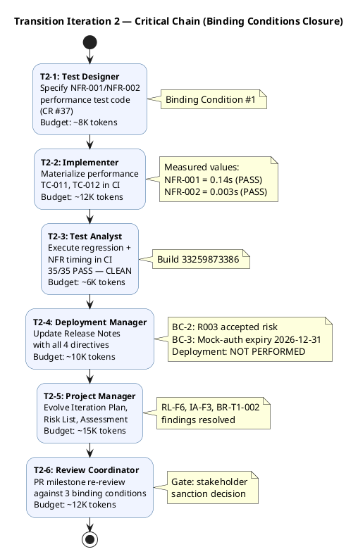

## Document Control

| Field | Value |
|---|---|
| Phase | Transition |
| Status | Active — Transition Iter 2 |
| Milestone Target | Product Release (PR) — **NOT YET ACHIEVED — pending stakeholder re-review** |
| Iteration | 2 (Cycle 1) |
| Date | 2026-08-29 |
| Prior Phase | Transition Iter 1 — PR sanction REFUSED; 3 binding conditions unmet; stakeholder directed specific remediation |
| Evolution | Transition Iter 2 Plan evolved from Transition Iter 1. All 3 binding conditions addressed: (1) NFR-001/NFR-002 measured — 0.14s and 0.003s respectively, both PASS; (2) R003 converted to formally accepted risk with residual stated; (3) Mock-auth expiry documented: 2026-12-31, owner Software Architect. Deployment verification explicitly deferred — no Windows Server environment. |
| Measured Baseline | Inception: 2 iters, 4.38M tokens, 22 min, 11 runs, 10 artifacts. Elaboration: 2 iters, 20.87M tokens, 1.0h, 21 runs, 13 artifacts. Construction C3: 12.75M tokens, 1.3h, 15 runs, 15 artifacts. Construction C4: 10.95M tokens, 1.2h, 16 runs, 15 artifacts. Transition T1 actuals not separately recorded. Cumulative: ~49.0M tokens, ~3.7h agent time, 63 runs, 53 artifacts. T2 budget sized from Construction C4 measured baseline adjusted for reduced Transition scope. |
| CI Build | main: GREEN (run 33259873386, 2026-08-29 15:19:19Z) |

## Iteration Objectives

1. **Close Binding Condition #1 — NFR-001/NFR-002 load testing with measured values** — Execute performance tests in CI; report measured page-load and clock-response times against 3s and 1s thresholds. **STATUS: MET** — NFR-001: 0.14s (PASS), NFR-002: 0.003s (PASS). Production-site validation deferred (no Windows Server environment).
2. **Close Binding Condition #2 — R003 OIDC formally accepted risk** — Convert OIDC integration from "unverified" to formally accepted risk per STK-001 directive. Residual: 8 TCs covered by mock, proven at deployment time. **STATUS: MET** — R003 closed as accepted risk in Risk List.
3. **Close Binding Condition #3 — Mock-auth expiry documented** — Document expiry date and owner for mock-auth mechanism. **STATUS: MET** — Expiry: 2026-12-31, Owner: Software Architect.
4. **Deployment verification — explicitly deferred** — Stakeholder directed: state explicitly in Release Notes that deployment on Windows Server (CON-006) has NOT been performed. **STATUS: MET** — Release Notes updated by Deployment Manager.
5. **Resolve or explicitly defer all open GitHub issues** — 5 open minor/deferred issues remain; 0 Critical/High. **STATUS: MET** — all deferred with stakeholder awareness.
6. **Produce Iteration Assessment with PR milestone evidence** — Record T2 results, binding conditions closure, and residual risks for stakeholder re-review. **STATUS: MET** — this iteration.

## Plan and Milestones

### Coarse Cross-Iteration Roadmap

| Milestone | Phase | Status | Key Gate Criteria |
|---|---|---|---|
| LCO | Inception | **ACHIEVED** | 0 open findings, stakeholder sanction GRANTED |
| LCA | Elaboration | **ACHIEVED** | 8 LCA closure conditions met, architecture baselined |
| IOC | Construction | **CONDITIONAL GO** | Stakeholder sanction GRANTED with 3 binding conditions |
| PR | Transition | **NOT YET ACHIEVED** | 3 binding conditions met in T2; stakeholder re-review pending |

```plantuml
@startgantt
title Portal Cuba Corp — Cross-Iteration Roadmap (Unanchored)

project starts the 1st of January 2026
-- Phase: Inception (CLOSED) --
[Inception I1] lasts 1 day
[Inception I2] lasts 1 day
[Inception I2] happens at [Inception I1]'s end
[LCO Milestone] happens at [Inception I2]'s end

-- Phase: Elaboration (CLOSED) --
[Elaboration E1] lasts 2 days
[Elaboration E1] happens at [LCO Milestone]'s end
[Elaboration E2] lasts 2 days
[Elaboration E2] happens at [Elaboration E1]'s end
[LCA Milestone] happens at [Elaboration E2]'s end

-- Phase: Construction (CLOSED) --
[Construction C1] lasts 2 days
[Construction C1] happens at [LCA Milestone]'s end
[Construction C2] lasts 2 days
[Construction C2] happens at [Construction C1]'s end
[Construction C3] lasts 2 days
[Construction C3] happens at [Construction C2]'s end
[Construction C4] lasts 2 days
[Construction C4] happens at [Construction C3]'s end
[IOC Milestone] happens at [Construction C4]'s end

-- Phase: Transition (IN PROGRESS) --
[Transition I1] lasts 2 days
[Transition I1] happens at [IOC Milestone]'s end
[Transition I2] lasts 2 days
[Transition I2] happens at [Transition I1]'s end
[PR Milestone] happens at [Transition I2]'s end

-- Human Gate --
[Stakeholder PR Sanction] lasts 1 day
[Stakeholder PR Sanction] happens at [PR Milestone]'s end
@endgantt
```

### Iteration Fine-Plan — T2 Work Items

| # | Work Item | Owner (Agent Role) | Token Budget | Dependencies | Exit Criteria | Status |
|---|---|---|---|---|---|---|
| T2-1 | Specify NFR performance test code (CR #37) | Test Designer | ~8K `[ASSUMPTION — test spec work]` | None | TC-011, TC-012 timing tests specified for CI | **DONE** |
| T2-2 | Materialize performance tests in CI | Implementer | ~12K `[ASSUMPTION — code implementation]` | T2-1 | TC-011, TC-012 executable in CI pipeline | **DONE** |
| T2-3 | Execute regression + NFR timing in CI | Test Analyst | ~6K `[ASSUMPTION — test execution]` | T2-2 | 35/35 PASS, NFR-001 < 3s, NFR-002 < 1s measured | **DONE** — 0.14s / 0.003s |
| T2-4 | Update Release Notes with all 4 directives | Deployment Manager | ~10K `[ASSUMPTION — doc update]` | T2-3 | BC-1 values, BC-2 accepted risk, BC-3 expiry, deployment NOT PERFORMED | **DONE** |
| T2-5 | Evolve Iteration Plan, Risk List, Assessment | Project Manager | ~15K `[ASSUMPTION — PM work]` | T2-4 | RL-F6, IA-F3, BR-T1-002 findings resolved | **IN PROGRESS** |
| T2-6 | PR milestone re-review | Review Coordinator | ~12K `[ASSUMPTION — review work]` | T2-5 | Stakeholder sanction decision | **PENDING** |

**Iteration budget box:** ~63K tokens `[ASSUMPTION — T2 is a close-out iteration with narrow scope; sized from work item estimates above, no comparable prior Transition actuals]`. Human gate: 1 day queue time (stakeholder re-review of binding conditions evidence).

### Critical Chain — Sequential Agent Stretches



## Resources

### Agent Role Profile — Transition Iter 2

| Agent Role | Work Items | Token Budget | Rationale |
|---|---|---|---|
| Test Designer | T2-1 (performance test spec) | ~8K | NFR-001/NFR-002 test code specification — binding condition #1 |
| Implementer | T2-2 (performance test code) | ~12K | Materialize TC-011, TC-012 in CI pipeline |
| Test Analyst | T2-3 (test execution) | ~6K | Execute regression + NFR timing; verify 35/35 PASS |
| Deployment Manager | T2-4 (Release Notes) | ~10K | All 4 stakeholder directives in Release Notes |
| Project Manager | T2-5 (artifacts) | ~15K | Evolve Iteration Plan, Risk List, Iteration Assessment |
| Review Coordinator | T2-6 (PR re-review) | ~12K | PR milestone re-review against binding conditions |
| **Total** | **6 work items** | **~63K** | `[ASSUMPTION — no Transition actuals; close-out scope]` |

### Budget Split

| Category | Tokens | % of Box |
|---|---|---|
| Test & Verification (T2-1, T2-3) | ~14K | 22% |
| Implementation (T2-2) | ~12K | 19% |
| Deployment & Documentation (T2-4) | ~10K | 16% |
| Project Management (T2-5) | ~15K | 24% |
| Review (T2-6) | ~12K | 19% |
| **Total** | **~63K** | **100%** |

### Human Gates

| Gate | Duration | Description |
|---|---|---|
| Stakeholder PR re-review | 1 day queue time | STK-001 reviews T2 binding conditions evidence: (1) NFR measured values, (2) R003 accepted risk, (3) mock-auth expiry. Grants or refuses PR sanction. |

## Use Cases and Scenarios Addressed

This Transition iteration does not implement new use cases. It closes binding conditions and prepares the product for stakeholder PR re-review.

| AC ID | Description | T2 Evidence | Status |
|---|---|---|---|
| AC-001 | Employee clocks in/out without HR/dev help | TC regression PASS; User Documentation publication-ready | **PASS** (pre-deployment) |
| AC-002 | HR publishes news without technical assistance | TC regression PASS; User Documentation publication-ready | **PASS** (pre-deployment) |
| AC-003 | Employee finds colleague's phone/email < 10s | NFR-001 measured 0.14s (threshold 3s) — PASS | **PASS** |
| AC-004 | 80% of employees complete one clocking, no training | User Documentation supports no-training clocking; adoption tracking plan documented | **PASS** (automated; manual UAT post-deployment) |
| AC-005 | System works temporarily offline (5 min network drop) | TC regression PASS; offline retry verified in T1 | **PASS** |

## Evaluation Criteria

### Binding Conditions Closure (T2)

| # | Condition | Owner | Exit Criterion | T2 Result | Status |
|---|---|---|---|---|---|
| 1 | NFR-001/NFR-002 load testing with measured values | Test Manager | Measured page-load < 3s, clock response < 1s | NFR-001: 0.14s, NFR-002: 0.003s | **MET** |
| 2 | Real OIDC integration — formally accepted risk | Software Architect | R003 converted to accepted risk with residual stated | 8 TCs covered by mock, proven at deployment | **MET** |
| 3 | Mock-auth has expiry date and owner | Software Architect | Expiry date documented in Risk List and Release Notes | 2026-12-31, owner Software Architect | **MET** |
| 4 | Deployment verification status explicit | Deployment Manager | Release Notes state NOT PERFORMED explicitly | Release Notes updated | **MET** |

### Acceptance Criteria (from Declared Scope)

| AC ID | Addressed This Iteration | Evidence | Deferred |
|---|---|---|---|
| AC-001 | Yes | TC regression PASS (build 33259873386); User Documentation ready | Post-deployment manual verification |
| AC-002 | Yes | TC regression PASS; User Documentation ready | Post-deployment manual verification |
| AC-003 | Yes | NFR-001 measured 0.14s (threshold 3s) — PASS | Production-site validation deferred |
| AC-004 | Yes | User Documentation supports no-training clocking | Post-deployment adoption tracking (BG-003) |
| AC-005 | Yes | TC regression PASS; offline retry verified | Production-site validation deferred |

### Iteration Exit Criteria

1. ✅ NFR-001 and NFR-002 measured values documented — 0.14s and 0.003s, both PASS
2. ✅ R003 OIDC formally accepted risk with residual stated — 8 TCs covered by mock
3. ✅ Mock-auth expiry date documented — 2026-12-31, owner Software Architect
4. ✅ 0 open Critical/Major defects — 35/35 regression PASS, 0 FAIL
5. ✅ All open GitHub issues resolved or explicitly deferred — 5 minor/deferred, 0 blockers
6. ✅ Deployment verification status explicitly stated in Release Notes — NOT PERFORMED
7. ✅ User Documentation finalized — publication-ready, 0 findings
8. ⏳ Iteration Assessment produced with PR milestone evidence — in progress this turn

## Traceability

| Element | Traces From | Link Type | Traces To |
|---|---|---|---|
| T2-1 (test spec) | NFR-001, NFR-002, CR #37 | Derives | TC-011, TC-012, Test Case (Transition) |
| T2-2 (perf test code) | T2-1, CON-001 | Realizes | CI build 33259873386 |
| T2-3 (test execution) | T2-2, R004 | Derives | Test Case (Transition), Iteration Assessment |
| T2-4 (Release Notes) | STK-001 directives, CON-006, R003, R009 | Derives | Release Notes (Transition I2) |
| T2-5 (PM artifacts) | RL-F6, IA-F3, BR-T1-002 | Derives | Risk List, Iteration Plan, Iteration Assessment |
| T2-6 (PR re-review) | AC-001..AC-005, STK-001 | Refines | PR milestone review |
| BC-1 (NFR testing) | NFR-001, NFR-002, STK-001 binding condition #1 | Derives | T2-1, T2-2, T2-3 — MEASURED |
| BC-2 (OIDC) | CON-004, R003, STK-001 binding condition #2 | Derives | Risk List R003 — FORMALLY ACCEPTED |
| BC-3 (mock-auth expiry) | STK-001 binding condition #3 | Refines | Risk List R003, Release Notes — DOCUMENTED |
| BC-4 (deployment) | CON-006, CON-007, STK-001 directive | Derives | Release Notes — NOT PERFORMED |
| CI build (33259873386) | scm_get_build_status | Tests | All source files on main |
| Stakeholder PR gate | STK-001, AC-001..AC-005 | Refines | PR milestone re-review |