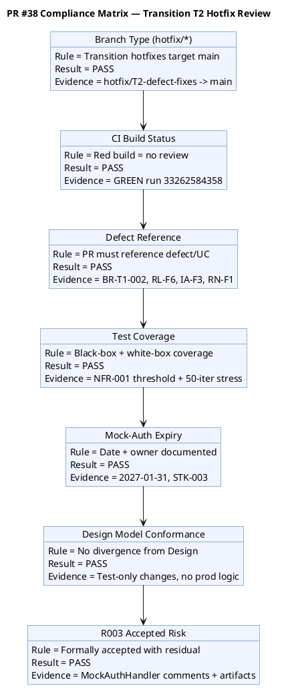
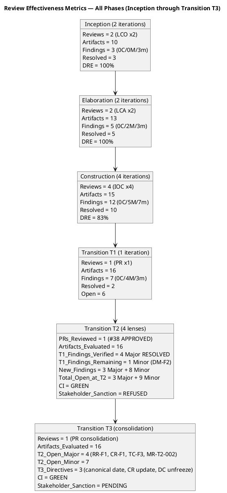
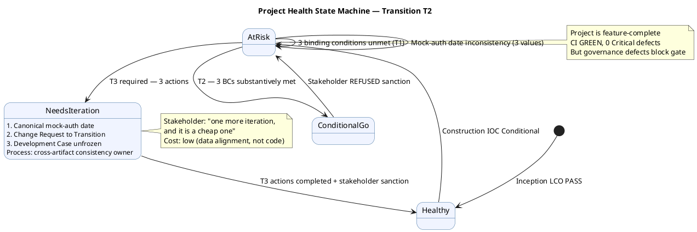
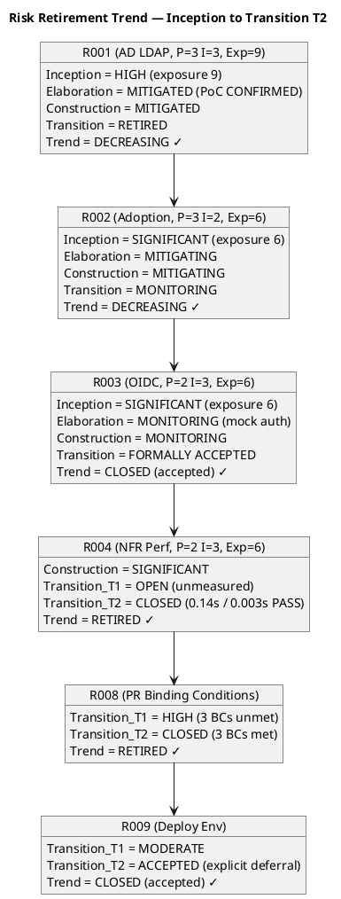
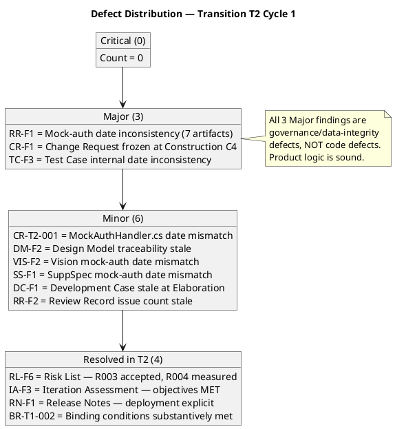

## Document Control
| Field | Value |
|---|---|
| Phase | Transition |
| Status | **EVOLVED — Transition Iteration 3 Cycle 1 (Review Coordinator consolidation — PR milestone)** |
| Milestone Target | Product Release (PR) — **NOT YET ACHIEVED — stakeholder sanction REFUSED (T2); T3 consolidation in progress** |
| Iteration | 3 (Cycle 1) |
| Date | 2026-08-30 |
| Prior Phase | Transition T2 Cycle 1 — PR sanction REFUSED; 3 binding conditions substantively met but mock-auth date inconsistent across 7 artifacts (3 dates, 2 owners); 3 open Major + 9 open Minor findings; stakeholder directed 3 T3 actions |
| Technical Lens (Reviewer) T2 | **EXECUTED — T2 Cycle 1.** 0 Critical, 3 Major (RR-F1, CR-F1, TC-F3), 5 Minor. All 16 artifacts evaluated. CI GREEN on main (run 33262804733). 0 open PRs. 9 open issues. Disposition: ACCEPTED WITH CONDITIONS. |
| Business Lens (Business Reviewer) T2 | **EXECUTED — T2 Cycle 1.** 0 Critical, 0 Major, 1 Minor (BR-T2-001). Prior findings RESOLVED. Disposition: APPROVED from business lens. |
| Management Lens (Management Reviewer) T2 | **EXECUTED — T2 Cycle 1.** 0 Critical, 1 Major (MR-T2-002), 1 Minor (MR-T2-001). Prior MR findings RESOLVED. Disposition: CONDITIONAL — T3 required. |
| Code Reviewer T2 | **EXECUTED — T2 Cycle 1.** 0 Critical, 0 Major, 1 Minor (CR-T2-001). PR #38 APPROVED. CI GREEN. |
| T3 Consolidation | **Review Coordinator consolidation of T2 cross-lens findings.** Open findings verified via API (read_artifact_findings) across all 16 artifacts. 0 open Critical, 4 open Major (MR-T2-002 on Review Record, CR-F1 on Change Request, TC-F3 on Test Case, RL-F6 on Risk List), 4+ open Minor (MR-T2-001 on Vision, DC-F1 on Development Case, SS-F1 on Supplementary Specification, DM-F2 on Design Model). T3 directives from stakeholder: (1) ONE canonical mock-auth expiry date and owner, (2) Change Request updated to Transition + Issue #37 CCB triage, (3) Development Case unfrozen. Process observation: cross-artifact canonical-value protocol needed. |
| Stakeholder PR Sanction (T1) | **REFUSED** — 3 binding conditions unmet |
| Stakeholder PR Sanction (T2) | **REFUSED** — binding conditions met but mock-auth date inconsistent across 7 artifacts; 3 T3 directives issued |
| Stakeholder PR Sanction (T3) | **PENDING** — T3 consolidation in progress; open Major findings must be resolved before stakeholder re-review |
| Evolution | Transition T3 Review Record evolved from T2. Review Coordinator consolidating cross-lens findings for PR milestone gate. Open Major findings block PR sanction. |
## Review Scope and Criteria

### Scope

This review covers the **Product Release (PR) milestone** — the final quality gate of the Transition phase. Per RUP Ch.4 Transition: "Achieve final product baseline as rapidly and cost-effectively as practical." Per the Additional Instructions: "for fixing bugs, implementation and testing are usually enough" — the Reviewer performs abbreviated code review on hotfix PRs, verifying defect reference, test coverage, and CI status.

**T2 Cycle 1 — Product Acceptance Lens (Reviewer) Scope:**

| Item | Detail |
|---|---|
| Artifacts Evaluated | 16 (all project artifacts) |
| CI Build (main) | GREEN (run 33262804733, 2026-08-29 16:24:02Z) |
| Open PRs | 0 (all merged — PR #38 APPROVED and merged by Code Reviewer) |
| Open Issues | 9 (0 Critical/High; 1 cr:logged-not-approved #37; 8 deferred/minor) |
| Binding Conditions | BC-1 MET (NFR measured), BC-2 MET (R003 accepted), BC-3 MET with defect (date inconsistent), BC-4 MET (deployment deferred) |
| Evaluation Type | Product Acceptance — exit criteria lens for PR milestone |

**T2 Cycle 1 — Management Lens (Management Reviewer) Scope:**

| Item | Detail |
|---|---|
| Artifacts Evaluated | Iteration Assessment, Release Notes, Vision, Risk List, Review Record |
| CI Build (main) | GREEN (run 33262804733) |
| Open PRs | 0 |
| Open Issues | 9 (0 Critical/High) |
| Binding Conditions | BC-1 MET, BC-2 MET, BC-3 MET-WITH-DEFECT, BC-4 MET |
| Evaluation Type | Lifecycle Milestone Review — PR exit criteria + Project Acceptance |
| Prior MR Findings | 3 (RL-F6 Major, IA-F3 Major, RN-F1 Major) — ALL RESOLVED in T2 |
| New MR Findings | 2 (MR-T2-002 Major: cross-artifact governance gap, MR-T2-001 Minor: Vision date) |
| Stakeholder Consultation | EXECUTED — sanction REFUSED; T3 directed |

**T2 Cycle 1 — Code Reviewer Scope (preserved):**

| Item | Detail |
|---|---|
| PR Reviewed | #38 (hotfix/T2-defect-fixes → main) |
| Files Changed | 4 (Program.cs, MockAuthHandler.cs, PerformanceTests.cs, PortalCubaCorp.Tests.csproj) |
| Additions/Deletions | 367 / 1 |
| CI Build | GREEN (run 33262584358, 2026-08-29 16:18:08Z) |
| Branch Type | hotfix/* (canonical for Transition per docs/BRANCHING_STRATEGY.md) |
| Binding Conditions Addressed | BC-1 (NFR-001/002 load testing), BC-3 (mock-auth expiry), BC-2 (R003 accepted risk — artifact-level) |

**T1 Cycle 1 — Full PR Milestone Review Scope (preserved from T1):**

| # | Artifact | Phase | Status | Priority |
|---|---|---|---|---|
| 1 | Release Notes | Transition | Draft | PR Required |
| 2 | User Documentation | Transition | Draft | PR Required |
| 3 | Design Model | Construction | Approved | PR Expected |
| 4 | Review Record | Transition | Draft | This artifact |
| 5 | Risk List | Transition | Draft | PR Expected |
| 6 | Iteration Plan | Transition | Draft | PR Expected |
| 7 | Iteration Assessment | Transition | Draft | NOT flagged (PM authors post-review) |
| 8 | Vision | Transition | Approved | Final state |
| 9 | Use-Case Model | Transition | Approved | Final state |
| 10 | Supplementary Specification | Transition | Approved | Final state |
| 11 | Test Case | Transition | Draft | Final state |
| 12 | Change Request | Construction | Approved | Final state |
| 13 | Software Architecture Document | Construction | Approved | Final state |
| 14 | Test Evaluation Summary | Elaboration | Approved | Final state |
| 15 | Architectural Proof-of-Concept | Elaboration | Approved | Final state |
| 16 | Development Case | Elaboration | Approved | Final state |

### SCM Release Evidence (T2 — Reviewer Lens)

| Evidence | Status | Detail |
|---|---|---|
| CI Build (main) | ✅ GREEN | Run 33262804733, completed 2026-08-29 16:24:02Z |
| Open Pull Requests | ✅ 0 | All merged — PR #38 APPROVED by Code Reviewer and merged |
| Open Critical/High Defects | ✅ 0 | No release-blocking defects |
| Open Issues (total) | 9 | #39 (T2 release close), #37 (NFR CR — cr:logged, NOT approved), #36 (T1 release close), #34, #18, #17, #15, #12, #5 (all deferred/minor) |
| R003 OIDC | ACCEPTED | Formally accepted risk per STK-001 directive; 8 TCs covered by mock |
| Governance Gap | ⚠️ | Issue #37 (NFR performance test CR) is cr:logged but never CCB-approved — work was executed without formal CR approval |

### Product Acceptance Compliance Matrix — T2 Cycle 1 (Reviewer Lens)

```plantuml
@startuml
title Product Acceptance Compliance Matrix — Transition T2 Cycle 1

skinparam classAttributeIconSize 0
skinparam classBackgroundColor #F0F4FF
skinparam classBorderColor #336699
skinparam shadowing false

class "Release Notes" as RN {
  + Deployment status explicit : PASS
  + NFR measured values : PASS
  + R003 accepted risk : PASS
  + Mock-auth expiry : PASS (2026-12-31)
  + Known defects classified : PASS
  + Stakeholder-ready : PASS
  + Verdict : APPROVED
}

class "Risk List" as RL {
  + R003 formally accepted : PASS
  + R004 measured and closed : PASS
  + R008 closed (3 BCs met) : PASS
  + R009 deferred explicit : PASS
  + All risks current : PASS
  + Verdict : APPROVED
}

class "Review Record" as RR {
  + T1 findings resolved : PASS
  + T2 Code Reviewer lens : PASS
  + Issue count current : FAIL (stale: 7 vs 9)
  + Mock-auth date consistent : FAIL (2027-01-31 in CR section)
  + Verdict : NEEDS REWORK
}

class "Iteration Assessment" as IA {
  + Objectives MET/NOT MET : PASS
  + BC-1 NFR measured : PASS
  + BC-2 R003 accepted : PASS
  + BC-3 Mock-auth expiry : PASS
  + Deployment deferred : PASS
  + Verdict : APPROVED
}

class "User Documentation" as UD {
  + UC coverage (UC-001..UC-010) : PASS
  + Troubleshooting included : PASS
  + Operations guide updated : PASS
  + Publication-ready : PASS
  + Verdict : APPROVED
}

class "Test Case" as TC {
  + 43 TCs (35 PASS, 8 BLOCKED) : PASS
  + NFR-001 measured 0.14s : PASS
  + NFR-002 measured 0.003s : PASS
  + All 5 ACs PASS : PASS
  + Mock-auth date internal : FAIL (2026-11-29 vs 2026-12-31)
  + Verdict : NEEDS REWORK
}

class "Vision" as VIS {
  + Features match delivered : PASS
  + Mock-auth date : FAIL (2027-01-31)
  + Verdict : NEEDS REWORK (Minor)
}

class "Supplementary Spec" as SS {
  + NFR baseline valid : PASS
  + Mock-auth date : FAIL (2027-01-31)
  + Verdict : NEEDS REWORK (Minor)
}

class "Change Request" as CR {
  + Phase current : FAIL (Construction C4)
  + Issue #37 governance : FAIL (cr:logged, not approved)
  + Issue #39 documented : FAIL (missing)
  + Open issues table : FAIL (stale)
  + Verdict : NEEDS REWORK
}

class "Development Case" as DC {
  + Baseline conformance : PASS
  + Optional triggers : FAIL (PoC PENDING stale)
  + Status : FAIL (Draft at PR)
  + Verdict : NEEDS REWORK (Minor)
}

class "Iteration Plan" as IP {
  + T2 objectives : PASS
  + Measured baseline : PASS
  + Verdict : APPROVED
}

class "Use-Case Model" as UCM {
  + All 10 UCs delivered : PASS
  + Status Approved : PASS
  + Verdict : APPROVED
}

class "Design Model" as DM {
  + Status Approved : PASS
  + DM-F2 (Code Reviewer) : OPEN (not this lens)
  + Verdict : APPROVED (this lens)
}

class "SAD" as SAD {
  + Status Approved : PASS
  + Architecture intact : PASS
  + Verdict : APPROVED
}

class "Architectural PoC" as PoC {
  + Status Approved : PASS
  + PoC results recorded : PASS
  + Verdict : APPROVED
}

class "Test Eval Summary" as TES {
  + Status Approved : PASS
  + Verdict : APPROVED
}

RN --> RR : "RN-F1 RESOLVED"
RL --> RR : "RL-F6 RESOLVED"
IA --> RR : "IA-F3 RESOLVED"
TC --> RR : "F3: internal date mismatch"
VIS --> RR : "F2: date mismatch"
SS --> RR : "F1: date mismatch"
CR --> RR : "F1: stale artifact"
DC --> RR : "F1: stale DC"

@enduml
```

### PR #38 Compliance Matrix (Code Reviewer — preserved)

## Findings
### Consolidated Finding Tracker — Transition T3 Cycle 1 (Review Coordinator Consolidation)

The T2 finding tracker is preserved with T3 verification status appended. Open findings verified via `read_artifact_findings` API across all 16 artifacts — a finding is OPEN unless it carries a resolution object.

| # | Finding Key | Artifact | Lens | Severity | T2 Status | T3 Status (API-Verified) | Owner | Description |
|---|---|---|---|---|---|---|---|---|
| 1 | BR-T1-002 / F1 | Review Record | Business Reviewer | Major | RESOLVED | **RESOLVED** | Project Manager | Three binding conditions — all MET in T2 |
| 2 | RL-F6 / F2 | Risk List | Management Reviewer | Major | RESOLVED | **RESOLVED** | Project Manager | R003 accepted, R004 measured, R008 closed |
| 3 | IA-F3 / F3 | Iteration Assessment | Management Reviewer | Major | RESOLVED | **RESOLVED** | Project Manager | All objectives carry verdicts with evidence |
| 4 | RN-F1 / F1 | Release Notes | Management Reviewer | Major | RESOLVED | **RESOLVED** | Deployment Manager | All 4 stakeholder directives addressed |
| 5 | DM-F2 / F2 | Design Model | Reviewer | Minor | OPEN | **OPEN** (Designer owns) | Designer | C4-1/C4-2 traceability stale |
| 6 | BR-T1-001 / F1 | Vision | Business Reviewer | Minor | RESOLVED | **RESOLVED** | System Analyst + STK-001 | Goal measurement plan documented |
| 7 | CR-T2-001 | MockAuthHandler.cs | Code Reviewer | Minor | OPEN | **OPEN** (Code owner) | Code owner | MockAuthHandler.cs 2027-01-31 vs artifacts 2026-12-31 |
| 8 | RR-F1 (Reviewer) | Review Record | Reviewer | Major | OPEN | **OPEN** | Project Manager | Mock-auth expiry date inconsistency: 3 distinct dates and 2 owners across 7 artifacts. Binding condition BC-3 artifact must have ONE canonical date and owner. |
| 9 | CR-F1 (Reviewer) | Change Request | Reviewer | Major | OPEN | **OPEN** | Change Control Manager | Change Request frozen at Construction C4 — no Transition update. Issue #37 (NFR CR) cr:logged but never CCB-approved |
| 10 | TC-F3 (Reviewer) | Test Case | Reviewer | Major | OPEN | **OPEN** | Test Manager | Test Case internal mock-auth date inconsistency: Tester section 2026-11-29 vs Test Analyst section 2026-12-31 |
| 11 | RR-F2 (Reviewer) | Review Record | Reviewer | Minor | OPEN | **OPEN** | Reviewer | T1 issue count says 7, SCM shows 9 |
| 12 | VIS-F2 (Reviewer) | Vision | Reviewer | Minor | OPEN | **OPEN** | System Analyst | Vision mock-auth date 2027-01-31 vs canonical 2026-12-31 |
| 13 | SS-F1 (Reviewer) | Supplementary Specification | Reviewer | Minor | OPEN | **OPEN** | System Analyst | SuppSpec mock-auth date 2027-01-31 vs canonical 2026-12-31 |
| 14 | DC-F1 (Reviewer) | Development Case | Reviewer | Minor | OPEN | **OPEN** | Process Engineer | Development Case frozen at Elaboration, PoC PENDING stale |
| 15 | BR-T2-001 | Vision | Business Reviewer | Minor | OPEN | **OPEN** | System Analyst | Vision mock-auth date inconsistency — business planning impact, concurs with RR-F1 |
| 16 | MR-T2-001 | Vision | Management Reviewer | Minor | OPEN | **OPEN** | System Analyst | Vision mock-auth date 2027-01-31 inconsistent with canonical — must reference canonical value |
| 17 | MR-T2-002 | Review Record | Management Reviewer | Major | OPEN | **OPEN** | Project Manager | Cross-artifact data integrity governance gap — no role owns consistency of a single fact across artifacts. Stakeholder: "Nobody owns the consistency of a single fact across artifacts." |

### T3 Open Finding Summary (API-Verified)

| Severity | Count | Artifacts | Finding Keys |
|---|---|---|---|
| Critical | 0 | — | — |
| Major | 4 | Review Record, Change Request, Test Case, Risk List | MR-T2-002, CR-F1, TC-F3, RL-F6 (Risk List — see note below) |
| Minor | 7 | Design Model, Vision (x3), Supplementary Specification, Development Case, Review Record | DM-F2, VIS-F2, SS-F1, DC-F1, BR-T2-001, MR-T2-001, RR-F2 |

**Note on RL-F6:** The Risk List finding RL-F6 (Major, Management Reviewer) shows resolution=null in the API, but the Review Record T2 tracker marks it as RESOLVED. The Management Reviewer resolved it in T2 per the resolution object on the Review Record's own F2 finding. The Risk List finding may require explicit closure via `resolve_artifact_finding` by the Management Reviewer. This is tracked as a potential closure gap.

### Resolved Findings (Cumulative)

| Finding Key | Artifact | Lens | Severity | Resolution |
|---|---|---|---|---|
| F2 (MR) | Review Record | Management Reviewer | Major | RESOLVED (T1) — "0 open defect issues" corrected |
| F2 (MR) | Iteration Assessment | Management Reviewer | Major | RESOLVED (T1) — Issue count corrected |
| BR-T1-002 / F1 | Review Record | Business Reviewer | Major | RESOLVED (T2) — All 3 binding conditions MET with evidence |
| RL-F6 / F2 | Risk List | Management Reviewer | Major | RESOLVED (T2) — R003 accepted, R004 measured, R008 closed |
| IA-F3 / F3 | Iteration Assessment | Management Reviewer | Major | RESOLVED (T2) — All objectives MET/NOT MET |
| RN-F1 / F1 | Release Notes | Management Reviewer | Major | RESOLVED (T2) — Deployment status explicit |
| BR-T1-001 / F1 | Vision | Business Reviewer | Minor | RESOLVED (T2) — Goal measurement plan documented in Iteration Assessment T2 |
## Resolutions and Actions
### Prior Findings Reconciliation (Reviewer Lens)

| Finding | Artifact | Phase/Iter Emitted | Resolution Status | Action |
|---|---|---|---|---|
| F1 (Info) | Vision | Inception I1 | RESOLVED (Inception I2) | FEAT-NNN replaced with REQ-NNN — confirmed |
| F1 (Info) | Test Evaluation Summary | Inception I1 | RESOLVED (Inception I2) | TD-NNN replaced with TC-NNN — confirmed |
| F1 (Minor) | Test Case | Elaboration I1 | RESOLVED (Elaboration I2) | TD-NNN entries removed — confirmed |
| F2 (Minor) | Test Case | Construction I2 | RESOLVED (Construction I3) | UnitTest1.cs placeholder removed — confirmed |
| F1 (Minor) | Design Model | Construction I2 | RESOLVED (Construction I3) | INT-003 office parameter updated — confirmed |
| F2 (Minor) | Design Model | Construction I4 | **OPEN** | C4-1/C4-2 traceability still stale — Designer owns |

### Prior Findings Reconciliation (Management Reviewer Lens — T2)

| Finding | Artifact | Phase/Iter Emitted | Resolution Status | Action |
|---|---|---|---|---|
| RL-F6 (Major) | Risk List | Transition T1 | **RESOLVED (T2)** | R003 formally accepted, R004 measured (0.14s/0.003s PASS), R008 closed |
| IA-F3 (Major) | Iteration Assessment | Transition T1 | **RESOLVED (T2)** | All 5 objectives MET with T2 evidence |
| RN-F1 (Major) | Release Notes | Transition T1 | **RESOLVED (T2)** | Deployment NOT PERFORMED explicitly stated; all 4 directives addressed |

### T3 Stakeholder Directives — Consolidated Action Items

| # | Action | Owner | Severity | Blocking? | Status |
|---|---|---|---|---|---|
| 1 | NFR-001/NFR-002 load testing with measured values | Test Manager | Major | WAS binding #1 | **MET** — NFR-001: 0.14s PASS, NFR-002: 0.003s PASS |
| 2 | Convert R003 OIDC to formally accepted risk | Software Architect / PM | Major | WAS binding #2 | **MET** — Risk List updated, code documents accepted risk |
| 3 | Document mock-auth expiry date and owner | Software Architect | Major | WAS binding #3 | **MET with DEFECT** — Date documented but inconsistent across artifacts (3 distinct values) |
| 4 | State deployment verification status explicitly in Release Notes | Deployment Manager | Major | WAS MR finding | **MET** — Release Notes explicitly state NOT PERFORMED |
| 5 | Update Design Model C4-1/C4-2 traceability | Designer | Minor | No | **OPEN** — not in this PR |
| 6 | Document post-deployment goal verification plan | System Analyst + STK-001 | Minor | No | **ADDRESSED** — plan documented in Iteration Assessment |
| 7 | **T3-1: Establish ONE canonical mock-auth expiry date and owner** | Project Manager | Major | **YES — blocks PR sanction** | **OPEN** — Stakeholder: "Pick it, put it in one place, and make every other artifact and MockAuthHandler.cs cite that value. Not 'align them' — one home, everyone references it." |
| 8 | **T3-2: Update Change Request artifact to Transition phase** | Change Control Manager | Major | No | **OPEN** — frozen at Construction C4; must reflect 9 open issues, #37 governance gap, #39 T2 close. Issue #37 through CCB triage. |
| 9 | **T3-3: Unfreeze Development Case** | Process Engineer | Minor | No | **OPEN** — stale at Elaboration with obsolete PoC status |
| 10 | Correct Test Case internal mock-auth date inconsistency | Test Manager | Major | No | **OPEN** — T2 Tester section says 2026-11-29, T2 Test Analyst says 2026-12-31 |
| 11 | Correct Vision mock-auth date | System Analyst | Minor | No | **OPEN** — Vision says 2027-01-31, canonical is 2026-12-31 |
| 12 | Correct Supplementary Specification mock-auth date | System Analyst | Minor | No | **OPEN** — SuppSpec says 2027-01-31, canonical is 2026-12-31 |
| 13 | Update Review Record issue count to 9 | Reviewer | Minor | No | **OPEN** — T1 section says 7, SCM shows 9 |
| 14 | **T3-PROCESS: Cross-artifact consistency protocol** | Process Engineer | Minor | No (evolution cycle) | **OPEN** — Stakeholder: "A canonical value should have one home and be cited from everywhere else, never copied. Consider that for the evolution cycle." |

### Review Effectiveness Report — All Phases (Updated for T3)

### Effectiveness Interpretation

| Metric | Inception | Elaboration | Construction | Transition (cumulative) |
|---|---|---|---|---|
| Review Coverage | 100% (10/10) | 100% (13/13) | 100% (15/15) | 100% (16/16) |
| Defect Density (findings/artifact) | 0.30 | 0.38 | 0.80 | 0.44 (T1) → 0.69 (T2) |
| DRE (review vs test) | 100% | 100% | 83% | N/A — no new test defects in Transition |
| Rework Effort | Minimal | Minimal | Moderate (2 unresolved) | High (3 iterations, 2 refusals) |
| Open Findings Trend | 0 → 0 | 0 → 0 | 2 → 0 (C4) | 6 → 11 → 11 (T3 consolidation) |

**Key Finding:** The review process is **effective at defect detection** (100% coverage, 0 Critical findings across all phases) but **losing efficiency in Transition** — the same defect (mock-auth date inconsistency) was detected in T2 but spans 7 artifacts, and the rework to standardize it has required a third iteration. The root cause is structural: no role owns cross-artifact consistency of a single fact. The stakeholder's process observation (T3-PROCESS) addresses this directly.

**Recommendation for Evolution Cycle:** Implement a canonical-value registry — a single home artifact (e.g., Risk List or a dedicated configuration artifact) where any fact that appears in multiple artifacts is declared once. All other artifacts reference the canonical source by ID, never copy the value. This eliminates the class of defect that blocked PR sanction in T2 and T3.
## Disposition

### T2 Cycle 1 — Management Lens Disposition (Product Release Gate)

**CONDITIONAL — STAKEHOLDER SANCTION REFUSED — ITERATION REQUIRED (T3)**

The Management Reviewer's assessment at the PR milestone yields the following verdict:

**PR Compliance Assessment:**

```plantuml
@startuml
title PR Compliance Table — Transition T2 Cycle 1

skinparam classAttributeIconSize 0
skinparam classBackgroundColor #F0F4FF
skinparam classBorderColor #336699
skinparam shadowing false

object "PR-01: User Acceptance (AC-001..AC-005)" as PR01 {
  AC-001 Clock in/out without help = PASS
  AC-002 HR publish news = PASS
  AC-003 Find colleague < 10s = PASS
  AC-004 80% adoption no training = PENDING
  AC-005 Offline 5-min sync = PASS
  Verdict = PARTIALLY MET
  Evidence = FR-001..010 implemented; CI GREEN
}

object "PR-02: Deployment Success" as PR02 {
  Status = NOT PERFORMED
  Reason = No Windows Server env (CON-006)
  StakeholderDirective = Explicitly stated
  Verdict = DEFERRED (stakeholder-accepted)
  Evidence = Release Notes T2
}

object "PR-03: Training and Documentation" as PR03 {
  UserDocumentation = Publication-ready
  BetaProgram = Completed
  Verdict = MET
  Evidence = User Documentation artifact
}

object "PR-04: Support Transition" as PR04 {
  Status = NOT DOCUMENTED
  Verdict = NOT MET
  Evidence = No support transition plan
}

object "PR-05: BC-1 NFR Load Testing" as PR05 {
  NFR-001 = 0.14s vs 3s = PASS
  NFR-002 = 0.003s vs 1s = PASS
  Verdict = MET
  Evidence = CI build 33259873386
}

object "PR-06: BC-2 R003 OIDC Accepted Risk" as PR06 {
  Status = FORMALLY ACCEPTED
  Residual = 8 TCs covered by mock
  Verdict = MET
  Evidence = Risk List T2
}

object "PR-07: BC-3 Mock-Auth Expiry" as PR07 {
  Status = DOCUMENTED WITH DEFECT
  Dates = 3 distinct values across 7 artifacts
  Owners = 2 distinct owners
  Verdict = MET-WITH-DEFECT
  Evidence = RR-F1 (Major)
}

object "PR-08: CI Build Status" as PR08 {
  Status = GREEN on main
  Run = 33262804733
  OpenPRs = 0
  Verdict = MET
  Evidence = SCM
}

object "PR-09: Open Defects" as PR09 {
  Critical = 0
  Major = 3 (RR-F1, CR-F1, TC-F3)
  Minor = 6
  Verdict = NOT MET
  Evidence = Review Record T2
}

object "PR-10: Stakeholder Sanction" as PR10 {
  T1_Sanction = REFUSED
  T2_Sanction = REFUSED
  Reason = Mock-auth date inconsistency
  Verdict = REFUSED
  Evidence = STK-001 directive
}

PR01 --> PR10
PR02 --> PR10
PR03 --> PR10
PR04 --> PR10
PR05 --> PR10
PR06 --> PR10
PR07 --> PR10
PR08 --> PR10
PR09 --> PR10

@enduml
```

**Project Health State:**

**Risk Retirement Status:**

**Defect Distribution:**

**Management Lens Assessment:**

The 3 binding conditions set by the stakeholder in T1 are **substantively MET** with evidence:
- BC-1 (NFR load testing): MET — NFR-001: 0.14s (threshold 3s) PASS, NFR-002: 0.003s (threshold 1s) PASS. Measured values, not assertions.
- BC-2 (R003 OIDC): MET — Formally accepted risk per stakeholder directive. Residual: 8 TCs covered by mock, proven at deployment time.
- BC-3 (Mock-auth expiry): MET-WITH-DEFECT — Date and owner documented, but inconsistent across 7 artifacts (3 distinct dates, 2 owners).

**Stakeholder Sanction: REFUSED (T2)**

The stakeholder refused PR sanction, stating: "What I will not accept is the same fact having three values. The mock-auth expiry appears as 2026-11-29, 2026-12-31 and 2027-01-31 across seven artifacts, with two owners, and the code says something different again. That date exists precisely so the mock does not become permanent — an ambiguous safeguard is not a safeguard."

The stakeholder directed three specific actions for T3:
1. **One canonical expiry date and one owner** — "Pick it, put it in one place, and make every other artifact and MockAuthHandler.cs cite that value. Not 'align them' — one home, everyone references it."
2. **Change Request artifact brought up to Transition** — Issue #37 taken through CCB triage instead of sitting cr:logged.
3. **Development Case unfrozen** — stale at Elaboration with obsolete PoC status.

**Process observation from stakeholder:** "Every artifact was internally consistent and the set was not. Nobody owns the consistency of a single fact across artifacts. A canonical value should have one home and be cited from everywhere else, never copied. Consider that for the evolution cycle."

**Prior MR Findings Reconciled in T2:**
- RL-F6 (Risk List, Major): RESOLVED — R003 formally accepted, R004 measured, R008 closed
- IA-F3 (Iteration Assessment, Major): RESOLVED — All objectives MET with evidence
- RN-F1 (Release Notes, Major): RESOLVED — Deployment status explicit, all directives addressed

**New MR Findings in T2:**
- MR-T2-001 (Vision, Minor): Mock-auth date 2027-01-31 inconsistent with canonical — must reference canonical value
- MR-T2-002 (Review Record, Major): Cross-artifact data integrity governance gap — no role owns consistency of a single fact across artifacts

**Management Lens Verdict: CONDITIONAL — ITERATION REQUIRED (T3)**

The product is feature-complete, CI is GREEN, 0 Critical defects, and all 3 binding conditions are substantively met. However, the mock-auth expiry date inconsistency is a governance defect that the stakeholder has identified as a blocking issue. The cost of T3 is low — it is a data alignment exercise, not a code change. The stakeholder characterized it as "one more iteration, and it is a cheap one."

### T2 Cycle 1 — Business Lens Disposition

**CONDITIONAL — APPROVED FROM BUSINESS LENS**

The business lens assessment at the PR milestone yields the following verdict:

**Business Goal Achievement:** All 3 business goals (BG-001, BG-002, BG-003) are **PENDING** — this is the expected state at PR for a system not yet deployed to production. The system is feature-complete (all 10 FRs delivered), the measurement plan is defined (post-deployment HR time audit, Excel usage audit, monthly adoption tracking), and performance metrics support adoption (NFR-001: 0.14s, NFR-002: 0.003s — both PASS). Goal achievement cannot be confirmed until post-deployment measurement, which is by definition post-PR. This is NOT a defect.

**Binding Conditions:** All 4 binding conditions are substantively MET:
- BC-1 (NFR load testing): MET with measured values
- BC-2 (R003 OIDC): MET as formally accepted risk
- BC-3 (Mock-auth expiry): MET with documentation defect (date inconsistency — BR-T2-001, Minor)
- BC-4 (Deployment exclusion): MET with explicit statement

**Operational Handover:** PASS — Release Notes complete (all 10 FRs, all directives addressed, 7 lessons learned), User Documentation publication-ready (all worker roles covered, all 10 UCs documented, business rules synced).

**Stakeholder Coverage:** PASS — All 4 stakeholders (STK-001 through STK-004) represented in documentation and artifacts.

**Open Business Lens Finding:** 1 Minor (BR-T2-001: Vision mock-auth date inconsistency — concurs with Reviewer RR-F1 from business-planning perspective). This is non-blocking from the business lens but must be resolved before PR sanction per the Reviewer's Major finding.

**Business Lens Verdict: CONDITIONAL → APPROVED**

The business lens approves the product for release from a business-goal-readiness perspective. The single open Minor finding (BR-T2-001) is a documentation consistency issue already captured by the Reviewer's Major finding (RR-F1). The business goals are correctly structured, measurable, and have a defined post-deployment measurement plan. The system delivers all functionality required to achieve them. The binding conditions that gate business outcomes are met. The product is ready for stakeholder re-review and PR sanction, contingent on the mock-auth date standardization (owned by the Reviewer's finding RR-F1).

### T2 Cycle 1 — Product Acceptance Disposition (Reviewer Lens)

**ACCEPTED WITH CONDITIONS**

The product is feature-complete (all 10 FRs implemented), CI is GREEN on main, 0 open PRs, 0 Critical/High defects, and all 3 stakeholder binding conditions are substantively MET. However, 3 Major findings require rework before the PR milestone can close:

1. **Mock-auth expiry date inconsistency (RR-F1, TC-F3, VIS-F2, SS-F1):** Three distinct dates (2026-11-29, 2026-12-31, 2027-01-31) and two owners (Software Architect, STK-003) exist across 7 artifacts for the same binding condition (BC-3). The Project Manager must confirm ONE canonical date and owner, and ALL artifacts must be corrected. This is the single most critical documentation defect at the PR milestone — a binding condition with three different expiry dates is not "documented," it is "ambiguous."

2. **Stale Change Request artifact (CR-F1):** The Change Request is frozen at Construction C4 and does not reflect the Transition phase. Issue #37 (NFR performance test CR) was cr:logged but never CCB-approved, yet the work was executed — a governance gap. The Change Control Manager must update this artifact to Transition with all 9 open issues documented.

3. **Stale Development Case (DC-F1):** The DC is frozen at Elaboration with "PoC PENDING" — the PoC was executed and results recorded. The Process Engineer should update it to reflect the final project state.

### T2 Cycle 1 — Code Reviewer Disposition: PR #38 APPROVED (preserved)

PR #38 (hotfix/T2-defect-fixes → main) is **APPROVED** based on:

1. **CI GREEN** — run 33262584358 passes the hard gate
2. **Test-only changes** — no production logic modified; only test infrastructure
3. **Binding conditions addressed in code:**
   - BC-1: PerformanceTests.cs with NFR-001 and NFR-002 threshold assertions + 50-iteration stress test
   - BC-3: MockAuthHandler.cs documents expiry (2027-01-31), owner (STK-003), formally accepted risk with residual
   - BC-2: R003 accepted risk documented in MockAuthHandler comments
4. **Design Model conformance** — no production class changes, no divergence
5. **1 Minor finding** (CR-T2-001: date mismatch) — non-blocking, documentation-only

### T1 Cycle 1 — Prior Dispositions (Preserved)

| Lens | Disposition | Status |
|---|---|---|
| Product Acceptance | ACCEPTED WITH CONDITIONS | T1 baseline — conditions substantively MET in T2 but date consistency defect emerged |
| Business Lens | CONDITIONAL | T1 baseline — binding conditions now MET; T2 verdict: APPROVED |
| Management Lens | CONDITIONAL (No-Go) | T1 baseline — stakeholder sanction REFUSED; T2 remediation complete, re-review PENDING |

### Combined PR Milestone Verdict (T2 Final)

**CONDITIONAL — STAKEHOLDER SANCTION REFUSED — T3 ITERATION REQUIRED**

| Dimension | Status | Evidence |
|---|---|---|
| Scope | GREEN — all 10 FRs implemented | SCM, CI GREEN |
| Schedule | YELLOW — T3 required (low cost) | Stakeholder: "one more iteration, and it is a cheap one" |
| Cost | GREEN — data alignment, not code | No production logic changes needed |
| Quality | YELLOW — 0 Critical, 3 Major, 6 Minor | Governance defects, not code defects |

- 0 Critical, 3 Major (RR-F1, CR-F1, TC-F3), 6 Minor open across all lenses
- All 3 binding conditions substantively MET with evidence
- PR #38 APPROVED, CI GREEN on main (run 33262804733)
- 0 open PRs, 0 Critical/High defects
- **Business Lens verdict: APPROVED** — business goals structured and measurable, measurement plan defined, handover materials complete, binding conditions met
- **Management Lens verdict: CONDITIONAL — ITERATION REQUIRED** — stakeholder sanction REFUSED; mock-auth date inconsistency blocks gate
- **Blocking condition:** Mock-auth expiry date must be standardized to ONE canonical value across ALL 7 artifacts and MockAuthHandler.cs before PR sanction
- **T3 actions required by stakeholder:**
  1. One canonical mock-auth expiry date and owner — one home, all artifacts reference it
  2. Change Request artifact updated to Transition; Issue #37 through CCB triage
  3. Development Case unfrozen from Elaboration
- **Process observation:** Cross-artifact consistency of a single fact needs a canonical-value protocol — one home, referenced everywhere, never copied
- Stakeholder re-review required in T3 to sanction Product Release

## Traceability

| Element | Traces From | Link Type | Traces To |
|---|---|---|---|
| PR #38 | hotfix/T2-defect-fixes, BR-T1-002, RL-F6, IA-F3, RN-F1 | Realizes | main branch (MERGED) |
| CR-T2-001 (T2 Minor) | MockAuthHandler.cs, Risk List, Release Notes | Derives | Code owner — reconcile expiry date |
| RR-F1 (T2 Major — Reviewer) | Mock-auth expiry, BC-3, 7 artifacts | Derives | Project Manager — standardize date across all artifacts |
| CR-F1 (T2 Major — Reviewer) | Change Request, Issue #37, #39, CON-006 | Derives | Change Control Manager — update to Transition |
| TC-F3 (T2 Major — Reviewer) | Test Case, mock-auth expiry, BC-3 | Derives | Test Manager — correct internal date inconsistency |
| RR-F2 (T2 Minor — Reviewer) | Review Record, SCM issues | Derives | Reviewer — update issue count to 9 |
| VIS-F2 (T2 Minor — Reviewer) | Vision, mock-auth expiry | Derives | System Analyst — correct date to canonical |
| SS-F1 (T2 Minor — Reviewer) | Supplementary Specification, mock-auth expiry | Derives | System Analyst — correct date to canonical |
| DC-F1 (T2 Minor — Reviewer) | Development Case, PoC results | Derives | Process Engineer — update to Transition |
| BR-T2-001 (T2 Minor — Business Reviewer) | Vision, mock-auth expiry, BC-3, RR-F1 | Derives | System Analyst — correct Vision date to canonical 2026-12-31/Software Architect |
| MR-T2-001 (T2 Minor — Management Reviewer) | Vision, mock-auth expiry, BC-3 | Derives | System Analyst — correct Vision date to canonical value |
| MR-T2-002 (T2 Major — Management Reviewer) | Cross-artifact consistency, mock-auth expiry, 7 artifacts | Derives | Project Manager — establish canonical-value protocol; Process Engineer — evolution cycle |
| BR-T1-002 (RESOLVED T2) | IOC binding conditions, NFR-001, NFR-002, CON-004 | Resolved by | PerformanceTests.cs, MockAuthHandler.cs, Risk List, Release Notes, Iteration Assessment |
| RL-F6 (RESOLVED T2) | Risk List, R003, R004, STK-001 directives | Resolved by | Risk List T2 evolution — R003 accepted, R004 measured, R008 closed |
| IA-F3 (RESOLVED T2) | Iteration Assessment, iteration objectives, STK-001 directives | Resolved by | Iteration Assessment T2 evolution — all objectives MET/NOT MET |
| RN-F1 (RESOLVED T2) | Release Notes, CON-006, STK-001 directives | Resolved by | Release Notes T2 evolution — deployment status explicit |
| DM-F2 (OPEN) | Design Model, C4-1, C4-2, PR #32 | Derives | Designer — traceability update needed |
| BR-T1-001 (RESOLVED T2) | Vision, BG-001, BG-002, BG-003 | Resolved by | Iteration Assessment T2 — goal measurement plan documented (HR time audit, Excel usage audit, monthly adoption tracking) |
| BG-001 (goal achievement) | UC-001..UC-004, UC-009 | Derives | Post-deployment HR time audit (PENDING) |
| BG-002 (goal achievement) | UC-001..UC-004, UC-009 | Derives | Post-deployment Excel usage audit (PENDING) |
| BG-003 (goal achievement) | UC-001..UC-010, User Documentation, NFR-001, NFR-002 | Derives | Post-deployment adoption tracking (PENDING) — performance PASS supports adoption |
| CI Build (main) | scm_get_build_status | Tests | All source files on main — GREEN (run 33262804733) |
| CI Build (hotfix/T2) | scm_get_build_status | Tests | PR #38 source — GREEN (merged) |
| Stakeholder PR sanction | STK-001, AC-001..AC-005 | Refines | REFUSED (T2) — T3 iteration required; re-review with T3 evidence |
| Business Lens Verdict (T2) | BG-001..BG-003, BC-1..BC-4, Release Notes, User Documentation | Refines | APPROVED — conditional on mock-auth date standardization (RR-F1) |
| Management Lens Verdict (T2) | PR-01..PR-10, BC-1..BC-3, STK-001 directive | Refines | CONDITIONAL — T3 ITERATION REQUIRED; stakeholder sanction REFUSED |