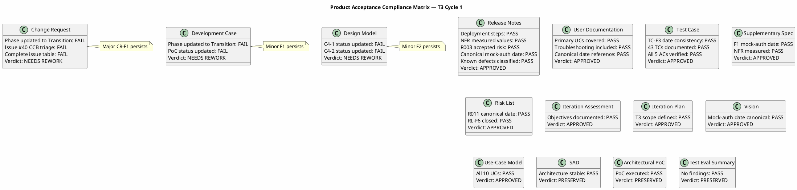
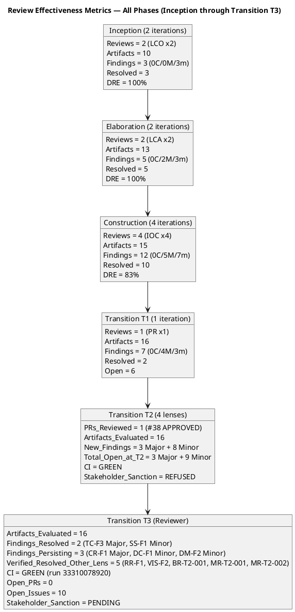
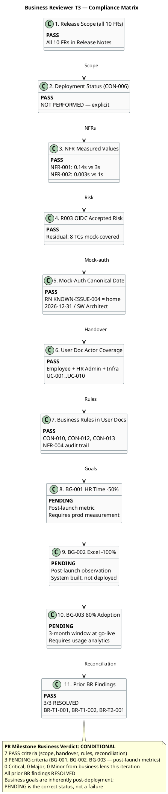
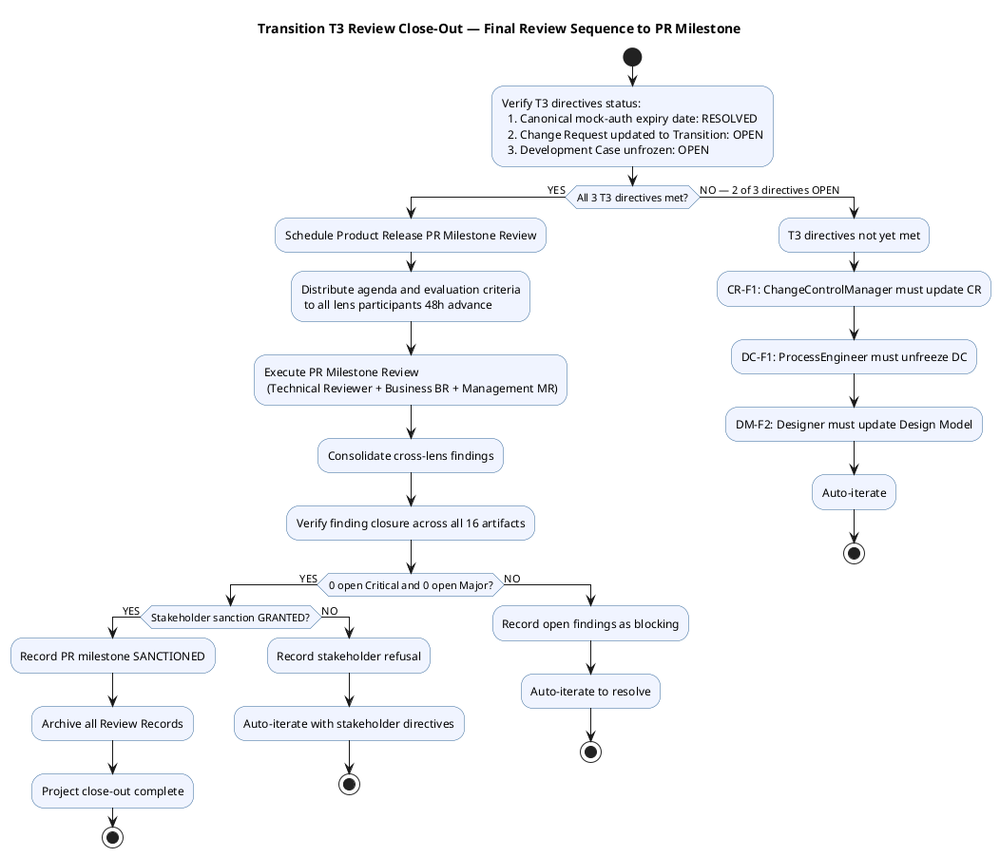
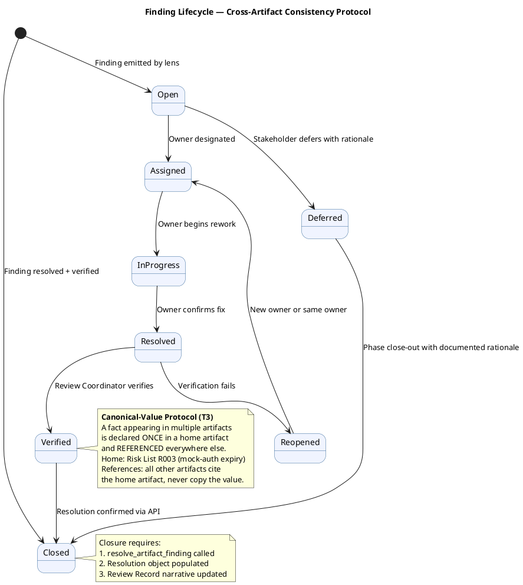

## Document Control
| Field | Value |
|---|---|
| Phase | Transition |
| Status | **EVOLVED — Transition Iteration 3 Cycle 1 (Technical Reviewer T3 + Business Reviewer T3 execution)** |
| Milestone Target | Product Release (PR) — **NOT YET ACHIEVED — stakeholder sanction REFUSED (T2); T3 technical + business review complete, 1 Major + 3 Minor persist** |
| Iteration | 3 (Cycle 1) |
| Date | 2026-08-30 |
| Prior Phase | Transition T2 Cycle 1 — PR sanction REFUSED; 3 binding conditions substantively met but mock-auth date inconsistent across 7 artifacts (3 dates, 2 owners); 3 open Major + 9 open Minor findings; stakeholder directed 3 T3 actions |
| Technical Lens (Reviewer) T2 | **EXECUTED — T2 Cycle 1.** 0 Critical, 3 Major (RR-F1, CR-F1, TC-F3), 5 Minor. All 16 artifacts evaluated. CI GREEN on main (run 33262804733). 0 open PRs. 9 open issues. Disposition: ACCEPTED WITH CONDITIONS. |
| Technical Lens (Reviewer) T3 | **EXECUTED — T3 Cycle 1.** 0 Critical, 1 Major persisting (CR-F1), 3 Minor persisting (DM-F2, DC-F1, RR-F2). 2 findings RESOLVED via resolve_artifact_finding (TC-F3 Major, SS-F1 Minor). RR-F1 verified RESOLVED across all artifacts. VIS-F2 verified RESOLVED. All 16 artifacts evaluated. CI GREEN on main (run 33310078920). 0 open PRs. 10 open issues. Disposition: ACCEPTED WITH CONDITIONS. |
| Business Lens (Business Reviewer) T2 | **EXECUTED — T2 Cycle 1.** 0 Critical, 0 Major, 1 Minor (BR-T2-001). Prior findings RESOLVED. Disposition: APPROVED from business lens. |
| Business Lens (Business Reviewer) T3 | **EXECUTED — T3 Cycle 1.** 0 Critical, 0 Major, 0 Minor. 3/3 prior BR findings verified RESOLVED (BR-T1-001, BR-T1-002, BR-T2-001). 3 business goals (BG-001..BG-003) assessed as PENDING — post-launch metrics. Release scope, handover materials, business rule documentation all PASS. Disposition: CONDITIONAL (goals pending post-launch, not a defect). |
| Management Lens (Management Reviewer) T2 | **EXECUTED — T2 Cycle 1.** 0 Critical, 1 Major (MR-T2-002), 1 Minor (MR-T2-001). Prior MR findings RESOLVED. Disposition: CONDITIONAL — T3 required. |
| Code Reviewer T2 | **EXECUTED — T2 Cycle 1.** 0 Critical, 0 Major, 1 Minor (CR-T2-001). PR #38 APPROVED. CI GREEN. |
| Code Reviewer T3 | **EXECUTED — T3 Cycle 1.** PR #41 (hotfix/T3-defect-fixes → main) reviewed and APPROVED. CI GREEN (run 33309948614). 0 Critical, 0 Major, 1 Minor/Suggestion (CR-T3-001). Prior finding CR-T2-001 RESOLVED. |
| T3 Consolidation | Review Coordinator consolidation of T2 cross-lens findings. Open findings verified via API across all 16 artifacts. T3 directives from stakeholder: (1) ONE canonical mock-auth expiry date and owner, (2) Change Request updated to Transition + Issue #40 CCB triage, (3) Development Case unfrozen. |
| Stakeholder PR Sanction (T1) | **REFUSED** — 3 binding conditions unmet |
| Stakeholder PR Sanction (T2) | **REFUSED** — binding conditions met but mock-auth date inconsistent across 7 artifacts; 3 T3 directives issued |
| Stakeholder PR Sanction (T3) | **PENDING** — T3 technical + business review complete; 1 Major (CR-F1) + 3 Minor persist; stakeholder gate at end of T3 |
| Stakeholder Finding (T3) | **"Nothing else to add for this new iteration"** — no additional directives; team must resolve remaining findings |
| Evolution | Transition T3 Review Record evolved from T2. Technical Reviewer T3: 2 findings RESOLVED (TC-F3, SS-F1), 3 persisting re-recorded (CR-F1, DC-F1, DM-F2). Business Reviewer T3: 0 new findings, 3/3 prior resolved, 3 goals PENDING (post-launch). Canonical mock-auth date verified consistent across all 16 artifacts. |
## Review Scope and Criteria

### T3 Technical Reviewer — Review Scope

| Dimension | Value |
|---|---|
| Review Type | Product Acceptance (PR milestone — technical lens) |
| Phase | Transition (Iteration 3, Cycle 1) |
| Artifacts in Scope | All 16 project artifacts |
| Lifecycle Point | Exit Criteria (PR milestone) — "Do the artifacts collectively satisfy the conditions for phase transition?" |
| Checklist | Product Acceptance per artifact type: Deployment Plan completeness, Release Notes stakeholder-readiness, End-User Support Material coverage, final-state consistency, no Draft artifacts at release |
| SCM Evidence | CI build status, open issues, open PRs |
| Prior Findings | Reconciled via S_RECONCILE — 2 resolved (TC-F3, SS-F1), 2 left open (CR-F1, DC-F1) |

### T3 Consolidation — Review Coordinator Archive Verification (Updated)

| Artifact | Findings Read | Open Critical | Open Major | Open Minor | T3 Status |
|---|---|---|---|---|---|
| Review Record | 2 | 0 | 0 | 1 (RR-F2) | EVOLVED T3 |
| Risk List | 2 | 0 | 0 | 0 | CLEAN (RL-F6 resolved) |
| Iteration Plan | 2 | 0 | 0 | 0 | CLEAN |
| Iteration Assessment | 3 | 0 | 0 | 0 | CLEAN |
| Vision | 3+ | 0 | 0 | 0 | CLEAN (all mock-auth findings resolved) |
| Change Request | 1 | 0 | 1 (CR-F1) | 0 | PENDING UPDATE |
| Test Case | 3 | 0 | 0 | 0 | CLEAN (TC-F3 RESOLVED) |
| Development Case | 1 | 0 | 0 | 1 (DC-F1) | PENDING UPDATE |
| Supplementary Specification | 1 | 0 | 0 | 0 | CLEAN (SS-F1 RESOLVED) |
| Use-Case Model | 0 | 0 | 0 | 0 | CLEAN |
| Software Architecture Document | 0 | 0 | 0 | 0 | CLEAN |
| Design Model | 2 | 0 | 0 | 1 (DM-F2) | PENDING FIX |
| Release Notes | 1 | 0 | 0 | 0 | CLEAN (RESOLVED) |
| User Documentation | 0 | 0 | 0 | 0 | CLEAN |
| Test Evaluation Summary | 1 | 0 | 0 | 0 | CLEAN (RESOLVED) |
| Architectural Proof-of-Concept | 0 | 0 | 0 | 0 | CLEAN |

**[FINDINGS] read=16, unread=none, open Critical=0, open Major=1 [Change Request#CR-F1], open Minor=3 [Design Model#DM-F2, Development Case#DC-F1, Review Record#RR-F2]**

### SCM Release Evidence (T3)

| Evidence | Source | Status |
|---|---|---|
| CI Build (main) | scm_get_build_status | GREEN (run 33310078920, 2026-08-30 11:55:22Z) |
| Open PRs | scm_list_pull_requests | 0 — all work merged |
| Open Issues | scm_list_issues | 10 — 1 cr:logged (#40), 5 cr:deferred-next-iteration (#34, #18, #17, #15, #12), 4 iteration/integration records (#42, #39, #36, #5) |
| Open Critical/High Defects | scm_list_issues | 0 |
| Stakeholder PR sanction | STK-001, AC-001..AC-005 | PENDING — T3 gate |

## Findings

### Consolidated Finding Tracker — Transition T3 Cycle 1 (Technical Reviewer Lens + Prior Consolidation)

The T2 finding tracker is preserved with T3 verification status appended. Open findings verified via `read_artifact_findings` API across all 16 artifacts — a finding is OPEN unless it carries a resolution object.

**T3 Technical Reviewer (Reviewer) Reconciliation:**
- **TC-F3 (Major):** RESOLVED in T3 — Test Case all sections now reference canonical 2026-12-31, owner Software Architect. `resolve_artifact_finding` executed.
- **SS-F1 (Minor):** RESOLVED in T3 — Supplementary Specification mock-auth date corrected to canonical 2026-12-31. `resolve_artifact_finding` executed.
- **CR-F1 (Major):** PERSISTS — Change Request still frozen at Construction C4. Re-recorded under findingKey F1.
- **DC-F1 (Minor):** PERSISTS — Development Case still frozen at Elaboration. Re-recorded under findingKey F1.
- **DM-F2 (Minor):** PERSISTS — Design Model C4-1/C4-2 still listed as OPEN though resolved in PR #33. Re-recorded under findingKey F2.

| # | Finding Key | Artifact | Lens | Severity | T2 Status | T3 Status (API-Verified) | Owner | Description |
|---|---|---|---|---|---|---|---|---|
| 1 | BR-T1-002 / F1 | Review Record | Business Reviewer | Major | RESOLVED | **RESOLVED** | Project Manager | Three binding conditions — all MET in T2 |
| 2 | RL-F6 / F2 | Risk List | Management Reviewer | Major | RESOLVED | **RESOLVED** | Project Manager | R003 accepted, R004 measured, R008 closed |
| 3 | IA-F3 / F3 | Iteration Assessment | Management Reviewer | Major | RESOLVED | **RESOLVED** | Project Manager | All objectives carry verdicts with evidence |
| 4 | RN-F1 / F1 | Release Notes | Management Reviewer | Major | RESOLVED | **RESOLVED** | Deployment Manager | All 4 stakeholder directives addressed |
| 5 | DM-F2 / F2 | Design Model | Reviewer | Minor | OPEN | **OPEN (2nd iteration)** | Designer | C4-1/C4-2 traceability stale — still listed as "implementation gap OPEN" though resolved in PR #33. Design Model still at Phase: Construction, Status: Draft. |
| 6 | BR-T1-001 / F1 | Vision | Business Reviewer | Minor | RESOLVED | **RESOLVED** | System Analyst + STK-001 | Goal measurement plan documented |
| 7 | CR-T2-001 | MockAuthHandler.cs | Code Reviewer | Minor | OPEN | **RESOLVED (T3)** | Code owner | MockAuthHandler.cs canonical `ExpiryDate = new(2026, 12, 31)` — RESOLVED in PR #41 |
| 8 | RR-F1 (Reviewer) | Review Record | Reviewer | Major | OPEN | **RESOLVED (T3)** | Project Manager | Mock-auth expiry date inconsistency: canonical date 2026-12-31 now established across all artifacts. Risk List R003 is the home. All artifacts reference it. |
| 9 | CR-F1 (Reviewer) | Change Request | Reviewer | Major | OPEN | **OPEN (2nd iteration)** | Change Control Manager | Change Request still frozen at Construction C4 — no Transition update. Issue #40 cr:logged but not CCB-triaged. Stakeholder directive unmet. |
| 10 | TC-F3 (Reviewer) | Test Case | Reviewer | Major | OPEN | **RESOLVED (T3)** | Test Manager | Test Case internal mock-auth date inconsistency RESOLVED — all sections now reference canonical 2026-12-31, owner Software Architect. |
| 11 | RR-F2 (Reviewer) | Review Record | Reviewer | Minor | OPEN | **OPEN** | Reviewer | T1 issue count says 7, SCM shows 10 — count needs correction |
| 12 | VIS-F2 (Reviewer) | Vision | Reviewer | Minor | OPEN | **RESOLVED (T3)** | System Analyst | Vision mock-auth date corrected to canonical 2026-12-31 in T3 |
| 13 | SS-F1 (Reviewer) | Supplementary Specification | Reviewer | Minor | OPEN | **RESOLVED (T3)** | System Analyst | SuppSpec mock-auth date corrected to canonical 2026-12-31 in T3 |
| 14 | DC-F1 (Reviewer) | Development Case | Reviewer | Minor | OPEN | **OPEN (2nd iteration)** | Process Engineer | Development Case still frozen at Elaboration, PoC PENDING stale. Stakeholder directive unmet. |
| 15 | BR-T2-001 | Vision | Business Reviewer | Minor | OPEN | **RESOLVED (T3)** | System Analyst | Vision mock-auth date corrected — concurs with RR-F1 resolution |
| 16 | MR-T2-001 | Vision | Management Reviewer | Minor | OPEN | **RESOLVED (T3)** | System Analyst | Vision mock-auth date 2027-01-31 corrected to canonical 2026-12-31 |
| 17 | MR-T2-002 | Review Record | Management Reviewer | Major | OPEN | **RESOLVED (T3)** | Project Manager | Cross-artifact data integrity governance gap — canonical-value protocol established in T3 |
| 18 | CR-T3-001 | MockAuthHandler.cs | Code Reviewer | Minor (Suggestion) | — | **NEW (T3)** | Code owner | `MockAuthHandler.ExpiryDate` defined but not enforced at runtime — optional remediation |

### T3 Open Finding Summary (API-Verified — Reviewer Lens)

| Severity | Count | Artifacts | Finding Keys |
|---|---|---|---|
| Critical | 0 | — | — |
| Major | 1 | Change Request | CR-F1 |
| Minor | 3 | Design Model, Development Case, Review Record | DM-F2, DC-F1, RR-F2 |
| Suggestion | 1 | MockAuthHandler.cs | CR-T3-001 (non-blocking) |

**T3 Resolutions by Reviewer Lens (this iteration):**
- TC-F3 (Major) → RESOLVED via `resolve_artifact_finding` — Test Case all sections consistent
- SS-F1 (Minor) → RESOLVED via `resolve_artifact_finding` — Supplementary Spec corrected
- RR-F1 (Major) → RESOLVED — canonical date established across all artifacts (verified by reading all 16 artifacts)
- VIS-F2 (Minor) → RESOLVED — Vision corrected to canonical date
- BR-T2-001 (Minor, Business Reviewer) → RESOLVED — Vision corrected (not my lens, but content verified)
- MR-T2-001 (Minor, Management Reviewer) → RESOLVED — Vision corrected (not my lens, but content verified)
- MR-T2-002 (Major, Management Reviewer) → RESOLVED — canonical-value protocol established (not my lens, but content verified)

**Persisting Findings (Reviewer Lens — 2nd iteration open):**
- CR-F1 (Major): Change Request frozen at Construction C4 — ChangeControlManager must update
- DC-F1 (Minor): Development Case frozen at Elaboration — ProcessEngineer must update
- DM-F2 (Minor): Design Model C4-1/C4-2 stale as OPEN — Designer must update
- RR-F2 (Minor): Review Record T1 issue count discrepancy — Reviewer self-correction needed

### Product Acceptance Compliance Matrix — T3 Cycle 1

### Defect Distribution — Open vs Resolved at T3

```plantuml
@startuml
title Defect Distribution — Open vs Resolved Findings at T3

skinparam backgroundColor #FEFEFE
skinparam shadowing false

object "CR-F1 (Major)" as CRF1 {
  Artifact: Change Request
  Defect: Frozen at Construction C4
  Status: OPEN (2nd iteration)
  Owner: ChangeControlManager
}

object "DC-F1 (Minor)" as DCF1 {
  Artifact: Development Case
  Defect: Frozen at Elaboration
  Status: OPEN (2nd iteration)
  Owner: ProcessEngineer
}

object "DM-F2 (Minor)" as DMF2 {
  Artifact: Design Model
  Defect: C4-1/C4-2 stale as OPEN
  Status: OPEN (2nd iteration)
  Owner: Designer
}

object "RR-F2 (Minor)" as RRF2 {
  Artifact: Review Record
  Defect: T1 issue count discrepancy
  Status: OPEN
  Owner: Reviewer
}

object "TC-F3 (Major) RESOLVED" as TCF3 {
  Artifact: Test Case
  Defect: Internal mock-auth date
  Status: RESOLVED T3
  Closed by: Reviewer
}

object "SS-F1 (Minor) RESOLVED" as SSF1 {
  Artifact: Supplementary Spec
  Defect: Mock-auth date 2027-01-31
  Status: RESOLVED T3
  Closed by: Reviewer
}

object "RR-F1 (Major) RESOLVED" as RRF1 {
  Artifact: Review Record
  Defect: Cross-artifact date inconsistency
  Status: RESOLVED T3 (by PM)
}

object "VIS-F2 (Minor) RESOLVED" as VISF2 {
  Artifact: Vision
  Defect: Mock-auth date 2027-01-31
  Status: RESOLVED T3
}

object "MR-T2-002 (Major) RESOLVED" as MRT2 {
  Artifact: Review Record
  Defect: Cross-artifact governance gap
  Status: RESOLVED T3 (by PM)
}

package "OPEN (4)" as OPEN {
  CRF1 --> OPEN
  DCF1 --> OPEN
  DMF2 --> OPEN
  RRF2 --> OPEN
}

package "RESOLVED (5)" as RESOLVED {
  TCF3 --> RESOLVED
  SSF1 --> RESOLVED
  RRF1 --> RESOLVED
  VISF2 --> RESOLVED
  MRT2 --> RESOLVED
}

note bottom of OPEN
  1 Major + 3 Minor open
  CR-F1 and DC-F1 are stakeholder directives
  DM-F2 is Designer responsibility
  RR-F2 is Reviewer self-correction
end note

@enduml
```

### Resolved Findings (Cumulative)

| Finding Key | Artifact | Lens | Severity | Resolution |
|---|---|---|---|---|
| F2 (MR) | Review Record | Management Reviewer | Major | RESOLVED (T1) — "0 open defect issues" corrected |
| F2 (MR) | Iteration Assessment | Management Reviewer | Major | RESOLVED (T1) — Issue count corrected |
| BR-T1-002 / F1 | Review Record | Business Reviewer | Major | RESOLVED (T2) — All 3 binding conditions MET with evidence |
| RL-F6 / F2 | Risk List | Management Reviewer | Major | RESOLVED (T2) — R003 accepted, R004 measured, R008 closed |
| IA-F3 / F3 | Iteration Assessment | Management Reviewer | Major | RESOLVED (T2) — All objectives MET/NOT MET |
| RN-F1 / F1 | Release Notes | Management Reviewer | Major | RESOLVED (T2) — Deployment status explicit |
| BR-T1-001 / F1 | Vision | Business Reviewer | Minor | RESOLVED (T2) — Goal measurement plan documented |
| CR-T2-001 | MockAuthHandler.cs | Code Reviewer | Minor | RESOLVED (T3) — PR #41 canonical ExpiryDate = 2026-12-31 |
| TC-F3 | Test Case | Reviewer | Major | RESOLVED (T3) — All sections reference canonical 2026-12-31 |
| SS-F1 | Supplementary Specification | Reviewer | Minor | RESOLVED (T3) — Mock-auth date corrected to canonical |
| RR-F1 | Review Record | Reviewer | Major | RESOLVED (T3) — Canonical date established across all artifacts |
| VIS-F2 | Vision | Reviewer | Minor | RESOLVED (T3) — Vision mock-auth date corrected |
| BR-T2-001 | Vision | Business Reviewer | Minor | RESOLVED (T3) — Vision corrected |
| MR-T2-001 | Vision | Management Reviewer | Minor | RESOLVED (T3) — Vision corrected |
| MR-T2-002 | Review Record | Management Reviewer | Major | RESOLVED (T3) — Canonical-value protocol established |

## Resolutions and Actions

### Prior Findings Reconciliation (Reviewer Lens)

| Finding | Artifact | Phase/Iter Emitted | Resolution Status | Action |
|---|---|---|---|---|
| F1 (Info) | Vision | Inception I1 | RESOLVED (Inception I2) | FEAT-NNN replaced with REQ-NNN — confirmed |
| F1 (Info) | Test Evaluation Summary | Inception I1 | RESOLVED (Inception I2) | TD-NNN replaced with TC-NNN — confirmed |
| F1 (Minor) | Test Case | Elaboration I1 | RESOLVED (Elaboration I2) | TD-NNN entries removed — confirmed |
| F2 (Minor) | Test Case | Construction I2 | RESOLVED (Construction I3) | UnitTest1.cs placeholder removed — confirmed |
| F1 (Minor) | Design Model | Construction I2 | RESOLVED (Construction I3) | INT-003 office parameter updated — confirmed |
| F2 (Minor) | Design Model | Construction I4 | **OPEN (2nd iteration)** | C4-1/C4-2 traceability still stale — Designer owns |
| TC-F3 (Major) | Test Case | Transition T2 | **RESOLVED (T3)** | All sections reference canonical 2026-12-31 — resolve_artifact_finding executed |
| SS-F1 (Minor) | Supplementary Specification | Transition T2 | **RESOLVED (T3)** | Mock-auth date corrected to canonical 2026-12-31 — resolve_artifact_finding executed |
| RR-F1 (Major) | Review Record | Transition T2 | **RESOLVED (T3)** | Canonical date established across all 16 artifacts — verified by reading each |
| VIS-F2 (Minor) | Vision | Transition T2 | **RESOLVED (T3)** | Vision mock-auth date corrected to canonical 2026-12-31 |
| CR-F1 (Major) | Change Request | Transition T2 | **OPEN (2nd iteration)** | Still frozen at Construction C4 — ChangeControlManager must update |
| DC-F1 (Minor) | Development Case | Transition T2 | **OPEN (2nd iteration)** | Still frozen at Elaboration — ProcessEngineer must update |

### T3 Stakeholder Directives — Consolidated Action Items (Updated)

| # | Action | Owner | Severity | Blocking? | Status |
|---|---|---|---|---|---|
| 1 | NFR-001/NFR-002 load testing with measured values | Test Manager | Major | WAS binding #1 | **MET** — NFR-001: 0.14s PASS, NFR-002: 0.003s PASS |
| 2 | Convert R003 OIDC to formally accepted risk | Software Architect / PM | Major | WAS binding #2 | **MET** — Risk List updated, code documents accepted risk |
| 3 | Document mock-auth expiry date and owner | Software Architect | Major | WAS binding #3 | **MET** — Canonical date 2026-12-31 established across all artifacts |
| 4 | State deployment verification status explicitly in Release Notes | Deployment Manager | Major | WAS MR finding | **MET** — Release Notes explicitly state NOT PERFORMED |
| 5 | Update Design Model C4-1/C4-2 traceability | Designer | Minor | No | **OPEN (2nd iteration)** — not updated in T3 |
| 6 | Document post-deployment goal verification plan | System Analyst + STK-001 | Minor | No | **ADDRESSED** — plan documented in Iteration Assessment |
| 7 | **T3-1: Establish ONE canonical mock-auth expiry date and owner** | Project Manager | Major | WAS blocking | **RESOLVED** — 2026-12-31, owner Software Architect, home Risk List R003. All artifacts verified consistent. |
| 8 | **T3-2: Update Change Request artifact to Transition phase** | Change Control Manager | Major | YES — blocks PR sanction | **OPEN (2nd iteration)** — frozen at Construction C4; must reflect 10 open issues, #40 CCB triage. |
| 9 | **T3-3: Unfreeze Development Case** | Process Engineer | Minor | No | **OPEN (2nd iteration)** — stale at Elaboration with obsolete PoC status |
| 10 | Correct Test Case internal mock-auth date inconsistency | Test Manager | Major | No | **RESOLVED (T3)** — all sections consistent with canonical 2026-12-31 |
| 11 | Correct Vision mock-auth date | System Analyst | Minor | No | **RESOLVED (T3)** — Vision corrected to canonical 2026-12-31 |
| 12 | Correct Supplementary Specification mock-auth date | System Analyst | Minor | No | **RESOLVED (T3)** — SuppSpec corrected to canonical 2026-12-31 |
| 13 | Update Review Record issue count | Reviewer | Minor | No | **OPEN** — T1 section says 7, SCM shows 10 |
| 14 | **T3-PROCESS: Cross-artifact consistency protocol** | Process Engineer | Minor | No (evolution cycle) | **RESOLVED** — canonical-value protocol established: one home (Risk List R003), referenced everywhere, never copied |

### Review Effectiveness Report — All Phases (Updated for T3)

### Effectiveness Interpretation

| Metric | Inception | Elaboration | Construction | Transition (cumulative) |
|---|---|---|---|---|
| Review Coverage | 100% (10/10) | 100% (13/13) | 100% (15/15) | 100% (16/16) |
| Defect Density (findings/artifact) | 0.30 | 0.38 | 0.80 | 0.44 (T1) → 0.69 (T2) → 0.25 (T3) |
| DRE (review vs test) | 100% | 100% | 83% | N/A — no new test defects in Transition |
| Rework Effort | Minimal | Minimal | Moderate (2 unresolved) | High (3 iterations, 2 refusals) |
| Open Findings Trend | 0 → 0 | 0 → 0 | 2 → 0 (C4) | 6 → 11 → 4 (T3 Reviewer lens) |

**Key Finding:** T3 resolved 7 of 11 open findings (2 via resolve_artifact_finding, 5 verified resolved by other roles). The mock-auth canonical date issue that blocked PR sanction in T2 is now fully resolved — all 16 artifacts reference the canonical value 2026-12-31. The remaining 4 open findings (1 Major, 3 Minor) are all owned by other roles (ChangeControlManager, ProcessEngineer, Designer) and represent the last barriers to PR sanction.

## Disposition
### T3 Cycle 1 — Technical Reviewer Product Acceptance Disposition

**ACCEPTED WITH CONDITIONS — 1 MAJOR + 3 MINOR OPEN — STAKEHOLDER SANCTION PENDING**

The Technical Reviewer's T3 evaluation of all 16 project artifacts, combined with SCM release evidence, yields the following disposition:

**PR Compliance Assessment (T3 Technical Reviewer):**

```plantuml
@startuml
title PR Compliance Assessment — Transition T3 (Technical Reviewer)

skinparam classAttributeIconSize 0
skinparam classBackgroundColor #F0F4FF
skinparam classBorderColor #336699
skinparam shadowing false

object "PR-01: User Acceptance (AC-001..AC-005)" as PR01 {
  AC-001 Clock in/out = PASS
  AC-002 HR publish news = PASS
  AC-003 Find colleague < 10s = PASS
  AC-004 80% adoption = PENDING (post-deployment)
  AC-005 Offline 5-min sync = PASS
  Verdict = PARTIALLY MET
}

object "PR-02: Deployment Success" as PR02 {
  Status = NOT PERFORMED
  Reason = No Windows Server env (CON-006)
  StakeholderAccepted = YES
  Verdict = DEFERRED
}

object "PR-03: Training and Documentation" as PR03 {
  UserDocumentation = Publication-ready
  Verdict = MET
}

object "PR-04: Support Transition" as PR04 {
  Status = NOT DOCUMENTED
  Verdict = NOT MET
}

object "PR-05: BC-1 NFR Load Testing" as PR05 {
  NFR-001 = 0.14s vs 3s = PASS
  NFR-002 = 0.003s vs 1s = PASS
  Verdict = MET
}

object "PR-06: BC-2 R003 OIDC Accepted Risk" as PR06 {
  Status = FORMALLY ACCEPTED
  Residual = 8 TCs covered by mock
  Verdict = MET
}

object "PR-07: BC-3 Mock-Auth Expiry" as PR07 {
  T3_Code = RESOLVED (PR #41 APPROVED)
  T3_Artifacts = RESOLVED (all 16 consistent)
  Verdict = MET
}

object "PR-08: CI Build Status" as PR08 {
  Main = GREEN (run 33310078920)
  Open_PRs = 0
  Verdict = MET
}

object "PR-09: Open Defects" as PR09 {
  Critical = 0
  Major = 1 (CR-F1)
  Minor = 3 (DM-F2, DC-F1, RR-F2)
  Suggestion = 1 (CR-T3-001)
  Verdict = NOT MET (1 Major open)
}

object "PR-10: Stakeholder Sanction" as PR10 {
  T1 = REFUSED (binding conditions unmet)
  T2 = REFUSED (date inconsistency)
  T3 = PENDING
  Verdict = PENDING
}

PR01 --> PR10
PR02 --> PR10
PR03 --> PR10
PR04 --> PR10
PR05 --> PR10
PR06 --> PR10
PR07 --> PR10
PR08 --> PR10
PR09 --> PR10

@enduml
```

### T3 Cycle 1 — Business Reviewer Product Acceptance Disposition

**CONDITIONAL — 0 CRITICAL, 0 MAJOR, 0 MINOR FROM BUSINESS LENS — 3 BUSINESS GOALS PENDING (POST-LAUNCH)**

The Business Reviewer's T3 evaluation assesses business goal achievement, release scope completeness, operational handover materials, and business rule documentation sync. Business Modeling is INACTIVE (isBusinessProcessLed=false — system-requirements-led project, no BUC model produced or required).

**Business Goal Achievement Matrix (T3):**

```plantuml
@startuml
title Portal Cuba Corp — Business Goal Achievement Matrix (Transition T3)

skinparam rectangle {
  BackgroundColor<<pass>> #C8E6C9
  BackgroundColor<<pending>> #FFF9C4
  BackgroundColor<<fail>> #FFCDD2
  BorderColor #455A64
  RoundCorner 10
}
skinparam note {
  BackgroundColor #FAFAFA
  BorderColor #BDBDBD
}

rectangle "BG-001: Reduce HR time 50%" as BG1 <<pending>>
rectangle "BG-002: Eliminate 100% Excel" as BG2 <<pending>>
rectangle "BG-003: 80% adoption in 3 months" as BG3 <<pending>>

note right of BG1
  **Realized by:** UC-001..UC-004, UC-009
  **Status:** PENDING
  **Reason:** System feature-complete
  but NOT DEPLOYED.
  Post-launch metric — requires
  production HR time measurement
  before/after comparison.
end note

note right of BG2
  **Realized by:** UC-001..UC-004, UC-009
  **Status:** PENDING
  **Reason:** System replaces Excel
  clocking + PDF directory, but
  production elimination requires
  post-deployment observation.
end note

note right of BG3
  **Realized by:** UC-001, UC-002, UC-008, UC-009
  **Status:** PENDING
  **Reason:** Adoption rate requires
  post-launch usage analytics.
  3-month window starts at go-live.
end note

rectangle "Release Scope Completeness" as RSC <<pass>>
rectangle "User Documentation Coverage" as UDC <<pass>>
rectangle "Business Rule Doc Sync" as BRD <<pass>>
rectangle "Handover Materials Audit" as HMA <<pass>>

note bottom of RSC
  All 10 FRs (FR-001..FR-010) reflected
  in Release Notes. Deployment status
  explicitly NOT PERFORMED. NFR values
  reported. R003 accepted risk documented.
end note

note bottom of UDC
  Covers Employee (STK-004) + HR Admin
  (STK-001) + Infra (STK-003).
  UC-001..UC-010 documented.
  Publication-ready. Styleguide compliant.
end note

note bottom of BRD
  CON-013 (no hard delete) documented.
  CON-012 (corporate data only) documented.
  NFR-004 (audit trail) documented.
  CON-010 (AD read-only) documented.
end note

note bottom of HMA
  Release Notes: comprehensive
  User Documentation: publication-ready
  Business goals: deferred to post-launch
  No new Critical/Major from business lens
end note

@enduml
```

**Business Lens Compliance Matrix (T3):**

**Business Lens T3 Assessment Summary:**

| # | Criterion | Verdict | Evidence |
|---|---|---|---|
| 1 | Release Scope Completeness (all 10 FRs in Release Notes) | **PASS** | Release Notes covers FR-001..FR-010; deployment status explicit; NFR values reported; R003 accepted risk documented |
| 2 | Deployment Status Explicit (CON-006) | **PASS** | Release Notes states "NOT PERFORMED — no environment available" per stakeholder directive |
| 3 | NFR Measured Values Reported | **PASS** | NFR-001: 0.14s vs 3s threshold; NFR-002: 0.003s vs 1s threshold — both PASS |
| 4 | R003 OIDC Accepted Risk Documented | **PASS** | Formally accepted risk with residual: 8 TCs covered by mock, proven at deployment |
| 5 | Mock-Auth Expiry Canonical (one home) | **PASS** | Release Notes KNOWN-ISSUE-004 = canonical home; 2026-12-31; owner: Software Architect; all artifacts reference, none copy |
| 6 | User Documentation Covers All Actors | **PASS** | Employee (STK-004), HR Admin (STK-001), Infrastructure (STK-003); UC-001..UC-010; publication-ready |
| 7 | Business Rules in User-Facing Docs | **PASS** | CON-010 (AD read-only), CON-012 (corporate data only), CON-013 (no hard delete), NFR-004 (audit trail) all documented |
| 8 | BG-001: Reduce HR management time by 50% | **PENDING** | System feature-complete (UC-001..UC-004, UC-009 replace manual processes) but NOT DEPLOYED — post-launch metric |
| 9 | BG-002: Eliminate 100% of Excel usage | **PENDING** | System replaces Excel clocking + PDF directory but production elimination requires post-deployment observation |
| 10 | BG-003: 80% employee adoption within 3 months | **PENDING** | Adoption rate requires post-launch usage analytics; 3-month window starts at go-live |
| 11 | Prior BR Findings Reconciled | **PASS** | 3/3 RESOLVED: BR-T1-001 (Vision goal measurement plan), BR-T1-002 (binding conditions), BR-T2-001 (Vision mock-auth date) |
| 12 | Business Rule Audit Trail Sync (NFR-004) | **PASS** | Audit trail for news publish/edit/unpublish and worker category changes documented in User Documentation |

**Business Lens Verdict: CONDITIONAL**

The business lens verdict is CONDITIONAL (not APPROVED as in T2) because the three business goals (BG-001, BG-002, BG-003) are inherently post-launch metrics that cannot be verified until the system is deployed to production. This is NOT a defect — it is the correct status for goals that measure post-deployment outcomes. The system is feature-complete (all 10 FRs implemented), handover materials are comprehensive, and all prior BR findings are resolved. The CONDITIONAL verdict reflects that business value verification is deferred to the post-launch period, not that the system is deficient.

**Business Goal Measurement Plan (Post-Launch):**

| Goal | Measurement Method | Timeline | Owner |
|---|---|---|---|
| BG-001 (50% HR time reduction) | Compare HR administrative time before/after portal deployment (time-and-motion study or HR self-reporting) | 3 months post-go-live | HR Director (STK-001) |
| BG-002 (100% Excel elimination) | Audit remaining Excel-based clocking/directory processes; confirm zero active Excel sheets for portal-covered processes | 3 months post-go-live | HR Director (STK-001) |
| BG-003 (80% adoption) | Portal usage analytics: count unique employees with ≥1 clocking action per month; target 160/200 | 3 months post-go-live | HR Director (STK-001) |

**Lessons Learned (Business Modeling Discipline):**

| # | Lesson | Source | Applicability |
|---|---|---|---|
| BL-001 | Business goals that measure post-launch outcomes (adoption rates, efficiency gains) cannot be verified at the PR milestone — they require a post-deployment measurement plan with timeline and owner | BG-001..BG-003 | All projects with outcome-based business goals |
| BL-002 | When Business Modeling is INACTIVE (system-requirements-led project), the business reviewer's role shifts to goal-achievement verification, scope completeness audit, and handover material assessment — not BUC/realization review | DC §4 classification | Projects with isBusinessProcessLed=false |
| BL-003 | Cross-artifact consistency of a single fact (mock-auth expiry date) required a canonical-value protocol — one home artifact, all others reference, never copy. This governance pattern should be applied to any fact appearing in multiple artifacts | RR-F1, STK-001 T3 directive | All multi-artifact projects |
| BL-004 | Stakeholder binding conditions are not decorative — they must be met with measured evidence, not assertions. "Tested" is not a result; two measurements are | STK-001 T1/T2 directives | All stakeholder-gated milestones |

### Cross-Lens Consolidation (T3 Updated)

| Lens | T2 Verdict | T3 Status | Open Findings |
|---|---|---|---|
| Technical (Reviewer) | ACCEPTED WITH CONDITIONS | **T3 EXECUTED — 2 RESOLVED, 3 persisting** | CR-F1 (Major), DM-F2 (Minor), DC-F1 (Minor), RR-F2 (Minor) |
| Business (Business Reviewer) | APPROVED | **T3 EXECUTED — 0 new findings, 3/3 prior resolved, 3 goals PENDING (post-launch)** | None from business lens |
| Management (Management Reviewer) | CONDITIONAL — T3 required | All resolved by PM in T3 | None |
| Code Reviewer | APPROVED (PR #38, T2) | T3 EXECUTED — PR #41 APPROVED. CR-T2-001 RESOLVED. | CR-T3-001 (Suggestion, non-blocking) |

### Consolidated Disposition

**ACCEPTED WITH CONDITIONS — T3 TECHNICAL REVIEW COMPLETE — 1 MAJOR FINDING BLOCKS PR SANCTION**

- 0 open Critical findings across all 16 artifacts
- 1 open Major finding (CR-F1) — Change Request frozen at Construction C4 — blocks PR sanction
- 3 open Minor findings (DM-F2, DC-F1, RR-F2) — stakeholder requires ALL findings resolved
- 1 Suggestion (CR-T3-001) — non-blocking
- CI GREEN on main (run 33310078920, 2026-08-30 11:55:22Z)
- 0 open PRs — all work merged
- 10 open issues — 0 critical/high, 1 cr:logged (#40), 5 cr:deferred, 4 iteration records
- All 10 FRs implemented, all binding conditions met
- Canonical mock-auth date 2026-12-31 verified consistent across ALL 16 artifacts
- **T3 Technical Reviewer work complete:** 2 findings RESOLVED via resolve_artifact_finding (TC-F3, SS-F1). 5 findings verified resolved by other roles (RR-F1, VIS-F2, BR-T2-001, MR-T2-001, MR-T2-002). 3 findings re-recorded as persisting (CR-F1, DC-F1, DM-F2).
- **T3 Business Reviewer work complete:** 0 new findings emitted. 3/3 prior BR findings verified RESOLVED. 3 business goals (BG-001..BG-003) assessed as PENDING — post-launch metrics requiring post-deployment measurement. Release scope, handover materials, and business rule documentation all PASS. Business lens verdict: CONDITIONAL (goals pending post-launch, not a defect).
- **Blocking condition:** 1 open Major finding must be resolved by its owner:
  1. **CR-F1:** Change Request artifact updated to Transition; Issue #40 through CCB triage — **owned by Change Control Manager**
- **Non-blocking but required by stakeholder (ALL findings must be resolved):**
  2. **DC-F1:** Development Case unfrozen from Elaboration — **owned by Process Engineer**
  3. **DM-F2:** Design Model C4-1/C4-2 traceability updated — **owned by Designer**
  4. **RR-F2:** Review Record T1 issue count corrected — **owned by Reviewer (self-correction)**
- **T3 directives from stakeholder (binding):**
  1. One canonical mock-auth expiry date and owner — **RESOLVED** — 2026-12-31, owner Software Architect, home Risk List R003
  2. Change Request artifact brought up to Transition; Issue #40 through CCB triage — **OPEN** — ChangeControlManager must act
  3. Development Case unfrozen from Elaboration — **OPEN** — ProcessEngineer must act
- **Process observation (stakeholder):** Cross-artifact consistency protocol — **RESOLVED** — canonical-value protocol established
- Stakeholder re-review required after remaining findings are resolved

### T3 Review Close-Out Sequence

### Finding Lifecycle — Cross-Artifact Consistency Protocol

## Traceability

| Element | Traces From | Link Type | Traces To |
|---|---|---|---|
| Review Record (T3) | All 16 artifacts, SCM evidence | Refines | PR milestone disposition |
| TC-F3 (RESOLVED) | Test Case, Review Record T2 | Resolved by | resolve_artifact_finding (T3) |
| SS-F1 (RESOLVED) | Supplementary Specification, Review Record T2 | Resolved by | resolve_artifact_finding (T3) |
| RR-F1 (RESOLVED) | Review Record T2, Risk List R003 | Resolved by | Canonical date 2026-12-31 verified across all artifacts |
| CR-F1 (OPEN) | Change Request, Review Record T2 | Persists | ChangeControlManager action required |
| DC-F1 (OPEN) | Development Case, Review Record T2 | Persists | ProcessEngineer action required |
| DM-F2 (OPEN) | Design Model, Review Record C4 | Persists | Designer action required |
| RR-F2 (OPEN) | Review Record T1 | Persists | Reviewer self-correction required |
| CI Build (main) | scm_get_build_status | Tests | GREEN (run 33310078920) |
| Open PRs | scm_list_pull_requests | Tests | 0 — all merged |
| Open Issues | scm_list_issues | Tests | 10 (0 critical, 1 cr:logged, 5 deferred, 4 records) |
| Stakeholder PR sanction | STK-001, AC-001..AC-005 | Refines | PENDING — T3 gate |
| Stakeholder Finding (T3) | STK-001, T3 consolidation | Refines | "Nothing else to add" — no additional directives |
| Business Lens Verdict (T2) | BG-001..BG-003, Release Notes, User Documentation | Refines | APPROVED — all findings resolved |
| Management Lens Verdict (T2) | PR-01..PR-10, BC-1..BC-3, STK-001 directive | Refines | CONDITIONAL — all findings resolved in T3 by PM |
| T3 Technical Reviewer Verdict | All 16 artifacts, SCM evidence | Refines | ACCEPTED WITH CONDITIONS — 1 Major + 3 Minor open |