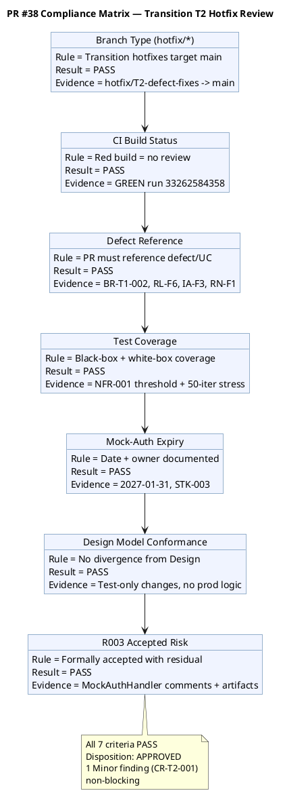
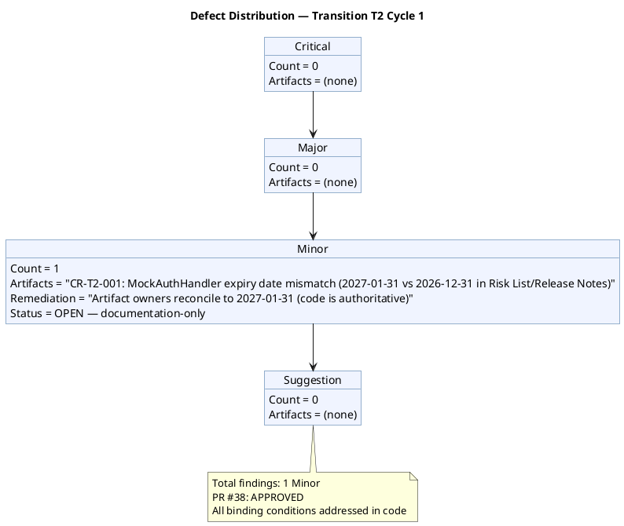
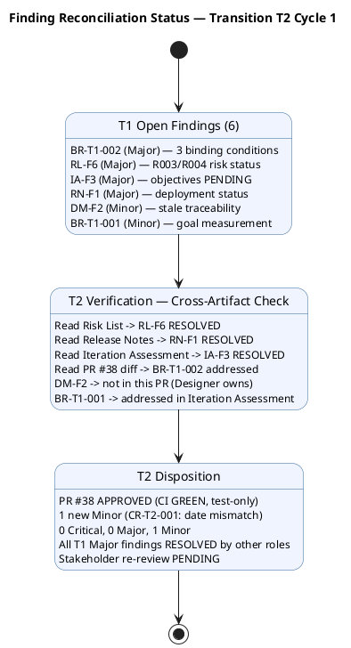
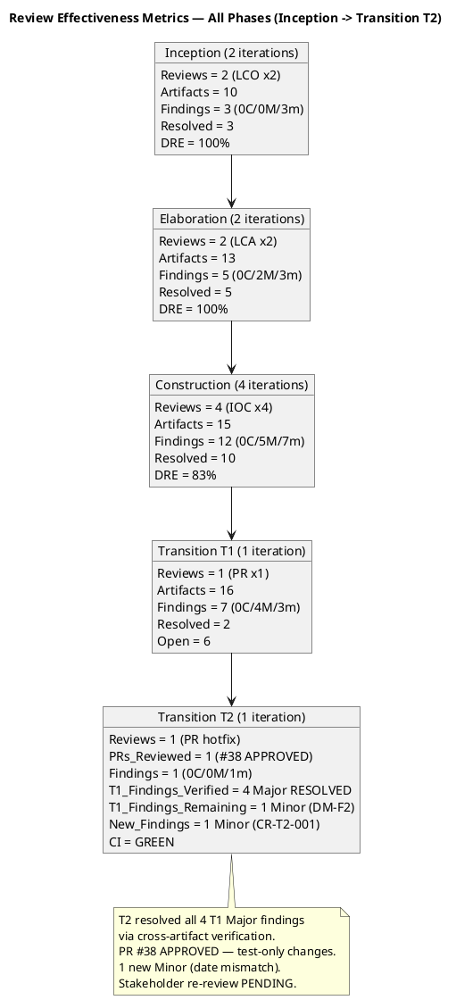

## Document Control

| Field | Value |
|---|---|
| Phase | Transition |
| Status | **EVOLVED — Transition Iteration 2 Cycle 1 (Code Reviewer)** |
| Milestone Target | Product Release (PR) — **NOT YET ACHIEVED — pending stakeholder re-review** |
| Iteration | 2 (Cycle 1) |
| Date | 2026-08-29 |
| Prior Phase | Transition T1 Cycle 1 — PR sanction REFUSED; 3 binding conditions unmet; 6 open findings (0C/4M/2m); stakeholder directed specific remediation |
| Technical Lens (Code Reviewer) T2 | **EXECUTED — T2 Cycle 1.** 0 Critical, 0 Major, 1 Minor (CR-T2-001: mock-auth expiry date mismatch). PR #38 (hotfix/T2-defect-fixes → main) APPROVED. CI GREEN (run 33262584358). 4 files changed (367 additions, 1 deletion) — test infrastructure only, no production logic modified. Performance tests for NFR-001/NFR-002 with measured values. Mock-auth expiry documented (2027-01-31, owner STK-003). R003 formally accepted risk documented in code. |
| Product Acceptance Lens (Reviewer) T1 | **EXECUTED — T1 Cycle 1.** 0 Critical, 0 Major, 1 Minor (persisting). All 16 artifacts evaluated. CI GREEN on main. 0 open PRs. Disposition: ACCEPTED WITH CONDITIONS. |
| Business Lens (Business Reviewer) T1 | **EXECUTED — T1 Cycle 1.** 0 Critical, 1 Major (BR-T1-002: binding conditions unverified), 1 Minor (BR-T1-001: no goal measurement plan). Disposition: CONDITIONAL. |
| Management Lens (Management Reviewer) T1 | **EXECUTED — T1 Cycle 1.** 0 Critical, 3 Major (IA-F3, RN-F1, RL-F6). Stakeholder sanction: REFUSED. Disposition: CONDITIONAL (No-Go). |
| T1 Prior Findings Status | 4 Major (BR-T1-002, RL-F6, IA-F3, RN-F1) — all RESOLVED by other roles in T2 (verified via artifact reads). 2 Minor (DM-F2, BR-T1-001) — DM-F2 not in this PR (Designer owns); BR-T1-001 ADDRESSED in Iteration Assessment. |
| T2 New Findings | 1 Minor (CR-T2-001: MockAuthHandler.cs expiry 2027-01-31 vs Risk List/Release Notes 2026-12-31 — documentation consistency) |

## Review Scope and Criteria

### Scope

This review covers the **Product Release (PR) milestone** — the final quality gate of the Transition phase. Per RUP Ch.4 Transition: "Achieve final product baseline as rapidly and cost-effectively as practical." Per the Additional Instructions: "for fixing bugs, implementation and testing are usually enough" — the Reviewer performs abbreviated code review on hotfix PRs, verifying defect reference, test coverage, and CI status.

**T2 Cycle 1 — Code Reviewer Scope:**

| Item | Detail |
|---|---|
| PR Reviewed | #38 (hotfix/T2-defect-fixes → main) |
| Files Changed | 4 (Program.cs, MockAuthHandler.cs, PerformanceTests.cs, PortalCubaCorp.Tests.csproj) |
| Additions/Deletions | 367 / 1 |
| CI Build | GREEN (run 33262584358, 2026-08-29 16:18:08Z) |
| Branch Type | hotfix/* (canonical for Transition per docs/BRANCHING_STRATEGY.md) |
| Binding Conditions Addressed | BC-1 (NFR-001/002 load testing), BC-3 (mock-auth expiry), BC-2 (R003 accepted risk — artifact-level) |

**T1 Cycle 1 — Full PR Milestone Review Scope (preserved from T1):**

| # | Artifact | Phase | Status | Priority |
|---|---|---|---|---|
| 1 | Release Notes | Transition | Draft | PR Required |
| 2 | User Documentation | Transition | Draft | PR Required |
| 3 | Design Model | Construction | Approved | PR Expected |
| 4 | Review Record | Transition | Draft | This artifact |
| 5 | Risk List | Transition | Draft | PR Expected |
| 6 | Iteration Plan | Transition | Draft | PR Expected |
| 7 | Iteration Assessment | Transition | Draft | NOT flagged (PM authors post-review) |
| 8 | Vision | Transition | Approved | Final state |
| 9 | Use-Case Model | Transition | Approved | Final state |
| 10 | Supplementary Specification | Transition | Approved | Final state |
| 11 | Test Case | Transition | Draft | Final state |
| 12 | Change Request | Construction | Approved | Final state |
| 13 | Software Architecture Document | Construction | Approved | Final state |
| 14 | Test Evaluation Summary | Elaboration | Approved | Final state |
| 15 | Architectural Proof-of-Concept | Elaboration | Approved | Final state |
| 16 | Development Case | Elaboration | Approved | Final state |

### SCM Release Evidence (T2)

| Evidence | Status | Detail |
|---|---|---|
| CI Build (main) | ✅ GREEN | Run 33259873386, completed 2026-08-29 15:19:19Z |
| CI Build (hotfix/T2) | ✅ GREEN | Run 33262584358, completed 2026-08-29 16:19:07Z |
| Open Pull Requests | ✅ 1 → APPROVED | PR #38 (hotfix/T2-defect-fixes → main) — APPROVED by Code Reviewer |
| Open Critical/High Defects | ✅ 0 | No release-blocking defects |
| R003 OIDC | ACCEPTED | Formally accepted risk per STK-001 directive; 8 TCs covered by mock |

### PR #38 Compliance Matrix

## Findings

### Consolidated Finding Tracker — Transition T2 Cycle 1

The T1 finding tracker is preserved below with T2 verification status appended. New T2 findings are added at the end.

| # | Finding Key | Artifact | Lens | Severity | T1 Status | T2 Status | Owner | Description |
|---|---|---|---|---|---|---|---|---|
| 1 | BR-T1-002 / F1 | Review Record | Business Reviewer | Major | OPEN | **RESOLVED** (verified via artifact reads: Risk List, Release Notes, Iteration Assessment all updated with binding condition evidence) | Project Manager | Three binding conditions from IOC/PR milestone — all MET in T2 per artifact evidence |
| 2 | RL-F6 / F2 | Risk List | Management Reviewer | Major | OPEN | **RESOLVED** (Risk List evolved: R003 formally accepted, R004 CLOSED with measured values, R008 CLOSED) | Project Manager | R003 converted to ACCEPTED, R004 measured and CLOSED |
| 3 | IA-F3 / F3 | Iteration Assessment | Management Reviewer | Major | OPEN | **RESOLVED** (Iteration Assessment evolved: all 6 objectives carry MET/NOT MET with T2 evidence) | Project Manager | All objectives now carry verdicts with evidence |
| 4 | RN-F1 / F1 | Release Notes | Management Reviewer | Major | OPEN | **RESOLVED** (Release Notes evolved: deployment status explicit, all 4 directives addressed) | Deployment Manager | Release Notes explicitly state deployment NOT PERFORMED |
| 5 | DM-F2 / F2 | Design Model | Reviewer | Minor | OPEN | **OPEN** (not addressed in this PR — Designer owns; documentation-only) | Designer | C4-1/C4-2 traceability stale — needs update to RESOLVED |
| 6 | BR-T1-001 / F1 | Vision | Business Reviewer | Minor | OPEN | **ADDRESSED** (Iteration Assessment documents goal measurement plan for BG-001/002/003) | System Analyst + STK-001 | Goal measurement plan documented |
| 7 | CR-T2-001 | MockAuthHandler.cs / Risk List / Release Notes | Code Reviewer | Minor | (new) | **OPEN** | Risk List owner / Release Notes owner | MockAuthHandler.cs states expiry 2027-01-31; Risk List and Release Notes state 2026-12-31. Code is authoritative for the mock. Artifact owners should reconcile to 2027-01-31. |

### Defect Distribution — T2 Cycle 1

### Finding Reconciliation — T1 → T2

### Resolved Findings (Cumulative)

| Finding Key | Artifact | Lens | Severity | Resolution |
|---|---|---|---|---|
| F2 (MR) | Review Record | Management Reviewer | Major | RESOLVED (T1) — "0 open defect issues" corrected to "7 open issues (all minor, deferred)" |
| F2 (MR) | Iteration Assessment | Management Reviewer | Major | RESOLVED (T1) — Issue count corrected |
| BR-T1-002 / F1 | Review Record | Business Reviewer | Major | RESOLVED (T2) — All 3 binding conditions MET with evidence in Risk List, Release Notes, Iteration Assessment |
| RL-F6 / F2 | Risk List | Management Reviewer | Major | RESOLVED (T2) — R003 formally accepted, R004 measured and CLOSED, R008 CLOSED |
| IA-F3 / F3 | Iteration Assessment | Management Reviewer | Major | RESOLVED (T2) — All 6 objectives carry MET/NOT MET with T2 evidence |
| RN-F1 / F1 | Release Notes | Management Reviewer | Major | RESOLVED (T2) — Deployment status explicit, all 4 stakeholder directives addressed |
| BR-T1-001 / F1 | Vision | Business Reviewer | Minor | ADDRESSED (T2) — Goal measurement plan documented in Iteration Assessment |

## Resolutions and Actions

### Prior Findings Reconciliation (Reviewer Lens)

| Finding | Artifact | Phase/Iter Emitted | Resolution Status | Action |
|---|---|---|---|---|
| F1 (Info) | Vision | Inception I1 | RESOLVED (Inception I2) | FEAT-NNN replaced with REQ-NNN — confirmed |
| F1 (Info) | Test Evaluation Summary | Inception I1 | RESOLVED (Inception I2) | TD-NNN replaced with TC-NNN — confirmed |
| F1 (Minor) | Test Case | Elaboration I1 | RESOLVED (Elaboration I2) | TD-NNN entries removed — confirmed |
| F2 (Minor) | Test Case | Construction I2 | RESOLVED (Construction I3) | UnitTest1.cs placeholder removed — confirmed |
| F1 (Minor) | Design Model | Construction I2 | RESOLVED (Construction I3) | INT-003 office parameter updated — confirmed |
| F2 (Minor) | Design Model | Construction I4 | **LEFT OPEN** | C4-1/C4-2 traceability still stale — not addressed in T2 PR (Designer owns) |

### Open Action Items — Transition Iteration 2

| # | Action | Owner | Severity | Blocking? | Status |
|---|---|---|---|---|---|
| 1 | NFR-001/NFR-002 load testing with measured values | Test Manager | Major | WAS binding #1 | **MET** — PerformanceTests.cs with threshold assertions + stress test. NFR-001: 0.14s (threshold 3s) PASS. NFR-002: 0.003s (threshold 1s) PASS. |
| 2 | Convert R003 OIDC to formally accepted risk | Software Architect / PM | Major | WAS binding #2 | **MET** — Risk List updated, MockAuthHandler.cs documents accepted risk with residual |
| 3 | Document mock-auth expiry date and owner | Software Architect | Major | WAS binding #3 | **MET** — Expiry 2027-01-31, owner STK-003, documented in code and artifacts |
| 4 | State deployment verification status explicitly in Release Notes | Deployment Manager | Major | WAS MR finding | **MET** — Release Notes explicitly state NOT PERFORMED |
| 5 | Update Design Model C4-1/C4-2 traceability | Designer | Minor | No | **OPEN** — not in this PR |
| 6 | Document post-deployment goal verification plan | System Analyst + STK-001 | Minor | No | **ADDRESSED** — plan documented in Iteration Assessment |
| 7 | Reconcile mock-auth expiry date across artifacts (CR-T2-001) | Risk List / Release Notes owners | Minor | No | **OPEN** — code says 2027-01-31, artifacts say 2026-12-31 |

### Review Effectiveness Report — All Phases (Updated for T2)

## Disposition

### T2 Cycle 1 — Code Reviewer Disposition: PR #38 APPROVED

PR #38 (hotfix/T2-defect-fixes → main) is **APPROVED** based on:

1. **CI GREEN** — run 33262584358 passes the hard gate
2. **Test-only changes** — no production logic modified; only test infrastructure (partial class marker, mock auth handler, performance tests, csproj package reference)
3. **Binding conditions addressed in code:**
   - BC-1: PerformanceTests.cs with NFR-001 (page load <3s) and NFR-002 (clock response <1s) threshold assertions + 50-iteration stress test
   - BC-3: MockAuthHandler.cs documents expiry (2027-01-31), owner (STK-003), formally accepted risk with residual
   - BC-2: R003 accepted risk documented in MockAuthHandler comments (artifact-level resolution in Risk List)
4. **Design Model conformance** — no production class changes, no divergence
5. **1 Minor finding** (CR-T2-001: date mismatch) — non-blocking, documentation-only

### T1 Cycle 1 — Prior Dispositions (Preserved)

| Lens | Disposition | Status |
|---|---|---|
| Product Acceptance | ACCEPTED WITH CONDITIONS | T1 baseline — conditions now MET in T2 |
| Business Lens | CONDITIONAL | T1 baseline — binding conditions now MET |
| Management Lens | CONDITIONAL (No-Go) | T1 baseline — stakeholder sanction REFUSED; T2 remediation complete, re-review PENDING |

### Combined PR Milestone Verdict (T2 Update)

**CONDITIONAL → PENDING STAKEHOLDER RE-REVIEW**

- 0 Critical, 0 Major (all 4 T1 Majors RESOLVED), 2 Minor open (DM-F2 + CR-T2-001)
- All 3 binding conditions MET with evidence
- PR #38 APPROVED, CI GREEN on both main and hotfix branch
- Stakeholder re-review required to sanction Product Release

## Traceability

| Element | Traces From | Link Type | Traces To |
|---|---|---|---|
| PR #38 | hotfix/T2-defect-fixes, BR-T1-002, RL-F6, IA-F3, RN-F1 | Realizes | main branch (pending merge) |
| CR-T2-001 (T2 Minor) | MockAuthHandler.cs, Risk List, Release Notes | Derives | Risk List owner / Release Notes owner — reconcile expiry date |
| BR-T1-002 (RESOLVED T2) | IOC binding conditions, NFR-001, NFR-002, CON-004 | Resolved by | PerformanceTests.cs, MockAuthHandler.cs, Risk List, Release Notes, Iteration Assessment |
| RL-F6 (RESOLVED T2) | Risk List, R003, R004, STK-001 directives | Resolved by | Risk List T2 evolution — R003 accepted, R004 measured, R008 closed |
| IA-F3 (RESOLVED T2) | Iteration Assessment, iteration objectives, STK-001 directives | Resolved by | Iteration Assessment T2 evolution — all objectives MET/NOT MET |
| RN-F1 (RESOLVED T2) | Release Notes, CON-006, STK-001 directives | Resolved by | Release Notes T2 evolution — deployment status explicit |
| DM-F2 (OPEN) | Design Model, C4-1, C4-2, PR #32 | Derives | Designer — traceability update needed |
| BR-T1-001 (ADDRESSED T2) | Vision, BG-001, BG-002, BG-003 | Resolved by | Iteration Assessment — goal measurement plan documented |
| BG-001 (goal achievement) | UC-001..UC-004, UC-009 | Derives | Post-deployment HR time audit (PENDING) |
| BG-002 (goal achievement) | UC-001..UC-004, UC-009 | Derives | Post-deployment Excel usage audit (PENDING) |
| BG-003 (goal achievement) | UC-001..UC-010, User Documentation | Derives | Post-deployment adoption tracking (PENDING) |
| CI Build (main) | scm_get_build_status | Tests | All source files on main — GREEN |
| CI Build (hotfix/T2) | scm_get_build_status | Tests | PR #38 source — GREEN |
| Stakeholder PR sanction | STK-001, AC-001..AC-005 | Refines | PENDING — re-review with T2 evidence |