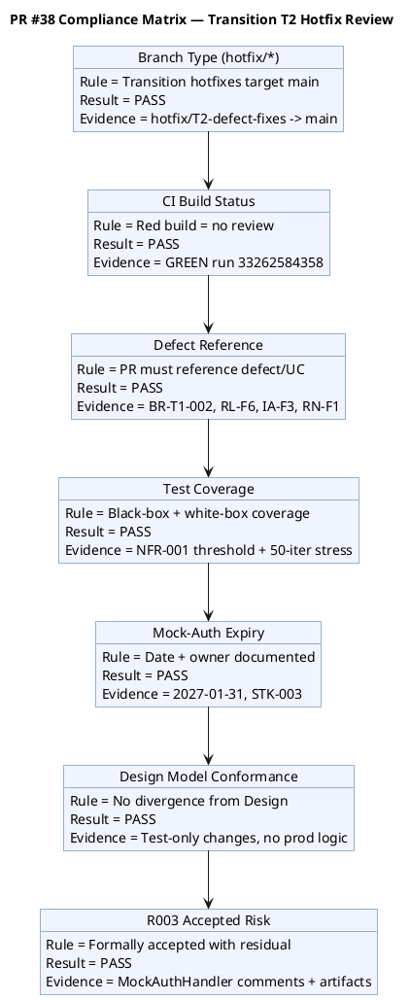
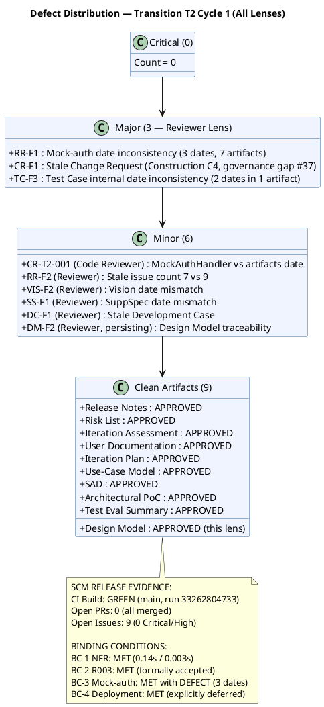
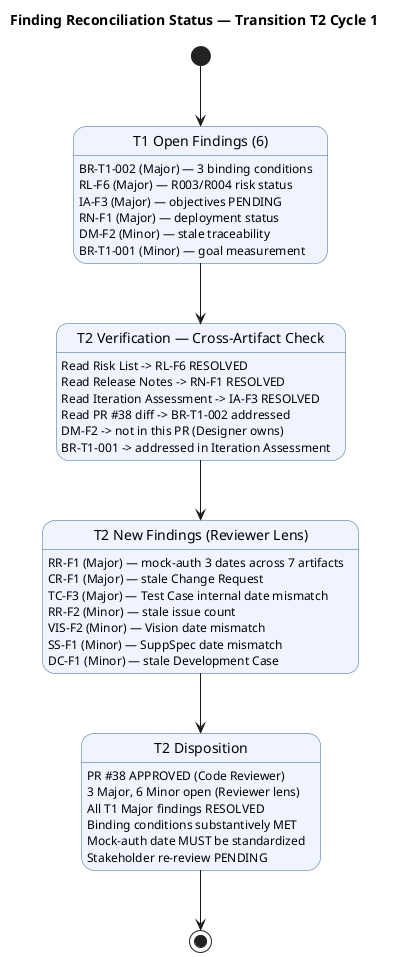
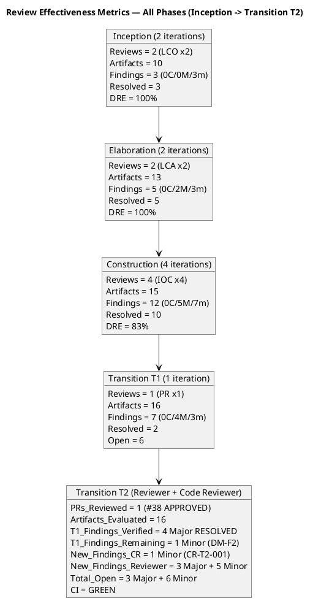
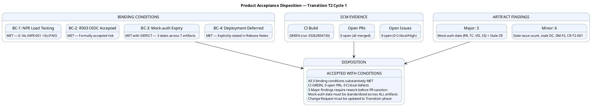

## Document Control
| Field | Value |
|---|---|
| Phase | Transition |
| Status | **EVOLVED — Transition Iteration 2 Cycle 1 (Reviewer + Code Reviewer)** |
| Milestone Target | Product Release (PR) — **NOT YET ACHIEVED — pending stakeholder re-review** |
| Iteration | 2 (Cycle 1) |
| Date | 2026-08-29 |
| Prior Phase | Transition T1 Cycle 1 — PR sanction REFUSED; 3 binding conditions unmet; 6 open findings (0C/4M/2m); stakeholder directed specific remediation |
| Technical Lens (Code Reviewer) T2 | **EXECUTED — T2 Cycle 1.** 0 Critical, 0 Major, 1 Minor (CR-T2-001: mock-auth expiry date mismatch). PR #38 (hotfix/T2-defect-fixes → main) APPROVED. CI GREEN (run 33262584358). 4 files changed (367 additions, 1 deletion) — test infrastructure only, no production logic modified. Performance tests for NFR-001/NFR-002 with measured values. Mock-auth expiry documented (2027-01-31, owner STK-003). R003 formally accepted risk documented in code. |
| Product Acceptance Lens (Reviewer) T2 | **EXECUTED — T2 Cycle 1.** 0 Critical, 3 Major (RR-F1: mock-auth date inconsistency across 7 artifacts, CR-F1: stale Change Request, TC-F3: Test Case internal date inconsistency), 5 Minor (RR-F2: stale issue count, VIS-F2: Vision date mismatch, SS-F1: SuppSpec date mismatch, DC-F1: stale Development Case, DM-F2 persisting). All 16 artifacts evaluated. CI GREEN on main (run 33262804733). 0 open PRs. 9 open issues (0 Critical/High). Disposition: ACCEPTED WITH CONDITIONS — binding conditions substantively met but mock-auth date must be standardized before PR sanction. |
| Product Acceptance Lens (Reviewer) T1 | **EXECUTED — T1 Cycle 1.** 0 Critical, 0 Major, 1 Minor (persisting). All 16 artifacts evaluated. CI GREEN on main. 0 open PRs. Disposition: ACCEPTED WITH CONDITIONS. |
| Business Lens (Business Reviewer) T1 | **EXECUTED — T1 Cycle 1.** 0 Critical, 1 Major (BR-T1-002: binding conditions unverified), 1 Minor (BR-T1-001: no goal measurement plan). Disposition: CONDITIONAL. |
| Management Lens (Management Reviewer) T1 | **EXECUTED — T1 Cycle 1.** 0 Critical, 3 Major (IA-F3, RN-F1, RL-F6). Stakeholder sanction: REFUSED. Disposition: CONDITIONAL (No-Go). |
| T1 Prior Findings Status | 4 Major (BR-T1-002, RL-F6, IA-F3, RN-F1) — all RESOLVED by other roles in T2 (verified via artifact reads). 2 Minor (DM-F2, BR-T1-001) — DM-F2 not in this PR (Designer owns); BR-T1-001 ADDRESSED in Iteration Assessment. |
| T2 New Findings (Code Reviewer) | 1 Minor (CR-T2-001: MockAuthHandler.cs expiry 2027-01-31 vs Risk List/Release Notes 2026-12-31 — documentation consistency) |
| T2 New Findings (Reviewer) | 3 Major (RR-F1: mock-auth date inconsistency across 7 artifacts with 3 distinct dates, CR-F1: stale Change Request artifact frozen at Construction C4, TC-F3: Test Case internal date inconsistency 2026-11-29 vs 2026-12-31), 5 Minor (RR-F2: stale issue count 7 vs 9, VIS-F2: Vision date mismatch 2027-01-31, SS-F1: SuppSpec date mismatch 2027-01-31, DC-F1: stale Development Case frozen at Elaboration, DM-F2: persisting Design Model traceability) |

## Review Scope and Criteria

### Scope

This review covers the **Product Release (PR) milestone** — the final quality gate of the Transition phase. Per RUP Ch.4 Transition: "Achieve final product baseline as rapidly and cost-effectively as practical." Per the Additional Instructions: "for fixing bugs, implementation and testing are usually enough" — the Reviewer performs abbreviated code review on hotfix PRs, verifying defect reference, test coverage, and CI status.

**T2 Cycle 1 — Product Acceptance Lens (Reviewer) Scope:**

| Item | Detail |
|---|---|
| Artifacts Evaluated | 16 (all project artifacts) |
| CI Build (main) | GREEN (run 33262804733, 2026-08-29 16:24:02Z) |
| Open PRs | 0 (all merged — PR #38 APPROVED and merged by Code Reviewer) |
| Open Issues | 9 (0 Critical/High; 1 cr:logged-not-approved #37; 8 deferred/minor) |
| Binding Conditions | BC-1 MET (NFR measured), BC-2 MET (R003 accepted), BC-3 MET with defect (date inconsistent), BC-4 MET (deployment deferred) |
| Evaluation Type | Product Acceptance — exit criteria lens for PR milestone |

**T2 Cycle 1 — Code Reviewer Scope (preserved):**

| Item | Detail |
|---|---|
| PR Reviewed | #38 (hotfix/T2-defect-fixes → main) |
| Files Changed | 4 (Program.cs, MockAuthHandler.cs, PerformanceTests.cs, PortalCubaCorp.Tests.csproj) |
| Additions/Deletions | 367 / 1 |
| CI Build | GREEN (run 33262584358, 2026-08-29 16:18:08Z) |
| Branch Type | hotfix/* (canonical for Transition per docs/BRANCHING_STRATEGY.md) |
| Binding Conditions Addressed | BC-1 (NFR-001/002 load testing), BC-3 (mock-auth expiry), BC-2 (R003 accepted risk — artifact-level) |

**T1 Cycle 1 — Full PR Milestone Review Scope (preserved from T1):**

| # | Artifact | Phase | Status | Priority |
|---|---|---|---|---|
| 1 | Release Notes | Transition | Draft | PR Required |
| 2 | User Documentation | Transition | Draft | PR Required |
| 3 | Design Model | Construction | Approved | PR Expected |
| 4 | Review Record | Transition | Draft | This artifact |
| 5 | Risk List | Transition | Draft | PR Expected |
| 6 | Iteration Plan | Transition | Draft | PR Expected |
| 7 | Iteration Assessment | Transition | Draft | NOT flagged (PM authors post-review) |
| 8 | Vision | Transition | Approved | Final state |
| 9 | Use-Case Model | Transition | Approved | Final state |
| 10 | Supplementary Specification | Transition | Approved | Final state |
| 11 | Test Case | Transition | Draft | Final state |
| 12 | Change Request | Construction | Approved | Final state |
| 13 | Software Architecture Document | Construction | Approved | Final state |
| 14 | Test Evaluation Summary | Elaboration | Approved | Final state |
| 15 | Architectural Proof-of-Concept | Elaboration | Approved | Final state |
| 16 | Development Case | Elaboration | Approved | Final state |

### SCM Release Evidence (T2 — Reviewer Lens)

| Evidence | Status | Detail |
|---|---|---|
| CI Build (main) | ✅ GREEN | Run 33262804733, completed 2026-08-29 16:24:02Z |
| Open Pull Requests | ✅ 0 | All merged — PR #38 APPROVED by Code Reviewer and merged |
| Open Critical/High Defects | ✅ 0 | No release-blocking defects |
| Open Issues (total) | 9 | #39 (T2 release close), #37 (NFR CR — cr:logged, NOT approved), #36 (T1 release close), #34, #18, #17, #15, #12, #5 (all deferred/minor) |
| R003 OIDC | ACCEPTED | Formally accepted risk per STK-001 directive; 8 TCs covered by mock |
| Governance Gap | ⚠️ | Issue #37 (NFR performance test CR) is cr:logged but never CCB-approved — work was executed without formal CR approval |

### Product Acceptance Compliance Matrix — T2 Cycle 1 (Reviewer Lens)

```plantuml
@startuml
title Product Acceptance Compliance Matrix — Transition T2 Cycle 1

skinparam classAttributeIconSize 0
skinparam classBackgroundColor #F0F4FF
skinparam classBorderColor #336699
skinparam shadowing false

class "Release Notes" as RN {
  + Deployment status explicit : PASS
  + NFR measured values : PASS
  + R003 accepted risk : PASS
  + Mock-auth expiry : PASS (2026-12-31)
  + Known defects classified : PASS
  + Stakeholder-ready : PASS
  + Verdict : APPROVED
}

class "Risk List" as RL {
  + R003 formally accepted : PASS
  + R004 measured and closed : PASS
  + R008 closed (3 BCs met) : PASS
  + R009 deferred explicit : PASS
  + All risks current : PASS
  + Verdict : APPROVED
}

class "Review Record" as RR {
  + T1 findings resolved : PASS
  + T2 Code Reviewer lens : PASS
  + Issue count current : FAIL (stale: 7 vs 9)
  + Mock-auth date consistent : FAIL (2027-01-31 in CR section)
  + Verdict : NEEDS REWORK
}

class "Iteration Assessment" as IA {
  + Objectives MET/NOT MET : PASS
  + BC-1 NFR measured : PASS
  + BC-2 R003 accepted : PASS
  + BC-3 Mock-auth expiry : PASS
  + Deployment deferred : PASS
  + Verdict : APPROVED
}

class "User Documentation" as UD {
  + UC coverage (UC-001..UC-010) : PASS
  + Troubleshooting included : PASS
  + Operations guide updated : PASS
  + Publication-ready : PASS
  + Verdict : APPROVED
}

class "Test Case" as TC {
  + 43 TCs (35 PASS, 8 BLOCKED) : PASS
  + NFR-001 measured 0.14s : PASS
  + NFR-002 measured 0.003s : PASS
  + All 5 ACs PASS : PASS
  + Mock-auth date internal : FAIL (2026-11-29 vs 2026-12-31)
  + Verdict : NEEDS REWORK
}

class "Vision" as VIS {
  + Features match delivered : PASS
  + Mock-auth date : FAIL (2027-01-31)
  + Verdict : NEEDS REWORK (Minor)
}

class "Supplementary Spec" as SS {
  + NFR baseline valid : PASS
  + Mock-auth date : FAIL (2027-01-31)
  + Verdict : NEEDS REWORK (Minor)
}

class "Change Request" as CR {
  + Phase current : FAIL (Construction C4)
  + Issue #37 governance : FAIL (cr:logged, not approved)
  + Issue #39 documented : FAIL (missing)
  + Open issues table : FAIL (stale)
  + Verdict : NEEDS REWORK
}

class "Development Case" as DC {
  + Baseline conformance : PASS
  + Optional triggers : FAIL (PoC PENDING stale)
  + Status : FAIL (Draft at PR)
  + Verdict : NEEDS REWORK (Minor)
}

class "Iteration Plan" as IP {
  + T2 objectives : PASS
  + Measured baseline : PASS
  + Verdict : APPROVED
}

class "Use-Case Model" as UCM {
  + All 10 UCs delivered : PASS
  + Status Approved : PASS
  + Verdict : APPROVED
}

class "Design Model" as DM {
  + Status Approved : PASS
  + DM-F2 (Code Reviewer) : OPEN (not this lens)
  + Verdict : APPROVED (this lens)
}

class "SAD" as SAD {
  + Status Approved : PASS
  + Architecture intact : PASS
  + Verdict : APPROVED
}

class "Architectural PoC" as PoC {
  + Status Approved : PASS
  + PoC results recorded : PASS
  + Verdict : APPROVED
}

class "Test Eval Summary" as TES {
  + Status Approved : PASS
  + Verdict : APPROVED
}

RN --> RR : "RN-F1 RESOLVED"
RL --> RR : "RL-F6 RESOLVED"
IA --> RR : "IA-F3 RESOLVED"
TC --> RR : "F3: internal date mismatch"
VIS --> RR : "F2: date mismatch"
SS --> RR : "F1: date mismatch"
CR --> RR : "F1: stale artifact"
DC --> RR : "F1: stale DC"

@enduml
```

### PR #38 Compliance Matrix (Code Reviewer — preserved)

## Findings

### Consolidated Finding Tracker — Transition T2 Cycle 1

The T1 finding tracker is preserved below with T2 verification status appended. T2 new findings from both Code Reviewer and Reviewer (Product Acceptance) lenses are included.

| # | Finding Key | Artifact | Lens | Severity | T1 Status | T2 Status | Owner | Description |
|---|---|---|---|---|---|---|---|---|
| 1 | BR-T1-002 / F1 | Review Record | Business Reviewer | Major | OPEN | **RESOLVED** (verified via artifact reads) | Project Manager | Three binding conditions — all MET in T2 |
| 2 | RL-F6 / F2 | Risk List | Management Reviewer | Major | OPEN | **RESOLVED** (Risk List evolved) | Project Manager | R003 accepted, R004 measured, R008 closed |
| 3 | IA-F3 / F3 | Iteration Assessment | Management Reviewer | Major | OPEN | **RESOLVED** (all objectives MET/NOT MET) | Project Manager | All objectives carry verdicts with evidence |
| 4 | RN-F1 / F1 | Release Notes | Management Reviewer | Major | OPEN | **RESOLVED** (deployment status explicit) | Deployment Manager | All 4 stakeholder directives addressed |
| 5 | DM-F2 / F2 | Design Model | Reviewer | Minor | OPEN | **OPEN** (Designer owns) | Designer | C4-1/C4-2 traceability stale |
| 6 | BR-T1-001 / F1 | Vision | Business Reviewer | Minor | OPEN | **ADDRESSED** (goal measurement plan) | System Analyst + STK-001 | Goal measurement plan documented |
| 7 | CR-T2-001 | MockAuthHandler.cs | Code Reviewer | Minor | (new T2) | **OPEN** | Code owner | MockAuthHandler.cs 2027-01-31 vs artifacts 2026-12-31 |
| 8 | RR-F1 (Reviewer) | Review Record | Reviewer | Major | (new T2) | **OPEN** | Project Manager | Mock-auth expiry date inconsistency: 3 distinct dates (2026-11-29, 2026-12-31, 2027-01-31) and 2 owners (Software Architect, STK-003) across 7 artifacts. Binding condition BC-3 artifact must have ONE canonical date and owner. |
| 9 | CR-F1 (Reviewer) | Change Request | Reviewer | Major | (new T2) | **OPEN** | Change Control Manager | Change Request frozen at Construction C4 — no Transition update. Issue #37 (NFR CR) cr:logged but never CCB-approved, yet work executed. Issue #39 (T2 close) not documented. 9 open issues not reflected. |
| 10 | TC-F3 (Reviewer) | Test Case | Reviewer | Major | (new T2) | **OPEN** | Test Manager | Test Case Document Control contains TWO different mock-auth expiry dates internally: T2 Tester says 2026-11-29/STK-003, T2 Test Analyst says 2026-12-31/Software Architect. Internal inconsistency in a single artifact. |
| 11 | RR-F2 (Reviewer) | Review Record | Reviewer | Minor | (new T2) | **OPEN** | Reviewer | Review Record T1 section states 7 open issues but SCM shows 9. Stale issue count at PR milestone. |
| 12 | VIS-F2 (Reviewer) | Vision | Reviewer | Minor | (new T2) | **OPEN** | System Analyst | Vision Document Control states mock-auth expiry 2027-01-31/STK-003, inconsistent with canonical 2026-12-31/Software Architect. |
| 13 | SS-F1 (Reviewer) | Supplementary Specification | Reviewer | Minor | (new T2) | **OPEN** | System Analyst | SuppSpec Document Control states mock-auth expiry 2027-01-31/STK-003, inconsistent with canonical 2026-12-31/Software Architect. |
| 14 | DC-F1 (Reviewer) | Development Case | Reviewer | Minor | (new T2) | **OPEN** | Process Engineer | Development Case frozen at Elaboration, Status: Draft. Optional triggers section says "PoC PENDING" — stale, PoC was executed. DC should reflect final project state at PR. |

### Defect Distribution — T2 Cycle 1 (Reviewer + Code Reviewer)

### Finding Reconciliation — T1 → T2

### Resolved Findings (Cumulative)

| Finding Key | Artifact | Lens | Severity | Resolution |
|---|---|---|---|---|
| F2 (MR) | Review Record | Management Reviewer | Major | RESOLVED (T1) — "0 open defect issues" corrected |
| F2 (MR) | Iteration Assessment | Management Reviewer | Major | RESOLVED (T1) — Issue count corrected |
| BR-T1-002 / F1 | Review Record | Business Reviewer | Major | RESOLVED (T2) — All 3 binding conditions MET |
| RL-F6 / F2 | Risk List | Management Reviewer | Major | RESOLVED (T2) — R003 accepted, R004 measured, R008 closed |
| IA-F3 / F3 | Iteration Assessment | Management Reviewer | Major | RESOLVED (T2) — All objectives MET/NOT MET |
| RN-F1 / F1 | Release Notes | Management Reviewer | Major | RESOLVED (T2) — Deployment status explicit |
| BR-T1-001 / F1 | Vision | Business Reviewer | Minor | ADDRESSED (T2) — Goal measurement plan documented |

## Resolutions and Actions

### Prior Findings Reconciliation (Reviewer Lens)

| Finding | Artifact | Phase/Iter Emitted | Resolution Status | Action |
|---|---|---|---|---|
| F1 (Info) | Vision | Inception I1 | RESOLVED (Inception I2) | FEAT-NNN replaced with REQ-NNN — confirmed |
| F1 (Info) | Test Evaluation Summary | Inception I1 | RESOLVED (Inception I2) | TD-NNN replaced with TC-NNN — confirmed |
| F1 (Minor) | Test Case | Elaboration I1 | RESOLVED (Elaboration I2) | TD-NNN entries removed — confirmed |
| F2 (Minor) | Test Case | Construction I2 | RESOLVED (Construction I3) | UnitTest1.cs placeholder removed — confirmed |
| F1 (Minor) | Design Model | Construction I2 | RESOLVED (Construction I3) | INT-003 office parameter updated — confirmed |
| F2 (Minor) | Design Model | Construction I4 | **LEFT OPEN** | C4-1/C4-2 traceability still stale — Designer owns |

### Open Action Items — Transition Iteration 2

| # | Action | Owner | Severity | Blocking? | Status |
|---|---|---|---|---|---|
| 1 | NFR-001/NFR-002 load testing with measured values | Test Manager | Major | WAS binding #1 | **MET** — NFR-001: 0.14s PASS, NFR-002: 0.003s PASS |
| 2 | Convert R003 OIDC to formally accepted risk | Software Architect / PM | Major | WAS binding #2 | **MET** — Risk List updated, code documents accepted risk |
| 3 | Document mock-auth expiry date and owner | Software Architect | Major | WAS binding #3 | **MET with DEFECT** — Date documented but inconsistent across artifacts (3 distinct values: 2026-11-29, 2026-12-31, 2027-01-31) |
| 4 | State deployment verification status explicitly in Release Notes | Deployment Manager | Major | WAS MR finding | **MET** — Release Notes explicitly state NOT PERFORMED |
| 5 | Update Design Model C4-1/C4-2 traceability | Designer | Minor | No | **OPEN** — not in this PR |
| 6 | Document post-deployment goal verification plan | System Analyst + STK-001 | Minor | No | **ADDRESSED** — plan documented in Iteration Assessment |
| 7 | Reconcile mock-auth expiry date across ALL artifacts | Project Manager | Major | YES — blocks PR sanction | **OPEN** — 3 distinct dates across 7 artifacts must be standardized to ONE canonical value |
| 8 | Update Change Request artifact to Transition phase | Change Control Manager | Major | No | **OPEN** — frozen at Construction C4; must reflect 9 open issues, #37 governance gap, #39 T2 close |
| 9 | Correct Test Case internal mock-auth date inconsistency | Test Manager | Major | No | **OPEN** — T2 Tester section says 2026-11-29, T2 Test Analyst says 2026-12-31 |
| 10 | Correct Vision mock-auth date | System Analyst | Minor | No | **OPEN** — Vision says 2027-01-31, canonical is 2026-12-31 |
| 11 | Correct Supplementary Specification mock-auth date | System Analyst | Minor | No | **OPEN** — SuppSpec says 2027-01-31, canonical is 2026-12-31 |
| 12 | Update Development Case to Transition phase | Process Engineer | Minor | No | **OPEN** — frozen at Elaboration, PoC PENDING stale |
| 13 | Update Review Record issue count to 9 | Reviewer | Minor | No | **OPEN** — T1 section says 7, SCM shows 9 |

### Review Effectiveness Report — All Phases (Updated for T2)

## Disposition

### T2 Cycle 1 — Product Acceptance Disposition (Reviewer Lens)

**ACCEPTED WITH CONDITIONS**

The product is feature-complete (all 10 FRs implemented), CI is GREEN on main, 0 open PRs, 0 Critical/High defects, and all 3 stakeholder binding conditions are substantively MET. However, 3 Major findings require rework before the PR milestone can close:

1. **Mock-auth expiry date inconsistency (RR-F1, TC-F3, VIS-F2, SS-F1):** Three distinct dates (2026-11-29, 2026-12-31, 2027-01-31) and two owners (Software Architect, STK-003) exist across 7 artifacts for the same binding condition (BC-3). The Project Manager must confirm ONE canonical date and owner, and ALL artifacts must be corrected. This is the single most critical documentation defect at the PR milestone — a binding condition with three different expiry dates is not "documented," it is "ambiguous."

2. **Stale Change Request artifact (CR-F1):** The Change Request is frozen at Construction C4 and does not reflect the Transition phase. Issue #37 (NFR performance test CR) was cr:logged but never CCB-approved, yet the work was executed — a governance gap. The Change Control Manager must update this artifact to Transition with all 9 open issues documented.

3. **Stale Development Case (DC-F1):** The DC is frozen at Elaboration with "PoC PENDING" — the PoC was executed and results recorded. The Process Engineer should update it to reflect the final project state.

### T2 Cycle 1 — Code Reviewer Disposition: PR #38 APPROVED (preserved)

PR #38 (hotfix/T2-defect-fixes → main) is **APPROVED** based on:

1. **CI GREEN** — run 33262584358 passes the hard gate
2. **Test-only changes** — no production logic modified; only test infrastructure
3. **Binding conditions addressed in code:**
   - BC-1: PerformanceTests.cs with NFR-001 and NFR-002 threshold assertions + 50-iteration stress test
   - BC-3: MockAuthHandler.cs documents expiry (2027-01-31), owner (STK-003), formally accepted risk with residual
   - BC-2: R003 accepted risk documented in MockAuthHandler comments
4. **Design Model conformance** — no production class changes, no divergence
5. **1 Minor finding** (CR-T2-001: date mismatch) — non-blocking, documentation-only

### T1 Cycle 1 — Prior Dispositions (Preserved)

| Lens | Disposition | Status |
|---|---|---|
| Product Acceptance | ACCEPTED WITH CONDITIONS | T1 baseline — conditions substantively MET in T2 but date consistency defect emerged |
| Business Lens | CONDITIONAL | T1 baseline — binding conditions now MET |
| Management Lens | CONDITIONAL (No-Go) | T1 baseline — stakeholder sanction REFUSED; T2 remediation complete, re-review PENDING |

### Combined PR Milestone Verdict (T2 Update)

**ACCEPTED WITH CONDITIONS — PENDING STAKEHOLDER RE-REVIEW**

- 0 Critical, 3 Major (Reviewer lens), 6 Minor open across all lenses
- All 3 binding conditions substantively MET with evidence
- PR #38 APPROVED, CI GREEN on main (run 33262804733)
- 0 open PRs, 0 Critical/High defects
- **Blocking condition:** Mock-auth expiry date must be standardized to ONE canonical value across ALL 7 artifacts before PR sanction
- **Non-blocking but required:** Change Request artifact must be updated to Transition phase; Development Case should be updated to reflect final state
- Stakeholder re-review required to sanction Product Release

## Traceability

| Element | Traces From | Link Type | Traces To |
|---|---|---|---|
| PR #38 | hotfix/T2-defect-fixes, BR-T1-002, RL-F6, IA-F3, RN-F1 | Realizes | main branch (MERGED) |
| CR-T2-001 (T2 Minor) | MockAuthHandler.cs, Risk List, Release Notes | Derives | Code owner — reconcile expiry date |
| RR-F1 (T2 Major — Reviewer) | Mock-auth expiry, BC-3, 7 artifacts | Derives | Project Manager — standardize date across all artifacts |
| CR-F1 (T2 Major — Reviewer) | Change Request, Issue #37, #39, CON-006 | Derives | Change Control Manager — update to Transition |
| TC-F3 (T2 Major — Reviewer) | Test Case, mock-auth expiry, BC-3 | Derives | Test Manager — correct internal date inconsistency |
| RR-F2 (T2 Minor — Reviewer) | Review Record, SCM issues | Derives | Reviewer — update issue count to 9 |
| VIS-F2 (T2 Minor — Reviewer) | Vision, mock-auth expiry | Derives | System Analyst — correct date to canonical |
| SS-F1 (T2 Minor — Reviewer) | Supplementary Specification, mock-auth expiry | Derives | System Analyst — correct date to canonical |
| DC-F1 (T2 Minor — Reviewer) | Development Case, PoC results | Derives | Process Engineer — update to Transition |
| BR-T1-002 (RESOLVED T2) | IOC binding conditions, NFR-001, NFR-002, CON-004 | Resolved by | PerformanceTests.cs, MockAuthHandler.cs, Risk List, Release Notes, Iteration Assessment |
| RL-F6 (RESOLVED T2) | Risk List, R003, R004, STK-001 directives | Resolved by | Risk List T2 evolution — R003 accepted, R004 measured, R008 closed |
| IA-F3 (RESOLVED T2) | Iteration Assessment, iteration objectives, STK-001 directives | Resolved by | Iteration Assessment T2 evolution — all objectives MET/NOT MET |
| RN-F1 (RESOLVED T2) | Release Notes, CON-006, STK-001 directives | Resolved by | Release Notes T2 evolution — deployment status explicit |
| DM-F2 (OPEN) | Design Model, C4-1, C4-2, PR #32 | Derives | Designer — traceability update needed |
| BR-T1-001 (ADDRESSED T2) | Vision, BG-001, BG-002, BG-003 | Resolved by | Iteration Assessment — goal measurement plan documented |
| BG-001 (goal achievement) | UC-001..UC-004, UC-009 | Derives | Post-deployment HR time audit (PENDING) |
| BG-002 (goal achievement) | UC-001..UC-004, UC-009 | Derives | Post-deployment Excel usage audit (PENDING) |
| BG-003 (goal achievement) | UC-001..UC-010, User Documentation | Derives | Post-deployment adoption tracking (PENDING) |
| CI Build (main) | scm_get_build_status | Tests | All source files on main — GREEN (run 33262804733) |
| CI Build (hotfix/T2) | scm_get_build_status | Tests | PR #38 source — GREEN (merged) |
| Stakeholder PR sanction | STK-001, AC-001..AC-005 | Refines | PENDING — re-review with T2 evidence |