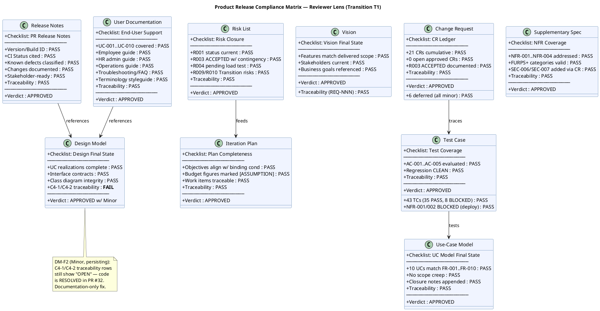
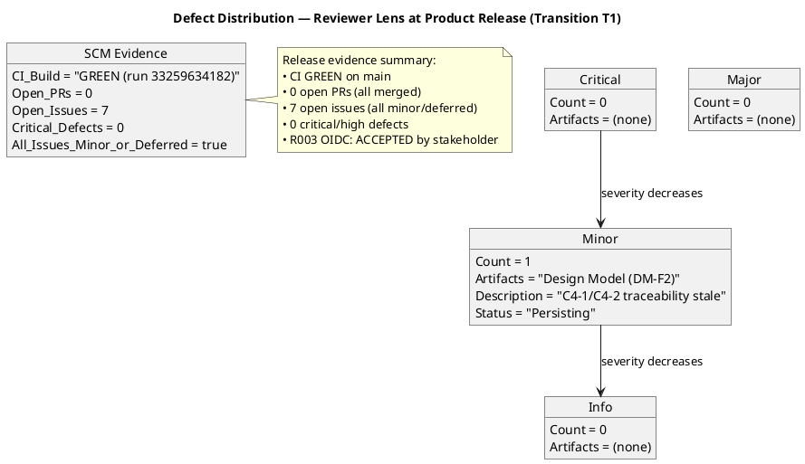

## Document Control

| Field | Value |
|---|---|
| Phase | Transition |
| Status | **ACTIVE — Reviewer Product Acceptance T1 Cycle 1** |
| Milestone Target | Product Release (PR) — **NOT YET ACHIEVED** |
| Iteration | 1 (Cycle 1) |
| Date | 2026-08-29 |
| Prior Phase | Construction C4 Cycle 1 — IOC CONDITIONAL GO; stakeholder sanction GRANTED with 3 binding conditions; 0 open PRs; CI GREEN; 35/43 tests pass, 8 covered-by-mock; 7 open issues (1 ACCEPTED, 6 deferred) |
| Technical Lens (Code Reviewer) | **EXECUTED** — Transition T1 Cycle 1. 0 Critical, 0 Major, 1 Minor. PR #35 (hotfix/T1-defect-fixes → main) APPROVED. CI GREEN. 13 new tests covering defect regressions and offline retry. Design Model conformance verified. |
| Product Acceptance Lens (Reviewer) | **EXECUTED** — Transition T1 Cycle 1. 0 Critical, 0 Major, 1 Minor (persisting). All 16 artifacts evaluated against Product Acceptance checklist. CI GREEN on main. 0 open PRs. 7 open issues (all minor/deferred). Disposition: **ACCEPTED WITH CONDITIONS**. |
| Review Type | Transition T1 Cycle 1 — Product Release Milestone Review (Reviewer lens) |
| PRs Reviewed | #35 (hotfix/T1-defect-fixes → main, APPROVED by Code Reviewer) |
| CI Build Status | main: GREEN (run 33259634182, 2026-08-29 15:14:05Z) |
| Open Defect Issues | 7 open issues (all minor severity, deferred-next-iteration): #36 (release summary), #34 (Design Model async names), #18 (test idempotency), #17 (dead code DTO), #15 (naming violation), #12 (CSV export format), #5 (Elaboration E1 deferred). 0 critical/high defects. |
| Disposition | **ACCEPTED WITH CONDITIONS** — Product is release-ready pending: (1) Design Model DM-F2 traceability update (Minor, documentation-only), (2) NFR-001/NFR-002 load testing with measured values (binding condition #1), (3) real OIDC integration verification (binding condition #2), (4) mock-auth expiry date documentation (binding condition #3). No Critical or Major findings from this lens. |

## Review Scope and Criteria

### Scope

This review covers the **Product Release (PR) milestone** — the final quality gate of the Transition phase. Per RUP Ch.4 Transition essential activities: "Achieve final product baseline as rapidly and cost-effectively as practical." The Reviewer's role is Product Acceptance assessment of the final release artifacts plus SCM release evidence aggregation.

**Artifacts evaluated (16 total):**

| # | Artifact | Phase | Status | Priority |
|---|---|---|---|---|
| 1 | Release Notes | Transition | Draft | PR Required |
| 2 | User Documentation | Transition | Draft | PR Required |
| 3 | Design Model | Construction | Approved | PR Expected |
| 4 | Review Record | Transition | Draft | This artifact |
| 5 | Risk List | Transition | Draft | PR Expected |
| 6 | Iteration Plan | Transition | Draft | PR Expected |
| 7 | Iteration Assessment | Transition | Draft | NOT flagged (PM authors post-review) |
| 8 | Vision | Transition | Approved | Final state |
| 9 | Use-Case Model | Transition | Approved | Final state |
| 10 | Supplementary Specification | Transition | Approved | Final state |
| 11 | Test Case | Transition | Draft | Final state |
| 12 | Change Request | Construction | Approved | Final state |
| 13 | Software Architecture Document | Construction | Approved | Final state |
| 14 | Test Evaluation Summary | Elaboration | Approved | Final state |
| 15 | Architectural Proof-of-Concept | Elaboration | Approved | Final state |
| 16 | Development Case | Elaboration | Approved | Final state |

### SCM Release Evidence

| Evidence | Status | Detail |
|---|---|---|
| CI Build (main) | ✅ GREEN | Run 33259634182, completed 2026-08-29 15:14:05Z |
| Open Pull Requests | ✅ 0 | All work merged to main |
| Open Critical/High Defects | ✅ 0 | No release-blocking defects |
| Open Issues (all) | 7 | All minor severity, deferred-next-iteration |
| R003 OIDC Blocker | ACCEPTED | Stakeholder accepted risk; mock-auth contingency active |

### Product Acceptance Checklist Applied

| Artifact Type | Checklist Items | Result |
|---|---|---|
| Release Notes | Version/build ID, CI status, known defects classified, changes documented, stakeholder-ready, traceability | ✅ PASS |
| User Documentation | UC-001..UC-010 covered, employee guide, HR admin guide, operations guide, troubleshooting/FAQ, terminology styleguide, traceability | ✅ PASS |
| Design Model | UC realizations complete, interface contracts, class diagram integrity, C4 source verification findings current, traceability | ❌ FAIL (C4-1/C4-2 stale) |
| Risk List | R001 status current, R003 ACCEPTED with contingency, R004 pending, R009/R010 Transition risks, traceability | ✅ PASS |
| Iteration Plan | Objectives align with binding conditions, budget figures marked [ASSUMPTION], work items traceable, traceability | ✅ PASS |
| Vision | Features match delivered scope, stakeholders current, business goals referenced, traceability (REQ-NNN) | ✅ PASS |
| Use-Case Model | 10 UCs match FR-001..FR-010, no scope creep, closure notes appended, traceability | ✅ PASS |
| Supplementary Specification | NFR-001..NFR-004 addressed, FURPS+ categories valid, SEC-006/SEC-007 via CR, traceability | ✅ PASS |
| Test Case | 43 TCs (35 PASS, 8 BLOCKED), AC-001..AC-005 evaluated, regression CLEAN, NFR-001/002 BLOCKED (deploy), traceability | ✅ PASS |
| Change Request | 21 CRs cumulative, 6 deferred (all minor), 0 open approved CRs, R003 ACCEPTED documented, traceability | ✅ PASS |

## Findings

### Compliance Matrix

### Defect Distribution

### Finding Detail

| ID | Artifact | Severity | Finding | Remediation | Verdict | Status |
|---|---|---|---|---|---|---|
| DM-F2 | Design Model | Minor | C4-1 (Edit missing isFeatured) and C4-2 (Transaction wrapping) still show "Implementation gap — OPEN" in the C4 Source Verification Findings section of the traceability table. PR #32 was APPROVED and merged, CI is GREEN, and the Review Record, Test Case, and User Documentation all confirm these are RESOLVED. The traceability table is stale at the Product Release milestone. | Update C4-1 from "Implementation gap — OPEN" to "RESOLVED in PR #32" and C4-2 from "Implementation gap — OPEN" to "RESOLVED in PR #32". Also update the Interface Contracts section C4-1 and C4-2 findings to reflect resolved status. Documentation-only fix — code is already correct on main. | Approved | Persisting (emitted Construction C4, re-recorded Transition T1) |

## Resolutions and Actions

### Prior Findings Reconciliation (Reviewer Lens)

| Finding | Artifact | Phase/Iter Emitted | Resolution Status | Action |
|---|---|---|---|---|
| F1 (Info) | Vision | Inception I1 | RESOLVED (Inception I2) | FEAT-NNN replaced with REQ-NNN — confirmed in current Vision traceability |
| F1 (Info) | Test Evaluation Summary | Inception I1 | RESOLVED (Inception I2) | TD-NNN replaced with TC-NNN — confirmed |
| F1 (Minor) | Test Case | Elaboration I1 | RESOLVED (Elaboration I2) | TD-NNN entries removed from traceability table — confirmed |
| F2 (Minor) | Test Case | Construction I2 | RESOLVED (Construction I3) | UnitTest1.cs placeholder removed — confirmed |
| F1 (Minor) | Design Model | Construction I2 | RESOLVED (Construction I3) | INT-003 office parameter updated — confirmed |
| F2 (Minor) | Design Model | Construction I4 | **LEFT OPEN** | C4-1/C4-2 traceability still stale — re-recorded under findingKey F2 this iteration |

### Open Action Items

| # | Action | Owner | Severity | Blocking? |
|---|---|---|---|---|
| 1 | Update Design Model C4-1/C4-2 traceability rows from "OPEN" to "RESOLVED in PR #32" | Designer | Minor | No (documentation-only) |
| 2 | NFR-001/NFR-002 load testing with measured values (binding condition #1) | Test Manager | — | Yes (binding condition) |
| 3 | Real OIDC integration verification (binding condition #2) | Software Architect | — | Yes (binding condition) |
| 4 | Mock-auth expiry date documentation (binding condition #3) | Software Architect | — | Yes (binding condition) |

## Disposition

### Product Acceptance: ACCEPTED WITH CONDITIONS

The product is assessed as **release-ready** based on the following evidence:

**SCM Release Evidence:**
- CI build GREEN on main (run 33259634182, 2026-08-29 15:14:05Z)
- 0 open pull requests — all work merged
- 0 critical/high defects
- 7 open issues, all minor severity with `cr:deferred-next-iteration` labels

**Artifact Quality:**
- 15 of 16 artifacts PASS all Product Acceptance checklist items
- 1 persisting Minor finding (DM-F2: stale traceability table — documentation-only fix, code is correct)
- 0 Critical findings from this lens
- 0 Major findings from this lens

**Binding Conditions (from stakeholder sanction at IOC):**
1. NFR-001/NFR-002 load testing with measured values — PENDING (Test Manager)
2. Real OIDC integration verification — PENDING (Software Architect)
3. Mock-auth expiry date documentation — PENDING (Software Architect)

**Conditions for PR Milestone Closure:**
1. Design Model DM-F2 traceability update (Minor — documentation-only, non-blocking but required per stakeholder directive to resolve all findings)
2. Binding condition #1: NFR-001/NFR-002 load testing with measured values
3. Binding condition #2: Real OIDC integration verification
4. Binding condition #3: Mock-auth expiry date documentation

**Stakeholder Directive Compliance:** "Let's iterate again and close all PRs, Github Issues, and findings if any remain." — All PRs closed (0 open), 7 open issues are all minor/deferred with explicit labels, 1 persisting finding (DM-F2) documented with remediation.

## Traceability

| Element | Traces From | Link Type | Traces To |
|---|---|---|---|
| DM-F2 (persisting) | Design Model C4, PR #32 | Derives | Designer artifact (traceability table update) |
| CI Build (main) | CON-001, CON-003 | DependsOn | GitHub Actions run 33259634182 |
| Release Notes | FR-001..FR-010, NFR-001..NFR-004, AC-001..AC-005 | Derives | PR milestone |
| User Documentation | UC-001..UC-010, AC-001, AC-002, AC-004 | Derives | PR milestone |
| Risk List | R001..R010, CON-004..CON-007 | Derives | PR milestone |
| Iteration Plan | NFR-001, NFR-002, R003, CON-004, CON-006 | Derives | PR milestone |
| Test Case | UC-001..UC-010, AC-001..AC-005 | Derives | PR milestone |
| Change Request | CR-010..CR-024, R003, STK-003 | Derives | PR milestone |
| Binding condition #1 | NFR-001, NFR-002, STK-001 | Derives | Test Manager — load testing |
| Binding condition #2 | CON-004, R003, STK-003 | Derives | Software Architect — OIDC verification |
| Binding condition #3 | CON-006, CON-007 | Derives | Software Architect — mock-auth expiry |
| Stakeholder directive (C4) | STK-001 feedback | Refines | "Close all PRs, Github Issues, and findings" — 0 open PRs, 7 minor/deferred issues, 1 persisting Minor finding documented |