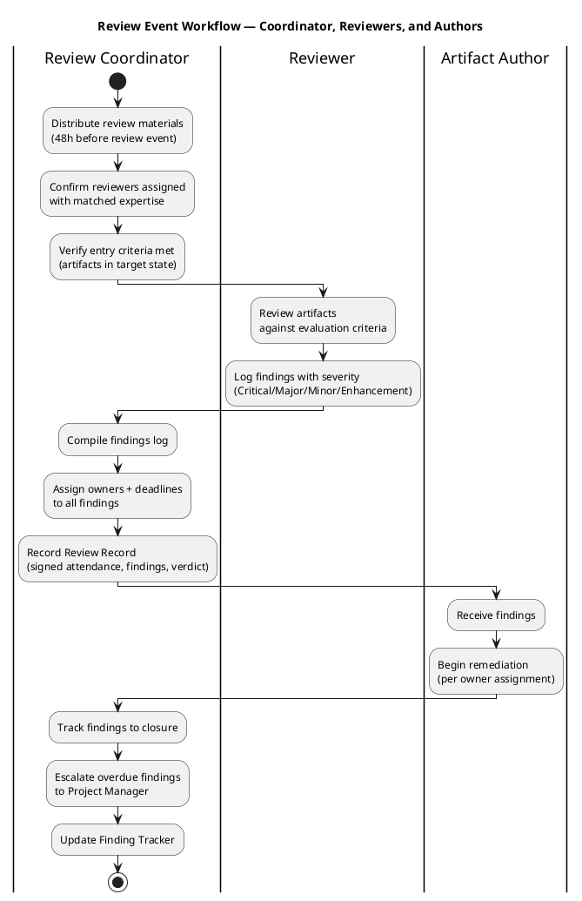
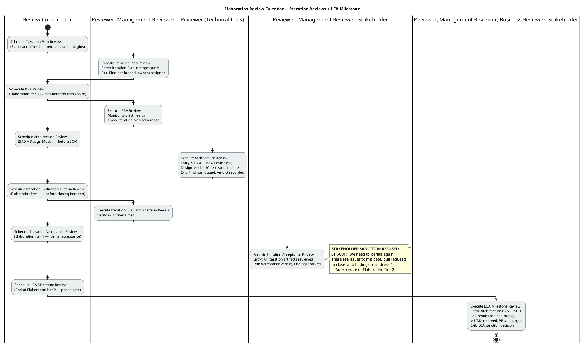
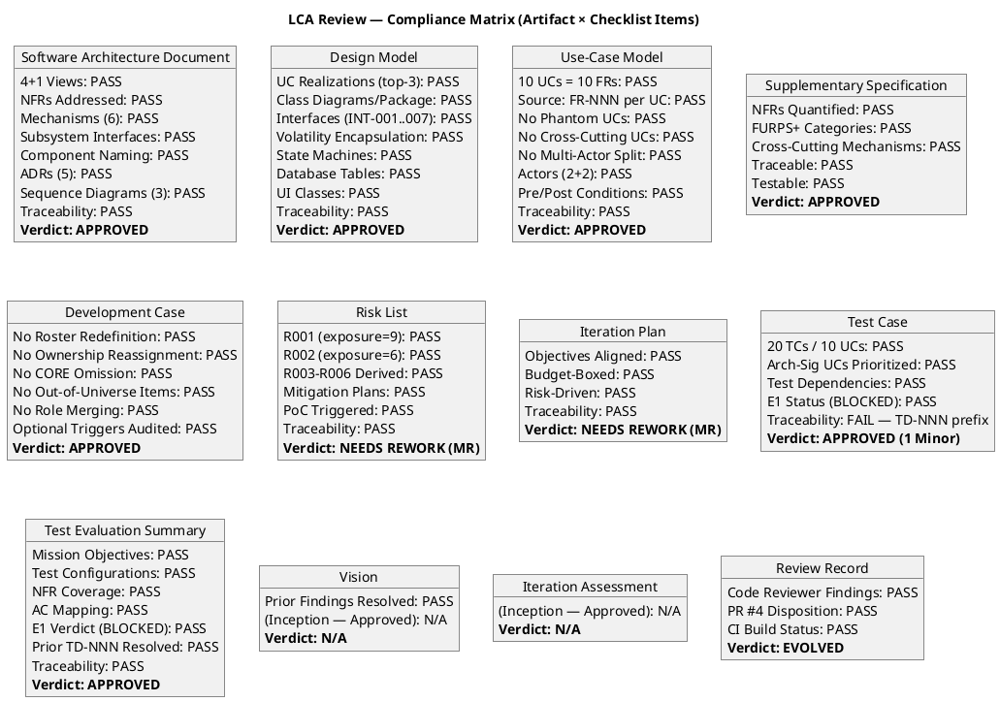
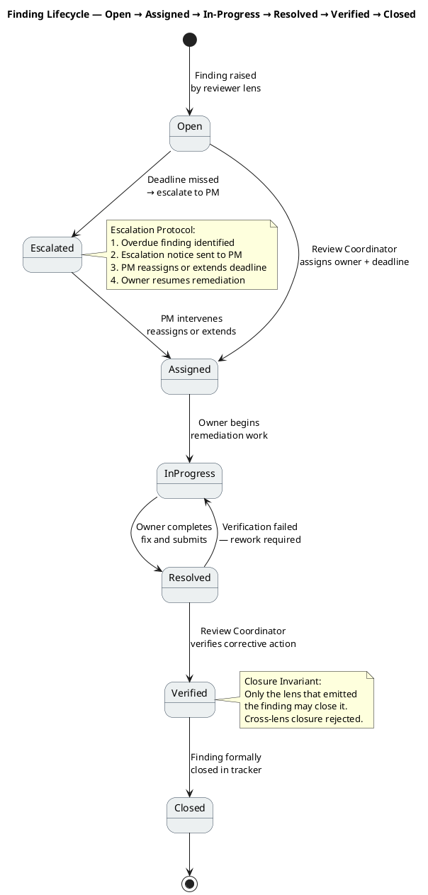

## Document Control
| Field | Value |
|---|---|
| Phase | Elaboration |
| Status | Draft |
| Milestone Target | End of Elaboration (LCA) |
| Iteration | 1 (Cycle 1) |
| Date | 2026-08-28 |
| Review Coordinator | Review Coordinator (Project Management Discipline) — LCA Milestone Consolidation |
| Reviewer | Reviewer (Project Management Discipline) — LCA Technical Lens — EXECUTED |
| Management Reviewer | Management Reviewer (Project Management Discipline) — LCA Management Lens — EXECUTED |
| Business Reviewer | Business Reviewer — LCA Business Lens — EXECUTED |
| Code Reviewer | Code Reviewer (Implementation Discipline) — E1 PR Review — EXECUTED |
| Review Type | LCA Milestone Review — Technical + Management + Business + Code Assessment |
| PR Reviewed | #4 — Elaboration E1: Architectural Infrastructure Prototype (feature/E1-architectural-infrastructure → iteration/E1) |
| CI Build Status | PASS (green) — feature/E1-architectural-infrastructure, completed 2026-08-28 11:11:24Z |
| Prior Phase | Inception LCO Review — all findings resolved, sanction GRANTED |
| Stakeholder Sanction | **REFUSED** — STK-001: "We need to iterate again. There are issues to mitigate, pull requests to close, and findings to address, even if they're minor." |
| Management Verdict | **CONDITIONAL** — 8 conditions for LCA closure at end of Iter 2 |
| Consolidated Verdict | **NOT ACHIEVED** — 0 Critical, 3 Major (open), 2 Minor (open) — auto-iterate to Elaboration Iter 2 |
| Open Findings | 5 (3 Major, 2 Minor) — all with owners and deadlines for Elaboration Iter 2 |
| Review Coverage | 100% (12/12 artifacts reviewed) |
## Review Scope and Criteria
### Review Process Framework

| Review Type | Triggering Activity | Required Participants | Entry Criteria | Exit Criteria | Primary Output |
|---|---|---|---|---|---|
| Iteration Plan Review | Plan for Next Iteration | Review Coordinator, Reviewer, Management Reviewer | Iteration Plan in target state; agenda distributed 48h advance | Findings logged; owners assigned; Review Record signed | Review Record (iteration plan section) |
| PRA Review | Manage Iteration (mid-checkpoint) | Review Coordinator, Reviewer | Iteration in progress; artifacts available for inspection | Project health assessed; deviations documented | PRA Review Record |
| Architecture Review | SAD + Design Model produced | Review Coordinator, Reviewer (technical lens), Software Architect | SAD 4+1 views complete; Design Model UC realizations done | Architecture findings logged; verdict recorded | Architecture Review Record |
| Iteration Evaluation Criteria Review | Close-Out Iteration | Review Coordinator, Reviewer, Management Reviewer | All iteration artifacts reviewed; exit criteria defined | Exit criteria verified; gaps documented | Evaluation Criteria Record |
| Iteration Acceptance Review | Close-Out Iteration | Review Coordinator, Reviewer, Management Reviewer, Stakeholder | All findings from prior reviews tracked; artifacts in target state | Acceptance verdict; stakeholder sanction decision | Acceptance Review Record |
| LCA Milestone Review | Close-Out Phase (Elaboration) | Review Coordinator, Reviewer, Management Reviewer, Business Reviewer, Stakeholder | Architecture BASELINED; PoC results for R001/R006; M1/M2 resolved; PR #4 merged | LCA sanction decision; phase gate decision | LCA Milestone Review Record |

### Review Event Workflow

### Elaboration Review Calendar

### Review Process

This LCA milestone review evaluates ALL Elaboration artifacts against the Lifecycle Architecture exit criteria. The review applies the technical lens: architecture baseline integrity, design model completeness, use-case realization coverage, NFR addressability, risk mitigation status, and SCM evidence.

| # | Checklist Item | Source | Result |
|---|---|---|---|
| 1 | SAD 4+1 Views Complete | RUP Elaboration exit criteria | ✅ PASS — all 5 views baselined |
| 2 | SAD NFRs Addressed | NFR-001..NFR-004 | ✅ PASS — all mapped to design mechanisms |
| 3 | SAD Subsystem Interfaces | COMP-001..COMP-008 | ✅ PASS — all interface-based |
| 4 | SAD Component Naming | Anti-pattern check | ✅ PASS — function-named, not layer-named |
| 5 | SAD ADRs Present | ADR-001..ADR-005 | ✅ PASS — 5 architectural decisions documented |
| 6 | SAD Sequence Diagrams | Top-3 arch-sig UCs | ✅ PASS — UC-009, UC-001, UC-005 |
| 7 | Design Model UC Realizations | Top-3 arch-sig UCs | ✅ PASS — UC-001, UC-005, UC-009 |
| 8 | Design Model Interfaces | INT-001..INT-007 | ✅ PASS — full signatures |
| 9 | Design Model Volatility Encapsulation | R001 (LDAP) | ✅ PASS — encapsulated in COMP-005/INT-006 |
| 10 | UC Model 1:1 FR Mapping | FR-001..FR-010 | ✅ PASS — 10 UCs, each cites Source: FR-NNN |
| 11 | UC Model No Cross-Cutting UCs | Scope Guard Rule 7 | ✅ PASS — auth/audit in SuppSpec |
| 12 | UC Model No Phantom UCs | Scope Guard Rule 1 | ✅ PASS — all cite declared FRs |
| 13 | Supp Spec NFRs Quantified | NFR-001..NFR-004 | ✅ PASS — all have measurable thresholds |
| 14 | Supp Spec Cross-Cutting Mechanisms | Scope Guard Rule 7 | ✅ PASS — OIDC, audit, LDAP in SuppSpec |
| 15 | Dev Case Baseline Conformance | IARI DC baseline | ✅ PASS — no roster/ownership/CORE violations |
| 16 | Dev Case Optional Triggers | §5.2 conditions | ✅ PASS — PoC triggered (R001), others correctly NOT triggered |
| 17 | Risk List Complete | R001..R006 | ✅ PASS — all risks with mitigation plans |
| 18 | Iteration Plan Objectives | Elaboration goals | ✅ PASS — 5 objectives, risk-driven |
| 19 | Test Case Coverage | 10 UCs | ✅ PASS — 20 TCs covering all UCs |
| 20 | Test Eval Summary | E1 status | ✅ PASS — BLOCKED status legitimate |
| 21 | CI Build Status (SCM Evidence) | PR #4 branch | ✅ PASS — green build |
| 22 | PR #4 Scope Classification | RUP Ch.4 | ✅ IN-SCOPE — evolutionary architectural mechanism |
| 23 | Traceability Compliance | All artifacts | ✅ PASS — all reference upstream IDs |
| 24 | UML Diagram Validation | All artifacts | ✅ PASS — notation correct, multiplicities present |

### Artifacts Reviewed

| Artifact | Source | Read | Verdict |
|---|---|---|---|
| Software Architecture Document | Elaboration Draft | ✅ Full content | APPROVED |
| Design Model | Elaboration Draft | ✅ Full content | APPROVED |
| Use-Case Model | Elaboration Draft | ✅ Full content | APPROVED |
| Supplementary Specification | Elaboration Draft | ✅ Full content | APPROVED |
| Development Case | Elaboration Draft | ✅ Full content | APPROVED |
| Risk List | Elaboration Draft | ✅ Full content | NEEDS REWORK (MR lens) |
| Iteration Plan | Elaboration Draft | ✅ Full content | NEEDS REWORK (MR lens) |
| Test Case | Elaboration Draft | ✅ Full content | APPROVED (1 Minor) |
| Test Evaluation Summary | Elaboration Draft | ✅ Full content | APPROVED |
| Vision | Inception Approved | ✅ Full content | N/A (Inception) |
| Iteration Assessment | Inception Approved | ✅ Full content | N/A (Inception) |
| Review Record | Elaboration Draft | ✅ Full content | EVOLVED (this update) |
| PR #4 Diff | 43 files, +2958/-482 | ✅ Full diff | REQUEST_CHANGES (Code Reviewer) |
| SCM Issues #1-#6 | Issue tracker | ✅ All issues | See disposition |

### Lens Participation

| Lens | Role | Status | Verdict |
|---|---|---|---|
| Technical | Reviewer | EXECUTED | APPROVED — 0 Critical, 0 Major (artifact-level), 1 Minor |
| Business | BusinessReviewer | EXECUTED | APPROVED — 0 findings (Business Modeling INACTIVE) |
| Management | ManagementReviewer | EXECUTED | CONDITIONAL — 0 Critical, 1 Major (Risk List), 1 Minor (Iteration Plan) |
| Code | CodeReviewer | EXECUTED (prior — PR #4) | REQUEST_CHANGES — 2 Major (M1, M2 implementation divergences) |

### Compliance Matrix

## Findings
### Finding Lifecycle

### Finding Tracker — Elaboration Iter 1 (Consolidated, All Lenses)

| # | Key | Severity | Artifact | Lens | Finding (Summary) | Owner | Deadline | Status |
|---|---|---|---|---|---|---|---|---|
| 1 | M1 | Major | PR #4 / Review Record | Code Reviewer | IAuditLogger (INT-005) signature mismatch — implementation LogAudit() does not match Design Model interface contract | Implementer | Elaboration Iter 2 | Open — Assigned |
| 2 | M2 | Major | PR #4 / Review Record | Code Reviewer | IPersistence (INT-007) transaction API mismatch — implementation does not expose transaction boundary method defined in Design Model | Implementer | Elaboration Iter 2 | Open — Assigned |
| 3 | MR-F1 | Major | Risk List | Management Reviewer | R001/R006 in MITIGATING without PoC results; R003 OIDC registration pending — insufficient for LCA closure | Software Architect | Elaboration Iter 2 | Open — Assigned |
| 4 | F1 | Minor | Test Case | Reviewer | TD-NNN prefix not in standard ID conventions — declare in Dev Case or replace with inline descriptions | Test Designer / Process Engineer | Elaboration Iter 2 | Open — Assigned |
| 5 | MR-F2 | Minor | Iteration Plan | Management Reviewer | Iteration count mismatch — narrative says "6 iterations" but roadmap table shows 7 | Project Manager | Elaboration Iter 2 | Open — Assigned |

### Prior Findings (Resolved — Inception)

| # | Key | Severity | Artifact | Lens | Finding (Summary) | Resolution |
|---|---|---|---|---|---|---|
| P1 | F1 | Info | Vision | Reviewer | FEAT-NNN prefix non-standard | Resolved (Inception Iter 2) — replaced with REQ-NNN |
| P2 | F1 | Minor | Vision | Management Reviewer | FEAT-NNN prefix non-standard (management lens) | Resolved (Inception Iter 2) — replaced with REQ-NNN |
| P3 | F1 | Info | Test Evaluation Summary | Reviewer | TD-NNN prefix non-standard | Resolved (Inception Iter 2) — replaced with TC-NNN |

### Defect Distribution (All Lenses Combined)

### Review Effectiveness Metrics — Elaboration Iter 1

| Metric | Value | Interpretation |
|---|---|---|
| Artifacts Planned for Review | 12 | All Elaboration artifacts + Inception carry-over |
| Artifacts Reviewed | 12 (100%) | Full coverage — no artifacts skipped |
| Total Findings Raised | 5 (3 Major, 2 Minor) | Plus 3 prior resolved (Inception) |
| Critical Findings | 0 | No blockers — architecture is sound |
| Major Findings | 3 | 2 implementation divergences (PR #4) + 1 risk evidence gap |
| Minor Findings | 2 | 1 ID prefix convention + 1 iteration count text error |
| Defect Density (Major) | 3 Major / 12 artifacts = 0.25/artifact | Acceptable — concentrated in implementation + risk evidence, not design |
| Review Coverage | 100% (12/12) | All planned artifacts received formal review |
| Defect Removal Efficiency | 5 found in review / 0 found in test = 100% (test BLOCKED) | Test execution blocked by PR #4 — all defects found by review, none by test yet |
| Rework Effort | [ASSUMPTION — requires validation] Not yet measured in tokens for this iteration | Will be quantified at iteration close |
| Open Findings | 5 (all targeted for Elaboration Iter 2) | All have owners and deadlines — no orphaned findings |
| Overdue Findings | 0 | All findings assigned within iteration — no deadlines missed yet |
## Resolutions and Actions
### Prior Findings Reconciliation

| Finding | Lens | Status | Disposition |
|---|---|---|---|
| Vision FEAT-NNN prefix (Info) | Reviewer | Resolved (Inception Iter 2) | No action — already closed |
| Vision FEAT-NNN prefix (Minor) | ManagementReviewer | Resolved (Inception Iter 2) | No action — already closed (other lens) |
| Test Eval Summary TD-NNN prefix (Info) | Reviewer | Resolved (Inception Iter 2) | No action — already closed |

### Open Action Items — Elaboration Iter 2 Target

| # | Action | Owner | Priority | Target | Source | Finding Key |
|---|---|---|---|---|---|---|
| 1 | Fix M1: Align IAuditLogger implementation with INT-005 Design Model contract | Implementer | High | Elaboration Iter 2 | Code Reviewer | M1 |
| 2 | Fix M2: Align IPersistence implementation with INT-007 Design Model contract | Implementer | High | Elaboration Iter 2 | Code Reviewer | M2 |
| 3 | Merge PR #4 after M1/M2 fixes | Integrator | High | Elaboration Iter 2 | Code Reviewer | M1, M2 |
| 4 | Fix MR-F1: Execute R001/R006 PoCs and update Risk List with results (RETIRED/ESCALATED) | Software Architect | High | Elaboration Iter 2 | Management Reviewer | MR-F1 |
| 5 | Confirm R003 OIDC registration with STK-003 or activate mock auth contingency | Software Architect | High | Elaboration Iter 2 | Management Reviewer | MR-F1 |
| 6 | Change SAD status from DRAFT to BASELINED after M1/M2 resolution | Software Architect | High | Elaboration Iter 2 | Management Reviewer | MR-F1 |
| 7 | Fix F1: Declare TD prefix in Development Case or replace with inline descriptions | Test Designer / Process Engineer | Low | Elaboration Iter 2 | Reviewer | F1 |
| 8 | Fix MR-F2: Correct iteration count from "6" to "7" in Iteration Plan narrative | Project Manager | Low | Elaboration Iter 2 | Management Reviewer | MR-F2 |
| 9 | CR-001 (LDAP PoC): Execute and validate across 3 offices | Software Architect | High | Elaboration Iter 2 | Iteration Plan | — |
| 10 | CR-002 (Offline retry PoC): Execute and validate AC-005 mechanism | Software Architect | High | Elaboration Iter 2 | Iteration Plan | — |
| 11 | CR-003 (Audit trail validation): Validate NFR-004 implementation | Test Designer | Medium | Elaboration Iter 2 | Iteration Plan | — |
| 12 | Re-consult stakeholder for LCA sanction after all conditions resolved | Management Reviewer | High | Elaboration Iter 2 | Management Reviewer | — |

### Escalation Status

| Finding | Overdue? | Escalation Notice | Status |
|---|---|---|---|
| M1 (IAuditLogger) | No — deadline is Elaboration Iter 2 | Not yet required | On track |
| M2 (IPersistence) | No — deadline is Elaboration Iter 2 | Not yet required | On track |
| MR-F1 (Risk List PoCs) | No — deadline is Elaboration Iter 2 | Not yet required | On track |
| F1 (TD-NNN prefix) | No — deadline is Elaboration Iter 2 | Not yet required | On track |
| MR-F2 (iteration count) | No — deadline is Elaboration Iter 2 | Not yet required | On track |

No findings are overdue. All 5 open findings have assigned owners and deadlines targeted for Elaboration Iter 2. No escalation notices are required at this time.
## Disposition
### Per-Artifact Verdicts

| Artifact | Verdict | Rationale |
|---|---|---|
| Software Architecture Document | **APPROVED** | All 4+1 views baselined, 8 components interface-based, 5 ADRs, 3 sequence diagrams, NFRs addressed, traceability complete |
| Design Model | **APPROVED** | UC realizations for top-3 arch-sig UCs, full interface signatures, volatility encapsulated, state machines, DB tables, UI classes |
| Use-Case Model | **APPROVED** | 10 UCs 1:1 with 10 FRs, each cites Source: FR-NNN, no phantom/cross-cutting/multi-actor-split UCs |
| Supplementary Specification | **APPROVED** | NFRs quantified, FURPS+ complete, cross-cutting mechanisms in SuppSpec with <<include>> |
| Development Case | **APPROVED** | No baseline violations, optional triggers correctly justified (PoC fired for R001, others correctly not fired) |
| Risk List | **NEEDS REWORK** (MR lens) | R001/R006 MITIGATING without PoC results; R003 external dependency pending; stakeholder refused sanction |
| Iteration Plan | **NEEDS REWORK** (MR lens) | Iteration count inconsistency (says 6, table shows 7); otherwise feasible and well-structured |
| Test Case | **APPROVED (1 Minor)** | 20 TCs covering all 10 UCs, arch-sig UCs prioritized, 1 Minor finding (TD-NNN prefix) |
| Test Evaluation Summary | **APPROVED** | Mission defined, NFR coverage assessed, E1 BLOCKED status legitimate |
| Vision | **N/A** | Inception artifact, already Approved |
| Iteration Assessment | **N/A** | Inception artifact, already Approved |

### Overall LCA Disposition — Consolidated Milestone Decision

**Lens Participation (authoritative — per Work Order):**

| Lens | Role | Executed? | Verdict |
|---|---|---|---|
| Technical | Reviewer | EXECUTED | APPROVED — 0 Critical, 0 Major (artifact-level), 1 Minor |
| Business | BusinessReviewer | EXECUTED | APPROVED — 0 findings (Business Modeling INACTIVE) |
| Management | ManagementReviewer | EXECUTED | CONDITIONAL — 0 Critical, 1 Major (Risk List), 1 Minor (Iteration Plan) |
| Code | CodeReviewer | EXECUTED (prior — PR #4) | REQUEST_CHANGES — 2 Major (M1, M2 implementation divergences) |

**Consolidated Finding Summary:**

| Severity | Count | Artifacts | Lenses |
|---|---|---|---|
| Critical | 0 | — | — |
| Major | 3 | PR #4 (M1, M2), Risk List (MR-F1) | Code Reviewer (2), Management Reviewer (1) |
| Minor | 2 | Test Case (F1), Iteration Plan (MR-F2) | Reviewer (1), Management Reviewer (1) |
| Info | 0 | — | — |
| **Total Open** | **5** | | |

**Technical Lens (Reviewer): APPROVED — Architecture baseline technically sound.**

The Elaboration artifact set is technically sound:
- **0 Critical findings** — no blockers
- **0 Major findings** (at the artifact level) — the 2 Major findings from the Code Reviewer are implementation-level defects in PR #4, not defects in the Design Model or SAD artifacts themselves
- **1 Minor finding** (TD-NNN prefix in Test Case) — non-blocking, recommended for Iter 2 resolution
- All 12 artifacts reviewed with 100% coverage

**Business Lens (BusinessReviewer): APPROVED — No business-level findings.**

Business Modeling is INACTIVE for this project (not business-process-led). The Business Reviewer executed and found no findings — the business goals (BG-001..BG-003), acceptance criteria (AC-001..AC-005), and stakeholder concerns are adequately addressed by the Elaboration artifact set.

**Management Lens (ManagementReviewer): CONDITIONAL — 8 conditions for LCA closure.**

The Management Reviewer verdict is CONDITIONAL with 8 conditions that must be met before the LCA gate can close at end of Elaboration Iter 2:

1. R001 PoC results confirmed (LDAP attribute consistency across 3 offices)
2. R006 PoC results confirmed (offline retry mechanism for AC-005)
3. M1/M2 interface mismatches resolved (IAuditLogger + IPersistence alignment)
4. Architecture status changed from DRAFT to BASELINED
5. R003 OIDC registration confirmed with STK-003 or mock auth contingency activated
6. PR #4 merged after M1/M2 fixes
7. MR-F2 iteration count corrected in Iteration Plan
8. F1 TD-NNN prefix resolved in Test Case (declare in Dev Case or replace)

**Code Lens (CodeReviewer): REQUEST_CHANGES — 2 Major implementation divergences.**

The Code Reviewer reviewed PR #4 (Elaboration E1: Architectural Infrastructure Prototype) and issued REQUEST_CHANGES for 2 Major implementation divergences (M1: IAuditLogger, M2: IPersistence). These must be fixed before the PR can be merged. The Design Model interfaces are correct; the implementation must be aligned to them.

**Terminal verdict for PR #4: REQUEST_CHANGES** — the 2 Major findings (M1, M2) must be resolved before the architecture baseline can be integrated. The PR stays open and converges in Elaboration Iteration 2.

### Stakeholder Sanction

**STAKEHOLDER SANCTION: REFUSED**

STK-001 (Laura Gómez, HR Director — project sponsor) was consulted and refused sanction to advance:

> "We need to iterate again. There are issues to mitigate, pull requests to close, and findings to address, even if they're minor. We need to be clear before we can move on to elaboration."

This sanction refusal is consistent with the open findings: 3 Major findings (2 implementation divergences + 1 risk evidence gap) and 2 Minor findings remain unresolved. The stakeholder demands ALL findings be resolved before sanction — per the established project preference.

### Milestone Decision

**LCA Milestone: NOT ACHIEVED — Auto-iterate to Elaboration Iteration 2**

This is Elaboration Iteration 1 of 2. The LCA gate is not yet reached. The consolidated verdict across all executed lenses is:

- **0 Critical** — no blockers requiring stakeholder escalation
- **3 Major** — all open, all assigned with owners and deadlines for Iter 2
- **2 Minor** — all open, all assigned with owners and deadlines for Iter 2
- **Stakeholder sanction: REFUSED** — consistent with open findings

The project must auto-iterate to Elaboration Iteration 2 to resolve all open findings, execute PoCs, merge PR #4, and re-consult the stakeholder for LCA sanction.

### SCM Issues Status

| Issue | Label | Status | Notes |
|---|---|---|---|
| #1 | CR-001: LDAP PoC (R001) | Open | needs-architect-review — Elaboration Iter 2 |
| #2 | CR-002: Offline retry PoC (R006) | Open | needs-architect-review — Elaboration Iter 2 |
| #3 | CR-003: Audit trail validation | Open | cr:deferred-next-iteration |
| #5 | E1 iteration close — DEFERRED | Open | No mechanism integrated yet |
| #6 | CR-006: Prototype not merged | Open | All TCs BLOCKED — resolves when PR #4 merges |
## Traceability
| Element | Traces From | Link Type | Traces To |
|---|---|---|---|
| SAD (4+1 views) | CON-001..CON-006, ADR-001..ADR-005 | Derives | Design Model, Implementation Model, TestDesigner |
| Design Model (interfaces) | SAD COMP-001..008, UC-001..UC-010 | Derives | PR #4 implementation, Test Case |
| UC Model (10 UCs) | FR-001..FR-010 | Refines | SAD Use-Case View, Design Model, Test Case |
| Supplementary Spec | NFR-001..NFR-004, CON-004, CON-005, CON-009, CON-012, CON-013 | Refines | SAD mechanisms, Design Model |
| Development Case | IARI baseline | Refines | All artifacts (governance) |
| Risk List | R001, R002 (declared), R003-R006 (derived) | Refines | SAD, PoC, Iteration Plan |
| Iteration Plan | Inception measured actuals, Elaboration objectives | Derives | Iteration Assessment |
| Test Case (20 TCs) | UC-001..UC-010, NFR-001..NFR-004, AC-001..AC-005 | Derives | Test Evaluation Summary |
| Test Evaluation Summary | Test Case, PR #4, CI build | Derives | Review Record |
| Review Record (this artifact) | All Elaboration artifacts, PR #4, SCM issues | Derives | LCA Milestone Decision |
| PR #4 | SAD, Design Model, ADR-001..ADR-005 | Realizes | iteration/E1 (pending merge) |
| M1 (IAuditLogger mismatch) | INT-005, COMP-008, NFR-004 | Tests | PR #4 AuditInterceptor.cs |
| M2 (IPersistence mismatch) | INT-007, COMP-006, CON-003 | Tests | PR #4 PersistenceGateway.cs |
| F1 (TD-NNN prefix) | Test Case traceability table | Refines | Development Case (tool assessment) |
| MR-F1 (Risk List — PoC results pending) | R001, R006, R003 (Risk List) | Derives | Elaboration Iter 2 PoC execution |
| MR-F2 (Iteration Plan — count mismatch) | Iteration Plan coarse roadmap | Refines | Iteration Plan (correction) |
| Stakeholder sanction (REFUSED) | STK-001 answer (LCA consultation) | Refines | LCA Milestone Decision (NOT ACHIEVED) |
| LCA Conditions (1-8) | MR-F1, MR-F2, M1, M2, R001, R003, R006, SAD status | Derives | Elaboration Iter 2 objectives |
| Review Calendar (activity diagram) | Iteration Plan iteration schedule | Derives | LCA Milestone Review scheduling |
| Finding Tracker | All lens findings (M1, M2, MR-F1, F1, MR-F2) | Derives | Elaboration Iter 2 action items |
| Review Effectiveness Metrics | All Elaboration artifacts, all findings | Derives | Review process improvement |
| Finding Lifecycle (state diagram) | Finding tracker entries | Refines | Finding closure process |
| Review Process Framework | IARI DC review types, RUP workflow activities | Derives | Review Calendar, Review Record |
| Lens Participation Record | Work Order (authoritative lens status) | Derives | Consolidated milestone decision |
