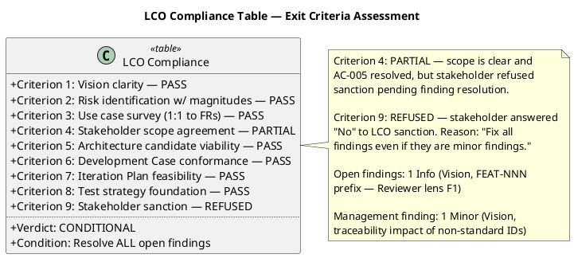
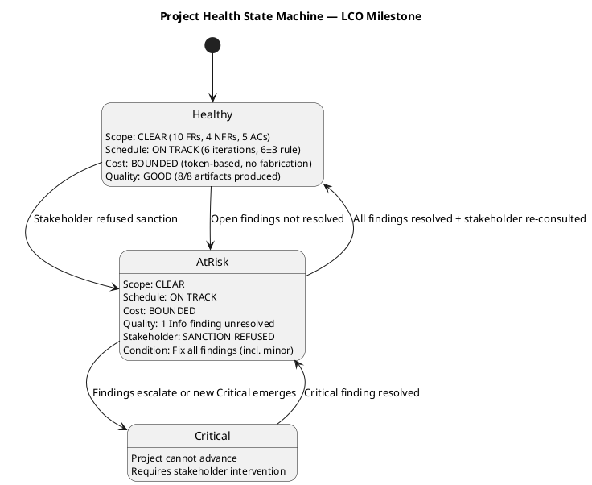
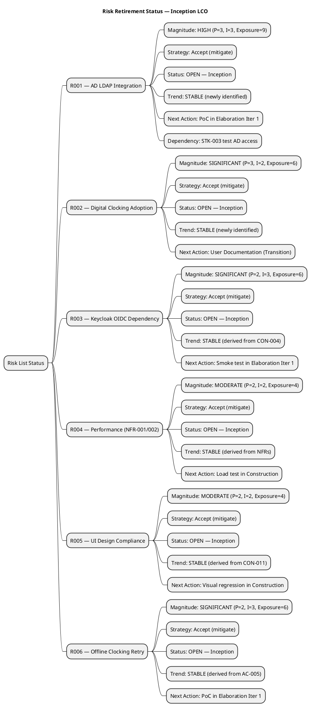

## Document Control

| Field | Value |
|---|---|
| Phase | Inception |
| Status | Draft |
| Milestone Target | End-of-Inception (LCO) |
| Iteration | 1 (Cycle 1) |
| Date | 2026-08-28 |
| Reviewer | Management Reviewer (Project Management Discipline) |
| Review Type | LCO Milestone Review — Management Lens |

## Review Scope and Criteria

### Artifacts Reviewed (8)

| # | Artifact | Discipline | Phase | Status |
|---|---|---|---|---|
| 1 | Development Case | Environment | Inception | Draft |
| 2 | Vision | Requirements | Inception | Draft |
| 3 | Use-Case Model | Requirements | Inception | Draft |
| 4 | Supplementary Specification | Requirements | Inception | Draft |
| 5 | Software Architecture Document | Analysis & Design | Inception | Draft |
| 6 | Risk List | Project Management | Inception | Draft |
| 7 | Iteration Plan | Project Management | Inception | Draft |
| 8 | Test Evaluation Summary | Test | Inception | Draft |

### Review Lenses Applied

| Lens | Reviewer | Verdict | Findings |
|---|---|---|---|
| Technical (PM Discipline) | Reviewer | APPROVED | 1 Info (non-blocking) |
| Business Modeling | Business Reviewer | BR-OK-INACTIVE | 0 (discipline not applicable per DC §4) |
| Management (LCO Gate) | Management Reviewer | CONDITIONAL | 1 Minor (stakeholder-directed resolution required) |

### LCO Exit Criteria Checklist

The LCO milestone applies the **feasibility and acceptability** lens per RUP Project Approval / Planning review point.

**Criterion-by-criterion evidence:**

| # | Criterion | Status | Evidence |
|---|---|---|---|
| 1 | Vision clarity | PASS | Problem statement, product positioning, 4 stakeholders (STK-001..004), 3 measurable business goals (BG-001..003), 5 acceptance criteria (AC-001..005) |
| 2 | Risk identification w/ magnitudes | PASS | Risk List has 6 risks (R001–R006), each with P×I=Exposure, magnitude rating, strategy, mitigation, contingency. R001 (HIGH, exposure=9) correctly prioritized |
| 3 | Use case survey (1:1 to FRs) | PASS | 10 UCs (UC-001..UC-010) trace 1:1 to FR-001..FR-010. No cross-cutting mechanisms as UCs. Auth/audit in Supplementary Spec as `<<include>>` |
| 4 | Stakeholder scope agreement | PARTIAL | Scope statement matches declared scope. AC-005 resolved via stakeholder consultation. However, stakeholder refused LCO sanction pending finding resolution |
| 5 | Architecture candidate viability | PASS | SAD has 8 components (COMP-001..008), 5 ADRs, deployment view, logical view. Decomposed by volatility. PoC plan for R001 and R006 in Elaboration |
| 6 | Development Case conformance | PASS | DC declares Business Modeling INACTIVE (correct: business-process-led=false). 6 optional artifacts all NOT TRIGGERED with justified conditions. No baseline violations |
| 7 | Iteration Plan feasibility | PASS | 6 iterations (1+2+2+1) within 6±3 rule. Rubber profile adjusted for risk. FR-009 sequenced to Elaboration Iter 1 to confront R001. Token-based budgeting, no fabricated effort estimates |
| 8 | Test strategy foundation | PASS | TES has evaluation mission, testability assessment for all FRs/NFRs/ACs, AC-to-test mapping, test risk identification (R001–R006), cross-iteration test strategy |
| 9 | Stakeholder sanction | REFUSED | Stakeholder answered "No" to LCO sanction. Reason: "Fix all findings even if they are minor findings" |

## Findings

### Project Health State Machine

### Four-Axis Health Scorecard

| Dimension | Rating | Evidence |
|---|---|---|
| Scope | GREEN | 10 FRs, 4 NFRs, 5 ACs — all declared, all traced. No scope creep detected. UCs 1:1 to FRs. |
| Schedule | GREEN | 6 iterations within 6±3 rule. Rubber profile applied. FR-009 (highest risk) sequenced first in Elaboration. |
| Cost | GREEN | Token-based budgeting per IARI rules. No fabricated person-weeks or story points. No unsourced financial figures. |
| Quality | YELLOW | 8/8 artifacts produced. 1 Info finding (Reviewer lens) + 1 Minor finding (Management lens) open. Stakeholder demands all findings resolved. |

### Risk Retirement Status

**Risk assessment note:** All 6 risks are in OPEN status — this is expected at Inception (first identification). Trend is STABLE for all (newly identified, no prior review to compare). R001 (HIGH) and R006 (SIGNIFICANT) are correctly scheduled for PoC validation in Elaboration Iter 1. R001 carries a dependency on STK-003 providing test AD access — this is noted in the Risk List and TES but not yet confirmed. This dependency should be tracked as a watch item entering Elaboration.

### Findings Register

| # | Artifact | Severity | Finding | Recommendation | Verdict | Source Lens |
|---|---|---|---|---|---|---|
| F1 | Vision | Info | Vision traceability table uses "FEAT-NNN" prefix not in standard ID conventions | Replace with REQ-NNN or declare FEAT in Development Case | Approved | Reviewer (Technical) |
| F2 | Vision | Minor | Non-standard FEAT-NNN IDs compromise automated RTM generation and cross-artifact traceability lookups. Stakeholder directs ALL findings resolved before LCO gate closes. | Replace "FEAT-NNN" with standard "REQ-NNN" prefix in Vision traceability table | NeedsRework | Management Reviewer |

### Prior Findings Reconciliation

| Artifact | Prior MR Findings | Disposition |
|---|---|---|
| Vision | 0 (F1 is Reviewer lens, not MR) | N/A — cannot resolve cross-lens findings |
| Iteration Plan | 0 | N/A |
| Risk List | 0 | N/A |
| Development Case | 0 | N/A |

## Resolutions and Actions

### Stakeholder Consultation Record

**Question asked:** "LCO review — my verdict: Go. Open defects at this milestone: 0 Critical, 0 Major. The only open finding is 1 Info-level (FEAT-NNN prefix naming convention, from the technical Reviewer lens). Knowing this, do you accept the project scope and objectives and sanction advancing past the Lifecycle Objectives milestone?"

**Stakeholder answer:** No

**Stakeholder reason:** "Fix all findings even if they are minor findings"

**Stakeholder sanction: REFUSED**

**Additional stakeholder directive:** "Fix all findings even if they are minor findings" — this elevates the resolution priority of all open findings, including Info-level, to gate-blocking.

### Action Items

| # | Action | Owner | Blocking? | Target |
|---|---|---|---|---|
| A1 | Resolve F1 (Reviewer lens): Replace FEAT-NNN with REQ-NNN in Vision traceability table, or declare FEAT in Development Case | System Analyst | YES (stakeholder-directed) | Before LCO closure |
| A2 | Resolve F2 (Management lens): Same underlying issue — non-standard IDs impact RTM. Resolution of A1 satisfies A2 | System Analyst | YES (stakeholder-directed) | Before LCO closure |
| A3 | Re-consult stakeholder after findings resolved to obtain LCO sanction | Management Reviewer | YES | After A1/A2 |

## Disposition

### Verdict: CONDITIONAL GO

The project is **viable and feasible**. All 8 LCO exit criteria are satisfied or partially satisfied. The architecture candidate is plausible, risks are identified with magnitudes, the iteration plan is proportionate, and scope is clear and traceable.

**However, the LCO gate CANNOT close** because:

1. **Stakeholder sanction: REFUSED** — The stakeholder answered "No" to the LCO sanction question, directing that all findings (including minor/Info) must be resolved first.
2. **Open findings (2):** F1 (Info, Reviewer lens) and F2 (Minor, Management lens) — both on the Vision artifact, both addressing the same underlying issue (FEAT-NNN non-standard ID prefix).

**Conditions for LCO closure:**
1. Resolve F1: Replace FEAT-NNN with standard REQ-NNN prefix in Vision traceability table (or declare FEAT as project-specific in Development Case)
2. Resolution of F1 satisfies F2 (same underlying defect)
3. Re-consult stakeholder to obtain LCO sanction after findings are resolved

**If conditions are met:** Verdict upgrades to **Go** — project sanctioned to proceed to Elaboration.

**If conditions are NOT met:** Verdict remains **Conditional** — project does not advance past LCO.

### Data Source Verification

| Data Point | Source | Verified? |
|---|---|---|
| BG-001 (50% HR time reduction) | Declared in Work Order | YES — stakeholder-declared business goal |
| BG-002 (100% Excel elimination) | Declared in Work Order | YES — stakeholder-declared business goal |
| BG-003 (80% adoption, 160/200) | Declared in Work Order | YES — stakeholder-declared business goal |
| R001 (P=3, I=3, exposure=9) | Declared in Work Order | YES — stakeholder-declared risk |
| R002 (P=3, I=2, exposure=6) | Declared in Work Order | YES — stakeholder-declared risk |
| Financial figures (ROI, budget, revenue) | NOT PRESENT | N/A — no financial projections in any artifact |

No unsourced financial data detected. No [UNVERIFIED DATA] findings.

## Traceability

| Element | Traces From | Link Type | Traces To |
|---|---|---|---|
| LCO Compliance Table | All 8 Inception artifacts | Derives | LCO Milestone Verdict |
| F1 (Reviewer finding) | Vision traceability table | Derives | A1 (action item) |
| F2 (Management finding) | Vision traceability table, F1 | Derives | A2 (action item) |
| Stakeholder sanction record | S_CONSULT_STAKEHOLDER | Derives | A3 (re-consult action) |
| Risk Retirement Status | Risk List (R001–R006) | Refines | Elaboration Iteration Plan |
| Four-Axis Health Scorecard | Vision, Iteration Plan, Risk List, all artifacts | Derives | LCO Milestone Verdict |
| Project Health State Machine | LCO exit criteria, stakeholder sanction | Derives | ReviewCoordinator milestone verdict |
| DC Conformance Check | IARI DC Baseline | Derives | Development Case artifact |
| Optional Trigger Audit | IARI §5.2 conditions | Derives | Development Case artifact |
| UC Guard Checks | FR-001..FR-010, Scope Guard Rules 5/7 | Derives | Use-Case Model artifact |
| SAD Volatility Check | SAD component decomposition | Derives | Software Architecture Document artifact |
| Risk List Check | R001, R002 (Work Order) | Derives | Risk List artifact |
| Iteration Plan Check | 6±3 rule, rubber profile | Derives | Iteration Plan artifact |
| BR-OK-INACTIVE verdict | DC §4 classification (Process Engineer) | Derives | LCO Milestone Review (ReviewCoordinator) |