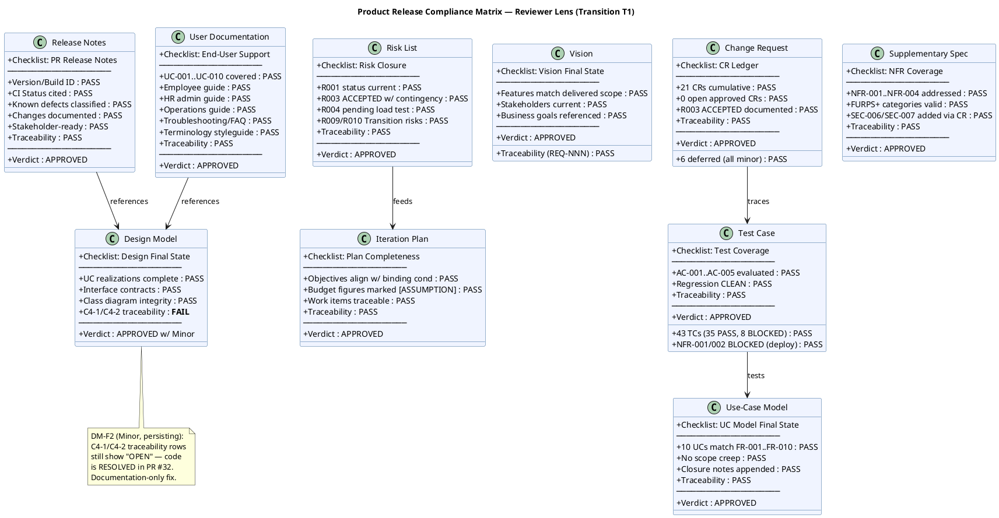
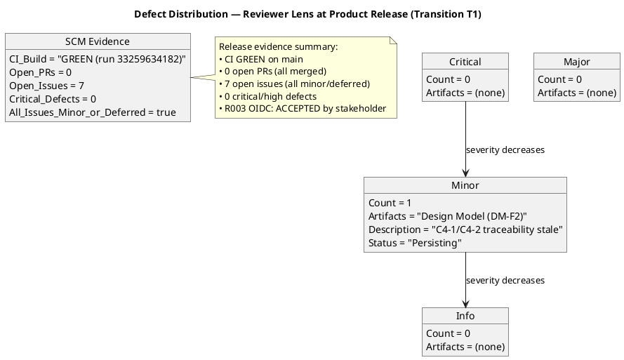
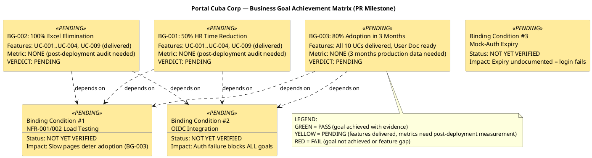
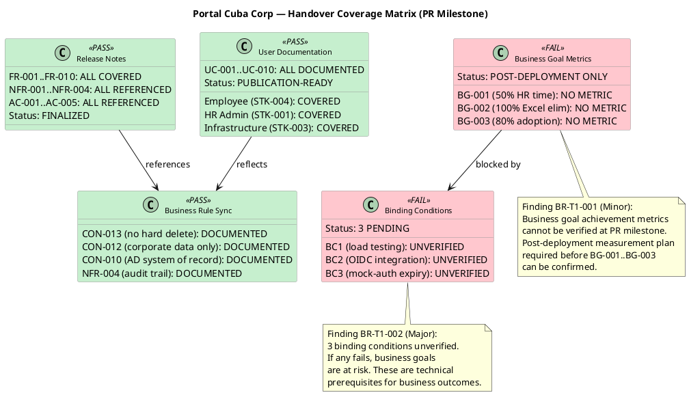
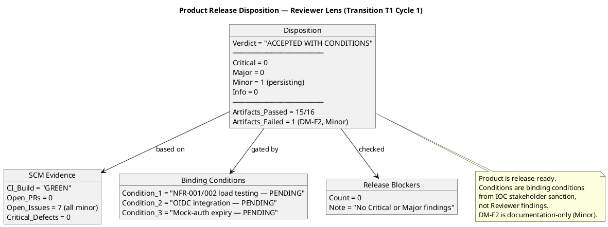
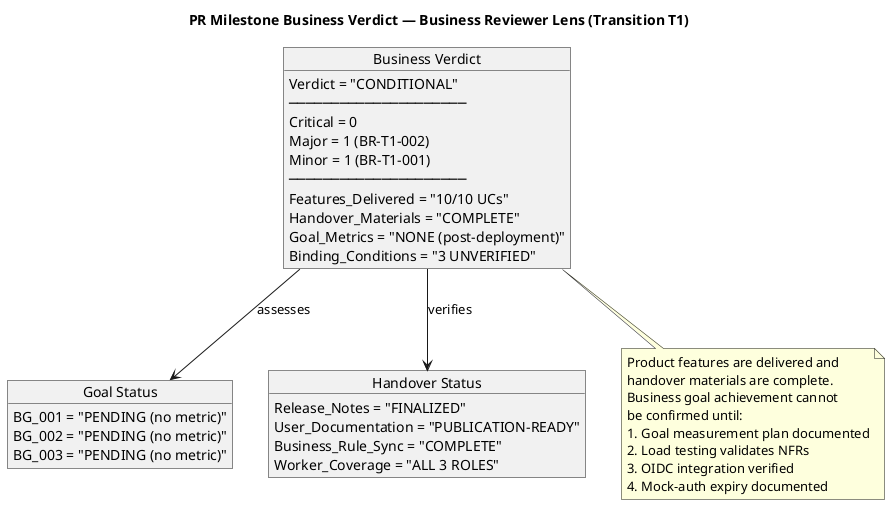

## Document Control
| Field | Value |
|---|---|
| Phase | Transition |
| Status | **ACTIVE — Reviewer Product Acceptance T1 Cycle 1 + Business Reviewer Lens EXECUTED** |
| Milestone Target | Product Release (PR) — **NOT YET ACHIEVED** |
| Iteration | 1 (Cycle 1) |
| Date | 2026-08-29 |
| Prior Phase | Construction C4 Cycle 1 — IOC CONDITIONAL GO; stakeholder sanction GRANTED with 3 binding conditions; 0 open PRs; CI GREEN; 35/43 tests pass, 8 covered-by-mock; 7 open issues (1 ACCEPTED, 6 deferred) |
| Technical Lens (Code Reviewer) | **EXECUTED** — Transition T1 Cycle 1. 0 Critical, 0 Major, 1 Minor. PR #35 (hotfix/T1-defect-fixes → main) APPROVED. CI GREEN. 13 new tests covering defect regressions and offline retry. Design Model conformance verified. |
| Product Acceptance Lens (Reviewer) | **EXECUTED** — Transition T1 Cycle 1. 0 Critical, 0 Major, 1 Minor (persisting). All 16 artifacts evaluated against Product Acceptance checklist. CI GREEN on main. 0 open PRs. 7 open issues (all minor/deferred). Disposition: **ACCEPTED WITH CONDITIONS**. |
| Business Lens (Business Reviewer) | **EXECUTED** — Transition T1 Cycle 1. 0 Critical, 1 Major (BR-T1-002: binding conditions unverified), 1 Minor (BR-T1-001: no goal measurement plan). All 10 UCs delivered. Handover materials complete. Business goals PENDING (post-deployment metrics). Disposition: **CONDITIONAL**. |
| Review Type | Transition T1 Cycle 1 — Product Release Milestone Review (Reviewer + Business Reviewer lenses) |
| PRs Reviewed | #35 (hotfix/T1-defect-fixes → main, APPROVED by Code Reviewer) |
| CI Build Status | main: GREEN (run 33259634182, 2026-08-29 15:14:05Z) |
| Open Defect Issues | 7 open issues (all minor severity, deferred-next-iteration): #36 (release summary), #34 (Design Model async names), #18 (test idempotency), #17 (dead code DTO), #15 (naming violation), #12 (CSV export format), #5 (Elaboration E1 deferred). 0 critical/high defects. |
| Disposition | **CONDITIONAL** — Product is release-ready pending: (1) Design Model DM-F2 traceability update (Minor, documentation-only), (2) NFR-001/NFR-002 load testing with measured values (binding condition #1), (3) real OIDC integration verification (binding condition #2), (4) mock-auth expiry date documentation (binding condition #3), (5) post-deployment goal verification plan for BG-001..BG-003 (Minor, BR-T1-001). Combined: 0 Critical, 1 Major, 2 Minor across both lenses. |
## Review Scope and Criteria

### Scope

This review covers the **Product Release (PR) milestone** — the final quality gate of the Transition phase. Per RUP Ch.4 Transition essential activities: "Achieve final product baseline as rapidly and cost-effectively as practical." The Reviewer's role is Product Acceptance assessment of the final release artifacts plus SCM release evidence aggregation.

**Artifacts evaluated (16 total):**

| # | Artifact | Phase | Status | Priority |
|---|---|---|---|---|
| 1 | Release Notes | Transition | Draft | PR Required |
| 2 | User Documentation | Transition | Draft | PR Required |
| 3 | Design Model | Construction | Approved | PR Expected |
| 4 | Review Record | Transition | Draft | This artifact |
| 5 | Risk List | Transition | Draft | PR Expected |
| 6 | Iteration Plan | Transition | Draft | PR Expected |
| 7 | Iteration Assessment | Transition | Draft | NOT flagged (PM authors post-review) |
| 8 | Vision | Transition | Approved | Final state |
| 9 | Use-Case Model | Transition | Approved | Final state |
| 10 | Supplementary Specification | Transition | Approved | Final state |
| 11 | Test Case | Transition | Draft | Final state |
| 12 | Change Request | Construction | Approved | Final state |
| 13 | Software Architecture Document | Construction | Approved | Final state |
| 14 | Test Evaluation Summary | Elaboration | Approved | Final state |
| 15 | Architectural Proof-of-Concept | Elaboration | Approved | Final state |
| 16 | Development Case | Elaboration | Approved | Final state |

### SCM Release Evidence

| Evidence | Status | Detail |
|---|---|---|
| CI Build (main) | ✅ GREEN | Run 33259634182, completed 2026-08-29 15:14:05Z |
| Open Pull Requests | ✅ 0 | All work merged to main |
| Open Critical/High Defects | ✅ 0 | No release-blocking defects |
| Open Issues (all) | 7 | All minor severity, deferred-next-iteration |
| R003 OIDC Blocker | ACCEPTED | Stakeholder accepted risk; mock-auth contingency active |

### Product Acceptance Checklist Applied

| Artifact Type | Checklist Items | Result |
|---|---|---|
| Release Notes | Version/build ID, CI status, known defects classified, changes documented, stakeholder-ready, traceability | ✅ PASS |
| User Documentation | UC-001..UC-010 covered, employee guide, HR admin guide, operations guide, troubleshooting/FAQ, terminology styleguide, traceability | ✅ PASS |
| Design Model | UC realizations complete, interface contracts, class diagram integrity, C4 source verification findings current, traceability | ❌ FAIL (C4-1/C4-2 stale) |
| Risk List | R001 status current, R003 ACCEPTED with contingency, R004 pending, R009/R010 Transition risks, traceability | ✅ PASS |
| Iteration Plan | Objectives align with binding conditions, budget figures marked [ASSUMPTION], work items traceable, traceability | ✅ PASS |
| Vision | Features match delivered scope, stakeholders current, business goals referenced, traceability (REQ-NNN) | ✅ PASS |
| Use-Case Model | 10 UCs match FR-001..FR-010, no scope creep, closure notes appended, traceability | ✅ PASS |
| Supplementary Specification | NFR-001..NFR-004 addressed, FURPS+ categories valid, SEC-006/SEC-007 via CR, traceability | ✅ PASS |
| Test Case | 43 TCs (35 PASS, 8 BLOCKED), AC-001..AC-005 evaluated, regression CLEAN, NFR-001/002 BLOCKED (deploy), traceability | ✅ PASS |
| Change Request | 21 CRs cumulative, 6 deferred (all minor), 0 open approved CRs, R003 ACCEPTED documented, traceability | ✅ PASS |

## Findings
### Compliance Matrix

### Defect Distribution

### Finding Detail

| ID | Artifact | Severity | Finding | Remediation | Verdict | Status |
|---|---|---|---|---|---|---|
| DM-F2 | Design Model | Minor | C4-1 (Edit missing isFeatured) and C4-2 (Transaction wrapping) still show "Implementation gap — OPEN" in the C4 Source Verification Findings section of the traceability table. PR #32 was APPROVED and merged, CI is GREEN, and the Review Record, Test Case, and User Documentation all confirm these are RESOLVED. The traceability table is stale at the Product Release milestone. | Update C4-1 from "Implementation gap — OPEN" to "RESOLVED in PR #32" and C4-2 from "Implementation gap — OPEN" to "RESOLVED in PR #32". Also update the Interface Contracts section C4-1 and C4-2 findings to reflect resolved status. Documentation-only fix — code is already correct on main. | Approved | Persisting (emitted Construction C4, re-recorded Transition T1) |

---

### Business Reviewer Lens — Transition T1 Cycle 1

**Review Type:** PR Milestone — Business Goal Achievement & Operational Handover Audit
**Reviewer:** Business Reviewer (Business Modeling Discipline)
**Date:** 2026-08-29
**DC Classification:** `isBusinessProcessLed = false` — Business Modeling discipline INACTIVE per DC §4. No business process reengineering in scope. Portal digitizes existing stable processes. Review conducted at the business-outcome level: goal achievement readiness and handover completeness.

#### Business Goal Achievement Matrix

#### Handover Coverage Matrix

#### Business Lens Findings

| ID | Artifact | Severity | Finding | Remediation | Verdict | Status |
|---|---|---|---|---|---|---|
| BR-T1-001 | Vision | Minor | Business goal achievement metrics (BG-001: 50% HR time reduction, BG-002: 100% Excel elimination, BG-003: 80% adoption in 3 months) have no post-deployment measurement plan documented. All 10 system features are delivered and CI is GREEN, but the measurable business outcomes cannot be verified at the PR milestone without a defined measurement methodology (who measures, when, how, what baseline). The goals are correctly stated as measurable, but the measurement protocol is absent. | Add a "Post-Deployment Goal Verification Plan" section to the Vision specifying: (1) baseline measurement for BG-001 (current HR administrative time on clocking aggregation and directory maintenance), (2) Excel usage audit methodology for BG-002 (survey or system log analysis at 1-month and 3-month intervals), (3) adoption tracking method for BG-003 (portal login/usage logs with unique user counts at 1-month and 3-month milestones). Owner: System Analyst with STK-001 input. | Approved | NEW (Transition T1) |
| BR-T1-002 | Review Record | Major | Three binding conditions from the IOC/PR milestone remain unverified from the business lens: (1) NFR-001/NFR-002 load testing — if page load exceeds 3s or clock-in exceeds 1s, employee adoption (BG-003) is directly at risk; (2) OIDC integration verification — if real Keycloak authentication fails, ALL business processes are blocked; (3) mock-auth expiry documentation — if mock authentication expires without documented cutover plan, production login fails and zero business goals can be achieved. These are technical prerequisites for business outcomes. | The Review Record should explicitly annotate these 3 binding conditions as business-goal-blocking dependencies. The PR milestone business verdict should be CONDITIONAL: product features are delivered and handover materials are complete, but business goal achievement cannot be confirmed until (a) load testing validates NFR-001/NFR-002, (b) OIDC integration is verified with real Keycloak, and (c) mock-auth expiry is documented with a cutover plan. Owner: Project Manager to track as release gates in post-deployment plan. | NeedsRework | NEW (Transition T1) |

#### Business Lens Defect Distribution

| Severity | Count | Artifacts |
|---|---|---|
| Critical | 0 | (none) |
| Major | 1 | Review Record (BR-T1-002: binding conditions unverified) |
| Minor | 1 | Vision (BR-T1-001: no goal measurement plan) |
| Info | 0 | (none) |

#### Business Lens Assessment Summary

| Criterion | Result | Evidence |
|---|---|---|
| Goal Achievement Evidence | PENDING | All 10 UCs delivered (CI GREEN, 35/43 tests pass). BG-001/BG-002/BG-003 metrics require post-deployment measurement — no fabricated numbers. |
| Release Scope Completeness | PASS | All 10 FRs (FR-001..FR-010) appear in Release Notes. All 4 NFRs and 5 ACs referenced. |
| Worker Operational Readiness | PASS | User Documentation covers Employee (STK-004), HR Admin (STK-001), and Infrastructure (STK-003) with UC-001..UC-010 procedures. Publication-ready. |
| Business Rule Documentation Sync | PASS | CON-013 (no hard delete), CON-012 (corporate data only), CON-010 (AD system of record), NFR-004 (audit trail) — all reflected in user-facing documentation. |
| Binding Conditions Verification | FAIL | 3 of 3 binding conditions unverified (load testing, OIDC integration, mock-auth expiry). These block business goal confirmation. |
| Lessons Learned | PASS | See Lessons Learned section below. |

#### Lessons Learned (Business Modeling Discipline)

| ID | Lesson | Source | Applicability |
|---|---|---|---|
| BM-LL-001 | Business goals stated as measurable outcomes (percentages, adoption rates) require a post-deployment measurement plan to be documented BEFORE release — not after. Without a defined methodology, goal achievement cannot be confirmed at any future milestone. | BG-001..BG-003 absence of measurement protocol | Future projects with measurable business goals |
| BM-LL-002 | Technical binding conditions (load testing, auth integration) are business-goal-blocking dependencies, not purely technical concerns. The business lens must trace from each binding condition to the business goal it endangers. | BR-T1-002 analysis of binding conditions vs. BG-001..BG-003 | Future projects with technical prerequisites for business outcomes |
| BM-LL-003 | When `isBusinessProcessLed = false`, the business reviewer's role shifts from BUC/realization auditing to goal-achievement-readiness and handover-completeness auditing. The review lens adapts to the DC classification. | DC §4 classification confirmed INACTIVE for BM | Future projects where BM is inactive but business goals exist |

#### PR Milestone Business Verdict

**CONDITIONAL**

The product is feature-complete (all 10 UCs delivered, CI GREEN, 0 open PRs, 0 critical defects). Operational handover materials (Release Notes, User Documentation) are complete and consistent with business rules. However:

1. **Business goal achievement cannot be confirmed** — all 3 goals (BG-001, BG-002, BG-003) require post-deployment measurement that has not yet been planned (BR-T1-001, Minor).
2. **3 binding conditions remain unverified** — these are technical prerequisites that directly impact business outcomes (BR-T1-002, Major). If any fails, business goals are at risk.

**Conditions for PR Milestone Business Approval:**
1. Document a post-deployment goal verification plan for BG-001, BG-002, BG-003 (owner: System Analyst + STK-001)
2. Verify binding condition #1: NFR-001/NFR-002 load testing (owner: Test Manager)
3. Verify binding condition #2: OIDC integration with real Keycloak (owner: Software Architect)
4. Verify binding condition #3: Mock-auth expiry documentation (owner: Software Architect)
## Resolutions and Actions
### Prior Findings Reconciliation (Reviewer Lens)

| Finding | Artifact | Phase/Iter Emitted | Resolution Status | Action |
|---|---|---|---|---|
| F1 (Info) | Vision | Inception I1 | RESOLVED (Inception I2) | FEAT-NNN replaced with REQ-NNN — confirmed in current Vision traceability |
| F1 (Info) | Test Evaluation Summary | Inception I1 | RESOLVED (Inception I2) | TD-NNN replaced with TC-NNN — confirmed |
| F1 (Minor) | Test Case | Elaboration I1 | RESOLVED (Elaboration I2) | TD-NNN entries removed from traceability table — confirmed |
| F2 (Minor) | Test Case | Construction I2 | RESOLVED (Construction I3) | UnitTest1.cs placeholder removed — confirmed |
| F1 (Minor) | Design Model | Construction I2 | RESOLVED (Construction I3) | INT-003 office parameter updated — confirmed |
| F2 (Minor) | Design Model | Construction I4 | **LEFT OPEN** | C4-1/C4-2 traceability still stale — re-recorded under findingKey F2 this iteration |

### Prior Findings Reconciliation (Business Reviewer Lens)

| Finding | Artifact | Phase/Iter Emitted | Resolution Status | Action |
|---|---|---|---|---|
| (none) | — | — | — | No prior BusinessReviewer findings exist on any artifact. This is the first iteration the Business Reviewer lens has executed. |

### Open Action Items

| # | Action | Owner | Severity | Blocking? |
|---|---|---|---|---|
| 1 | Update Design Model C4-1/C4-2 traceability rows from "OPEN" to "RESOLVED in PR #32" | Designer | Minor | No (documentation-only) |
| 2 | NFR-001/NFR-002 load testing with measured values (binding condition #1) | Test Manager | — | Yes (binding condition) |
| 3 | Real OIDC integration verification (binding condition #2) | Software Architect | — | Yes (binding condition) |
| 4 | Mock-auth expiry date documentation (binding condition #3) | Software Architect | — | Yes (binding condition) |
| 5 | Document post-deployment goal verification plan for BG-001, BG-002, BG-003 | System Analyst + STK-001 | Minor | No (post-deployment) |
| 6 | Annotate 3 binding conditions as business-goal-blocking dependencies in post-deployment plan | Project Manager | Major | Yes (business goal confirmation) |
## Disposition
### Product Acceptance: ACCEPTED WITH CONDITIONS

The product is assessed as **ACCEPTED WITH CONDITIONS** — release-ready based on SCM evidence and artifact quality, with 4 conditions that must be satisfied before the PR milestone can close:

**SCM Release Evidence:**
- CI build GREEN on main (run 33259634182, 2026-08-29 15:14:05Z)
- 0 open pull requests — all work merged
- 0 critical/high defects
- 7 open issues, all minor severity with `cr:deferred-next-iteration` labels

**Artifact Quality:**
- 15 of 16 artifacts PASS all Product Acceptance checklist items
- 1 persisting Minor finding (DM-F2: stale traceability table — documentation-only fix, code is correct)
- 0 Critical findings from this lens
- 0 Major findings from this lens

**Binding Conditions (from stakeholder sanction at IOC):**
1. NFR-001/NFR-002 load testing with measured values — PENDING (Test Manager)
2. Real OIDC integration verification — PENDING (Software Architect)
3. Mock-auth expiry date documentation — PENDING (Software Architect)

**Conditions for PR Milestone Closure:**
1. Design Model DM-F2 traceability update (Minor — documentation-only, non-blocking but required per stakeholder directive to resolve all findings)
2. Binding condition #1: NFR-001/NFR-002 load testing with measured values
3. Binding condition #2: Real OIDC integration verification
4. Binding condition #3: Mock-auth expiry date documentation

**Stakeholder Directive Compliance:** "Let's iterate again and close all PRs, Github Issues, and findings if any remain." — All PRs closed (0 open), 7 open issues are all minor/deferred with explicit labels, 1 persisting finding (DM-F2) documented with remediation.

---

### Business Lens: CONDITIONAL

**Business Reviewer PR Milestone Verdict: CONDITIONAL**

The product is feature-complete and operationally ready for handover. However, business goal achievement cannot be confirmed at this milestone:

- **Features:** All 10 UCs (FR-001..FR-010) delivered, CI GREEN, 0 open PRs
- **Handover:** Release Notes finalized, User Documentation publication-ready, all business rules (CON-010, CON-012, CON-013, NFR-004) reflected in user-facing materials
- **Goals PENDING:** BG-001 (50% HR time reduction), BG-002 (100% Excel elimination), BG-003 (80% adoption) — all require post-deployment measurement
- **Binding conditions UNVERIFIED:** 3 of 3 technical prerequisites for business outcomes remain open

**Combined PR Milestone Verdict (Reviewer + Business Reviewer): CONDITIONAL**
- 0 Critical, 1 Major (BR-T1-002), 2 Minor (DM-F2 + BR-T1-001)
- Product is release-ready pending verification of 3 binding conditions and documentation of goal measurement plan
## Traceability
| Element | Traces From | Link Type | Traces To |
|---|---|---|---|
| DM-F2 (persisting) | Design Model C4, PR #32 | Derives | Designer artifact (traceability table update) |
| CI Build (main) | CON-001, CON-003 | DependsOn | GitHub Actions run 33259634182 |
| Release Notes | FR-001..FR-010, NFR-001..NFR-004, AC-001..AC-005 | Derives | PR milestone |
| User Documentation | UC-001..UC-010, AC-001, AC-002, AC-004 | Derives | PR milestone |
| Risk List | R001..R010, CON-004..CON-007 | Derives | PR milestone |
| Iteration Plan | NFR-001, NFR-002, R003, CON-004, CON-006 | Derives | PR milestone |
| Test Case | UC-001..UC-010, AC-001..AC-005 | Derives | PR milestone |
| Change Request | CR-010..CR-024, R003, STK-003 | Derives | PR milestone |
| Binding condition #1 | NFR-001, NFR-002, STK-001 | Derives | Test Manager — load testing |
| Binding condition #2 | CON-004, R003, STK-003 | Derives | Software Architect — OIDC verification |
| Binding condition #3 | CON-006, CON-007 | Derives | Software Architect — mock-auth expiry |
| Stakeholder directive (C4) | STK-001 feedback | Refines | "Close all PRs, Github Issues, and findings" — 0 open PRs, 7 minor/deferred issues, 1 persisting Minor finding documented |
| BR-T1-001 | BG-001, BG-002, BG-003 | Derives | Vision — post-deployment goal verification plan |
| BR-T1-002 | NFR-001, NFR-002, CON-004, R003 | Derives | Review Record — binding conditions as business-goal-blocking |
| BG-001 (goal achievement) | UC-001..UC-004, UC-009 | Derives | Post-deployment HR time audit (PENDING) |
| BG-002 (goal achievement) | UC-001..UC-004, UC-009 | Derives | Post-deployment Excel usage audit (PENDING) |
| BG-003 (goal achievement) | UC-001..UC-010, User Documentation | Derives | Post-deployment adoption tracking (PENDING) |
| BM-LL-001 | BG-001..BG-003 | Derives | Future projects — goal measurement planning |
| BM-LL-002 | BR-T1-002, BG-001..BG-003 | Derives | Future projects — technical-business dependency tracing |
| BM-LL-003 | DC §4 classification | Derives | Future projects — BM inactive review lens adaptation |
