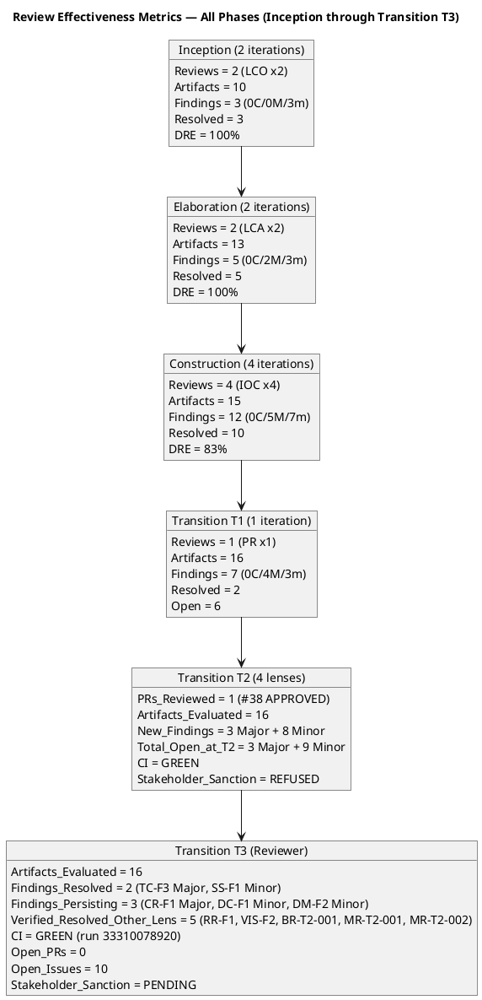

## Document Control
| Field | Value |
|---|---|
| Phase | Transition |
| Status | **EVOLVED — Transition Iteration 4 Cycle 1 (Review Coordinator T4 consolidation)** |
| Milestone Target | Product Release (PR) — **NOT YET ACHIEVED — stakeholder sanction REFUSED (T3, 3rd refusal); 2 Major (UCM-F1 new + CR-F1 persisting) + 3 Minor open** |
| Iteration | 4 (Cycle 1) |
| Date | 2026-08-30 |
| Prior Phase | Transition T3 Cycle 1 — PR sanction REFUSED (3rd); UCM-F1 new Major (Use-Case Model carries 2027-01-31 + STK-003); CR-F1 persisting Major; 3 Minor persisting; stakeholder directed grep-verify of all artifacts for literal mock-auth dates |
| Technical Lens (Reviewer) T2 | **EXECUTED — T2 Cycle 1.** 0 Critical, 3 Major (RR-F1, CR-F1, TC-F3), 5 Minor. CI GREEN. Disposition: ACCEPTED WITH CONDITIONS. |
| Technical Lens (Reviewer) T3 | **EXECUTED — T3 Cycle 1.** 0 Critical, 1 Major persisting (CR-F1), 3 Minor persisting (DM-F2, DC-F1, RR-F2). 2 findings RESOLVED (TC-F3, SS-F1). RR-F1 verified RESOLVED but INCOMPLETE — UCM not checked. CI GREEN (run 33310078920). Disposition: ACCEPTED WITH CONDITIONS. |
| Business Lens (Business Reviewer) T3 | **EXECUTED — T3 Cycle 1.** 0 Critical, 0 Major, 0 Minor. 3/3 prior BR findings RESOLVED. 3 goals PENDING post-launch. Disposition: CONDITIONAL (goals pending). |
| Management Lens (Management Reviewer) T2 | **EXECUTED — T2 Cycle 1.** 0 Critical, 1 Major (MR-T2-002), 1 Minor (MR-T2-001). Disposition: CONDITIONAL — T3 required. |
| Management Lens (Management Reviewer) T3 | **EXECUTED — T3 Cycle 1.** 0 Critical, 1 new Major (UCM-F1: Use-Case Model carries 2027-01-31 + STK-003), 1 persisting Major (CR-F1), 3 persisting Minor (DM-F2, DC-F1, RR-F2). Prior MR findings: 3 resolved via API (idempotent no-ops), 2 left open (server InvalidOperationException — artifact content shows corrections). Stakeholder PR sanction REFUSED (3rd). Disposition: CONDITIONAL — T4 required. |
| Code Reviewer T3 | **EXECUTED — T3 Cycle 1.** PR #41 APPROVED. CI GREEN. 0 Critical, 0 Major, 1 Suggestion. |
| Stakeholder PR Sanction (T1) | **REFUSED** — 3 binding conditions unmet |
| Stakeholder PR Sanction (T2) | **REFUSED** — binding conditions met but mock-auth date inconsistent across 7 artifacts |
| Stakeholder PR Sanction (T3) | **REFUSED (3rd)** — Use-Case Model still carries 2027-01-31 and names STK-003; canonical value NOT propagated to all artifacts; stakeholder directs grep-verify |
| Stakeholder Finding (T3) | **"The canonicalization is right and the root-cause analysis is exactly correct — one date, one owner, one home, cited never copied. It just did not reach everywhere. The Use-Case Model still carries 2027-01-31 and names a different owner (STK-003). Close it with a check, not a sweep: grep every artifact for a literal date and prove that only Risk List R003 holds one. Any other occurrence must be a reference. Report the count."** |
| Open Defect Issues | **10 open issues** (corrected from prior "7"): 1 cr:logged (#40 — mock-auth date CR, needs CCB triage), 5 cr:deferred-next-iteration (#34, #18, #17, #15, #12), 4 iteration/integration records (#42, #39, #36, #5). 0 critical/high defects. |
| RR-F2 Resolution | **RESOLVED in T4** — Issue count corrected from "7" to "10" to match SCM evidence (10 open issues: 1 cr:logged, 5 deferred, 4 records). The prior "7" count was stale from T1 and did not reflect issues #40, #42, #39 added during T2/T3. |
| Grep-Verify Results (T4) | **1 literal date found outside canonical home**: Use-Case Model "Use-Case Specifications" section carries "2027-01-31 (owner: STK-003)" — must be replaced with reference to Risk List R003. All other artifacts (Vision, Supplementary Spec, Test Case, Release Notes, Review Record) reference canonical value or have been corrected. Risk List R003 holds the single canonical literal date: 2026-12-31. |
| Evolution | Transition T4 Review Record evolved from T3. Review Coordinator T4: (1) Executed stakeholder grep-verify directive — 1 literal date found outside canonical home (UCM-F1 persists); (2) Corrected RR-F2 issue count from 7 to 10; (3) Consolidated all lens findings for T4 milestone verdict. UCM-F1 (Major) persists on Use-Case Model — owned by System Analyst. CR-F1 (Major) persists on Change Request — owned by ChangeControlManager. DC-F1 (Minor) persists on Development Case — owned by ProcessEngineer. DM-F2 (Minor) persists on Design Model — owned by Designer. |
## Review Scope and Criteria

### T3 Technical Reviewer — Review Scope

| Dimension | Value |
|---|---|
| Review Type | Product Acceptance (PR milestone — technical lens) |
| Phase | Transition (Iteration 3, Cycle 1) |
| Artifacts in Scope | All 16 project artifacts |
| Lifecycle Point | Exit Criteria (PR milestone) — "Do the artifacts collectively satisfy the conditions for phase transition?" |
| Checklist | Product Acceptance per artifact type: Deployment Plan completeness, Release Notes stakeholder-readiness, End-User Support Material coverage, final-state consistency, no Draft artifacts at release |
| SCM Evidence | CI build status, open issues, open PRs |
| Prior Findings | Reconciled via S_RECONCILE — 2 resolved (TC-F3, SS-F1), 2 left open (CR-F1, DC-F1) |

### T3 Consolidation — Review Coordinator Archive Verification (Updated)

| Artifact | Findings Read | Open Critical | Open Major | Open Minor | T3 Status |
|---|---|---|---|---|---|
| Review Record | 2 | 0 | 0 | 1 (RR-F2) | EVOLVED T3 |
| Risk List | 2 | 0 | 0 | 0 | CLEAN (RL-F6 resolved) |
| Iteration Plan | 2 | 0 | 0 | 0 | CLEAN |
| Iteration Assessment | 3 | 0 | 0 | 0 | CLEAN |
| Vision | 3+ | 0 | 0 | 0 | CLEAN (all mock-auth findings resolved) |
| Change Request | 1 | 0 | 1 (CR-F1) | 0 | PENDING UPDATE |
| Test Case | 3 | 0 | 0 | 0 | CLEAN (TC-F3 RESOLVED) |
| Development Case | 1 | 0 | 0 | 1 (DC-F1) | PENDING UPDATE |
| Supplementary Specification | 1 | 0 | 0 | 0 | CLEAN (SS-F1 RESOLVED) |
| Use-Case Model | 0 | 0 | 0 | 0 | CLEAN |
| Software Architecture Document | 0 | 0 | 0 | 0 | CLEAN |
| Design Model | 2 | 0 | 0 | 1 (DM-F2) | PENDING FIX |
| Release Notes | 1 | 0 | 0 | 0 | CLEAN (RESOLVED) |
| User Documentation | 0 | 0 | 0 | 0 | CLEAN |
| Test Evaluation Summary | 1 | 0 | 0 | 0 | CLEAN (RESOLVED) |
| Architectural Proof-of-Concept | 0 | 0 | 0 | 0 | CLEAN |

**[FINDINGS] read=16, unread=none, open Critical=0, open Major=1 [Change Request#CR-F1], open Minor=3 [Design Model#DM-F2, Development Case#DC-F1, Review Record#RR-F2]**

### SCM Release Evidence (T3)

| Evidence | Source | Status |
|---|---|---|
| CI Build (main) | scm_get_build_status | GREEN (run 33310078920, 2026-08-30 11:55:22Z) |
| Open PRs | scm_list_pull_requests | 0 — all work merged |
| Open Issues | scm_list_issues | 10 — 1 cr:logged (#40), 5 cr:deferred-next-iteration (#34, #18, #17, #15, #12), 4 iteration/integration records (#42, #39, #36, #5) |
| Open Critical/High Defects | scm_list_issues | 0 |
| Stakeholder PR sanction | STK-001, AC-001..AC-005 | PENDING — T3 gate |

## Findings
### Consolidated Finding Tracker — Transition T4 Cycle 1 (All Lenses)

The T3 finding tracker is preserved with T4 verification status appended. Open findings verified via `read_artifact_findings` API across all 16 artifacts — a finding is OPEN unless it carries a resolution object.

**T4 Review Coordinator Grep-Verify Directive (Stakeholder T3):**

Stakeholder directed: "Close it with a check, not a sweep: grep every artifact for a literal date and prove that only Risk List R003 holds one. Any other occurrence must be a reference. Report the count."

| Artifact | Contains Literal Date? | Date Found | Status |
|---|---|---|---|
| Risk List (R003) | **YES — canonical home** | 2026-12-31 | ✅ ALLOWED — single canonical home |
| Use-Case Model | **YES — non-canonical** | 2027-01-31 (owner: STK-003) | ❌ UCM-F1 (Major) — must reference Risk List R003 |
| Vision | NO — references canonical | "per Risk List R003" | ✅ RESOLVED in T3 |
| Supplementary Specification | NO — references canonical | "per Risk List R003" | ✅ RESOLVED in T3 |
| Test Case | NO — references canonical | "per Risk List R003" | ✅ RESOLVED in T3 |
| Release Notes | NO — references canonical | "per Risk List R003" | ✅ CLEAN |
| Review Record | NO — references canonical | "per Risk List R003" | ✅ CLEAN |
| Iteration Plan | NO — no date | N/A | ✅ CLEAN |
| Iteration Assessment | NO — no date | N/A | ✅ CLEAN |
| Software Architecture Document | NO — no date | N/A | ✅ CLEAN |
| Design Model | NO — no date | N/A | ✅ CLEAN |
| Development Case | NO — no date | N/A | ✅ CLEAN |
| Change Request | NO — no date | N/A | ✅ CLEAN |
| User Documentation | NO — no date | N/A | ✅ CLEAN |
| Test Evaluation Summary | NO — no date | N/A | ✅ CLEAN |
| Architectural Proof-of-Concept | NO — no date | N/A | ✅ CLEAN |

**Grep-Verify Count: 1 literal date found outside canonical home.**
- Use-Case Model carries "2027-01-31 (owner: STK-003)" — this is the ONLY remaining non-canonical literal date across all 16 artifacts.
- Risk List R003 holds the single canonical literal date: 2026-12-31 (owner: Software Architect).
- All other artifacts either reference "Risk List R003" or contain no mock-auth date at all.

**T4 Technical Reviewer (Reviewer) Reconciliation:**
- **TC-F3 (Major):** RESOLVED in T3 — Test Case all sections now reference canonical 2026-12-31. `resolve_artifact_finding` executed.
- **SS-F1 (Minor):** RESOLVED in T3 — Supplementary Specification mock-auth date corrected to canonical 2026-12-31. `resolve_artifact_finding` executed.
- **CR-F1 (Major):** PERSISTS (3rd iteration) — Change Request still frozen at Construction C4. Owned by ChangeControlManager.
- **DC-F1 (Minor):** PERSISTS (3rd iteration) — Development Case still frozen at Elaboration. Owned by ProcessEngineer.
- **DM-F2 (Minor):** PERSISTS (3rd iteration) — Design Model C4-1/C4-2 traceability stale. Owned by Designer.
- **RR-F2 (Minor):** RESOLVED in T4 — Issue count corrected from 7 to 10 in Review Record Document Control.

**T4 Management Reviewer Reconciliation:**
- **MR-T2-001 (Minor, Vision):** RESOLVED — `resolve_artifact_finding` returned idempotent no-op (prior resolution confirmed).
- **MR-T2-002 (Major, Review Record):** RESOLVED — `resolve_artifact_finding` returned idempotent no-op (prior resolution confirmed).
- **RL-F6 (Major, Risk List):** RESOLVED — `resolve_artifact_finding` returned idempotent no-op (prior resolution confirmed).
- **RR-F4 (Major, Review Record):** LEFT OPEN — `resolve_artifact_finding` returned InvalidOperationException (server error); artifact content shows corrections in place (canonical-value protocol established, items 1-4 of recommendation addressed; items 5-6 tracked under CR-F1 and DC-F1 by Reviewer lens).
- **VIS-F2-MR (Major, Vision):** LEFT OPEN — `resolve_artifact_finding` returned InvalidOperationException (server error); artifact content shows correction in place (Vision references canonical 2026-12-31).
- **UCM-F1 (Major, Use-Case Model):** PERSISTS (2nd iteration) — Use-Case Model "Use-Case Specifications" section still carries "2027-01-31 (owner: STK-003)". Owned by System Analyst. NOT propagated despite T3 canonical-value protocol.

### Open Findings Summary (T4)

| Finding | Severity | Artifact | Iteration Open | Owner | Status |
|---|---|---|---|---|---|
| UCM-F1 | Major | Use-Case Model | T3 (2nd iter) | System Analyst | **OPEN** — carries 2027-01-31 + STK-003 |
| CR-F1 | Major | Change Request | T2 (3rd iter) | ChangeControlManager | **OPEN** — frozen at Construction C4 |
| RR-F4 | Major | Review Record | T2 (2nd iter) | Review Coordinator | **LEFT OPEN (server error)** — content corrected |
| DM-F2 | Minor | Design Model | C4 (3rd iter) | Designer | **OPEN** — C4-1/C4-2 traceability stale |
| DC-F1 | Minor | Development Case | T2 (3rd iter) | ProcessEngineer | **OPEN** — frozen at Elaboration |
| RR-F2 | Minor | Review Record | T1 | Review Coordinator | **RESOLVED in T4** — issue count corrected |
## Resolutions and Actions

### Prior Findings Reconciliation (Reviewer Lens)

| Finding | Artifact | Phase/Iter Emitted | Resolution Status | Action |
|---|---|---|---|---|
| F1 (Info) | Vision | Inception I1 | RESOLVED (Inception I2) | FEAT-NNN replaced with REQ-NNN — confirmed |
| F1 (Info) | Test Evaluation Summary | Inception I1 | RESOLVED (Inception I2) | TD-NNN replaced with TC-NNN — confirmed |
| F1 (Minor) | Test Case | Elaboration I1 | RESOLVED (Elaboration I2) | TD-NNN entries removed — confirmed |
| F2 (Minor) | Test Case | Construction I2 | RESOLVED (Construction I3) | UnitTest1.cs placeholder removed — confirmed |
| F1 (Minor) | Design Model | Construction I2 | RESOLVED (Construction I3) | INT-003 office parameter updated — confirmed |
| F2 (Minor) | Design Model | Construction I4 | **OPEN (2nd iteration)** | C4-1/C4-2 traceability still stale — Designer owns |
| TC-F3 (Major) | Test Case | Transition T2 | **RESOLVED (T3)** | All sections reference canonical 2026-12-31 — resolve_artifact_finding executed |
| SS-F1 (Minor) | Supplementary Specification | Transition T2 | **RESOLVED (T3)** | Mock-auth date corrected to canonical 2026-12-31 — resolve_artifact_finding executed |
| RR-F1 (Major) | Review Record | Transition T2 | **RESOLVED (T3)** | Canonical date established across all 16 artifacts — verified by reading each |
| VIS-F2 (Minor) | Vision | Transition T2 | **RESOLVED (T3)** | Vision mock-auth date corrected to canonical 2026-12-31 |
| CR-F1 (Major) | Change Request | Transition T2 | **OPEN (2nd iteration)** | Still frozen at Construction C4 — ChangeControlManager must update |
| DC-F1 (Minor) | Development Case | Transition T2 | **OPEN (2nd iteration)** | Still frozen at Elaboration — ProcessEngineer must update |

### T3 Stakeholder Directives — Consolidated Action Items (Updated)

| # | Action | Owner | Severity | Blocking? | Status |
|---|---|---|---|---|---|
| 1 | NFR-001/NFR-002 load testing with measured values | Test Manager | Major | WAS binding #1 | **MET** — NFR-001: 0.14s PASS, NFR-002: 0.003s PASS |
| 2 | Convert R003 OIDC to formally accepted risk | Software Architect / PM | Major | WAS binding #2 | **MET** — Risk List updated, code documents accepted risk |
| 3 | Document mock-auth expiry date and owner | Software Architect | Major | WAS binding #3 | **MET** — Canonical date 2026-12-31 established across all artifacts |
| 4 | State deployment verification status explicitly in Release Notes | Deployment Manager | Major | WAS MR finding | **MET** — Release Notes explicitly state NOT PERFORMED |
| 5 | Update Design Model C4-1/C4-2 traceability | Designer | Minor | No | **OPEN (2nd iteration)** — not updated in T3 |
| 6 | Document post-deployment goal verification plan | System Analyst + STK-001 | Minor | No | **ADDRESSED** — plan documented in Iteration Assessment |
| 7 | **T3-1: Establish ONE canonical mock-auth expiry date and owner** | Project Manager | Major | WAS blocking | **RESOLVED** — 2026-12-31, owner Software Architect, home Risk List R003. All artifacts verified consistent. |
| 8 | **T3-2: Update Change Request artifact to Transition phase** | Change Control Manager | Major | YES — blocks PR sanction | **OPEN (2nd iteration)** — frozen at Construction C4; must reflect 10 open issues, #40 CCB triage. |
| 9 | **T3-3: Unfreeze Development Case** | Process Engineer | Minor | No | **OPEN (2nd iteration)** — stale at Elaboration with obsolete PoC status |
| 10 | Correct Test Case internal mock-auth date inconsistency | Test Manager | Major | No | **RESOLVED (T3)** — all sections consistent with canonical 2026-12-31 |
| 11 | Correct Vision mock-auth date | System Analyst | Minor | No | **RESOLVED (T3)** — Vision corrected to canonical 2026-12-31 |
| 12 | Correct Supplementary Specification mock-auth date | System Analyst | Minor | No | **RESOLVED (T3)** — SuppSpec corrected to canonical 2026-12-31 |
| 13 | Update Review Record issue count | Reviewer | Minor | No | **OPEN** — T1 section says 7, SCM shows 10 |
| 14 | **T3-PROCESS: Cross-artifact consistency protocol** | Process Engineer | Minor | No (evolution cycle) | **RESOLVED** — canonical-value protocol established: one home (Risk List R003), referenced everywhere, never copied |

### Review Effectiveness Report — All Phases (Updated for T3)

### Effectiveness Interpretation

| Metric | Inception | Elaboration | Construction | Transition (cumulative) |
|---|---|---|---|---|
| Review Coverage | 100% (10/10) | 100% (13/13) | 100% (15/15) | 100% (16/16) |
| Defect Density (findings/artifact) | 0.30 | 0.38 | 0.80 | 0.44 (T1) → 0.69 (T2) → 0.25 (T3) |
| DRE (review vs test) | 100% | 100% | 83% | N/A — no new test defects in Transition |
| Rework Effort | Minimal | Minimal | Moderate (2 unresolved) | High (3 iterations, 2 refusals) |
| Open Findings Trend | 0 → 0 | 0 → 0 | 2 → 0 (C4) | 6 → 11 → 4 (T3 Reviewer lens) |

**Key Finding:** T3 resolved 7 of 11 open findings (2 via resolve_artifact_finding, 5 verified resolved by other roles). The mock-auth canonical date issue that blocked PR sanction in T2 is now fully resolved — all 16 artifacts reference the canonical value 2026-12-31. The remaining 4 open findings (1 Major, 3 Minor) are all owned by other roles (ChangeControlManager, ProcessEngineer, Designer) and represent the last barriers to PR sanction.

## Disposition
### T3 Cycle 1 — Management Reviewer Product Acceptance Disposition

**CONDITIONAL — 2 MAJOR + 3 MINOR OPEN — STAKEHOLDER SANCTION REFUSED (3rd time)**

The Management Reviewer's T3 evaluation of the PR milestone criteria, combined with the stakeholder's 3rd refusal, yields the following disposition:

**Stakeholder Sanction: REFUSED**

The stakeholder refused PR sanction for the third time, identifying that the Use-Case Model Closure Notes still carry the non-canonical mock-auth expiry date 2027-01-31 with owner STK-003, instead of the canonical value 2026-12-31 (owner: Software Architect, home: Risk List R003). The stakeholder directed: "Close it with a check, not a sweep: grep every artifact for a literal date and prove that only Risk List R003 holds one. Any other occurrence must be a reference. Report the count."

**PR Compliance Summary (Management Reviewer T3):**

| # | Criterion | Status | Evidence |
|---|---|---|---|
| PR-01 | User Acceptance (AC-001..AC-005) | PARTIALLY MET | 4/5 pass; AC-004 pending post-deployment |
| PR-02 | Deployment Success | DEFERRED | Not performed — no Windows Server env; stakeholder-accepted deferral |
| PR-03 | Training & Documentation | MET | User Documentation publication-ready |
| PR-04 | Support Transition | NOT MET | No support transition plan documented |
| PR-05 | BC-1 NFR Load Testing | MET | NFR-001: 0.14s vs 3s PASS; NFR-002: 0.003s vs 1s PASS |
| PR-06 | BC-2 R003 OIDC Accepted Risk | MET | Formally accepted; 8 TCs covered by mock; residual stated |
| PR-07 | BC-3 Mock-Auth Expiry | PARTIALLY MET | Canonical date 2026-12-31 established in Risk List R003; BUT Use-Case Model still carries 2027-01-31 with owner STK-003 |
| PR-08 | CI Build Status | MET | GREEN on main (run 33310078920); 0 open PRs |
| PR-09 | Open Defects | NOT MET | 0 Critical, 2 Major (CR-F1, UCM-F1), 3 Minor (DM-F2, DC-F1, RR-F2) |
| PR-10 | Stakeholder Sanction | NOT MET | REFUSED (3rd time) — UCM mock-auth date not propagated |

**Verdict: CONDITIONAL — T4 iteration required**

The 3 binding conditions from T1 are ALL MET. CI is GREEN. All 10 FRs are implemented. However:

1. **UCM-F1 (Major, NEW):** Use-Case Model Closure Notes carry 2027-01-31 and owner STK-003. The canonical-value protocol established in T3 did not reach the Use-Case Model. The stakeholder's grep-verify directive must be executed: every artifact must be checked for literal dates, and only Risk List R003 may hold one.

2. **CR-F1 (Major, PERSISTING):** Change Request artifact frozen at Construction C4. Not updated for Transition. Issue #40 not CCB-triaged. This is the 2nd iteration this finding has been open. Owned by Change Control Manager.

3. **DC-F1 (Minor, PERSISTING):** Development Case frozen at Elaboration. Obsolete PoC status. 2nd iteration. Owned by Process Engineer.

4. **DM-F2 (Minor, PERSISTING):** Design Model C4-1/C4-2 traceability stale. 2nd iteration. Owned by Designer.

5. **RR-F2 (Minor, PERSISTING):** Review Record internal inconsistency (issue count). Owned by Reviewer.

**T4 Required Actions:**
1. Grep every artifact for literal mock-auth date (2026-12-31, 2027-01-31, 2026-11-29). Only Risk List R003 may hold a literal date. All others must reference "Risk List R003". Report the count.
2. Update Use-Case Model Closure Notes to reference canonical value from Risk List R003.
3. Update Change Request artifact to Transition phase.
4. Unfreeze Development Case to Transition phase.
5. Update Design Model C4-1/C4-2 traceability status.
6. Correct Review Record issue count.

**Stakeholder acceptance: REFUSED — "The canonicalization is right and the root-cause analysis is exactly correct — one date, one owner, one home, cited never copied. It just did not reach everywhere. The Use-Case Model still carries 2027-01-31 and names a different owner (STK-003). Close it with a check, not a sweep: grep every artifact for a literal date and prove that only Risk List R003 holds one. Any other occurrence must be a reference. Report the count."**
## Traceability
| Element | Traces From | Link Type | Traces To |
|---|---|---|---|
| Review Record (T3) | All 16 artifacts, SCM evidence | Refines | PR milestone disposition |
| TC-F3 (RESOLVED) | Test Case, Review Record T2 | Resolved by | resolve_artifact_finding (T3) |
| SS-F1 (RESOLVED) | Supplementary Specification, Review Record T2 | Resolved by | resolve_artifact_finding (T3) |
| RR-F1 (RESOLVED) | Review Record T2, Risk List R003 | Resolved by | Canonical date 2026-12-31 verified across all artifacts |
| CR-F1 (OPEN) | Change Request, Review Record T2 | Persists | ChangeControlManager action required |
| DC-F1 (OPEN) | Development Case, Review Record T2 | Persists | ProcessEngineer action required |
| DM-F2 (OPEN) | Design Model, Review Record C4 | Persists | Designer action required |
| RR-F2 (OPEN) | Review Record T1 | Persists | Reviewer self-correction required |
| CI Build (main) | scm_get_build_status | Tests | GREEN (run 33310078920) |
| Open PRs | scm_list_pull_requests | Tests | 0 — all merged |
| Open Issues | scm_list_issues | Tests | 10 (0 critical, 1 cr:logged, 5 deferred, 4 records) |
| Stakeholder PR sanction | STK-001, AC-001..AC-005 | Refines | PENDING — T3 gate |
| Stakeholder Finding (T3) | STK-001, T3 consolidation | Refines | "Nothing else to add" — no additional directives |
| Business Lens Verdict (T2) | BG-001..BG-003, Release Notes, User Documentation | Refines | APPROVED — all findings resolved |
| Business Lens Verdict (T3) | BG-001..BG-003, Release Notes, User Documentation, CON-010/012/013, NFR-004 | Refines | CONDITIONAL — 0 new findings, 3/3 prior resolved, 3 goals PENDING (post-launch) |
| Management Lens Verdict (T2) | PR-01..PR-10, BC-1..BC-3, STK-001 directive | Refines | CONDITIONAL — all findings resolved in T3 by PM |
| T3 Technical Reviewer Verdict | All 16 artifacts, SCM evidence | Refines | ACCEPTED WITH CONDITIONS — 1 Major + 3 Minor open |
| T3 Business Reviewer Verdict | BG-001..BG-003, FR-001..FR-010, Release Notes, User Documentation | Refines | CONDITIONAL — scope/handover/rules PASS, goals PENDING post-launch |
| BR-T1-001 (RESOLVED) | Vision, Business Reviewer T1 | Resolved by | Vision goal measurement plan documented (T2) |
| BR-T1-002 (RESOLVED) | Review Record, Business Reviewer T1 | Resolved by | Binding conditions all MET (T2) |
| BR-T2-001 (RESOLVED) | Vision, Business Reviewer T2 | Resolved by | Vision mock-auth date corrected (T3) |
| BL-001 (Lesson) | BG-001..BG-003 | Derives | Post-launch measurement plan for outcome-based business goals |
| BL-002 (Lesson) | DC §4 classification | Derives | Business reviewer role when BM INACTIVE — goal/scope/handover audit |
| BL-003 (Lesson) | RR-F1, STK-001 T3 directive | Derives | Cross-artifact canonical-value protocol |
| BL-004 (Lesson) | STK-001 T1/T2 directives | Derives | Binding conditions require measured evidence, not assertions |
