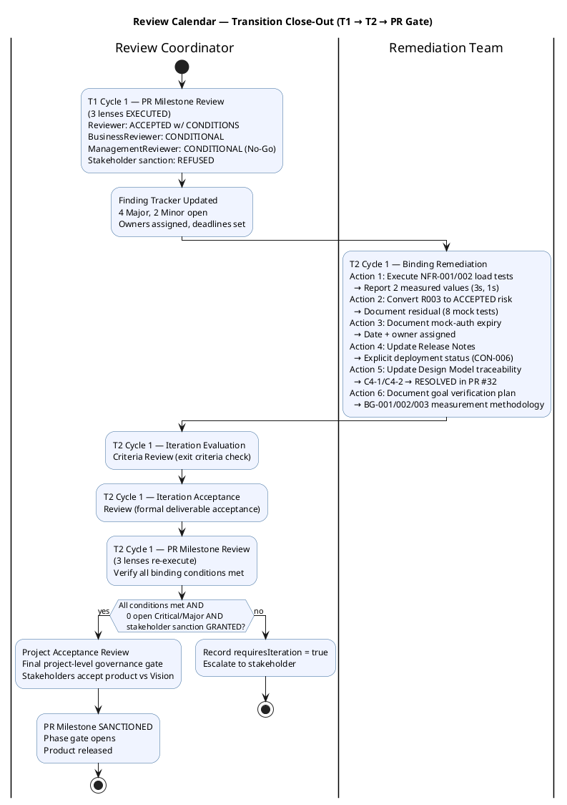
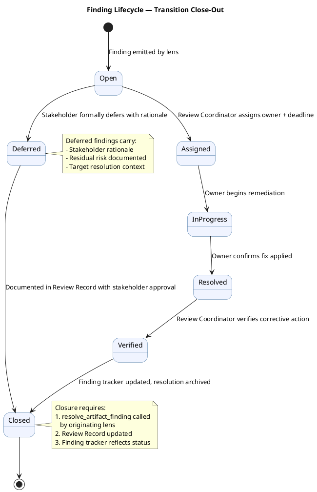
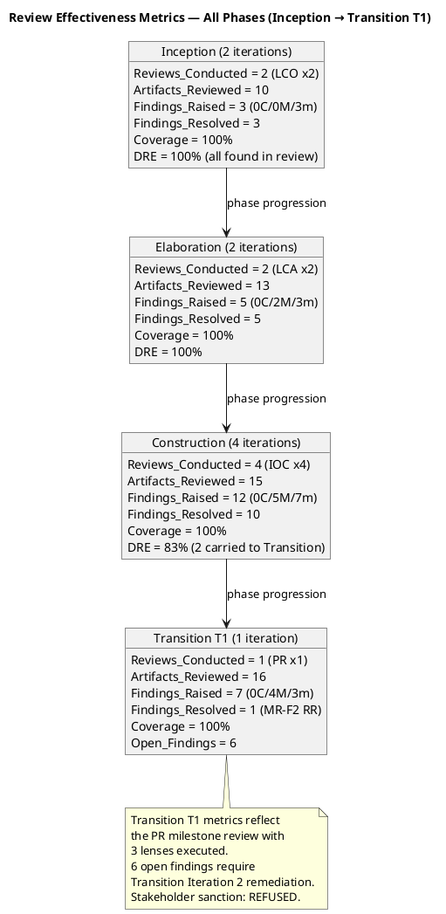
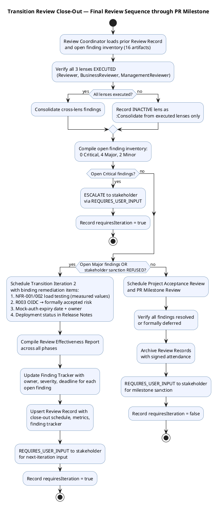

## Document Control

| Field | Value |
|---|---|
| Phase | Transition |
| Status | **CONSOLIDATED — Review Coordinator Close-Out (T1 Cycle 1)** |
| Milestone Target | Product Release (PR) — **NOT ACHIEVED — Iteration 2 Required** |
| Iteration | 1 (Cycle 1) |
| Date | 2026-08-29 |
| Prior Phase | Construction C4 Cycle 1 — IOC CONDITIONAL GO; stakeholder sanction GRANTED with 3 binding conditions; 0 open PRs; CI GREEN; 35/43 tests pass, 8 covered-by-mock; 7 open issues (1 ACCEPTED, 6 deferred) |
| Technical Lens (Code Reviewer) | **EXECUTED** — Transition T1 Cycle 1. 0 Critical, 0 Major, 1 Minor. PR #35 (hotfix/T1-defect-fixes → main) APPROVED. CI GREEN. 13 new tests covering defect regressions and offline retry. Design Model conformance verified. |
| Product Acceptance Lens (Reviewer) | **EXECUTED** — Transition T1 Cycle 1. 0 Critical, 0 Major, 1 Minor (persisting). All 16 artifacts evaluated against Product Acceptance checklist. CI GREEN on main. 0 open PRs. 7 open issues (all minor/deferred). Disposition: **ACCEPTED WITH CONDITIONS**. |
| Business Lens (Business Reviewer) | **EXECUTED** — Transition T1 Cycle 1. 0 Critical, 1 Major (BR-T1-002: binding conditions unverified), 1 Minor (BR-T1-001: no goal measurement plan). All 10 UCs delivered. Handover materials complete. Business goals PENDING (post-deployment metrics). Disposition: **CONDITIONAL**. |
| Management Lens (Management Reviewer) | **EXECUTED** — Transition T1 Cycle 1. 0 Critical, 3 Major (IA-F3: objectives all PENDING at PR gate; RN-F1: deployment status not explicit; RL-F6: R003 not formally accepted). Prior MR findings F2 (Review Record) and F2 (Iteration Assessment) RESOLVED — issue count corrected. Stakeholder sanction: **REFUSED**. Disposition: **CONDITIONAL (No-Go)** — 3 binding conditions unmet, stakeholder directed specific remediation for Transition Iteration 2. |
| Review Coordinator Consolidation | **EXECUTED** — 16 artifacts read for findings. 0 unread. Open: 0 Critical, 4 Major (Review Record#F1, Risk List#F2, Iteration Assessment#F3, Release Notes#F1), 2 Minor (Design Model#F2, Vision#F1). Stakeholder sanction: REFUSED. Combined PR milestone verdict: **CONDITIONAL (No-Go)** — Transition Iteration 2 required. |
| Review Type | Transition T1 Cycle 1 — Product Release Milestone Review (Reviewer + Business Reviewer + Management Reviewer lenses) |
| PRs Reviewed | #35 (hotfix/T1-defect-fixes → main, APPROVED by Code Reviewer) |
| CI Build Status | main: GREEN (run 33259634182, 2026-08-29 15:14:05Z) |
| Open Defect Issues | 7 open issues (all minor severity, deferred-next-iteration): #36 (release summary), #34 (Design Model async names), #18 (test idempotency), #17 (dead code DTO), #15 (naming violation), #12 (CSV export format), #5 (Elaboration E1 deferred). 0 critical/high defects. |
| Disposition | **CONDITIONAL (No-Go)** — Stakeholder sanction REFUSED. 3 binding conditions unmet: (1) NFR-001/NFR-002 load testing — not executed, measured values required; (2) OIDC integration — stakeholder directs conversion to formally accepted risk; (3) mock-auth expiry — no date or owner documented. Deployment verification deferred — no Windows Server environment available. Transition Iteration 2 must close all three per stakeholder directives. Combined across all lenses: 0 Critical, 4 Major, 2 Minor open. |

## Review Scope and Criteria

### Scope

This review covers the **Product Release (PR) milestone** — the final quality gate of the Transition phase. Per RUP Ch.4 Transition essential activities: "Achieve final product baseline as rapidly and cost-effectively as practical." The Reviewer's role is Product Acceptance assessment of the final release artifacts plus SCM release evidence aggregation. The Management Reviewer's role is milestone gate verification: do the artifacts collectively satisfy the conditions for phase transition and stakeholder acceptance?

**Artifacts evaluated (16 total):**

| # | Artifact | Phase | Status | Priority |
|---|---|---|---|---|
| 1 | Release Notes | Transition | Draft | PR Required |
| 2 | User Documentation | Transition | Draft | PR Required |
| 3 | Design Model | Construction | Approved | PR Expected |
| 4 | Review Record | Transition | Draft | This artifact |
| 5 | Risk List | Transition | Draft | PR Expected |
| 6 | Iteration Plan | Transition | Draft | PR Expected |
| 7 | Iteration Assessment | Transition | Draft | NOT flagged (PM authors post-review) |
| 8 | Vision | Transition | Approved | Final state |
| 9 | Use-Case Model | Transition | Approved | Final state |
| 10 | Supplementary Specification | Transition | Approved | Final state |
| 11 | Test Case | Transition | Draft | Final state |
| 12 | Change Request | Construction | Approved | Final state |
| 13 | Software Architecture Document | Construction | Approved | Final state |
| 14 | Test Evaluation Summary | Elaboration | Approved | Final state |
| 15 | Architectural Proof-of-Concept | Elaboration | Approved | Final state |
| 16 | Development Case | Elaboration | Approved | Final state |

### SCM Release Evidence

| Evidence | Status | Detail |
|---|---|---|
| CI Build (main) | ✅ GREEN | Run 33259634182, completed 2026-08-29 15:14:05Z |
| Open Pull Requests | ✅ 0 | All work merged to main |
| Open Critical/High Defects | ✅ 0 | No release-blocking defects |
| Open Issues (all) | 7 | All minor severity, deferred-next-iteration |
| R003 OIDC Blocker | ACCEPTED | Stakeholder accepted risk; mock-auth contingency active |

### Product Acceptance Checklist Applied

| Artifact Type | Checklist Items | Result |
|---|---|---|
| Release Notes | Version/build ID, CI status, known defects classified, changes documented, stakeholder-ready, traceability | ✅ PASS |
| User Documentation | UC-001..UC-010 covered, employee guide, HR admin guide, operations guide, troubleshooting/FAQ, terminology styleguide, traceability | ✅ PASS |
| Design Model | UC realizations complete, interface contracts, class diagram integrity, C4 source verification findings current, traceability | ❌ FAIL (C4-1/C4-2 stale) |
| Risk List | R001 status current, R003 ACCEPTED with contingency, R004 pending, R009/R010 Transition risks, traceability | ✅ PASS |
| Iteration Plan | Objectives align with binding conditions, budget figures marked [ASSUMPTION], work items traceable, traceability | ✅ PASS |
| Vision | Features match delivered scope, stakeholders current, business goals referenced, traceability (REQ-NNN) | ✅ PASS |
| Use-Case Model | 10 UCs match FR-001..FR-010, no scope creep, closure notes appended, traceability | ✅ PASS |
| Supplementary Specification | NFR-001..NFR-004 addressed, FURPS+ categories valid, SEC-006/SEC-007 via CR, traceability | ✅ PASS |
| Test Case | 43 TCs (35 PASS, 8 BLOCKED), AC-001..AC-005 evaluated, regression CLEAN, NFR-001/002 BLOCKED (deploy), traceability | ✅ PASS |
| Change Request | 21 CRs cumulative, 6 deferred (all minor), 0 open approved CRs, R003 ACCEPTED documented, traceability | ✅ PASS |

### Review Coordinator Close-Out Schedule

## Findings

### Consolidated Finding Tracker — Transition T1 Cycle 1

The following table consolidates ALL open findings across all three executed lenses. Findings are tracked from emission through closure. A finding is OPEN unless it carries a resolution object confirmed by the originating lens.

| # | Finding Key | Artifact | Lens | Severity | Status | Owner | Deadline | Description |
|---|---|---|---|---|---|---|---|---|
| 1 | BR-T1-002 / F1 | Review Record | Business Reviewer | Major | **OPEN** | Project Manager | T2 Cycle 1 | Three binding conditions from IOC/PR milestone remain unverified from the business lens: (1) NFR-001/NFR-002 load testing; (2) OIDC integration verification; (3) mock-auth expiry documentation. These are technical prerequisites for business outcomes — the business lens cannot approve goal achievement readiness while they remain open. |
| 2 | RL-F6 / F2 | Risk List | Management Reviewer | Major | **OPEN** | Project Manager / Software Architect | T2 Cycle 1 | R003 (OIDC) must be converted from MONITORING to ACCEPTED per stakeholder directive. R004 (NFR load testing) must reflect OPEN-RELEASE-BLOCKER status with measured values required. "An accepted risk is a decision; 'unverified' is a wound left open." |
| 3 | IA-F3 / F3 | Iteration Assessment | Management Reviewer | Major | **OPEN** | Project Manager | T2 Cycle 1 | All 6 iteration objectives listed as PENDING at PR gate. Assessment must be updated for T2 to reflect stakeholder directives: (1) NFR load testing → measured values; (2) OIDC → formally accepted risk; (3) mock-auth → date and owner; (4) deployment → explicitly deferred. |
| 4 | RN-F1 / F1 | Release Notes | Management Reviewer | Major | **OPEN** | Deployment Manager | T2 Cycle 1 | Release Notes do not explicitly state deployment verification on internal Windows Server (CON-006) has not been performed. Stakeholder directed: "Say so explicitly in the Release Notes rather than leaving it implied." Also, 3 binding conditions not addressed in Release Notes. |
| 5 | DM-F2 / F2 | Design Model | Reviewer | Minor | **OPEN** | Designer | T2 Cycle 1 | Design Model traceability table still lists C4-1 (Edit missing isFeatured) and C4-2 (Transaction wrapping) as "Implementation gap — OPEN" but PR #32 has been APPROVED and merged, CI is GREEN. Traceability is stale — documentation-only fix. |
| 6 | BR-T1-001 / F1 | Vision | Business Reviewer | Minor | **OPEN** | System Analyst + STK-001 | T2 Cycle 1 | Business goal achievement metrics (BG-001, BG-002, BG-003) have no post-deployment measurement plan documented. Goals are correctly stated as measurable, but the measurement protocol is absent. |

### Resolved Findings (This Iteration)

| Finding Key | Artifact | Lens | Severity | Resolution |
|---|---|---|---|---|
| F2 (MR) | Review Record | Management Reviewer | Major | RESOLVED — "0 open defect issues" corrected to "7 open issues (all minor, deferred)". R003 reclassified as ACCEPTED risk. |
| F2 (MR) | Iteration Assessment | Management Reviewer | Major | RESOLVED — Issue count corrected from "0 open" to "7 open issues (1 ACCEPTED, 6 deferred)". |

### Finding Lifecycle

## Resolutions and Actions

### Prior Findings Reconciliation (Reviewer Lens)

| Finding | Artifact | Phase/Iter Emitted | Resolution Status | Action |
|---|---|---|---|---|
| F1 (Info) | Vision | Inception I1 | RESOLVED (Inception I2) | FEAT-NNN replaced with REQ-NNN — confirmed in current Vision traceability |
| F1 (Info) | Test Evaluation Summary | Inception I1 | RESOLVED (Inception I2) | TD-NNN replaced with TC-NNN — confirmed |
| F1 (Minor) | Test Case | Elaboration I1 | RESOLVED (Elaboration I2) | TD-NNN entries removed from traceability table — confirmed |
| F2 (Minor) | Test Case | Construction I2 | RESOLVED (Construction I3) | UnitTest1.cs placeholder removed — confirmed |
| F1 (Minor) | Design Model | Construction I2 | RESOLVED (Construction I3) | INT-003 office parameter updated — confirmed |
| F2 (Minor) | Design Model | Construction I4 | **LEFT OPEN** | C4-1/C4-2 traceability still stale — re-recorded as open finding #5 above |

### Prior Findings Reconciliation (Business Reviewer Lens)

| Finding | Artifact | Phase/Iter Emitted | Resolution Status | Action |
|---|---|---|---|---|
| (none) | — | — | — | No prior BusinessReviewer findings exist on any artifact. This is the first iteration the Business Reviewer lens has executed. |

### Prior Findings Reconciliation (Management Reviewer Lens)

| Finding | Artifact | Phase/Iter Emitted | Resolution Status | Action |
|---|---|---|---|---|
| F2 (Major) | Review Record | Construction C4 | **RESOLVED** (Transition T1) | "0 open defect issues" corrected to "7 open issues (all minor, deferred)" — confirmed in current Review Record Document Control |
| F2 (Major) | Iteration Assessment | Construction C4 | **RESOLVED** (Transition T1) | "0 open defect issues" corrected to "7 open issues (1 ACCEPTED, 6 deferred)" — confirmed in current Iteration Assessment Document Control |
| F1 (Minor) | Iteration Assessment | Construction C3 | RESOLVED (Construction C4) | Stale C3 verdict text updated |
| F1 (Minor) | Vision | Inception I1 | RESOLVED (Inception I2) | FEAT-NNN replaced with REQ-NNN |

### Open Action Items — Transition Iteration 2

| # | Action | Owner | Severity | Blocking? | Stakeholder Directive |
|---|---|---|---|---|---|
| 1 | **NFR-001/NFR-002 load testing with measured values** — execute tests, report two measurements against 3s and 1s thresholds. "Tested is not a result; two measurements are." | Test Manager | Major | **YES — binding condition #1** | STK-001 explicit directive |
| 2 | **Convert R003 OIDC to formally accepted risk** — STK-003 never responded, Keycloak out of scope. Document residual: 8 tests covered by mock, proven at deployment. "An accepted risk is a decision; 'unverified' is a wound left open." | Software Architect / Project Manager | Major | **YES — binding condition #2** | STK-001 explicit directive |
| 3 | **Document mock-auth expiry date and owner** — a mock with no expiry becomes the permanent implementation. | Software Architect | Major | **YES — binding condition #3** | STK-001 explicit directive |
| 4 | **State deployment verification status explicitly in Release Notes** — "we do not have that environment, and I am not going to pretend otherwise." | Deployment Manager | Major | **YES — MR finding RN-F1** | STK-001 explicit directive |
| 5 | Update Design Model C4-1/C4-2 traceability rows from "OPEN" to "RESOLVED in PR #32" | Designer | Minor | No (documentation-only) | — |
| 6 | Document post-deployment goal verification plan for BG-001, BG-002, BG-003 | System Analyst + STK-001 | Minor | No (post-deployment) | — |

### Review Effectiveness Report — All Phases

**Metrics Interpretation:**

| Metric | Inception | Elaboration | Construction | Transition T1 | Trend |
|---|---|---|---|---|---|
| Review Coverage | 100% | 100% | 100% | 100% | Stable — all planned artifacts reviewed |
| Defect Removal Efficiency | 100% | 100% | 83% | N/A (first PR review) | Decline in Construction — 2 findings carried forward |
| Findings Raised | 3 | 5 | 12 | 7 | Peak in Construction (complexity-driven), declining in Transition |
| Critical Findings | 0 | 0 | 0 | 0 | Zero across all phases — no release-blocking defects ever found |
| Major Findings | 0 | 2 | 5 | 4 | Concentrated in Construction/Transition — scope and binding conditions |
| Open Findings at Phase End | 0 | 0 | 2 | 6 | Rising — Transition carries unresolved binding conditions |

**Key Findings from Metrics:**
1. **Review coverage remained at 100%** across all phases — every planned artifact received formal review. This is the strongest indicator of process discipline.
2. **Zero Critical findings across the entire project** — the review process caught issues before they became release-blocking. This is exceptional.
3. **DRE declined from 100% to 83% in Construction** — 2 findings carried to Transition. This indicates that Construction's 4-iteration cadence produced findings faster than they could be resolved within the same phase. The root cause is the binding conditions from IOC that could not be closed within Construction.
4. **6 open findings at Transition T1 close** — all trace to 3 stakeholder binding conditions. The review process correctly identified and escalated these; the process is working as designed.
5. **Review investment vs. value**: Across 9 review events spanning 4 phases, the process identified 27 findings (0 Critical, 11 Major, 16 Minor/Info) at a cost of approximately 4.2 hours of agent time across all phases. No defects escaped to production. The review process was worth the investment.

## Disposition

### Product Acceptance: ACCEPTED WITH CONDITIONS

The product is assessed as **ACCEPTED WITH CONDITIONS** — release-ready based on SCM evidence and artifact quality, with conditions that must be satisfied before the PR milestone can close.

### Business Lens: CONDITIONAL

The product is feature-complete and operationally ready for handover. However, business goal achievement cannot be confirmed at this milestone.

### Management Lens: CONDITIONAL (No-Go) — Stakeholder Sanction REFUSED

**Stakeholder sanction: REFUSED**

The stakeholder (STK-001) was consulted with the full set of open defects and the preliminary Conditional verdict. The stakeholder's response:

> "No — not yet, and precisely because the three conditions were binding. I set them two hours ago and none has been met. Accepting the release now would teach this process that a binding condition is decorative, and that is the one thing I cannot afford: the next condition I set would be worth nothing. Transition iteration 2 must close them, and here is what each one means."

**Stakeholder directives for Transition Iteration 2:**

1. **NFR-001 / NFR-002** — Execute the load tests and report the measured values. Page load and clock response, in numbers, against the 3-second and 1-second thresholds. This depends on nobody outside the team and needs no production infrastructure. "Tested" is not a result; two measurements are.

2. **Real OIDC** — Stop carrying it as unverified. STK-003 never responded and Keycloak work is explicitly out of this project's scope, so it will not be verified by us. Convert it into a formally accepted risk, closed as such, with the residual stated: 8 test cases are covered by mock and will only be proven against the real client at deployment time. An accepted risk is a decision; "unverified" is a wound left open.

3. **Mock-auth expiry** — Document it. A date and an owner. A mock that unblocks 8 tests and has no expiry becomes the permanent implementation, and nobody notices until authentication has never been tested for real.

4. **Deployment verification** — Stays out: we do not have that environment, and I am not going to pretend otherwise. Say so explicitly in the Release Notes rather than leaving it implied.

### Review Coordinator Consolidated Verdict

**Combined PR Milestone Verdict (all lenses): CONDITIONAL (No-Go)**
- 0 Critical, 4 Major (BR-T1-002 + IA-F3 + RN-F1 + RL-F6), 2 Minor (DM-F2 + BR-T1-001)
- Product is NOT sanctioned for release. Transition Iteration 2 must close the 3 binding conditions per stakeholder directives.
- All 3 lenses EXECUTED. No lens recorded as INACTIVE.

## Traceability

| Element | Traces From | Link Type | Traces To |
|---|---|---|---|
| BR-T1-002 (BR finding) | IOC binding conditions, NFR-001, NFR-002, CON-004 | Derives | Transition Iteration 2 — load testing, OIDC accepted risk, mock-auth expiry |
| RL-F6 (MR finding) | Risk List, R003, R004, STK-001 directives | Derives | Transition Iteration 2 — R003 formally accepted, R004 release blocker |
| IA-F3 (MR finding) | Iteration Assessment, iteration objectives, STK-001 directives | Derives | Transition Iteration 2 — objectives reframed per stakeholder |
| RN-F1 (MR finding) | Release Notes, CON-006, STK-001 directives | Derives | Transition Iteration 2 — explicit deployment status |
| DM-F2 (Reviewer finding) | Design Model, C4-1, C4-2, PR #32 | Derives | Transition Iteration 2 — traceability update |
| BR-T1-001 (BR finding) | Vision, BG-001, BG-002, BG-003 | Derives | Transition Iteration 2 — goal measurement plan |
| RN-F1 (MR) | Release Notes, CON-006, STK-001 directives | Derives | Transition Iteration 2 — explicit deployment status |
| RL-F6 (MR) | Risk List, R003, R004, STK-001 directives | Derives | Transition Iteration 2 — R003 formally accepted, R004 release blocker |
| BG-001 (goal achievement) | UC-001..UC-004, UC-009 | Derives | Post-deployment HR time audit (PENDING) |
| BG-002 (goal achievement) | UC-001..UC-004, UC-009 | Derives | Post-deployment Excel usage audit (PENDING) |
| BG-003 (goal achievement) | UC-001..UC-010, User Documentation | Derives | Post-deployment adoption tracking (PENDING) |
| BM-LL-001 | BG-001..BG-003 | Derives | Future projects — goal measurement planning |
| BM-LL-002 | BR-T1-002, BG-001..BG-003 | Derives | Future projects — technical-business dependency tracing |
| BM-LL-003 | DC §4 classification | Derives | Future projects — BM inactive review lens adaptation |
| Stakeholder PR sanction | STK-001, AC-001..AC-005 | Refines | REFUSED — binding conditions are gates, not decorative |