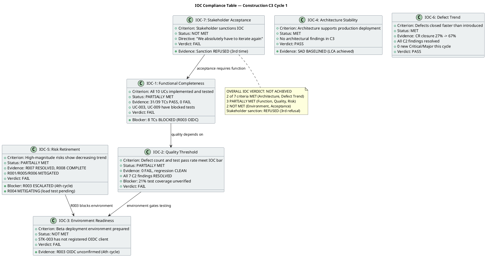
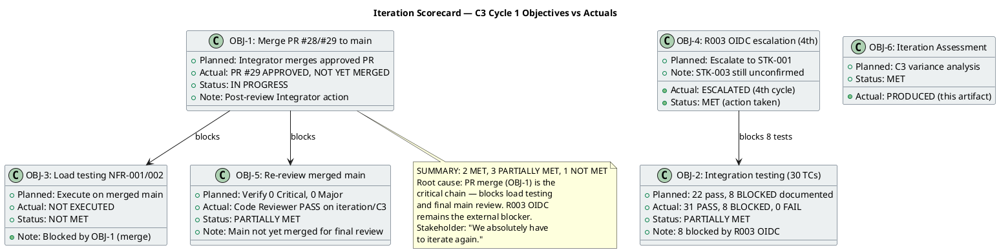
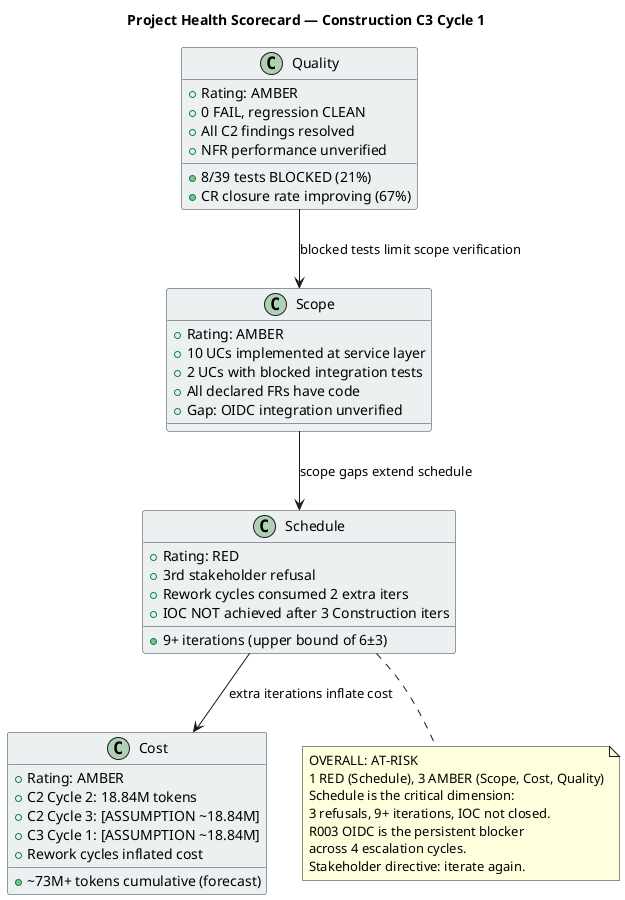
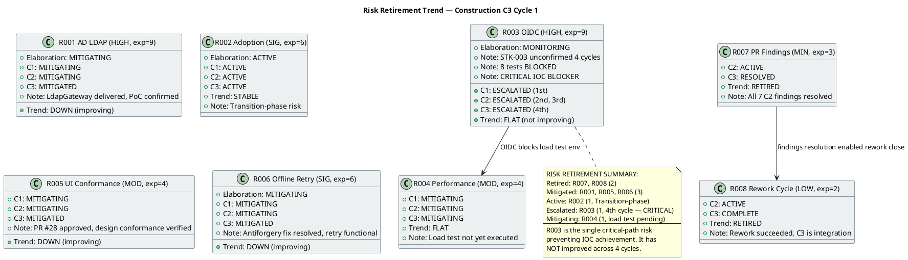
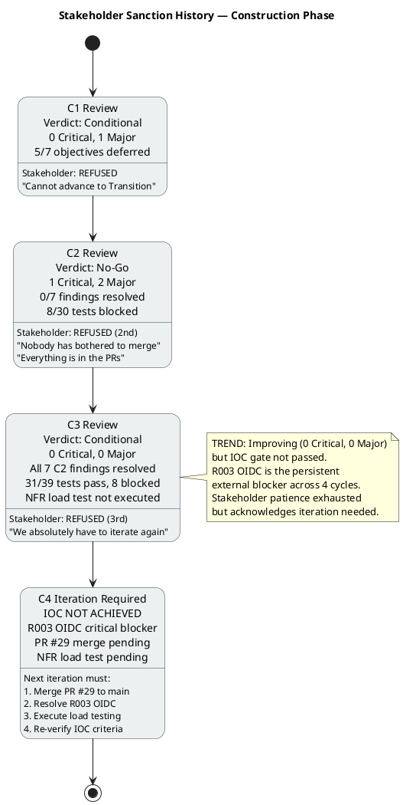

## Document Control
| Field | Value |
|---|---|
| Phase | Construction |
| Status | **CONSOLIDATED — Review Coordinator C3 Cycle 1 (IOC Milestone Review)** |
| Milestone Target | End-of-Construction (IOC) — **NOT ACHIEVED** |
| Iteration | 3 (Cycle 1) |
| Date | 2026-08-29 |
| Prior Phase | Construction C2 Cycle 3 (Consolidation — 1 Critical, 2 Major, 4 Minor persisting; stakeholder sanction REFUSED 2nd time) |
| Technical Lens (Code Reviewer) | EXECUTED — Construction C3 Cycle 1. 0 Critical, 0 Major, 0 Minor new findings. PR #29 APPROVED. All 7 C2 findings RESOLVED. |
| Business Lens (Business Reviewer) | INACTIVE — did not evaluate this review |
| Management Lens (Management Reviewer) | EXECUTED — Construction C3 Cycle 1. 0 Critical, 2 Major (IP-F5, RL-F5), 1 Minor (IA-F1). Prior findings IP-F4 and RL-F2 RESOLVED. |
| Review Coordinator | CONSOLIDATED — 15 artifacts read, 0 unread. Open: 0 Critical, 2 Major, 1 Minor. Stakeholder sanction REFUSED (3rd time). |
| Review Type | Construction C3 Cycle 1 — Iteration Acceptance + IOC Milestone Review (Consolidation) |
| PRs Reviewed | #29 (iteration/C3 → main, APPROVED), #19 (stale, superseded), #8 (stale, superseded) |
| CI Build Status | iteration/C3: GREEN (run 33250807692, 2026-08-29 11:45:21Z); main: GREEN (run 33251398612, 2026-08-29 12:00:47Z) |
| Open Defect Issues | 0 |
| Prior Findings Resolved (Code Reviewer lens) | DM-F1 (Minor, Design Model) — RESOLVED; TC-F2 (Minor, Test Case) — RESOLVED |
| Prior Findings Resolved (Management Reviewer lens) | IP-F4 (Minor, Iteration Plan) — RESOLVED; RL-F2 (Minor, Risk List) — RESOLVED |
| New Findings (Management Reviewer, this cycle) | 0 Critical, 2 Major (IP-F5: NFR load testing not executed; RL-F5: R003 OIDC risk not retired 4 cycles), 1 Minor (IA-F1: stale consolidated verdict) |
| Stakeholder Sanction | **REFUSED (3rd time).** Directive: "We absolutely have to iterate again." |
| Consolidated Verdict | **CONDITIONAL — IOC NOT ACHIEVED.** Code quality clean, all C2 findings resolved, CI green. 2 blockers: R003 OIDC (8 tests BLOCKED, 4th escalation) and NFR load testing not executed. Stakeholder sanction REFUSED. **Auto-iteration required.** |
| [FINDINGS] | read=15, unread=none, open Critical=0, open Major=2 [Risk List#RL-F5, Iteration Plan#IP-F5], open Minor=1 [Iteration Assessment#IA-F1] |
## Review Scope and Criteria

This review evaluates Construction C3 Cycle 1 against two lenses:

**Code Reviewer Checklist (C3 Cycle 1):**
1. CI Build Status (hard gate) — **PASS** (green on iteration/C3, run 33250807692; green on main, run 33251398612)
2. Programming Guidelines Conformance — **PASS** (C# conventions followed, XML doc comments on all interfaces)
3. Dual Coverage (black-box + white-box tests) — **PASS** (ClockingServiceTests 13 tests with both black-box and white-box coverage; NewsServiceTests, OfflineRetryTests, DirectoryServiceTests, WorkerCategoryServiceTests, DomainTests all present)
4. Design Model Conformance (class names, signatures, interfaces) — **PASS** (INT-001, INT-002, INT-003 all verified against source code on iteration/C3 branch)
5. SAD Implementation View Conformance (subsystem boundaries, layer placement) — **PASS**
6. Defect Patterns (null references, resource leaks, concurrency risks) — **PASS** (StreamWriter leaveOpen:true, stream position reset, factory pattern in tests)
7. Traceability (code → Design Model, tests → UCs) — **PASS** (39 TCs mapped to 10 UCs; source files mapped to CLS/INT IDs)
8. C2 Finding Resolution — **PASS** (all 7 C2 findings resolved: C2-CRIT-1, C2-MAJ-1, C2-MAJ-2, C2-MIN-1..4)

**Management Reviewer Checklist (IOC Milestone):**
1. Functional Completeness — **PARTIALLY MET** (31/39 TCs PASS, 8 BLOCKED by R003 OIDC)
2. Quality Threshold — **PARTIALLY MET** (0 FAIL, regression CLEAN, but 21% coverage unverified)
3. Environment Readiness — **NOT MET** (R003 OIDC unconfirmed, 4th escalation cycle)
4. Architecture Stability — **MET** (SAD BASELINED, no architectural findings)
5. Risk Retirement — **PARTIALLY MET** (R007/R008 retired, R001/R005/R006 mitigated, R003/R004 unresolved)
6. Defect Trend — **MET** (CR closure 27% → 67%, all C2 findings resolved, 0 new Critical/Major)
7. Stakeholder Acceptance — **NOT MET** (Sanction REFUSED 3rd time)

**Document Artifact Checklist (C3 Cycle 1):**

| Artifact | Checklist Applied | Result |
|---|---|---|
| Design Model | UC realization coverage, interface contracts, class diagrams, traceability | PASS — all items pass; DM-F1 resolved |
| Test Case | UC coverage, regression completeness, defect resolution | PASS — 39 TCs, 31 PASS / 8 BLOCKED (R003) / 0 FAIL; TC-F2 resolved |
| Iteration Assessment | Iteration objectives documented, C2 outcome recorded | PASS with Minor finding (IA-F1: stale verdict fields) |
| Use-Case Model | UC completeness (10 UCs = 10 FRs), CR reflection, traceability | PASS — CR-023/024 reflected, [DERIVED] markers retired |
| Supplementary Specification | NFR coverage, FURPS+ completeness | PASS — SEC-006/007 added from approved CRs |
| SAD | Architecture stability, implementation view conformance | PASS — baseline maintained, no architectural findings |
| Change Request | CR state machine compliance, CCB decisions | PASS — 67% closure rate, 6 completed this iteration |
| User Documentation | UC coverage, accuracy, terminological contract | PASS — all 10 UCs documented, C2 fixes reflected |

## Findings

### Prior Findings Reconciled (S_RECONCILE_PRIOR_FINDINGS)

| Finding Key | Artifact | Severity | Lens | Status | Resolution |
|---|---|---|---|---|---|
| DM-F1 | Design Model | Minor | Code Reviewer | RESOLVED | INT-003 (IDirectoryService) contract updated to include optional `office` parameter. Verified in source code on iteration/C3 branch. |
| TC-F2 | Test Case | Minor | Code Reviewer | RESOLVED | UnitTest1.cs placeholder (`Assert.True(true)`) removed on iteration/C3 branch. |
| IP-F4 | Iteration Plan | Minor | Management Reviewer | RESOLVED | Mid-iteration checkpoints (CP-1 through CP-4) added to C3 Cycle 1 plan with escalation rules. `resolve_artifact_finding` call: 2026-08-29T12:07:38Z. |
| RL-F2 | Risk List | Minor | Management Reviewer | RESOLVED | R008 contingency activated and completed — status changed to COMPLETE. `resolve_artifact_finding` call: 2026-08-29T12:07:38Z. |

### New Findings — Code Reviewer Lens (C3 Cycle 1)

No new findings emitted this cycle. All 8 document artifacts evaluated against their type-specific checklists passed every item. Source code inspection of iteration/C3 branch confirmed all interface contracts match Design Model.

### New Findings — Management Reviewer Lens (C3 Cycle 1)

| Finding Key | Artifact | Severity | Description | Recommendation | Verdict |
|---|---|---|---|---|---|
| IP-F5 | Iteration Plan | Major | C3 Cycle 1 plan defined NFR-001/NFR-002 load testing as work item 3 but it was not executed. The plan's dependency chain (merge → load testing) meant the merge delay cascaded into unverified performance requirements. No fallback path was documented for testing against the iteration branch if the merge was delayed. | Add a fallback: if merge to main is delayed, execute load testing against iteration/C3 branch (same codebase, CI green). Decouple load testing from the merge dependency. | NeedsRework |
| RL-F5 | Risk List | Major | R003 (OIDC, HIGH, exposure=9) has been ESCALATED across 4 consecutive cycles with no resolution. Trend is FLAT. The mock-auth contingency has not been formally presented to the stakeholder as a decision point. Perpetual escalation without a decision is a governance failure. | Set a hard deadline for STK-003 OIDC registration. If deadline passes, formally present mock-auth contingency to stakeholder for approval as the IOC path. R003 must transition to RESOLVED or ACCEPTED. | NeedsRework |
| IA-F1 | Iteration Assessment | Minor | Consolidated Verdict and Management Lens fields still read "PENDING" — stale after the review has been conducted. 2 new Major findings (IP-F5, RL-F5) not reflected. | Update Document Control: Consolidated Verdict = "CONDITIONAL — Stakeholder sanction REFUSED (3rd). IOC NOT ACHIEVED." Management Lens = "2 new Major findings (IP-F5, RL-F5). Prior IP-F4/RL-F2 RESOLVED." | NeedsRework |

### Code-Level Findings (Code Reviewer)

No code-level findings. Source code inspection of iteration/C3 branch confirmed:
- INT-001 (IClockingService): `RecordClocking` with `idempotencyKey`, `GetCurrentStatus`, `GetHistory`, `GetAllClockings`, `ExportCsv` — all match Design Model
- INT-002 (INewsService): `Publish`, `Edit`, `Unpublish`, `GetById`, `GetPublishedNews`, `GetFeaturedNews`, `ListAll` — all match Design Model, `isFeatured` parameter present
- INT-003 (IDirectoryService): `Search(string query, string? office = null)` — matches Design Model with office parameter
- ClockingServiceTests.cs: 13 tests with dual coverage (black-box: contract verification; white-box: idempotency scoping, input validation, status logic)
- CSV header fix (C2-MIN-4): header now `Employee,Date,Time,Direction` matching data columns

### PR Disposition (Code Reviewer)

| PR | Branch | Verdict | Rationale |
|---|---|---|---|
| #29 | iteration/C3 → main | **APPROVED** | All checklist items pass. CI green. All 7 C2 findings resolved. Design Model conformance verified. Approved for merge to main. |
| #19 | feature/C2-presentation → iteration/C2 | Superseded | Stale from C2. Superseded by PR #28/#29. Prior REQUEST_CHANGES stands. |
| #8 | feature/C1-presentation → iteration/C1 | Superseded | Stale from C1. Superseded by PR #28/#29. Prior REQUEST_CHANGES stands. |

## Resolutions and Actions

### Resolved This Cycle

| Item | Action | Evidence |
|---|---|---|
| DM-F1 (Design Model) | INT-003 office parameter aligned | `resolve_artifact_finding` call, 2026-08-29T12:04:48Z (Code Reviewer) |
| TC-F2 (Test Case) | UnitTest1.cs placeholder removed | `resolve_artifact_finding` call, 2026-08-29T12:04:48Z (Code Reviewer) |
| IP-F4 (Iteration Plan) | Mid-iteration checkpoints added (CP-1 through CP-4) | `resolve_artifact_finding` call, 2026-08-29T12:07:38Z (Management Reviewer) |
| RL-F2 (Risk List) | R008 contingency activated and completed | `resolve_artifact_finding` call, 2026-08-29T12:07:38Z (Management Reviewer) |
| PR #29 | Approved for merge to main | `scm_approve_pull_request` call, review 5058036957 (Code Reviewer) |

### Open Action Items

| Item | Owner | Priority | Description |
|---|---|---|---|
| PR #29 merge | Integrator | HIGH | Merge approved PR #29 to main to synchronize the codebase — stakeholder directive |
| R003 OIDC | STK-003 / Infrastructure | HIGH | 4th escalation — OIDC client registration must be confirmed to unblock 8 tests. Decision-forcing mechanism required (RL-F5). |
| NFR load testing | Software Architect | HIGH | NFR-001/NFR-002 load testing not executed — decouple from merge dependency (IP-F5) |
| IA-F1 | Project Manager | Minor | Update Iteration Assessment stale verdict fields |
| Stakeholder sanction | Management Reviewer | BLOCKING | Stakeholder refused 3rd time — "We absolutely have to iterate again." Next iteration must address R003 and NFR verification. |

## Disposition

### Iteration Acceptance: Objectives PARTIALLY MET

**What was achieved:**
- All 7 C2 code-level findings resolved (C2-CRIT-1, C2-MAJ-1, C2-MAJ-2, C2-MIN-1..4)
- PR #29 (iteration/C3 → main) approved by Code Reviewer — ready for merge
- CI green on both iteration/C3 and main branches
- All 8 document artifacts pass their type-specific checklists with zero new Code Reviewer findings
- Prior Reviewer-lens findings (DM-F1, TC-F2) resolved
- Prior Management Reviewer findings (IP-F4, RL-F2) resolved
- Source code verified to conform to Design Model interface contracts
- Dual coverage tests present (black-box + white-box)
- 31 of 39 test cases PASS, 0 FAIL
- CR closure rate improved from 27% to 67%

**What remains (IOC blockers):**
- PR #29 must be merged to main (Integrator action — post-review Deliver step)
- R003 OIDC infrastructure dependency unresolved (4th escalation) — 8 tests BLOCKED
- NFR-001/NFR-002 load testing not executed (IP-F5)
- R003 risk not retired — perpetual escalation without decision (RL-F5)
- IOC milestone cannot close until: (1) PR #29 merged, (2) OIDC environment provisioned or mock-auth approved, (3) blocked tests executed, (4) NFR load testing executed

**Stakeholder directive compliance:**
The stakeholder's C2 directive — "everything is in the PRs, all that's needed is to synchronize the PRs, main, and issues" — has been addressed by: (1) PR #28 approved and merged to iteration/C3, (2) PR #29 approved for merge to main. The Integrator must execute the merge. However, the stakeholder has refused sanction for the 3rd time, directing: "We absolutely have to iterate again."

### IOC Compliance Table

### Iteration Scorecard

### Project Health Scorecard

### Risk Retirement Trend

### Stakeholder Sanction History

### SCM Evidence

| Evidence | Status |
|---|---|
| CI Build (iteration/C3) | GREEN — run 33250807692, completed 2026-08-29 11:45:21Z |
| CI Build (main) | GREEN — run 33251398612, completed 2026-08-29 12:00:47Z |
| Open PRs | 3 (#29 approved, #19/#8 stale/superseded) |
| Open Defect Issues | 0 |
| Ready-for-review branches | 0 |

### Management Reviewer Verdict

**Verdict: CONDITIONAL — IOC NOT ACHIEVED**

The project has made significant progress this iteration: all 7 C2 code-level findings are resolved, CI is green on both branches, 31 of 39 tests pass with zero failures, and the CR closure rate improved from 27% to 67%. The code quality is clean and the architecture is stable.

However, the IOC milestone cannot close:
1. **R003 OIDC** (HIGH, exposure=9) remains unresolved after 4 escalation cycles — 8 tests are BLOCKED. This is the critical-path external dependency. The risk has not improved and the contingency has not been formally presented to the stakeholder for a decision (RL-F5).
2. **NFR-001/NFR-002 load testing** was not executed — the plan coupled it to the merge dependency with no fallback (IP-F5).
3. **Stakeholder sanction REFUSED** for the 3rd time. Directive: "We absolutely have to iterate again."

**Conditions for next iteration:**
1. Merge PR #29 to main (Integrator action)
2. Execute NFR-001/NFR-002 load testing against the merged main (or iteration/C3 branch if merge is delayed)
3. Force a decision on R003: either STK-003 provides OIDC registration by a hard deadline, or the stakeholder approves the mock-auth contingency as the IOC path
4. Execute the 8 blocked tests once OIDC is resolved (or mock-auth is approved)
5. Re-verify all 7 IOC exit criteria

## Traceability

| Element | Traces From | Link Type | Traces To |
|---|---|---|---|
| PR #29 | UC-001..UC-010, C2 findings | Realizes | main branch (pending merge) |
| PR #28 | C2-CRIT-1, C2-MAJ-1..2, C2-MIN-1..4 | Realizes | iteration/C3 branch (merged) |
| DM-F1 | Design Model INT-003 | Derives | PR #28 (RESOLVED), PR #29 (APPROVED) |
| TC-F2 | Test Case UnitTest1.cs | Derives | PR #28 (RESOLVED), PR #29 (APPROVED) |
| IP-F4 | Iteration Plan | Derives | Project Manager (RESOLVED — ManagementReviewer) |
| RL-F2 | Risk List | Derives | Project Manager (RESOLVED — ManagementReviewer) |
| IP-F5 | Iteration Plan, NFR-001, NFR-002 | Derives | C3 Cycle 1 work item 3 (not executed) |
| RL-F5 | Risk List R003, STK-003, CON-004 | Derives | 8 BLOCKED tests, IOC achievement |
| IA-F1 | Iteration Assessment | Derives | Document Control fields (stale) |
| CI Build (iteration/C3) | CON-001, CON-003 | DependsOn | GitHub Actions run 33250807692 |
| CI Build (main) | CON-001, CON-003 | DependsOn | GitHub Actions run 33251398612 |
| R003 | STK-003, CON-004 | DependsOn | TC-013, TC-014, TC-028..TC-030 (BLOCKED) |
| Stakeholder PR directive | STK-001 feedback (C2 Cycle 2) | Refines | PR #29 (APPROVED — pending Integrator merge) |
| Stakeholder iteration directive | STK-001 feedback (C3 Cycle 1) | Refines | C4 iteration required (IOC not achieved) |