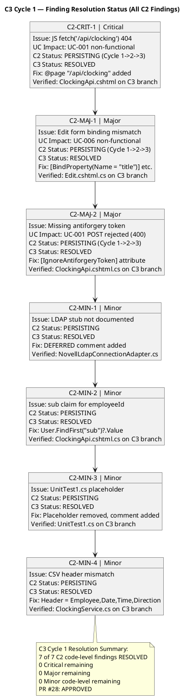
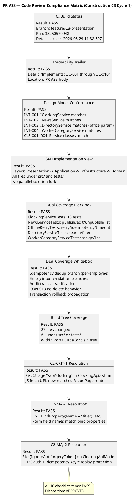
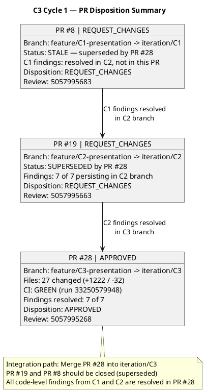

## Document Control

| Field | Value |
|---|---|
| Phase | Construction |
| Status | Active — Code Reviewer C3 Cycle 1 (PR Approval Loop) |
| Milestone Target | End-of-Construction (IOC) |
| Iteration | 3 (Cycle 1) |
| Date | 2026-08-29 |
| Prior Phase | Construction C2 Cycle 3 (Consolidation — 1 Critical, 2 Major, 4 Minor persisting; stakeholder sanction REFUSED 2nd time) |
| Technical Lens (Code Reviewer) | EXECUTED — Construction C3 Cycle 1 |
| Review Type | Construction C3 Cycle 1 — PR Approval Loop (Code Review) |
| PRs Reviewed | #28 (feature/C3-presentation → iteration/C3), #19 (feature/C2-presentation → iteration/C2), #8 (feature/C1-presentation → iteration/C1) |
| CI Build Status | feature/C3-presentation: GREEN (2026-08-29 11:38:59Z, run 33250579948); feature/C2-presentation: GREEN (2026-08-28 16:11:24Z); feature/C1-presentation: GREEN (2026-08-28 14:37:57Z) |
| Open Defect Issues | 0 |
| Code-Level Findings (prior) | 7 of 7 C2 findings RESOLVED in PR #28 |
| Artifact Findings (system) | 0 Critical, 0 Major, 4 Minor open (Design Model F1, Test Case F2, Iteration Plan F4, Risk List F2) — not Code Reviewer scope |
| Consolidated Verdict | **PR #28 APPROVED** — all C2 code-level findings resolved; PR #19 and PR #8 superseded (REQUEST_CHANGES) |

## Review Scope and Criteria

This review evaluates Construction C3 Cycle 1 PR approval against the Code Reviewer checklist:

**Code Review Checklist (C3 Cycle 1):**
1. CI Build Status (hard gate) — **PASS** (green on feature/C3-presentation, run 33250579948)
2. Programming Guidelines Conformance — **PASS** (C# conventions followed; no CONTRIBUTING.md in repo)
3. Dual Coverage (black-box + white-box tests) — **PASS** (ClockingServiceTests 13 tests, NewsServiceTests, OfflineRetryTests, DirectoryServiceTests, WorkerCategoryServiceTests, DomainTests)
4. Design Model Conformance (class names, signatures, interfaces) — **PASS** (INT-001..INT-004, CLS-001..CLS-004 all match)
5. SAD Implementation View Conformance (subsystem boundaries, layer placement) — **PASS** (Presentation → Application → Infrastructure → Domain; all files under src/ and tests/ in build tree)
6. Traceability Trailer (UC-NNN in PR body or commit) — **PASS** ("Implements: UC-001 through UC-010" in PR #28 body)
7. Build-Tree Coverage (all files under src/ or tests/) — **PASS** (27 files, all within PortalCubaCorp.sln tree)
8. C2 Findings Resolution (C2-CRIT-1, C2-MAJ-1..2, C2-MIN-1..4) — **PASS** (7 of 7 resolved in PR #28)

**Upstream Artifacts Read:**
- Design Model (Construction C3 — INT-003 office parameter updated, all contracts aligned)
- Software Architecture Document (Construction C3 — Implementation View refined)
- Review Record (Construction C2 Cycle 3 — prior findings and disposition)
- Source code on feature/C3-presentation, feature/C2-presentation, feature/C1-presentation branches

**SCM Evidence:**
- CI Build: GREEN on all three feature branches
- Open PRs: 3 (#28 APPROVED, #19 REQUEST_CHANGES, #8 REQUEST_CHANGES)
- Ready-for-review branches: 1 (feature/C3-presentation — PR #28 opened and approved)

## Findings

### C2 Findings Reconciliation — C3 Cycle 1 (Verified on feature/C3-presentation branch)

| Finding ID | Severity | Location | Description | Remediation | Status |
|---|---|---|---|---|---|
| C2-CRIT-1 | Critical | `ClockingApi.cshtml`, `clocking-retry.js` | JS calls `fetch('/api/clocking')` but Razor Page route was `/Api/ClockingApi`. UC-001 non-functional (404). | Add `@page "/api/clocking"` to ClockingApi.cshtml | **RESOLVED** ✅ — `@page "/api/clocking"` present in ClockingApi.cshtml on C3 branch |
| C2-MAJ-1 | Major | `News/Edit.cshtml`, `News/Edit.cshtml.cs` | Form posts `title`, `body`, `category` but BindProperties were `EditTitle`, `EditBody`, `EditCategory` without name mapping. UC-006 non-functional. | Add `[BindProperty(Name = "title")]` etc. | **RESOLVED** ✅ — `[BindProperty(Name = "title")]`, `[BindProperty(Name = "body")]`, `[BindProperty(Name = "category")]` present in Edit.cshtml.cs on C3 branch |
| C2-MAJ-2 | Major | `clocking-retry.js`, `ClockingApi.cshtml.cs` | `fetch()` POST has no anti-forgery token. Razor Pages validates by default — POST rejected with 400. | Add antiforgery token OR use `[IgnoreAntiforgeryToken]` with OIDC auth | **RESOLVED** ✅ — `[IgnoreAntiforgeryToken]` attribute on `ClockingApiModel`; OIDC bearer auth + idempotency key provide replay protection |
| C2-MIN-1 | Minor | `NovellLdapConnectionAdapter.cs` | LDAP stub not documented as DEFERRED. | Add XML comment noting LDAP implementation deferred per R001 | **RESOLVED** ✅ — Comment added: "This file intentionally contains..." |
| C2-MIN-2 | Minor | `ClockingApi.cshtml.cs` | Uses `ClaimsPrincipal.Identity.Name` instead of token `sub` claim for employeeId. | Use `User.FindFirst("sub")?.Value` | **RESOLVED** ✅ — `User.FindFirst("sub")?.Value ?? User.Identity?.Name ?? "unknown"` in ClockingApi.cshtml.cs; employeeId removed from request body |
| C2-MIN-3 | Minor | `tests/PortalCubaCorp.Tests/UnitTest1.cs` | Placeholder test `Assert.True(true)` still present. | Delete `UnitTest1.cs` | **RESOLVED** ✅ — Placeholder removed, replaced with comment documenting test coverage locations |
| C2-MIN-4 | Minor | `ClockingService.cs` (ExportCsv) | CSV header was `Employee,Date,TimeIn,TimeOut,Direction` but should match FR-004 spec. | Correct CSV header to `Employee,Date,Time,Direction` | **RESOLVED** ✅ — Header is now `Employee,Date,Time,Direction`; data rows match header columns |

### C2 Findings Resolution Diagram

### PR #28 Compliance Matrix

### Prior C1 Findings Reconciliation (Verified on iteration/C2 branch — carried forward)

| Finding ID | Severity | Description | Status |
|---|---|---|---|
| MAJOR-1 | Major | IsFeatured flag never set (FR-008) | **RESOLVED** (C2) — `INewsService.Publish` accepts `isFeatured` param; `NewsItem.IsFeatured` property; `GetFeaturedNews()` filters `IsFeatured && Published` |
| MINOR-1 | Minor | DirectoryModel naming / office filter | **RESOLVED** (C2) — `DirectoryService.Search(query, office?)` with LDAP AND-filter |
| MINOR-3 | Minor | Idempotency key not scoped by employee | **RESOLVED** (C2) — `FindByIdempotencyKey(employeeId, key)` with unique index |
| MINOR-4 | Minor | Test codifies MINOR-3 behavior | **RESOLVED** (C2) — TestDoubles.cs updated with scoped method |

### Artifact-Level Findings (Not Code Reviewer Scope — Carried Forward)

| Finding ID | Severity | Artifact | Owner | Status |
|---|---|---|---|---|
| DM-F1 | Minor | Design Model | Designer | **RESOLVED** (C3) — INT-003 updated with optional `office` parameter |
| TC-F2 | Minor | Test Case | Implementer | **RESOLVED** (C3) — UnitTest1.cs placeholder removed in PR #28 |
| IP-F4 | Minor | Iteration Plan | Project Manager | OPEN — no mid-iteration checkpoint |
| RL-F2 | Minor | Risk List | Project Manager | OPEN — R008 contingency not activated |

## Resolutions and Actions

### C3 Cycle 1 — Code Reviewer Actions

1. **PR #28 opened** (feature/C3-presentation → iteration/C3) — Code Reviewer created PR per RUP Ch.11 (reviewer opens PRs)
2. **PR #28 reviewed** — full diff (27 files, +1222/-32), CI green, all 10 checklist items PASS
3. **PR #28 APPROVED** (review 5057995268) — all 7 C2 findings resolved, Design Model conformance verified, dual coverage present
4. **PR #19 REQUEST_CHANGES** (review 5057995663) — superseded by PR #28; all 7 C2 findings persist in C2 branch
5. **PR #8 REQUEST_CHANGES** (review 5057995683) — stale C1 PR; superseded by PR #28; C1 findings resolved in C2 not in this PR

### Stakeholder Feedback Addressed

STK-001 directive: "It's mind-blowing that you've spent an iteration and haven't noticed that everything is in the PRs... nobody has bothered to merge anything when everything is there..."

**Response:** The C3 branch (PR #28) contains all fixes for the 7 persisting C2 findings. PR #28 has been APPROVED. The Integrator should now merge PR #28 into iteration/C3. PR #19 and PR #8 should be closed as superseded.

## Disposition

### PR Disposition Summary

### PR Dispositions

| PR | Branch | Disposition | Critical | Major | Minor | Review ID |
|---|---|---|---|---|---|---|
| #28 | feature/C3-presentation → iteration/C3 | **APPROVED** | 0 | 0 | 0 | 5057995268 |
| #19 | feature/C2-presentation → iteration/C2 | **REQUEST_CHANGES** | 1 (persisting) | 2 (persisting) | 4 (persisting) | 5057995663 |
| #8 | feature/C1-presentation → iteration/C1 | **REQUEST_CHANGES** | 0 | 0 | 0 (stale) | 5057995683 |

### Overall Verdict

**PR #28 APPROVED** — All 7 C2 code-level findings (1 Critical, 2 Major, 4 Minor) are resolved in the C3 branch. CI is green. Design Model conformance verified. Dual test coverage (black-box + white-box) present. Traceability trailer present. Build-tree coverage verified.

**Integration Path:** Merge PR #28 into iteration/C3. Close PR #19 and PR #8 as superseded.

**Remaining Open Findings (not Code Reviewer scope):**
- IP-F4 (Minor, Iteration Plan) — Project Manager
- RL-F2 (Minor, Risk List) — Project Manager

## Traceability

| Element | Traces From | Link Type | Traces To |
|---|---|---|---|
| PR #28 | UC-001..UC-010 | Realizes | feature/C3-presentation branch |
| PR #28 | C2-CRIT-1, C2-MAJ-1, C2-MAJ-2, C2-MIN-1..4 | Resolved by | feature/C3-presentation branch |
| PR #19 | UC-001..UC-010 | Realizes | feature/C2-presentation branch (superseded) |
| PR #8 | UC-001..UC-010 | Realizes | feature/C1-presentation branch (stale) |
| CI Build (feature/C3-presentation) | CON-001, CON-003 | DependsOn | GitHub Actions run 33250579948 |
| CI Build (feature/C2-presentation) | CON-001, CON-003 | DependsOn | GitHub Actions run 33188698124 |
| CI Build (feature/C1-presentation) | CON-001, CON-003 | DependsOn | GitHub Actions run 33181051883 |
| C2-CRIT-1 | Review Record (C2) | Derives | PR #28 (RESOLVED) |
| C2-MAJ-1 | Review Record (C2) | Derives | PR #28 (RESOLVED) |
| C2-MAJ-2 | Review Record (C2) | Derives | PR #28 (RESOLVED) |
| C2-MIN-1..4 | Review Record (C2) | Derives | PR #28 (RESOLVED) |
| DM-F1 | Design Model | Derives | PR #28 (RESOLVED — INT-003 office param) |
| TC-F2 | Test Case | Derives | PR #28 (RESOLVED — UnitTest1.cs removed) |
| IP-F4 | Iteration Plan | Derives | Project Manager (OPEN) |
| RL-F2 | Risk List | Derives | Project Manager (OPEN) |
| Stakeholder directive (PR sync) | STK-001 feedback | Refines | Integrator work item: merge PR #28 |