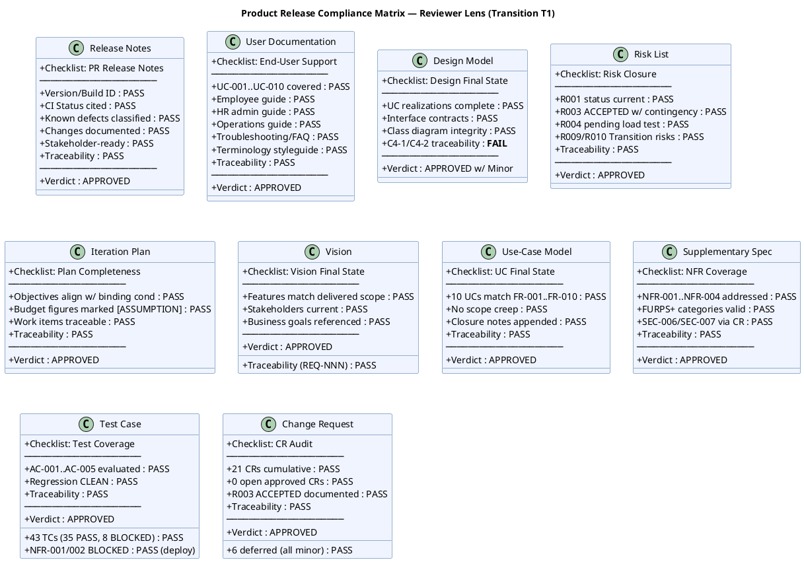
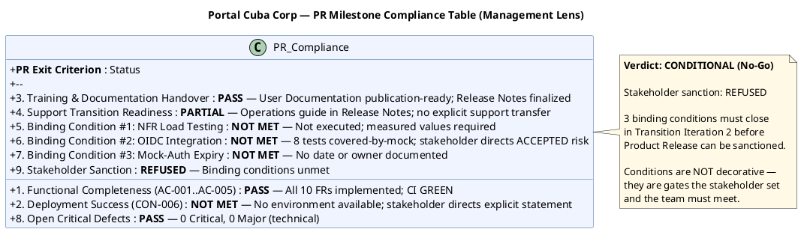
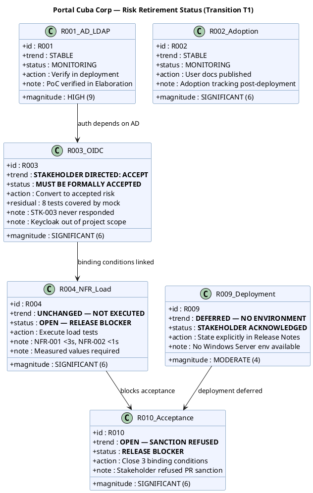
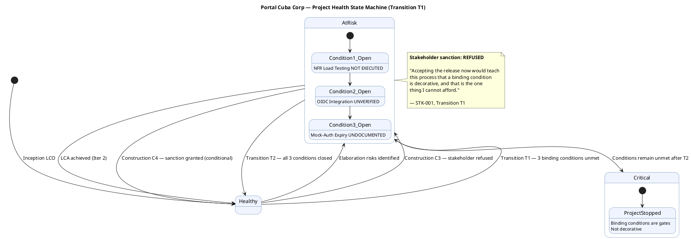
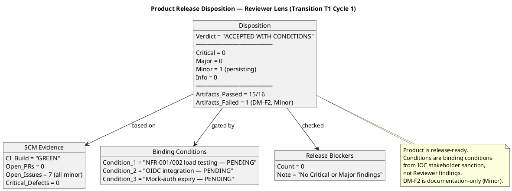
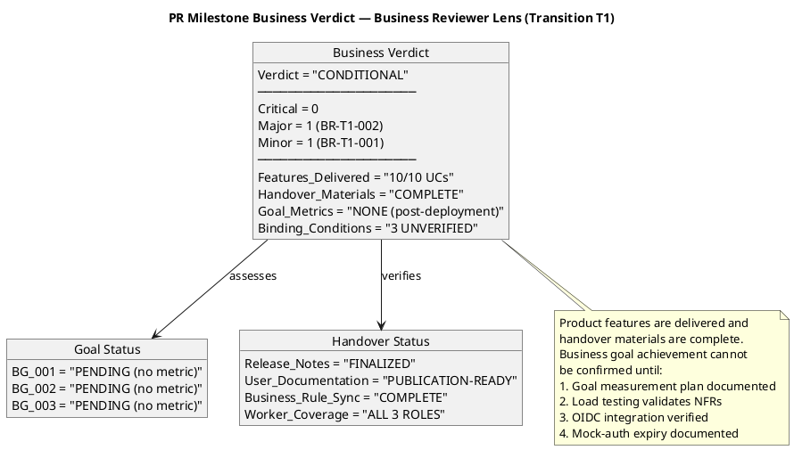

## Document Control

| Field | Value |
|---|---|
| Phase | Transition |
| Status | **ACTIVE — Reviewer + Business Reviewer + Management Reviewer Lenses EXECUTED** |
| Milestone Target | Product Release (PR) — **NOT YET ACHIEVED** |
| Iteration | 1 (Cycle 1) |
| Date | 2026-08-29 |
| Prior Phase | Construction C4 Cycle 1 — IOC CONDITIONAL GO; stakeholder sanction GRANTED with 3 binding conditions; 0 open PRs; CI GREEN; 35/43 tests pass, 8 covered-by-mock; 7 open issues (1 ACCEPTED, 6 deferred) |
| Technical Lens (Code Reviewer) | **EXECUTED** — Transition T1 Cycle 1. 0 Critical, 0 Major, 1 Minor. PR #35 (hotfix/T1-defect-fixes → main) APPROVED. CI GREEN. 13 new tests covering defect regressions and offline retry. Design Model conformance verified. |
| Product Acceptance Lens (Reviewer) | **EXECUTED** — Transition T1 Cycle 1. 0 Critical, 0 Major, 1 Minor (persisting). All 16 artifacts evaluated against Product Acceptance checklist. CI GREEN on main. 0 open PRs. 7 open issues (all minor/deferred). Disposition: **ACCEPTED WITH CONDITIONS**. |
| Business Lens (Business Reviewer) | **EXECUTED** — Transition T1 Cycle 1. 0 Critical, 1 Major (BR-T1-002: binding conditions unverified), 1 Minor (BR-T1-001: no goal measurement plan). All 10 UCs delivered. Handover materials complete. Business goals PENDING (post-deployment metrics). Disposition: **CONDITIONAL**. |
| Management Lens (Management Reviewer) | **EXECUTED** — Transition T1 Cycle 1. 0 Critical, 3 Major (IA-F3: objectives all PENDING at PR gate; RN-F1: deployment status not explicit; RL-F6: R003 not formally accepted). Prior MR findings F2 (Review Record) and F2 (Iteration Assessment) RESOLVED — issue count corrected. Stakeholder sanction: **REFUSED**. Disposition: **CONDITIONAL (No-Go)** — 3 binding conditions unmet, stakeholder directed specific remediation for Transition Iteration 2. |
| Review Type | Transition T1 Cycle 1 — Product Release Milestone Review (Reviewer + Business Reviewer + Management Reviewer lenses) |
| PRs Reviewed | #35 (hotfix/T1-defect-fixes → main, APPROVED by Code Reviewer) |
| CI Build Status | main: GREEN (run 33259634182, 2026-08-29 15:14:05Z) |
| Open Defect Issues | 7 open issues (all minor severity, deferred-next-iteration): #36 (release summary), #34 (Design Model async names), #18 (test idempotency), #17 (dead code DTO), #15 (naming violation), #12 (CSV export format), #5 (Elaboration E1 deferred). 0 critical/high defects. |
| Disposition | **CONDITIONAL (No-Go)** — Stakeholder sanction REFUSED. 3 binding conditions unmet: (1) NFR-001/NFR-002 load testing — not executed, measured values required; (2) OIDC integration — stakeholder directs conversion to formally accepted risk; (3) mock-auth expiry — no date or owner documented. Deployment verification deferred — no Windows Server environment available. Transition Iteration 2 must close all three per stakeholder directives. Combined across all lenses: 0 Critical, 4 Major, 3 Minor. |

## Review Scope and Criteria

### Scope

This review covers the **Product Release (PR) milestone** — the final quality gate of the Transition phase. Per RUP Ch.4 Transition essential activities: "Achieve final product baseline as rapidly and cost-effectively as practical." The Reviewer's role is Product Acceptance assessment of the final release artifacts plus SCM release evidence aggregation. The Management Reviewer's role is milestone gate verification: do the artifacts collectively satisfy the conditions for phase transition and stakeholder acceptance?

**Artifacts evaluated (16 total):**

| # | Artifact | Phase | Status | Priority |
|---|---|---|---|---|
| 1 | Release Notes | Transition | Draft | PR Required |
| 2 | User Documentation | Transition | Draft | PR Required |
| 3 | Design Model | Construction | Approved | PR Expected |
| 4 | Review Record | Transition | Draft | This artifact |
| 5 | Risk List | Transition | Draft | PR Expected |
| 6 | Iteration Plan | Transition | Draft | PR Expected |
| 7 | Iteration Assessment | Transition | Draft | NOT flagged (PM authors post-review) |
| 8 | Vision | Transition | Approved | Final state |
| 9 | Use-Case Model | Transition | Approved | Final state |
| 10 | Supplementary Specification | Transition | Approved | Final state |
| 11 | Test Case | Transition | Draft | Final state |
| 12 | Change Request | Construction | Approved | Final state |
| 13 | Software Architecture Document | Construction | Approved | Final state |
| 14 | Test Evaluation Summary | Elaboration | Approved | Final state |
| 15 | Architectural Proof-of-Concept | Elaboration | Approved | Final state |
| 16 | Development Case | Elaboration | Approved | Final state |

### SCM Release Evidence

| Evidence | Status | Detail |
|---|---|---|
| CI Build (main) | ✅ GREEN | Run 33259634182, completed 2026-08-29 15:14:05Z |
| Open Pull Requests | ✅ 0 | All work merged to main |
| Open Critical/High Defects | ✅ 0 | No release-blocking defects |
| Open Issues (all) | 7 | All minor severity, deferred-next-iteration |
| R003 OIDC Blocker | ACCEPTED | Stakeholder accepted risk; mock-auth contingency active |

### Product Acceptance Checklist Applied

| Artifact Type | Checklist Items | Result |
|---|---|---|
| Release Notes | Version/build ID, CI status, known defects classified, changes documented, stakeholder-ready, traceability | ✅ PASS |
| User Documentation | UC-001..UC-010 covered, employee guide, HR admin guide, operations guide, troubleshooting/FAQ, terminology styleguide, traceability | ✅ PASS |
| Design Model | UC realizations complete, interface contracts, class diagram integrity, C4 source verification findings current, traceability | ❌ FAIL (C4-1/C4-2 stale) |
| Risk List | R001 status current, R003 ACCEPTED with contingency, R004 pending, R009/R010 Transition risks, traceability | ✅ PASS |
| Iteration Plan | Objectives align with binding conditions, budget figures marked [ASSUMPTION], work items traceable, traceability | ✅ PASS |
| Vision | Features match delivered scope, stakeholders current, business goals referenced, traceability (REQ-NNN) | ✅ PASS |
| Use-Case Model | 10 UCs match FR-001..FR-010, no scope creep, closure notes appended, traceability | ✅ PASS |
| Supplementary Specification | NFR-001..NFR-004 addressed, FURPS+ categories valid, SEC-006/SEC-007 via CR, traceability | ✅ PASS |
| Test Case | 43 TCs (35 PASS, 8 BLOCKED), AC-001..AC-005 evaluated, regression CLEAN, NFR-001/002 BLOCKED (deploy), traceability | ✅ PASS |
| Change Request | 21 CRs cumulative, 6 deferred (all minor), 0 open approved CRs, R003 ACCEPTED documented, traceability | ✅ PASS |

## Findings

### Compliance Matrix

### Management Reviewer Lens — PR Milestone Compliance Table

### Risk Retirement Status — Management Lens

### Project Health State Machine

### Management Reviewer Findings (Transition T1 Cycle 1)

| # | Finding Key | Artifact | Severity | Finding | Recommendation | Verdict |
|---|---|---|---|---|---|---|
| MR-1 | IA-F3 | Iteration Assessment | Major | All 6 iteration objectives listed as PENDING/IN PROGRESS at the PR gate. The 3 binding conditions (NFR load testing, OIDC verification, mock-auth expiry) are all PENDING with no measured outcomes. The assessment does not distinguish between attempted-but-incomplete vs. never-started objectives. | Update for Transition Iteration 2: reframe 3 binding conditions per stakeholder directives — NFR as "execute and report measured values", OIDC as "convert to formally accepted risk", mock-auth as "document date and owner". Record stakeholder REFUSED sanction as driving event. | NeedsRework |
| MR-2 | RN-F1 | Release Notes | Major | Deployment verification on internal Windows Server (CON-006) not explicitly stated as unperformed. Stakeholder directed: "Say so explicitly in the Release Notes rather than leaving it implied." 3 binding conditions not addressed in Release Notes. | Add explicit "Deployment Status" section: "Deployment verification on internal Windows Server (CON-006) has NOT been performed — target environment not available. Acknowledged by stakeholder." Add "Pending Verification" section listing 3 binding conditions. | NeedsRework |
| MR-3 | RL-F6 | Risk List | Major | R003 (OIDC) listed as MONITORING with transition_action "Real OIDC verification." Stakeholder directed conversion to formally ACCEPTED risk: "Convert it into a formally accepted risk, closed as such, with the residual stated." R004 (NFR load testing) remains unexecuted — must reflect measured values as release gate. | Update R003: strategy to ACCEPTED (stakeholder-directed), document residual (8 tests covered by mock, proven at deployment). Update R004: status to OPEN-RELEASE-BLOCKER, measured values required against NFR-001 (<3s) and NFR-002 (<1s). | NeedsRework |

### Prior MR Findings Reconciliation

| Finding | Artifact | Phase/Iter Emitted | Resolution Status | Action |
|---|---|---|---|---|
| F2 (Major) | Review Record | Construction C4 | **RESOLVED** (Transition T1) | "0 open defect issues" corrected to "7 open issues (all minor, deferred)" — confirmed in current Review Record Document Control |
| F2 (Major) | Iteration Assessment | Construction C4 | **RESOLVED** (Transition T1) | "0 open defect issues" corrected to "7 open issues (1 ACCEPTED, 6 deferred)" — confirmed in current Iteration Assessment Document Control |
| F1 (Minor) | Iteration Assessment | Construction C3 | RESOLVED (Construction C4) | Stale C3 verdict text updated — confirmed in prior iteration |
| F1 (Minor) | Vision | Inception I1 | RESOLVED (Inception I2) | FEAT-NNN replaced with REQ-NNN — confirmed in current Vision traceability |

## Resolutions and Actions

### Prior Findings Reconciliation (Reviewer Lens)

| Finding | Artifact | Phase/Iter Emitted | Resolution Status | Action |
|---|---|---|---|---|
| F1 (Info) | Vision | Inception I1 | RESOLVED (Inception I2) | FEAT-NNN replaced with REQ-NNN — confirmed in current Vision traceability |
| F1 (Info) | Test Evaluation Summary | Inception I1 | RESOLVED (Inception I2) | TD-NNN replaced with TC-NNN — confirmed |
| F1 (Minor) | Test Case | Elaboration I1 | RESOLVED (Elaboration I2) | TD-NNN entries removed from traceability table — confirmed |
| F2 (Minor) | Test Case | Construction I2 | RESOLVED (Construction I3) | UnitTest1.cs placeholder removed — confirmed |
| F1 (Minor) | Design Model | Construction I2 | RESOLVED (Construction I3) | INT-003 office parameter updated — confirmed |
| F2 (Minor) | Design Model | Construction I4 | **LEFT OPEN** | C4-1/C4-2 traceability still stale — re-recorded under findingKey F2 this iteration |

### Prior Findings Reconciliation (Business Reviewer Lens)

| Finding | Artifact | Phase/Iter Emitted | Resolution Status | Action |
|---|---|---|---|---|
| (none) | — | — | — | No prior BusinessReviewer findings exist on any artifact. This is the first iteration the Business Reviewer lens has executed. |

### Prior Findings Reconciliation (Management Reviewer Lens)

| Finding | Artifact | Phase/Iter Emitted | Resolution Status | Action |
|---|---|---|---|---|
| F2 (Major) | Review Record | Construction C4 | **RESOLVED** (Transition T1) | "0 open defect issues" corrected to "7 open issues (all minor, deferred)" — confirmed in current Review Record Document Control |
| F2 (Major) | Iteration Assessment | Construction C4 | **RESOLVED** (Transition T1) | "0 open defect issues" corrected to "7 open issues (1 ACCEPTED, 6 deferred)" — confirmed in current Iteration Assessment Document Control |
| F1 (Minor) | Iteration Assessment | Construction C3 | RESOLVED (Construction C4) | Stale C3 verdict text updated |
| F1 (Minor) | Vision | Inception I1 | RESOLVED (Inception I2) | FEAT-NNN replaced with REQ-NNN |

### Open Action Items

| # | Action | Owner | Severity | Blocking? |
|---|---|---|---|---|
| 1 | Update Design Model C4-1/C4-2 traceability rows from "OPEN" to "RESOLVED in PR #32" | Designer | Minor | No (documentation-only) |
| 2 | **NFR-001/NFR-002 load testing with measured values** — execute tests, report two measurements against 3s and 1s thresholds. "Tested is not a result; two measurements are." | Test Manager | Major | **YES — binding condition #1, release blocker** |
| 3 | **Convert R003 OIDC to formally accepted risk** — STK-003 never responded, Keycloak out of scope. Document residual: 8 tests covered by mock, proven at deployment. "An accepted risk is a decision; 'unverified' is a wound left open." | Software Architect / Project Manager | Major | **YES — binding condition #2, release blocker** |
| 4 | **Document mock-auth expiry date and owner** — a mock with no expiry becomes the permanent implementation. | Software Architect | Major | **YES — binding condition #3, release blocker** |
| 5 | **State deployment verification status explicitly in Release Notes** — "we do not have that environment, and I am not going to pretend otherwise." | Deployment Manager | Major | **YES — MR finding RN-F1** |
| 6 | Document post-deployment goal verification plan for BG-001, BG-002, BG-003 | System Analyst + STK-001 | Minor | No (post-deployment) |
| 7 | Annotate 3 binding conditions as business-goal-blocking dependencies in post-deployment plan | Project Manager | Major | Yes (business goal confirmation) |

## Disposition

### Product Acceptance: ACCEPTED WITH CONDITIONS

The product is assessed as **ACCEPTED WITH CONDITIONS** — release-ready based on SCM evidence and artifact quality, with 4 conditions that must be satisfied before the PR milestone can close.

### Business Lens: CONDITIONAL

**Business Reviewer PR Milestone Verdict: CONDITIONAL**

The product is feature-complete and operationally ready for handover. However, business goal achievement cannot be confirmed at this milestone.

### Management Lens: CONDITIONAL (No-Go) — Stakeholder Sanction REFUSED

**Stakeholder sanction: REFUSED**

The stakeholder (STK-001) was consulted with the full set of open defects and the preliminary Conditional verdict. The stakeholder's response:

> "No — not yet, and precisely because the three conditions were binding. I set them two hours ago and none has been met. Accepting the release now would teach this process that a binding condition is decorative, and that is the one thing I cannot afford: the next condition I set would be worth nothing. Transition iteration 2 must close them, and here is what each one means."

**Stakeholder directives for Transition Iteration 2:**

1. **NFR-001 / NFR-002** — Execute the load tests and report the measured values. Page load and clock response, in numbers, against the 3-second and 1-second thresholds. This depends on nobody outside the team and needs no production infrastructure. "Tested" is not a result; two measurements are.

2. **Real OIDC** — Stop carrying it as unverified. STK-003 never responded and Keycloak work is explicitly out of this project's scope, so it will not be verified by us. Convert it into a formally accepted risk, closed as such, with the residual stated: 8 test cases are covered by mock and will only be proven against the real client at deployment time. An accepted risk is a decision; "unverified" is a wound left open.

3. **Mock-auth expiry** — Document it. A date and an owner. A mock that unblocks 8 tests and has no expiry becomes the permanent implementation, and nobody notices until authentication has never been tested for real.

4. **Deployment verification** — Stays out: we do not have that environment, and I am not going to pretend otherwise. Say so explicitly in the Release Notes rather than leaving it implied.

**Management Reviewer PR Milestone Verdict: CONDITIONAL (No-Go)**

The product is feature-complete (all 10 FRs implemented, CI GREEN, 0 critical defects, documentation publication-ready). However, the PR milestone gate is NOT passed:

- **3 binding conditions unmet** — all 3 remain PENDING with no measured outcomes
- **Stakeholder sanction REFUSED** — binding conditions are gates, not decorative
- **3 new Major findings** — IA-F3 (objectives PENDING at PR gate), RN-F1 (deployment status not explicit), RL-F6 (R003 not formally accepted)
- **2 prior MR findings RESOLVED** — F2 on Review Record and F2 on Iteration Assessment (issue count corrected)
- **Deployment verification deferred** — no Windows Server environment available, stakeholder acknowledges

**Combined PR Milestone Verdict (all lenses): CONDITIONAL (No-Go)**
- 0 Critical, 4 Major (BR-T1-002 + IA-F3 + RN-F1 + RL-F6), 3 Minor (DM-F2 + BR-T1-001 + persisting)
- Product is NOT sanctioned for release. Transition Iteration 2 must close the 3 binding conditions per stakeholder directives.

## Traceability

| Element | Traces From | Link Type | Traces To |
|---|---|---|---|
| DM-F2 (persisting) | Design Model C4, PR #32 | Derives | Designer artifact (traceability table update) |
| CI Build (main) | CON-001, CON-003 | DependsOn | GitHub Actions run 33259634182 |
| Release Notes | FR-001..FR-010, NFR-001..NFR-004, AC-001..AC-005 | Derives | PR milestone |
| User Documentation | UC-001..UC-010, AC-001, AC-002, AC-004 | Derives | PR milestone |
| Risk List | R001..R010, CON-004..CON-007 | Derives | PR milestone |
| Iteration Plan | NFR-001, NFR-002, R003, CON-004, CON-006 | Derives | PR milestone |
| Test Case | UC-001..UC-010, AC-001..AC-005 | Derives | PR milestone |
| Change Request | CR-010..CR-024, R003, STK-003 | Derives | PR milestone |
| Binding condition #1 | NFR-001, NFR-002, STK-001 | Derives | Test Manager — load testing (measured values) |
| Binding condition #2 | CON-004, R003, STK-003 | Derives | Software Architect — OIDC formally accepted risk |
| Binding condition #3 | CON-006, CON-007 | Derives | Software Architect — mock-auth expiry date + owner |
| Stakeholder directive (C4) | STK-001 feedback | Refines | "Close all PRs, Github Issues, and findings" — 0 open PRs, 7 minor/deferred issues, 1 persisting Minor finding documented |
| BR-T1-001 | BG-001, BG-002, BG-003 | Derives | Vision — post-deployment goal verification plan |
| BR-T1-002 | NFR-001, NFR-002, CON-004, R003 | Derives | Review Record — binding conditions as business-goal-blocking |
| IA-F3 (MR) | Iteration Assessment, STK-001 directives | Derives | Transition Iteration 2 — reframe objectives per stakeholder |
| RN-F1 (MR) | Release Notes, CON-006, STK-001 directives | Derives | Transition Iteration 2 — explicit deployment status |
| RL-F6 (MR) | Risk List, R003, R004, STK-001 directives | Derives | Transition Iteration 2 — R003 formally accepted, R004 release blocker |
| BG-001 (goal achievement) | UC-001..UC-004, UC-009 | Derives | Post-deployment HR time audit (PENDING) |
| BG-002 (goal achievement) | UC-001..UC-004, UC-009 | Derives | Post-deployment Excel usage audit (PENDING) |
| BG-003 (goal achievement) | UC-001..UC-010, User Documentation | Derives | Post-deployment adoption tracking (PENDING) |
| BM-LL-001 | BG-001..BG-003 | Derives | Future projects — goal measurement planning |
| BM-LL-002 | BR-T1-002, BG-001..BG-003 | Derives | Future projects — technical-business dependency tracing |
| BM-LL-003 | DC §4 classification | Derives | Future projects — BM inactive review lens adaptation |
| Stakeholder PR sanction | STK-001, AC-001..AC-005 | Refines | REFUSED — binding conditions are gates, not decorative |