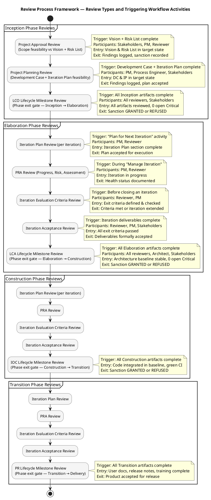
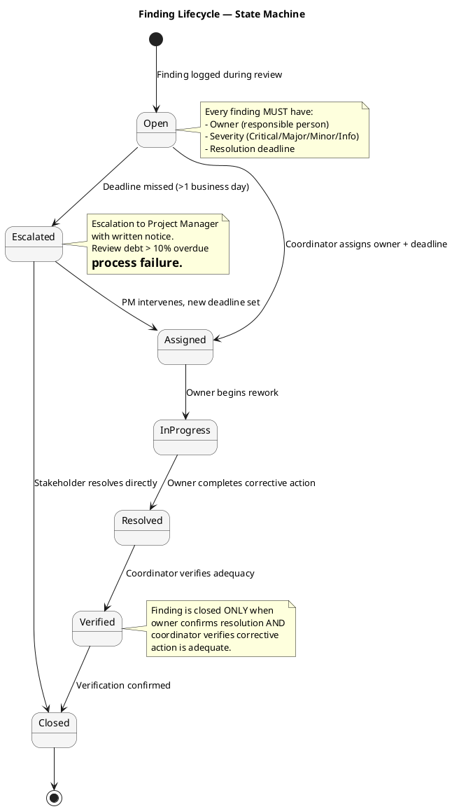
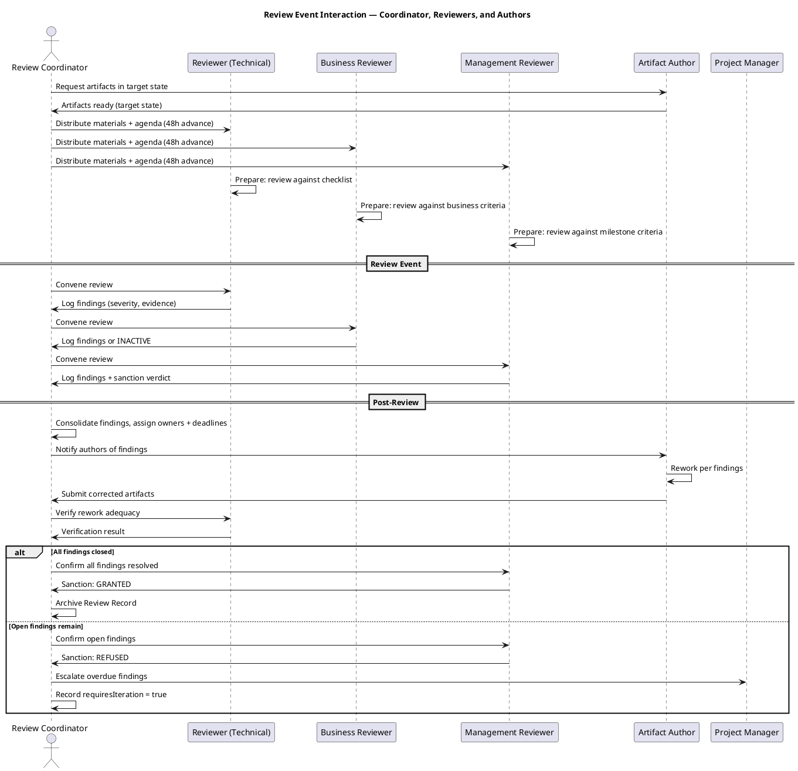
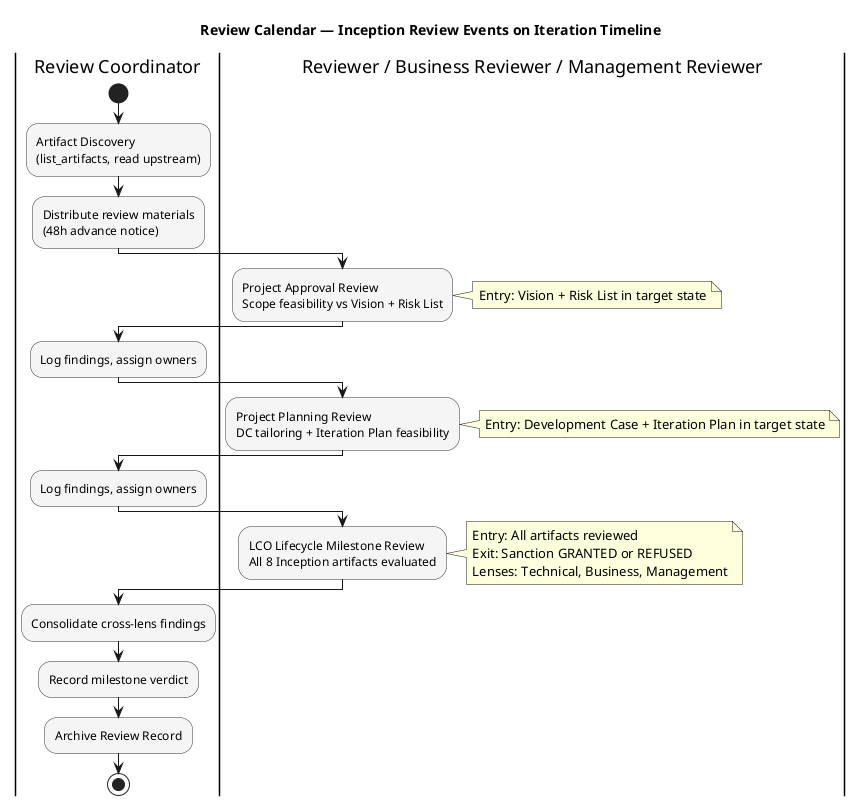
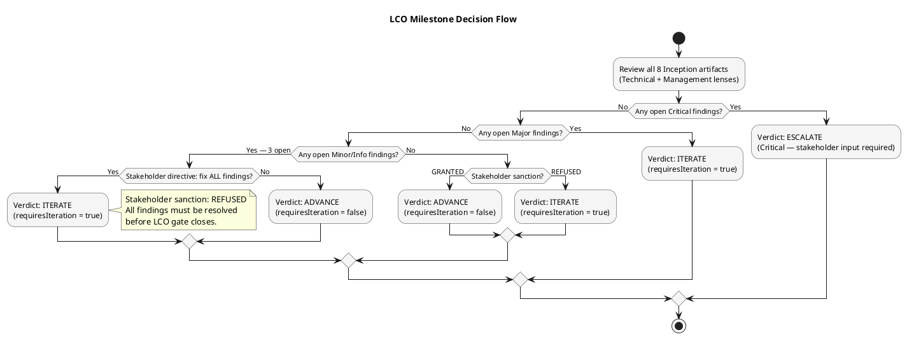

## Document Control

| Field | Value |
|---|---|
| Phase | Inception |
| Status | Draft |
| Milestone Target | End-of-Inception (LCO) |
| Iteration | 1 (Cycle 1) |
| Date | 2026-08-28 |
| Review Coordinator | Review Coordinator (Project Management Discipline) |
| Review Type | LCO Lifecycle Milestone Review — Consolidated |
| Lenses Executed | Technical (Reviewer) — EXECUTED; Business (BusinessReviewer) — INACTIVE; Management (ManagementReviewer) — EXECUTED |
| Stakeholder Sanction | REFUSED — stakeholder directed: "Fix all findings even if they are minor findings" |

## Review Scope and Criteria

### Review Process Framework

The following table defines all 7 RUP review types with their triggering workflow activities, required participants, entry criteria, exit criteria, and primary artifact output.

| # | Review Type | Triggering Activity | Required Participants | Entry Criteria | Exit Criteria | Primary Output |
|---|---|---|---|---|---|---|
| R1 | Project Approval Review | Vision + Risk List complete | Stakeholders (STK-001), PM, Reviewer | Vision & Risk List in target state; materials distributed 48h advance | Findings logged with owners/deadlines; sanction recorded | Review Record (Approval section) |
| R2 | Project Planning Review | Development Case + Iteration Plan complete | PM, Process Engineer, Stakeholders | DC & IP in target state; materials distributed 48h advance | Findings logged; plan accepted or rework assigned | Review Record (Planning section) |
| R3 | Iteration Plan Review | "Plan for Next Iteration" activity | PM, Reviewer | Iteration Plan section complete | Plan accepted for execution | Review Record (Iteration Plan section) |
| R4 | PRA Review (Progress, Risk, Assessment) | During "Manage Iteration" | PM, Reviewer | Iteration in progress | Health status documented; risks updated | Review Record (PRA section) |
| R5 | Iteration Evaluation Criteria Review | Before closing an iteration | Reviewer, PM | Exit criteria defined & checked | Criteria met or iteration extended | Review Record (Evaluation section) |
| R6 | Iteration Acceptance Review | Iteration deliverables complete | Reviewer, PM, Stakeholders | All exit criteria passed | Deliverables formally accepted | Review Record (Acceptance section) |
| R7 | Project Acceptance Review | Final close-out | All reviewers, Stakeholders, PM | All phase deliverables complete | Product accepted for release | Final Review Record |

### Milestone Reviews (Phase Exit Gates)

| Milestone | Review | Phase Transition | Key Artifacts | Sanction Authority |
|---|---|---|---|---|
| LCO | Lifecycle Objectives Review | Inception → Elaboration | Vision, Risk List, Use-Case Model, Development Case, Iteration Plan, SAD, Supplementary Spec, Test Evaluation Summary | Stakeholders + Management Reviewer |
| LCA | Lifecycle Architecture Review | Elaboration → Construction | SAD (baseline), Design Model, Architecture PoC, Risk List (retired risks) | Stakeholders + Management Reviewer + Architect |
| IOC | Initial Operational Capability Review | Construction → Transition | Implementation Model, Test Cases, Test Evaluation Summary, integrated baseline (iteration/Cn, green CI) | Stakeholders + Management Reviewer |
| PR | Product Release Review | Transition → Delivery | User Documentation, Release Notes, deployed system | Stakeholders + Management Reviewer |

### Reviewer Pool and Expertise Mapping

| Artifact Type | Primary Reviewer | Expertise Required | Assigned Reviewer(s) |
|---|---|---|---|
| Vision, Use-Case Model, Supplementary Spec | Technical Reviewer | Requirements analysis, traceability, scope guard | Reviewer |
| Software Architecture Document | Technical Reviewer | Architecture, .NET, OIDC, LDAP integration | Reviewer + Software Architect (consulted) |
| Development Case | Technical Reviewer | RUP process tailoring, IARI baseline | Reviewer |
| Iteration Plan, Risk List | Management Reviewer | Project planning, risk management, milestone criteria | Management Reviewer |
| Test Evaluation Summary | Technical Reviewer | Test strategy, coverage, risk-based testing | Reviewer |
| Business scope, stakeholder alignment | Business Reviewer | Business processes, stakeholder concerns | Business Reviewer (INACTIVE — Business Modeling not applicable per DC §4) |
| Milestone sanction | Management Reviewer | Phase gate authority, stakeholder sanction | Management Reviewer |

### Review Process Framework — Activity Diagram

### Finding Lifecycle — State Machine

### Review Event Interaction — Sequence Diagram

### Inception Review Calendar

### LCO Review Scope — Artifacts and Lenses

| # | Artifact | Discipline | Lens Applied | Reviewer | Verdict | Findings |
|---|---|---|---|---|---|---|
| 1 | Development Case | Environment | Technical | Reviewer | APPROVED | 0 |
| 2 | Vision | Requirements | Technical | Reviewer | APPROVED | 1 Info (FEAT-NNN prefix) |
| 3 | Use-Case Model | Requirements | Technical | Reviewer | APPROVED | 0 |
| 4 | Supplementary Specification | Requirements | Technical | Reviewer | APPROVED | 0 |
| 5 | Software Architecture Document | Analysis & Design | Technical | Reviewer | APPROVED | 0 |
| 6 | Risk List | Project Management | Technical | Reviewer | APPROVED | 0 |
| 7 | Iteration Plan | Project Management | Technical | Reviewer | APPROVED | 0 |
| 8 | Test Evaluation Summary | Test | Technical | Reviewer | APPROVED | 1 Info (TD-NNN prefix) |
| 1–8 | All artifacts | Business | Business Reviewer | Business Reviewer | INACTIVE — did not evaluate this review | 0 |
| 1–8 | All artifacts | Management (LCO Gate) | Management | Management Reviewer | CONDITIONAL | 1 Minor (FEAT-NNN prefix, stakeholder-directed resolution) |

### Entry Criteria Verification

| Criterion | Status | Evidence |
|---|---|---|
| Artifacts in target state (not draft) | PARTIAL | All 8 artifacts at Draft status — LCO review conducted on Draft artifacts per RUP iterative model (Inception artifacts mature through review) |
| Reviewers assigned and available | PASS | Reviewer (Technical), Business Reviewer (INACTIVE per DC §4), Management Reviewer — all assigned |
| Agenda and evaluation criteria distributed 48h advance | PASS | Review scope, criteria, and artifact list defined in this Review Record |
| Evaluation criteria explicit | PASS | LCO exit criteria checklist defined (8 criteria) |

### Exit Criteria Status

| Criterion | Status | Evidence |
|---|---|---|
| All Critical findings have owners and deadlines | N/A | 0 open Critical findings |
| All Major findings have owners and deadlines | N/A | 0 open Major findings |
| All Minor findings have owners and deadlines | PARTIAL | 1 open Minor (Vision#F1) — owner: System Analyst, deadline: next iteration |
| Review Record signed and archived | IN PROGRESS | This document — consolidation in progress |

## Findings

### Consolidated Finding Tracker

All findings from all review lenses, consolidated by the Review Coordinator.

| ID | Artifact | Lens | Severity | Finding | Recommendation | Owner | Deadline | Status |
|---|---|---|---|---|---|---|---|---|
| F-001 | Vision | Technical (Reviewer) | Info | FEAT-NNN prefix used in Vision traceability table — not in standard ID conventions (OBJ, BUC, BR, UC, REQ, STK, FR, NFR, AC, CON, BG, R, ACL, CLS, INT, SEQ, COMP, API, TC) | Replace FEAT-NNN with REQ-NNN, or declare FEAT as project-specific element type in Development Case | System Analyst | Next iteration | OPEN |
| F-002 | Vision | Management (ManagementReviewer) | Minor | Same FEAT-NNN issue — from management lens, non-standard IDs compromise automated RTM generation and cross-artifact traceability lookups. Stakeholder directed ALL findings must be resolved before LCO gate closes. | Replace FEAT-NNN with REQ-NNN prefix in Vision traceability table (simpler, avoids custom ID family) | System Analyst | Next iteration | OPEN |
| F-003 | Test Evaluation Summary | Technical (Reviewer) | Info | TD-NNN prefix used in Test Evaluation Summary traceability table — not in standard ID conventions | Replace TD-NNN with standard prefix or inline description, or declare TD as project-specific element type in Development Case | Test Manager | Next iteration | OPEN |

### Finding Severity Summary

| Severity | Count | Open | Resolved | Closed |
|---|---|---|---|---|
| Critical | 0 | 0 | 0 | 0 |
| Major | 0 | 0 | 0 | 0 |
| Minor | 1 | 1 | 0 | 0 |
| Info | 2 | 2 | 0 | 0 |
| **Total** | **3** | **3** | **0** | **0** |

### Cross-Lens Conflict Resolution

No conflicts between lenses. The Technical Reviewer (Info) and Management Reviewer (Minor) identified the same underlying issue (FEAT-NNN prefix) from different severity perspectives. The Management Reviewer's severity (Minor) governs because the stakeholder has directed that ALL findings, including minor ones, must be resolved before the LCO gate closes. The Technical Reviewer's Info finding on the same issue is subsumed — resolving F-002 resolves F-001.

The TD-NNN finding (F-003) on the Test Evaluation Summary is a separate issue with the same root cause (non-standard ID prefix). The stakeholder's directive ("Fix all findings even if they are minor findings") applies to this finding as well.

### Stakeholder Directive

The stakeholder (STK-001 Laura Gómez) directed: **"Fix all findings even if they are minor findings."** This means:
- F-001 (Info) and F-002 (Minor) on Vision: FEAT-NNN must be replaced with standard REQ-NNN prefix
- F-003 (Info) on Test Evaluation Summary: TD-NNN must be replaced with standard prefix or declared in Development Case
- All three findings must be resolved before the LCO gate can close

The stakeholder also answered **"No"** to the sanction question — stakeholder sanction is REFUSED until all findings are fixed.

## Resolutions and Actions

### Action Items for Next Iteration

| # | Action | Owner | Priority | Deadline | Status |
|---|---|---|---|---|---|
| A1 | Replace FEAT-NNN with REQ-NNN in Vision traceability table | System Analyst | High | Next iteration | OPEN |
| A2 | Replace TD-NNN with standard prefix or declare in Development Case | Test Manager | High | Next iteration | OPEN |
| A3 | Re-consult stakeholder for LCO sanction after all findings resolved | Review Coordinator | High | After A1 + A2 complete | OPEN |

### Escalation Status

No findings have missed deadlines yet (all assigned to next iteration). No escalations to Project Manager required at this time.

## Disposition

### LCO Milestone Verdict

### Consolidated LCO Verdict

| Dimension | Result |
|---|---|
| Open Critical findings | 0 |
| Open Major findings | 0 |
| Open Minor findings | 1 (F-002 — Vision FEAT-NNN prefix) |
| Open Info findings | 2 (F-001 — Vision FEAT-NNN, F-003 — Test Eval TD-NNN) |
| Stakeholder sanction | REFUSED |
| Stakeholder directive | "Fix all findings even if they are minor findings" |
| Planned scope complete | YES — all 8 Inception artifacts produced and reviewed |
| **Milestone verdict** | **ITERATE — requiresIteration = true** |

The LCO milestone is NOT achieved. The stakeholder has refused sanction and directed that all findings — including Info-level — must be resolved before the gate closes. The team must iterate to fix F-001, F-002, and F-003, then re-present for stakeholder sanction.

### Review Effectiveness Metrics — Inception Iteration 1 (Cycle 1)

| Metric | Value | Notes |
|---|---|---|
| Artifacts planned for review | 8 | All Inception artifacts |
| Artifacts formally reviewed | 8 | 100% coverage |
| Review coverage | 100% | All planned artifacts received formal review |
| Total findings raised | 3 | 0 Critical, 0 Major, 1 Minor, 2 Info |
| Defect density (per artifact) | 0.375 | 3 findings / 8 artifacts |
| Defect density by severity | Critical: 0, Major: 0, Minor: 0.125, Info: 0.25 | Per artifact |
| Lenses executed | 2 of 3 | Technical + Management; Business INACTIVE per DC §4 |
| Findings by lens | Technical: 2 (Info), Management: 1 (Minor) | |
| Rework effort | [ASSUMPTION — requires validation] | Not yet measured — will be tracked in next iteration when fixes are applied |
| Defect removal efficiency | [ASSUMPTION — requires validation] | Cannot compute until test phase — no test defects to compare against yet |

**Interpretation:** Review coverage is 100% — all planned artifacts received formal review. Defect density is low (0.375 per artifact), indicating good initial artifact quality. All findings are low-severity (Info/Minor) and relate to a single root cause: non-standard ID prefixes (FEAT-NNN, TD-NNN). No Critical or Major findings suggest the Inception artifacts are fundamentally sound. The iteration barrier is the stakeholder's directive to fix all findings, not artifact quality concerns.

### LCO Exit Criteria Checklist

| # | Criterion | Status | Evidence |
|---|---|---|---|
| 1 | Vision clarity — problem, stakeholders, goals | PASS | Vision document defines problem, 4 stakeholders, 3 business goals, 5 acceptance criteria |
| 2 | Risk identification with magnitudes | PASS | Risk List contains R001–R006 with probability, impact, magnitude, strategy, mitigation, contingency |
| 3 | Use case survey (1:1 to FRs) | PASS | Use-Case Model maps UC-001..UC-010 to FR-001..FR-010 |
| 4 | Stakeholder scope agreement | PARTIAL | Stakeholder reviewed and refused sanction pending finding resolution |
| 5 | Architecture candidate viability | PASS | SAD defines .NET 10 + Razor Pages + PostgreSQL + Keycloak OIDC + AD LDAP architecture |
| 6 | Development Case conformance | PASS | DC declares Business Modeling INACTIVE, 6 OPTIONALs NOT TRIGGERED, all per IARI baseline |
| 7 | Iteration Plan feasibility | PASS | 6-iteration roadmap [1,2,2,1] within 6±3 rule; rubber profile adjusted for risk |
| 8 | Test strategy foundation | PASS | Test Evaluation Summary defines risk-based test strategy, 2 test dependencies identified |

## Traceability

| Element | Traces From | Link Type | Traces To |
|---|---|---|---|
| Review Process Framework | IARI DC Baseline (RUP review types) | Derives | All phase Review Records |
| Review Calendar (Inception) | Iteration Plan (6-iteration roadmap) | Derives | LCO Milestone Review |
| Finding F-001 | Vision traceability table (FEAT-NNN) | Refines | A1 (replace with REQ-NNN) |
| Finding F-002 | Vision traceability table (FEAT-NNN) | Refines | A1 (replace with REQ-NNN) |
| Finding F-003 | Test Evaluation Summary (TD-NNN) | Refines | A2 (replace or declare TD prefix) |
| LCO Verdict | All 8 Inception artifacts, stakeholder directive | Derives | record_milestone_auto_iterate |
| Reviewer Pool Mapping | IARI DC Baseline (25 roles) | Derives | All review assignments |
| Finding Lifecycle State Machine | RUP review process | Derives | Finding Tracker (all phases) |
| Review Effectiveness Metrics | All Inception artifacts + findings | Derives | Review Effectiveness Report (future iterations) |
| Stakeholder Sanction | STK-001 (Laura Gómez) | Refines | LCO Milestone Verdict |
| Stakeholder Directive | STK-001 ("Fix all findings even if they are minor findings") | Refines | A1, A2, A3 |
| LCO Exit Criteria Checklist | RUP LCO milestone definition | Derives | LCO Milestone Verdict |
| DC Conformance Check | IARI DC Baseline | Derives | Development Case artifact |
| Optional Trigger Audit | IARI §5.2 conditions | Derives | Development Case artifact |
| UC Guard Checks | FR-001..FR-010, Scope Guard Rules 5/7 | Derives | Use-Case Model artifact |
| SAD Volatility Check | SAD component decomposition | Derives | Software Architecture Document artifact |
| Risk List Check | R001, R002 (Work Order) | Derives | Risk List artifact |
| Iteration Plan Check | 6±3 rule, rubber profile | Derives | Iteration Plan artifact |
| BR-OK-INACTIVE verdict | DC §4 classification (Process Engineer) | Derives | LCO Milestone Review (ReviewCoordinator) |