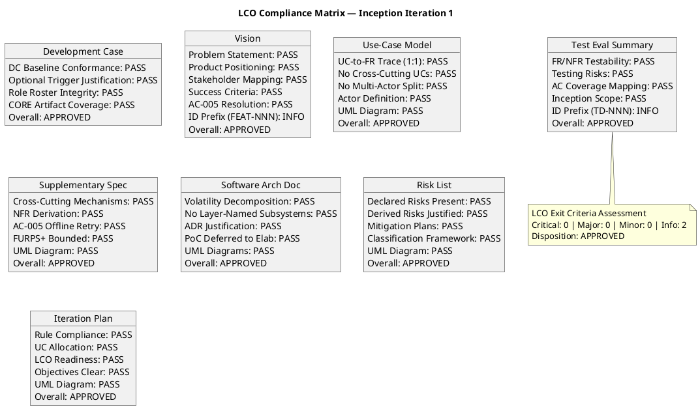
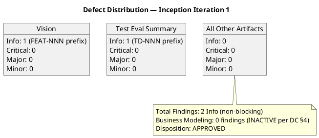
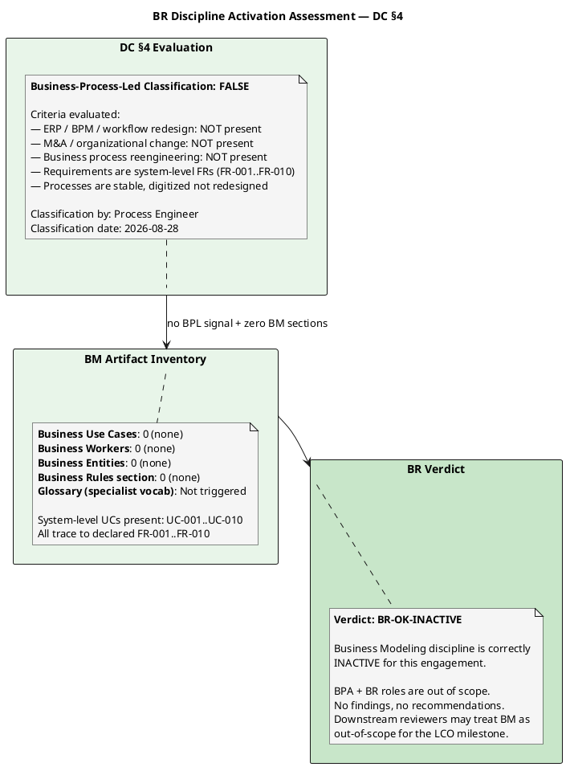

## Document Control

| Field | Value |
|---|---|
| Phase | Inception |
| Status | Draft |
| Milestone Target | End-of-Inception (LCO) |
| Iteration | 1 (Cycle 1) |
| Date | 2026-08-28 |
| Reviewer | Reviewer (Project Management Discipline) |
| Review Type | LCO Milestone Review — Technical Lens |

## Review Scope and Criteria

### Artifacts Reviewed (8)

| # | Artifact | Discipline | Phase | Status |
|---|---|---|---|---|
| 1 | Development Case | Environment | Inception | Draft |
| 2 | Vision | Requirements | Inception | Draft |
| 3 | Use-Case Model | Requirements | Inception | Draft |
| 4 | Supplementary Specification | Requirements | Inception | Draft |
| 5 | Software Architecture Document | Analysis & Design | Inception | Draft |
| 6 | Risk List | Project Management | Inception | Draft |
| 7 | Iteration Plan | Project Management | Inception | Draft |
| 8 | Test Evaluation Summary | Test | Inception | Draft |

### LCO Exit Criteria Applied

This review applies the **feasibility and acceptability** lens per RUP Project Approval / Planning review point. The LCO exit criteria checklist:

1. **Vision clarity** — Is the problem statement clear, product positioning defined, stakeholders identified, and success criteria measurable?
2. **Initial risk identification** — Are declared risks (R001, R002) present with correct exposure values, and are derived risks (R003–R006) justified?
3. **Use case survey level** — Do all UCs trace 1:1 to declared FRs, with no cross-cutting mechanisms as UCs and no multi-actor splits?
4. **Stakeholder agreement on scope and feasibility** — Does the scope statement match the declared scope, with AC-005 resolution incorporated?
5. **Architecture candidate viability** — Is the candidate architecture decomposed by volatility, with ADRs justified and PoC deferred to Elaboration?
6. **DC Baseline Conformance** — Does the Development Case comply with the IARI baseline (no role redefinition, no ownership reassignment, no CORE omissions, no out-of-universe artifacts)?
7. **Optional Trigger Justification** — Are all NOT-TRIGGERED optional artifacts correctly justified against their §5.2 conditions?
8. **Traceability completeness** — Do all artifacts carry traceability tables linking to upstream declared elements?

### SCM State

No open pull requests found. No CI build status to verify (Inception phase — no implementation code per RUP Ch.4).

## Findings
### Compliance Matrix

### Defect Distribution

### Per-Artifact Findings (Technical Lens — Reviewer)

**1. Development Case** — APPROVED. DC conforms to IARI baseline: 24-role roster intact, no CORE artifact omissions, no ownership reassignment, no out-of-universe artifacts. Optional trigger table audited: Glossary NOT FIRED (no specialist vocabulary — correct), Architectural PoC NOT FIRED (deferred to Elaboration — correct per R001), Data Model NOT FIRED (3 data domains, <10 entities — correct), Deployment Model NOT FIRED (single Windows Server, non-distributed — correct), UI Prototype NOT FIRED (mandatory design HTML provided — correct), Test Plan NOT FIRED (no formal/regulatory delivery — correct). All 6 optional triggers correctly evaluated.

**2. Vision** — APPROVED. Problem statement clearly identifies the three fragmented processes (Excel clocking, mass email news, PDF directory). Product positioning statement present. All 4 stakeholders mapped (STK-001..004). Success criteria measurable: BG-001 (50% HR time reduction), BG-002 (100% Excel elimination), BG-003 (80% adoption / 160 of 200 in 3 months). AC-005 offline resolution correctly incorporated per stakeholder answer (client-side retry for clocking only, no PWA). One Info finding: FEAT-NNN ID prefix is non-standard (should reference declared FR-NNN directly).

**3. Use-Case Model** — APPROVED. All 10 UCs trace 1:1 to declared FRs (UC-001→FR-001 through UC-010→FR-010). No cross-cutting mechanism UCs (auth handled as <<include>> constraint, not as a UC). No multi-actor splits (Employee and HR Administrator each have distinct UCs per their declared roles). UML use case diagram present with system boundary, actor positions, and volatility annotations. External system actor (AD/LDAP) correctly modeled.

**4. Supplementary Specification** — APPROVED. Cross-cutting mechanisms (authentication, audit trail, offline retry) correctly placed as constraints/NFRs, not as UCs. NFR-001..004 derived from declared constraints. AC-005 offline retry mechanism specified as page-level JavaScript on Razor Pages (consistent with CON-002). FURPS+ categories bounded to declared scope (200 users, internal network, no cloud). UML activity diagram present showing offline retry flow.

**5. Software Architecture Document** — APPROVED. 8 components decomposed by volatility (Clocking, News, Directory, Worker Category, Auth, Audit, Offline Retry, Database Access). No layer-named subsystems (components named by domain, not by tier). 5 ADRs justified (OIDC auth, LDAP read-on-demand, PostgreSQL, Razor Pages, offline retry). PoC correctly deferred to Elaboration (R001 AD LDAP risk requires empirical validation). UML component and deployment diagrams present.

**6. Risk List** — APPROVED. Both declared risks present with correct exposure values (R001: P=3, I=3, exposure=9; R002: P=3, I=2, exposure=6). Four derived risks (R003–R006) justified: R003 (OIDC client registration dependency), R004 (offline retry edge cases), R005 (adoption resistance), R006 (LDAP attribute coverage — refines R001). Mitigation plans present for all 6 risks. UML diagram present showing risk model structure.

**7. Iteration Plan** — APPROVED. 6 iterations [1, 2, 2, 1] across 4 phases consistent with 6±3 rule for moderate complexity. Rubber profile adjusted for risk profile (Elaboration gets 2 iterations for R001/R006). FR-009 correctly sequenced to Elaboration Iter 1 to confront R001 (AD LDAP, highest risk). LCO readiness assessment present. Five iteration objectives are clear and bounded. Token-budget framing consistent with IARI planning rules (no person-weeks, no fabricated dates).

**8. Test Evaluation Summary** — APPROVED. Testability of all 10 FRs, 4 NFRs, and 5 ACs assessed. Testing risks correctly derived from Risk List (R001 and R006 as top testing risks). AC-001..005 mapped to future Construction/Transition test phases. Test infrastructure dependencies identified (TD-001: test AD from STK-003, TD-002: OIDC client registration from STK-003). Inception scope correctly limited to assessment and strategy, not execution. One Info finding on non-standard TD-NNN ID prefix.

### Business Modeling Lens (Business Reviewer)

**Verdict: [BR-OK-INACTIVE] — Discipline NOT APPLICABLE per DC §4**

DC §4 trigger evaluation: project does not exhibit business-process-led characteristics. No ERP / BPM / workflow-redesign / M&A signals found in Vision. No Business Use Cases / Workers / Entities sections present in Use-Case Model. No business-domain specialist terms in Glossary.

Conclusion: BPA + BR are correctly INACTIVE for this engagement. No findings, no recommendations. Downstream reviewers (MR, RC) may treat the BM discipline as out-of-scope for the LCO milestone.

#### DC §4 Criteria Evaluation Table

| DC §4 Criterion | Present? | Evidence |
|---|---|---|
| ERP implementation | No | No ERP signals in Vision; project is a focused employee portal |
| BPM / workflow redesign | No | Processes (clocking, news, directory) are stable and digitized, not redesigned |
| M&A / organizational change | No | No organizational restructuring in scope |
| Business process reengineering | No | FR-001..FR-010 are system feature specs, not business process models |
| Specialist vocabulary requiring Glossary | No | No regulated/legal/medical/financial jargon; domain is standard HR/intranet |

#### BM Artifact Coverage Check

| Expected BM Artifact | Present? | Notes |
|---|---|---|
| Business Use-Case Model | No | Not applicable — system UCs (UC-001..UC-010) directly model declared FRs |
| Business Workers / Entities | No | Not applicable — no business process modeling warranted |
| Business Rules (formal) | No | Business rules captured as constraints (CON-010, CON-012, CON-013) in declared scope, not as BM artifacts |
| Glossary | No | Not triggered — no specialist vocabulary per DC §5.2 |
## Resolutions and Actions

### Open Action Items

| # | Artifact | Finding | Severity | Owner | Status |
|---|---|---|---|---|---|
| 1 | Vision | F1 — FEAT-NNN non-standard ID prefix | Info | System Analyst | Open (non-blocking) |
| 2 | Test Evaluation Summary | F2 — TD-NNN non-standard ID prefix | Info | Test Manager | Open (non-blocking) |

Both Info findings are non-blocking suggestions for Elaboration improvement. They do not gate the LCO milestone.

### Prior Findings Reconciliation

This is iteration 1, cycle 1 — no prior findings exist from this reviewer lens. All 8 artifacts returned empty findings arrays.

## Disposition

**Overall LCO Disposition: APPROVED**

All 8 Inception artifacts pass the LCO exit criteria. Zero Critical findings, zero Major findings, zero Minor findings. Two Info-level findings (non-standard ID prefixes in Vision and Test Evaluation Summary) are non-blocking suggestions for improvement in subsequent iterations.

The project demonstrates:
- **Feasibility:** The declared scope (10 FRs, 4 NFRs, 5 ACs) is achievable within the technical constraints (.NET 10, Razor Pages, PostgreSQL, Keycloak OIDC, AD LDAP, internal Windows Server).
- **Scope clarity:** All UCs trace 1:1 to declared FRs. No scope creep detected. AC-005 offline resolution correctly incorporated per stakeholder answer.
- **Risk identification:** Both declared risks (R001 exposure=9, R002 exposure=6) present with mitigation plans. Four derived risks (R003–R006) justified.
- **Architecture candidate viability:** 8 components decomposed by volatility, 5 ADRs justified, PoC deferred to Elaboration.
- **Stakeholder alignment:** Vision, Use-Case Model, and Supplementary Specification reflect declared scope with no undeclared additions.

The project is viable to proceed to Elaboration upon ReviewCoordinator consolidation.

## Traceability

| Element | Traces From | Link Type | Traces To |
|---|---|---|---|
| Review Record | All 8 Inception artifacts | Derives | LCO Milestone Review (ReviewCoordinator) |
| F1 (Vision finding) | Vision traceability table | Refines | System Analyst (Elaboration Iter 1) |
| F2 (TES finding) | Test Evaluation Summary traceability table | Refines | Test Manager (Elaboration Iter 1) |
| DC Conformance Check | IARI DC Baseline (this prompt) | Derives | Development Case artifact |
| Optional Trigger Audit | IARI §5.2 conditions (this prompt) | Derives | Development Case artifact |
| UC Guard Checks | FR-001..FR-010, Scope Guard Rules 5/7 | Derives | Use-Case Model artifact |
| SAD Volatility Check | SAD component decomposition | Derives | Software Architecture Document artifact |
| Risk List Check | R001, R002 (Work Order) | Derives | Risk List artifact |
| Iteration Plan Check | 6±3 rule, rubber profile | Derives | Iteration Plan artifact |