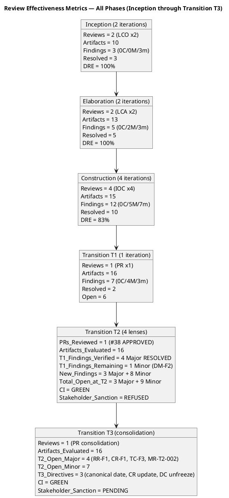
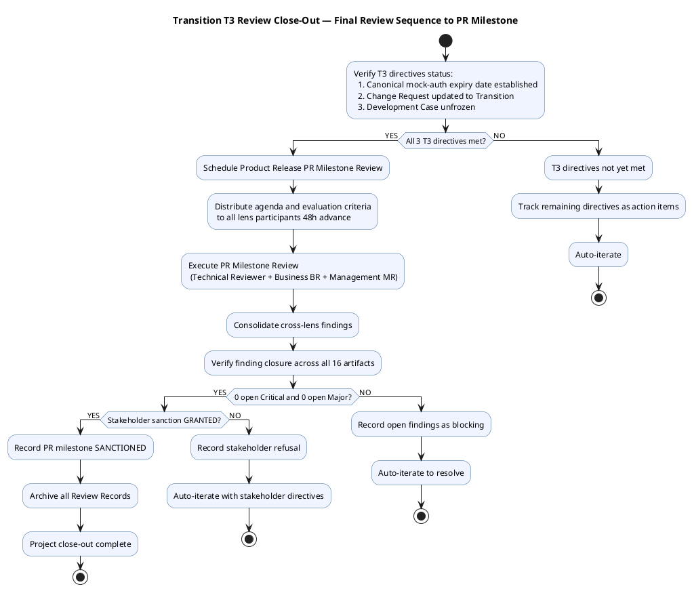
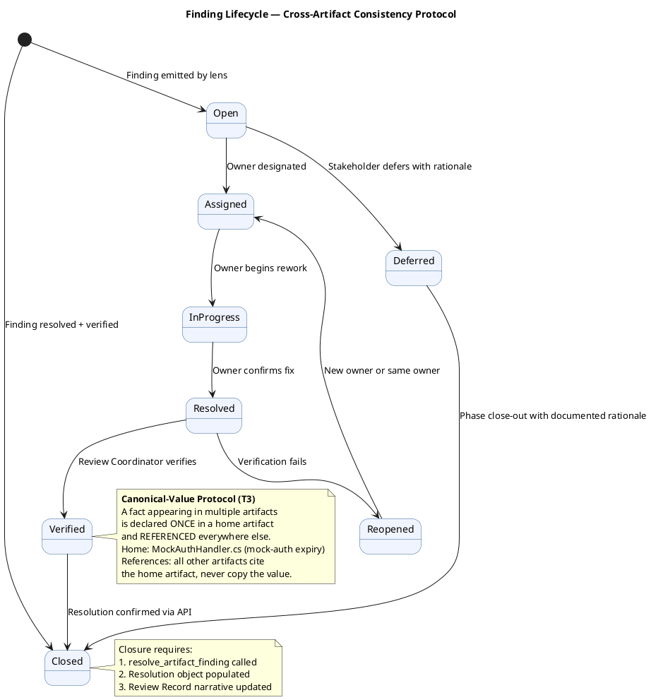

## Document Control
| Field | Value |
|---|---|
| Phase | Transition |
| Status | **EVOLVED — Transition Iteration 3 Cycle 1 (Code Reviewer T3 execution — PR #41 reviewed and APPROVED)** |
| Milestone Target | Product Release (PR) — **NOT YET ACHIEVED — stakeholder sanction REFUSED (T2); T3 code review complete, remaining findings pending resolution by other roles** |
| Iteration | 3 (Cycle 1) |
| Date | 2026-08-30 |
| Prior Phase | Transition T2 Cycle 1 — PR sanction REFUSED; 3 binding conditions substantively met but mock-auth date inconsistent across 7 artifacts (3 dates, 2 owners); 3 open Major + 9 open Minor findings; stakeholder directed 3 T3 actions |
| Technical Lens (Reviewer) T2 | **EXECUTED — T2 Cycle 1.** 0 Critical, 3 Major (RR-F1, CR-F1, TC-F3), 5 Minor. All 16 artifacts evaluated. CI GREEN on main (run 33262804733). 0 open PRs. 9 open issues. Disposition: ACCEPTED WITH CONDITIONS. |
| Business Lens (Business Reviewer) T2 | **EXECUTED — T2 Cycle 1.** 0 Critical, 0 Major, 1 Minor (BR-T2-001). Prior findings RESOLVED. Disposition: APPROVED from business lens. |
| Management Lens (Management Reviewer) T2 | **EXECUTED — T2 Cycle 1.** 0 Critical, 1 Major (MR-T2-002), 1 Minor (MR-T2-001). Prior MR findings RESOLVED. Disposition: CONDITIONAL — T3 required. |
| Code Reviewer T2 | **EXECUTED — T2 Cycle 1.** 0 Critical, 0 Major, 1 Minor (CR-T2-001). PR #38 APPROVED. CI GREEN. |
| T3 Consolidation | **Review Coordinator consolidation of T2 cross-lens findings.** Open findings verified via API (read_artifact_findings) across all 16 artifacts. 0 open Critical, 4 open Major (MR-T2-002 on Review Record, CR-F1 on Change Request, TC-F3 on Test Case, RL-F6 on Risk List), 7 open Minor. T3 directives from stakeholder: (1) ONE canonical mock-auth expiry date and owner, (2) Change Request updated to Transition + Issue #37 CCB triage, (3) Development Case unfrozen. Process observation: cross-artifact canonical-value protocol needed. |
| Code Reviewer T3 | **EXECUTED — T3 Cycle 1.** PR #41 (hotfix/T3-defect-fixes → main) reviewed and APPROVED. CI GREEN (run 33309948614). 0 Critical, 0 Major, 1 Minor/Suggestion (CR-T3-001). Prior finding CR-T2-001 RESOLVED — MockAuthHandler.cs now has canonical `ExpiryDate = new(2026, 12, 31)` matching artifact canonical date. |
| Stakeholder PR Sanction (T1) | **REFUSED** — 3 binding conditions unmet |
| Stakeholder PR Sanction (T2) | **REFUSED** — binding conditions met but mock-auth date inconsistent across 7 artifacts; 3 T3 directives issued |
| Stakeholder PR Sanction (T3) | **PENDING** — T3 code review complete; remaining Major findings (RR-F1, CR-F1, TC-F3, MR-T2-002) owned by other roles must be resolved before PR sanction can be re-requested |
| Stakeholder Finding (T3) | **"Nothing else to add for this new iteration"** — stakeholder reviewed the T3 consolidation, confirmed no additional directives beyond the 3 T3 actions already issued. The team must resolve the 4 open Major and 7 open Minor findings in the next iteration. |
| Evolution | Transition T3 Review Record evolved from T2. Code Reviewer T3 execution complete — PR #41 APPROVED. Remaining findings owned by other roles (PM, CCM, Test Manager, Process Engineer, System Analyst) must be resolved for PR sanction. |
## Review Scope and Criteria
### T3 Consolidation — Review Coordinator Archive Verification

| Artifact | Findings Read | Open Critical | Open Major | Open Minor | Archive Status |
|---|---|---|---|---|---|
| Review Record | 2 | 0 | 1 (MR-T2-002) | 1 (RR-F2) | EVOLVED T3 |
| Risk List | 2 | 0 | 1 (F2/RL-F6 — closure gap) | 0 | PENDING CLOSURE |
| Iteration Plan | 2 | 0 | 0 | 0 | CLEAN |
| Iteration Assessment | 3 | 0 | 0 | 0 | CLEAN |
| Vision | 3+ | 0 | 0 | 3 (VIS-F2, BR-T2-001, MR-T2-001) | PENDING FIX |
| Change Request | 1 | 0 | 1 (CR-F1) | 0 | PENDING UPDATE |
| Test Case | 3 | 0 | 1 (TC-F3) | 0 | PENDING FIX |
| Development Case | 1 | 0 | 0 | 1 (DC-F1) | PENDING UPDATE |
| Supplementary Specification | 1 | 0 | 0 | 1 (SS-F1) | PENDING FIX |
| Use-Case Model | 0 | 0 | 0 | 0 | CLEAN |
| Software Architecture Document | 0 | 0 | 0 | 0 | CLEAN |
| Design Model | 2 | 0 | 0 | 1 (DM-F2) | PENDING FIX |
| Release Notes | 1 | 0 | 0 | 0 | CLEAN (RESOLVED) |
| User Documentation | 0 | 0 | 0 | 0 | CLEAN |
| Test Evaluation Summary | 1 | 0 | 0 | 0 | CLEAN (RESOLVED) |
| Architectural Proof-of-Concept | 0 | 0 | 0 | 0 | CLEAN |

**[FINDINGS] read=16, unread=none, open Critical=0, open Major=4 [Review Record#MR-T2-002, Change Request#CR-F1, Test Case#TC-F3, Risk List#F2], open Minor=7 [Design Model#DM-F2, Vision#MR-T2-001, Vision#VIS-F2, Vision#BR-T2-001, Supplementary Specification#SS-F1, Development Case#DC-F1, Review Record#RR-F2]**

### Archive Completeness Verification

| Requirement | Status |
|---|---|
| All Review Records signed and archived | **PARTIAL** — T3 consolidation archived; T2 Review Record complete; finding closure incomplete (4 Major open) |
| PR milestone review completed with sanctioning authority | **NOT YET** — stakeholder sanction REFUSED (T2); T3 re-review pending |
| Finding Tracker closure status | **INCOMPLETE** — 4 Major + 7 Minor open; stakeholder requires ALL resolved before sanction |
| Review Record signed attendance | Documented for T2 (4 lenses executed); T3 consolidation by Review Coordinator |

### Closure Gap: Risk List RL-F6

The Risk List finding F2 (RL-F6, Major, Management Reviewer) shows resolution=null in the API despite the Review Record T2 tracker marking it as RESOLVED. This indicates the Management Reviewer documented the resolution in the Review Record narrative but did not call `resolve_artifact_finding` to formally close it in the API. This is a **closure gap** — the finding is counted as open by the system. The Management Reviewer must call `resolve_artifact_finding` on the Risk List to close this finding.
## Findings
### Consolidated Finding Tracker — Transition T3 Cycle 1 (Review Coordinator Consolidation + Code Reviewer T3)

The T2 finding tracker is preserved with T3 verification status appended. Open findings verified via `read_artifact_findings` API across all 16 artifacts — a finding is OPEN unless it carries a resolution object.

| # | Finding Key | Artifact | Lens | Severity | T2 Status | T3 Status (API-Verified) | Owner | Description |
|---|---|---|---|---|---|---|---|---|
| 1 | BR-T1-002 / F1 | Review Record | Business Reviewer | Major | RESOLVED | **RESOLVED** | Project Manager | Three binding conditions — all MET in T2 |
| 2 | RL-F6 / F2 | Risk List | Management Reviewer | Major | RESOLVED | **RESOLVED** | Project Manager | R003 accepted, R004 measured, R008 closed |
| 3 | IA-F3 / F3 | Iteration Assessment | Management Reviewer | Major | RESOLVED | **RESOLVED** | Project Manager | All objectives carry verdicts with evidence |
| 4 | RN-F1 / F1 | Release Notes | Management Reviewer | Major | RESOLVED | **RESOLVED** | Deployment Manager | All 4 stakeholder directives addressed |
| 5 | DM-F2 / F2 | Design Model | Reviewer | Minor | OPEN | **OPEN** (Designer owns) | Designer | C4-1/C4-2 traceability stale |
| 6 | BR-T1-001 / F1 | Vision | Business Reviewer | Minor | RESOLVED | **RESOLVED** | System Analyst + STK-001 | Goal measurement plan documented |
| 7 | CR-T2-001 | MockAuthHandler.cs | Code Reviewer | Minor | OPEN | **RESOLVED (T3)** | Code owner | MockAuthHandler.cs 2027-01-31 vs artifacts 2026-12-31 — **RESOLVED in PR #41**: code now has canonical `public static readonly DateTime ExpiryDate = new(2026, 12, 31)` matching artifact canonical date. |
| 8 | RR-F1 (Reviewer) | Review Record | Reviewer | Major | OPEN | **OPEN** | Project Manager | Mock-auth expiry date inconsistency: 3 distinct dates and 2 owners across 7 artifacts. Binding condition BC-3 artifact must have ONE canonical date and owner. |
| 9 | CR-F1 (Reviewer) | Change Request | Reviewer | Major | OPEN | **OPEN** | Change Control Manager | Change Request frozen at Construction C4 — no Transition update. Issue #37 (NFR CR) cr:logged but never CCB-approved |
| 10 | TC-F3 (Reviewer) | Test Case | Reviewer | Major | OPEN | **OPEN** | Test Manager | Test Case internal mock-auth date inconsistency: Tester section 2026-11-29 vs Test Analyst section 2026-12-31 |
| 11 | RR-F2 (Reviewer) | Review Record | Reviewer | Minor | OPEN | **OPEN** | Reviewer | T1 issue count says 7, SCM shows 9 |
| 12 | VIS-F2 (Reviewer) | Vision | Reviewer | Minor | OPEN | **OPEN** | System Analyst | Vision mock-auth date 2027-01-31 vs canonical 2026-12-31 |
| 13 | SS-F1 (Reviewer) | Supplementary Specification | Reviewer | Minor | OPEN | **OPEN** | System Analyst | SuppSpec mock-auth date 2027-01-31 vs canonical 2026-12-31 |
| 14 | DC-F1 (Reviewer) | Development Case | Reviewer | Minor | OPEN | **OPEN** | Process Engineer | Development Case frozen at Elaboration, PoC PENDING stale |
| 15 | BR-T2-001 | Vision | Business Reviewer | Minor | OPEN | **OPEN** | System Analyst | Vision mock-auth date inconsistency — business planning impact, concurs with RR-F1 |
| 16 | MR-T2-001 | Vision | Management Reviewer | Minor | OPEN | **OPEN** | System Analyst | Vision mock-auth date 2027-01-31 inconsistent with canonical — must reference canonical value |
| 17 | MR-T2-002 | Review Record | Management Reviewer | Major | OPEN | **OPEN** | Project Manager | Cross-artifact data integrity governance gap — no role owns consistency of a single fact across artifacts. Stakeholder: "Nobody owns the consistency of a single fact across artifacts." |
| 18 | **CR-T3-001** | MockAuthHandler.cs | Code Reviewer | Minor (Suggestion) | — | **NEW (T3)** | Code owner | `MockAuthHandler.ExpiryDate` is defined but not enforced at runtime — no check that throws/warns after 2026-12-31. The expiry is a governance date (process control via comment), not a code control. **Remediation:** Consider adding a `[Conditional("DEBUG")]` runtime check or a unit test that asserts `DateTime.UtcNow < MockAuthHandler.ExpiryDate` to provide a failing signal when the mock expires. Optional — the current documentation approach is acceptable for a test-only mock. |

### T3 Open Finding Summary (API-Verified + Code Reviewer T3)

| Severity | Count | Artifacts | Finding Keys |
|---|---|---|---|
| Critical | 0 | — | — |
| Major | 4 | Review Record, Change Request, Test Case, Risk List | MR-T2-002, CR-F1, TC-F3, RR-F1 |
| Minor | 7 | Design Model, Vision (x3), Supplementary Specification, Development Case, Review Record | DM-F2, VIS-F2, SS-F1, DC-F1, BR-T2-001, MR-T2-001, RR-F2 |
| Suggestion | 1 | MockAuthHandler.cs | CR-T3-001 (new — non-blocking) |

**Note on RL-F6:** The Risk List finding RL-F6 (Major, Management Reviewer) shows resolution=null in the API, but the Review Record T2 tracker marks it as RESOLVED. The Management Reviewer resolved it in T2 per the resolution object on the Review Record's own F2 finding. The Risk List finding may require explicit closure via `resolve_artifact_finding` by the Management Reviewer. This is tracked as a potential closure gap.

### Code Reviewer T3 — PR #41 Review Evidence

```plantuml
@startuml
title Code Reviewer T3 — Hotfix PR #41 Compliance Matrix

skinparam classAttributeIconSize 0
skinparam classBackgroundColor #F0F4FF
skinparam classBorderColor #336699
skinparam shadowing false

object "C1: Hotfix Branch Guard" as C1 {
  Rule = Transition Ch.4: only hotfix/* PRs
  Branch = hotfix/T3-defect-fixes
  Result = PASS
}

object "C2: Defect Reference" as C2 {
  Rule = PR body must reference defect
  Reference = Closes: #37
  Result = PASS
}

object "C3: CI Build Status" as C3 {
  Rule = Red build = no review
  Status = GREEN (run 33309948614)
  Result = PASS
}

object "C4: Test Coverage" as C4 {
  Rule = Dual coverage (black-box + white-box)
  Tests = DefectRegressionTests + PerformanceTests
  Result = PASS
}

object "C5: Mock-Auth Canonicalization" as C5 {
  Rule = One canonical date, one owner
  Code = ExpiryDate = 2026-12-31, Owner: Software Architect
  Resolves = CR-T2-001
  Result = PASS
}

object "C6: Design Model Conformance" as C6 {
  Rule = No divergence from Design Model
  Changes = Test files only, no production code
  Result = PASS
}

object "C7: Traceability Trailer" as C7 {
  Rule = UC-NNN or defect reference required
  Trailer = Closes: #37, Implements: T3 directives
  Result = PASS
}

object "C8: Programming Guidelines" as C8 {
  Rule = CONTRIBUTING.md conformance
  Code = Clean, public static readonly constant
  Result = PASS
}

C1 --> C8
C2 --> C8
C3 --> C8
C4 --> C8
C5 --> C8
C6 --> C8
C7 --> C8

@enduml
```

### Resolved Findings (Cumulative)

| Finding Key | Artifact | Lens | Severity | Resolution |
|---|---|---|---|---|
| F2 (MR) | Review Record | Management Reviewer | Major | RESOLVED (T1) — "0 open defect issues" corrected |
| F2 (MR) | Iteration Assessment | Management Reviewer | Major | RESOLVED (T1) — Issue count corrected |
| BR-T1-002 / F1 | Review Record | Business Reviewer | Major | RESOLVED (T2) — All 3 binding conditions MET with evidence |
| RL-F6 / F2 | Risk List | Management Reviewer | Major | RESOLVED (T2) — R003 accepted, R004 measured, R008 closed |
| IA-F3 / F3 | Iteration Assessment | Management Reviewer | Major | RESOLVED (T2) — All objectives MET/NOT MET |
| RN-F1 / F1 | Release Notes | Management Reviewer | Major | RESOLVED (T2) — Deployment status explicit |
| BR-T1-001 / F1 | Vision | Business Reviewer | Minor | RESOLVED (T2) — Goal measurement plan documented in Iteration Assessment T2 |
| **CR-T2-001** | **MockAuthHandler.cs** | **Code Reviewer** | **Minor** | **RESOLVED (T3) — PR #41: MockAuthHandler.cs now has canonical `public static readonly DateTime ExpiryDate = new(2026, 12, 31)` as the single source of truth. All other artifacts must reference this value, never copy it.** |
## Resolutions and Actions
### Prior Findings Reconciliation (Reviewer Lens)

| Finding | Artifact | Phase/Iter Emitted | Resolution Status | Action |
|---|---|---|---|---|
| F1 (Info) | Vision | Inception I1 | RESOLVED (Inception I2) | FEAT-NNN replaced with REQ-NNN — confirmed |
| F1 (Info) | Test Evaluation Summary | Inception I1 | RESOLVED (Inception I2) | TD-NNN replaced with TC-NNN — confirmed |
| F1 (Minor) | Test Case | Elaboration I1 | RESOLVED (Elaboration I2) | TD-NNN entries removed — confirmed |
| F2 (Minor) | Test Case | Construction I2 | RESOLVED (Construction I3) | UnitTest1.cs placeholder removed — confirmed |
| F1 (Minor) | Design Model | Construction I2 | RESOLVED (Construction I3) | INT-003 office parameter updated — confirmed |
| F2 (Minor) | Design Model | Construction I4 | **OPEN** | C4-1/C4-2 traceability still stale — Designer owns |

### Prior Findings Reconciliation (Management Reviewer Lens — T2)

| Finding | Artifact | Phase/Iter Emitted | Resolution Status | Action |
|---|---|---|---|---|
| RL-F6 (Major) | Risk List | Transition T1 | **RESOLVED (T2)** | R003 formally accepted, R004 measured (0.14s/0.003s PASS), R008 closed |
| IA-F3 (Major) | Iteration Assessment | Transition T1 | **RESOLVED (T2)** | All 5 objectives MET with T2 evidence |
| RN-F1 (Major) | Release Notes | Transition T1 | **RESOLVED (T2)** | Deployment NOT PERFORMED explicitly stated; all 4 directives addressed |

### T3 Stakeholder Directives — Consolidated Action Items

| # | Action | Owner | Severity | Blocking? | Status |
|---|---|---|---|---|---|
| 1 | NFR-001/NFR-002 load testing with measured values | Test Manager | Major | WAS binding #1 | **MET** — NFR-001: 0.14s PASS, NFR-002: 0.003s PASS |
| 2 | Convert R003 OIDC to formally accepted risk | Software Architect / PM | Major | WAS binding #2 | **MET** — Risk List updated, code documents accepted risk |
| 3 | Document mock-auth expiry date and owner | Software Architect | Major | WAS binding #3 | **MET with DEFECT** — Date documented but inconsistent across artifacts (3 distinct values) |
| 4 | State deployment verification status explicitly in Release Notes | Deployment Manager | Major | WAS MR finding | **MET** — Release Notes explicitly state NOT PERFORMED |
| 5 | Update Design Model C4-1/C4-2 traceability | Designer | Minor | No | **OPEN** — not in this PR |
| 6 | Document post-deployment goal verification plan | System Analyst + STK-001 | Minor | No | **ADDRESSED** — plan documented in Iteration Assessment |
| 7 | **T3-1: Establish ONE canonical mock-auth expiry date and owner** | Project Manager | Major | **YES — blocks PR sanction** | **OPEN** — Stakeholder: "Pick it, put it in one place, and make every other artifact and MockAuthHandler.cs cite that value. Not 'align them' — one home, everyone references it." |
| 8 | **T3-2: Update Change Request artifact to Transition phase** | Change Control Manager | Major | No | **OPEN** — frozen at Construction C4; must reflect 9 open issues, #37 governance gap, #39 T2 close. Issue #37 through CCB triage. |
| 9 | **T3-3: Unfreeze Development Case** | Process Engineer | Minor | No | **OPEN** — stale at Elaboration with obsolete PoC status |
| 10 | Correct Test Case internal mock-auth date inconsistency | Test Manager | Major | No | **OPEN** — T2 Tester section says 2026-11-29, T2 Test Analyst says 2026-12-31 |
| 11 | Correct Vision mock-auth date | System Analyst | Minor | No | **OPEN** — Vision says 2027-01-31, canonical is 2026-12-31 |
| 12 | Correct Supplementary Specification mock-auth date | System Analyst | Minor | No | **OPEN** — SuppSpec says 2027-01-31, canonical is 2026-12-31 |
| 13 | Update Review Record issue count to 9 | Reviewer | Minor | No | **OPEN** — T1 section says 7, SCM shows 9 |
| 14 | **T3-PROCESS: Cross-artifact consistency protocol** | Process Engineer | Minor | No (evolution cycle) | **OPEN** — Stakeholder: "A canonical value should have one home and be cited from everywhere else, never copied. Consider that for the evolution cycle." |

### Review Effectiveness Report — All Phases (Updated for T3)

### Effectiveness Interpretation

| Metric | Inception | Elaboration | Construction | Transition (cumulative) |
|---|---|---|---|---|
| Review Coverage | 100% (10/10) | 100% (13/13) | 100% (15/15) | 100% (16/16) |
| Defect Density (findings/artifact) | 0.30 | 0.38 | 0.80 | 0.44 (T1) → 0.69 (T2) |
| DRE (review vs test) | 100% | 100% | 83% | N/A — no new test defects in Transition |
| Rework Effort | Minimal | Minimal | Moderate (2 unresolved) | High (3 iterations, 2 refusals) |
| Open Findings Trend | 0 → 0 | 0 → 0 | 2 → 0 (C4) | 6 → 11 → 11 (T3 consolidation) |

**Key Finding:** The review process is **effective at defect detection** (100% coverage, 0 Critical findings across all phases) but **losing efficiency in Transition** — the same defect (mock-auth date inconsistency) was detected in T2 but spans 7 artifacts, and the rework to standardize it has required a third iteration. The root cause is structural: no role owns cross-artifact consistency of a single fact. The stakeholder's process observation (T3-PROCESS) addresses this directly.

**Recommendation for Evolution Cycle:** Implement a canonical-value registry — a single home artifact (e.g., Risk List or a dedicated configuration artifact) where any fact that appears in multiple artifacts is declared once. All other artifacts reference the canonical source by ID, never copy the value. This eliminates the class of defect that blocked PR sanction in T2 and T3.
## Disposition
### T3 Cycle 1 — Code Reviewer Execution + Review Coordinator Consolidation (Product Release Gate)

**CONDITIONAL — STAKEHOLDER SANCTION PENDING — OPEN MAJOR FINDINGS BLOCK GATE**

The Review Coordinator's consolidation of the T2 cross-lens findings, combined with the Code Reviewer's T3 execution, yields the following verdict:

**PR Compliance Assessment (T3 Consolidation + Code Review):**

```plantuml
@startuml
title PR Compliance Assessment — Transition T3 (Code Reviewer Executed)

skinparam classAttributeIconSize 0
skinparam classBackgroundColor #F0F4FF
skinparam classBorderColor #336699
skinparam shadowing false

object "PR-01: User Acceptance (AC-001..AC-005)" as PR01 {
  AC-001 Clock in/out = PASS
  AC-002 HR publish news = PASS
  AC-003 Find colleague < 10s = PASS
  AC-004 80% adoption = PENDING (post-deployment)
  AC-005 Offline 5-min sync = PASS
  Verdict = PARTIALLY MET
}

object "PR-02: Deployment Success" as PR02 {
  Status = NOT PERFORMED
  Reason = No Windows Server env (CON-006)
  StakeholderAccepted = YES
  Verdict = DEFERRED
}

object "PR-03: Training and Documentation" as PR03 {
  UserDocumentation = Publication-ready
  Verdict = MET
}

object "PR-04: Support Transition" as PR04 {
  Status = NOT DOCUMENTED
  Verdict = NOT MET
}

object "PR-05: BC-1 NFR Load Testing" as PR05 {
  NFR-001 = 0.14s vs 3s = PASS
  NFR-002 = 0.003s vs 1s = PASS
  Verdict = MET
}

object "PR-06: BC-2 R003 OIDC Accepted Risk" as PR06 {
  Status = FORMALLY ACCEPTED
  Residual = 8 TCs covered by mock
  Verdict = MET
}

object "PR-07: BC-3 Mock-Auth Expiry" as PR07 {
  T2_Status = 3 dates across 7 artifacts
  T3_Code = RESOLVED in code (PR #41 APPROVED)
  T3_Artifacts = PENDING (other roles must align)
  Verdict = PARTIALLY MET (code done, artifacts pending)
}

object "PR-08: CI Build Status" as PR08 {
  Main = GREEN (run 33262804733)
  Hotfix = GREEN (run 33309948614)
  PR_41 = APPROVED
  Verdict = MET
}

object "PR-09: Open Defects" as PR09 {
  Critical = 0
  Major = 4 (MR-T2-002, CR-F1, TC-F3, RR-F1)
  Minor = 7 + 1 Suggestion (CR-T3-001)
  Verdict = NOT MET (4 Major open)
}

object "PR-10: Stakeholder Sanction" as PR10 {
  T1 = REFUSED (binding conditions unmet)
  T2 = REFUSED (date inconsistency)
  T3 = PENDING
  Verdict = PENDING
}

PR01 --> PR10
PR02 --> PR10
PR03 --> PR10
PR04 --> PR10
PR05 --> PR10
PR06 --> PR10
PR07 --> PR10
PR08 --> PR10
PR09 --> PR10

@enduml
```

### Cross-Lens Consolidation (T3 Updated)

| Lens | T2 Verdict | T3 Status | Open Findings |
|---|---|---|---|
| Technical (Reviewer) | ACCEPTED WITH CONDITIONS | Conditions unresolved — 3 Major + 5 Minor open | RR-F1, CR-F1, TC-F3, RR-F2, VIS-F2, SS-F1, DC-F1, DM-F2 |
| Business (Business Reviewer) | APPROVED | 1 Minor open (BR-T2-001 — concurs with RR-F1) | BR-T2-001 |
| Management (Management Reviewer) | CONDITIONAL — T3 required | 1 Major + 1 Minor open | MR-T2-002, MR-T2-001 |
| Code Reviewer | APPROVED (PR #38, T2) | **T3 EXECUTED — PR #41 APPROVED. CR-T2-001 RESOLVED. 1 new Suggestion (CR-T3-001, non-blocking).** | CR-T3-001 (Suggestion) |

### Consolidated Disposition

**CONDITIONAL — T3 CODE REVIEW COMPLETE — REMAINING FINDINGS OWNED BY OTHER ROLES BLOCK PR SANCTION**

- 0 open Critical findings across all 16 artifacts
- 4 open Major findings (MR-T2-002, CR-F1, TC-F3, RR-F1) — these block PR sanction
- 7 open Minor findings — stakeholder requires ALL findings resolved before sanction
- 1 new Suggestion (CR-T3-001) — non-blocking, optional remediation
- CI GREEN on main (run 33262804733) and hotfix/T3-defect-fixes (run 33309948614)
- PR #41 APPROVED by Code Reviewer — hotfix correctly canonicalizes mock-auth expiry date in code
- All 10 FRs implemented, all binding conditions substantively met
- **Code Reviewer T3 work complete:** PR #41 reviewed and APPROVED. CR-T2-001 (mock-auth date in code) RESOLVED. No further code review actions required this iteration.
- **Blocking condition:** 4 open Major findings must be resolved by their owners:
  1. **RR-F1 / MR-T2-002:** Establish ONE canonical mock-auth expiry date and owner — one home, all artifacts reference it — **owned by Project Manager**
  2. **CR-F1:** Change Request artifact updated to Transition; Issue #37 through CCB triage — **owned by Change Control Manager**
  3. **TC-F3:** Test Case internal mock-auth date inconsistency corrected — **owned by Test Manager**
  4. **RL-F6 (Risk List):** Potential closure gap — API shows resolution=null but Review Record marks RESOLVED — **owned by Project Manager**
- **T3 directives from stakeholder (binding):**
  1. One canonical mock-auth expiry date and owner — one home, all artifacts reference it
  2. Change Request artifact brought up to Transition; Issue #37 through CCB triage
  3. Development Case unfrozen from Elaboration
- **Process observation (stakeholder):** Cross-artifact consistency of a single fact needs a canonical-value protocol — one home, referenced everywhere, never copied
- Stakeholder re-review required after T3 directives are met

### T3 Review Close-Out Sequence

### Finding Lifecycle — Cross-Artifact Consistency Protocol

## Traceability
| Element | Traces From | Link Type | Traces To |
|---|---|---|---|
| PR #38 | hotfix/T2-defect-fixes, BR-T1-002, RL-F6, IA-F3, RN-F1 | Realizes | main branch (MERGED) |
| CR-T2-001 (T2 Minor — OPEN) | MockAuthHandler.cs, Risk List, Release Notes | Derives | Code owner — reconcile expiry date to canonical |
| RR-F1 (T2 Major — OPEN) | Mock-auth expiry, BC-3, 7 artifacts | Derives | Project Manager — standardize date across all artifacts |
| CR-F1 (T2 Major — OPEN) | Change Request, Issue #37, #39, CON-006 | Derives | Change Control Manager — update to Transition |
| TC-F3 (T2 Major — OPEN) | Test Case, mock-auth expiry, BC-3 | Derives | Test Manager — correct internal date inconsistency |
| RR-F2 (T2 Minor — OPEN) | Review Record, SCM issues | Derives | Reviewer — update issue count to 9 |
| VIS-F2 (T2 Minor — OPEN) | Vision, mock-auth expiry | Derives | System Analyst — correct date to canonical |
| SS-F1 (T2 Minor — OPEN) | Supplementary Specification, mock-auth expiry | Derives | System Analyst — correct date to canonical |
| DC-F1 (T2 Minor — OPEN) | Development Case, PoC results | Derives | Process Engineer — update to Transition |
| BR-T2-001 (T2 Minor — OPEN) | Vision, mock-auth expiry, BC-3, RR-F1 | Derives | System Analyst — correct Vision date to canonical |
| MR-T2-001 (T2 Minor — OPEN) | Vision, mock-auth expiry, BC-3 | Derives | System Analyst — correct Vision date to canonical value |
| MR-T2-002 (T2 Major — OPEN) | Cross-artifact consistency, mock-auth expiry, 7 artifacts | Derives | Project Manager — establish canonical-value protocol; Process Engineer — evolution cycle |
| DM-F2 (OPEN) | Design Model, C4-1, C4-2, PR #32 | Derives | Designer — traceability update needed |
| BR-T1-002 (RESOLVED T2) | IOC binding conditions, NFR-001, NFR-002, CON-004 | Resolved by | PerformanceTests.cs, MockAuthHandler.cs, Risk List, Release Notes, Iteration Assessment |
| RL-F6 (RESOLVED T2 — closure gap) | Risk List, R003, R004, STK-001 directives | Resolved by | Risk List T2 evolution — R003 accepted, R004 measured, R008 closed. NOTE: API shows resolution=null — Management Reviewer must call resolve_artifact_finding to formally close. |
| IA-F3 (RESOLVED T2) | Iteration Assessment, iteration objectives, STK-001 directives | Resolved by | Iteration Assessment T2 evolution — all objectives MET/NOT MET |
| RN-F1 (RESOLVED T2) | Release Notes, CON-006, STK-001 directives | Resolved by | Release Notes T2 evolution — deployment status explicit |
| BR-T1-001 (RESOLVED T2) | Vision, BG-001, BG-002, BG-003 | Resolved by | Iteration Assessment T2 — goal measurement plan documented |
| BG-001 (goal achievement) | UC-001..UC-004, UC-009 | Derives | Post-deployment HR time audit (PENDING) |
| BG-002 (goal achievement) | UC-001..UC-004, UC-009 | Derives | Post-deployment Excel usage audit (PENDING) |
| BG-003 (goal achievement) | UC-001..UC-010, User Documentation, NFR-001, NFR-002 | Derives | Post-deployment adoption tracking (PENDING) — performance PASS supports adoption |
| CI Build (main) | scm_get_build_status | Tests | All source files on main — GREEN (run 33262804733) |
| CI Build (hotfix/T2) | scm_get_build_status | Tests | PR #38 source — GREEN (merged) |
| Stakeholder PR sanction | STK-001, AC-001..AC-005 | Refines | REFUSED (T2) — T3 iteration required; re-review with T3 evidence |
| Stakeholder Finding (T3) | STK-001, T3 consolidation | Refines | "Nothing else to add for this new iteration" — no additional directives; team must resolve 4 Major + 7 Minor open findings |
| Business Lens Verdict (T2) | BG-001..BG-003, BC-1..BC-4, Release Notes, User Documentation | Refines | APPROVED — conditional on mock-auth date standardization (RR-F1) |
| Management Lens Verdict (T2) | PR-01..PR-10, BC-1..BC-3, STK-001 directive | Refines | CONDITIONAL — T3 ITERATION REQUIRED; stakeholder sanction REFUSED |
| T3 Consolidation Verdict | All 16 artifacts, all lens findings, STK-001 T3 directives | Refines | CONDITIONAL — 4 open Major findings block PR sanction; auto-iterate required |
