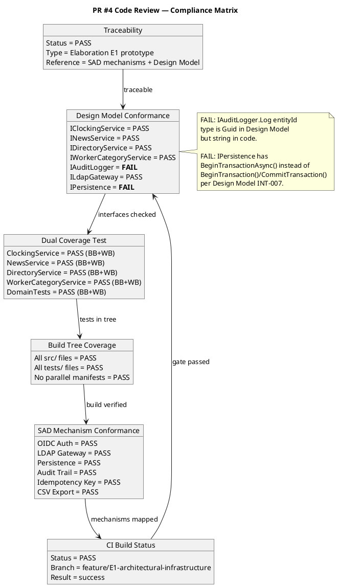

## Document Control

| Field | Value |
|---|---|
| Phase | Elaboration |
| Status | Draft |
| Milestone Target | End of Elaboration (LCA) |
| Iteration | 1 (Cycle 1) |
| Date | 2026-08-28 |
| Reviewer | Code Reviewer (Implementation Discipline) |
| Review Type | Elaboration E1 — Architectural Prototype PR Review |
| PR Reviewed | #4 — Elaboration E1: Architectural Infrastructure Prototype |
| Branch | feature/E1-architectural-infrastructure → iteration/E1 |
| CI Build Status | PASS (green) |
| Disposition | REQUEST_CHANGES — 2 Major findings (Design Model interface divergences) |
| Prior Phase | Inception LCO Review — all findings resolved, sanction GRANTED |

## Review Scope and Criteria

### Review Process

This review evaluates the Elaboration Iteration 1 architectural prototype PR against the following checklist:

| # | Checklist Item | Source | Result |
|---|---|---|---|
| 1 | CI Build Status (hard gate) | §1.1 Heuristic 5 | ✅ PASS |
| 2 | Traceability Trailer (UC-NNN / E1 reference) | §1.1 Heuristic 4 | ✅ PASS |
| 3 | Design Model Conformance (interfaces, classes, signatures) | §1.1 Heuristic 3 | ❌ FAIL — 2 interface mismatches |
| 4 | Dual Coverage Test (black-box + white-box) | §1.1 Heuristic 2 | ✅ PASS |
| 5 | Build Tree Coverage (all files under src/ or tests/) | §1.1 Heuristic 3 | ✅ PASS |
| 6 | SAD Mechanism Conformance (subsystem boundaries, layers) | §1.1 Heuristic 3 | ✅ PASS |
| 7 | Programming Guidelines Conformance | §1.1 Heuristic 1 | ✅ PASS (no CONTRIBUTING.md found; standard .NET conventions followed) |

### Artifacts Reviewed

| Artifact | Source | Read |
|---|---|---|
| Software Architecture Document | SAD (Elaboration Draft) | ✅ Logical View, Interface Specifications, Design Mechanisms |
| Design Model | Design Model (Elaboration Draft) | ✅ Interface Contracts (INT-001 through INT-007) |
| Prior Review Record | Inception LCO Review | ✅ All prior findings resolved, LCO sanction GRANTED |
| PR #4 Diff | 43 files, +2958/-482 | ✅ Full diff reviewed |
| Source Files | 20 source files read | ✅ All interfaces, services, domain, infrastructure, tests |

### PR Description

PR #4 was opened by the Code Reviewer (per RUP Ch.11 — the reviewer opens PRs) targeting `iteration/E1`. The branch `feature/E1-architectural-infrastructure` carries the Elaboration E1 architectural prototype — evolutionary production code establishing the foundational infrastructure for the Portal Cuba Corp employee portal.

## Findings

### Compliance Matrix

### Defect Distribution

```plantuml
@startuml
title PR #4 — Defect Distribution by Severity x Section

skinparam shadowing false

rectangle "Critical (0)" as C {
}

rectangle "Major (2)" as M {
  object "M1: IAuditLogger.Log signature mismatch" as M1 {
    Section = Interface Contracts
    Location = IAuditLogger.cs / Design Model INT-005
    Description = "Design Model specifies Guid entityId; code uses string entityId"
    Remediation = "Change IAuditLogger.Log to accept Guid entityId, or update Design Model INT-005 to string with a CR"
  }
  object "M2: IPersistence transaction API mismatch" as M2 {
    Section = Interface Contracts
    Location = IPersistence.cs / Design Model INT-007
    Description = "Design Model specifies BeginTransaction()/CommitTransaction(); code has BeginTransactionAsync() only, no CommitTransaction"
    Remediation = "Add CommitTransaction() and sync BeginTransaction signature, or update Design Model INT-007 with a CR"
  }
}

rectangle "Minor (3)" as Mi {
  object "Mi1: Leftover UnitTest1.cs placeholder" as Mi1 {
    Section = Test Code
    Location = tests/PortalCubaCorp.Tests/UnitTest1.cs
    Description = "Placeholder test Test1 with Assert.True(true) — no value"
    Remediation = "Delete UnitTest1.cs"
  }
  object "Mi2: ExportCsv TimeIn column always empty" as Mi2 {
    Section = Application Services
    Location = ClockingService.cs ExportCsv method
    Description = "CSV header has TimeIn,TimeOut columns but all times go into a single time field; TimeOut is always blank"
    Remediation = "Pair In/Out records or document that each row is a single event with Direction"
  }
  object "Mi3: EscapeLdapFilter duplicated 3x" as Mi3 {
    Section = Code Quality
    Location = DirectoryService.cs, WorkerCategoryService.cs, LdapGateway.cs
    Description = "Same EscapeLdapFilter method copy-pasted across 3 classes"
    Remediation = "Extract to a shared utility or LdapFilter helper class"
  }
}

rectangle "Suggestion (1)" as S {
  object "S1: NewsItem.IsFeatured never set by service" as S1 {
    Section = Application Services
    Location = NewsService.cs
    Description = "IsFeatured property exists but no service method sets it; only GetFeaturedNews reads it"
    Remediation = "Add IsFeatured parameter to Publish/Edit, or document as future Construction scope"
  }
}

C -[hidden]-> M
M -[hidden]-> Mi
Mi -[hidden]-> S

@enduml
```

### Finding Details

#### M1: IAuditLogger.Log Signature Mismatch (Major)

| Field | Value |
|---|---|
| Severity | Major |
| Section | Interface Contracts |
| Location | `src/PortalCubaCorp.Infrastructure/Interfaces/IAuditLogger.cs` vs Design Model INT-005 |
| Description | Design Model INT-005 specifies `void Log(string entityType, Guid entityId, AuditAction action, string author, DateTime timestamp)`. Code implements `void Log(string entityType, string entityId, AuditAction action, string author, DateTime timestamp)` — `entityId` is `string` not `Guid`. |
| Root Cause | The `string` type is architecturally correct (worker category uses string AD user IDs, not Guids), but the Design Model was not updated to reflect this decision. |
| Remediation | Update Design Model INT-005 to specify `string entityId` (recommended — the string type is correct for this system). Alternatively, change code to `Guid entityId` and convert at call sites. Either way, code and Design Model must agree. |

#### M2: IPersistence Transaction API Mismatch (Major)

| Field | Value |
|---|---|
| Severity | Major |
| Section | Interface Contracts |
| Location | `src/PortalCubaCorp.Infrastructure/Interfaces/IPersistence.cs` vs Design Model INT-007 |
| Description | Design Model INT-007 specifies `BeginTransaction() → IDbTransaction` and `CommitTransaction() → void`. Code implements `Task<IDbContextTransaction> BeginTransactionAsync()` with no `CommitTransaction()` method. |
| Root Cause | The async API with `IDbContextTransaction` is the correct EF Core pattern, but the Design Model was not updated to reflect this. |
| Remediation | Update Design Model INT-007 to reflect the async API and EF Core's `IDbContextTransaction` pattern (recommended). Alternatively, add synchronous wrappers. Mark with `[DEFERRED — requires Design Model update in next iteration]` if the update cannot be done in this PR. |

#### Mi1: Leftover UnitTest1.cs Placeholder (Minor)

| Field | Value |
|---|---|
| Severity | Minor |
| Section | Test Code |
| Location | `tests/PortalCubaCorp.Tests/UnitTest1.cs` |
| Description | Placeholder test `Test1` with `Assert.True(true)` — provides no test value. |
| Remediation | Delete `UnitTest1.cs`. |

#### Mi2: ExportCsv TimeIn/TimeOut Columns Not Paired (Minor)

| Field | Value |
|---|---|
| Severity | Minor |
| Section | Application Services |
| Location | `src/PortalCubaCorp.Application/ClockingService.cs` — `ExportCsv` method |
| Description | CSV header is `Employee,Date,TimeIn,TimeOut,Direction` but each row writes a single time value with TimeOut always blank. One row per event rather than paired In/Out. |
| Remediation | Either pair In/Out records into single rows, or simplify header to `Employee,Date,Time,Direction` to match actual output. |

#### Mi3: EscapeLdapFilter Duplicated 3x (Minor)

| Field | Value |
|---|---|
| Severity | Minor |
| Section | Code Quality |
| Location | `DirectoryService.cs`, `WorkerCategoryService.cs`, `LdapGateway.cs` |
| Description | Same `EscapeLdapFilter` method copy-pasted across 3 classes — violates DRY. |
| Remediation | Extract to a shared `LdapFilter.Escape()` utility method. |

#### S1: NewsItem.IsFeatured Never Set (Suggestion)

| Field | Value |
|---|---|
| Severity | Suggestion |
| Section | Application Services |
| Location | `src/PortalCubaCorp.Application/NewsService.cs` |
| Description | `IsFeatured` property exists and `GetFeaturedNews()` reads it, but no service method sets it. |
| Remediation | Add `isFeatured` parameter to `Publish`/`Edit`, or document as Construction-iteration scope. |

## Resolutions and Actions

### Action Items

| # | Finding | Severity | Owner | Status | Remediation |
|---|---|---|---|---|---|
| 1 | M1: IAuditLogger.Log signature | Major | Implementer | OPEN | Reconcile code with Design Model INT-005 |
| 2 | M2: IPersistence transaction API | Major | Implementer | OPEN | Reconcile code with Design Model INT-007 |
| 3 | Mi1: UnitTest1.cs placeholder | Minor | Implementer | OPEN | Delete file |
| 4 | Mi2: ExportCsv column mismatch | Minor | Implementer | OPEN | Fix CSV header or pair records |
| 5 | Mi3: EscapeLdapFilter duplication | Minor | Implementer | OPEN | Extract to shared utility |
| 6 | S1: IsFeatured not settable | Suggestion | Implementer | OPEN | Add parameter or defer to Construction |

### Prior Findings Reconciliation

| Prior Finding | Source | Status |
|---|---|---|
| Inception LCO — all 3 findings (A1, A2, A3) | Inception Review Record | RESOLVED — stakeholder sanctioned GO to Elaboration |

## Disposition

**REQUEST_CHANGES**

The PR establishes a well-structured architectural prototype with proper layering (Domain → Application → Infrastructure → Web), correct DI registration, comprehensive dual-coverage tests (black-box contract + white-box branch coverage), and SAD-conformant mechanism implementations (OIDC, LDAP, persistence, audit, idempotency, CSV export).

However, **2 Major findings** block merge — both are Design Model interface contract divergences (IAuditLogger.Log entityId type, IPersistence transaction API). Per §1.1 Heuristic 3, silent divergence from the Design Model is Critical; in this case the code's choices are architecturally superior to the Design Model's original specification, so the resolution is to update the Design Model rather than revert the code. Either way, code and Design Model must agree before merge.

The 3 Minor findings and 1 Suggestion should also be addressed but do not block merge.

**Terminal disposition submitted via `scm_request_changes_on_pull_request` on PR #4.**

## Traceability

| Element | Traces From | Link Type | Traces To |
|---|---|---|---|
| PR #4 (E1 Architectural Prototype) | SAD Logical View, Design Model Interface Contracts | Realizes | src/PortalCubaCorp.* (all source files) |
| IClockingService (INT-001) | COMP-002, UC-001, UC-002, UC-003, UC-004, AC-005 | Derives | ClockingService.cs, ClockingServiceTests.cs |
| INewsService (INT-002) | COMP-003, UC-005, UC-006, UC-007, UC-008, NFR-004, CON-013 | Derives | NewsService.cs, NewsServiceTests.cs |
| IDirectoryService (INT-003) | COMP-001, UC-009, CON-005, CON-012, R001 | Derives | DirectoryService.cs, DirectoryServiceTests.cs |
| IWorkerCategoryService (INT-004) | COMP-004, UC-010, CON-009, NFR-004 | Derives | WorkerCategoryService.cs, WorkerCategoryServiceTests.cs |
| IAuditLogger (INT-005) | COMP-008, NFR-004 | Derives | AuditInterceptor.cs — **M1: signature mismatch** |
| ILdapGateway (INT-006) | COMP-005, CON-005, CON-010, R001 | Derives | LdapGateway.cs |
| IPersistence (INT-007) | COMP-006, CON-003 | Derives | PersistenceGateway.cs, PortalDbContext.cs — **M2: transaction API mismatch** |
| OIDC Auth Middleware (COMP-007) | CON-004 | Derives | Program.cs (AddAuthentication/AddOpenIdConnect) |
| Domain Entities | CLS-016 through CLS-019 | Derives | PortalCubaCorp.Domain/*.cs |
| Test Coverage | All service interfaces | Tests | PortalCubaCorp.Tests/*.cs |
| Prior Review Record | Inception LCO Review | Refines | This Review Record (Elaboration E1) |