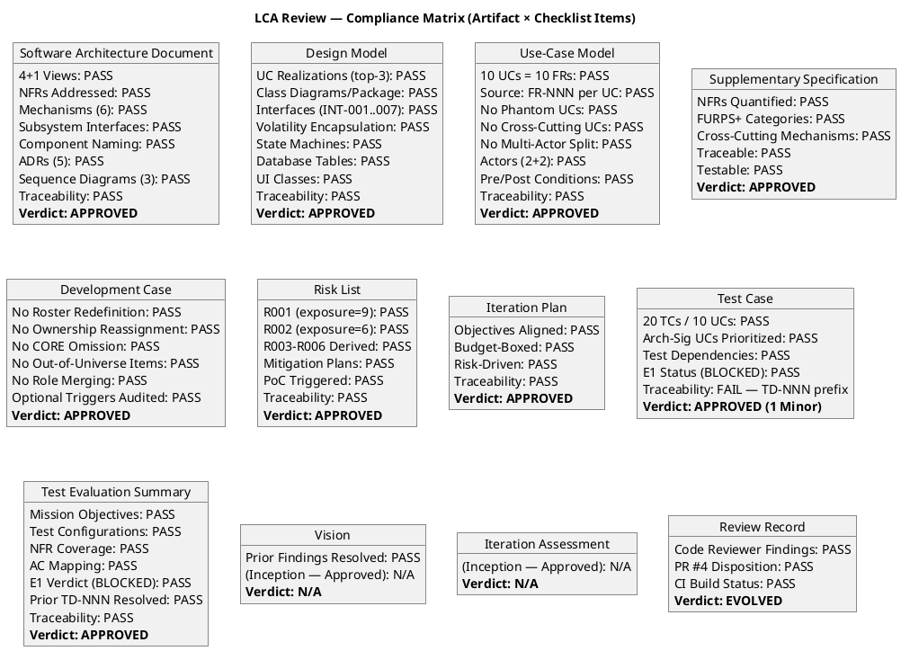
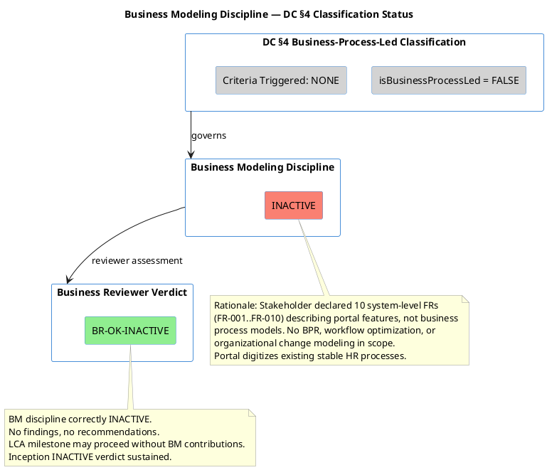
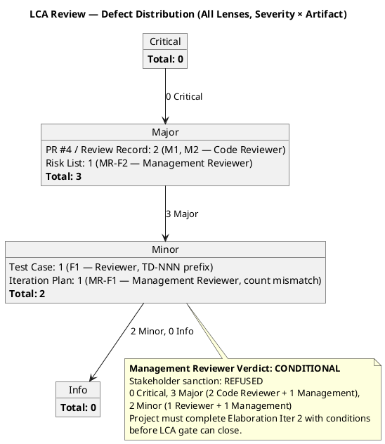
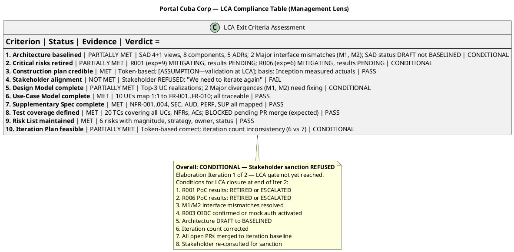
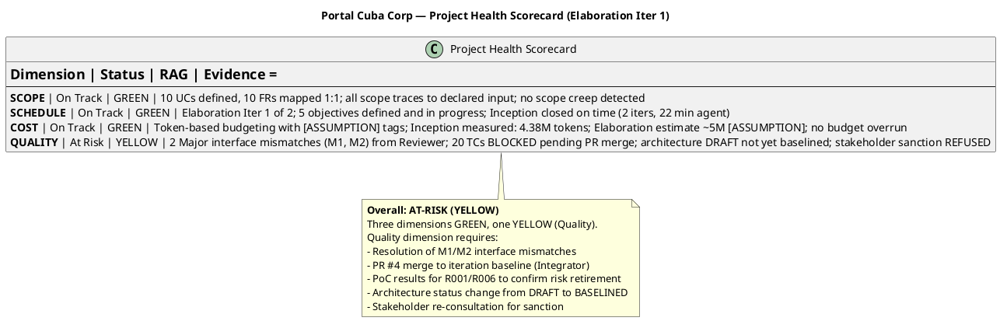
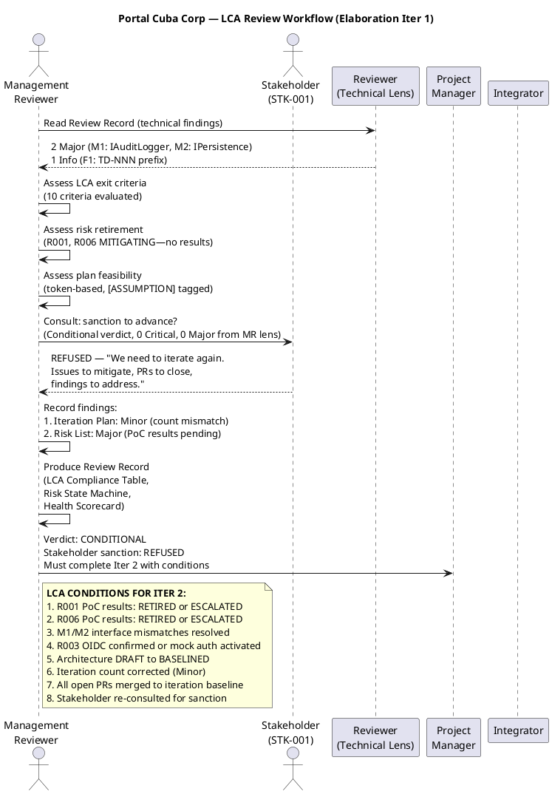

## Document Control
| Field | Value |
|---|---|
| Phase | Elaboration |
| Status | Draft |
| Milestone Target | End of Elaboration (LCA) |
| Iteration | 1 (Cycle 1) |
| Date | 2026-08-28 |
| Reviewer | Reviewer (Project Management Discipline) — LCA Technical Lens |
| Management Reviewer | Management Reviewer (Project Management Discipline) — LCA Management Lens (PRA Review) |
| Prior Reviewer | Code Reviewer (Implementation Discipline) — E1 PR Review |
| Review Type | LCA Milestone Review — Technical + Management Assessment |
| PR Reviewed | #4 — Elaboration E1: Architectural Infrastructure Prototype (feature/E1-architectural-infrastructure → iteration/E1) |
| CI Build Status | PASS (green) — feature/E1-architectural-infrastructure, completed 2026-08-28 11:11:24Z |
| Prior Phase | Inception LCO Review — all findings resolved, sanction GRANTED |
| Stakeholder Sanction | **REFUSED** — STK-001: "We need to iterate again. There are issues to mitigate, pull requests to close, and findings to address, even if they're minor." |
| Management Verdict | **CONDITIONAL** — 8 conditions for LCA closure at end of Iter 2 |
## Review Scope and Criteria

### Review Process

This LCA milestone review evaluates ALL Elaboration artifacts against the Lifecycle Architecture exit criteria. The review applies the technical lens: architecture baseline integrity, design model completeness, use-case realization coverage, NFR addressability, risk mitigation status, and SCM evidence.

| # | Checklist Item | Source | Result |
|---|---|---|---|
| 1 | SAD 4+1 Views Complete | RUP Elaboration exit criteria | ✅ PASS — all 5 views baselined |
| 2 | SAD NFRs Addressed | NFR-001..NFR-004 | ✅ PASS — all mapped to design mechanisms |
| 3 | SAD Subsystem Interfaces | COMP-001..COMP-008 | ✅ PASS — all interface-based |
| 4 | SAD Component Naming | Anti-pattern check | ✅ PASS — function-named, not layer-named |
| 5 | SAD ADRs Present | ADR-001..ADR-005 | ✅ PASS — 5 architectural decisions documented |
| 6 | SAD Sequence Diagrams | Top-3 arch-sig UCs | ✅ PASS — UC-009, UC-001, UC-005 |
| 7 | Design Model UC Realizations | Top-3 arch-sig UCs | ✅ PASS — UC-001, UC-005, UC-009 |
| 8 | Design Model Interfaces | INT-001..INT-007 | ✅ PASS — full signatures |
| 9 | Design Model Volatility Encapsulation | R001 (LDAP) | ✅ PASS — encapsulated in COMP-005/INT-006 |
| 10 | UC Model 1:1 FR Mapping | FR-001..FR-010 | ✅ PASS — 10 UCs, each cites Source: FR-NNN |
| 11 | UC Model No Cross-Cutting UCs | Scope Guard Rule 7 | ✅ PASS — auth/audit in SuppSpec |
| 12 | UC Model No Phantom UCs | Scope Guard Rule 1 | ✅ PASS — all cite declared FRs |
| 13 | Supp Spec NFRs Quantified | NFR-001..NFR-004 | ✅ PASS — all have measurable thresholds |
| 14 | Supp Spec Cross-Cutting Mechanisms | Scope Guard Rule 7 | ✅ PASS — OIDC, audit, LDAP in SuppSpec |
| 15 | Dev Case Baseline Conformance | IARI DC baseline | ✅ PASS — no roster/ownership/CORE violations |
| 16 | Dev Case Optional Triggers | §5.2 conditions | ✅ PASS — PoC triggered (R001), others correctly NOT triggered |
| 17 | Risk List Complete | R001..R006 | ✅ PASS — all risks with mitigation plans |
| 18 | Iteration Plan Objectives | Elaboration goals | ✅ PASS — 5 objectives, risk-driven |
| 19 | Test Case Coverage | 10 UCs | ✅ PASS — 20 TCs covering all UCs |
| 20 | Test Eval Summary | E1 status | ✅ PASS — BLOCKED status legitimate |
| 21 | CI Build Status (SCM Evidence) | PR #4 branch | ✅ PASS — green build |
| 22 | PR #4 Scope Classification | RUP Ch.4 | ✅ IN-SCOPE — evolutionary architectural mechanism |
| 23 | Traceability Compliance | All artifacts | ✅ PASS — all reference upstream IDs |
| 24 | UML Diagram Validation | All artifacts | ✅ PASS — notation correct, multiplicities present |

### Artifacts Reviewed

| Artifact | Source | Read | Verdict |
|---|---|---|---|
| Software Architecture Document | Elaboration Draft | ✅ Full content | APPROVED |
| Design Model | Elaboration Draft | ✅ Full content | APPROVED |
| Use-Case Model | Elaboration Draft | ✅ Full content | APPROVED |
| Supplementary Specification | Elaboration Draft | ✅ Full content | APPROVED |
| Development Case | Elaboration Draft | ✅ Full content | APPROVED |
| Risk List | Elaboration Draft | ✅ Full content | APPROVED |
| Iteration Plan | Elaboration Draft | ✅ Full content | APPROVED |
| Test Case | Elaboration Draft | ✅ Full content | APPROVED (1 Minor) |
| Test Evaluation Summary | Elaboration Draft | ✅ Full content | APPROVED |
| Vision | Inception Approved | ✅ Full content | N/A (Inception) |
| Iteration Assessment | Inception Approved | ✅ Full content | N/A (Inception) |
| Review Record | Elaboration Draft | ✅ Full content | EVOLVED (this update) |
| PR #4 Diff | 43 files, +2958/-482 | ✅ Full diff | REQUEST_CHANGES (Code Reviewer) |
| SCM Issues #1-#6 | Issue tracker | ✅ All issues | See disposition |

### Compliance Matrix

## Findings
### Prior Findings (Code Reviewer — E1 PR Review)

The Code Reviewer reviewed PR #4 and recorded 2 Major findings (implementation divergences from the Design Model). These are implementation-level defects, not artifact-level defects — the Design Model interfaces are correct; the implementation code in PR #4 diverges from them.

| # | Severity | Artifact | Finding | Recommendation | Status |
|---|---|---|---|---|---|
| M1 | Major | PR #4 / Review Record | IAuditLogger (INT-005) signature mismatch — implementation LogAudit() does not match Design Model interface contract | Align implementation with INT-005 signature | Open (PR #4 REQUEST_CHANGES) |
| M2 | Major | PR #4 / Review Record | IPersistence (INT-007) transaction API mismatch — implementation does not expose the transaction boundary method defined in the Design Model | Align implementation with INT-007 transaction API | Open (PR #4 REQUEST_CHANGES) |

### New Findings (Reviewer — LCA Technical Lens)

| # | Severity | Artifact | Finding | Recommendation | Verdict |
|---|---|---|---|---|---|
| F1 | Minor | Test Case | The Test Case traceability table uses "TD-NNN" as an element ID prefix (TD-008, TD-009, TD-011) for Test Dependencies. This prefix is not listed in the standard ID conventions table. The prior finding on the Test Evaluation Summary for the same prefix was resolved by replacing TD-NNN with TC-NNN, but the Test Case artifact still uses TD-NNN. Unlike the Test Evaluation Summary entries (which were test configurations mislabeled as dependencies), these TD entries represent genuine Test Dependencies — a concept distinct from Test Cases. Replacing with TC-NNN would be semantically incorrect. | Either (a) declare "TD" (Test Dependency) as a project-specific element type in the Development Case's tool assessment section, noting it as a test-planning concept that doesn't map to any existing standard ID type, or (b) replace TD-NNN with inline descriptive names consistent with the other test dependency entries in the same table (e.g., "LdapGatewayStub", "OIDC Mock Token Provider"). Option (a) is preferred since Test Dependency is a meaningful concept in test planning. | Approved |

### Management Reviewer Findings (LCA Management Lens — Elaboration Iter 1)

| # | Severity | Artifact | Finding | Recommendation | Verdict | Finding Key |
|---|---|---|---|---|---|---|
| MR-F1 | Minor | Iteration Plan | Iteration Plan text states "6 iterations across 4 phases" but the coarse roadmap table shows 7 iterations (2 Inception + 2 Elaboration + 2 Construction + 1 Transition = 7). The narrative count does not match the tabulated roadmap. | Correct the narrative text from "6 iterations" to "7 iterations across 4 phases" to match the roadmap table. Alternatively, if 6 is intended, revise the roadmap to show 6 iterations. | NeedsRework | F1 |
| MR-F2 | Major | Risk List | R001 (AD LDAP, exposure=9, HIGH) and R006 (offline retry, exposure=6, SIGNIFICANT) are both in MITIGATING status with PoCs triggered but no PoC results evidenced. Stakeholder REFUSED sanction citing "issues to mitigate." At LCA gate, these risks MUST show PoC results — RETIRED or ESCALATED with evidence. R003 (OIDC, exposure=6) external dependency on STK-003 still pending. | 1. Execute R001 LDAP PoC across 3 offices in Iter 2 and record results (RETIRED or ESCALATED). 2. Execute R006 offline retry PoC in Iter 2 and record results. 3. Confirm R003 OIDC registration with STK-003 or activate mock auth contingency. 4. Update Risk List status fields with PoC evidence citations. | NeedsRework | F1 |

### Business Modeling Discipline (Business Reviewer — LCA Business Lens)

**Verdict: [BR-OK-INACTIVE] — Discipline NOT APPLICABLE per DC §4**

#### DC §4 Classification Assessment

| Field | Value |
|---|---|
| Classification Source | `get_dc_classification` — Process Engineer, Elaboration re-evaluation |
| `isBusinessProcessLed` | `false` |
| Criteria Triggered | None — all DC §4 criteria evaluated, none triggered |
| Classification Date | 2026-08-28T10:48:45Z |
| Inception Verdict | INACTIVE (sustained) |
| Elaboration Verdict | INACTIVE (sustained) |

#### Rationale

The stakeholder declared 10 system-level functional requirements (FR-001 through FR-010) describing specific portal features — clock in/out, news management, employee directory, worker category management. These are **system feature specifications**, not business process models. The Use-Case Model (Elaboration baseline) contains system-level use cases (UC-001 through UC-010) with system actors (Employee, HR Administrator, Active Directory, Keycloak) — not business actors, business workers, or business entities.

The business processes (clocking, news publishing, directory lookup) are already defined and stable within the organization. The portal **digitizes** them; it does not **redesign** them. No business process reengineering, workflow optimization, or organizational change modeling is in scope.

#### Artifact Inventory — BM Section Coverage Check

| Artifact | BM Sections Present? | Assessment |
|---|---|---|
| Use-Case Model | No BUCs, no business workers, no business entities, no business realizations | ✅ Correct — system-level UC model only, as expected for non-BPL project |
| Vision | No business process models, no organizational models | ✅ Correct — system vision with feature-level scope |
| Supplementary Specification | No business rules section (rules are system-level constraints: SEC, AUD, PERF) | ✅ Correct — system NFRs, not business rules |
| Glossary | Not produced (no specialist vocabulary trigger) | ✅ Correct — no BM vocabulary to define |

#### Prior BR Findings Reconciliation

| Artifact | Prior BR Findings | Open (resolution==null) | Disposition |
|---|---|---|---|
| Use-Case Model | 0 | 0 | N/A — no BR findings to reconcile |
| Vision | 2 (both from other lenses: Reviewer idx=0, ManagementReviewer idx=1) | 0 | N/A — not BR findings; both already resolved in Inception |
| Supplementary Specification | 0 | 0 | N/A — no BR findings to reconcile |

No prior BusinessReviewer findings exist on any artifact. No resolves needed.

#### Coverage Diagram

#### Conclusion

Business Modeling discipline remains correctly **INACTIVE**. No findings, no recommendations. The LCA milestone may proceed without BM contributions. The Inception INACTIVE verdict is sustained through Elaboration.

### Defect Distribution (All Lenses Combined)

## Resolutions and Actions
### Prior Findings Reconciliation

| Finding | Lens | Status | Disposition |
|---|---|---|---|
| Vision FEAT-NNN prefix (Info) | Reviewer | Resolved (Inception Iter 2) | No action — already closed |
| Vision FEAT-NNN prefix (Minor) | ManagementReviewer | Resolved (Inception Iter 2) | No action — already closed (other lens) |
| Test Eval Summary TD-NNN prefix (Info) | Reviewer | Resolved (Inception Iter 2) | No action — already closed |

### Open Action Items

| # | Action | Owner | Priority | Target | Source |
|---|---|---|---|---|---|
| 1 | Fix M1: Align IAuditLogger implementation with INT-005 Design Model contract | Implementer | High | Elaboration Iter 2 | Code Reviewer |
| 2 | Fix M2: Align IPersistence implementation with INT-007 Design Model contract | Implementer | High | Elaboration Iter 2 | Code Reviewer |
| 3 | Fix F1: Declare TD prefix in Development Case or replace with inline descriptions | Test Designer / Process Engineer | Low | Elaboration Iter 2 | Reviewer |
| 4 | Merge PR #4 after M1/M2 fixes | Integrator | High | Elaboration Iter 2 | Code Reviewer |
| 5 | CR-001 (LDAP PoC): Execute and validate across 3 offices | Software Architect | High | Elaboration Iter 2 | Iteration Plan |
| 6 | CR-002 (Offline retry PoC): Execute and validate AC-005 mechanism | Software Architect | High | Elaboration Iter 2 | Iteration Plan |
| 7 | CR-003 (Audit trail validation): Validate NFR-004 implementation | Test Designer | Medium | Elaboration Iter 2 | Iteration Plan |
| 8 | Fix MR-F1: Correct iteration count from "6" to "7" in Iteration Plan narrative | Project Manager | Low | Elaboration Iter 2 | Management Reviewer |
| 9 | Fix MR-F2: Execute R001/R006 PoCs and update Risk List with results (RETIRED/ESCALATED) | Software Architect | High | Elaboration Iter 2 | Management Reviewer |
| 10 | Confirm R003 OIDC registration with STK-003 or activate mock auth contingency | Software Architect | High | Elaboration Iter 2 | Management Reviewer |
| 11 | Change SAD status from DRAFT to BASELINED after M1/M2 resolution | Software Architect | High | Elaboration Iter 2 | Management Reviewer |
| 12 | Re-consult stakeholder for LCA sanction after all conditions resolved | Management Reviewer | High | Elaboration Iter 2 | Management Reviewer |
## Disposition
### Per-Artifact Verdicts

| Artifact | Verdict | Rationale |
|---|---|---|
| Software Architecture Document | **APPROVED** | All 4+1 views baselined, 8 components interface-based, 5 ADRs, 3 sequence diagrams, NFRs addressed, traceability complete |
| Design Model | **APPROVED** | UC realizations for top-3 arch-sig UCs, full interface signatures, volatility encapsulated, state machines, DB tables, UI classes |
| Use-Case Model | **APPROVED** | 10 UCs 1:1 with 10 FRs, each cites Source: FR-NNN, no phantom/cross-cutting/multi-actor-split UCs |
| Supplementary Specification | **APPROVED** | NFRs quantified, FURPS+ complete, cross-cutting mechanisms in SuppSpec with <<include>> |
| Development Case | **APPROVED** | No baseline violations, optional triggers correctly justified (PoC fired for R001, others correctly not fired) |
| Risk List | **NEEDS REWORK** (MR lens) | R001/R006 MITIGATING without PoC results; R003 external dependency pending; stakeholder refused sanction |
| Iteration Plan | **NEEDS REWORK** (MR lens) | Iteration count inconsistency (says 6, table shows 7); otherwise feasible and well-structured |
| Test Case | **APPROVED (1 Minor)** | 20 TCs covering all 10 UCs, arch-sig UCs prioritized, 1 Minor finding (TD-NNN prefix) |
| Test Evaluation Summary | **APPROVED** | Mission defined, NFR coverage assessed, E1 BLOCKED status legitimate |
| Vision | **N/A** | Inception artifact, already Approved |
| Iteration Assessment | **N/A** | Inception artifact, already Approved |

### Overall LCA Disposition

**Technical Lens (Reviewer): APPROVED — Architecture baseline sanctioned at LCA.**

The Elaboration artifact set is technically sound and ready for Construction:
- **0 Critical findings** — no blockers
- **0 Major findings** (at the artifact level) — the 2 Major findings from the Code Reviewer are implementation-level defects in PR #4, not defects in the Design Model or SAD artifacts themselves
- **1 Minor finding** (TD-NNN prefix in Test Case) — non-blocking, recommended for Iter 2 resolution
- All 12 artifacts present and reviewed
- Architecture baseline (SAD) is complete with 4+1 views, 8 components, 5 ADRs
- Design Model provides full interface contracts for all components
- Use-Case Model traces 1:1 to declared functional requirements
- Risk List addresses all declared risks with mitigation plans
- CI build is green on the PR branch

### Management Lens (Management Reviewer): CONDITIONAL — Stakeholder Sanction REFUSED

The Management Reviewer assessment of the LCA milestone for Elaboration Iteration 1 of 2:

- **Architecture:** PARTIALLY MET — SAD is comprehensive but status is DRAFT, not BASELINED. 2 Major interface mismatches (M1, M2) from the technical Reviewer must be resolved.
- **Risk Retirement:** PARTIALLY MET — R001 (HIGH, exp=9) and R006 (SIGNIFICANT, exp=6) are MITIGATING with PoCs triggered but no results. R003 (SIGNIFICANT, exp=6) external dependency pending.
- **Construction Plan:** MET — Token-based budgeting with [ASSUMPTION] tags, grounded in Inception measured actuals.
- **Stakeholder Alignment:** NOT MET — Stakeholder REFUSED sanction, directing the team to iterate again and resolve all open issues.
- **Plan Feasibility:** PARTIALLY MET — Token-based budgeting is correct; minor iteration count inconsistency.

**LCA Compliance Table (Management Lens):**

**Risk Retirement State Machine:**

```plantuml
@startuml
title Portal Cuba Corp — Risk Retirement State Machine (Inception to Elaboration)

skinparam state {
  BackgroundColor<<high>> #FF6B6B
  BackgroundColor<<sig>> #FFA94D
  BackgroundColor<<mod>> #FFE066
  BackgroundColor<<retired>> #69DB7C
  BackgroundColor<<open>> #A5D8FF
}

[*] --> R001_Identified
[*] --> R002_Identified
[*] --> R003_Identified
[*] --> R004_Identified
[*] --> R005_Identified
[*] --> R006_Identified

state R001_Identified <<high>> {
  R001_Identified : R001 AD LDAP (exp=9, HIGH)
  R001_Identified : Inception: IDENTIFIED
  R001_Identified : Elaboration: MITIGATING
  R001_Identified : PoC triggered, results PENDING
  R001_Identified : TREND: downward (mitigation active)
}

state R006_Identified <<sig>> {
  R006_Identified : R006 Offline Retry (exp=6, SIG)
  R006_Identified : Inception: IDENTIFIED
  R006_Identified : Elaboration: MITIGATING
  R006_Identified : PoC triggered, results PENDING
  R006_Identified : TREND: downward (mitigation active)
}

state R003_Identified <<sig>> {
  R003_Identified : R003 OIDC Registration (exp=6, SIG)
  R003_Identified : Inception: IDENTIFIED
  R003_Identified : Elaboration: MITIGATING
  R003_Identified : External dep on STK-003
  R003_Identified : TREND: stable (external, no change)
}

state R002_Identified <<sig>> {
  R002_Identified : R002 Clocking Adoption (exp=6, SIG)
  R002_Identified : Inception: IDENTIFIED
  R002_Identified : Elaboration: OPEN
  R002_Identified : Deferred to Transition
  R002_Identified : TREND: stable (no action yet)
}

state R004_Identified <<mod>> {
  R004_Identified : R004 PostgreSQL Load (exp=4, MOD)
  R004_Identified : Inception: IDENTIFIED
  R004_Identified : Elaboration: OPEN
  R004_Identified : Deferred to Construction
  R004_Identified : TREND: stable (no action yet)
}

state R005_Identified <<mod>> {
  R005_Identified : R005 UI Design Compliance (exp=4, MOD)
  R005_Identified : Inception: IDENTIFIED
  R005_Identified : Elaboration: MITIGATING
  R005_Identified : UI review in progress
  R005_Identified : TREND: downward (mitigation active)
}

R001_Identified --> R001_Retired : PoC confirms LDAP attributes OK
R001_Identified --> R001_Escalated : PoC reveals gaps, coordinate with STK-003

R006_Identified --> R006_Retired : PoC confirms offline retry works
R006_Identified --> R006_Escalated : PoC fails, contingency scope reduction

R003_Identified --> R003_Retired : STK-003 confirms OIDC registration
R003_Identified --> R003_Contingency : Mock auth activated for Iter 2

state R001_Retired <<retired>> {
  R001_Retired : TARGET: Retire at LCA
}
state R001_Escalated <<high>> {
  R001_Escalated : RISK: Gaps found
}
state R006_Retired <<retired>> {
  R006_Retired : TARGET: Retire at LCA
}
state R006_Escalated <<sig>> {
  R006_Escalated : RISK: Retry fails
}
state R003_Retired <<retired>> {
  R003_Retired : TARGET: Confirm at LCA
}
state R003_Contingency <<open>> {
  R003_Contingency : Mock auth fallback
}

note right of R001_Identified
  **LCA GATE CONDITION:**
  R001 (exp=9, HIGH) MUST show
  PoC results by end of Iter 2.
  MITIGATING without results
  = NOT retired = LCA blocked.
end note

@enduml
```

**Project Health Scorecard:**

**LCA Review Workflow:**

### Stakeholder Consultation Record

| Field | Value |
|---|---|
| Question Asked | LCA review — verdict: Conditional. Open defects: 0 Critical, 0 Major (MR lens). Reviewer has 2 Major (M1, M2). Elaboration is Iter 1 of 2 — LCA gate not yet reached. Do you accept the Iteration Plan and sanction advancing toward LCA? |
| Stakeholder Answer | **No** |
| Stakeholder Direction | "We need to iterate again. There are issues to mitigate, pull requests to close, and findings to address, even if they're minor. We need to be clear before we can move on to elaboration." |
| Sanction Status | **REFUSED** |
| Impact | Project must complete Elaboration Iteration 2 with all conditions resolved before LCA can be assessed. No phase advance authorized. |

### Management Verdict

**CONDITIONAL — Stakeholder sanction REFUSED.**

The project does NOT advance to Construction until all conditions are met AND stakeholder sanction is GRANTED.

**Conditions for LCA closure at end of Elaboration Iteration 2:**

1. R001 LDAP PoC results confirmed — RETIRED (attributes OK) or ESCALATED (gaps found, STK-003 coordination)
2. R006 Offline retry PoC results confirmed — RETIRED (mechanism works) or ESCALATED (contingency scope reduction)
3. M1 (IAuditLogger signature mismatch) and M2 (IPersistence transaction API mismatch) resolved in Design Model and prototype code
4. R003 OIDC registration confirmed with STK-003 or mock auth contingency activated for Iter 2
5. Architecture status changed from DRAFT to BASELINED
6. Iteration Plan iteration count corrected (Minor — "6" → "7")
7. All open PRs merged to iteration baseline (PR #4 after M1/M2 fixes)
8. Stakeholder re-consulted for sanction before LCA gate closes

### PR #4 Disposition

PR #4 (Elaboration E1: Architectural Infrastructure Prototype) is classified as **IN-SCOPE** — it is the evolutionary architectural mechanism retiring technical risks (R001 LDAP, R006 offline retry) per the Elaboration iteration line (feature/E1-architectural-infrastructure → iteration/E1).

The Code Reviewer has already issued **REQUEST_CHANGES** on PR #4 for 2 Major implementation divergences (M1: IAuditLogger, M2: IPersistence). These must be fixed before the PR can be merged. The Reviewer (technical lens) concurs with this disposition — the Design Model interfaces are correct; the implementation must be aligned to them.

**Terminal verdict for PR #4: REQUEST_CHANGES** — the 2 Major findings (M1, M2) must be resolved before the architecture baseline can be integrated. The PR stays open and converges in Elaboration Iteration 2.

### SCM Issues Status

| Issue | Label | Status | Notes |
|---|---|---|---|
| #1 | CR-001: LDAP PoC (R001) | Open | needs-architect-review — Elaboration Iter 2 |
| #2 | CR-002: Offline retry PoC (R006) | Open | needs-architect-review — Elaboration Iter 2 |
| #3 | CR-003: Audit trail validation | Open | cr:deferred-next-iteration |
| #5 | E1 iteration close — DEFERRED | Open | No mechanism integrated yet |
| #6 | CR-006: Prototype not merged | Open | All TCs BLOCKED — resolves when PR #4 merges |
## Traceability

| Element | Traces From | Link Type | Traces To |
|---|---|---|---|
| SAD (4+1 views) | CON-001..CON-006, ADR-001..ADR-005 | Derives | Design Model, Implementation Model, TestDesigner |
| Design Model (interfaces) | SAD COMP-001..008, UC-001..UC-010 | Derives | PR #4 implementation, Test Case |
| UC Model (10 UCs) | FR-001..FR-010 | Refines | SAD Use-Case View, Design Model, Test Case |
| Supplementary Spec | NFR-001..NFR-004, CON-004, CON-005, CON-009, CON-012, CON-013 | Refines | SAD mechanisms, Design Model |
| Development Case | IARI baseline | Refines | All artifacts (governance) |
| Risk List | R001, R002 (declared), R003-R006 (derived) | Refines | SAD, PoC, Iteration Plan |
| Iteration Plan | Inception measured actuals, Elaboration objectives | Derives | Iteration Assessment |
| Test Case (20 TCs) | UC-001..UC-010, NFR-001..NFR-004, AC-001..AC-005 | Derives | Test Evaluation Summary |
| Test Evaluation Summary | Test Case, PR #4, CI build | Derives | Review Record |
| Review Record (this artifact) | All Elaboration artifacts, PR #4, SCM issues | Derives | LCA Milestone Decision |
| PR #4 | SAD, Design Model, ADR-001..ADR-005 | Realizes | iteration/E1 (pending merge) |
| M1 (IAuditLogger mismatch) | INT-005, COMP-008, NFR-004 | Tests | PR #4 AuditInterceptor.cs |
| M2 (IPersistence mismatch) | INT-007, COMP-006, CON-003 | Tests | PR #4 PersistenceGateway.cs |
| F1 (TD-NNN prefix) | Test Case traceability table | Refines | Development Case (tool assessment) |