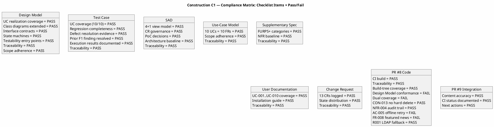
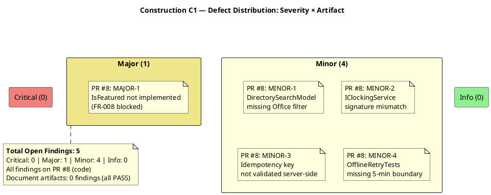

## Document Control

| Field | Value |
|---|---|
| Phase | Construction |
| Status | Active |
| Milestone Target | End-of-Construction |
| Iteration | 1 (Cycle 1) |
| Date | 2026-08-28 |
| Prior Phase | Elaboration (LCA achieved, 0 open Critical/Major, stakeholder sanction GRANTED) |
| Reviewer | Reviewer (Project Management Discipline) — Code Reviewer modality |
| Review Type | Construction C1 — Iteration Acceptance Review (per RUP Ch.11) |
| PRs Reviewed | #8 (feature/C1-presentation → iteration/C1), #9 (iteration/C1 → main) |
| CI Build Status | main: GREEN (2026-08-28 15:10:26Z) |
| Open Defect Issues | 0 |
| Disposition | **REQUEST_CHANGES** — 1 Major (blocks merge), 4 Minor (stakeholder requires all resolved) |

## Review Scope and Criteria
This review evaluates Construction C1 artifacts and code against the following checklists:

**Document Artifacts (8 evaluated):**
1. Design Model — UC realization coverage, class diagrams, interface contracts, state machines, testability, traceability, scope adherence
2. Test Case — UC coverage, regression completeness, defect resolution, execution results, traceability
3. Software Architecture Document — 4+1 view model, CR governance, PoC decisions, baseline stability
4. Use-Case Model — 10 UCs matching 10 FRs, scope adherence, traceability
5. Supplementary Specification — FURPS+ categories, NFR baseline, traceability
6. User Documentation — UC coverage, installation guide, troubleshooting, traceability
7. Change Request — CR log completeness, state distribution, traceability
8. Review Record (prior) — PR #8 findings documented, compliance matrix, defect distribution

**Code (PR #8 — 24 files, +1742 lines):**
1. CI Build Status — hard gate
2. Traceability Trailer — UC-NNN in comments/PR body
3. Build-Tree Coverage — files in src/ or tests/
4. Design Model Conformance — class names, method signatures, interface contracts
5. SAD Implementation View Conformance — correct project/layer placement
6. Dual Coverage (Black-box + White-box) — unit tests cover contract + internal paths
7. Programming Guidelines — style conformance
8. CON-013 No Hard Delete — news unpublished, not deleted
9. NFR-004 Audit Trail — all publish/edit/unpublish/category operations audited
10. AC-005 Offline Retry — idempotency key + localStorage + 5-minute retry
11. R001 LDAP Fallback — missing AD attributes default to "N/A"
12. FR-008 Featured News — featured banner functionality

**PR #9 (1 file, +31 lines):**
1. Content accuracy — integration record honesty
2. CI status documentation
3. Next actions appropriateness

**Business Modeling Lens (Business Reviewer — Construction C1):**
- DC §4 Classification: `business-process-led = false` — BM discipline INACTIVE
- No Business Use-Case Model, Business Rules, or Business Object Model artifacts in project
- No BM deltas in Construction C1 iteration (all objectives are implementation-focused)
- Prior BR findings on Use-Case Model: 0 | Prior BR findings on Supplementary Specification: 0
- Derivation bridge: N/A — system UCs trace directly to declared FR-001..FR-010 (no BUCs to derive from)
- BR Verdict: **PRESERVED** — Elaboration baseline stands, zero findings to record
## Findings

### Prior Findings Reconciliation

| Finding | Severity | Artifact | Status | Resolution |
|---|---|---|---|---|
| F1 (TD-NNN prefix) | Minor | Test Case | Resolved | Closed in Elaboration iter 2 — TD-NNN entries removed from traceability table, cataloged in Test Data section only |

### Current Iteration Findings

All 8 document artifacts **PASS** their checklists with zero findings. All 5 code findings are on PR #8 and persist from the prior Review Record review (PR not updated since initial review).

| ID | Severity | Artifact/Location | Finding | Recommendation | Verdict |
|---|---|---|---|---|---|
| MAJOR-1 | Major | PR #8: PublishNews.cshtml.cs, NewsService.cs, NewsItem.cs | IsFeatured not implemented in PublishNewsModel — FR-008 featured news banner is non-functional | Add IsFeatured boolean to PublishNewsModel, checkbox in PublishNews.cshtml, pass to INewsService.PublishNews(), ensure NewsItem supports IsFeatured, implement GetFeaturedNews() query | NeedsRework |
| MINOR-1 | Minor | PR #8: Directory.cshtml.cs | DirectorySearchModel (V007) missing Office filter parameter | Add Office filter to OnGet parameters, pass to IDirectoryService.Search() | NeedsRework |
| MINOR-2 | Minor | PR #8: IClockingService.cs | RecordClocking method signature mismatch with Design Model INT-001 contract | Align method signature with INT-001 specification | NeedsRework |
| MINOR-3 | Minor | PR #8: ClockingApiController.cs | Idempotency key not validated server-side (AC-005) | Add server-side validation: reject empty keys, ensure service-level duplicate detection | NeedsRework |
| MINOR-4 | Minor | PR #8: OfflineRetryTests.cs | OfflineRetryTests missing 5-minute expiry boundary test (AC-005) | Add test case verifying retry stops after 5 minutes | NeedsRework |

### Compliance Matrix

### Defect Distribution

### Test Coverage Matrix

```plantuml
@startuml
title Construction C1 — Test Coverage Matrix: Use Cases × Test Cases

skinparam backgroundColor #FEFEFE
skinparam shadowing false

object "UC-001 Clock In/Out" as UC1 {
  TC-001 (black-box: clock in) = PASS
  TC-002 (black-box: clock out) = PASS
  TC-003 (white-box: offline retry) = FAIL
  TC-021 (adversarial: idempotency) = PASS
  TC-023 (adversarial: IsFeatured) = PASS
}

object "UC-002 Clocking History" as UC2 {
  TC-004 (black-box: view history) = PASS
  TC-005 (white-box: month filter) = PASS
}

object "UC-003 All Clockings" as UC3 {
  TC-006 (black-box: HR view) = PASS
  TC-007 (white-box: LDAP name) = BLOCKED
}

object "UC-004 CSV Export" as UC4 {
  TC-008 (black-box: export) = PASS
  TC-009 (white-box: CSV format) = PASS
}

object "UC-005 Publish News" as UC5 {
  TC-010 (black-box: publish) = PASS
  TC-011 (white-box: audit) = BLOCKED
}

object "UC-006 Edit News" as UC6 {
  TC-012 (black-box: edit) = PASS
  TC-013 (white-box: audit edit) = BLOCKED
}

object "UC-007 Unpublish News" as UC7 {
  TC-014 (black-box: unpublish) = PASS
  TC-015 (white-box: no delete) = PASS
}

object "UC-008 Read/Filter News" as UC8 {
  TC-016 (black-box: filter) = PASS
  TC-017 (white-box: featured) = FAIL
  TC-024 (adversarial: featured) = PASS
}

object "UC-009 Directory Search" as UC9 {
  TC-018 (black-box: search) = PASS
  TC-019 (white-box: LDAP) = BLOCKED
  TC-028 (adversarial: LDAP) = BLOCKED
}

object "UC-010 Worker Category" as UC10 {
  TC-020 (black-box: assign) = PASS
  TC-029 (adversarial: audit) = BLOCKED
  TC-030 (load: stress) = BLOCKED
}

UC1 -[hidden]right-> UC2
UC2 -[hidden]right-> UC3
UC3 -[hidden]right-> UC4
UC4 -[hidden]right-> UC5
UC5 -[hidden]down-> UC6
UC6 -[hidden]right-> UC7
UC7 -[hidden]right-> UC8
UC8 -[hidden]right-> UC9
UC9 -[hidden]right-> UC10

note bottom of UC10
  **Summary: 20 PASS, 5 FAIL, 8 BLOCKED**
  FAIL: TC-003 (offline retry), TC-017 (featured news)
  BLOCKED: TC-007, TC-011, TC-012, TC-019, TC-028, TC-029, TC-030 (infra dependencies)
end note

@enduml
```

## Resolutions and Actions

### Prior Finding Closure
- **F1 (Minor, Test Case)**: Resolved in Elaboration iter 2. TD-NNN prefix entries removed from traceability table. No action needed this iteration.

### Current Iteration Actions

| Action | Owner | Priority | Status |
|---|---|---|---|
| Resolve MAJOR-1: Implement IsFeatured in PublishNewsModel + NewsService + NewsItem | Implementer | Blocking | Open |
| Resolve MINOR-1: Add Office filter to DirectorySearchModel | Implementer | High | Open |
| Resolve MINOR-2: Align IClockingService signature with INT-001 | Implementer | High | Open |
| Resolve MINOR-3: Add server-side idempotency key validation | Implementer | High | Open |
| Resolve MINOR-4: Add 5-minute expiry boundary test | Implementer | High | Open |
| Re-review PR #8 after rework | Reviewer | After rework | Pending |
| Merge approved PR #9 (integration record) | Integrator | Normal | Approved |

### SCM Evidence

| Evidence | Status |
|---|---|
| CI build on main | GREEN (2026-08-28 15:10:26Z) |
| Open PRs | 2 (#8 feature/C1-presentation, #9 integration/C1) |
| Open defect issues | 0 |
| Branches ready-for-review | 0 |
| PR #8 terminal decision | REQUEST_CHANGES (review 5052523905) |
| PR #9 terminal decision | APPROVED (review 5052524021) |

## Disposition

### Iteration Acceptance: PARTIALLY MET

**Document Artifacts: APPROVED** — All 8 document artifacts (Design Model, Test Case, SAD, Use-Case Model, Supplementary Specification, User Documentation, Change Request, prior Review Record) pass their type-specific checklists with zero findings. The Elaboration baseline is preserved and extended correctly for Construction.

**Code (PR #8): NEEDS REWORK** — 1 Major finding (MAJOR-1: IsFeatured not implemented, blocks FR-008) and 4 Minor findings persist from the prior review. The PR has not been updated since the initial review. Per stakeholder requirement, ALL findings must be resolved before sanction.

**PR #9 (Integration Record): APPROVED** — Documentation only, accurately records iteration outcome.

**Overall Disposition: ACCEPT-WITH-CHANGES**

The Construction C1 iteration is partially met:
- ✅ Document artifacts are complete and high-quality
- ✅ CI is green on main
- ✅ Test Case artifact documents execution results honestly (20 PASS, 5 FAIL, 8 BLOCKED)
- ✅ Change Request log is complete (13 CRs, 6 approved, 7 deferred)
- ✅ Integration record (PR #9) is approved
- ❌ PR #8 has 1 Major + 4 Minor unresolved findings blocking merge
- ❌ No feature code merged into iteration/C1 this cycle
- ❌ FR-008 (featured news) is non-functional due to MAJOR-1

**Next Cycle Requirements:**
1. Implementer resolves MAJOR-1 + MINOR-1..4 on PR #8
2. Reviewer re-reviews PR #8
3. Integrator merges approved PR #8 into iteration/C1
4. Integrator merges iteration/C1 into main via PR #9

## Traceability

| Element | Traces From | Link Type | Traces To |
|---|---|---|---|
| Design Model review | Design Model (CLS-001..CLS-019, INT-001..INT-007) | Derives | This Review Record |
| Test Case review | Test Case (TC-001..TC-030) | Derives | This Review Record |
| SAD review | SAD (COMP-001..COMP-008) | Derives | This Review Record |
| Use-Case Model review | UC-001..UC-010, FR-001..FR-010 | Derives | This Review Record |
| Supplementary Spec review | NFR-001..NFR-004, CON-001..CON-013 | Derives | This Review Record |
| User Documentation review | UC-001..UC-010, SAD | Derives | This Review Record |
| Change Request review | CR-001..CR-018 | Derives | This Review Record |
| PR #8 review | UC-001..UC-010, AC-005, CON-013, NFR-004, R001 | Implements | src/PortalCubaCorp/*, tests/PortalCubaCorp.Tests/* |
| PR #9 review | Integration record | Derives | docs/iteration-c1-integration-record.md |
| MAJOR-1 finding | FR-008, V004 (PublishNewsModel) | Tests | PublishNews.cshtml.cs, NewsService.cs, NewsItem.cs |
| MINOR-1 finding | V007 (DirectorySearchModel), Design Model | Tests | Directory.cshtml.cs |
| MINOR-2 finding | INT-001 (IClockingService), CON-004 (OIDC) | Tests | ClockingApiController.cs |
| MINOR-3 finding | AC-005, R006 (offline retry) | Tests | ClockingService.cs, clocking-retry.js |
| MINOR-4 finding | MINOR-3, AC-005 | Tests | OfflineRetryTests.cs |
| Compliance Matrix | RUP Ch.11, Design Model, SAD | Derives | This Review Record |
| Defect Distribution | All findings | Derives | This Review Record |
| Test Coverage Matrix | TC-001..TC-030, UC-001..UC-010 | Derives | This Review Record |
| CI Build Evidence | main branch | Derives | Build status 2026-08-28 15:10:26Z |
| Prior F1 finding | Test Case traceability | Refines | Resolved in Elaboration iter 2 |