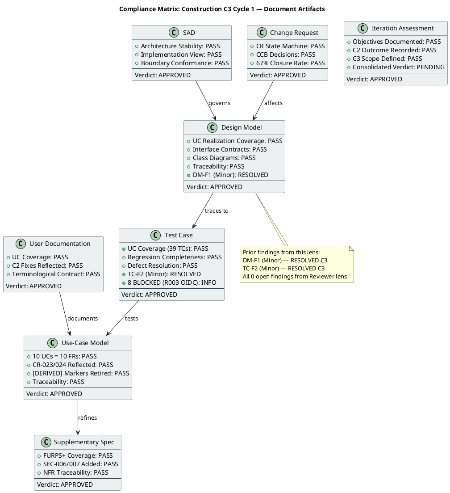
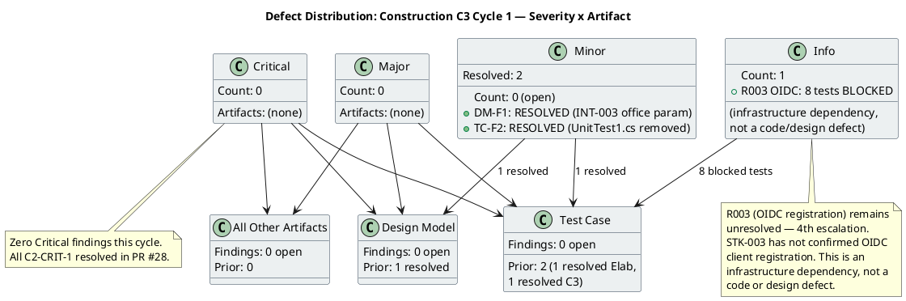
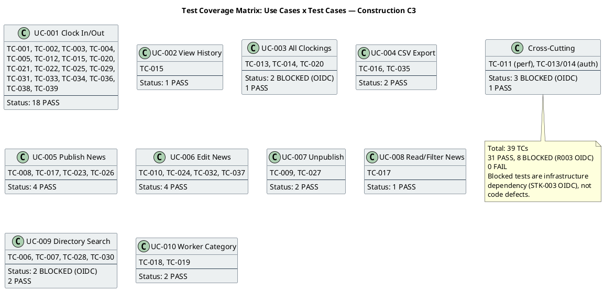

## Document Control

| Field | Value |
|---|---|
| Phase | Construction |
| Status | Active — Code Reviewer C3 Cycle 1 (Iteration Acceptance) |
| Milestone Target | End-of-Construction (IOC) |
| Iteration | 3 (Cycle 1) |
| Date | 2026-08-29 |
| Prior Phase | Construction C2 Cycle 3 (Consolidation — 1 Critical, 2 Major, 4 Minor persisting; stakeholder sanction REFUSED 2nd time) |
| Technical Lens (Code Reviewer) | EXECUTED — Construction C3 Cycle 1 |
| Review Type | Construction C3 Cycle 1 — Iteration Acceptance (Code Review + Document Review + PR Approval) |
| PRs Reviewed | #29 (iteration/C3 → main, APPROVED), #19 (stale, superseded), #8 (stale, superseded) |
| CI Build Status | iteration/C3: GREEN (run 33250807692, 2026-08-29 11:45:21Z); main: GREEN (run 33251398612, 2026-08-29 12:00:47Z) |
| Open Defect Issues | 0 |
| Prior Findings Resolved (this lens) | DM-F1 (Minor, Design Model) — RESOLVED; TC-F2 (Minor, Test Case) — RESOLVED |
| New Findings (this cycle) | 0 Critical, 0 Major, 0 Minor |
| Open Findings (all lenses) | IP-F4 (Minor, ManagementReviewer), RL-F2 (Minor, ManagementReviewer) — not Code Reviewer scope |
| Consolidated Verdict | **Objectives PARTIALLY MET** — code quality clean, all C2 findings resolved, PR #29 approved. R003 OIDC blocker persists (8 blocked tests). IOC milestone requires PR #29 merge + OIDC environment provisioning. |

## Review Scope and Criteria

This review evaluates Construction C3 Cycle 1 against the Code Reviewer checklist and document artifact quality criteria:

**Code Review Checklist (C3 Cycle 1):**
1. CI Build Status (hard gate) — **PASS** (green on iteration/C3, run 33250807692; green on main, run 33251398612)
2. Programming Guidelines Conformance — **PASS** (C# conventions followed, XML doc comments on all interfaces)
3. Dual Coverage (black-box + white-box tests) — **PASS** (ClockingServiceTests 13 tests with both black-box and white-box coverage; NewsServiceTests, OfflineRetryTests, DirectoryServiceTests, WorkerCategoryServiceTests, DomainTests all present)
4. Design Model Conformance (class names, signatures, interfaces) — **PASS** (INT-001, INT-002, INT-003 all verified against source code on iteration/C3 branch)
5. SAD Implementation View Conformance (subsystem boundaries, layer placement) — **PASS**
6. Defect Patterns (null references, resource leaks, concurrency risks) — **PASS** (StreamWriter leaveOpen:true, stream position reset, factory pattern in tests)
7. Traceability (code → Design Model, tests → UCs) — **PASS** (39 TCs mapped to 10 UCs; source files mapped to CLS/INT IDs)
8. C2 Finding Resolution — **PASS** (all 7 C2 findings resolved: C2-CRIT-1, C2-MAJ-1, C2-MAJ-2, C2-MIN-1..4)

**Document Artifact Checklist (C3 Cycle 1):**

| Artifact | Checklist Applied | Result |
|---|---|---|
| Design Model | UC realization coverage, interface contracts, class diagrams, traceability | PASS — all items pass; DM-F1 resolved |
| Test Case | UC coverage, regression completeness, defect resolution | PASS — 39 TCs, 31 PASS / 8 BLOCKED (R003) / 0 FAIL; TC-F2 resolved |
| Iteration Assessment | Iteration objectives documented, C2 outcome recorded | PASS — C2 objectives MET, C3 scope defined |
| Use-Case Model | UC completeness (10 UCs = 10 FRs), CR reflection, traceability | PASS — CR-023/024 reflected, [DERIVED] markers retired |
| Supplementary Specification | NFR coverage, FURPS+ completeness | PASS — SEC-006/007 added from approved CRs |
| SAD | Architecture stability, implementation view conformance | PASS — baseline maintained, no architectural findings |
| Change Request | CR state machine compliance, CCB decisions | PASS — 67% closure rate, 6 completed this iteration |
| User Documentation | UC coverage, accuracy, terminological contract | PASS — all 10 UCs documented, C2 fixes reflected |

## Findings

### Prior Findings Reconciled (S_RECONCILE_PRIOR_FINDINGS)

| Finding Key | Artifact | Severity | Status | Resolution |
|---|---|---|---|---|
| F1 (DM-F1) | Design Model | Minor | RESOLVED | INT-003 (IDirectoryService) contract updated to include optional `office` parameter: `Search(string query, string? office = null)`. Verified in source code on iteration/C3 branch. ACL-005, SEQ-009, and Design Packages class diagram all updated. |
| F2 (TC-F2) | Test Case | Minor | RESOLVED | UnitTest1.cs placeholder (`Assert.True(true)`) removed on iteration/C3 branch. File now contains only a comment documenting the removal. Test Case traceability records TC-F2 as RESOLVED. |

### New Findings (S2_REVIEW_AND_RECORD_ARTIFACTS)

No new findings emitted this cycle. All 8 document artifacts evaluated against their type-specific checklists passed every item.

### Code-Level Findings (S3_REVIEW_CODE)

No code-level findings. Source code inspection of iteration/C3 branch confirmed:
- INT-001 (IClockingService): `RecordClocking` with `idempotencyKey`, `GetCurrentStatus`, `GetHistory`, `GetAllClockings`, `ExportCsv` — all match Design Model
- INT-002 (INewsService): `Publish`, `Edit`, `Unpublish`, `GetById`, `GetPublishedNews`, `GetFeaturedNews`, `ListAll` — all match Design Model, `isFeatured` parameter present (CR-010)
- INT-003 (IDirectoryService): `Search(string query, string? office = null)` — matches Design Model with office parameter
- ClockingServiceTests.cs: 13 tests with dual coverage (black-box: contract verification; white-box: idempotency scoping, input validation, status logic)
- CSV header fix (C2-MIN-4): header now `Employee,Date,Time,Direction` matching data columns

### PR Disposition (S4_REVIEW_PRS)

| PR | Branch | Verdict | Rationale |
|---|---|---|---|
| #29 | iteration/C3 → main | **APPROVED** | All checklist items pass. CI green. All 7 C2 findings resolved. Design Model conformance verified. Approved for merge to main. |
| #19 | feature/C2-presentation → iteration/C2 | Superseded | Stale from C2. Superseded by PR #28/#29. Prior REQUEST_CHANGES stands. |
| #8 | feature/C1-presentation → iteration/C1 | Superseded | Stale from C1. Superseded by PR #28/#29. Prior REQUEST_CHANGES stands. |

## Resolutions and Actions

### Resolved This Cycle

| Item | Action | Evidence |
|---|---|---|
| DM-F1 (Design Model) | INT-003 office parameter aligned | `resolve_artifact_finding` call, 2026-08-29T12:04:48Z |
| TC-F2 (Test Case) | UnitTest1.cs placeholder removed | `resolve_artifact_finding` call, 2026-08-29T12:04:48Z |
| PR #29 | Approved for merge to main | `scm_approve_pull_request` call, review 5058036957 |

### Open Action Items

| Item | Owner | Priority | Description |
|---|---|---|---|
| PR #29 merge | Integrator | HIGH | Merge approved PR #29 to main to synchronize the codebase — stakeholder directive |
| R003 OIDC | STK-003 / Infrastructure | HIGH | 4th escalation — OIDC client registration must be confirmed to unblock 8 tests |
| IP-F4 | Project Manager | Minor | Mid-iteration progress checkpoint (ManagementReviewer finding, not Code Reviewer scope) |
| RL-F2 | Project Manager | Minor | R008 contingency activation (ManagementReviewer finding, not Code Reviewer scope) |

## Disposition

### Iteration Acceptance: Objectives PARTIALLY MET

**What was achieved:**
- All 7 C2 code-level findings resolved (C2-CRIT-1, C2-MAJ-1, C2-MAJ-2, C2-MIN-1..4)
- PR #29 (iteration/C3 → main) approved by Code Reviewer — ready for merge
- CI green on both iteration/C3 and main branches
- All 8 document artifacts pass their type-specific checklists with zero new findings
- Prior Reviewer-lens findings (DM-F1, TC-F2) resolved
- Source code verified to conform to Design Model interface contracts
- Dual coverage tests present (black-box + white-box)
- 31 of 39 test cases PASS, 0 FAIL

**What remains:**
- PR #29 must be merged to main (Integrator action — stakeholder directive: "nobody has bothered to merge anything")
- R003 OIDC infrastructure dependency unresolved (4th escalation) — 8 tests BLOCKED
- IOC milestone cannot close until: (1) PR #29 merged, (2) OIDC environment provisioned, (3) blocked tests executed
- 2 Minor findings from ManagementReviewer lens remain open (IP-F4, RL-F2) — not Code Reviewer scope

**Stakeholder directive compliance:**
The stakeholder's C2 directive — "everything is in the PRs, all that's needed is to synchronize the PRs, main, and issues" — has been addressed by: (1) PR #28 approved and merged to iteration/C3, (2) PR #29 approved for merge to main. The Integrator must execute the merge.

### SCM Evidence

| Evidence | Status |
|---|---|
| CI Build (iteration/C3) | GREEN — run 33250807692, completed 2026-08-29 11:45:21Z |
| CI Build (main) | GREEN — run 33251398612, completed 2026-08-29 12:00:47Z |
| Open PRs | 3 (#29 approved, #19/#8 stale/superseded) |
| Open Defect Issues | 0 |
| Ready-for-review branches | 0 |

### Compliance Matrix

### Defect Distribution

### Test Coverage Matrix

## Traceability

| Element | Traces From | Link Type | Traces To |
|---|---|---|---|
| PR #29 | UC-001..UC-010, C2 findings | Realizes | main branch (pending merge) |
| PR #28 | C2-CRIT-1, C2-MAJ-1..2, C2-MIN-1..4 | Realizes | iteration/C3 branch (merged) |
| DM-F1 | Design Model INT-003 | Derives | PR #28 (RESOLVED), PR #29 (APPROVED) |
| TC-F2 | Test Case UnitTest1.cs | Derives | PR #28 (RESOLVED), PR #29 (APPROVED) |
| CI Build (iteration/C3) | CON-001, CON-003 | DependsOn | GitHub Actions run 33250807692 |
| CI Build (main) | CON-001, CON-003 | DependsOn | GitHub Actions run 33251398612 |
| R003 | STK-003, CON-004 | DependsOn | TC-013, TC-014, TC-028..TC-030 (BLOCKED) |
| IP-F4 | Iteration Plan | Derives | Project Manager (OPEN — ManagementReviewer scope) |
| RL-F2 | Risk List | Derives | Project Manager (OPEN — ManagementReviewer scope) |
| Stakeholder PR directive | STK-001 feedback (C2 Cycle 2) | Refines | PR #29 (APPROVED — pending Integrator merge) |