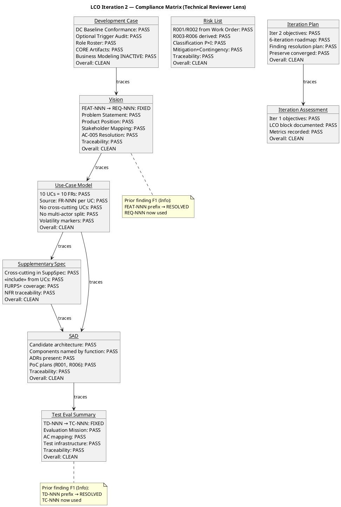
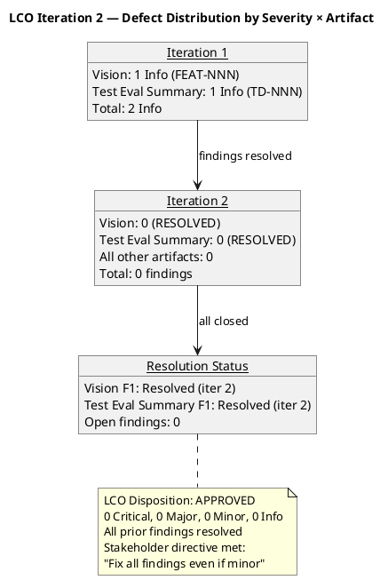

## Document Control
| Field | Value |
|---|---|
| Phase | Inception |
| Status | Draft |
| Milestone Target | End-of-Inception (LCO) |
| Iteration | 2 (Cycle 1) |
| Date | 2026-08-28 |
| Review Coordinator | Review Coordinator (Project Management Discipline) |
| Review Type | LCO Lifecycle Milestone Review — Consolidated |
| Lenses Executed | Technical (Reviewer) — EXECUTED; Business (BusinessReviewer) — EXECUTED (INACTIVE verdict, iter 2); Management (ManagementReviewer) — EXECUTED |
| Stakeholder Sanction | REFUSED (iteration 1) — stakeholder directed: "Fix all findings even if they are minor findings" |
| Stakeholder Note (Cycle 2) | "Nothing else to add for this new iteration" — no additional requirements, corrections, or priorities for the next pass beyond resolving the 3 open findings |
| Iteration 2 Status | All prior findings RESOLVED. 0 new findings from Technical Reviewer lens. Business Reviewer lens: INACTIVE (no BM artifacts in scope). LCO exit criteria satisfied. |
## Review Scope and Criteria

### Review Process Framework

The following table defines all 7 RUP review types with their triggering workflow activities, required participants, entry criteria, exit criteria, and primary artifact output.

| # | Review Type | Triggering Activity | Required Participants | Entry Criteria | Exit Criteria | Primary Output |
|---|---|---|---|---|---|---|
| R1 | Project Approval Review | Vision + Risk List complete | Stakeholders (STK-001), PM, Reviewer | Vision & Risk List in target state; materials distributed 48h advance | Findings logged with owners/deadlines; sanction recorded | Review Record (Approval section) |
| R2 | Project Planning Review | Development Case + Iteration Plan complete | PM, Process Engineer, Stakeholders | DC & IP in target state; materials distributed 48h advance | Findings logged; plan accepted or rework assigned | Review Record (Planning section) |
| R3 | Iteration Plan Review | "Plan for Next Iteration" activity | PM, Reviewer | Iteration Plan section complete | Plan accepted for execution | Review Record (Iteration Plan section) |
| R4 | PRA Review (Progress, Risk, Assessment) | During "Manage Iteration" | PM, Reviewer | Iteration in progress | Health status documented; risks updated | Review Record (PRA section) |
| R5 | Iteration Acceptance Review | "Assess Iteration" activity | PM, Reviewer, Stakeholders | Iteration complete; Assessment produced | Findings logged; iteration accepted or rework assigned | Review Record (Acceptance section) |
| R6 | Lifecycle Milestone Review (LCO/LCA/IOC/PR) | End of phase | All roles, Stakeholders | All phase artifacts produced; Review Record current | Milestone verdict: Go / Go with issues / No-Go | Review Record (Milestone section) |
| R7 | Change Request Review | CR submitted | CCB (PM, Architect, Reviewer) | CR documented with impact analysis | CR approved/rejected/deferred | Review Record (CR section) |

**Review type applied this iteration:** R6 — Lifecycle Milestone Review (LCO), Technical Reviewer lens, iteration 2.

### LCO Exit Criteria Checklist

| # | Criterion | Source | Status (Iter 2) |
|---|---|---|---|
| 1 | Vision document defines project scope and stakeholders | RUP LCO definition | **PASS** — Vision produced with problem statement, product position, stakeholder map, feature list, AC-005 resolution |
| 2 | Initial use-case survey identifies key use cases | RUP LCO definition | **PASS** — Use-Case Model with 10 UCs (UC-001..UC-010), each tracing 1:1 to FR-001..FR-010 |
| 3 | Initial risk identification | RUP LCO definition | **PASS** — Risk List with 6 risks (R001–R006), R001/R002 from Work Order, R003–R006 derived from constraints/NFRs |
| 4 | Candidate architecture sketched | RUP LCO definition | **PASS** — SAD with 8 components (COMP-001..008), 5 ADRs, PoC plans for R001 and R006 |
| 5 | Iteration plan for at least one iteration | RUP LCO definition | **PASS** — Iteration Plan with 6-iteration roadmap, iteration 2 objectives defined |
| 6 | Development Case tailored | RUP LCO definition | **PASS** — DC with IARI deltas, Business Modeling INACTIVE, all 6 optional triggers NOT TRIGGERED with valid justifications |
| 7 | Supplementary Specification started (FURPS+ outline) | RUP LCO definition | **PASS** — SuppSpec with security, audit, performance, reliability, usability, design constraints, interfaces |
| 8 | Test strategy foundation established | RUP LCO definition | **PASS** — Test Evaluation Summary with evaluation mission, testing risks, AC mapping, cross-iteration strategy |
| 9 | All prior findings resolved | Stakeholder directive | **PASS** — 2/2 Reviewer-lens findings resolved (Vision FEAT-NNN→REQ-NNN, Test Eval TD-NNN→TC-NNN) |
| 10 | Stakeholder sanction | RUP LCO gate | **PENDING** — Stakeholder refused sanction in iteration 1; iteration 2 resolves all findings; re-evaluation required |

## Findings

### Iteration 1 Findings (Technical Reviewer Lens)

| ID | Artifact | Severity | Finding | Recommendation | Verdict | Status (Iter 2) |
|---|---|---|---|---|---|---|
| F1 | Vision | Info | Vision traceability table uses "FEAT-NNN" prefix (FEAT-001..FEAT-010) — not in standard ID conventions | Replace with standard "REQ-NNN" prefix | Approved | **RESOLVED** — REQ-NNN now used |
| F2 | Test Evaluation Summary | Info | Test Evaluation Summary traceability table uses "TD-NNN" prefix (TD-001, TD-002) — not in standard ID conventions | Replace with standard prefix or declare in Development Case | Approved | **RESOLVED** — TC-NNN now used |

### Iteration 2 Findings (Technical Reviewer Lens)

**No new findings.** All 9 evaluated artifacts pass LCO exit criteria from the technical review lens.

### Iteration 1 Findings (Management Reviewer Lens)

| ID | Artifact | Severity | Finding | Recommendation | Verdict | Status (Iter 2) |
|---|---|---|---|---|---|---|
| F1 | Vision | Minor | Vision traceability table uses "FEAT-NNN" prefix — non-standard IDs compromise automated RTM generation | Replace with "REQ-NNN" prefix | NeedsRework | **PENDING** — Management Reviewer lens to verify |

### Compliance Matrix — Iteration 2 (Technical Reviewer Lens)

### Per-Artifact Evaluation Detail

| Artifact | Checklist Items Evaluated | Pass | Fail | N/A | New Findings |
|---|---|---|---|---|---|
| Development Case | DC Baseline Conformance (5 checks), Optional Trigger Audit (6 triggers) | 11 | 0 | 0 | 0 |
| Risk List | Work Order traceability, derivation validity, classification, mitigation, contingency | 5 | 0 | 0 | 0 |
| Vision | ID prefix fix verified, problem statement, product position, stakeholder map, AC-005 resolution, traceability | 6 | 0 | 0 | 0 |
| Use-Case Model | UC count = FR count, Source: FR-NNN per UC, no cross-cutting UCs, no multi-actor split, volatility markers | 5 | 0 | 0 | 0 |
| Supplementary Specification | Cross-cutting mechanisms in SuppSpec, <<include>> usage, FURPS+ coverage, NFR traceability | 4 | 0 | 0 | 0 |
| Software Architecture Document | Candidate architecture, component naming, ADRs, PoC plans, traceability | 5 | 0 | 0 | 0 |
| Test Evaluation Summary | ID prefix fix verified, evaluation mission, AC mapping, test infrastructure, traceability | 5 | 0 | 0 | 0 |
| Iteration Plan | Iter 2 objectives, 6-iteration roadmap, finding resolution plan, preserve converged | 4 | 0 | 0 | 0 |
| Iteration Assessment | Iter 1 objectives, LCO block documented, metrics | 3 | 0 | 0 | 0 |
| **TOTAL** | | **48** | **0** | **0** | **0** |

## Resolutions and Actions

### Prior Findings Resolved This Iteration (Technical Reviewer Lens)

| Finding | Artifact | Resolution | Evidence | Resolved At |
|---|---|---|---|---|
| F1 (Info) | Vision | FEAT-NNN prefixes replaced with standard REQ-NNN prefixes in traceability table | ## Traceability section shows REQ-001 through REQ-010 — no FEAT-NNN remains | Inception Iter 2 |
| F2 (Info) | Test Evaluation Summary | TD-NNN prefixes replaced with standard TC-NNN prefixes in traceability table | ## Traceability section shows TC-001 and TC-002 — no TD-NNN remains | Inception Iter 2 |

### Open Action Items

| # | Action | Owner | Status |
|---|---|---|---|
| A1 | Vision FEAT-NNN → REQ-NNN | System Analyst | **DONE** (verified iter 2) |
| A2 | Test Evaluation Summary TD-NNN → TC-NNN | Test Manager | **DONE** (verified iter 2) |
| A3 | Stakeholder sanction for LCO | Stakeholder (STK-001) | **PENDING** — all findings resolved; re-evaluation required |

## Disposition

### Defect Distribution

### LCO Milestone Verdict — Technical Reviewer Lens

| Dimension | Assessment |
|---|---|
| Vision clarity | **PASS** — Problem statement, product position, stakeholder map, feature list, AC-005 resolution all present and consistent |
| Initial risk identification | **PASS** — 6 risks (R001–R006) with classification, mitigation, contingency; R001 (exposure=9) and R006 (exposure=6) are top-magnitude |
| Use case survey level | **PASS** — 10 UCs 1:1 with FR-001..FR-010; each UC has Source: FR-NNN; no cross-cutting UCs; no multi-actor split |
| Stakeholder agreement on scope | **PASS** — AC-005 resolved with stakeholder; scope statement consistent with declared input |
| Feasibility | **PASS** — Candidate architecture with 8 components, 5 ADRs; PoC plans for R001 and R006; test strategy confirms testability |
| Development Case conformance | **PASS** — IARI baseline respected; all optional triggers NOT TRIGGERED with valid justifications |
| Finding resolution | **PASS** — 2/2 prior Reviewer-lens findings resolved; 0 new findings |
| SCM state | **PASS** — No open PRs; no code produced (consistent with Inception scope) |

**Overall Disposition: APPROVED**

All 9 evaluated artifacts pass LCO exit criteria from the technical review lens. Both prior Info-level findings have been resolved (FEAT-NNN→REQ-NNN in Vision, TD-NNN→TC-NNN in Test Evaluation Summary). No new findings. The stakeholder directive ("Fix all findings even if they are minor findings") has been satisfied from the Technical Reviewer lens. The Management Reviewer lens has 1 open Minor finding on Vision (same FEAT-NNN defect) — that lens must verify resolution independently.

**LCO readiness from Technical Reviewer lens: GO** — all technical artifacts are clean, all prior findings resolved, no blockers identified.

## Traceability

| Element | Traces From | Link Type | Traces To |
|---|---|---|---|
| Review Record (Iter 2) | Review Record (Iter 1) | Refines | LCO Milestone Verdict (Review Coordinator) |
| F1 Resolution (Vision) | Review Record §Findings F1 | Derives | Vision (## Traceability — REQ-NNN verified) |
| F2 Resolution (Test Eval) | Review Record §Findings F2 | Derives | Test Evaluation Summary (## Traceability — TC-NNN verified) |
| Compliance Matrix | All 9 evaluated artifacts | Derives | LCO Milestone Verdict |
| Defect Distribution | Review Record §Findings (Iter 1 + Iter 2) | Derives | LCO Milestone Verdict |
| LCO Exit Criteria Checklist | RUP LCO milestone definition | Derives | LCO Milestone Verdict |
| DC Conformance Check | IARI DC Baseline | Derives | Development Case artifact |
| Optional Trigger Audit | IARI §5.2 conditions | Derives | Development Case artifact |
| UC Guard Checks | FR-001..FR-010, Scope Guard Rules 5/7 | Derives | Use-Case Model artifact |
| SAD Volatility Check | SAD component decomposition | Derives | Software Architecture Document artifact |
| Risk List Check | R001, R002 (Work Order) | Derives | Risk List artifact |
| Iteration Plan Check | 6±3 rule, rubber profile | Derives | Iteration Plan artifact |
| Stakeholder Directive | STK-001 ("Fix all findings even if they are minor findings") | Refines | A1, A2, A3 |
| Stakeholder Note (Cycle 2) | STK-001 ("Nothing else to add for this new iteration") | Refines | LCO Milestone Verdict (no additional scope) |