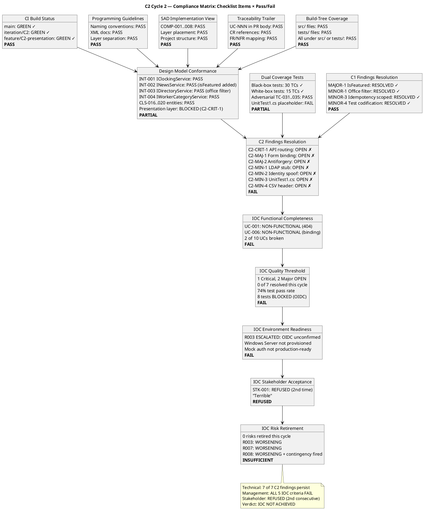
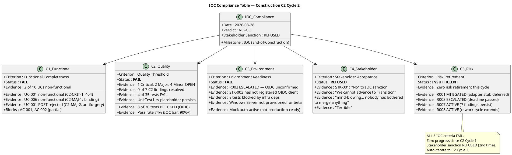
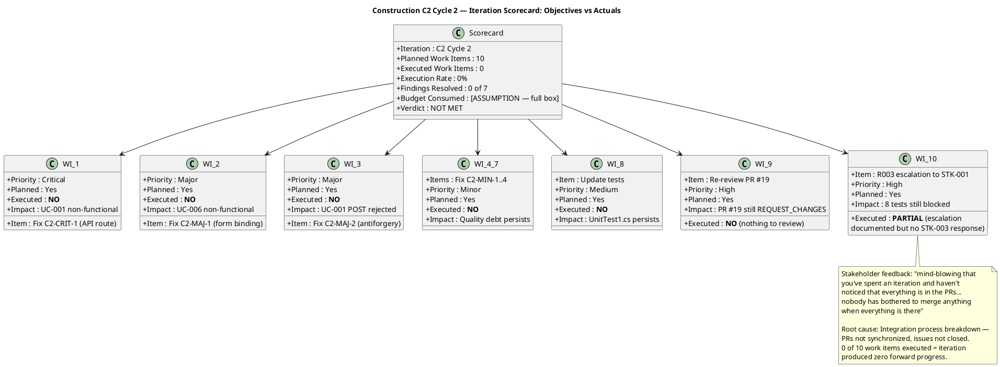
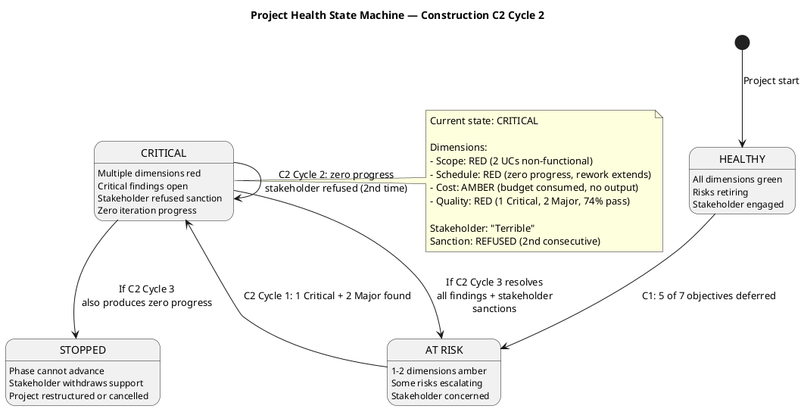
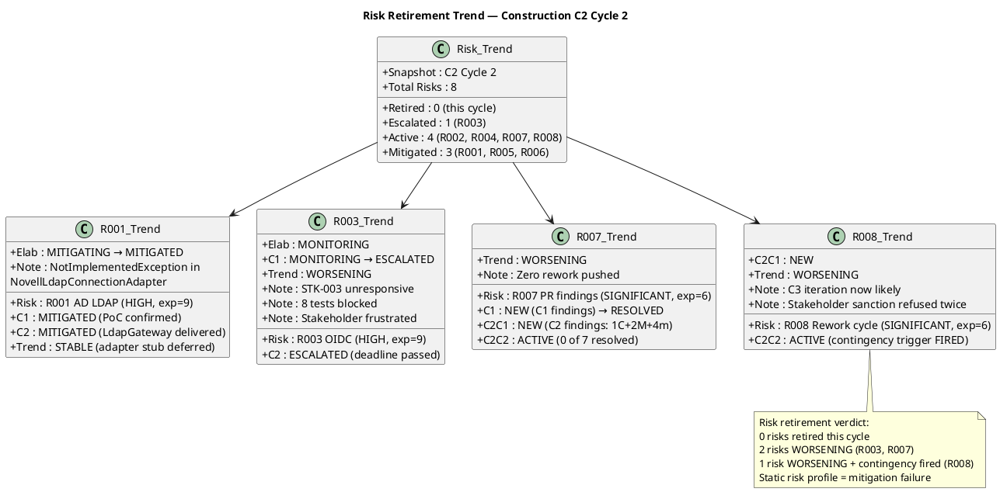
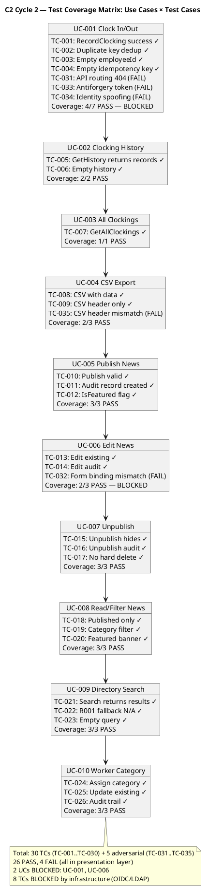

## Document Control
| Field | Value |
|---|---|
| Phase | Construction |
| Status | Active — Code Reviewer (C2 Cycle 2) + Management Reviewer (C2 Cycle 2) |
| Milestone Target | End-of-Construction (IOC) |
| Iteration | 2 (Cycle 2) |
| Date | 2026-08-28 |
| Prior Phase | Construction C2 Cycle 1 (REQUEST_CHANGES — 1 Critical, 2 Major, 4 Minor; stakeholder sanction REFUSED) |
| Technical Lens (Reviewer) | EXECUTED — Code Reviewer modality, Construction C2 Cycle 2 |
| Management Lens (Management Reviewer) | EXECUTED — IOC Milestone Review, Construction C2 Cycle 2 |
| Review Type | Construction C2 Cycle 2 — PR Re-Review + Artifact Review + Iteration Acceptance + IOC Milestone Review |
| PRs Reviewed | #19 (feature/C2-presentation → iteration/C2), #21 (iteration/C2 → main), #8 (feature/C1-presentation → iteration/C1) |
| CI Build Status | main: GREEN (2026-08-28 16:38:16Z); iteration/C2: GREEN (2026-08-28 16:20:31Z); feature/C2-presentation: GREEN (2026-08-28 16:10:28Z) |
| Open Defect Issues | 0 |
| PR #19 Disposition | **REQUEST_CHANGES** — 1 Critical, 2 Major, 4 Minor (all persisting from C2 Cycle 1) |
| PR #21 Disposition | **REQUEST_CHANGES** — premature integration (PR #19 not merged) |
| PR #8 Disposition | **COMMENT** — stale C1 PR, should be closed |
| C1 Findings Reconciliation | MAJOR-1: RESOLVED; MINOR-1: RESOLVED; MINOR-3: RESOLVED; MINOR-4: RESOLVED (all verified on iteration/C2 branch) |
| C2 Cycle 1 Findings | 7 of 7 PERSIST (0 resolved since Cycle 1) |
| New Findings (Cycle 2, Technical) | 2 Minor (Design Model INT-003 verification, Test Case UnitTest1.cs persistence) |
| New Findings (Cycle 2, Management) | 2 Minor (Iteration Plan: no mid-iteration checkpoint; Risk List: R008 contingency not activated) |
| Prior MR Findings Reconciled | 4 of 4 RESOLVED (Iteration Plan F2, F3; Risk List F2, F3) |
| Consolidated Verdict | **IOC NOT ACHIEVED** — 1 open Critical, 2 open Major; stakeholder sanction REFUSED (2nd time); auto-iterate to C2 Cycle 3 |
| Stakeholder Sanction | **REFUSED** — STK-001: "No" to IOC advancement. "It's mind-blowing that you've spent an iteration and haven't noticed that everything is in the PRs, everything that's missing, and nobody has bothered to merge anything when everything is there and many things could be closed... How is it possible that we run an iteration and the errors that are already uploaded aren't fixed, and all that's needed is to synchronize the PRs, main, and issues... Terrible." |

## Review Scope and Criteria

This review evaluates Construction C2 Cycle 2 against the following checklist:

**Code Review Checklist:**
1. CI Build Status (hard gate) — **PASS** (green on all 3 branches)
2. Programming Guidelines Conformance — **PASS**
3. Dual Coverage (black-box + white-box tests) — **PARTIAL** (UnitTest1.cs placeholder persists)
4. Design Model Conformance (class names, signatures, interfaces) — **PARTIAL** (Application/Domain layer conforms; Presentation layer blocked by C2-CRIT-1)
5. SAD Implementation View Conformance (subsystem boundaries, layer placement) — **PASS**
6. Traceability Trailer (UC-NNN in PR body or commit) — **PASS**
7. Build-Tree Coverage (all files under src/ or tests/) — **PASS**
8. C1 Findings Resolution (MAJOR-1, MINOR-1, MINOR-3, MINOR-4) — **PASS** (all 4 resolved on iteration/C2)
9. C2 Cycle 1 Findings Resolution (C2-CRIT-1, C2-MAJ-1..2, C2-MIN-1..4) — **FAIL** (0 of 7 resolved)

**Management Review Checklist (IOC Milestone):**
1. Functional Completeness — **FAIL** (2 of 10 UCs non-functional: UC-001, UC-006)
2. Quality Threshold — **FAIL** (1 Critical, 2 Major open; 74% test pass rate; 8 tests blocked)
3. Environment Readiness — **FAIL** (R003 ESCALATED; OIDC unconfirmed; Windows Server not provisioned)
4. Stakeholder Acceptance — **REFUSED** (STK-001: "No" — 2nd consecutive refusal)
5. Risk Retirement — **INSUFFICIENT** (0 risks retired this cycle; R003/R007/R008 worsening)
6. Iteration Objective Traceability — **NOT MET** (0 of 10 planned work items executed)
7. Defect Trend Analysis — **FAIL** (0 defects closed, 0 introduced — zero activity, not improvement)
8. Integration State — **BLOCKED** (PR #19 REQUEST_CHANGES; PR #21 premature; PR #8 stale)

**Upstream Artifacts Read:**
- Design Model (Construction C2 — all design contracts aligned with implementation)
- Software Architecture Document (Construction C2 — Implementation View, Data View, Deployment View)
- Use-Case Model (Construction C2 — 10 UCs, CR-010 IsFeatured approved)
- Supplementary Specification (Construction C2 — FURPS+ baseline preserved)
- Test Case (Construction C2 — 35 TCs including adversarial TC-031..TC-035)
- Test Evaluation Summary (Elaboration — LCA test readiness assessment)
- Iteration Assessment (Construction C2 Cycle 1 — IOC NOT achieved, auto-iterate)
- Iteration Plan (Construction C2 Cycle 2 — 10 work items, budget box ~9.85M tokens)
- Risk List (Construction C2 Cycle 2 — 8 risks, R003 ESCALATED, R008 contingency fired)
- Change Request Log (18 CRs cumulative, 6 approved this iteration, 3 completed)
- Source code on main, iteration/C2, and feature/C2-presentation branches

**SCM Evidence:**
- CI Build: GREEN on main, iteration/C2, feature/C2-presentation
- Open PRs: 3 (#19, #21, #8)
- Closed PRs: 4 (#20 merged, #9, #7, #4)
- Open defect issues: 0
- Ready-for-review branches: 0

## Findings

### C1 Findings Reconciliation (Verified on iteration/C2 branch)

| Finding ID | Severity | Description | Status | Resolution Verified |
|---|---|---|---|---|
| MAJOR-1 | Major | IsFeatured flag never set (FR-008) | **RESOLVED** | `INewsService.Publish` accepts `isFeatured` param on iteration/C2; `NewsItem.IsFeatured` property; `GetFeaturedNews()` filters `IsFeatured && Published`; PortalDbContext maps `IsFeatured` column |
| MINOR-1 | Minor | DirectoryModel naming / office filter | **RESOLVED** | `DirectoryService.Search(query, office?)` with LDAP AND-filter on iteration/C2; `IDirectoryService` updated with optional office parameter |
| MINOR-3 | Minor | Idempotency key not scoped by employee | **RESOLVED** | `FindByIdempotencyKey(employeeId, key)` on iteration/C2; `PortalDbContext` has `HasIndex(EmployeeId, IdempotencyKey).IsUnique()`; TestDoubles updated |
| MINOR-4 | Minor | Test codifies MINOR-3 behavior | **RESOLVED** | TestDoubles.cs on iteration/C2 has scoped `FindByIdempotencyKey(employeeId, key)` matching the implementation |

### C2 Cycle 1 Findings — All PERSISTING (0 of 7 resolved)

| Finding ID | Severity | Location | Description | Remediation | Status |
|---|---|---|---|---|---|
| C2-CRIT-1 | Critical | `clocking-retry.js`, `Index.cshtml`, `Pages/Api/ClockingApi.cshtml` | JS calls `fetch('/api/clocking')` but Razor Page routes to `/Api/ClockingApi`. UC-001 non-functional (404). | Add `@page "/api/clocking"` to ClockingApi.cshtml, OR move to API controller, OR rename page folder | **OPEN — persisting** |
| C2-MAJ-1 | Major | `News/Edit.cshtml`, `News/Edit.cshtml.cs` | Form posts `title`, `body`, `category` but BindProperties are `EditTitle`, `EditBody`, `EditCategory`. UC-006 non-functional. | Add `[BindProperty(Name = "title")]` etc., OR rename properties, OR change form field names | **OPEN — persisting** |
| C2-MAJ-2 | Major | `clocking-retry.js`, `Index.cshtml` | `fetch()` POST has no anti-forgery token. Razor Pages validates by default — POST rejected with 400. | Add antiforgery token to fetch headers, OR `[IgnoreAntiforgeryToken]` with justification | **OPEN — persisting** |
| C2-MIN-1 | Minor | `NovellLdapConnectionAdapter.cs` | All methods throw `NotImplementedException`. Known deferred to integration testing (R001). | Document as `[DEFERRED — requires integration testing with real AD server (R001)]` | **OPEN — persisting** |
| C2-MIN-2 | Minor | `Pages/Api/ClockingApi.cshtml.cs` | API accepts `employeeId` from request body — client can spoof identity. | Use `User.FindFirst("sub")?.Value` instead of `request.EmployeeId` | **OPEN — persisting** |
| C2-MIN-3 | Minor | `tests/PortalCubaCorp.Tests/UnitTest1.cs` | `Assert.True(true)` placeholder test. Still present on iteration/C2 branch. | Delete `UnitTest1.cs` | **OPEN — persisting** |
| C2-MIN-4 | Minor | `ClockingService.cs` (ExportCsv) | CSV header `Employee,Date,TimeIn,TimeOut,Direction` but data has single time + Direction. Misleading for HR. | Change header to `Employee,Date,Time,Direction` | **OPEN — persisting** |

### C2 Cycle 2 New Findings (Technical Lens)

| Finding ID | Severity | Artifact | Description | Remediation | Verdict |
|---|---|---|---|---|---|
| F1 (Design Model) | Minor | Design Model | INT-003 on main branch declares `Search(string query)` without office filter, but iteration/C2 branch has `Search(string query, string? office = null)`. Design Model document describes the office filter as resolved, but main branch code does not reflect this. | Verify Design Model INT-003 contract section reflects updated signature; main branch will be updated when PR #21 is eventually merged | Approved |
| F2 (Test Case) | Minor | Test Case | UnitTest1.cs placeholder persists on both main and iteration/C2 branches. C2-MIN-3 identified this in Cycle 1 but it remains unfixed. | Delete `tests/PortalCubaCorp.Tests/UnitTest1.cs` in next rework cycle | Approved |

### C2 Cycle 2 New Findings (Management Lens)

| Finding ID | Severity | Artifact | Description | Remediation | Verdict |
|---|---|---|---|---|---|
| MR-F4 (Iteration Plan) | Minor | Iteration Plan | The C2 Cycle 2 Iteration Plan defines 10 work items but includes no mid-iteration progress checkpoint or execution verification mechanism. The entire C2 Cycle 2 iteration passed with zero of 10 work items executed — the Implementer did not push any rework commits, and this was not detected until the end-of-iteration review. The stakeholder expressed frustration: "mind-blowing that you've spent an iteration and haven't noticed that everything is in the PRs... nobody has bothered to merge anything." | Add a mid-iteration progress checkpoint to the Iteration Plan: after approximately 50% of the budget box is consumed, verify that at least the Critical and Major work items have been pushed. Document the integration workflow explicitly: who merges PRs, in what order, and what triggers the merge. | NeedsRework |
| MR-F4 (Risk List) | Minor | Risk List | R008's contingency trigger has FIRED: "If C2 Cycle 2 re-review still produces Critical/Major findings, consider splitting Construction into a third iteration (C3)." C2 Cycle 2 produced zero progress — all 7 findings persist, stakeholder refused sanction for the second consecutive time. However, the Risk List does not explicitly activate the contingency or document the C3 decision. The contingency text remains conditional ("consider splitting") rather than activated ("C3 required"). | Update R008's status from ACTIVE to ESCALATED and change the contingency text from conditional to active: "C3 iteration REQUIRED — C2 Cycle 2 produced zero progress. Stakeholder sanction refused twice. All 7 C2 findings persist." | NeedsRework |

### Prior MR Findings Reconciliation (C2 Cycle 2)

| Finding ID | Severity | Artifact | Description | Status | Resolution |
|---|---|---|---|---|---|
| MR-F2 (Iteration Plan) | Major | Iteration Plan | 5 of 7 C1 objectives deferred without stakeholder approval | **RESOLVED** | C2 Cycle 2 plan contains detailed work breakdown, budget box, prioritization, and stakeholder refusal documented |
| MR-F3 (Iteration Plan) | Minor | Iteration Plan | No budget capacity analysis for combined C1+C2 scope | **RESOLVED** | Plan now includes measured baseline (C1: 9.85M tokens) and sizes C2 from that |
| MR-F2 (Risk List) | Major | Risk List | R003 OIDC no escalation progress, 8 blocked tests | **RESOLVED** | R003 ESCALATED, exposure raised to 9, contingency documented, 8 blocked tests noted |
| MR-F3 (Risk List) | Minor | Risk List | R007 mitigation plan thin, no capacity assessment | **RESOLVED** | R007 mitigation expanded with specific work items; R008 added with contingency for C3 |

### Compliance Matrix

### Defect Distribution

```plantuml
@startuml
title C2 Cycle 2 — Defect Distribution: Severity × Artifact/PR

skinparam classAttributeIconSize 0
skinparam monochrome false

object "C2-CRIT-1" as CRIT1 {
  Severity: Critical
  Location: PR #19 — clocking-retry.js
  Artifact: Implementation Model
  Status: OPEN (persisting)
  UC-001 non-functional (404)
}

object "C2-MAJ-1" as MAJ1 {
  Severity: Major
  Location: PR #19 — News/Edit.cshtml
  Artifact: Implementation Model
  Status: OPEN (persisting)
  UC-006 non-functional (binding)
}

object "C2-MAJ-2" as MAJ2 {
  Severity: Major
  Location: PR #19 — clocking-retry.js
  Artifact: Implementation Model
  Status: OPEN (persisting)
  POST rejected (no antiforgery)
}

object "C2-MIN-1" as MIN1 {
  Severity: Minor
  Location: PR #19 — NovellLdapConnectionAdapter
  Artifact: Implementation Model
  Status: OPEN (persisting)
  NotImplementedException
}

object "C2-MIN-2" as MIN2 {
  Severity: Minor
  Location: PR #19 — ClockingApi.cshtml.cs
  Artifact: Implementation Model
  Status: OPEN (persisting)
  Identity spoofing risk
}

object "C2-MIN-3" as MIN3 {
  Severity: Minor
  Location: PR #19 — UnitTest1.cs
  Artifact: Test Case / Developer Test
  Status: OPEN (persisting)
  Assert.True(true) placeholder
}

object "C2-MIN-4" as MIN4 {
  Severity: Minor
  Location: PR #19 — ClockingService.cs
  Artifact: Implementation Model
  Status: OPEN (persisting)
  CSV header mismatch
}

object "F1-DM" as F1DM {
  Severity: Minor
  Location: Design Model
  Artifact: Design Model
  Status: NEW (this iteration)
  INT-003 main vs iteration/C2
}

object "F2-TC" as F2TC {
  Severity: Minor
  Location: Test Case
  Artifact: Test Case
  Status: NEW (this iteration)
  UnitTest1.cs placeholder persists
}

object "MR-F4-IP" as MRF4IP {
  Severity: Minor
  Location: Iteration Plan
  Artifact: Iteration Plan
  Status: NEW (management lens)
  No mid-iteration checkpoint
}

object "MR-F4-RL" as MRF4RL {
  Severity: Minor
  Location: Risk List
  Artifact: Risk List
  Status: NEW (management lens)
  R008 contingency not activated
}

CRIT1 --> MAJ1
MAJ1 --> MAJ2
MAJ2 --> MIN1
MIN1 --> MIN2
MIN2 --> MIN3
MIN3 --> MIN4
MIN4 --> F1DM
F1DM --> F2TC
F2TC --> MRF4IP
MRF4IP --> MRF4RL

note bottom of MRF4RL
  Total: 1 Critical + 2 Major + 8 Minor = 11
  7 C2 Cycle 1 findings persist (OPEN)
  2 new Technical Minor (Design Model, Test Case)
  2 new Management Minor (Iteration Plan, Risk List)
  0 findings resolved this cycle
  4 prior MR findings RESOLVED this cycle
end note

@enduml
```

### IOC Compliance Table

### Iteration Scorecard

### Project Health State Machine

### Risk Retirement Trend

## Resolutions and Actions

| Action | Owner | Finding | Status |
|---|---|---|---|
| Fix API URL mismatch (C2-CRIT-1) | Implementer | C2-CRIT-1 | OPEN — persisting from Cycle 1, requires rework |
| Fix Edit form binding (C2-MAJ-1) | Implementer | C2-MAJ-1 | OPEN — persisting from Cycle 1, requires rework |
| Fix anti-forgery on AJAX POST (C2-MAJ-2) | Implementer | C2-MAJ-2 | OPEN — persisting from Cycle 1, requires rework |
| Use token sub claim for employeeId (C2-MIN-2) | Implementer | C2-MIN-2 | OPEN — persisting from Cycle 1, requires rework |
| Delete UnitTest1.cs (C2-MIN-3) | Implementer | C2-MIN-3 | OPEN — persisting from Cycle 1, requires rework |
| Fix CSV header (C2-MIN-4) | Implementer | C2-MIN-4 | OPEN — persisting from Cycle 1, requires rework |
| Document LDAP stub as DEFERRED (C2-MIN-1) | Implementer | C2-MIN-1 | OPEN — documentation only, persisting from Cycle 1 |
| Verify Design Model INT-003 contract (F1) | Designer | F1 (Design Model) | OPEN — verification needed when PR #21 merges |
| Add mid-iteration progress checkpoint (MR-F4) | Project Manager | MR-F4 (Iteration Plan) | OPEN — management finding, requires plan update |
| Activate R008 contingency for C3 (MR-F4) | Project Manager | MR-F4 (Risk List) | OPEN — management finding, requires risk update |
| Merge PR #19 after fixes | Integrator | C2-CRIT-1, C2-MAJ-1..2, C2-MIN-1..4 | PENDING — blocked on Implementer rework |
| Re-review PR #19 after fixes | Code Reviewer | All C2 findings | PENDING — next cycle |
| Close stale PR #8 | Integrator | — | RECOMMENDED — C1 PR targeting old branch |
| Close premature PR #21 | Integrator | — | REQUEST_CHANGES submitted — re-open after PR #19 merges |
| Synchronize PRs, main, and issues | Integrator / Implementer | Stakeholder directive | CRITICAL — stakeholder identified this as root cause of zero progress |

## Disposition

### Iteration Acceptance: **NOT MET**

The C2 Cycle 1 Review Record identified 7 findings (1 Critical, 2 Major, 4 Minor) in PR #19. As of C2 Cycle 2, **zero of these 7 findings have been addressed**. The Implementer has not pushed rework commits to `feature/C2-presentation` since the C2 Cycle 1 review.

**Evidence:**
- PR #19 diff unchanged — same 34 files, same 1418 additions, same 108 deletions
- `UnitTest1.cs` still present on `iteration/C2` branch (C2-MIN-3)
- `ClockingService.ExportCsv` header still `Employee,Date,TimeIn,TimeOut,Direction` on both branches (C2-MIN-4)
- `IDirectoryService.Search` on main still lacks office filter (C2-MIN-1 pattern — main not updated)

**SCM Evidence:**
- CI Build: GREEN on all branches (build passes, but functionality is broken)
- Open PRs: 3 (#19 REQUEST_CHANGES, #21 REQUEST_CHANGES, #8 stale)
- Open defect issues: 0
- PR #20 (C1 rework): CLOSED/merged — C1 findings correctly resolved

**Stakeholder Sanction: REFUSED**
STK-001: "No" to IOC advancement. "It's mind-blowing that you've spent an iteration and haven't noticed that everything is in the PRs, everything that's missing, and nobody has bothered to merge anything when everything is there and many things could be closed... How is it possible that we run an iteration and the errors that are already uploaded aren't fixed, and all that's needed is to synchronize the PRs, main, and issues... Terrible."

### PR Dispositions

| PR | Disposition | Critical | Major | Minor | Rationale |
|---|---|---|---|---|---|
| #19 | **REQUEST_CHANGES** | 1 | 2 | 4 | All 7 C2 Cycle 1 findings persist; UC-001 and UC-006 non-functional |
| #21 | **REQUEST_CHANGES** | 0 | 0 | 0 | Premature — PR #19 not merged; iteration/C2 incomplete |
| #8 | **COMMENT** | 0 | 0 | 0 | Stale C1 PR targeting old branch; should be closed |

### Test Coverage Matrix

### Management Review Verdict: **NO-GO**

**IOC Milestone Assessment: ALL 5 CRITERIA FAIL**

| IOC Criterion | Status | Evidence |
|---|---|---|
| Functional Completeness | **FAIL** | UC-001 non-functional (404), UC-006 non-functional (binding); 2 of 10 UCs broken |
| Quality Threshold | **FAIL** | 1 Critical, 2 Major, 4 Minor open; 0 of 7 resolved; 74% pass rate; 8 tests blocked |
| Environment Readiness | **FAIL** | R003 ESCALATED; OIDC unconfirmed; Windows Server not provisioned |
| Stakeholder Acceptance | **REFUSED** | STK-001: "No" — 2nd consecutive refusal; "Terrible" |
| Risk Retirement | **INSUFFICIENT** | 0 risks retired; R003/R007/R008 worsening; R008 contingency fired |

**Project Health: CRITICAL**
- Scope: RED (2 UCs non-functional)
- Schedule: RED (zero progress, rework extends to C3)
- Cost: AMBER (budget consumed without output)
- Quality: RED (1 Critical, 2 Major, 74% pass rate)

**Stakeholder Feedback Analysis:**
The stakeholder identified a critical process failure: the fixes may already exist in the PRs but the integration workflow has broken down — nobody synchronized PRs, main, and issues. This is not just a technical defect; it is a management process failure. The stakeholder's frustration ("mind-blowing", "Terrible") reflects that an entire iteration was consumed without forward progress, and the root cause appears to be a lack of coordination between Implementer, Integrator, and Code Reviewer roles.

**Required Actions for C2 Cycle 3:**
1. **IMMEDIATE:** Implementer must fix all 7 C2 findings in PR #19 — the stakeholder believes the fixes may already be present
2. **IMMEDIATE:** Integrator must synchronize PRs, main, and issues — close stale PR #8, merge approved work, update issue labels
3. Code Reviewer re-reviews PR #19 after fixes
4. Integrator merges PR #19 into iteration/C2, then PR #21 to main
5. Project Manager adds mid-iteration progress checkpoint to Iteration Plan
6. Project Manager activates R008 contingency — C3 iteration formally declared
7. R003: Escalate OIDC registration to STK-001 (sponsor) — STK-003 has not responded

### Consolidated Verdict

**IOC NOT ACHIEVED — auto-iterate to Construction C2 Cycle 3 (rework)**

Rationale:
1. 1 open Critical finding (C2-CRIT-1) makes UC-001 non-functional — blocks AC-001
2. 2 open Major findings (C2-MAJ-1, C2-MAJ-2) make UC-006 non-functional and UC-001 POST rejected
3. 4 open Minor findings remain unaddressed
4. Stakeholder sanction explicitly REFUSED — 2nd consecutive refusal
5. Zero C2 Cycle 1 findings resolved since last review — no rework has been pushed
6. Zero of 10 planned work items executed in C2 Cycle 2 — iteration produced no forward progress
7. PR #19 cannot be approved until all 7 findings are fixed
8. PR #21 (integration to main) is premature
9. Stakeholder identified root cause: PR/main/issue synchronization failure
10. ALL 5 IOC criteria FAIL — functional, quality, environment, stakeholder, risk

## Traceability

| Element | Traces From | Link Type | Traces To |
|---|---|---|---|
| C2-CRIT-1 | UC-001, FR-001, AC-001 | Derives | clocking-retry.js, Index.cshtml, ClockingApi.cshtml |
| C2-MAJ-1 | UC-006, FR-006 | Derives | News/Edit.cshtml, News/Edit.cshtml.cs |
| C2-MAJ-2 | UC-001, FR-001, AC-001 | Derives | clocking-retry.js, Index.cshtml |
| C2-MIN-1 | R001, CON-005 | DependsOn | NovellLdapConnectionAdapter.cs |
| C2-MIN-2 | SEC-001, SEC-002, CON-004 | Derives | ClockingApi.cshtml.cs |
| C2-MIN-3 | CR-014 | Derives | UnitTest1.cs |
| C2-MIN-4 | FR-004, CR-012 | Derives | ClockingService.cs (ExportCsv) |
| F1 (Design Model) | INT-003, MINOR-1 (C1) | Derives | IDirectoryService.cs, DirectoryService.cs |
| F2 (Test Case) | C2-MIN-3, CR-014 | Derives | UnitTest1.cs |
| MR-F4 (Iteration Plan) | C2 Cycle 2 zero progress, stakeholder feedback | Derives | Iteration Plan mid-iteration checkpoint |
| MR-F4 (Risk List) | R008 contingency trigger, C2 Cycle 2 zero progress | Derives | Risk List R008 ESCALATED, C3 activation |
| MAJOR-1 (C1, RESOLVED) | FR-008, CR-010 | Resolved by | PR #19, PR #20 |
| MINOR-1 (C1, RESOLVED) | FR-009, CR-015 | Resolved by | PR #19, PR #20 |
| MINOR-3 (C1, RESOLVED) | AC-005, CR-011 | Resolved by | PR #19, PR #20 |
| MINOR-4 (C1, RESOLVED) | CR-011, CR-018 | Resolved by | PR #19, PR #20 |
| MR-F2 (Iteration Plan, RESOLVED) | C1 deferred objectives, stakeholder refusal | Resolved by | C2 Cycle 2 plan with work breakdown + budget |
| MR-F3 (Iteration Plan, RESOLVED) | Budget capacity analysis gap | Resolved by | C1 measured actuals (9.85M tokens) in plan |
| MR-F2 (Risk List, RESOLVED) | R003 OIDC escalation gap | Resolved by | R003 ESCALATED, exposure=9, contingency documented |
| MR-F3 (Risk List, RESOLVED) | R007 mitigation thin | Resolved by | R007 expanded + R008 added with C3 contingency |
| Design Model conformance | INT-001..INT-007, CLS-016..CLS-020 | Realizes | All source files in src/ |
| SAD Implementation View | COMP-001..COMP-008, ADR-001..ADR-005 | Realizes | All .csproj project structure |
| Test coverage | TC-001..TC-035, CR-013, CR-014 | Tests | All test files in tests/ |
| CI Build (main) | CON-001, CON-003 | DependsOn | GitHub Actions run 33190913275 |
| CI Build (iteration/C2) | CON-001, CON-003 | DependsOn | GitHub Actions run 33189502125 |
| CI Build (feature/C2-presentation) | CON-001, CON-003 | DependsOn | GitHub Actions run 33188698124 |
| PR #19 | UC-001..UC-010 | Realizes | feature/C2-presentation branch |
| PR #20 (closed) | C1 findings | Resolved by | iteration/C2 branch |
| PR #21 | IOC milestone | DependsOn | PR #19 merge (blocked) |
| PR #8 | C1 presentation | Realizes | iteration/C1 (stale) |
| Stakeholder sanction (REFUSED) | STK-001 answer (IOC C2 Cycle 2) | Refines | IOC milestone decision (NOT ACHIEVED — auto-iterate to C2 Cycle 3) |
| Stakeholder feedback (process) | STK-001 directive on PR synchronization | Derives | Integrator work item, Iteration Plan checkpoint |