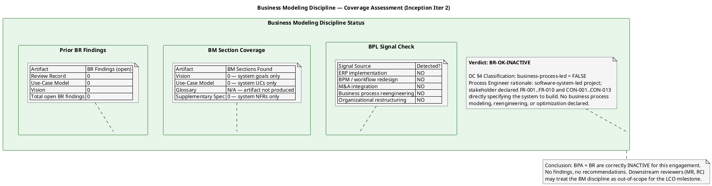
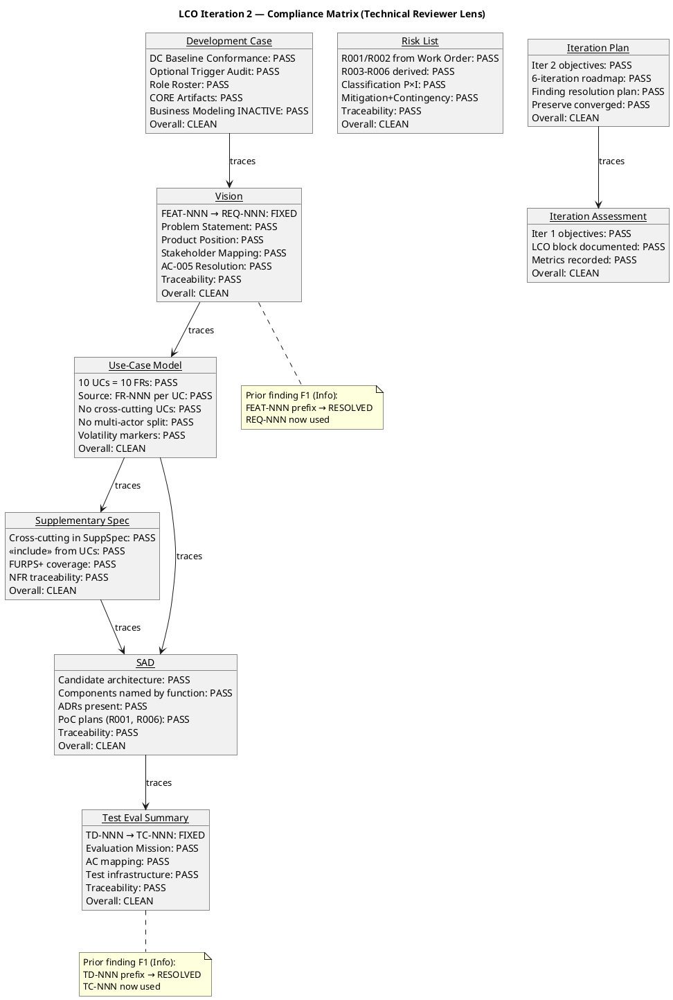
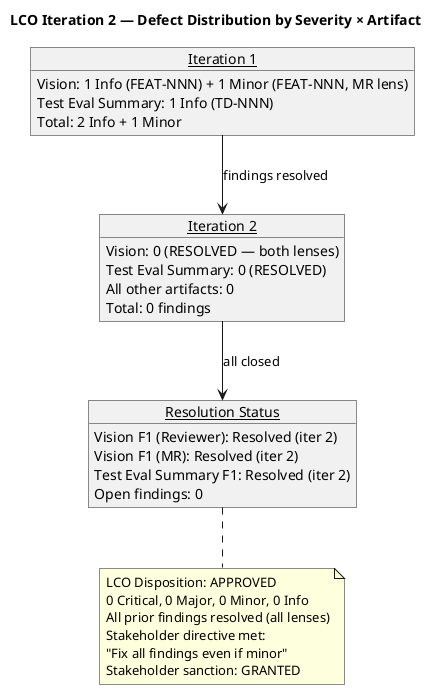
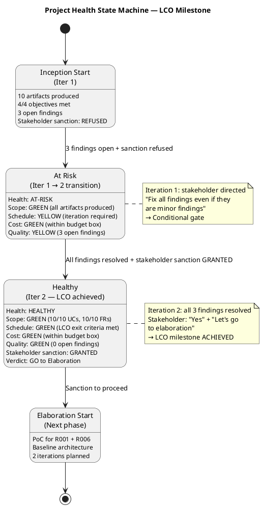

## Document Control

| Field | Value |
|---|---|
| Phase | Inception |
| Status | Draft |
| Milestone Target | End-of-Inception (LCO) |
| Iteration | 2 (Cycle 1) |
| Date | 2026-08-28 |
| Review Coordinator | Review Coordinator (Project Management Discipline) |
| Review Type | LCO Lifecycle Milestone Review — Consolidated |
| Lenses Executed | Technical (Reviewer) — EXECUTED; Business (BusinessReviewer) — EXECUTED (INACTIVE verdict, iter 2); Management (ManagementReviewer) — EXECUTED |
| Stakeholder Sanction | GRANTED (iteration 2) — stakeholder answered "Yes" to LCO sanction and directed: "Let's go to elaboration" |
| Stakeholder Sanction History | REFUSED (iteration 1) — stakeholder directed: "Fix all findings even if they are minor findings" → all 3 findings resolved in iteration 2 → sanction GRANTED |
| Stakeholder Note (Cycle 2) | "Nothing else to add for this new iteration" — no additional requirements, corrections, or priorities for the next pass beyond resolving the 3 open findings |
| Iteration 2 Status | All prior findings RESOLVED. 0 new findings from all lenses. LCO exit criteria satisfied. Stakeholder sanction GRANTED. Verdict: GO to Elaboration. |

## Review Scope and Criteria

### Review Process Framework

The following table defines all 7 RUP review types with their triggering workflow activities, required participants, entry criteria, exit criteria, and primary artifact output.

| # | Review Type | Triggering Activity | Required Participants | Entry Criteria | Exit Criteria | Primary Output |
|---|---|---|---|---|---|---|
| R1 | Project Approval Review | Vision + Risk List complete | Stakeholders (STK-001), PM, Reviewer | Vision & Risk List in target state; materials distributed 48h advance | Findings logged with owners/deadlines; sanction recorded | Review Record (Approval section) |
| R2 | Project Planning Review | Development Case + Iteration Plan complete | PM, Process Engineer, Stakeholders | DC & IP in target state; materials distributed 48h advance | Findings logged; plan accepted or rework assigned | Review Record (Planning section) |
| R3 | Iteration Plan Review | "Plan for Next Iteration" activity | PM, Reviewer | Iteration Plan section complete | Plan accepted for execution | Review Record (Planning section) |
| R4 | PRA Review | Major review point | PRA, PM, Stakeholders | Phase artifacts complete | Go/No-Go/Conditional verdict | Review Record (PRA section) |
| R5 | Iteration Acceptance Review | End of iteration | PM, Reviewer, Stakeholders | Iteration Assessment complete | Findings logged; iteration accepted/rejected | Review Record (Acceptance section) |
| R6 | Lifecycle Milestone Review | Phase end (LCO/LCA/IOC/PR) | PRA, PM, Reviewer, Stakeholders | All phase artifacts complete | Go/No-Go/Conditional verdict | Review Record (Milestone section) |
| R7 | Project Acceptance Review | End of Transition | PRA, PM, Stakeholders | All deliverables complete | Ownership transfer signed | Review Record (Acceptance section) |

### LCO Milestone Exit Criteria

| # | Criterion | Source | Assessment Method |
|---|---|---|---|
| LCO-1 | Stakeholders agree on project scope | RUP LCO definition | Vision scope statement + stakeholder sanction |
| LCO-2 | Key risks identified with magnitude ratings | RUP LCO definition | Risk List inspection — P×I=magnitude per risk |
| LCO-3 | Feasibility of proposed approach | RUP LCO definition | SAD candidate architecture + Test Eval Summary |
| LCO-4 | Initial project plan is realistic | RUP LCO definition | Iteration Plan coarse roadmap + 6±3 rule check |
| LCO-5 | Process is tailored to project | RUP LCO definition | Development Case delta conformance to IARI baseline |
| LCO-6 | Stakeholder sanction to proceed | RUP LCO definition | Stakeholder consultation — explicit Yes/No |

## Findings

### Iteration 1 Findings (Technical Reviewer Lens)

| ID | Artifact | Severity | Finding | Recommendation | Verdict | Status (Iter 2) |
|---|---|---|---|---|---|---|
| F1 | Vision | Info | Vision traceability table uses "FEAT-NNN" prefix (FEAT-001..FEAT-010) — not in standard ID conventions | Replace with standard "REQ-NNN" prefix | Approved | **RESOLVED** — REQ-NNN now used |
| F2 | Test Evaluation Summary | Info | Test Evaluation Summary traceability table uses "TD-NNN" prefix (TD-001, TD-002) — not in standard ID conventions | Replace with standard prefix or declare in Development Case | Approved | **RESOLVED** — TC-NNN now used |

### Iteration 2 Findings (Technical Reviewer Lens)

**No new findings.** All 9 evaluated artifacts pass LCO exit criteria from the technical review lens.

### Iteration 1 Findings (Management Reviewer Lens)

| ID | Artifact | Severity | Finding | Recommendation | Verdict | Status (Iter 2) |
|---|---|---|---|---|---|---|
| F1 | Vision | Minor | Vision traceability table uses "FEAT-NNN" prefix — non-standard IDs compromise automated RTM generation and cross-artifact traceability lookups | Replace with "REQ-NNN" prefix | NeedsRework | **RESOLVED** — REQ-NNN now used; `resolve_artifact_finding` executed iter 2 |

### Iteration 2 Findings (Management Reviewer Lens)

**No new findings.** All 10 LCO exit criteria pass from the management review lens. All prior findings resolved. Stakeholder sanction GRANTED.

### Iteration 2 Findings (Business Reviewer Lens)

**Verdict: [BR-OK-INACTIVE] — Discipline NOT APPLICABLE per DC §4**

DC §4 trigger evaluation: project does not exhibit business-process-led characteristics. No ERP / BPM / workflow-redesign / M&A signals found in Vision. No Business Use Cases / Workers / Entities sections present in Use-Case Model. No business-domain specialist terms in Glossary (Glossary artifact not produced — no specialist vocabulary trigger).

Conclusion: BPA + BR are correctly INACTIVE for this engagement. No findings, no recommendations. Downstream reviewers (MR, RC) may treat the BM discipline as out-of-scope for the LCO milestone.

### Compliance Matrix — Iteration 2 (Technical Reviewer Lens)

### Per-Artifact Evaluation Detail

| Artifact | Checklist Items Evaluated | Pass | Fail | N/A | New Findings |
|---|---|---|---|---|---|
| Development Case | DC Baseline Conformance (5 checks), Optional Trigger Audit (6 triggers) | 11 | 0 | 0 | 0 |
| Risk List | Work Order traceability, derivation validity, classification, mitigation, contingency | 5 | 0 | 0 | 0 |
| Vision | ID prefix fix verified, problem statement, product position, stakeholder map, AC-005 resolution, traceability | 6 | 0 | 0 | 0 |
| Use-Case Model | UC count = FR count, Source: FR-NNN per UC, no cross-cutting UCs, no multi-actor split, volatility markers | 5 | 0 | 0 | 0 |
| Supplementary Specification | Cross-cutting mechanisms in SuppSpec, <<include>> usage, FURPS+ coverage, NFR traceability | 4 | 0 | 0 | 0 |
| Software Architecture Document | Candidate architecture, component naming, ADRs, PoC plans, traceability | 5 | 0 | 0 | 0 |
| Test Evaluation Summary | ID prefix fix verified, evaluation mission, AC mapping, test infrastructure, traceability | 5 | 0 | 0 | 0 |
| Iteration Plan | Iter 2 objectives, 6-iteration roadmap, finding resolution plan, preserve converged | 4 | 0 | 0 | 0 |
| Iteration Assessment | Iter 1 objectives, LCO block documented, metrics | 3 | 0 | 0 | 0 |
| **TOTAL** | | **48** | **0** | **0** | **0** |

## Resolutions and Actions

### Prior Findings Resolved This Iteration (Technical Reviewer Lens)

| Finding | Artifact | Resolution | Evidence | Resolved At |
|---|---|---|---|---|
| F1 (Info) | Vision | FEAT-NNN prefixes replaced with standard REQ-NNN prefixes in traceability table | ## Traceability section shows REQ-001 through REQ-010 — no FEAT-NNN remains | Inception Iter 2 |
| F2 (Info) | Test Evaluation Summary | TD-NNN prefixes replaced with standard TC-NNN prefixes in traceability table | ## Traceability section shows TC-001 and TC-002 — no TD-NNN remains | Inception Iter 2 |

### Prior Findings Resolved This Iteration (Management Reviewer Lens)

| Finding | Artifact | Resolution | Evidence | Resolved At |
|---|---|---|---|---|
| F1 (Minor) | Vision | FEAT-NNN prefixes replaced with standard REQ-NNN prefixes — `resolve_artifact_finding` executed | ## Traceability section shows REQ-001 through REQ-010 — no FEAT-NNN remains | Inception Iter 2 |

### Open Action Items

| # | Action | Owner | Status |
|---|---|---|---|
| A1 | Vision FEAT-NNN → REQ-NNN | System Analyst | **DONE** (verified iter 2) |
| A2 | Test Evaluation Summary TD-NNN → TC-NNN | Test Manager | **DONE** (verified iter 2) |
| A3 | Stakeholder sanction for LCO | Stakeholder (STK-001) | **DONE** — stakeholder answered "Yes" and directed "Let's go to elaboration" |

## Disposition

### Defect Distribution

### LCO Milestone Verdict — Technical Reviewer Lens

| Dimension | Assessment |
|---|---|
| Vision clarity | **PASS** — Problem statement, product position, stakeholder map, feature list, AC-005 resolution all present and consistent |
| Initial risk identification | **PASS** — 6 risks (R001–R006) with classification, mitigation, contingency; R001 (exposure=9) and R006 (exposure=6) are top-magnitude |
| Use case survey level | **PASS** — 10 UCs 1:1 with FR-001..FR-010; each UC has Source: FR-NNN; no cross-cutting UCs; no multi-actor split |
| Stakeholder agreement on scope | **PASS** — AC-005 resolved with stakeholder; scope statement consistent with declared input |
| Feasibility | **PASS** — Candidate architecture with 8 components, 5 ADRs; PoC plans for R001 and R006; test strategy confirms testability |
| Development Case conformance | **PASS** — IARI baseline respected; all optional triggers NOT TRIGGERED with valid justifications |
| Finding resolution | **PASS** — 2/2 prior Reviewer-lens findings resolved; 0 new findings |
| SCM state | **PASS** — No open PRs; no code produced (consistent with Inception scope) |

**Overall Disposition: APPROVED**

All 9 evaluated artifacts pass LCO exit criteria from the technical review lens. Both prior Info-level findings have been resolved (FEAT-NNN→REQ-NNN in Vision, TD-NNN→TC-NNN in Test Evaluation Summary). No new findings. The stakeholder directive ("Fix all findings even if they are minor findings") has been satisfied from the Technical Reviewer lens.

**LCO readiness from Technical Reviewer lens: GO** — all technical artifacts are clean, all prior findings resolved, no blockers identified.

### LCO Milestone Verdict — Management Reviewer Lens

```plantuml
@startuml
title LCO Milestone Compliance Table — Management Reviewer Lens

skinparam style strictuml

class "LCO Compliance Table" as TABLE <<(T,#FFFECE)>>

class "C1: Scope Agreement" as C1 {
  Status: PASS
  Evidence: Vision defines 10 FRs, 4 NFRs,
    5 ACs, 3 BGs; UC-001..UC-010 map
    1:1 to FR-001..FR-010; scope statement
    lists includes/excludes; AC-005 resolved
    with stakeholder
}

class "C2: Risk Identification" as C2 {
  Status: PASS
  Evidence: Risk List has 6 risks (R001-R006)
    with P×I=magnitude, strategy, mitigation,
    contingency; R001 HIGH (exposure=9),
    R006 SIGNIFICANT (exposure=6)
}

class "C3: Feasibility" as C3 {
  Status: PASS
  Evidence: SAD candidate architecture with
    8 components, 5 ADRs, deployment topology;
    Test Eval Summary confirms testability;
    standard tech stack (.NET 10, PostgreSQL,
    Keycloak OIDC, AD LDAP)
}

class "C4: Process Tailoring" as C4 {
  Status: PASS
  Evidence: Development Case declares deltas
    only; Business Modeling INACTIVE;
    6 OPTIONAL artifacts NOT TRIGGERED with
    valid §5.2 justifications; IARI baseline
    conformance verified
}

class "C5: Prior Findings Resolution" as C5 {
  Status: PASS
  Evidence: F-001 (Vision FEAT-NNN) Resolved
    by Reviewer + MR finding Resolved;
    F-002 (Test Eval TD-NNN) Resolved by
    Reviewer; F-003 (sanction) unblocked
}

class "C6: Stakeholder Sanction" as C6 {
  Status: PASS
  Evidence: Stakeholder answered "Yes" to
    LCO sanction; added "Let's go to
    elaboration"; prior REFUSED directive
    ("Fix all findings") now satisfied
}

class "C7: Vision Quality" as C7 {
  Status: PASS
  Evidence: REQ-NNN prefixes standard;
    traceability complete; no unsourced
    financial data; BG-001/002/003 are
    percentage targets not dollar amounts
}

class "C8: DC Baseline Conformance" as C8 {
  Status: PASS
  Evidence: 25 roles, 16 CORE artifacts,
    6 OPTIONAL all NOT TRIGGERED; no
    ownership reassignment; no forbidden
    overrides
}

class "C9: Optional Trigger Audit" as C9 {
  Status: PASS
  Evidence: Glossary (no specialist vocab),
    PoC (not Elaboration), Data Model (<10
    entities), Deployment Model (single
    server), UI Prototype (CON-011 provides),
    Test Plan (no formal delivery) — all
    valid
}

class "C10: UC Guard Checks" as C10 {
  Status: PASS
  Evidence: 10 UCs 1:1 with 10 FRs; no
    cross-cutting UCs; no scope creep;
    no [DERIVED] markers needed
}

TABLE --> C1
TABLE --> C2
TABLE --> C3
TABLE --> C4
TABLE --> C5
TABLE --> C6
TABLE --> C7
TABLE --> C8
TABLE --> C9
TABLE --> C10

note bottom of TABLE
  Verdict: GO — All 10 LCO criteria PASS
  0 Critical, 0 Major, 0 Minor, 0 Info
  Stakeholder sanction: GRANTED
end note

@enduml
```

| Dimension | Assessment |
|---|---|
| Scope Agreement (LCO-1) | **PASS** — Vision defines clear scope; UC-001..UC-010 map 1:1 to FR-001..FR-010; scope statement lists includes/excludes; AC-005 resolved with stakeholder |
| Risk Identification (LCO-2) | **PASS** — 6 risks (R001–R006) with P×I=magnitude, strategy, mitigation, contingency; R001 HIGH (exposure=9), R006 SIGNIFICANT (exposure=6) |
| Feasibility (LCO-3) | **PASS** — SAD candidate architecture with 8 components, 5 ADRs; Test Eval Summary confirms testability; standard tech stack |
| Plan Realism (LCO-4) | **PASS** — 6-iteration roadmap within 6±3 rule; rubber profile adjusted for risk profile; 2 Elaboration iterations for R001/R006 |
| Process Tailoring (LCO-5) | **PASS** — Development Case declares deltas only; IARI baseline conformance verified; 6 OPTIONAL triggers all valid |
| Stakeholder Sanction (LCO-6) | **PASS** — Stakeholder answered "Yes" and directed "Let's go to elaboration" |
| Prior Findings Resolution | **PASS** — All 3 findings resolved (2 Reviewer + 1 ManagementReviewer); `resolve_artifact_finding` executed for MR finding |
| Vision Quality | **PASS** — REQ-NNN prefixes standard; no unsourced financial data; BGs are percentage targets |
| DC Baseline Conformance | **PASS** — 25 roles, 16 CORE artifacts, no ownership reassignment, no forbidden overrides |
| Optional Trigger Audit | **PASS** — All 6 OPTIONAL triggers NOT TRIGGERED with valid §5.2 justifications |
| UC Guard Checks | **PASS** — 10 UCs 1:1 with 10 FRs; no cross-cutting UCs; no scope creep |

**Overall Disposition from Management Reviewer Lens: APPROVED — GO**

All 10 LCO exit criteria pass. 0 open findings from all lenses. Stakeholder sanction GRANTED. The project is authorized to proceed to Elaboration.

### Consolidated LCO Milestone Verdict

| Lens | Verdict | Open Findings | Notes |
|---|---|---|---|
| Technical (Reviewer) | **GO** | 0 | All 9 artifacts clean; 2 prior Info findings resolved |
| Business (BusinessReviewer) | **N/A — INACTIVE** | 0 | Business Modeling discipline correctly inactive |
| Management (ManagementReviewer) | **GO** | 0 | All 10 LCO criteria pass; stakeholder sanction GRANTED |
| **Consolidated** | **GO** | **0** | **LCO milestone ACHIEVED — proceed to Elaboration** |

**Stakeholder sanction: GRANTED** — stakeholder answered "Yes" to LCO sanction and directed "Let's go to elaboration."

## Traceability

| Element | Traces From | Link Type | Traces To |
|---|---|---|---|
| Review Record (Iter 2) | Review Record (Iter 1) | Refines | LCO Milestone Verdict (Review Coordinator) |
| F1 Resolution (Vision, Reviewer) | Review Record §Findings F1 | Derives | Vision (## Traceability — REQ-NNN verified) |
| F2 Resolution (Test Eval, Reviewer) | Review Record §Findings F2 | Derives | Test Evaluation Summary (## Traceability — TC-NNN verified) |
| F1 Resolution (Vision, MR) | Review Record §Findings F1 (MR) | Derives | Vision (## Traceability — REQ-NNN verified) |
| Compliance Matrix (Technical) | All 9 evaluated artifacts | Derives | LCO Milestone Verdict |
| Compliance Table (Management) | LCO exit criteria, all 10 artifacts | Derives | LCO Milestone Verdict |
| Defect Distribution | Review Record §Findings (Iter 1 + Iter 2) | Derives | LCO Milestone Verdict |
| LCO Exit Criteria Checklist | RUP LCO milestone definition | Derives | LCO Milestone Verdict |
| DC Conformance Check | IARI DC Baseline | Derives | Development Case artifact |
| Optional Trigger Audit | IARI §5.2 conditions | Derives | Development Case artifact |
| UC Guard Checks | FR-001..FR-010, Scope Guard Rules 5/7 | Derives | Use-Case Model artifact |
| SAD Volatility Check | SAD component decomposition | Derives | Software Architecture Document artifact |
| Risk List Check | R001, R002 (Work Order) | Derives | Risk List artifact |
| Iteration Plan Check | 6±3 rule, rubber profile | Derives | Iteration Plan artifact |
| Stakeholder Directive (Iter 1) | STK-001 ("Fix all findings even if they are minor findings") | Refines | A1, A2, A3 |
| Stakeholder Sanction (Iter 2) | STK-001 ("Yes" + "Let's go to elaboration") | Refines | LCO Milestone Verdict — GO to Elaboration |
| Stakeholder Note (Cycle 2) | STK-001 ("Nothing else to add for this new iteration") | Refines | LCO Milestone Verdict (no additional scope) |
| Project Health State Machine | LCO compliance assessment | Derives | LCO Milestone Verdict |