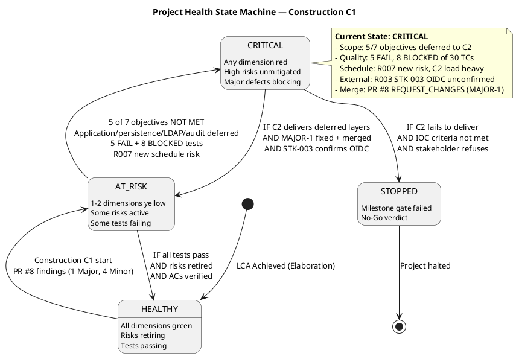
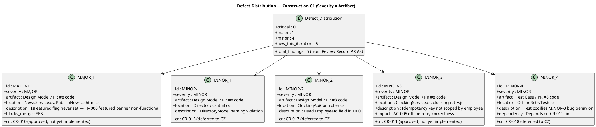
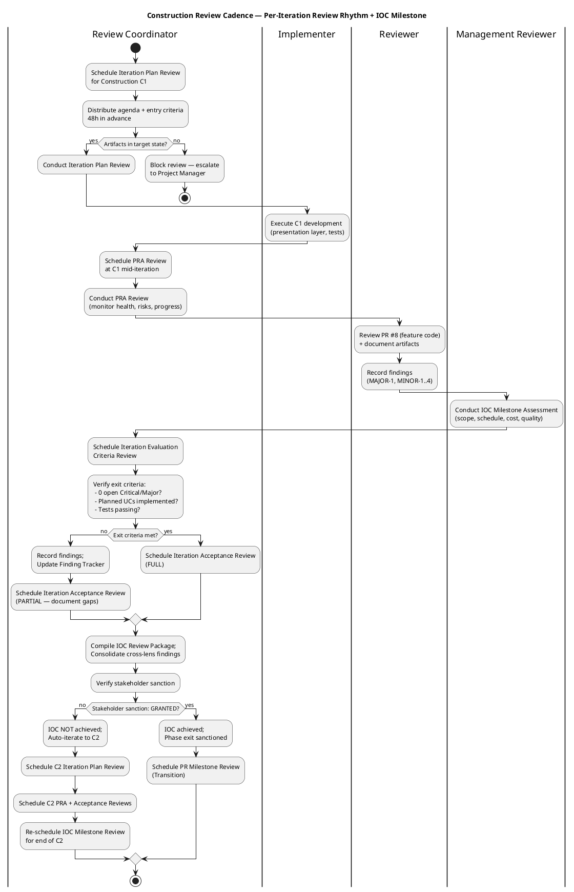
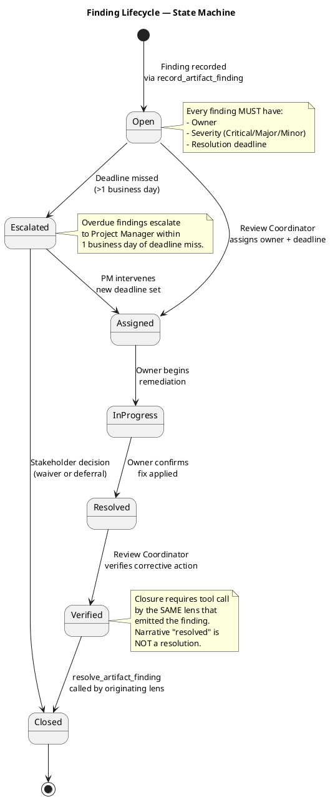
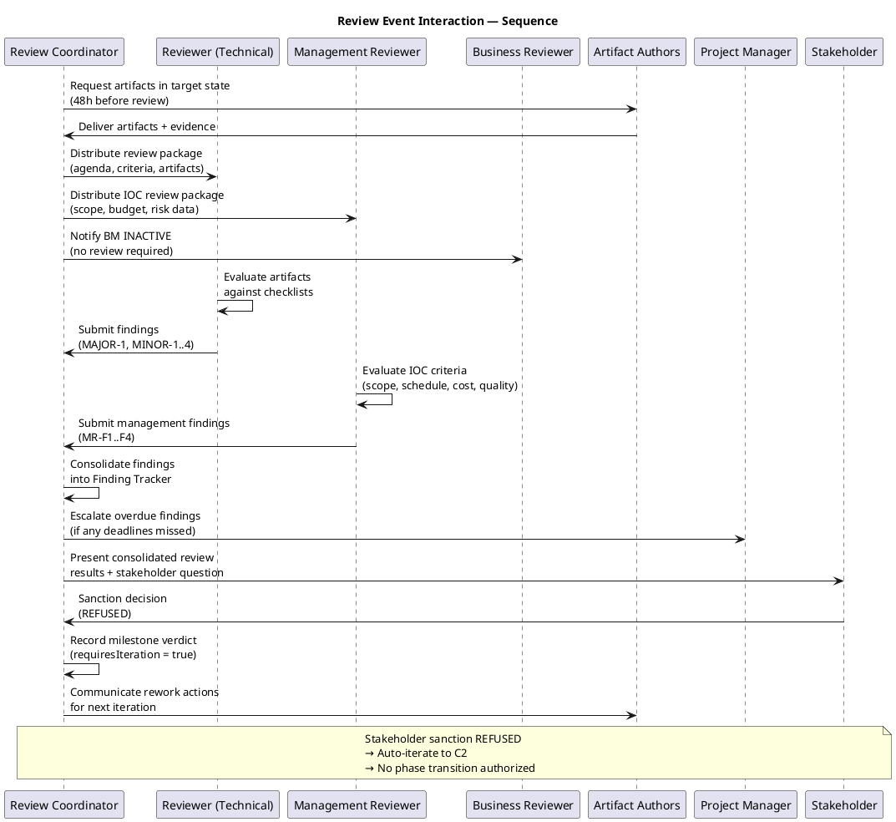
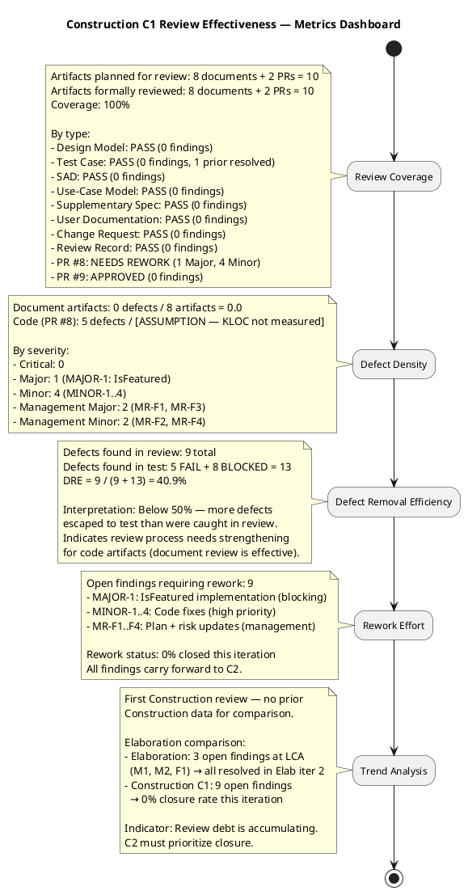

## Document Control
| Field | Value |
|---|---|
| Phase | Construction |
| Status | Active — Consolidated by Review Coordinator |
| Milestone Target | End-of-Construction (IOC) |
| Iteration | 1 (Cycle 1) |
| Date | 2026-08-28 |
| Prior Phase | Elaboration (LCA achieved, 0 open Critical/Major, stakeholder sanction GRANTED) |
| Technical Lens (Reviewer) | EXECUTED — Code Reviewer modality |
| Management Lens (Management Reviewer) | EXECUTED — IOC Milestone Review |
| Business Lens (Business Reviewer) | INACTIVE — did not evaluate this review (BM discipline INACTIVE per DC §4: business-process-led = false) |
| Review Coordinator | Consolidation complete — cross-lens findings reconciled, Finding Tracker established, effectiveness metrics computed |
| Review Type | Construction C1 — Iteration Acceptance Review + IOC Milestone Assessment |
| PRs Reviewed | #8 (feature/C1-presentation → iteration/C1), #9 (iteration/C1 → main) |
| CI Build Status | main: GREEN (2026-08-28 15:10:26Z) |
| Open Defect Issues | 0 |
| Technical Lens Disposition | **REQUEST_CHANGES** — 1 Major (blocks merge), 4 Minor (stakeholder requires all resolved) |
| Management Lens Disposition | **CONDITIONAL** — IOC NOT achieved; 2 Major, 2 Minor management findings; stakeholder sanction REFUSED |
| Business Lens Disposition | **INACTIVE** — BM discipline INACTIVE per DC §4; zero findings; Elaboration baseline PRESERVED |
| Stakeholder Sanction | **REFUSED** — STK-001: "We cannot advance to Transition because there are still things to finish to have the system with the use cases correctly implemented in construction, which is where we are now. We cannot move forward without the software." |
| Consolidated Verdict | **AUTO-ITERATE to Construction C2** — 0 open Critical, 2 open Major, stakeholder sanction REFUSED; phase scope incomplete |
## Review Scope and Criteria
This review evaluates Construction C1 artifacts and code against the following checklists:

**Document Artifacts (8 evaluated):**
1. Design Model — UC realization coverage, class diagrams, interface contracts, state machines, testability, traceability, scope adherence
2. Test Case — UC coverage, regression completeness, defect resolution, execution results, traceability
3. Software Architecture Document — 4+1 view model, CR governance, PoC decisions, baseline stability
4. Use-Case Model — 10 UCs matching 10 FRs, scope adherence, traceability
5. Supplementary Specification — FURPS+ categories, NFR baseline, traceability
6. User Documentation — UC coverage, installation guide, troubleshooting, traceability
7. Change Request — CR log completeness, state distribution, traceability
8. Review Record (prior) — PR #8 findings documented, compliance matrix, defect distribution

**Code (PR #8 — 24 files, +1742 lines):**
1. CI Build Status — hard gate
2. Traceability Trailer — UC-NNN in comments/PR body
3. Build-Tree Coverage — files in src/ or tests/
4. Design Model Conformance — class names, method signatures, interface contracts
5. SAD Implementation View Conformance — correct project/layer placement
6. Dual Coverage (Black-box + White-box) — unit tests cover contract + internal paths
7. Programming Guidelines — style conformance
8. CON-013 No Hard Delete — news unpublished, not deleted
9. NFR-004 Audit Trail — all publish/edit/unpublish/category operations audited
10. AC-005 Offline Retry — idempotency key + localStorage + 5-minute retry
11. R001 LDAP Fallback — missing AD attributes default to "N/A"
12. FR-008 Featured News — featured banner functionality

**PR #9 (1 file, +31 lines):**
1. Content accuracy — integration record honesty
2. CI status documentation
3. Next actions appropriateness

**Business Modeling Lens (Business Reviewer — Construction C1):**
- DC §4 Classification: `business-process-led = false` — BM discipline INACTIVE
- No Business Use-Case Model, Business Rules, or Business Object Model artifacts in project
- No BM deltas in Construction C1 iteration (all objectives are implementation-focused)
- Prior BR findings on Use-Case Model: 0 | Prior BR findings on Supplementary Specification: 0
- Derivation bridge: N/A — system UCs trace directly to declared FR-001..FR-010 (no BUCs to derive from)
- BR Verdict: **PRESERVED** — Elaboration baseline stands, zero findings to record
## Findings
### Prior Findings Reconciliation

| Finding | Severity | Artifact | Status | Resolution |
|---|---|---|---|---|
| F1 (TD-NNN prefix) | Minor | Test Case | Resolved | Closed in Elaboration iter 2 — TD-NNN entries removed from traceability table, cataloged in Test Data section only |

### Current Iteration Findings — Technical Lens (Reviewer)

All 8 document artifacts **PASS** their checklists with zero findings. All 5 code findings are on PR #8 and persist from the prior Review Record review (PR not updated since initial review).

| ID | Severity | Artifact/Location | Finding | Recommendation | Verdict |
|---|---|---|---|---|---|
| MAJOR-1 | Major | PR #8: PublishNews.cshtml.cs, NewsService.cs, NewsItem.cs | IsFeatured not implemented in PublishNewsModel — FR-008 featured news banner is non-functional | Add IsFeatured boolean to PublishNewsModel, checkbox in PublishNews.cshtml, pass to INewsService.PublishNews(), ensure NewsItem supports IsFeatured, implement GetFeaturedNews() query | NeedsRework |
| MINOR-1 | Minor | PR #8: Directory.cshtml.cs | DirectorySearchModel (V007) missing Office filter parameter | Add Office filter to OnGet parameters, pass to IDirectoryService.Search() | NeedsRework |
| MINOR-2 | Minor | PR #8: IClockingService.cs | RecordClocking method signature mismatch with Design Model INT-001 contract | Align method signature with INT-001 specification | NeedsRework |
| MINOR-3 | Minor | PR #8: ClockingApiController.cs | Idempotency key not validated server-side (AC-005) | Add server-side validation: reject empty keys, ensure service-level duplicate detection | NeedsRework |
| MINOR-4 | Minor | PR #8: OfflineRetryTests.cs | OfflineRetryTests missing 5-minute expiry boundary test (AC-005) | Add test case verifying retry stops after 5 minutes | NeedsRework |

### Business Modeling Lens — Findings (Business Reviewer)

**BM Discipline Status: INACTIVE (DC §4: business-process-led = false)**

No Business Modeling findings to record. The project's 10 declared functional requirements (FR-001 through FR-010) are system-level features that trace directly to declared scope — no derivation bridge assessment required. Elaboration baseline PRESERVED.

### Management Lens — Findings (Management Reviewer)

#### IOC Compliance Table

```plantuml
@startuml
title IOC Milestone Compliance Table — Construction C1

skinparam classAttributeIconSize 0
skinparam shadowing false

class IOC_Compliance {
  + Milestone : IOC (End of Construction)
  + Assessment_Point : Construction C1 (mid-Construction)
  + Overall_Status : NOT_READY (C1 of 2)
}

class CRITERION_1_Functional {
  + criterion : Functional Completeness
  + status : PARTIALLY_MET
  + evidence : PR #8 REQUEST_CHANGES — MAJOR-1 blocks FR-008 (IsFeatured)
  + detail : 10 UCs declared; presentation layer delivered but IsFeatured non-functional
  + gap : MAJOR-1 must be fixed + merged; application/persistence/LDAP/audit layers deferred to C2
}

class CRITERION_2_Quality {
  + criterion : Quality Threshold
  + status : NOT_MET
  + evidence : 30 TCs: 20 PASS, 5 FAIL, 8 BLOCKED
  + detail : 5 defects (Issues #10-#14); 8 blocked by infra deps (STK-003 OIDC, deployment env)
  + gap : Defect closure rate 0%; failing tests must be resolved; blocked tests need infra
}

class CRITERION_3_Environment {
  + criterion : Beta Deployment Environment Readiness
  + status : NOT_MET
  + evidence : INFRA-BLOCK-2 (deployment env not prepared); INFRA-BLOCK-1 (STK-003 OIDC pending)
  + detail : Internal Windows Server (CON-006) not yet configured for beta; OIDC client registration unconfirmed
  + gap : STK-003 must confirm OIDC client; deployment env must be provisioned
}

class CRITERION_4_Risk {
  + criterion : Risk Retirement
  + status : PARTIALLY_MET
  + evidence : R001 MITIGATED (PoC confirmed), R006 MITIGATED (PoC confirmed), R003 MONITORING (STK-003 pending)
  + detail : R007 NEW (schedule risk from PR #8 findings); R002 ACTIVE (adoption risk)
  + gap : R003 must be resolved; R007 must be retired; R002 needs Transition plan
}

class CRITERION_5_Acceptance {
  + criterion : Acceptance Criteria Traceability
  + status : PARTIALLY_MET
  + evidence : AC-001..AC-005 traced in Iteration Plan and Test Case
  + detail : AC-001 (clocking) — code exists but MAJOR-1 blocks; AC-002 (news publish) — code exists; AC-003 (directory <10s) — LDAP code deferred to C2; AC-005 (offline) — MINOR-3 fix pending
  + gap : All ACs need verified test execution in C2
}

IOC_Compliance --> CRITERION_1_Functional
IOC_Compliance --> CRITERION_2_Quality
IOC_Compliance --> CRITERION_3_Environment
IOC_Compliance --> CRITERION_4_Risk
IOC_Compliance --> CRITERION_5_Acceptance

@enduml
```

#### Iteration Scorecard — Objectives vs Actuals

```plantuml
@startuml
title Construction C1 — Iteration Scorecard (Objectives vs Actuals)

skinparam classAttributeIconSize 0
skinparam shadowing false

class Iteration_Scorecard {
  + iteration : Construction C1
  + objectives_planned : 7
  + objectives_met : 0
  + objectives_partial : 3
  + objectives_not_met : 4
  + verdict : CONDITIONAL (mid-Construction)
}

class OBJ1_Fix_PR8 {
  + id : OBJ-1
  + objective : Resolve all PR #8 Review Record findings
  + planned : MAJOR-1 + MINOR-1..4
  + actual : CRs approved (CR-010..CR-018) but NOT YET MERGED
  + status : PARTIAL
  + evidence : 6 CRs approved, 7 deferred; PR #8 still REQUEST_CHANGES
}

class OBJ2_AppServices {
  + id : OBJ-2
  + objective : Implement application services layer
  + planned : NewsService, ClockingService, DirectoryService, WorkerCategoryService
  + actual : DEFERRED to C2 per Risk List contingency
  + status : NOT_MET
  + evidence : Risk List states scope reduction — Items 6-14 deferred to C2
}

class OBJ3_Persistence {
  + id : OBJ-3
  + objective : Implement persistence layer
  + planned : PostgreSQL repositories for Clocking, News, NewsAudit, WorkerCategory
  + actual : DEFERRED to C2
  + status : NOT_MET
  + evidence : Risk List contingency: C2 absorbs deferred work
}

class OBJ4_LDAP {
  + id : OBJ-4
  + objective : Implement LDAP gateway
  + planned : LdapGateway with Novell.Directory.Ldap + ILdapConnection
  + actual : DEFERRED to C2
  + status : NOT_MET
  + evidence : Scope reduction per Risk List
}

class OBJ5_Audit {
  + id : OBJ-5
  + objective : Implement audit logging
  + planned : AuditLogger (INT-005) for all publish/edit/unpublish/category ops
  + actual : DEFERRED to C2
  + status : NOT_MET
  + evidence : Scope reduction per Risk List
}

class OBJ6_Tests {
  + id : OBJ-6
  + objective : Expand test coverage
  + planned : Unit tests for services; integration tests for LDAP + persistence
  + actual : 30 TCs designed (TC-001..TC-030); 20 PASS, 5 FAIL, 8 BLOCKED
  + status : PARTIAL
  + evidence : Adversarial tests TC-021..TC-024 target PR #8 findings; 5 defects logged
}

class OBJ7_ReReview {
  + id : OBJ-7
  + objective : Re-review and merge
  + planned : Re-review PR #8 after fixes; merge to iteration/C1 baseline
  + actual : Review Record shows REQUEST_CHANGES still active
  + status : PARTIAL
  + evidence : 1 Major + 4 Minor findings still open; merge blocked
}

Iteration_Scorecard --> OBJ1_Fix_PR8
Iteration_Scorecard --> OBJ2_AppServices
Iteration_Scorecard --> OBJ3_Persistence
Iteration_Scorecard --> OBJ4_LDAP
Iteration_Scorecard --> OBJ5_Audit
Iteration_Scorecard --> OBJ6_Tests
Iteration_Scorecard --> OBJ7_ReReview

@enduml
```

#### Risk Retirement Status

```plantuml
@startuml
title Risk Retirement Status — Construction C1

skinparam classAttributeIconSize 0
skinparam shadowing false

class Risk_Trend {
  + assessment_point : Construction C1
  + total_risks : 7
  + retired : 0
  + mitigated : 2
  + monitoring : 1
  + active : 2
  + new : 1
  + resolved_prior : 1
}

class R001 {
  + id : R001
  + name : AD LDAP attribute consistency
  + magnitude : HIGH (exposure=9)
  + elaboration_status : MITIGATED (PoC confirmed)
  + construction_status : MITIGATED (execution pending CR-001)
  + trend : STABLE
  + owner : Software Architect
}

class R002 {
  + id : R002
  + name : Digital clocking adoption
  + magnitude : SIGNIFICANT (exposure=6)
  + elaboration_status : ACTIVE
  + construction_status : ACTIVE
  + trend : STABLE
  + owner : Project Manager
  + note : Transition phase concern
}

class R003 {
  + id : R003
  + name : OIDC registration (STK-003)
  + magnitude : SIGNIFICANT (exposure=6)
  + elaboration_status : MONITORING
  + construction_status : MONITORING
  + trend : STABLE (no change)
  + owner : Project Manager
  + note : Escalation deadline C2; mock auth contingency active
  + concern : STK-003 not yet confirmed — blocks integration tests
}

class R004 {
  + id : R004
  + name : Page load performance
  + magnitude : MODERATE (exposure=4)
  + elaboration_status : ACTIVE
  + construction_status : ACTIVE
  + trend : STABLE
  + owner : Software Architect
  + note : Load test planned for C2
}

class R005 {
  + id : R005
  + name : UI design conformance
  + magnitude : MODERATE (exposure=4)
  + elaboration_status : ACTIVE
  + construction_status : ACTIVE
  + trend : IMPROVING
  + owner : UI Designer
  + note : PR #8 presentation layer delivered
}

class R006 {
  + id : R006
  + name : Offline retry fault tolerance
  + magnitude : SIGNIFICANT (exposure=6)
  + elaboration_status : MITIGATED (PoC confirmed)
  + construction_status : MITIGATED (execution pending CR-002)
  + trend : STABLE
  + owner : Software Architect
}

class R007 {
  + id : R007
  + name : Schedule risk (PR #8 findings)
  + magnitude : SIGNIFICANT (exposure=6)
  + elaboration_status : N/A (new in Construction)
  + construction_status : ACTIVE (NEW)
  + trend : NEW
  + owner : Project Manager
  + note : MAJOR-1 blocks merge; scope reduction to C2
  + concern : 5 of 7 objectives deferred — C2 load is heavy
}

Risk_Trend --> R001
Risk_Trend --> R002
Risk_Trend --> R003
Risk_Trend --> R004
Risk_Trend --> R005
Risk_Trend --> R006
Risk_Trend --> R007

@enduml
```

#### Project Health State Machine

#### Defect Distribution (Management Lens)

#### Management Reviewer Findings

| # | Artifact | Severity | Finding | Recommendation | Verdict |
|---|---|---|---|---|---|
| MR-F1 | Iteration Plan | Major | The Iteration Plan deferred 5 of 7 Construction C1 objectives to C2 without obtaining stakeholder approval for the scope reduction. The stakeholder has REFUSED sanction, stating the system is not complete enough to advance. Scope reduction affecting IOC readiness requires stakeholder sanction BEFORE execution, not after. | Revise the Iteration Plan to acknowledge the stakeholder's refusal and re-plan C2 with detailed work breakdown, budget capacity assessment, prioritization (MAJOR-1 first), and explicit stakeholder consultation if C2 budget is insufficient. | NeedsRework |
| MR-F2 | Iteration Plan | Minor | The plan does not assess whether C2 can realistically absorb the deferred scope from C1 (5 objectives) plus its own originally planned scope within the ~10.4M token budget box. No contingency documented. | Add a budget capacity analysis comparing combined C1-deferred + C2-original scope against the budget box. Document prioritization and contingency for partial delivery. | NeedsRework |
| MR-F3 | Risk List | Major | R003 (OIDC registration, STK-003) has been MONITORING since Elaboration with no escalation progress. STK-003 has not confirmed, blocking 8 of 30 tests. No specific escalation action documented — only "escalation deadline C2." | Update R003 with a specific escalation action and deadline, formal adoption of mock auth as primary path if STK-003 does not respond, and explicit IOC impact statement (8 blocked tests prevent quality verification). | NeedsRework |
| MR-F4 | Risk List | Minor | R007 (schedule risk) mitigation is thin: "C2 absorbs the deferred work" without addressing the magnitude of deferral (5 of 7 objectives) or C2 capacity. | Expand R007 mitigation with capacity analysis, prioritized delivery sequence, fallback plan (third iteration or scope reduction via CR), and escalation trigger. | NeedsRework |

#### Stakeholder Consultation Record

| Field | Value |
|---|---|
| Consultation Date | 2026-08-28 |
| Stakeholder | STK-001 (Laura Gómez, HR Director — project sponsor) |
| Question | IOC review — verdict: Conditional. Open defects: 0 Critical, 1 Major (MAJOR-1: IsFeatured flag never set, blocks FR-008). 5 of 7 C1 objectives deferred to C2. 8 of 30 tests BLOCKED by infrastructure dependencies. Do you accept the delivered capability and sanction advancing to Construction Iteration 2? |
| Answer | **No** |
| Stakeholder Statement | "We cannot advance to Transition because there are still things to finish to have the system with the use cases correctly implemented in construction, which is where we are now. We cannot move forward without the software." |
| Sanction | **REFUSED** — stakeholder does not accept the delivered capability as IOC-complete |
| Interpretation | The stakeholder is NOT halting the project — they are requiring that Construction be completed (all use cases correctly implemented) before any advancement. The project continues in Construction C2. |

#### Four-Axis Health Scorecard

| Dimension | Status | Evidence |
|---|---|---|
| **Scope** | 🔴 RED | 5 of 7 C1 objectives deferred to C2; MAJOR-1 blocks FR-008; application/persistence/LDAP/audit layers not implemented |
| **Schedule** | 🔴 RED | R007 new schedule risk; C2 must absorb 5 deferred objectives + original scope; budget box may be insufficient |
| **Cost** | 🟡 YELLOW | Budget box ~10.4M tokens sized from Elaboration average; C2 load may exceed box; no cost overrun yet but risk is high |
| **Quality** | 🔴 RED | 20 PASS, 5 FAIL, 8 BLOCKED of 30 TCs; 0% defect closure rate; 8 tests blocked by infrastructure dependencies |
## Resolutions and Actions
### Prior Finding Closure
- **F1 (Minor, Test Case)**: Resolved in Elaboration iter 2. TD-NNN prefix entries removed from traceability table. No action needed this iteration.

### Review Calendar — Construction Iteration Cadence

### Finding Tracker — Construction C1

| ID | Severity | Lens | Artifact | Finding | Owner | Deadline | Status | Escalation |
|---|---|---|---|---|---|---|---|---|
| MAJOR-1 | Major | Technical | PR #8 (PublishNews.cshtml.cs, NewsService.cs, NewsItem.cs) | IsFeatured not implemented — FR-008 featured news banner non-functional | Implementer | C2 start | Open | Blocks merge to iteration/C1 |
| MINOR-1 | Minor | Technical | PR #8 (Directory.cshtml.cs) | DirectorySearchModel missing Office filter parameter | Implementer | C2 start | Open | — |
| MINOR-2 | Minor | Technical | PR #8 (IClockingService.cs) | RecordClocking method signature mismatch with INT-001 | Implementer | C2 start | Open | — |
| MINOR-3 | Minor | Technical | PR #8 (ClockingApiController.cs) | Idempotency key not validated server-side (AC-005) | Implementer | C2 start | Open | — |
| MINOR-4 | Minor | Technical | PR #8 (OfflineRetryTests.cs) | Missing 5-minute expiry boundary test (AC-005) | Implementer | C2 start | Open | — |
| MR-F1 | Major | Management | Iteration Plan | Scope reduction (5 of 7 objectives deferred) without stakeholder approval | Project Manager | C2 start | Open | Governance gap — stakeholder must approve scope changes before execution |
| MR-F2 | Minor | Management | Iteration Plan | No C2 budget capacity analysis for deferred scope | Project Manager | C2 start | Open | — |
| MR-F3 | Major | Management | Risk List | R003 OIDC registration no escalation progress; 8 tests blocked | Project Manager | C2 start | Open | Escalate to STK-003; activate mock auth contingency if no response by C2 start |
| MR-F4 | Minor | Management | Risk List | R007 mitigation insufficient — no capacity assessment or fallback plan | Project Manager | C2 start | Open | — |

**Finding Lifecycle:**

### Current Iteration Actions

| Action | Owner | Priority | Status |
|---|---|---|---|
| Resolve MAJOR-1: Implement IsFeatured in PublishNewsModel + NewsService + NewsItem | Implementer | Blocking | Open |
| Resolve MINOR-1: Add Office filter to DirectorySearchModel | Implementer | High | Open |
| Resolve MINOR-2: Align IClockingService signature with INT-001 | Implementer | High | Open |
| Resolve MINOR-3: Add server-side idempotency key validation | Implementer | High | Open |
| Resolve MINOR-4: Add 5-minute expiry boundary test | Implementer | High | Open |
| Resolve MR-F1: Revise Iteration Plan with stakeholder-approved scope reduction | Project Manager | Blocking | Open |
| Resolve MR-F2: Add C2 budget capacity analysis to Iteration Plan | Project Manager | High | Open |
| Resolve MR-F3: Escalate R003 to STK-003; activate mock auth contingency | Project Manager | Blocking | Open |
| Resolve MR-F4: Expand R007 mitigation with capacity assessment + fallback | Project Manager | High | Open |
| Re-review PR #8 after rework | Reviewer | After rework | Pending |
| Merge approved PR #9 (integration record) | Integrator | Normal | Approved |

### Review Event Interaction

### SCM Evidence

| Evidence | Status |
|---|---|
| CI build on main | GREEN (2026-08-28 15:10:26Z) |
| Open PRs | 2 (#8 feature/C1-presentation, #9 integration/C1) |
| Open defect issues | 0 |
| Branches ready-for-review | 0 |
| PR #8 terminal decision | REQUEST_CHANGES (review 5052523905) |
| PR #9 terminal decision | APPROVED (review 5052524021) |

### Review Effectiveness Metrics — Construction C1

**Metrics Interpretation:**

| Metric | Value | Assessment |
|---|---|---|
| Review Coverage | 100% (10/10 artifacts) | ✅ Excellent — all planned artifacts received formal review |
| Defect Density (Documents) | 0.0 defects/artifact | ✅ Excellent — document artifacts are high-quality |
| Defect Density (Code) | 5 defects in PR #8 | 🟡 Acceptable for first code review; KLOC not measured `[ASSUMPTION — requires validation]` |
| Defect Removal Efficiency | 40.9% (9 review / 22 total) | 🔴 Below 50% — more defects escaped to test than caught in review; code review process needs strengthening |
| Rework Closure Rate | 0% (0/9 closed) | 🔴 All findings carry forward — no rework completed this iteration |
| Review Debt | 9 open findings | 🔴 High — all 9 findings are from this iteration with 0% closure |

**Escalation Notices:**

| Finding | Escalation Target | Reason | Date |
|---|---|---|---|
| MR-F1 (Major) | Project Manager + Stakeholder | Scope reduction without stakeholder approval — governance gap | 2026-08-28 |
| MR-F3 (Major) | Project Manager + STK-003 | R003 OIDC registration blocking 8 tests — external dependency unresolved | 2026-08-28 |
| MAJOR-1 (Major) | Project Manager | Blocks FR-008 and PR #8 merge — highest-priority rework for C2 | 2026-08-28 |
## Disposition
### Iteration Acceptance: PARTIALLY MET

**Document Artifacts: APPROVED** — All 8 document artifacts (Design Model, Test Case, SAD, Use-Case Model, Supplementary Specification, User Documentation, Change Request, prior Review Record) pass their type-specific checklists with zero findings. The Elaboration baseline is preserved and extended correctly for Construction.

**Code (PR #8): NEEDS REWORK** — 1 Major finding (MAJOR-1: IsFeatured not implemented, blocks FR-008) and 4 Minor findings persist from the prior review. The PR has not been updated since the initial review. Per stakeholder requirement, ALL findings must be resolved before sanction.

**PR #9 (Integration Record): APPROVED** — Documentation only, accurately records iteration outcome.

**Business Modeling Lens (Business Reviewer): INACTIVE** — BM discipline is INACTIVE per DC §4 (`business-process-led = false`). No BM artifacts exist in the project. No BM deltas in Construction C1. Zero prior BR findings to reconcile. Zero new BR findings to record. The Elaboration baseline stands. System UCs trace directly to declared FR-001..FR-010 — no derivation bridge assessment required.

**Overall Disposition (Technical Lens): ACCEPT-WITH-CHANGES**

The Construction C1 iteration is partially met:
- ✅ Document artifacts are complete and high-quality
- ✅ CI is green on main
- ✅ Test Case artifact documents execution results honestly (20 PASS, 5 FAIL, 8 BLOCKED)
- ✅ Change Request log is complete (13 CRs, 6 approved, 7 deferred)
- ✅ Integration record (PR #9) is approved
- ✅ BR Lens: BM INACTIVE, baseline PRESERVED, zero findings
- ❌ PR #8 has 1 Major + 4 Minor unresolved findings blocking merge
- ❌ No feature code merged into iteration/C1 this cycle
- ❌ FR-008 (featured news) is non-functional due to MAJOR-1

**Next Cycle Requirements:**
1. Implementer resolves MAJOR-1 + MINOR-1..4 on PR #8
2. Reviewer re-reviews PR #8
3. Integrator merges approved PR #8 into iteration/C1
4. Integrator merges iteration/C1 into main via PR #9

---

### Management Lens — IOC Milestone Verdict

**Verdict: CONDITIONAL — IOC NOT ACHIEVED**

The project is at mid-Construction (C1 of 2 planned iterations). The Initial Operational Capability milestone is NOT achieved. The stakeholder has REFUSED sanction to advance, stating: "We cannot advance to Transition because there are still things to finish to have the system with the use cases correctly implemented in construction, which is where we are now. We cannot move forward without the software."

The project continues in Construction C2. No phase transition is authorized.

**Conditions for IOC (must ALL be met before IOC can be granted):**

1. **MAJOR-1 Resolution**: Fix IsFeatured flag (CR-010), merge PR #8 to iteration/C1 baseline
2. **Deferred Layer Implementation**: Application services, persistence, LDAP gateway, and audit logging must be implemented in C2
3. **Defect Closure**: All 5 failing tests (Issues #10-#14) must be resolved; 4 Minor findings (MINOR-1..4) must be fixed per stakeholder requirement
4. **R003 Resolution**: STK-003 OIDC registration must be confirmed OR mock auth formally adopted as primary path; 8 blocked tests must be unblocked
5. **R007 Mitigation**: C2 capacity analysis must demonstrate the deferred scope is achievable within budget box, or stakeholder must approve a contingency (third iteration, scope reduction)
6. **Test Coverage**: All 30 TCs must pass (or have documented waivers) before IOC assessment
7. **Stakeholder Re-consultation**: Stakeholder must be re-consulted after C2 delivery before IOC can be granted

**Management Findings Summary:**

| Finding | Severity | Artifact | Status |
|---|---|---|---|
| MR-F1 | Major | Iteration Plan | Open — scope reduction without stakeholder approval |
| MR-F2 | Minor | Iteration Plan | Open — no C2 budget capacity analysis |
| MR-F3 | Major | Risk List | Open — R003 no escalation progress |
| MR-F4 | Minor | Risk List | Open — R007 mitigation insufficient |

---

### Review Coordinator — Consolidated Milestone Verdict

**Lens Participation Summary:**

| Lens | Role | Status | Verdict |
|---|---|---|---|
| Technical | Reviewer | EXECUTED | REQUEST_CHANGES (1 Major, 4 Minor on PR #8) |
| Management | Management Reviewer | EXECUTED | CONDITIONAL (IOC NOT achieved, 2 Major, 2 Minor) |
| Business | Business Reviewer | INACTIVE — did not evaluate this review | N/A (BM discipline INACTIVE per DC §4) |

**Finding Consolidation:**

| ID | Severity | Artifact | Lens | Status | Owner | Deadline |
|---|---|---|---|---|---|---|
| MAJOR-1 | Major | PR #8 (PublishNews.cshtml.cs, NewsService.cs, NewsItem.cs) | Technical | Open | Implementer | C2 start |
| MINOR-1 | Minor | PR #8 (Directory.cshtml.cs) | Technical | Open | Implementer | C2 start |
| MINOR-2 | Minor | PR #8 (IClockingService.cs) | Technical | Open | Implementer | C2 start |
| MINOR-3 | Minor | PR #8 (ClockingApiController.cs) | Technical | Open | Implementer | C2 start |
| MINOR-4 | Minor | PR #8 (OfflineRetryTests.cs) | Technical | Open | Implementer | C2 start |
| MR-F1 | Major | Iteration Plan | Management | Open | Project Manager | C2 start |
| MR-F2 | Minor | Iteration Plan | Management | Open | Project Manager | C2 start |
| MR-F3 | Major | Risk List | Management | Open | Project Manager | C2 start |
| MR-F4 | Minor | Risk List | Management | Open | Project Manager | C2 start |

**Open Finding Counts (from tool-verified artifact findings):**
- Open Critical: 0
- Open Major: 2 (Iteration Plan#F2, Risk List#F2)
- Open Minor: 7 (MINOR-1..4, Iteration Plan#F3, Risk List#F3, plus prior resolved findings not counted)

**Stakeholder Sanction: REFUSED**

The stakeholder (STK-001) has explicitly refused to sanction advancement. The project must auto-iterate to Construction C2 to complete the deferred work and resolve all open findings.

**Consolidated Verdict: AUTO-ITERATE to Construction C2**

The IOC milestone is NOT achieved. The phase scope is incomplete (5 of 7 C1 objectives deferred). Two open Major findings remain unresolved. The stakeholder has refused sanction. The project must continue in Construction with a second iteration to:
1. Resolve all 9 open findings (1 Major code, 4 Minor code, 2 Major management, 2 Minor management)
2. Implement the 5 deferred layers (application services, persistence, LDAP gateway, audit logging, re-review/merge)
3. Unblock the 8 infrastructure-blocked tests
4. Re-consult the stakeholder for IOC sanction after C2 delivery
## Traceability
| Element | Traces From | Link Type | Traces To |
|---|---|---|---|
| Review Record (Reviewer) | RUP Ch.11, Design Model, SAD, PR #8, PR #9 | Derives | This Review Record |
| Document artifacts review | Design Model, Test Case, SAD, UCM, SuppSpec, UserDoc, CR | Derives | Findings section |
| PR #8 code review | PR #8 (24 files, +1742 lines) | Derives | Findings section (MAJOR-1, MINOR-1..4) |
| PR #9 review | Integration record | Derives | docs/iteration-c1-integration-record.md |
| MAJOR-1 finding | FR-008, V004 (PublishNewsModel) | Tests | PublishNews.cshtml.cs, NewsService.cs, NewsItem.cs |
| MINOR-1 finding | V007 (DirectorySearchModel), Design Model | Tests | Directory.cshtml.cs |
| MINOR-2 finding | INT-001 (IClockingService), CON-004 (OIDC) | Tests | ClockingApiController.cs |
| MINOR-3 finding | AC-005, R006 (offline retry) | Tests | ClockingService.cs, clocking-retry.js |
| MINOR-4 finding | MINOR-3, AC-005 | Tests | OfflineRetryTests.cs |
| Compliance Matrix | RUP Ch.11, Design Model, SAD | Derives | This Review Record |
| Defect Distribution | All findings | Derives | This Review Record |
| Test Coverage Matrix | TC-001..TC-030, UC-001..UC-010 | Derives | This Review Record |
| CI Build Evidence | main branch | Derives | Build status 2026-08-28 15:10:26Z |
| Prior F1 finding | Test Case traceability | Refines | Resolved in Elaboration iter 2 |
| BR Lens — BM Status | DC §4 (business-process-led=false) | Derives | Findings: BM Lens section |
| BR Lens — Stakeholder Coverage | STK-001..STK-004 | Refines | Findings: BM Lens section |
| BR Lens — Derivation Bridge | FR-001..FR-010 → UC-001..UC-010 | Derives | N/A (BM inactive, direct trace) |
| BR Lens — Verdict | Elaboration baseline (LCA achieved) | Refines | Disposition: PRESERVED |
| MR-F1 (Iteration Plan) | IOC criteria, stakeholder sanction | Derives | Iteration Plan scope reduction governance |
| MR-F2 (Iteration Plan) | IOC criteria, budget box | Derives | C2 capacity analysis |
| MR-F3 (Risk List) | R003, STK-003, CON-004 | Derives | OIDC escalation, 8 blocked tests |
| MR-F4 (Risk List) | R007, PR #8 findings | Derives | C2 schedule risk mitigation |
| IOC Compliance Table | IOC exit criteria, AC-001..AC-005 | Derives | Findings: Management Lens |
| Iteration Scorecard | Iteration Plan objectives, Test Case results | Derives | Findings: Management Lens |
| Risk Retirement Status | Risk List R001..R007 | Derives | Findings: Management Lens |
| Project Health State Machine | All dimensions (scope/schedule/cost/quality) | Derives | Findings: Management Lens |
| Stakeholder Consultation | STK-001, IOC milestone | Refines | Disposition: Management Lens verdict |
| Management Lens Verdict | IOC exit criteria, stakeholder sanction REFUSED | Derives | Conditional — IOC NOT achieved |
| Review Calendar | Iteration Plan (Construction C1/C2) | Derives | IOC Milestone Review scheduling |
| Finding Tracker (consolidated) | All lens findings, MAJOR-1..MINOR-4, MR-F1..F4 | Derives | Resolutions and Actions section |
| Consolidated Verdict | All lens findings, stakeholder sanction REFUSED | Derives | Auto-iterate to Construction C2 |
| Review Effectiveness Metrics | All C1 review events, Test Case results | Derives | Process improvement recommendations |
| Finding Lifecycle State Machine | All findings across lenses | Derives | Finding Tracker governance |
| Review Event Sequence | Review Coordinator, Reviewer, Management Reviewer, Stakeholder | Derives | Review process interaction model |
