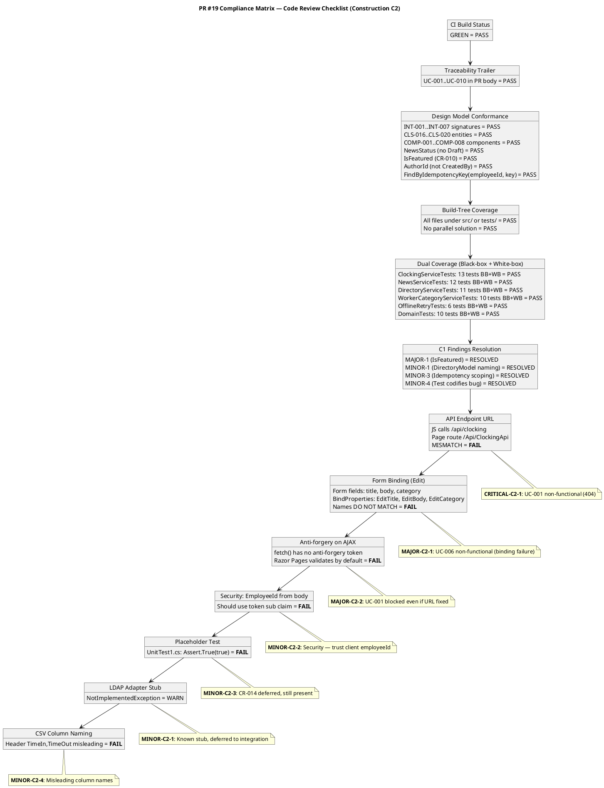
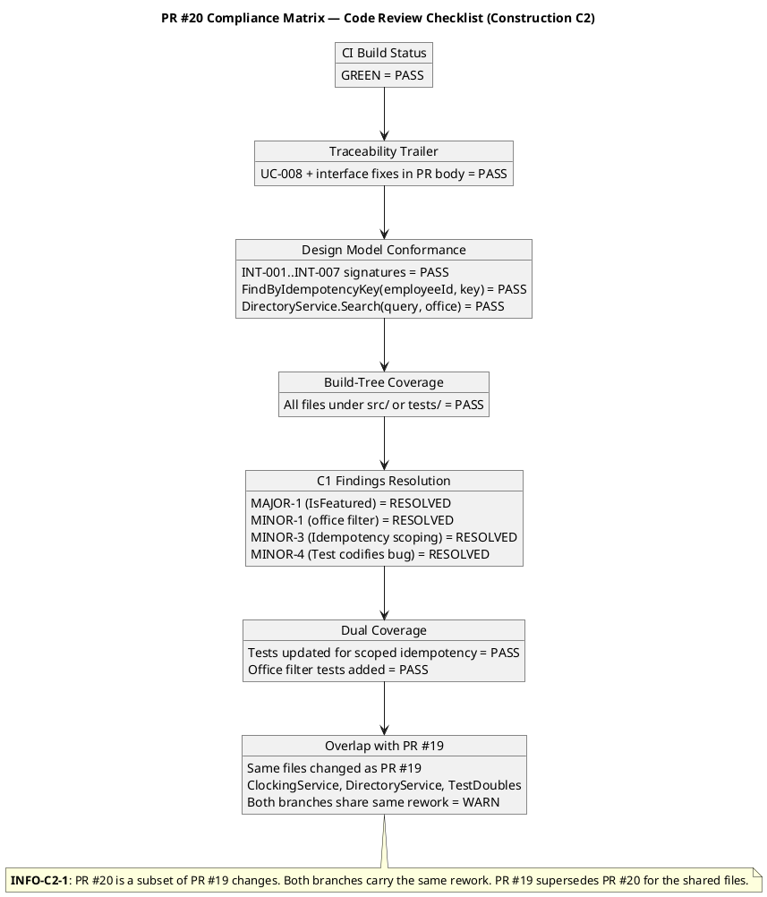
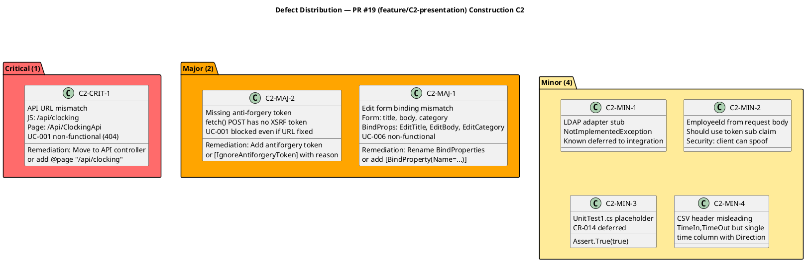
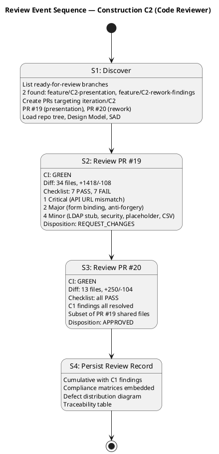
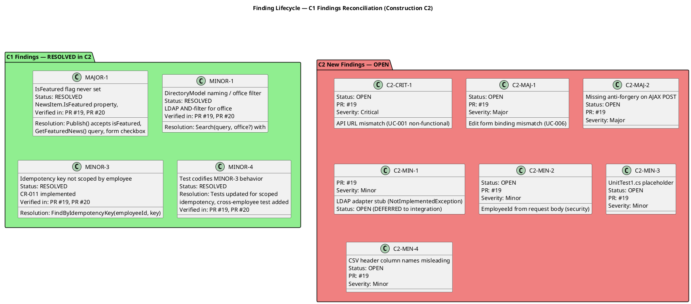

## Document Control
| Field | Value |
|---|---|
| Phase | Construction |
| Status | Active — Code Reviewer (C2 Cycle 1) |
| Milestone Target | End-of-Construction (IOC) |
| Iteration | 2 (Cycle 1) |
| Date | 2026-08-28 |
| Prior Phase | Construction C1 (REQUEST_CHANGES — 1 Major, 4 Minor; IOC NOT achieved; stakeholder sanction REFUSED) |
| Technical Lens (Reviewer) | EXECUTED — Code Reviewer modality, Construction C2 |
| Review Type | Construction C2 — PR Approval Loop (per RUP Ch.11) |
| PRs Reviewed | #19 (feature/C2-presentation → iteration/C2), #20 (feature/C2-rework-findings → iteration/C2) |
| CI Build Status | feature/C2-presentation: GREEN (2026-08-28 16:09:32Z); feature/C2-rework-findings: GREEN (2026-08-28 16:02:37Z) |
| Open Defect Issues | 0 |
| PR #19 Disposition | **REQUEST_CHANGES** — 1 Critical, 2 Major, 4 Minor |
| PR #20 Disposition | **APPROVED** — 0 Critical, 0 Major; C1 findings resolved |
| C1 Findings Reconciliation | MAJOR-1: RESOLVED; MINOR-1: RESOLVED; MINOR-3: RESOLVED; MINOR-4: RESOLVED |
| Consolidated Verdict | PR #20 approved for merge; PR #19 requires rework — 1 Critical + 2 Major block merge |

## Review Scope and Criteria

This review evaluates Construction C2 pull requests against the following checklist:

**Code Review Checklist (per §1.1):**
1. CI Build Status (hard gate)
2. Programming Guidelines Conformance
3. Dual Coverage (black-box + white-box tests)
4. Design Model Conformance (class names, signatures, interfaces)
5. SAD Implementation View Conformance (subsystem boundaries, layer placement)
6. Traceability Trailer (UC-NNN in PR body or commit)
7. Build-Tree Coverage (all files under src/ or tests/)
8. C1 Findings Resolution (MAJOR-1, MINOR-1, MINOR-3, MINOR-4)

**Upstream Artifacts Read:**
- Design Model (Construction C2 — all design contracts aligned with implementation)
- Software Architecture Document (Construction C2 — Implementation View, Data View)
- Use-Case Model (Construction C2 — 10 UCs, CR-010 IsFeatured approved)
- Supplementary Specification (Construction C2 — FURPS+ baseline preserved)
- Change Request Log (13 CRs, CR-010 IsFeatured, CR-011 Idempotency approved)
- Test Case (30 TCs, adversarial tests for C1 findings)
- Iteration Assessment (C1 — IOC NOT achieved, auto-iterate to C2)
- Iteration Plan (C1 — 7 objectives, 5 deferred to C2)
- Development Case (Elaboration — tailoring, guidelines)
- Branching Strategy (Construction — feature branches target iteration/C2)
- employee-portal-design.html (CON-011 mandatory UI design)

## PR #19 — Compliance Matrix

## PR #20 — Compliance Matrix

## Defect Distribution — PR #19

## Findings

### C1 Findings Reconciliation

| Finding ID | Severity | Description | Status | Resolution Verified |
|---|---|---|---|---|
| MAJOR-1 | Major | IsFeatured flag never set (FR-008 featured banner) | **RESOLVED** | `NewsService.Publish` accepts `isFeatured` param; `NewsItem.IsFeatured` property; `GetFeaturedNews()` query; Publish form has checkbox; `PersistenceGateway.GetFeaturedNews` filters `IsFeatured && Published`; Index.cshtml renders featured banners |
| MINOR-1 | Minor | DirectoryModel naming / office filter | **RESOLVED** | `DirectoryService.Search(query, office?)` with LDAP AND-filter; `SearchModel` passes office filter; tests cover office filter |
| MINOR-3 | Minor | Idempotency key not scoped by employee | **RESOLVED** | `FindByIdempotencyKey(employeeId, key)` — CR-011 implemented; `PortalDbContext` has `HasIndex(EmployeeId, IdempotencyKey).IsUnique()`; tests verify cross-employee same key both succeed |
| MINOR-4 | Minor | Test codifies MINOR-3 behavior | **RESOLVED** | `RecordClocking_SameKeyDifferentEmployee_BothSucceed` test verifies correct scoped behavior; `OfflineRetryTests` updated for scoped idempotency |

### C2 New Findings — PR #19

| Finding ID | Severity | Location | Description | Remediation |
|---|---|---|---|---|
| C2-CRIT-1 | Critical | `clocking-retry.js`, `Index.cshtml`, `Pages/Api/ClockingApi.cshtml` | JS calls `fetch('/api/clocking')` but Razor Page routes to `/Api/ClockingApi`. UC-001 non-functional (404). | Add `@page "/api/clocking"` to ClockingApi.cshtml, OR move to API controller, OR rename page folder to `Pages/api/clocking.cshtml` |
| C2-MAJ-1 | Major | `News/Edit.cshtml`, `News/Edit.cshtml.cs` | Form posts `title`, `body`, `category` but BindProperties are `EditTitle`, `EditBody`, `EditCategory`. Names don't match — UC-006 non-functional. | Add `[BindProperty(Name = "title")]` etc., OR rename properties, OR change form field names |
| C2-MAJ-2 | Major | `clocking-retry.js`, `Index.cshtml` | `fetch()` POST has no anti-forgery token. Razor Pages validates by default — POST rejected with 400. | Add antiforgery token to fetch headers, OR `[IgnoreAntiforgeryToken]` with justification (OIDC bearer auth + idempotency key) |
| C2-MIN-1 | Minor | `NovellLdapConnectionAdapter.cs` | All methods throw `NotImplementedException`. Known deferred to integration testing (R001). | Document as `[DEFERRED — requires integration testing with real AD server (R001)]` |
| C2-MIN-2 | Minor | `Pages/Api/ClockingApi.cshtml.cs` | API accepts `employeeId` from request body — client can spoof identity. | Use `User.FindFirst("sub")?.Value` instead of `request.EmployeeId` |
| C2-MIN-3 | Minor | `tests/PortalCubaCorp.Tests/UnitTest1.cs` | `Assert.True(true)` placeholder test. CR-014 deferred, still present. | Delete `UnitTest1.cs` |
| C2-MIN-4 | Minor | `ClockingService.cs` (ExportCsv) | CSV header `TimeIn,TimeOut` but data has single time + Direction. Misleading for HR. | Change header to `Employee,Date,Time,Direction` |

### C2 New Findings — PR #20

No findings. All C1 findings correctly resolved with Design Model conformance.

## Resolutions and Actions

| Action | Owner | Finding | Status |
|---|---|---|---|
| Fix API URL mismatch (C2-CRIT-1) | Implementer | C2-CRIT-1 | OPEN — requires rework |
| Fix Edit form binding (C2-MAJ-1) | Implementer | C2-MAJ-1 | OPEN — requires rework |
| Fix anti-forgery on AJAX POST (C2-MAJ-2) | Implementer | C2-MAJ-2 | OPEN — requires rework |
| Use token sub claim for employeeId (C2-MIN-2) | Implementer | C2-MIN-2 | OPEN — requires rework |
| Delete UnitTest1.cs (C2-MIN-3) | Implementer | C2-MIN-3 | OPEN — requires rework |
| Fix CSV header (C2-MIN-4) | Implementer | C2-MIN-4 | OPEN — requires rework |
| Document LDAP stub as DEFERRED (C2-MIN-1) | Implementer | C2-MIN-1 | OPEN — documentation only |
| Merge PR #20 (rework findings) | Integrator | — | APPROVED — ready for merge |
| Re-review PR #19 after fixes | Code Reviewer | C2-CRIT-1, C2-MAJ-1..2, C2-MIN-1..4 | PENDING — next cycle |

## Disposition

| PR | Disposition | Critical | Major | Minor | C1 Findings |
|---|---|---|---|---|---|
| #19 (feature/C2-presentation → iteration/C2) | **REQUEST_CHANGES** | 1 | 2 | 4 | 4/4 RESOLVED |
| #20 (feature/C2-rework-findings → iteration/C2) | **APPROVED** | 0 | 0 | 0 | 4/4 RESOLVED |

**Integration guidance:** The Integrator should merge PR #20 first (clean C1 rework). PR #19 requires rework to fix C2-CRIT-1, C2-MAJ-1, C2-MAJ-2, and the 4 Minor findings before it can be approved. After the Implementer addresses the findings and pushes updates, the Code Reviewer will re-review PR #19.

## Review Event Sequence

## Finding Lifecycle

## Design Model Conformance Detail

| Design Element | ID | Implementation File | Conformance |
|---|---|---|---|
| IClockingService | INT-001 | `src/PortalCubaCorp.Application/IClockingService.cs` | PASS — RecordClocking, GetCurrentStatus, GetHistory, GetAllClockings, ExportCsv |
| INewsService | INT-002 | `src/PortalCubaCorp.Application/INewsService.cs` | PASS — Publish, Edit, Unpublish, GetById, GetPublishedNews, GetFeaturedNews, ListAll |
| IDirectoryService | INT-003 | `src/PortalCubaCorp.Application/IDirectoryService.cs` | PASS — Search(query, office?) |
| IWorkerCategoryService | INT-004 | `src/PortalCubaCorp.Application/IWorkerCategoryService.cs` | PASS — AssignCategory, ListCategories, LookupAdUser |
| IAuditLogger | INT-005 | `src/PortalCubaCorp.Infrastructure/Interfaces/IAuditLogger.cs` | PASS — LogAudit(entityType, entityId, action, author, timestamp) |
| ILdapGateway | INT-006 | `src/PortalCubaCorp.Infrastructure/Interfaces/ILdapGateway.cs` | PASS — SearchEntries, GetEntryByUserId, ResolveNames |
| IPersistence | INT-007 | `src/PortalCubaCorp.Infrastructure/Interfaces/IPersistence.cs` | PASS — All methods including ExecuteInTransactionAsync |
| ClockingRecord | CLS-016 | `src/PortalCubaCorp.Domain/ClockingRecord.cs` | PASS — EmployeeId, Timestamp, Type, IdempotencyKey |
| NewsItem | CLS-017 | `src/PortalCubaCorp.Domain/NewsItem.cs` | PASS — Title, Body, Category, Status, IsFeatured, CreatedAt, UpdatedAt, AuthorId |
| WorkerCategory | CLS-018 | `src/PortalCubaCorp.Domain/WorkerCategory.cs` | PASS — AdUserId, Category (2 columns only, CON-009) |
| AuditRecord | CLS-019 | `src/PortalCubaCorp.Domain/AuditRecord.cs` | PASS — EntityType, EntityId, Action, Author, Timestamp |
| DirectoryEntry | CLS-020 | `src/PortalCubaCorp.Domain/DirectoryEntry.cs` | PASS — AdUserId, DisplayName, JobTitle, Department, Office, Email, Extension; FromLdapAttributes with N/A fallback |
| NewsStatus enum | CLS-013 | `src/PortalCubaCorp.Domain/Enums.cs` | PASS — Published, Unpublished (no Draft state) |
| AuditAction enum | CLS-015 | `src/PortalCubaCorp.Domain/Enums.cs` | PASS — Publish, Edit, Unpublish, CategoryChanged |

## SAD Implementation View Conformance

| SAD Component | ID | Implementation Project | Conformance |
|---|---|---|---|
| Portal.Presentation | COMP-001 | `src/PortalCubaCorp/` | PASS — Razor Pages, Program.cs DI, OIDC auth |
| Portal.Services | COMP-002..004 | `src/PortalCubaCorp.Application/` | PASS — ClockingService, NewsService, DirectoryService, WorkerCategoryService |
| Portal.Infrastructure | COMP-005..008 | `src/PortalCubaCorp.Infrastructure/` | PASS — LdapGateway, PersistenceGateway, AuditInterceptor, PortalDbContext |
| Portal.Domain | — | `src/PortalCubaCorp.Domain/` | PASS — Entities, enums, value objects |
| Layer dependencies | — | csproj references | PASS — Domain ← Infrastructure ← Application ← Presentation; no circular deps |

## Traceability

| Element | Traces From | Link Type | Traces To |
|---|---|---|---|
| PR #19 | UC-001..UC-010, FR-001..FR-010 | Implements | src/PortalCubaCorp/ (all Pages, JS, CSS) |
| PR #20 | MAJOR-1, MINOR-1, MINOR-3, MINOR-4, CR-010, CR-011 | Resolves | ClockingService.cs, DirectoryService.cs, TestDoubles.cs |
| C2-CRIT-1 | UC-001, FR-001, AC-001, AC-005 | Derives | ClockingApi.cshtml, clocking-retry.js |
| C2-MAJ-1 | UC-006, FR-006 | Derives | News/Edit.cshtml, News/Edit.cshtml.cs |
| C2-MAJ-2 | UC-001, FR-001, AC-001 | Derives | clocking-retry.js, Index.cshtml |
| C2-MIN-1 | R001, CON-005 | DependsOn | NovellLdapConnectionAdapter.cs |
| C2-MIN-2 | SEC-001, SEC-002, CON-004 | Derives | ClockingApi.cshtml.cs |
| C2-MIN-3 | CR-014 | Derives | UnitTest1.cs |
| C2-MIN-4 | FR-004, CR-012 | Derives | ClockingService.cs (ExportCsv) |
| MAJOR-1 (C1) | FR-008, CR-010 | Resolved by | PR #19, PR #20 |
| MINOR-1 (C1) | FR-009, CR-015 | Resolved by | PR #19, PR #20 |
| MINOR-3 (C1) | AC-005, CR-011 | Resolved by | PR #19, PR #20 |
| MINOR-4 (C1) | CR-011, CR-018 | Resolved by | PR #19, PR #20 |
| Design Model conformance | INT-001..INT-007, CLS-016..CLS-020 | Realizes | All source files in src/ |
| SAD Implementation View | COMP-001..COMP-008, ADR-001..ADR-005 | Realizes | All .csproj project structure |
| Test coverage | TC-001..TC-030, CR-013, CR-014 | Tests | All test files in tests/ |