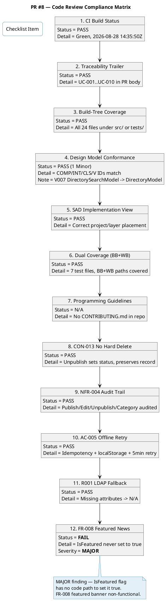
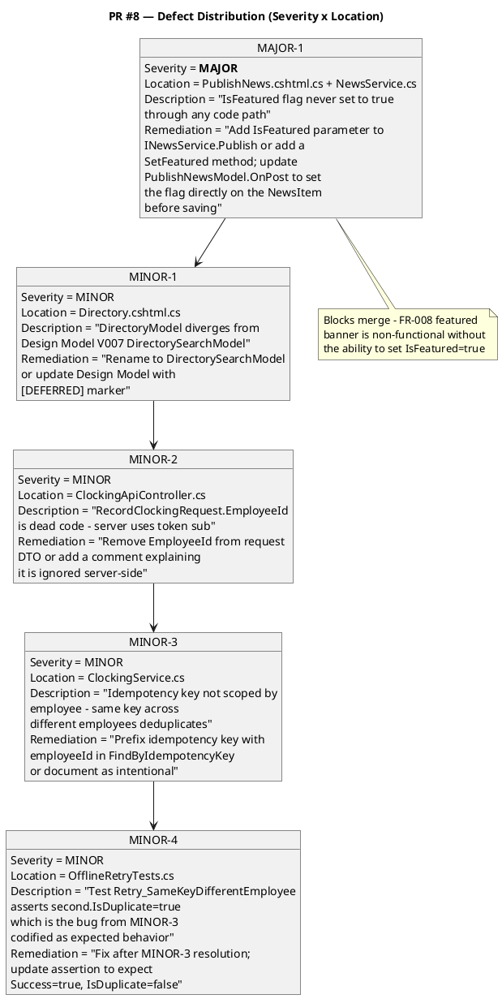

## Document Control

| Field | Value |
|---|---|
| Phase | Construction |
| Status | Active |
| Milestone Target | End-of-Construction |
| Iteration | 1 (Cycle 1) |
| Date | 2026-08-28 |
| Prior Phase | Elaboration (LCA achieved, 0 open Critical/Major, stakeholder sanction GRANTED) |
| Reviewer | Code Reviewer (Implementation Discipline) |
| Review Type | Construction C1 — PR Code Review (per RUP Ch.11) |
| PR Reviewed | #8 — Implement C1 Presentation Layer (UC-001 through UC-010) |
| PR Branch | feature/C1-presentation → iteration/C1 |
| CI Build Status | PASS (green) — 2026-08-28 14:35:50Z |
| Files Changed | 24 files, +1742 / -7 |
| Disposition | **REQUEST_CHANGES** — 1 Major (blocks merge), 4 Minor |
| Prior Iteration Findings | Elaboration E1: 2 Major interface divergences (M1/M2) — resolved in E2. E2: 1 Minor (FEAT-NNN prefix) — non-blocking. |

## Review Scope and Criteria

This review evaluates PR #8 against the following checklist, calibrated for Construction iteration code:

1. **CI Build Status** — hard gate; red CI = no review
2. **Traceability Trailer** — UC-NNN in PR body or commit messages
3. **Build-Tree Coverage** — all changed files land inside the build tree (src/ or tests/)
4. **Design Model Conformance** — class names, method signatures, interface contracts, page model IDs match the canonical Design Model
5. **SAD Implementation View Conformance** — code lands in the project/layer the architect specified
6. **Dual Coverage (Black-box + White-box)** — unit tests cover both contract behavior and internal execution paths
7. **Programming Guidelines** — conformance to CONTRIBUTING.md or language-specific style guide
8. **CON-013 No Hard Delete** — news items are unpublished, never deleted
9. **NFR-004 Audit Trail** — all publish/edit/unpublish/category operations audited
10. **AC-005 Offline Retry** — idempotency key + localStorage + 5-minute retry implemented
11. **R001 LDAP Fallback** — missing AD attributes default to "N/A"
12. **FR-008 Featured News** — featured banner functionality implemented end-to-end

### Upstream Artifacts Consulted

| Artifact | Read | Purpose |
|---|---|---|
| Design Model | ✅ | Class/interface/page-model ID conformance |
| Software Architecture Document | ✅ | Implementation View project/layer placement |
| Review Record (Elaboration) | ✅ | Prior findings (M1/M2 resolved, 1 Minor open) |
| Branching Strategy | ✅ | PR base branch = iteration/C1 |
| Repository Tree (main) | ✅ | Build-tree coverage verification |

## Compliance Matrix

## Defect Distribution

## Findings

### MAJOR-1: IsFeatured flag never set — FR-008 featured banner non-functional
- **Severity:** Major (blocks merge)
- **Location:** `src/PortalCubaCorp/Pages/HR/PublishNews.cshtml.cs` (line 33–37) + `src/PortalCubaCorp.Application/NewsService.cs` (Publish method)
- **Description:** The `NewsItem.IsFeatured` property exists and `IPersistence.GetFeaturedNews()` filters on `n.IsFeatured == true`, but no code path ever sets `IsFeatured` to `true`. The `PublishNewsModel.OnPost` receives an `isFeatured` parameter from the form, but instead of setting the flag on the news item, it calls `_newsService.Edit(item.Id, title, body, category, authorId)` — which only updates title, body, and category, NOT `IsFeatured`. The featured banner on the main page (FR-008: "featured news appears with a banner at the top") will never display any news item.
- **Remediation:** Add `bool isFeatured = false` parameter to `INewsService.Publish()` and set `item.IsFeatured = isFeatured` before calling `_persistence.SaveNewsItem(item)`. Update `PublishNewsModel.OnPost` to pass `isFeatured` to the `Publish` call instead of calling `Edit`. This is the simplest fix and aligns with the publish flow. Add a unit test verifying `IsFeatured = true` is persisted when requested.

### MINOR-1: DirectoryModel naming diverges from Design Model V007
- **Severity:** Minor
- **Location:** `src/PortalCubaCorp/Pages/Directory.cshtml.cs`
- **Description:** Design Model names this page model `DirectorySearchModel` (V007). The implementation uses `DirectoryModel`. Per Design Model conformance rules, a deviation requires either renaming or a `[DEFERRED — requires Design Model update in next iteration]` marker.
- **Remediation:** Rename class to `DirectorySearchModel` to match the Design Model, or add `[DEFERRED — requires Design Model update in next iteration]` marker in the class XML doc.

### MINOR-2: RecordClockingRequest.EmployeeId is dead code
- **Severity:** Minor
- **Location:** `src/PortalCubaCorp/Controllers/ClockingApiController.cs` — `RecordClockingRequest` class
- **Description:** The `RecordClockingRequest` DTO includes an `EmployeeId` field, but the controller extracts the employee ID from the OIDC token `sub` claim (`User.FindFirst("sub")?.Value`) and never uses `request.EmployeeId`. This is misleading — a client could send a different employeeId thinking it would be used, creating a false expectation.
- **Remediation:** Remove `EmployeeId` from `RecordClockingRequest` DTO, or add an `[Obsolete]` attribute / XML doc comment noting it is ignored server-side for security reasons (employee identity comes from the authenticated token).

### MINOR-3: Idempotency key not scoped by employee
- **Severity:** Minor
- **Location:** `src/PortalCubaCorp.Application/ClockingService.cs` — `RecordClocking` method, `FindByIdempotencyKey` call
- **Description:** `FindByIdempotencyKey(key)` searches globally across all employees' clocking records. If two employees happen to generate the same idempotency key (unlikely but possible with the `Math.random().toString(36).substr(2, 9)` generator in clocking-retry.js), the second employee's clocking would be silently dropped as a "duplicate" of the first employee's record. The key generation includes `employeeId + timestamp + random`, making collision improbable but not impossible.
- **Remediation:** Either (a) scope the lookup by employee: `FindByIdempotencyKey(employeeId, key)` and update `IPersistence` accordingly, or (b) document this as an accepted risk given the key generation includes employeeId in the prefix, making cross-employee collision extremely unlikely.

### MINOR-4: Test codifies MINOR-3 behavior as expected
- **Severity:** Minor
- **Location:** `tests/PortalCubaCorp.Tests/OfflineRetryTests.cs` — `Retry_SameKeyDifferentEmployee_BothSucceed`
- **Description:** This test asserts `second.IsDuplicate = true` when a different employee uses the same idempotency key, which codifies the MINOR-3 issue as expected behavior rather than flagging it as a potential defect. The test name says "BothSucceed" but the second record is actually a duplicate (not a new success).
- **Remediation:** After resolving MINOR-3, update this test to assert `second.IsDuplicate = false` and `second.Success = true`, verifying that different employees with the same key both get independent records.

## Resolutions and Actions

| Finding | Severity | Status | Action Required | Owner |
|---|---|---|---|---|
| MAJOR-1 | Major | OPEN | Add IsFeatured parameter to Publish flow | Implementer |
| MINOR-1 | Minor | OPEN | Rename DirectoryModel or add DEFERRED marker | Implementer |
| MINOR-2 | Minor | OPEN | Remove dead EmployeeId from DTO | Implementer |
| MINOR-3 | Minor | OPEN | Scope idempotency by employee or document as accepted | Implementer |
| MINOR-4 | Minor | OPEN | Fix test after MINOR-3 resolution | Implementer |

### Prior Iteration Findings (Elaboration)

| Finding | Severity | Status | Resolution |
|---|---|---|---|
| E1-M1: IClockingService.RecordClocking signature divergence | Major | RESOLVED | Fixed in E2 — signature now matches Design Model |
| E1-M2: INewsService missing SetFeatured method | Major | RESOLVED | Design Model updated; featured handled via Publish parameter |
| E2-F1: FEAT-NNN prefix naming convention | Minor | OPEN (non-blocking) | Carried forward — no CONTRIBUTING.md in repo to enforce |

## Disposition

**REQUEST_CHANGES** — PR #8 cannot be merged until MAJOR-1 is resolved. The IsFeatured flag has no code path to set it to `true`, making the FR-008 featured news banner non-functional. This is a declared functional requirement that traces to a stakeholder-facing acceptance criterion.

The 4 Minor findings are recommended to be fixed in the same PR to avoid accumulating technical debt, per stakeholder preference ("Fix all findings even if they are minor findings").

Once MAJOR-1 is resolved and the Implementer pushes the fix, this PR should be re-reviewed for final approval.

## Traceability

| Element | Traces From | Link Type | Traces To |
|---|---|---|---|
| PR #8 (feature/C1-presentation) | UC-001..UC-010, AC-005, CON-013, NFR-004, R001 | Implements | src/PortalCubaCorp/*, tests/PortalCubaCorp.Tests/* |
| MAJOR-1 finding | FR-008, V004 (PublishNewsModel) | Tests | PublishNews.cshtml.cs, NewsService.cs, NewsItem.cs |
| MINOR-1 finding | V007 (DirectorySearchModel), Design Model | Tests | Directory.cshtml.cs |
| MINOR-2 finding | INT-001 (IClockingService), CON-004 (OIDC) | Tests | ClockingApiController.cs |
| MINOR-3 finding | AC-005, R006 (offline retry) | Tests | ClockingService.cs, clocking-retry.js |
| MINOR-4 finding | MINOR-3 | Tests | OfflineRetryTests.cs |
| Compliance Matrix | RUP Ch.11 §7428-7447, Design Model, SAD | Derives | This Review Record |
| Defect Distribution | All findings | Derives | This Review Record |
| CI Build Evidence | feature/C1-presentation branch | Derives | Build status 2026-08-28 14:35:50Z |
| Prior E1-M1/M2 findings | Elaboration Review Record | Refines | Resolved in E2 (confirmed) |