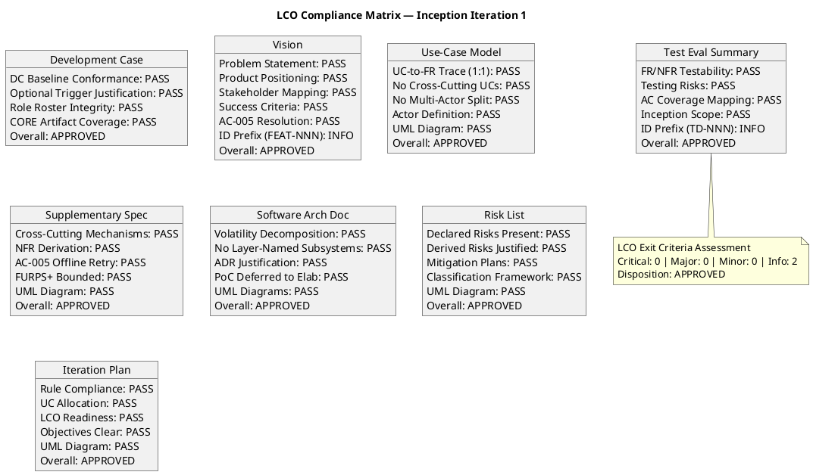
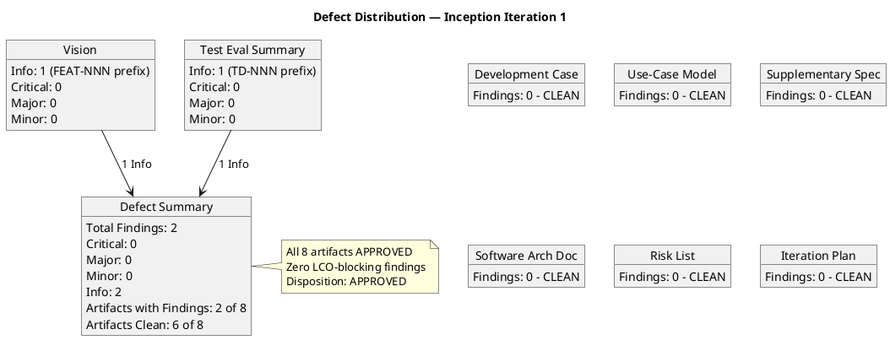

## Document Control

| Field | Value |
|---|---|
| Phase | Inception |
| Status | Draft |
| Milestone Target | End-of-Inception (LCO) |
| Iteration | 1 (Cycle 1) |
| Date | 2026-08-28 |
| Reviewer | Reviewer (Project Management Discipline) |
| Review Type | LCO Milestone Review — Technical Lens |

## Review Scope and Criteria

### Artifacts Reviewed (8)

| # | Artifact | Discipline | Phase | Status |
|---|---|---|---|---|
| 1 | Development Case | Environment | Inception | Draft |
| 2 | Vision | Requirements | Inception | Draft |
| 3 | Use-Case Model | Requirements | Inception | Draft |
| 4 | Supplementary Specification | Requirements | Inception | Draft |
| 5 | Software Architecture Document | Analysis & Design | Inception | Draft |
| 6 | Risk List | Project Management | Inception | Draft |
| 7 | Iteration Plan | Project Management | Inception | Draft |
| 8 | Test Evaluation Summary | Test | Inception | Draft |

### LCO Exit Criteria Applied

This review applies the **feasibility and acceptability** lens per RUP Project Approval / Planning review point. The LCO exit criteria checklist:

1. **Vision clarity** — Is the problem statement clear, product positioning defined, stakeholders identified, and success criteria measurable?
2. **Initial risk identification** — Are declared risks (R001, R002) present with correct exposure values, and are derived risks (R003–R006) justified?
3. **Use case survey level** — Do all UCs trace 1:1 to declared FRs, with no cross-cutting mechanisms as UCs and no multi-actor splits?
4. **Stakeholder agreement on scope and feasibility** — Does the scope statement match the declared scope, with AC-005 resolution incorporated?
5. **Architecture candidate viability** — Is the candidate architecture decomposed by volatility, with ADRs justified and PoC deferred to Elaboration?
6. **DC Baseline Conformance** — Does the Development Case comply with the IARI baseline (no role redefinition, no ownership reassignment, no CORE omissions, no out-of-universe artifacts)?
7. **Optional Trigger Justification** — Are all NOT-TRIGGERED optional artifacts correctly justified against their §5.2 conditions?
8. **Traceability completeness** — Do all artifacts carry traceability tables linking to upstream declared elements?

### SCM State

No open pull requests found. No CI build status to verify (Inception phase — no implementation code per RUP Ch.4).

## Findings

### Compliance Matrix

### Defect Distribution

### Finding Details

| # | Artifact | Severity | Finding | Recommendation | Verdict |
|---|---|---|---|---|---|
| F1 | Vision | Info | Vision traceability table uses "FEAT-NNN" as an element ID prefix (FEAT-001 through FEAT-010). This prefix is not listed in the standard ID conventions table. While traceability is clear and correct (each FEAT-NNN traces from FR-NNN to UC-NNN), the non-standard prefix could cause confusion in cross-artifact traceability lookups. | Either (a) replace "FEAT-NNN" with the standard "REQ-NNN" prefix, or (b) declare "FEAT" as a project-specific element type in the Development Case's tool assessment section. Option (b) is preferred since features and requirements serve different abstraction purposes in the Vision document. | Approved |
| F2 | Test Evaluation Summary | Info | Test Evaluation Summary traceability table uses "TD-NNN" as an element ID prefix (TD-001, TD-002) for Test Dependencies. This prefix is not listed in the standard ID conventions table. While traceability is clear (TD-001 traces from R001/STK-003/CON-005, TD-002 from R003/STK-003/CON-004), the non-standard prefix could cause confusion in cross-artifact traceability lookups. | Either (a) replace "TD-NNN" with a standard prefix or inline description, or (b) declare "TD" as a project-specific element type in the Development Case. Option (b) is preferred since Test Dependency is a meaningful concept in test planning that doesn't map to any existing standard ID type. | Approved |

### Per-Artifact Evaluation Summary

**1. Development Case** — APPROVED. DC Baseline Conformance verified: (a) 25-role roster preserved, (b) no CORE ownership reassignment, (c) all 16 CORE artifacts accounted for, (d) no out-of-universe artifacts, (e) no role merges. All 6 OPTIONAL artifacts correctly NOT-TRIGGERED with valid §5.2 justifications: Glossary (no specialist vocabulary), PoC (Inception not Elaboration), Data Model (<10 entities, not data-centric), Deployment Model (single Windows Server, not distributed), UI Prototype (CON-011 provides authoritative design), Test Plan (no formal/regulatory delivery requirement). Business Modeling correctly declared INACTIVE (business-process-led = false).

**2. Vision** — APPROVED. Problem statement clearly articulates the three fragmented processes being replaced. Product positioning statement is well-formed. All 4 stakeholders (STK-001..004) mapped with correct influence levels. Success criteria trace to BG-001..003 and AC-001..005. AC-005 offline resolution correctly incorporated per stakeholder answer (server-side fault tolerance + bounded client-side localStorage retry with idempotency key, no PWA/service worker). One Info finding on non-standard FEAT-NNN ID prefix.

**3. Use-Case Model** — APPROVED. All 10 UCs trace 1:1 to declared FR-001..FR-010. No cross-cutting mechanisms (auth, sync, audit) appear as standalone UCs — audit trail is correctly in Supplementary Specification with <<include>>. No multi-actor splits: Employee and HR have distinct declared processes. Three actors defined (Employee, HR Administrator, Active Directory as external system). UML use-case diagram present and well-formed. Volatility annotations on architecturally significant UCs (UC-001, UC-009) support the SAD's component decomposition.

**4. Supplementary Specification** — APPROVED. Cross-cutting mechanisms (OIDC authentication, audit trail) correctly placed as Supplementary Specification entries with <<include>> from dependent UCs. NFRs derived from declared constraints (SEC from CON-004/CON-007/CON-012/CON-010, AUD from NFR-004, PERF from NFR-001/002, REL from NFR-003/AC-005). AC-005 offline retry correctly scoped: REL-003 (localStorage retry) and REL-004 (idempotency key) capture the bounded client-side mechanism per stakeholder answer. FURPS+ is bounded to the 200-user intranet scope — no over-engineering.

**5. Software Architecture Document** — APPROVED. 8 components (COMP-001..008) decomposed by volatility, not by feature or layer name. Component names reflect architectural role (LDAP Directory Service, Clocking Service, News Service, Worker Category Service, PostgreSQL Persistence, OIDC Authentication Middleware, Audit Interceptor). 5 ADRs (ADR-001..005) each justified with declared constraint traces. PoC plan for R001 correctly deferred to Elaboration per §5.2 (PoC requires Elaboration phase + technical risk). Candidate architecture depth is appropriate for Inception (sketch-level 4+1 with Process and Implementation views deferred). UML component and deployment diagrams present.

**6. Risk List** — APPROVED. Both declared risks present with correct exposure values: R001 (P=3, I=3, exposure=9, HIGH) and R002 (P=3, I=2, exposure=6, SIGNIFICANT). Four derived risks (R003–R006) properly identified by Project Manager as risk authority, each tracing to declared constraints. Mitigation plans present for HIGH and SIGNIFICANT risks. Contingency plans for R001 and R006. Classification framework (P×I=Exposure) is sound and consistently applied. UML class diagram present showing risk model structure.

**7. Iteration Plan** — APPROVED. 6 iterations [1, 2, 2, 1] across 4 phases consistent with 6±3 rule for moderate complexity. Rubber profile adjusted for risk profile (Elaboration gets 2 iterations for R001/R006). FR-009 correctly sequenced to Elaboration Iter 1 to confront R001 (AD LDAP, highest risk). LCO readiness assessment present. Five iteration objectives are clear and bounded. Token-budget framing consistent with IARI planning rules (no person-weeks, no fabricated dates).

**8. Test Evaluation Summary** — APPROVED. Testability of all 10 FRs, 4 NFRs, and 5 ACs assessed. Testing risks correctly derived from Risk List (R001 and R006 as top testing risks). AC-001..005 mapped to future Construction/Transition test phases. Test infrastructure dependencies identified (TD-001: test AD from STK-003, TD-002: OIDC client registration from STK-003). Inception scope correctly limited to assessment and strategy, not execution. One Info finding on non-standard TD-NNN ID prefix.

## Resolutions and Actions

### Open Action Items

| # | Artifact | Finding | Severity | Owner | Status |
|---|---|---|---|---|---|
| 1 | Vision | F1 — FEAT-NNN non-standard ID prefix | Info | System Analyst | Open (non-blocking) |
| 2 | Test Evaluation Summary | F2 — TD-NNN non-standard ID prefix | Info | Test Manager | Open (non-blocking) |

Both Info findings are non-blocking suggestions for Elaboration improvement. They do not gate the LCO milestone.

### Prior Findings Reconciliation

This is iteration 1, cycle 1 — no prior findings exist from this reviewer lens. All 8 artifacts returned empty findings arrays.

## Disposition

**Overall LCO Disposition: APPROVED**

All 8 Inception artifacts pass the LCO exit criteria. Zero Critical findings, zero Major findings, zero Minor findings. Two Info-level findings (non-standard ID prefixes in Vision and Test Evaluation Summary) are non-blocking suggestions for improvement in subsequent iterations.

The project demonstrates:
- **Feasibility:** The declared scope (10 FRs, 4 NFRs, 5 ACs) is achievable within the technical constraints (.NET 10, Razor Pages, PostgreSQL, Keycloak OIDC, AD LDAP, internal Windows Server).
- **Scope clarity:** All UCs trace 1:1 to declared FRs. No scope creep detected. AC-005 offline resolution correctly incorporated per stakeholder answer.
- **Risk identification:** Both declared risks (R001 exposure=9, R002 exposure=6) present with mitigation plans. Four derived risks (R003–R006) justified.
- **Architecture candidate viability:** 8 components decomposed by volatility, 5 ADRs justified, PoC deferred to Elaboration.
- **Stakeholder alignment:** Vision, Use-Case Model, and Supplementary Specification reflect declared scope with no undeclared additions.

The project is viable to proceed to Elaboration upon ReviewCoordinator consolidation.

## Traceability

| Element | Traces From | Link Type | Traces To |
|---|---|---|---|
| Review Record | All 8 Inception artifacts | Derives | LCO Milestone Review (ReviewCoordinator) |
| F1 (Vision finding) | Vision traceability table | Refines | System Analyst (Elaboration Iter 1) |
| F2 (TES finding) | Test Evaluation Summary traceability table | Refines | Test Manager (Elaboration Iter 1) |
| DC Conformance Check | IARI DC Baseline (this prompt) | Derives | Development Case artifact |
| Optional Trigger Audit | IARI §5.2 conditions (this prompt) | Derives | Development Case artifact |
| UC Guard Checks | FR-001..FR-010, Scope Guard Rules 5/7 | Derives | Use-Case Model artifact |
| SAD Volatility Check | SAD component decomposition | Derives | Software Architecture Document artifact |
| Risk List Check | R001, R002 (Work Order) | Derives | Risk List artifact |
| Iteration Plan Check | 6±3 rule, rubber profile | Derives | Iteration Plan artifact |