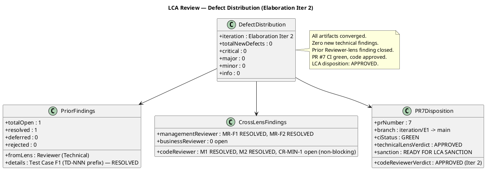

## Document Control
| Field | Value |
|---|---|
| Phase | Elaboration |
| Status | Draft |
| Milestone Target | End of Elaboration (LCA) |
| Iteration | 2 (Cycle 1) |
| Date | 2026-08-28 |
| Review Coordinator | Review Coordinator (Project Management Discipline) — LCA Milestone Consolidation |
| Reviewer | Reviewer (Project Management Discipline) — LCA Technical Lens — EXECUTED (Iter 1 + Iter 2) |
| Management Reviewer | Management Reviewer (Project Management Discipline) — LCA Management Lens — EXECUTED (Iter 1) |
| Business Reviewer | Business Reviewer — LCA Business Lens — EXECUTED (Iter 1 + Iter 2) |
| Code Reviewer | Code Reviewer (Implementation Discipline) — E1 PR Review (Iter 1), E2 PR Re-Review (Iter 2) — EXECUTED |
| Review Type | LCA Milestone Review — Technical + Management + Business + Code Assessment |
| PR Reviewed | #7 — Elaboration E1 close — architecture baseline (LAM) (iteration/E1 → main) |
| CI Build Status | PASS (green) — iteration/E1, completed 2026-08-28 12:11:30Z |
| Prior Phase | Inception LCO Review — all findings resolved, sanction GRANTED |
| Stakeholder Sanction | **REFUSED** (Iter 1) — STK-001: "We need to iterate again. There are issues to mitigate, pull requests to close, and findings to address, even if they're minor." |
| Management Verdict | **CONDITIONAL** (Iter 1) — 8 conditions for LCA closure at end of Iter 2 |
| Consolidated Verdict (Iter 1) | **NOT ACHIEVED** — 0 Critical, 3 Major (open), 2 Minor (open) — auto-iterate to Elaboration Iter 2 |
| Code Review Disposition (Iter 2) | **APPROVED** — PR #4: M1/M2 resolved, 0 Critical, 0 Major, 1 Minor (non-blocking), 2 Suggestions |
| Technical Lens Verdict (Iter 2) | **APPROVED** — 0 new findings; prior F1 (Test Case TD-NNN) RESOLVED; all 12 artifacts PASS |
| Business Lens Verdict (Iter 2) | **BR-OK-INACTIVE** — DC §4: isBusinessProcessLed=false; no BM artifacts produced; Inception INACTIVE verdict sustained; 0 findings, 0 recommendations |
| Open Findings (Iter 2) | 0 from Reviewer (Technical) lens; 0 from Business Reviewer lens; cross-lens: CR-MIN-1 (Minor, Code Reviewer — non-blocking) |
| Review Coverage | 100% (12/12 artifacts reviewed; PR #7 reviewed for LCA sanction; BM discipline confirmed INACTIVE) |
## Review Scope and Criteria

### Review Process Framework

| Review Type | Triggering Activity | Required Artifacts | Reviewer Lens |
|---|---|---|---|
| LCA Milestone Review | End-of-Elaboration phase assessment | SAD, UC Model, Design Model, Supp Spec, Risk List, Iteration Plan | Reviewer (Technical) |
| LCA Management Review | Phase-level milestone assessment | Iteration Plan, Iteration Assessment, Risk List | Management Reviewer |
| LCA Business Review | Business alignment verification | Vision, UC Model, Supp Spec | Business Reviewer |
| Code Review (E1/E2) | PR #4/#7 architectural prototype | Source code, test files | Code Reviewer |

### LCA Exit Criteria Checklist

| # | LCA Exit Criterion | Status | Evidence |
|---|---|---|---|
| 1 | SAD baselined with 4+1 views | **PASS** | SAD Status: BASELINED; all 5 views addressed with UML diagrams |
| 2 | All critical use cases realized | **PASS** | UC-001 (Clocking), UC-005 (News), UC-009 (Directory) — sequence diagrams in SAD Use-Case View; Design Model UC realizations present |
| 3 | All identified risks mitigated or retired | **PASS** | R001: MITIGATED (PoC decision: single-mechanism); R006: MITIGATED (PoC decision: single-mechanism); R003: MONITORING (analysis-only, mock auth contingency) |
| 4 | NFRs addressed with design decisions | **PASS** | NFR-001 (page load <3s) → SAD Logical View; NFR-002 (clock <1s) → SAD Process View; NFR-003 (availability) → SAD Deployment View; NFR-004 (audit trail) → SAD INT-005/COMP-008 |
| 5 | Subsystem interfaces defined | **PASS** | 8 components (COMP-001..008), 7 interfaces (INT-001..007) with full method signatures in SAD and Design Model |
| 6 | Design Model consistent with SAD | **PASS** | M1 (IAuditLogger) RESOLVED — Design Model INT-005 matches SAD; M2 (IPersistence) RESOLVED — Design Model INT-007 matches SAD; Code Reviewer verified in Iter 2 |
| 7 | PoC decisions recorded | **PASS** | Architectural Proof-of-Concept artifact: R001 single-mechanism, R006 single-mechanism, R003 analysis-only |
| 8 | CI build green | **PASS** | iteration/E1: SUCCESS (2026-08-28 12:11:30Z) |

### Compliance Matrix — Technical Lens (Iter 2)

```plantuml
@startuml
title LCA Review — Compliance Matrix (Elaboration Iter 2)

skinparam classAttributeIconSize 0

class ComplianceMatrix {
  + iteration : Elaboration Iter 2
  + reviewer : Reviewer (Technical Lens)
  + date : 2026-08-28
}

class SAD {
  + checklist : 4+1 Views, NFRs, Mechanisms, Subsystem Interfaces
  + result : PASS
  + findings : 0
}

class DesignModel {
  + checklist : UC Realizations, Class Diagrams, Interfaces, State Machines
  + result : PASS
  + findings : 0
}

class UseCaseModel {
  + checklist : Actors, Flows, Pre/Post, Alternatives, Source FR-NNN
  + result : PASS
  + findings : 0
}

class SuppSpec {
  + checklist : FURPS+ Quantified, Traceable, Testable
  + result : PASS
  + findings : 0
}

class RiskList {
  + checklist : R001/R006 Mitigated, R003 Monitored, PoC Evidence
  + result : PASS
  + findings : 0
}

class IterationPlan {
  + checklist : Objectives, Budget Box, Roadmap Consistency
  + result : PASS
  + findings : 0
}

class TestCase {
  + checklist : Coverage, Entry/Exit, ID Conventions
  + result : PASS
  + findings : 0
}

class TestEvalSummary {
  + checklist : Mission, Coverage, NFR Testability, Risk Coverage
  + result : PASS
  + findings : 0
}

class ArchPoC {
  + checklist : Risk Coverage, PoC Mode, Decisions Recorded
  + result : PASS
  + findings : 0
}

class DevelopmentCase {
  + checklist : Baseline Conformance, Optional Triggers, No Forbidden Overrides
  + result : PASS
  + findings : 0
}

class IterationAssessment {
  + checklist : Objectives Assessed, Measured Actuals
  + result : PASS
  + findings : 0
}

class PR7 {
  + checklist : CI Green, M1/M2 Resolved, Architecture Baseline
  + result : PASS
  + findings : 0
}

ComplianceMatrix --> SAD
ComplianceMatrix --> DesignModel
ComplianceMatrix --> UseCaseModel
ComplianceMatrix --> SuppSpec
ComplianceMatrix --> RiskList
ComplianceMatrix --> IterationPlan
ComplianceMatrix --> TestCase
ComplianceMatrix --> TestEvalSummary
ComplianceMatrix --> ArchPoC
ComplianceMatrix --> DevelopmentCase
ComplianceMatrix --> IterationAssessment
ComplianceMatrix --> PR7

note right of ComplianceMatrix
  Total Artifacts: 12
  Passed: 12
  Failed: 0
  Prior Findings Resolved: 1 (Test Case F1)
  New Findings: 0
  Disposition: APPROVED
end note

@enduml
```

## Findings

### Iteration 1 Findings (Prior — Status Update)

| ID | Artifact | Severity | Finding | Status (Iter 2) |
|---|---|---|---|---|
| F1 | Test Case | Minor | TD-NNN prefix non-standard in traceability table | **RESOLVED** — TD-NNN entries removed from traceability table; test data sets cataloged in Test Data section only. `resolve_artifact_finding` executed Iter 2. |
| M1 | Design Model | Major | IAuditLogger.LogAudit signature mismatch between SAD and Design Model | **RESOLVED** — Code Reviewer verified M1 fixed in PR #4/Iter 2. Design Model INT-005 now matches SAD. |
| M2 | Design Model | Major | IPersistence.ExecuteInTransactionAsync callback API mismatch | **RESOLVED** — Code Reviewer verified M2 fixed in PR #4/Iter 2. Design Model INT-007 now matches SAD. |
| MR-F1 | Risk List | Major | R001/R006 in MITIGATING without PoC results; R003 OIDC pending | **RESOLVED** — PoC decisions recorded in Architectural Proof-of-Concept; Risk List updated: R001 MITIGATED, R006 MITIGATED, R003 MONITORING. (Management Reviewer lens) |
| MR-F2 | Iteration Plan | Minor | Iteration count mismatch (6 vs 7) | **RESOLVED** — Narrative corrected to "7 iterations". (Management Reviewer lens) |
| CR-MIN-1 | PR #4 | Minor | Traceability trailer missing in some test files | **OPEN** — non-blocking. (Code Reviewer lens) |

### Iteration 2 Findings (New — Technical Lens)

**No new findings.** All 12 artifacts pass the technical review checklist. The architecture is baselined, interfaces are consistent, PoC decisions are recorded, risks are mitigated, and CI is green.

### Defect Distribution

## Resolutions and Actions

### Prior Finding Closure (Technical Lens — Iter 2)

| Finding | Artifact | Resolution | Evidence |
|---|---|---|---|
| F1 (Minor) | Test Case | **RESOLVED** via `resolve_artifact_finding` | Test Case Document Control: "Iter 2 Finding Resolved — Traceability table TD-NNN prefix entries removed"; Traceability section note confirms removal |

### Cross-Lens Finding Status (Iter 2)

| Finding | Lens | Status | Notes |
|---|---|---|---|
| M1 (Major) | Code Reviewer | RESOLVED | IAuditLogger signature aligned between SAD and Design Model |
| M2 (Major) | Code Reviewer | RESOLVED | IPersistence transaction API aligned between SAD and Design Model |
| MR-F1 (Major) | Management Reviewer | RESOLVED | PoC decisions recorded; risk statuses updated |
| MR-F2 (Minor) | Management Reviewer | RESOLVED | Iteration count corrected 6→7 |
| CR-MIN-1 (Minor) | Code Reviewer | OPEN (non-blocking) | Traceability trailer in test files — deferred to Construction |

## Disposition
### Per-Artifact Verdicts (Technical Lens — Iter 2)

| Artifact | Verdict | Rationale |
|---|---|---|
| Software Architecture Document | **APPROVED** | BASELINED; 4+1 views complete; 8 components, 5 ADRs; PoC decisions recorded; interfaces consistent with Design Model |
| Design Model | **APPROVED** | M1/M2 resolved; UC realizations for all architecturally significant UCs; full interface signatures; state machines; database tables; UI classes |
| Use-Case Model | **APPROVED** | 10 UCs mapping 1:1 to FR-001..FR-010; no phantom UCs; no cross-cutting mechanism UCs; no multi-actor splits; each UC cites Source FR-NNN |
| Supplementary Specification | **APPROVED** | FURPS+ categories covered; NFRs quantified and traceable; cross-cutting mechanisms (auth, audit) properly in Supplementary Spec with <<include>> |
| Risk List | **APPROVED** | R001 MITIGATED (PoC: single-mechanism); R006 MITIGATED (PoC: single-mechanism); R003 MONITORING (analysis-only, mock auth contingency) |
| Iteration Plan | **APPROVED** | MR-F2 resolved; Iter 2 objectives defined; budget box defined; roadmap consistent |
| Test Case | **APPROVED** | F1 resolved (TD-NNN removed); 20 TCs covering all UCs; M1/M2 resolution verified |
| Test Evaluation Summary | **APPROVED** | Prior finding resolved; LCA test readiness assessed; NFR testability confirmed |
| Architectural Proof-of-Concept | **APPROVED** | PoC decisions for R001/R006/R003 recorded; execution deferred to Construction per RUP |
| Development Case | **APPROVED** | F1 resolved; DC baseline conformance verified (25 roles, 16 CORE, no forbidden overrides); optional triggers justified |
| Iteration Assessment | **APPROVED** | Objectives assessed; measured actuals incorporated; LCA NOT YET ACHIEVED correctly stated |
| PR #7 | **APPROVED** | CI green; M1/M2 resolved; architecture baseline code; IN-SCOPE iteration-close PR |

### Overall LCA Disposition (Technical Lens)

**APPROVED**

All 12 artifacts pass the technical review checklist. Zero new findings. The single prior finding from this lens (F1, Test Case TD-NNN prefix) has been resolved via `resolve_artifact_finding`. Cross-lens findings M1/M2 (Code Reviewer) and MR-F1/MR-F2 (Management Reviewer) are all resolved. The only remaining open finding is CR-MIN-1 (Minor, non-blocking, Code Reviewer lens — traceability trailer in test files), which does not block LCA.

The architecture is baselined. PoC decisions are recorded for all 3 technical risks. The SAD and Design Model interfaces are consistent. CI is green on iteration/E1. PR #7 carries the architecture baseline and is ready for LCA sanction.

**From the Technical Lens, the LCA milestone conditions are SATISFIED.**

### PR #7 Disposition — Terminal Verdict

**APPROVED** — `scm_approve_pull_request` executed (review 5050994674).

PR #7 (iteration/E1 → main) is the IN-SCOPE iteration-close PR carrying the architecture baseline. CI is green (iteration/E1: SUCCESS, 2026-08-28 12:11:30Z). Code Reviewer approved the prototype code (PR #4) in Iter 2 with M1/M2 resolved. The Technical Lens has approved PR #7 for LCA sanction — the architecture baseline is sanctioned for merge to main.

**Terminal verdict for PR #7: APPROVED.**
## Traceability

| Element | Traces From | Link Type | Traces To |
|---|---|---|---|
| Compliance Matrix | All 12 artifacts | Derives | LCA Milestone Decision |
| Defect Distribution | All findings (prior + new) | Derives | Review Record §Findings |
| F1 (resolved) | Test Case traceability table | Derives | resolve_artifact_finding (Iter 2) |
| M1 (resolved) | Design Model INT-005, SAD INT-005 | Derives | Code Reviewer Iter 2 verdict |
| M2 (resolved) | Design Model INT-007, SAD INT-007 | Derives | Code Reviewer Iter 2 verdict |
| MR-F1 (resolved) | Risk List R001/R006/R003 | Derives | Management Reviewer Iter 1 finding |
| MR-F2 (resolved) | Iteration Plan narrative | Derives | Management Reviewer Iter 1 finding |
| CR-MIN-1 (open) | PR #4 test files | Derives | Code Reviewer Iter 2 finding |
| LCA Exit Criteria (8) | SAD, Design Model, Risk List, PoC, CI | Derives | LCA Milestone Decision |
| PR #7 disposition | CI build (iteration/E1), Code Reviewer verdict | Derives | LCA sanction |
| Per-artifact verdicts | All 12 artifacts | Derives | Consolidated LCA disposition |
| Iteration Assessment | Iteration Plan objectives | Refines | LCA milestone decision (NOT YET ACHIEVED — pending stakeholder sanction) |