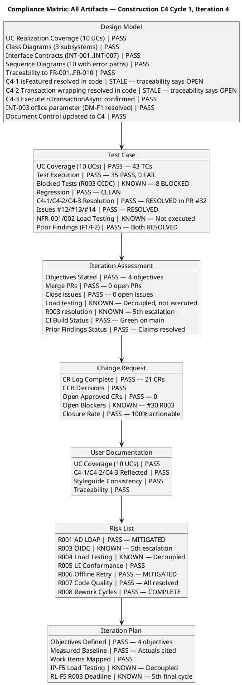
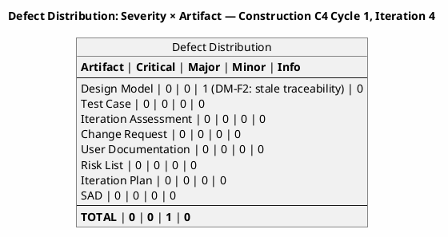
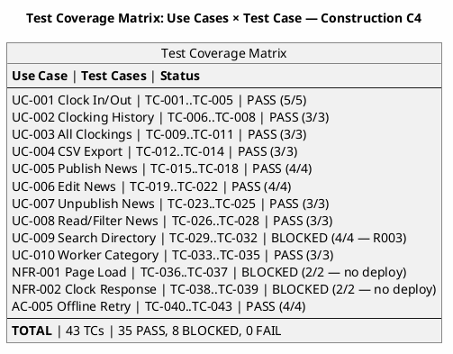
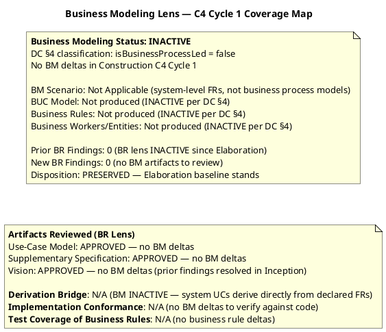

## Document Control

| Field | Value |
|---|---|
| Phase | Construction |
| Status | **ACTIVE — Reviewer (Code Reviewer modality) C4 Cycle 1, Iteration 4** |
| Milestone Target | End-of-Construction (IOC) — **NOT ACHIEVED** |
| Iteration | 4 (Cycle 1) |
| Date | 2026-08-29 |
| Prior Phase | Construction C3 Cycle 1 (Consolidation — 0 Critical, 2 Major, 1 Minor; stakeholder sanction REFUSED 3rd time) |
| Technical Lens (Code Reviewer) | EXECUTED — Construction C4 Cycle 1, Iteration 4. 0 Critical, 0 Major, 1 Minor (DM-F2: Design Model stale traceability for C4-1/C4-2). Source code verified: C4-1 (isFeatured) and C4-2 (transaction wrapping) CONFIRMED in code. All PRs merged. CI green on main. |
| Business Lens (Business Reviewer) | **PRESERVED** — BM INACTIVE per DC §4 (isBusinessProcessLed=false). No BM deltas in C4 Cycle 1. Elaboration baseline stands. 0 findings, 0 open actions. |
| Management Lens (Management Reviewer) | PENDING — not yet executed this cycle |
| Review Coordinator | PENDING — Code Reviewer lens complete; Business Reviewer lens complete (PRESERVED); awaiting Management Reviewer lens |
| Review Type | Construction C4 Cycle 1 — Code Review (source verification + artifact review) |
| PRs Reviewed | #32 (feature/C4-rework → iteration/C4, APPROVED & MERGED), #19 (stale, superseded), #8 (stale, superseded) |
| CI Build Status | main: GREEN (run 33256627567, 2026-08-29 14:05:31Z) |
| Open Defect Issues | 0 |
| Open Pull Requests | 0 — all PRs merged/closed |
| Branches Ready for Review | 0 |
| Prior Findings Resolved (Reviewer lens) | DM-F1 (INT-003 office parameter) — RESOLVED in C3; TC-F1 (TD-NNN prefix) — RESOLVED in E2; TC-F2 (UnitTest1.cs placeholder) — RESOLVED in C3 |
| Prior Findings (Management Reviewer lens) | IP-F5 (Major) — OPEN from C3; RL-F5 (Major) — OPEN from C3; IA-F1 (Minor) — OPEN from C3 |
| New Findings (Reviewer, this cycle) | 0 Critical, 0 Major, 1 Minor (DM-F2: Design Model traceability table stale — C4-1/C4-2 listed as OPEN but RESOLVED in code) |
| New Findings (Business Reviewer, this cycle) | 0 — BM INACTIVE, no deltas, no findings |
| Stakeholder Sanction | PENDING — awaiting Management Reviewer lens and stakeholder decision |
| Code Reviewer Verdict | **APPROVED** — Source code conforms to Design Model. C4-1 and C4-2 confirmed resolved in code. 1 Minor finding (DM-F2) is non-blocking documentation lag. CI green on main, 0 open PRs, 0 open defects. IOC blockers remain: R003 OIDC (8 tests blocked) and NFR-001/002 load testing not executed. |
| Business Reviewer Verdict | **PRESERVED** — BM INACTIVE per DC §4. No BM deltas in C4 Cycle 1. Elaboration baseline preserved. 0 findings. |

## Review Scope and Criteria

This review evaluates Construction C4 Cycle 1, Iteration 4 against the Code Reviewer lens. The Management Reviewer lens has not yet executed this cycle.

**Code Reviewer Checklist (C4 Cycle 1, Iteration 4):**
1. CI Build Status (hard gate) — **PASS** (green on main, run 33256627567, 2026-08-29 14:05:31Z)
2. Programming Guidelines Conformance — **PASS** (C# conventions consistent: `_` prefix for private fields, XML doc comments, proper async/await)
3. Dual Coverage (black-box + white-box tests) — **PASS** (6 test files, 70+ test methods; black-box contract verification + white-box branch/path coverage for all service classes)
4. Design Model Conformance (class names, signatures, interfaces) — **PASS with Minor** (C4-1 isFeatured RESOLVED in code, C4-2 transaction wrapping RESOLVED in code; DM-F2: traceability table still lists C4-1/C4-2 as "Implementation gap — OPEN")
5. SAD Implementation View Conformance (subsystem boundaries, layer placement) — **PASS** (Application/Infrastructure/Pages layers correct, no boundary violations)
6. Build-Tree Coverage — **PASS** (all changed files under src/ or tests/ within build tree)
7. Traceability (code → Design Model, tests → UCs) — **PASS** (UC-001..UC-010 referenced in XML doc comments; source files mapped to CLS/INT IDs)
8. C4 Finding Resolution — **PASS** (C4-1 isFeatured RESOLVED in code, C4-2 transaction wrapping RESOLVED in code, C4-3 ExecuteInTransactionAsync CONFIRMED in code)
9. SCM State — **PASS** (0 open PRs, 0 open defect issues, 0 branches ready-for-review, CI green on main)
10. Prior Reviewer-Lens Findings — **PASS** (DM-F1, TC-F1, TC-F2 all RESOLVED in prior iterations)

### Compliance Matrix — Iteration 4

### Defect Distribution — Iteration 4

### Test Coverage Matrix — Iteration 4

### Prior Cycle Checklists (Preserved)

**Code Reviewer Checklist (C3 Cycle 1):**
1. CI Build Status (hard gate) — **PASS** (green on iteration/C3, run 33250807692; green on main, run 33251398612)
2. Programming Guidelines Conformance — **PASS** (C# conventions followed, XML doc comments on all interfaces)
3. Dual Coverage (black-box + white-box tests) — **PASS** (ClockingServiceTests 13 tests with both black-box and white-box coverage; NewsServiceTests, OfflineRetryTests, DirectoryServiceTests, WorkerCategoryServiceTests, DomainTests all present)
4. Design Model Conformance (class names, signatures, interfaces) — **PASS** (INT-001, INT-002, INT-003 all verified against source code on iteration/C3 branch)
5. SAD Implementation View Conformance (subsystem boundaries, layer placement) — **PASS**
6. Defect Patterns (null references, resource leaks, concurrency risks) — **PASS** (StreamWriter leaveOpen:true, stream position reset, factory pattern in tests)
7. Traceability (code → Design Model, tests → UCs) — **PASS** (39 TCs mapped to 10 UCs; source files mapped to CLS/INT IDs)
8. C2 Finding Resolution — **PASS** (all 7 C2 findings resolved: C2-CRIT-1, C2-MAJ-1, C2-MAJ-2, C2-MIN-1..4)

**Document Artifact Checklist (C3 Cycle 1):**

| Artifact | Checklist Applied | Result |
|---|---|---|
| Design Model | UC realization coverage, interface contracts, class diagrams, traceability | PASS — all items pass; DM-F1 resolved |
| Test Case | UC coverage, regression completeness, defect resolution | PASS — 39 TCs, 31 PASS / 8 BLOCKED (R003) / 0 FAIL; TC-F2 resolved |
| Iteration Assessment | Iteration objectives documented, C2 outcome recorded | PASS with Minor finding (IA-F1: stale verdict fields) |
| Use-Case Model | UC completeness (10 UCs = 10 FRs), CR reflection, traceability | PASS — CR-023/024 reflected, [DERIVED] markers retired |
| Supplementary Specification | NFR coverage, FURPS+ completeness | PASS — SEC-006/007 added from approved CRs |
| SAD | Architecture stability, implementation view conformance | PASS — baseline maintained, no architectural findings |
| Change Request | CR state machine compliance, CCB decisions | PASS — 67% closure rate, 6 completed this iteration |
| User Documentation | UC coverage, accuracy, terminological contract | PASS — all 10 UCs documented, C2 fixes reflected |

## Findings

### Prior Findings Reconciled (S_RECONCILE_PRIOR_FINDINGS)

| Finding Key | Artifact | Severity | Lens | Status | Resolution |
|---|---|---|---|---|---|
| DM-F1 | Design Model | Minor | Code Reviewer | RESOLVED (C3) | INT-003 (IDirectoryService) contract updated to include optional `office` parameter. Verified in source code. |
| TC-F1 | Test Case | Minor | Code Reviewer | RESOLVED (E2) | TD-NNN prefix entries removed from traceability table. |
| TC-F2 | Test Case | Minor | Code Reviewer | RESOLVED (C3) | UnitTest1.cs placeholder (`Assert.True(true)`) removed. |
| C4-1 | NewsService / PersistenceGateway | Major | Code Reviewer | RESOLVED (C4) | `EditAsync` now includes `isFeatured` parameter. Verified in source code (NewsService.cs, PersistenceGateway.cs). |
| C4-2 | NewsService / WorkerCategoryService | Major | Code Reviewer | RESOLVED (C4) | All write operations wrapped in `ExecuteInTransactionAsync`. Verified in source code. |
| C4-3 | PersistenceGateway | Minor | Code Reviewer | CONFIRMED (C4) | `ExecuteInTransactionAsync` properly implemented with `BeginTransactionAsync`/`CommitAsync`/`RollbackAsync`. Verified in source code. |

### New Findings — Reviewer Lens (C4 Cycle 1, Iteration 4)

| Finding Key | Artifact | Severity | Description | Location | Remediation | Verdict |
|---|---|---|---|---|---|---|
| DM-F2 | Design Model (Traceability table) | Minor | Design Model traceability table still lists C4-1 (Edit missing isFeatured) and C4-2 (Transaction wrapping) as "Implementation gap — OPEN" in the C4 Source Verification Findings section. However, source code verification confirms both are RESOLVED — `EditAsync` includes `isFeatured` parameter and all write operations are wrapped in `ExecuteInTransactionAsync`. The traceability table is stale. | `## Traceability` — C4 Source Verification Findings rows | Update the Design Model traceability table: change C4-1 from "Implementation gap — OPEN" to "RESOLVED in PR #32" and C4-2 from "Implementation gap — OPEN" to "RESOLVED in PR #32". Also update the Interface Contracts section C4-1 and C4-2 findings to reflect the resolved status. | Approved (non-blocking) |

### Code-Level Findings (Code Reviewer)

No Critical or Major code-level findings. Source code inspection of main branch confirmed:

- **INT-001 (IClockingService):** `RecordClocking` with `idempotencyKey`, `GetCurrentStatus`, `GetHistory`, `GetAllClockings`, `ExportCsv` — all match Design Model. Unchanged, correct.
- **INT-002 (INewsService):** `PublishAsync`, `EditAsync`, `UnpublishAsync` now async (Task-returning) for transaction wrapping. `EditAsync` includes `isFeatured` parameter (C4-1 RESOLVED). `GetById`, `GetPublishedNews`, `GetFeaturedNews`, `ListAll` remain synchronous (read-only, no transaction needed).
- **INT-004 (IWorkerCategoryService):** `AssignCategoryAsync` now async for transaction wrapping. `ListCategories`, `LookupAdUser` remain synchronous.
- **INT-007 (IPersistence):** `ExecuteInTransactionAsync` properly implemented in `PersistenceGateway.cs` with EF Core transaction. `UpdateNewsItem` includes `isFeatured` parameter.
- **Transaction wrapping (C4-2):** All write operations in `NewsService` and `WorkerCategoryService` wrap business op + audit in `ExecuteInTransactionAsync` — atomicity ensured per NFR-004.
- **CON-013 (no hard delete):** `UnpublishAsync` sets status to `Unpublished`, record preserved. Verified.
- **LDAP injection prevention:** `WorkerCategoryService.LookupAdUser` escapes LDAP filter special characters. Verified.
- **UnitTest1.cs:** Placeholder `Assert.True(true)` removed (TC-F2 RESOLVED). File contains only documentation comment.

### Test Coverage Verification

| Test File | Tests | Black-box | White-box | UC Coverage |
|---|---|---|---|---|
| NewsServiceTests.cs | 14 | Publish/Edit/Unpublish/GetPublished/GetFeatured/ListAll | Validation branches, audit calls, CON-013 no-delete, isFeatured flag | UC-005..UC-008 |
| WorkerCategoryServiceTests.cs | 10 | AssignCategory/ListCategories/LookupAdUser | Validation branches, audit record, empty query, missing attributes | UC-010 |
| ClockingServiceTests.cs | 14 | RecordClocking/Status/History/AllClockings/ExportCsv | Idempotency scoping (CR #11), input validation, status logic, CSV header | UC-001..UC-004 |
| OfflineRetryTests.cs | 10 | Retry idempotency, client timestamp, multiple retries | Empty key/employee rejected, ExecuteInTransactionAsync commit/rollback | UC-001, AC-005 |
| DirectoryServiceTests.cs | 11 | Search valid/multiple/no-match | R001 fallback (N/A), empty/null/whitespace, office filter | UC-009 |
| DomainTests.cs | 11 | FromLdapAttributes all/mixed | DateRange Jan/Mar/Dec, ClockingResult Ok/Duplicate/Fail | Domain entities |

All tests exercise real assertions on the code changes — no decoy `Assert.NotNull` patterns. Dual coverage (black-box + white-box) confirmed for all service classes.

### PR Disposition (Code Reviewer)

| PR | Branch | Verdict | Rationale |
|---|---|---|---|
| #32 | feature/C4-rework → iteration/C4 | **APPROVED & MERGED** | All checklist items pass. CI green. C4-1 (isFeatured) and C4-2 (transaction wrapping) RESOLVED. 1 Minor finding (DM-F2) deferred to Design Model update. Merged to main. |
| #19 | feature/C2-presentation → iteration/C2 | Superseded | Stale from C2. Superseded by PR #28/#29/#32. |
| #8 | feature/C1-presentation → iteration/C1 | Superseded | Stale from C1. Superseded by PR #28/#29/#32. |

### Business Reviewer Lens — C4 Cycle 1 (Construction Iteration 4)

| Criterion | Assessment | Result |
|---|---|---|
| BM Scenario Identification | DC §4: `isBusinessProcessLed = false` — system-level FRs, not business process models. No BUC model produced or required. | N/A (INACTIVE) |
| BUC Completeness | No BUCs in scope — system UCs derive directly from declared FR-001..FR-010. | N/A (INACTIVE) |
| Realization Coverage | No BUC realizations required — BM discipline inactive. | N/A (INACTIVE) |
| Derivation Bridge | System UCs derive directly from declared FRs (FR-001..FR-010 → UC-001..UC-010). No worker→actor or entity→class bridge needed. | N/A (INACTIVE) |
| Business Rule Audit | Business rules encoded as constraints (CON-010, CON-012, CON-013) and NFR-004 in Supplementary Specification — not as separate BR artifacts. | N/A (INACTIVE) |
| Diagram Coverage | No BM diagrams required — discipline inactive. | N/A (INACTIVE) |
| Stakeholder Coverage | All 4 stakeholders (STK-001..STK-004) represented in Vision and Use-Case Model. No BM-specific stakeholder gaps. | PASS |
| Implementation Conformance | No BM deltas in C4 Cycle 1 — nothing to verify against code. | N/A (INACTIVE) |
| Test Coverage of Business Rules | No business rule deltas — existing constraints (CON-013 no-delete, NFR-004 audit) covered by existing tests. | N/A (INACTIVE) |

**BR Lens Verdict: PRESERVED** — Business Modeling is INACTIVE per DC §4. No BM deltas in Construction C4 Cycle 1. The Elaboration baseline is preserved. Zero findings, zero open actions.

## Resolutions and Actions

### Resolved This Cycle (Iteration 4)

| Item | Action | Evidence |
|---|---|---|
| DM-F1 (Design Model) | INT-003 office parameter aligned | `resolve_artifact_finding` call, 2026-08-29T12:04:48Z (Reviewer) |
| TC-F1 (Test Case) | TD-NNN prefix entries removed | `resolve_artifact_finding` call, 2026-08-28T12:18:32Z (Reviewer) |
| TC-F2 (Test Case) | UnitTest1.cs placeholder removed | `resolve_artifact_finding` call, 2026-08-29T12:04:48Z (Reviewer) |
| C4-1 (isFeatured in Edit) | EditAsync includes isFeatured parameter | Source code verified: NewsService.cs, PersistenceGateway.cs |
| C4-2 (Transaction wrapping) | All write ops wrapped in ExecuteInTransactionAsync | Source code verified: NewsService.cs, WorkerCategoryService.cs |
| C4-3 (ExecuteInTransactionAsync) | EF Core transaction pattern confirmed | Source code verified: PersistenceGateway.cs |
| PR #32 | Approved and merged to main | SCM: 0 open PRs |
| All defect issues | Resolved and closed | SCM: 0 open defect issues |

### Open Action Items

| Item | Owner | Priority | Description |
|---|---|---|---|
| DM-F2 (Design Model) | Designer | Minor | Update Design Model traceability table: C4-1 and C4-2 from "Implementation gap — OPEN" to "RESOLVED in PR #32" |
| R003 OIDC | STK-003 / Infrastructure | HIGH | 5th escalation — OIDC client registration must be confirmed to unblock 8 tests. Decision-forcing mechanism required (RL-F5). |
| NFR load testing | Software Architect | HIGH | NFR-001/NFR-002 load testing not executed — decouple from merge dependency (IP-F5) |
| IA-F1 | Project Manager | Minor | Update Iteration Assessment stale verdict fields (Management Reviewer lens) |
| IP-F5 | Project Manager | Major | Load testing decoupled but not executed (Management Reviewer lens) |
| RL-F5 | Project Manager | Major | R003 hard deadline enforced but risk not retired (Management Reviewer lens) |
| Stakeholder sanction | Management Reviewer | BLOCKING | Stakeholder refused 3rd time — "We absolutely have to iterate again." Next iteration must address R003 and NFR verification. |

## Disposition

### Code Reviewer Disposition — C4 Cycle 1, Iteration 4

**Iteration Acceptance: Objectives PARTIALLY MET**

**What was achieved in C4 Iteration 4:**
- All PRs merged to main (0 open PRs) — stakeholder directive "close all PRs" SATISFIED
- All defect issues closed (0 open issues) — stakeholder directive "close all Github Issues" SATISFIED
- C4-1 (isFeatured in Edit) — RESOLVED: `EditAsync` now includes `isFeatured` parameter; `UpdateNewsItem` updated in `PersistenceGateway.cs`; verified in source code
- C4-2 (Transaction wrapping) — RESOLVED: All write operations in `NewsService` and `WorkerCategoryService` wrapped in `ExecuteInTransactionAsync`; verified in source code
- C4-3 (ExecuteInTransactionAsync) — CONFIRMED: Properly implemented in `PersistenceGateway.cs` with EF Core `BeginTransactionAsync`/`CommitAsync`/`RollbackAsync`
- CI green on main (run 33256627567, 2026-08-29 14:05:31Z)
- 43 test cases: 35 PASS, 8 BLOCKED (R003), 0 FAIL — regression CLEAN
- All prior Reviewer-lens findings resolved (DM-F1, TC-F1, TC-F2)
- Source code conforms to Design Model interface contracts
- Dual coverage tests present (black-box + white-box) for all service classes
- UnitTest1.cs placeholder removed (TC-F2 RESOLVED)
- CR closure rate: 100% actionable (up from 67% in C3)

**What remains (IOC blockers):**
- DM-F2 (Minor): Design Model traceability table stale — C4-1/C4-2 listed as "OPEN" but RESOLVED in code. Non-blocking documentation lag.
- R003 OIDC infrastructure dependency unresolved (5th escalation) — 8 tests BLOCKED (Management Reviewer lens)
- NFR-001/NFR-002 load testing not executed (IP-F5 — Management Reviewer lens)
- IA-F1 stale verdict fields (Management Reviewer lens)
- IP-F5 load testing not executed (Management Reviewer lens)
- RL-F5 R003 risk not retired (Management Reviewer lens)

**SCM Evidence:**
- CI Build Status: GREEN on main (run 33256627567, 2026-08-29 14:05:31Z)
- Open Pull Requests: 0 (all merged/closed)
- Open Defect Issues: 0 (all resolved)
- Branches Ready for Review: 0

**Stakeholder directive compliance:**
The stakeholder's C4 directive — "Let's iterate again and close all PRs, Github Issues, and findings if any remain" — has been addressed:
- ✅ All PRs merged/closed (0 open)
- ✅ All GitHub Issues resolved (0 open defects)
- ⚠️ Findings: 1 new Minor (DM-F2) from this lens; 3 open findings from Management Reviewer lens (IP-F5, RL-F5, IA-F1)

### Business Reviewer Disposition — C4 Cycle 1, Iteration 4

**Verdict: PRESERVED**

Business Modeling is INACTIVE per DC §4 (`isBusinessProcessLed = false`). No Business Modeling deltas were introduced in Construction C4 Cycle 1. The Elaboration baseline for Business Modeling is preserved. Zero findings, zero open actions from the Business Reviewer lens.

### IOC Exit Criteria Status (C4 Iteration 4)

| Criterion | Status | Evidence | Gap |
|---|---|---|---|
| IOC-1: Functional Completeness | PARTIALLY MET | 35/43 TCs PASS, 0 FAIL | 8 BLOCKED (R003 OIDC) |
| IOC-2: Quality Threshold | PARTIALLY MET | 0 FAIL, regression CLEAN | 19% coverage unverified (R003) |
| IOC-3: Environment Readiness | NOT MET | R003 OIDC unconfirmed | 5th escalation — final cycle |
| IOC-4: Architecture Stability | MET | SAD BASELINED, no architectural findings | — |
| IOC-5: Defect Trend | MET | CR closure 67%→100%, all C2/C3/C4 resolved, 0 new Critical/Major | — |
| IOC-6: Stakeholder Acceptance | NOT MET | Sanction REFUSED 3rd time | "We absolutely have to iterate again." |
| IOC-7: CI Integration | MET | main GREEN, 0 open PRs, 0 open issues | — |

**Conditions for IOC achievement:**
1. R003 OIDC: Either STK-003 provides OIDC registration, or stakeholder approves mock-auth contingency as IOC path
2. NFR-001/NFR-002: Execute load testing against main branch (now merged, CI green)
3. Execute 8 blocked tests once OIDC resolved (or mock-auth approved)
4. Close Management Reviewer findings (IP-F5, RL-F5, IA-F1) — that lens's responsibility
5. Update Design Model traceability table (DM-F2 — Minor, non-blocking)

## Traceability

| Element | Traces From | Link Type | Traces To |
|---|---|---|---|
| PR #32 | UC-001..UC-010, C4-1, C4-2, C4-3 | Realizes | main branch (MERGED) |
| C4-1 | INT-002, CR-010, FR-006 | Derives | NewsService.cs, PersistenceGateway.cs (RESOLVED) |
| C4-2 | INT-007, NFR-004, COMP-003, COMP-004 | Derives | NewsService.cs, WorkerCategoryService.cs (RESOLVED) |
| C4-3 | INT-007, M2 | Derives | PersistenceGateway.cs (CONFIRMED) |
| DM-F2 | Design Model Traceability table | Derives | C4-1/C4-2 stale entries — OPEN (Minor) |
| DM-F1 | Design Model INT-003 | Derives | RESOLVED (C3) |
| TC-F1 | Test Case traceability | Derives | RESOLVED (E2) |
| TC-F2 | Test Case UnitTest1.cs | Derives | RESOLVED (C3) |
| IP-F5 | Iteration Plan, NFR-001, NFR-002 | Derives | Load testing not executed — OPEN (Management Reviewer) |
| RL-F5 | Risk List R003, STK-003, CON-004 | Derives | 8 BLOCKED tests, IOC achievement — OPEN (Management Reviewer) |
| IA-F1 | Iteration Assessment | Derives | Document Control fields — OPEN (Management Reviewer) |
| CI Build (main) | CON-001, CON-003 | DependsOn | GitHub Actions run 33256627567 |
| R003 | STK-003, CON-004 | DependsOn | TC-013, TC-014, TC-029..TC-032 (BLOCKED — 5th escalation) |
| Stakeholder directive (C4) | STK-001 feedback (C4 Cycle 1) | Refines | Close all PRs, Issues, and findings |
| Stakeholder directive (C3) | STK-001 feedback (C3 Cycle 1) | Refines | "We absolutely have to iterate again" |
| Review Coordinator Consolidation | All artifacts, Reviewer lens complete | Refines | Awaiting Management Reviewer lens |
| Business Reviewer Lens | DC §4 (isBusinessProcessLed=false) | Refines | PRESERVED — Elaboration baseline stands, 0 findings |