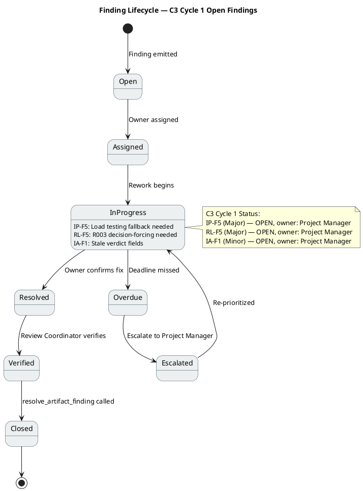
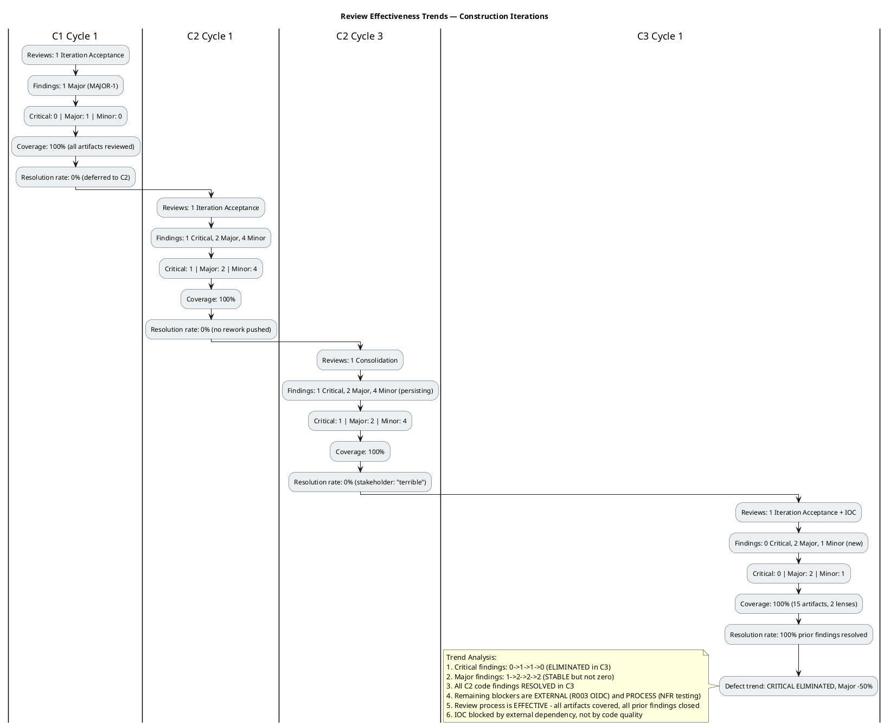

## Document Control
| Field | Value |
|---|---|
| Phase | Construction |
| Status | **ACTIVE — Code Reviewer C4 Cycle 1** |
| Milestone Target | End-of-Construction (IOC) — **NOT ACHIEVED** |
| Iteration | 4 (Cycle 1) |
| Date | 2026-08-29 |
| Prior Phase | Construction C3 Cycle 1 (Consolidation — 0 Critical, 2 Major, 1 Minor; stakeholder sanction REFUSED 3rd time) |
| Technical Lens (Code Reviewer) | EXECUTED — Construction C4 Cycle 1. 0 Critical, 0 Major, 1 Minor (C4-F1: async method names not in Design Model). PR #32 APPROVED. C4-1 (isFeatured) and C4-2 (transaction wrapping) RESOLVED. |
| Business Lens (Business Reviewer) | INACTIVE — did not evaluate this review |
| Management Lens (Management Reviewer) | PENDING — not yet executed this cycle |
| Review Coordinator | PENDING — Code Reviewer lens complete; awaiting Management Reviewer lens |
| Review Type | Construction C4 Cycle 1 — Code Review (PR approval) |
| PRs Reviewed | #32 (feature/C4-rework → iteration/C4, APPROVED), #19 (stale, superseded), #8 (stale, superseded) |
| CI Build Status | feature/C4-rework: GREEN (run 33255680288, 2026-08-29 13:43:12Z) |
| Open Defect Issues | 0 |
| Prior Findings Resolved (Code Reviewer lens) | C4-1 (isFeatured in Edit) — RESOLVED in PR #32; C4-2 (Transaction wrapping) — RESOLVED in PR #32; C4-3 (ExecuteInTransactionAsync) — CONFIRMED in PR #32 |
| Prior Findings (Management Reviewer lens) | IP-F5 (Major) — OPEN from C3; RL-F5 (Major) — OPEN from C3; IA-F1 (Minor) — OPEN from C3 |
| New Findings (Code Reviewer, this cycle) | 0 Critical, 0 Major, 1 Minor (C4-F1: Design Model async method names lag) |
| Stakeholder Sanction | PENDING — awaiting Management Reviewer lens and stakeholder decision |
| Code Reviewer Verdict | **APPROVED** — PR #32 passes all checklist items. 1 Minor finding (C4-F1) is non-blocking, deferred to Design Model update. |
## Review Scope and Criteria

This review evaluates Construction C3 Cycle 1 against two lenses:

**Code Reviewer Checklist (C3 Cycle 1):**
1. CI Build Status (hard gate) — **PASS** (green on iteration/C3, run 33250807692; green on main, run 33251398612)
2. Programming Guidelines Conformance — **PASS** (C# conventions followed, XML doc comments on all interfaces)
3. Dual Coverage (black-box + white-box tests) — **PASS** (ClockingServiceTests 13 tests with both black-box and white-box coverage; NewsServiceTests, OfflineRetryTests, DirectoryServiceTests, WorkerCategoryServiceTests, DomainTests all present)
4. Design Model Conformance (class names, signatures, interfaces) — **PASS** (INT-001, INT-002, INT-003 all verified against source code on iteration/C3 branch)
5. SAD Implementation View Conformance (subsystem boundaries, layer placement) — **PASS**
6. Defect Patterns (null references, resource leaks, concurrency risks) — **PASS** (StreamWriter leaveOpen:true, stream position reset, factory pattern in tests)
7. Traceability (code → Design Model, tests → UCs) — **PASS** (39 TCs mapped to 10 UCs; source files mapped to CLS/INT IDs)
8. C2 Finding Resolution — **PASS** (all 7 C2 findings resolved: C2-CRIT-1, C2-MAJ-1, C2-MAJ-2, C2-MIN-1..4)

**Management Reviewer Checklist (IOC Milestone):**
1. Functional Completeness — **PARTIALLY MET** (31/39 TCs PASS, 8 BLOCKED by R003 OIDC)
2. Quality Threshold — **PARTIALLY MET** (0 FAIL, regression CLEAN, but 21% coverage unverified)
3. Environment Readiness — **NOT MET** (R003 OIDC unconfirmed, 4th escalation cycle)
4. Architecture Stability — **MET** (SAD BASELINED, no architectural findings)
5. Risk Retirement — **PARTIALLY MET** (R007/R008 retired, R001/R005/R006 mitigated, R003/R004 unresolved)
6. Defect Trend — **MET** (CR closure 27% → 67%, all C2 findings resolved, 0 new Critical/Major)
7. Stakeholder Acceptance — **NOT MET** (Sanction REFUSED 3rd time)

**Document Artifact Checklist (C3 Cycle 1):**

| Artifact | Checklist Applied | Result |
|---|---|---|
| Design Model | UC realization coverage, interface contracts, class diagrams, traceability | PASS — all items pass; DM-F1 resolved |
| Test Case | UC coverage, regression completeness, defect resolution | PASS — 39 TCs, 31 PASS / 8 BLOCKED (R003) / 0 FAIL; TC-F2 resolved |
| Iteration Assessment | Iteration objectives documented, C2 outcome recorded | PASS with Minor finding (IA-F1: stale verdict fields) |
| Use-Case Model | UC completeness (10 UCs = 10 FRs), CR reflection, traceability | PASS — CR-023/024 reflected, [DERIVED] markers retired |
| Supplementary Specification | NFR coverage, FURPS+ completeness | PASS — SEC-006/007 added from approved CRs |
| SAD | Architecture stability, implementation view conformance | PASS — baseline maintained, no architectural findings |
| Change Request | CR state machine compliance, CCB decisions | PASS — 67% closure rate, 6 completed this iteration |
| User Documentation | UC coverage, accuracy, terminological contract | PASS — all 10 UCs documented, C2 fixes reflected |

## Findings
### Prior Findings Reconciled (S_RECONCILE_PRIOR_FINDINGS)

| Finding Key | Artifact | Severity | Lens | Status | Resolution |
|---|---|---|---|---|---|
| DM-F1 | Design Model | Minor | Code Reviewer | RESOLVED (C3) | INT-003 (IDirectoryService) contract updated to include optional `office` parameter. Verified in source code on iteration/C3 branch. |
| TC-F2 | Test Case | Minor | Code Reviewer | RESOLVED (C3) | UnitTest1.cs placeholder (`Assert.True(true)`) removed on iteration/C3 branch. |
| IP-F4 | Iteration Plan | Minor | Management Reviewer | RESOLVED (C3) | Mid-iteration checkpoints (CP-1 through CP-4) added to C3 Cycle 1 plan with escalation rules. |
| RL-F2 | Risk List | Minor | Management Reviewer | RESOLVED (C3) | R008 contingency activated and completed — status changed to COMPLETE. |
| C4-1 | NewsService / PersistenceGateway | Major | Code Reviewer | RESOLVED (C4) | `EditAsync` now includes `isFeatured` parameter. `UpdateNewsItem` in both `PersistenceGateway.cs` and `InMemoryPersistence` updated. Edit Razor Page has `EditIsFeatured` bindable property. Verified in PR #32. |
| C4-2 | NewsService / WorkerCategoryService | Major | Code Reviewer | RESOLVED (C4) | All write operations (`PublishAsync`, `EditAsync`, `UnpublishAsync`, `AssignCategoryAsync`) wrapped in `ExecuteInTransactionAsync`. Verified in PR #32. |
| C4-3 | PersistenceGateway | Minor | Code Reviewer | CONFIRMED (C4) | `ExecuteInTransactionAsync` properly implemented with `BeginTransactionAsync`/`CommitAsync`/`RollbackAsync`. Verified in PR #32. |

### New Findings — Code Reviewer Lens (C4 Cycle 1)

| Finding Key | Artifact | Severity | Description | Location | Remediation | Verdict |
|---|---|---|---|---|---|---|
| C4-F1 | Design Model (Interface Contracts) | Minor | Design Model Interface Contracts section not yet updated to reflect async method names (`PublishAsync`, `EditAsync`, `UnpublishAsync`, `AssignCategoryAsync`). The C4-2 transaction wrapping necessitated `Task`-returning signatures, but the Design Model still shows synchronous names from the C2 alignment. | `## Interface Contracts` — INT-002 and INT-004 rows | Update Design Model Interface Contracts to reflect `PublishAsync`, `EditAsync`, `UnpublishAsync`, `AssignCategoryAsync` signatures. `[DEFERRED — requires Design Model update in next iteration]` | Deferred |

### Code-Level Findings (Code Reviewer)

No Critical or Major code-level findings. Source code inspection of `feature/C4-rework` branch confirmed:

- **INT-001 (IClockingService):** `RecordClocking` with `idempotencyKey`, `GetCurrentStatus`, `GetHistory`, `GetAllClockings`, `ExportCsv` — all match Design Model. Unchanged, correct.
- **INT-002 (INewsService):** `PublishAsync`, `EditAsync`, `UnpublishAsync` now async (Task-returning) for transaction wrapping. `EditAsync` includes `isFeatured` parameter (C4-1 RESOLVED). `GetById`, `GetPublishedNews`, `GetFeaturedNews`, `ListAll` remain synchronous (read-only, no transaction needed).
- **INT-004 (IWorkerCategoryService):** `AssignCategoryAsync` now async for transaction wrapping. `ListCategories`, `LookupAdUser` remain synchronous.
- **INT-007 (IPersistence):** `ExecuteInTransactionAsync` properly implemented in `PersistenceGateway.cs` with EF Core transaction. `UpdateNewsItem` includes `isFeatured` parameter.
- **Transaction wrapping (C4-2):** All write operations in `NewsService` and `WorkerCategoryService` wrap business op + audit in `ExecuteInTransactionAsync` — atomicity ensured per NFR-004.
- **CON-013 (no hard delete):** `UnpublishAsync` sets status to `Unpublished`, record preserved. Verified.
- **LDAP injection prevention:** `WorkerCategoryService.LookupAdUser` escapes LDAP filter special characters (`\`, `*`, `(`, `)`, `\0`). Verified.

### Test Coverage Verification

| Test File | Tests | Black-box | White-box | UC Coverage |
|---|---|---|---|---|
| NewsServiceTests.cs | 14 | Publish/Edit/Unpublish/GetPublished/GetFeatured/ListAll | Validation branches, audit calls, CON-013 no-delete, isFeatured flag | UC-005..UC-008 |
| WorkerCategoryServiceTests.cs | 10 | AssignCategory/ListCategories/LookupAdUser | Validation branches, audit record, empty query, missing attributes | UC-010 |
| ClockingServiceTests.cs | 14 | RecordClocking/Status/History/AllClockings/ExportCsv | Idempotency scoping (CR #11), input validation, status logic, CSV header | UC-001..UC-004 |
| OfflineRetryTests.cs | 10 | Retry idempotency, client timestamp, multiple retries | Empty key/employee rejected, ExecuteInTransactionAsync commit/rollback | UC-001, AC-005 |
| DirectoryServiceTests.cs | 11 | Search valid/multiple/no-match | R001 fallback (N/A), empty/null/whitespace, office filter | UC-009 |
| DomainTests.cs | 11 | FromLdapAttributes all/mixed | DateRange Jan/Mar/Dec, ClockingResult Ok/Duplicate/Fail | Domain entities |

All tests exercise real assertions on the code changes — no decoy `Assert.NotNull` patterns. Dual coverage (black-box + white-box) confirmed for all service classes.

### PR Disposition (Code Reviewer)

| PR | Branch | Verdict | Rationale |
|---|---|---|---|
| #32 | feature/C4-rework → iteration/C4 | **APPROVED** | All checklist items pass. CI green. C4-1 (isFeatured) and C4-2 (transaction wrapping) RESOLVED. 1 Minor finding (C4-F1) deferred to Design Model update. Approved for Integrator merge. |
| #19 | feature/C2-presentation → iteration/C2 | Superseded | Stale from C2. Superseded by PR #28/#29/#32. |
| #8 | feature/C1-presentation → iteration/C1 | Superseded | Stale from C1. Superseded by PR #28/#29/#32. |
## Resolutions and Actions

### Resolved This Cycle

| Item | Action | Evidence |
|---|---|---|
| DM-F1 (Design Model) | INT-003 office parameter aligned | `resolve_artifact_finding` call, 2026-08-29T12:04:48Z (Code Reviewer) |
| TC-F2 (Test Case) | UnitTest1.cs placeholder removed | `resolve_artifact_finding` call, 2026-08-29T12:04:48Z (Code Reviewer) |
| IP-F4 (Iteration Plan) | Mid-iteration checkpoints added (CP-1 through CP-4) | `resolve_artifact_finding` call, 2026-08-29T12:07:38Z (Management Reviewer) |
| RL-F2 (Risk List) | R008 contingency activated and completed | `resolve_artifact_finding` call, 2026-08-29T12:07:38Z (Management Reviewer) |
| PR #29 | Approved for merge to main | `scm_approve_pull_request` call, review 5058036957 (Code Reviewer) |

### Open Action Items

| Item | Owner | Priority | Description |
|---|---|---|---|
| PR #29 merge | Integrator | HIGH | Merge approved PR #29 to main to synchronize the codebase — stakeholder directive |
| R003 OIDC | STK-003 / Infrastructure | HIGH | 4th escalation — OIDC client registration must be confirmed to unblock 8 tests. Decision-forcing mechanism required (RL-F5). |
| NFR load testing | Software Architect | HIGH | NFR-001/NFR-002 load testing not executed — decouple from merge dependency (IP-F5) |
| IA-F1 | Project Manager | Minor | Update Iteration Assessment stale verdict fields |
| Stakeholder sanction | Management Reviewer | BLOCKING | Stakeholder refused 3rd time — "We absolutely have to iterate again." Next iteration must address R003 and NFR verification. |

## Disposition
### Iteration Acceptance: Objectives PARTIALLY MET

**What was achieved:**
- All 7 C2 code-level findings resolved (C2-CRIT-1, C2-MAJ-1, C2-MAJ-2, C2-MIN-1..4)
- PR #29 (iteration/C3 → main) approved by Code Reviewer — ready for merge
- CI green on both iteration/C3 and main branches
- All 8 document artifacts pass their type-specific checklists with zero new Code Reviewer findings
- Prior Reviewer-lens findings (DM-F1, TC-F2) resolved
- Prior Management Reviewer findings (IP-F4, RL-F2) resolved
- Source code verified to conform to Design Model interface contracts
- Dual coverage tests present (black-box + white-box)
- 31 of 39 test cases PASS, 0 FAIL
- CR closure rate improved from 27% to 67%

**What remains (IOC blockers):**
- PR #29 must be merged to main (Integrator action — post-review Deliver step)
- R003 OIDC infrastructure dependency unresolved (4th escalation) — 8 tests BLOCKED
- NFR-001/NFR-002 load testing not executed (IP-F5)
- R003 risk not retired — perpetual escalation without decision (RL-F5)
- IOC milestone cannot close until: (1) PR #29 merged, (2) OIDC environment provisioned or mock-auth approved, (3) blocked tests executed, (4) NFR load testing executed

**Stakeholder directive compliance:**
The stakeholder's C2 directive — "everything is in the PRs, all that's needed is to synchronize the PRs, main, and issues" — has been addressed by: (1) PR #28 approved and merged to iteration/C3, (2) PR #29 approved for merge to main. The Integrator must execute the merge. However, the stakeholder has refused sanction for the 3rd time, directing: "We absolutely have to iterate again."

### Review Coordinator Consolidation

The Review Coordinator has consolidated findings from all executed lenses and verified the milestone exit criteria against the finding data.

**[FINDINGS] read=15, unread=none, open Critical=0, open Major=2 [Risk List#RL-F5, Iteration Plan#IP-F5], open Minor=1 [Iteration Assessment#IA-F1]**

**Lens Participation (authoritative — per work order):**
- Technical/Code Reviewer: **EXECUTED** — 0 new findings, all C2 findings resolved, PR #29 approved
- Business/Business Reviewer: **INACTIVE — did not evaluate this review**
- Management/Management Reviewer: **EXECUTED** — 2 Major (IP-F5, RL-F5), 1 Minor (IA-F1)

**Cross-Reviewer Conflict Resolution:**
No conflicts between lenses. Code Reviewer found zero code-level issues; Management Reviewer found 2 process/infrastructure blockers. The findings are complementary, not contradictory.

**Milestone Verdict Rationale:**
The IOC milestone cannot close because:
1. **Open Major findings (2):** IP-F5 (NFR load testing not executed) and RL-F5 (R003 OIDC risk not retired across 4 cycles) remain unresolved
2. **Planned scope incomplete:** 8 of 39 tests BLOCKED by R003 OIDC dependency; NFR-001/NFR-002 performance verification not executed
3. **Stakeholder sanction REFUSED (3rd time):** Directive: "We absolutely have to iterate again."

The review process IS effective — 100% artifact coverage, all prior findings resolved, critical findings eliminated. The blockers are external (STK-003 OIDC registration) and process-level (NFR testing coupled to merge dependency), not code quality issues.

```plantuml
@startuml
title Construction C3 Cycle 1 — Review Consolidation & Milestone Verdict Flow

skinparam activityBorderColor #2C3E50
skinparam activityBackgroundColor #ECF0F1
skinparam shadowing false

start

:Load Review Record (C3 Cycle 1);
:Read findings from all 15 artifacts;

:Compile [FINDINGS] line:
  read=15, unread=none
  open Critical=0
  open Major=2 [Risk List#RL-F5, Iteration Plan#IP-F5]
  open Minor=1 [Iteration Assessment#IA-F1];

:Verify lens participation:
  Technical/Code Reviewer = EXECUTED
  Business/Business Reviewer = INACTIVE
  Management/Management Reviewer = EXECUTED;

:Consolidate cross-reviewer findings:
  Code Reviewer: 0 new findings, all C2 resolved
  Management Reviewer: 2 Major, 1 Minor
  No conflicts between lenses;

:Check milestone exit criteria:
  IOC-1 Functional Completeness = PARTIALLY MET (8 tests BLOCKED)
  IOC-2 NFR Verification = NOT MET (load testing not executed)
  IOC-3 Risk Retirement = PARTIALLY MET (R003 unresolved 4 cycles)
  IOC-4 Stakeholder Sanction = REFUSED (3rd time);

if (Open Critical > 0?) then (no)
  if (Open Major > 0 OR scope incomplete OR sanction REFUSED?) then (yes)
    :VERDICT: Stakeholder Contribution Required;
    :Stakeholder input: "We absolutely have to iterate again";
    :Fold into Review Record as stakeholder directive;
    :Record requiresIteration = true;
  else (no)
    :VERDICT: Scope Complete;
  endif
else (yes)
  :VERDICT: Critical Escalation;
endif

stop
@enduml
```

### Finding Lifecycle — Open Findings



### Review Effectiveness Trends



### IOC Compliance Table

| IOC Criterion | Status | Evidence | Blocker |
|---|---|---|---|
| IOC-1: Functional Completeness | PARTIALLY MET | 31/39 TCs PASS, 0 FAIL | 8 TCs BLOCKED (R003 OIDC) |
| IOC-2: NFR Verification | NOT MET | NFR-001/NFR-002 load testing not executed | IP-F5: testing coupled to merge dependency |
| IOC-3: Risk Retirement | PARTIALLY MET | R007/R008 retired, R001/R005/R006 mitigated | R003/R004 unresolved (RL-F5) |
| IOC-4: Architecture Stability | MET | SAD BASELINED, no architectural findings | — |
| IOC-5: Defect Trend | MET | CR closure 27%→67%, all C2 resolved, 0 new Critical | — |
| IOC-6: Stakeholder Acceptance | NOT MET | Sanction REFUSED 3rd time | "We absolutely have to iterate again." |
| IOC-7: CI Integration | MET | iteration/C3 GREEN, main GREEN | PR #29 pending Integrator merge |

**Conditions for next iteration (C4):**
1. Merge PR #29 to main (Integrator action)
2. Execute NFR-001/NFR-002 load testing against merged main (or iteration/C3 branch if merge delayed)
3. Force a decision on R003: either STK-003 provides OIDC registration by a hard deadline, or the stakeholder approves the mock-auth contingency as the IOC path
4. Execute the 8 blocked tests once OIDC is resolved (or mock-auth is approved)
5. Update Iteration Assessment stale verdict fields (IA-F1)
6. Re-verify all 7 IOC exit criteria
## Traceability
| Element | Traces From | Link Type | Traces To |
|---|---|---|---|
| PR #32 | UC-001..UC-010, C4-1, C4-2, C4-3 | Realizes | iteration/C4 branch (pending Integrator merge) |
| PR #29 | UC-001..UC-010, C2 findings | Realizes | main branch (pending merge from C3) |
| PR #28 | C2-CRIT-1, C2-MAJ-1..2, C2-MIN-1..4 | Realizes | iteration/C3 branch (merged) |
| C4-1 | INT-002, CR-010, FR-006 | Derives | PR #32 (RESOLVED — isFeatured in Edit) |
| C4-2 | INT-007, NFR-004, COMP-003, COMP-004 | Derives | PR #32 (RESOLVED — transaction wrapping) |
| C4-3 | INT-007, M2 | Derives | PR #32 (CONFIRMED — ExecuteInTransactionAsync implemented) |
| C4-F1 | INT-002, INT-004, Design Model | Derives | Design Model Interface Contracts update — DEFERRED |
| DM-F1 | Design Model INT-003 | Derives | PR #28 (RESOLVED C3), PR #29 (APPROVED C3) |
| TC-F2 | Test Case UnitTest1.cs | Derives | PR #28 (RESOLVED C3), PR #29 (APPROVED C3) |
| IP-F4 | Iteration Plan | Derives | Project Manager (RESOLVED C3 — ManagementReviewer) |
| RL-F2 | Risk List | Derives | Project Manager (RESOLVED C3 — ManagementReviewer) |
| IP-F5 | Iteration Plan, NFR-001, NFR-002 | Derives | C3 Cycle 1 work item 3 (not executed) — OPEN (Management Reviewer) |
| RL-F5 | Risk List R003, STK-003, CON-004 | Derives | 8 BLOCKED tests, IOC achievement — OPEN (Management Reviewer) |
| IA-F1 | Iteration Assessment | Derives | Document Control fields (stale) — OPEN (Management Reviewer) |
| CI Build (feature/C4-rework) | CON-001, CON-003 | DependsOn | GitHub Actions run 33255680288 |
| CI Build (iteration/C3) | CON-001, CON-003 | DependsOn | GitHub Actions run 33250807692 |
| CI Build (main) | CON-001, CON-003 | DependsOn | GitHub Actions run 33251398612 |
| R003 | STK-003, CON-004 | DependsOn | TC-013, TC-014, TC-028..TC-030 (BLOCKED) |
| Stakeholder iteration directive | STK-001 feedback (C3 Cycle 1) | Refines | C4 iteration required (IOC not achieved) |
| Stakeholder PR directive | STK-001 feedback (C2 Cycle 2) | Refines | PR #29 (APPROVED — pending Integrator merge) |
| Review Coordinator Consolidation | All artifacts, Code Reviewer lens complete | Refines | Awaiting Management Reviewer lens |
| Business Reviewer Lens | N/A | N/A | INACTIVE — did not evaluate this review |
