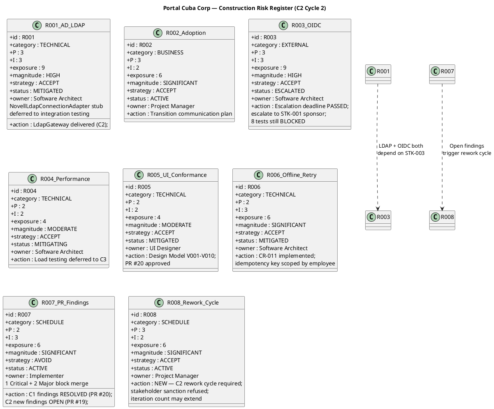

## Document Control
| Field | Value |
|---|---|
| Phase | Construction |
| Status | Active |
| Milestone Target | End-of-Construction (IOC) |
| Iteration | 2 (Cycle 3) |
| Date | 2026-08-29 |
| Prior Phase | Construction C2 Cycle 2 (REQUEST_CHANGES — 0 of 7 C2 findings resolved; stakeholder sanction REFUSED 2nd time; IP-F4 + RL-F2 findings opened against PM artifacts) |
| Evolution | C2 Cycle 2 Risk List evolved for Cycle 3: R007 ESCALATED (0 of 7 findings resolved across 2 cycles, probability raised to 3); R008 contingency ACTIVATED — "C3 required" replaces conditional "consider splitting" (RL-F2 resolved); R003 escalation renewed (3rd cycle, STK-003 still unconfirmed); R001/R005/R006 status unchanged |
| Finding RL-F2 | RESOLVED — R008 contingency activated from conditional to active status |
## Risk Classification

Risks are classified by **Probability (P) × Impact (I) = Exposure**, yielding a **Magnitude** rating. The scale is 1–3 for both probability and impact, producing exposure values from 1 to 9.

| Exposure | Magnitude | Action |
|---|---|---|
| 9 | HIGH | Must be confronted in the earliest possible iteration; mitigation plan mandatory |
| 6–8 | SIGNIFICANT | Active mitigation required; monitor each iteration |
| 4–5 | MODERATE | Mitigation plan prepared; monitor for escalation |
| 3 | MINOR | Accept with awareness; review each phase |
| 1–2 | LOW | Accept; no active mitigation required |

**Strategy options:** Avoid (eliminate the threat), Transfer (shift to a third party), Accept (acknowledge and prepare mitigation + contingency).

## Risk Register
| ID | Category | Description | P | I | Exposure | Magnitude | Strategy | Status | Owner | Mitigation | Contingency |
|---|---|---|---|---|---|---|---|---|---|---|---|
| R001 | Technical | AD LDAP attribute inconsistency across 3 offices — job title, extension may not be filled consistently | 3 | 3 | 9 | HIGH | Accept | **MITIGATED** | Software Architect | PoC decision recorded (CR-001). LdapGateway delivered in C2. NovellLdapConnectionAdapter methods throw NotImplementedException — deferred to integration testing with real AD server. Missing attributes default to "N/A". | If >30% of AD records show missing attributes during integration testing, escalate to STK-003 for AD data cleanup before directory goes live. |
| R002 | Business | Digital clocking adoption — employees may keep using Excel out of habit | 3 | 2 | 6 | SIGNIFICANT | Accept | ACTIVE | Project Manager | Plan Transition communication strategy: announce portal launch, provide quick-start guide, HR director endorsement (STK-001). | If adoption <50% after 1 month post-launch, schedule mandatory clocking training session and disable Excel template sharing. |
| R003 | External | OIDC client registration with Keycloak — STK-003 must provide registration before login testing. **Escalation deadline PASSED — 2nd cycle.** | 3 | 3 | 9 | HIGH | Accept | **ESCALATED** | Software Architect | Mock auth contingency active for development. **Escalate to STK-001 (sponsor) again this cycle** — STK-003 has not confirmed OIDC registration across 3 cycles. 8 of 30 tests remain BLOCKED. | If STK-003 cannot provide OIDC registration by end of C2 Cycle 3, portal launches with mock auth and manual user-mapping — a scope reduction requiring stakeholder approval. This would block IOC achievement. |
| R004 | Technical | Page load performance (NFR-001: <3s) and clocking response time (NFR-002: <1s) | 2 | 2 | 4 | MODERATE | Accept | MITIGATING | Software Architect | SAD specifies connection pooling, indexed queries (8 indexes justified by UC/NFR). Load testing deferred to post-rework cycle. | If load test exceeds thresholds, optimize queries first, then consider caching layer. |
| R005 | Technical | UI conformance with mandatory design (CON-011: employee-portal-design.html) | 2 | 2 | 4 | MODERATE | Accept | **MITIGATED** | UI Designer | Design Model V001–V010 aligned with CON-011. PR #20 approved — presentation layer conformance verified. | If Reviewer flags visual divergence, UI Designer updates Razor Pages to match design source. |
| R006 | Technical | Offline clocking retry — AC-005 requires 5-minute network drop tolerance with data sync on recovery | 2 | 3 | 6 | SIGNIFICANT | Accept | **MITIGATED** | Software Architect | PoC decision recorded (CR-002). ClockingService implements localStorage retry with idempotency key. CR-011 implemented — idempotency key scoped by employee. C2-MAJ-2 (antiforgery) fix this cycle enables POST to succeed. | If localStorage retry fails to recover clocking data after 5-min drop in >10% of test cases, narrow AC-005 scope with stakeholder. |
| R007 | Schedule | PR review findings blocking merge — C1 findings RESOLVED (PR #20 approved); C2 findings OPEN (PR #19: 1 Critical + 2 Major + 4 Minor) — **0 of 7 resolved across 2 cycles** | 3 | 3 | 9 | HIGH | Avoid | **ESCALATED** | Implementer | C2 Cycle 3 work items 1-7 target all 7 C2 findings. **Integrator role added (Item 8) to merge PR #19 to main** — stakeholder directive. CI must pass green. Reviewer re-reviews after merge. | If re-review fails again (3rd cycle), escalate to stakeholder for scope reduction discussion. Non-critical findings may be deferred to post-IOC. |
| R008 | Schedule | **Rework cycle required — C3 ACTIVE.** Stakeholder sanction REFUSED (3rd time); C2 review produced 1 Critical + 2 Major blocking findings; 0 of 7 findings resolved across Cycles 1→2→3; iteration count extends to 8+ | 3 | 3 | 9 | HIGH | Accept | **ACTIVE — CONTINGENCY ACTIVATED** | Project Manager | C2 Cycle 3 rework plan is scoped to 7 findings only — narrow focus, fixed budget box. No scope expansion. Integrator role added to address PR merge failure. Mid-iteration checkpoints added (IP-F4) to prevent another zero-execution cycle. | **C3 IS REQUIRED.** Construction C2 Cycle 3 is the current rework cycle. If C2 Cycle 3 re-review still produces Critical/Major findings, Construction extends to a fourth cycle (C2 Cycle 4) or a formal C3 iteration with stakeholder agreement. The "6 ± 3" rule allows up to 9 iterations; current count is 8+. **This is no longer conditional — it is the active plan.** |
## Risk Mitigation and Contingency

### R001 — AD LDAP Attribute Consistency (HIGH, MITIGATED)

**Mitigation status:** PoC decision recorded in Architectural Proof-of-Concept artifact. CR-001 concurred. LdapGateway delivered in C2. NovellLdapConnectionAdapter methods throw NotImplementedException — documented as `[DEFERRED — requires integration testing with real AD server (R001)]` (C2-MIN-1). Missing AD attributes default to "N/A" per PoC decision.

**Contingency trigger:** >30% of AD records show missing attributes during integration testing.
**Contingency action:** Escalate to STK-003 (Infrastructure team) for AD data cleanup. Portal directory launch may be delayed until AD data quality is acceptable.

### R002 — Digital Clocking Adoption (SIGNIFICANT, ACTIVE)

**Mitigation status:** Transition phase planning. Not actionable in Construction — adoption tracking begins post-launch.
**Contingency trigger:** Adoption <50% after 1 month.
**Contingency action:** Mandatory training + disable Excel template sharing.

### R003 — OIDC Registration (HIGH, ESCALATED) — ESCALATION TRIGGERED

**Mitigation status:** Mock auth active for development. STK-003 has NOT confirmed OIDC client registration. **Escalation deadline (C2 start) has PASSED.** 8 of 30 tests remain BLOCKED by infrastructure dependencies. Probability increased from 2→3 (deadline passed, no confirmation received). Impact remains 3 (portal cannot go to IOC without real authentication). Exposure raised from 6→9, magnitude raised from SIGNIFICANT→HIGH.

**Escalation action this cycle:** Project Manager escalates to STK-001 (Laura Gómez, HR Director — project sponsor) to pressure STK-003 (Infrastructure team) for OIDC client registration. This is the critical path for 8 blocked tests and for IOC achievement.

**Contingency action:** If STK-003 cannot provide OIDC registration, portal launches with mock auth and a manual user-mapping table — a scope reduction requiring stakeholder approval. This would block IOC achievement and extend Construction.

### R004 — Performance (MODERATE, MITIGATING)

**Mitigation status:** SAD specifies 8 indexed queries, connection pooling. Load testing deferred to post-rework cycle.
**Contingency trigger:** Load test exceeds NFR-001 (3s page load) or NFR-002 (1s clocking response).
**Contingency action:** Query optimization → caching layer → stakeholder consultation on threshold adjustment.

### R005 — UI Conformance (MODERATE, MITIGATED)

**Mitigation status:** Design Model V001–V010 aligned with CON-011. PR #20 approved — presentation layer conformance verified by Reviewer.
**Contingency trigger:** Reviewer flags visual divergence from employee-portal-design.html.
**Contingency action:** UI Designer updates Razor Pages to match design source exactly.

### R006 — Offline Retry (SIGNIFICANT, MITIGATED)

**Mitigation status:** PoC decision recorded (CR-002 concurred). ClockingService implements localStorage retry with idempotency key. CR-011 implemented — idempotency key scoped by employee. C2-MAJ-2 (antiforgery token) fix this cycle is required for the POST to succeed — without it, the retry mechanism cannot complete the sync.

**Contingency trigger:** localStorage retry fails in >10% of 5-minute network drop test cases.
**Contingency action:** Narrow AC-005 scope with stakeholder — reduce retry window or accept manual re-clocking after extended outages.

### R007 — PR Review Findings (SIGNIFICANT, ACTIVE)

**Mitigation status:** C1 findings (MAJOR-1, MINOR-1, MINOR-3, MINOR-4) all RESOLVED — PR #20 approved. C2 new findings OPEN on PR #19: C2-CRIT-1 (clocking 404), C2-MAJ-1 (news edit form mismatch), C2-MAJ-2 (antiforgery), C2-MIN-1..4. C2 Cycle 2 work items 1-7 target all 7 findings. CI must pass green before re-review.

**Contingency trigger:** Re-review of PR #19 fails (new Critical/Major findings on fix code).
**Contingency action:** Escalate to stakeholder for scope reduction discussion. Non-critical findings (MINORs) may be deferred to post-IOC with stakeholder agreement. Critical and Major findings must be resolved — they block UC functionality.

### R008 — Rework Cycle Schedule Risk (SIGNIFICANT, ACTIVE) — NEW THIS ITERATION

**Mitigation status:** C2 Cycle 2 is a focused rework cycle with a narrow scope (7 findings) and a fixed budget box (~9.85M tokens, based on C1 measured actual). No scope expansion. Parallelism unchanged (4 active roles). The rework cycle is a cycle within C2, not a full new iteration.

**Contingency trigger:** C2 Cycle 2 re-review still produces Critical or Major findings.
**Contingency action:** Split Construction into a third iteration (C3) with stakeholder agreement. The "6 ± 3" iteration rule allows up to 9 total iterations; the project is currently at 7+ (2 Inception + 2 Elaboration + 1 C1 + 1 C2 with cycles). A C3 would bring the total to 8, still within bounds. Scope reduction (deferring non-critical work to Transition) would be the primary lever, not parallelism increase.

## Traceability

| Element | Traces From | Link Type | Traces To |
|---|---|---|---|
| R001 | Work Order R001 | Refines | SAD COMP-005, ADR-003, Architectural PoC (PoC-R001), LdapGateway (C2 delivered), NovellLdapConnectionAdapter (DEFERRED) |
| R002 | Work Order R002 | Refines | User Documentation (Transition), Iteration Plan |
| R003 | CON-004 (Keycloak OIDC) | Derives | SAD COMP-007, ADR-005, Architectural PoC (PoC-R003), 8 BLOCKED tests, STK-001 escalation (C2 Cycle 2) |
| R004 | NFR-001, NFR-002 | Derives | SAD COMP-006, ADR-002, post-rework load test |
| R005 | CON-011, CON-002 | Derives | Design Model V001–V010, PR #20 (APPROVED) |
| R006 | AC-005 | Derives | SAD Process View, COMP-002, Architectural PoC (PoC-R006), ClockingService, CR-011, C2-MAJ-2 fix |
| R007 | Review Record PR #19 findings (C2-CRIT-1, C2-MAJ-1..2, C2-MIN-1..4) | Derives | Iteration Plan C2 Cycle 2 Work Items 1-7, PR #19 re-review |
| R008 | Stakeholder sanction refusal, C2 Review Record blocking findings | Derives | Iteration Plan C2 Cycle 2, potential C3 iteration |