## Document Control

| Field | Value |
|---|---|
| Phase | Transition |
| Status | Active |
| Milestone Target | Product Release (PR) — **NOT YET ACHIEVED** |
| Iteration | 1 (Cycle 1) |
| Date | 2026-08-29 |
| Prior Phase | Construction C4 Cycle 1 — R003 ACCEPTED (mock-auth); R004 deferred to Transition (measured values required); R007 RESOLVED; R008 COMPLETE; R001/R002/R005/R006 unchanged |
| Evolution | Transition Iter 1 Risk List evolved from Construction C4. R003 transition action: real OIDC verification. R004 transition action: load testing with measured values. R005/R006/R007: verify in deployment. R008: fulfill 3 binding conditions. New risks: R009 (deployment to Windows Server) and R010 (user acceptance / AC verification). |

## Risk Classification

Risks are classified by **Probability (P) × Impact (I) = Exposure**, yielding a **Magnitude** rating. The scale is 1–3 for both probability and impact, producing exposure values from 1 to 9.

| Exposure | Magnitude | Action |
|---|---|---|
| 9 | HIGH | Must be confronted in the earliest possible iteration; mitigation plan mandatory |
| 6–8 | SIGNIFICANT | Active mitigation required; monitor each iteration |
| 4–5 | MODERATE | Mitigation plan prepared; monitor for escalation |
| 3 | MINOR | Accept with awareness; review each phase |
| 1–2 | LOW | Accept; no active mitigation required |

**Strategy options:** Avoid (eliminate the threat), Transfer (shift to a third party), Accept (acknowledge and prepare mitigation + contingency).

## Risk Register

```plantuml
@startuml
title Portal Cuba Corp — Transition Risk Register

skinparam classAttributeIconSize 0
skinparam classBackgroundColor #F0F4FF
skinparam classBorderColor #336699

class R001_AD_LDAP {
  + id : R001
  + P : 3
  + I : 3
  + exposure : 9
  + magnitude : HIGH
  + strategy : Accept
  + status : MONITORING
  + owner : Software Architect
  + mitigation : LDAP attribute mapping verified in Elaboration PoC
  + contingency : Manual AD attribute fix via Infra team
  + transition_action : Verify directory display in deployment env
}

class R002_Adoption {
  + id : R002
  + P : 3
  + I : 2
  + exposure : 6
  + magnitude : SIGNIFICANT
  + strategy : Accept
  + status : ACTIVE
  + owner : Project Manager
  + mitigation : User documentation + stakeholder communication
  + contingency : Targeted training session for low-adoption offices
  + transition_action : User docs finalized, adoption tracking plan
}

class R003_OIDC {
  + id : R003
  + P : 3
  + I : 3
  + exposure : 9
  + magnitude : HIGH
  + strategy : Accept
  + status : ACCEPTED — mock-auth active
  + owner : Software Architect
  + mitigation : Mock-auth activated per STK-001
  + contingency : Real OIDC is Transition work item
  + transition_action : Real OIDC client registration and verification
}

class R004_NFR_Performance {
  + id : R004
  + P : 2
  + I : 3
  + exposure : 6
  + magnitude : SIGNIFICANT
  + strategy : Accept
  + status : ACTIVE — Transition exit criterion
  + owner : Test Manager
  + mitigation : Load testing in Transition Iter 1
  + contingency : Performance optimization sprint if thresholds not met
  + transition_action : Measured values for NFR-001 and NFR-002
}

class R005_Design_Conformance {
  + id : R005
  + P : 1
  + I : 2
  + exposure : 2
  + magnitude : LOW
  + strategy : Accept
  + status : RESOLVED
  + owner : UI Designer
  + mitigation : Design Model V010 matches CON-011
  + contingency : N/A
  + transition_action : Verify in deployment
}

class R006_Offline_Sync {
  + id : R006
  + P : 2
  + I : 3
  + exposure : 6
  + magnitude : SIGNIFICANT
  + strategy : Accept
  + status : RESOLVED — PoC verified
  + owner : Software Architect
  + mitigation : ClockingService transaction wrapping verified
  + contingency : N/A
  + transition_action : Verify in deployment env
}

class R007_Code_Quality {
  + id : R007
  + P : 1
  + I : 3
  + exposure : 3
  + magnitude : MINOR
  + strategy : Accept
  + status : RESOLVED
  + owner : Implementer
  + mitigation : All PRs merged, CI green
  + contingency : N/A
  + transition_action : Monitor CI in deployment
}

class R008_Stakeholder_Sanction {
  + id : R008
  + P : 1
  + I : 3
  + exposure : 3
  + magnitude : MINOR
  + strategy : Accept
  + status : COMPLETE
  + owner : Project Manager
  + mitigation : Sanction GRANTED with 3 binding conditions
  + contingency : N/A
  + transition_action : Fulfill 3 binding conditions for PR
}

class R009_Deployment {
  + id : R009
  + P : 2
  + I : 3
  + exposure : 6
  + magnitude : SIGNIFICANT
  + strategy : Accept
  + status : NEW — Transition risk
  + owner : Software Architect
  + mitigation : Deployment verification on internal Windows Server
  + contingency : Rollback to last known good if deployment fails
  + transition_action : Verify portal accessible from all 3 offices
}

class R010_User_Acceptance {
  + id : R010
  + P : 2
  + I : 3
  + exposure : 6
  + magnitude : SIGNIFICANT
  + strategy : Accept
  + status : NEW — Transition risk
  + owner : Project Manager
  + mitigation : AC-001 through AC-005 verification
  + contingency : Targeted rework if acceptance criteria not met
  + transition_action : Stakeholder sign-off on acceptance criteria
}

R001_AD_LDAP --> R009_Deployment : "verified in deployment"
R003_OIDC --> R009_Deployment : "OIDC client must exist"
R004_NFR_Performance --> R010_User_Acceptance : "performance affects adoption"
R002_Adoption --> R010_User_Acceptance : "adoption is acceptance criterion"

@enduml
```

## Risk Mitigation and Contingency

| Risk | P | I | Exposure | Magnitude | Strategy | Status | Owner | Mitigation | Contingency | Transition Action |
|---|---|---|---|---|---|---|---|---|---|---|
| R001 | 3 | 3 | 9 | HIGH | Accept | MONITORING | Software Architect | LDAP attribute mapping verified in Elaboration PoC | Manual AD attribute fix via Infra team (CON-010) | Verify directory display in deployment env across 3 offices |
| R002 | 3 | 2 | 6 | SIGNIFICANT | Accept | ACTIVE | Project Manager | User documentation + stakeholder communication | Targeted training session for low-adoption offices | User docs finalized; adoption tracking plan for BG-003 (80% in 3 months) |
| R003 | 3 | 3 | 9 | HIGH | Accept | ACCEPTED — mock-auth active | Software Architect | Mock-auth activated per STK-001 | Real OIDC is Transition work item (binding condition #2) | Real OIDC client registration and login flow verification; mock-auth expiry date documented |
| R004 | 2 | 3 | 6 | SIGNIFICANT | Accept | ACTIVE — Transition exit criterion | Test Manager | Load testing in Transition Iter 1 | Performance optimization sprint if thresholds not met | Measured values for NFR-001 (< 3s) and NFR-002 (< 1s) — binding condition #1 |
| R005 | 1 | 2 | 2 | LOW | Accept | RESOLVED | UI Designer | Design Model V010 matches CON-011 | N/A | Verify visual conformance in deployment |
| R006 | 2 | 3 | 6 | SIGNIFICANT | Accept | RESOLVED — PoC verified | Software Architect | ClockingService transaction wrapping verified | N/A | Verify offline sync (AC-005) in deployment env |
| R007 | 1 | 3 | 3 | MINOR | Accept | RESOLVED | Implementer | All PRs merged, CI green (run 33256627567) | N/A | Monitor CI in deployment |
| R008 | 1 | 3 | 3 | MINOR | Accept | COMPLETE | Project Manager | Sanction GRANTED with 3 binding conditions | N/A | Fulfill 3 binding conditions for PR milestone |
| R009 | 2 | 3 | 6 | SIGNIFICANT | Accept | NEW | Software Architect | Deployment verification on internal Windows Server (CON-006) | Rollback to last known good if deployment fails | Verify portal accessible from all 3 offices on corporate network (CON-007) |
| R010 | 2 | 3 | 6 | SIGNIFICANT | Accept | NEW | Project Manager | AC-001 through AC-005 verification | Targeted rework if acceptance criteria not met | Stakeholder sign-off on all 5 acceptance criteria for PR milestone |

### Risk Summary by Magnitude

| Magnitude | Count | Risks |
|---|---|---|
| HIGH | 2 | R001, R003 |
| SIGNIFICANT | 5 | R002, R004, R006, R009, R010 |
| MINOR | 2 | R007, R008 |
| LOW | 1 | R005 |
| **Total** | **10** | |

### Transition Risk Focus

The two HIGH risks (R001, R003) and the Transition-specific SIGNIFICANT risks (R004, R009, R010) dominate this iteration's risk landscape. R003 and R004 are directly tied to stakeholder binding conditions — failure to address them blocks the PR milestone. R009 and R010 are new risks introduced by the Transition phase itself: deployment to the production environment and user acceptance verification.

## Traceability

| Element | Traces From | Link Type | Traces To |
|---|---|---|---|
| R001 | Declared Risk R001, CON-005, CON-009 | Derives | T4 (deployment verification), SAD COMP-004 (LDAP) |
| R002 | Declared Risk R002, BG-003, AC-004 | Derives | T5 (user docs), T6 (assessment) |
| R003 | CON-004, STK-003, STK-001 binding condition #2 | Derives | T2 (OIDC verification), SAD COMP-001 (OIDC) |
| R004 | NFR-001, NFR-002, STK-001 binding condition #1 | Derives | T1 (load testing), SAD COMP-006 |
| R005 | CON-011, CON-002 | Derives | Design Model V010, T4 (deployment) |
| R006 | AC-005, SAD Process View | Derives | T4 (deployment), Architectural PoC |
| R007 | Review Record C2 + C4 findings | Derives | CI build (run 33256627567) |
| R008 | Stakeholder sanction (IOC) | Derives | T6 (assessment), PR milestone |
| R009 | CON-006, CON-007 | Derives | T4 (deployment verification) |
| R010 | AC-001–AC-005, BG-003 | Derives | T6 (assessment), PR milestone review |