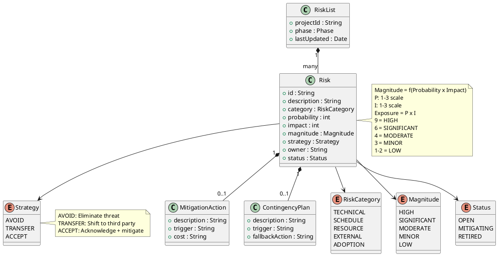

## Document Control

| Field | Value |
|---|---|
| Phase | Inception |
| Status | Draft |
| Milestone Target | End-of-Inception (LCO) |
| Iteration | 1 (Cycle 1) |
| Date | 2026-08-28 |

## Risk Classification

Risks are classified by **Probability (P) × Impact (I) = Exposure**, yielding a **Magnitude** rating. The scale is 1–3 for both probability and impact, producing exposure values from 1 to 9.

| Exposure | Magnitude | Action |
|---|---|---|
| 9 | HIGH | Must be confronted in the earliest possible iteration; mitigation plan mandatory |
| 6–8 | SIGNIFICANT | Active mitigation required; monitor each iteration |
| 4–5 | MODERATE | Mitigation plan prepared; monitor for escalation |
| 3 | MINOR | Accept with awareness; review each phase |
| 1–2 | LOW | Accept; no active mitigation required |

**Strategy options:** Avoid (eliminate the threat), Transfer (shift to a third party), Accept (acknowledge and prepare mitigation + contingency).

## Risk Register

| ID | Description | Category | P | I | Exposure | Magnitude | Strategy | Owner | Status |
|---|---|---|---|---|---|---|---|---|---|
| R001 | Active Directory LDAP attributes (job title, extension) may not be filled consistently across the 3 offices. If not tested early the directory shows gaps. | TECHNICAL | 3 | 3 | 9 | HIGH | ACCEPT | Project Manager | OPEN |
| R002 | Digital clocking adoption: some employees may keep using Excel out of habit if the change is not communicated well. | ADOPTION | 3 | 2 | 6 | SIGNIFICANT | ACCEPT | Project Manager | OPEN |
| R003 | Keycloak OIDC client registration may not be ready when login testing begins. The Infrastructure team (STK-003) operates Keycloak and must register the portal as an OIDC client before any login flow can be tested. | EXTERNAL | 2 | 3 | 6 | SIGNIFICANT | ACCEPT | Project Manager | OPEN |
| R004 | PostgreSQL on internal Windows Server may have configuration or performance issues under concurrent load (200 users clocking in the same 7:00–9:00 window). | TECHNICAL | 2 | 2 | 4 | MODERATE | ACCEPT | Project Manager | OPEN |
| R005 | The mandatory custom UI design (CON-011) may contain elements that are difficult to implement with Razor Pages server-side rendering, requiring design compromises. | TECHNICAL | 2 | 2 | 4 | MODERATE | ACCEPT | Project Manager | OPEN |
| R006 | AC-005 requires temporary offline operation with data sync on network recovery. This is a non-trivial requirement for a server-rendered intranet app and may need architectural investigation. | TECHNICAL | 2 | 3 | 6 | SIGNIFICANT | ACCEPT | Project Manager | OPEN |

## Risk Mitigation and Contingency

### R001 — AD LDAP Attribute Inconsistency (HIGH, Exposure=9)

**Declared risk from Work Order.**

- **Mitigation:** Schedule an early LDAP attribute audit in Elaboration Iteration 1 — query AD across all 3 offices to verify that job title, department, office, email, and extension fields are populated. Identify gaps and coordinate with the Infrastructure team (STK-003) to fill missing attributes in AD. The Architectural PoC trigger (currently NOT TRIGGERED in Inception) should be re-evaluated in Elaboration specifically for this risk.
- **Contingency:** If attributes are inconsistent and cannot be remediated in AD, the directory view degrades gracefully — display "Not available" for missing fields rather than showing blank rows. This is a fallback, not the target state.
- **Trigger for contingency:** LDAP audit reveals >10% of records with missing mandatory fields AND Infrastructure team cannot remediate within the Elaboration phase.

### R002 — Digital Clocking Adoption (SIGNIFICANT, Exposure=6)

**Declared risk from Work Order.**

- **Mitigation:** Plan for user documentation and a communication plan as part of Transition phase activities. The portal UI (CON-011 mandatory design) must make clocking prominent and obvious on the main screen. BG-003 (80% adoption in 3 months) is the success metric.
- **Contingency:** If adoption falls below 60% after 6 weeks, escalate to STK-001 (HR Director) for a mandatory communication campaign. Consider disabling the Excel sheet sharing to force migration.
- **Trigger for contingency:** Adoption tracking shows <60% of employees have clocked at least once after 6 weeks post-launch.

### R003 — Keycloak OIDC Client Registration Delay (SIGNIFICANT, Exposure=6)

- **Mitigation:** Request OIDC client registration from STK-003 (Infrastructure team) at the start of Elaboration, before any login-dependent testing is scheduled. Track as an external dependency in the Iteration Plan. The portal can be developed with mock authentication until the client is registered.
- **Contingency:** If the OIDC client is not registered by Elaboration Iteration 2, develop and test with a local mock identity provider. Switch to Keycloak when registration completes. This adds rework but does not block development.
- **Trigger for contingency:** STK-003 has not confirmed client registration by the start of Elaboration Iteration 2.

### R004 — PostgreSQL Concurrent Load (MODERATE, Exposure=4)

- **Mitigation:** Design the clocking endpoint for minimal write latency (single-row insert). Plan a load test in Construction that simulates 200 concurrent clock-in requests within a 2-hour window (7:00–9:00). NFR-002 (1-second response) is the pass criterion.
- **Contingency:** If load testing reveals latency >1s, add connection pooling tuning and consider a write-optimized index strategy. Worst case, queue clocking requests with a lightweight in-memory buffer.
- **Trigger for contingency:** Load test P95 latency exceeds 1 second for the clock-in endpoint.

### R005 — Mandatory UI Design Implementation (MODERATE, Exposure=4)

- **Mitigation:** The UI Designer reviews the mandatory design (CON-011) against Razor Pages capabilities during Elaboration. Any elements requiring client-side interactivity are identified early and implemented with minimal JavaScript augmentations to the server-rendered pages.
- **Contingency:** If specific design elements cannot be faithfully reproduced in Razor Pages, document the deviation and escalate to STK-001 for acceptance. The design is mandatory but the implementation technology is constrained to Razor Pages (CON-002).
- **Trigger for contingency:** UI Designer identifies >3 design elements that cannot be implemented with Razor Pages + minimal JS.

### R006 — Offline Operation Requirement (SIGNIFICANT, Exposure=6)

- **Mitigation:** AC-005 requires the system to work temporarily offline (5-minute network drop) with data sync on recovery. This needs architectural investigation in Elaboration — the Software Architect must design a local buffering mechanism for clocking operations that queues writes and flushes when the network recovers. This is a cross-cutting technical mechanism, not a use case.
- **Contingency:** If a full offline-sync mechanism proves too complex for the timeline, propose a reduced scope: clocking operations are buffered client-side in the browser (localStorage) and submitted on reconnection. This covers the 5-minute drop scenario without a full sync infrastructure.
- **Trigger for contingency:** Architectural investigation in Elaboration determines that server-side offline sync requires >1 iteration of effort.

## Traceability

| Element | Traces From | Link Type | Traces To |
|---|---|---|---|
| R001 | Work Order R001 | Refines | Architectural PoC re-evaluation (Elaboration) |
| R002 | Work Order R002 | Refines | User Documentation (Transition), Iteration Plan |
| R003 | CON-004 (Keycloak OIDC) | Derives | Iteration Plan (external dependency) |
| R004 | NFR-002, NFR-003 | Derives | Software Architecture Document, Iteration Plan |
| R005 | CON-011, CON-002 | Derives | UI Design artifacts, Iteration Plan |
| R006 | AC-005 | Derives | Software Architecture Document, Iteration Plan |