## Document Control

| Field | Value |
|---|---|
| Phase | Construction |
| Status | Active |
| Milestone Target | End-of-Construction (IOC) |
| Iteration | 1 (Cycle 1) |
| Date | 2026-08-28 |
| Prior Phase | Elaboration (LCA achieved, 0 open Critical/Major, stakeholder sanction GRANTED) |
| Evolution | Elaboration Iter 2 Risk List evolved for Construction Iter 1: R001/R006 status confirmed MITIGATED (PoC decisions recorded); R003 MONITORING (escalation deadline C2); R007 added (new schedule risk from PR #8 Review Record findings — MAJOR-1 blocks merge); R004/R005 status updated for Construction context |
| Review Finding Addressed | No PM-artifact findings in Review Record; R007 added as new risk from Implementer's PR #8 findings |

## Risk Classification

Risks are classified by **Probability (P) × Impact (I) = Exposure**, yielding a **Magnitude** rating. The scale is 1–3 for both probability and impact, producing exposure values from 1 to 9.

| Exposure | Magnitude | Action |
|---|---|---|
| 9 | HIGH | Must be confronted in the earliest possible iteration; mitigation plan mandatory |
| 6–8 | SIGNIFICANT | Active mitigation required; monitor each iteration |
| 4–5 | MODERATE | Mitigation plan prepared; monitor for escalation |
| 3 | MINOR | Accept with awareness; review each phase |
| 1–2 | LOW | Accept; no active mitigation required |

**Strategy options:** Avoid (eliminate the threat), Transfer (shift to a third party), Accept (acknowledge and prepare mitigation + contingency).

```plantuml
@startuml
title Portal Cuba Corp — Construction Risk Register (Iter 1)

skinparam classAttributeIconSize 0

class R001_AD_LDAP {
  + id : R001
  + category : TECHNICAL
  + P : 3
  + I : 3
  + exposure : 9
  + magnitude : HIGH
  + strategy : ACCEPT
  + status : MITIGATED
  + owner : Software Architect
  + action : Execute PoC decision CR-001
}

class R002_Adoption {
  + id : R002
  + category : BUSINESS
  + P : 3
  + I : 2
  + exposure : 6
  + magnitude : SIGNIFICANT
  + strategy : ACCEPT
  + status : ACTIVE
  + owner : Project Manager
  + action : Plan Transition comms
}

class R003_OIDC {
  + id : R003
  + category : EXTERNAL
  + P : 2
  + I : 3
  + exposure : 6
  + magnitude : SIGNIFICANT
  + strategy : ACCEPT
  + status : MONITORING
  + owner : Software Architect
  + action : Escalate if not confirmed by C2
}

class R004_Performance {
  + id : R004
  + category : TECHNICAL
  + P : 2
  + I : 2
  + exposure : 4
  + magnitude : MODERATE
  + strategy : ACCEPT
  + status : MITIGATING
  + owner : Software Architect
  + action : Load test in C2
}

class R005_UI_Conformance {
  + id : R005
  + category : TECHNICAL
  + P : 2
  + I : 2
  + exposure : 4
  + magnitude : MODERATE
  + strategy : ACCEPT
  + status : MITIGATING
  + owner : UI Designer
  + action : Verify CON-011 compliance
}

class R006_Offline {
  + id : R006
  + category : TECHNICAL
  + P : 2
  + I : 3
  + exposure : 6
  + magnitude : SIGNIFICANT
  + strategy : ACCEPT
  + status : MITIGATED
  + owner : Software Architect
  + action : Execute PoC decision CR-002
}

class R007_Review_Findings {
  + id : R007
  + category : SCHEDULE
  + P : 2
  + I : 3
  + exposure : 6
  + magnitude : SIGNIFICANT
  + strategy : AVOID
  + status : ACTIVE
  + owner : Implementer
  + action : Fix MAJOR-1 + 4 MINORs
  + trigger : PR #8 re-review fails
  + contingency : Defer remaining to C2
}

R001_AD_LDAP -- R002_Adoption
R002_Adoption -- R003_OIDC
R003_OIDC -- R004_Performance
R004_Performance -- R005_UI_Conformance
R005_UI_Conformance -- R006_Offline
R006_Offline -- R007_Review_Findings

@enduml
```

## Risk Register

| ID | Category | Description | P | I | Exposure | Magnitude | Strategy | Status | Owner | Mitigation | Contingency |
|---|---|---|---|---|---|---|---|---|---|---|---|
| R001 | Technical | AD LDAP attribute inconsistency across 3 offices — job title, extension may not be filled consistently | 3 | 3 | 9 | HIGH | Accept | **MITIGATED** | Software Architect | PoC decision recorded (CR-001 concurred): single-mechanism LDAP query with "N/A" fallback for missing attributes. LdapGateway implementation this iteration. | If >30% of AD records show missing attributes, escalate to STK-003 for AD data cleanup before directory goes live. |
| R002 | Business | Digital clocking adoption — employees may keep using Excel out of habit | 3 | 2 | 6 | SIGNIFICANT | Accept | ACTIVE | Project Manager | Plan Transition communication strategy: announce portal launch, provide quick-start guide, HR director endorsement (STK-001). | If adoption <50% after 1 month post-launch, schedule mandatory clocking training session and disable Excel template sharing. |
| R003 | External | OIDC client registration with Keycloak — STK-003 must provide registration before login testing | 2 | 3 | 6 | SIGNIFICANT | Accept | **MONITORING** | Software Architect | Mock auth contingency active for development. PoC mode analysis-only. Coordinate with STK-003 for registration. | **Escalation deadline: Construction Iter 2.** If STK-003 has not confirmed OIDC registration by C2 start, escalate to STK-001 (sponsor). Portal cannot go to IOC without real authentication. |
| R004 | Technical | Page load performance (NFR-001: <3s) and clocking response time (NFR-002: <1s) | 2 | 2 | 4 | MODERATE | Accept | MITIGATING | Software Architect | SAD specifies connection pooling, indexed queries (8 indexes justified by UC/NFR). Load testing planned for C2. | If load test exceeds thresholds, optimize queries first, then consider caching layer. |
| R005 | Technical | UI conformance with mandatory design (CON-011: employee-portal-design.html) | 2 | 2 | 4 | MODERATE | Accept | MITIGATING | UI Designer | Design Model carries V001–V010 page models aligned with CON-011. Presentation layer implemented in PR #8. | If Reviewer flags visual divergence, UI Designer updates Razor Pages to match design source. |
| R006 | Technical | Offline clocking retry — AC-005 requires 5-minute network drop tolerance with data sync on recovery | 2 | 3 | 6 | SIGNIFICANT | Accept | **MITIGATED** | Software Architect | PoC decision recorded (CR-002 concurred): localStorage clocking POST retry with idempotency key, 5-minute window. MINOR-3 fix this iteration scopes idempotency key by employee. | If localStorage retry fails to recover clocking data after 5-min drop in >10% of test cases, narrow AC-005 scope with stakeholder. |
| R007 | Schedule | PR #8 Review Record findings — MAJOR-1 blocks merge (IsFeatured flag never set, FR-008 non-functional) + 4 MINORs | 2 | 3 | 6 | SIGNIFICANT | Avoid | **ACTIVE** | Implementer | All 5 findings targeted for fix this iteration (work items 1–5 in Iteration Plan). CI must pass green. Reviewer re-reviews. | If fixes fail re-review, defer non-critical service implementation to C2; prioritize MAJOR-1 fix + merge. Scope reduction, not parallelism increase. |

## Risk Mitigation and Contingency

### R001 — AD LDAP Attribute Consistency (HIGH, MITIGATED)

**Mitigation status:** PoC decision recorded in Architectural Proof-of-Concept artifact. CR-001 concurred by Software Architect in Construction C1 governance. LdapGateway implementation is a work item this iteration (Item 11). Missing AD attributes default to "N/A" per PoC decision.

**Contingency trigger:** >30% of AD records show missing attributes during integration testing.
**Contingency action:** Escalate to STK-003 (Infrastructure team) for AD data cleanup. Portal directory launch may be delayed until AD data quality is acceptable.

### R002 — Digital Clocking Adoption (SIGNIFICANT, ACTIVE)

**Mitigation status:** Transition phase planning. Not actionable in Construction — adoption tracking begins post-launch.
**Contingency trigger:** Adoption <50% after 1 month.
**Contingency action:** Mandatory training + disable Excel template sharing.

### R003 — OIDC Registration (SIGNIFICANT, MONITORING)

**Mitigation status:** Mock auth active for development. STK-003 has not yet confirmed OIDC client registration.
**Escalation deadline: Construction Iter 2 start.** If not confirmed by then, escalate to STK-001 (sponsor).
**Contingency action:** If registration cannot be obtained, portal launches with mock auth and a manual user-mapping table — a scope reduction requiring stakeholder approval.

### R004 — Performance (MODERATE, MITIGATING)

**Mitigation status:** SAD specifies 8 indexed queries, connection pooling. Load testing deferred to C2.
**Contingency trigger:** Load test exceeds NFR-001 (3s page load) or NFR-002 (1s clocking response).
**Contingency action:** Query optimization → caching layer → stakeholder consultation on threshold adjustment.

### R005 — UI Conformance (MODERATE, MITIGATING)

**Mitigation status:** Design Model V001–V010 aligned with CON-011. Presentation layer implemented in PR #8.
**Contingency trigger:** Reviewer flags visual divergence from employee-portal-design.html.
**Contingency action:** UI Designer updates Razor Pages to match design source exactly.

### R006 — Offline Retry (SIGNIFICANT, MITIGATED)

**Mitigation status:** PoC decision recorded (CR-002 concurred). ClockingService implements localStorage retry with idempotency key. MINOR-3 fix this iteration scopes key by employee, eliminating cross-employee collision risk.
**Contingency trigger:** localStorage retry fails in >10% of 5-minute network drop test cases.
**Contingency action:** Narrow AC-005 scope with stakeholder — reduce retry window or accept manual re-clocking after extended outages.

### R007 — PR #8 Review Findings (SIGNIFICANT, ACTIVE) — NEW THIS ITERATION

**Mitigation status:** All 5 findings (1 MAJOR, 4 MINOR) targeted for fix this iteration. Work items 1–5 in Iteration Plan assign owners and token budgets. CI must pass green before re-review.
**Contingency trigger:** Re-review fails (new Critical/Major findings on fix code).
**Contingency action:** Defer non-critical service implementation (Items 6–14) to Construction Iter 2. Prioritize MAJOR-1 fix + merge. This is scope reduction — the budget box does not grow. C2 absorbs the deferred work.

## Traceability

| Element | Traces From | Link Type | Traces To |
|---|---|---|---|
| R001 | Work Order R001 | Refines | SAD COMP-005, ADR-003, Architectural PoC (PoC-R001), LdapGateway (C1 Item 11) |
| R002 | Work Order R002 | Refines | User Documentation (Transition), Iteration Plan |
| R003 | CON-004 (Keycloak OIDC) | Derives | SAD COMP-007, ADR-005, Architectural PoC (PoC-R003), Iteration Plan (escalation deadline C2) |
| R004 | NFR-001, NFR-002 | Derives | SAD COMP-006, ADR-002, Construction C2 Load Test |
| R005 | CON-011, CON-002 | Derives | Design Model V001–V010, PR #8 presentation layer |
| R006 | AC-005 | Derives | SAD Process View, COMP-002, Architectural PoC (PoC-R006), ClockingService (C1 Item 7), MINOR-3 fix |
| R007 | Review Record PR #8 findings (MAJOR-1, MINOR-1..4) | Derives | Iteration Plan Work Items 1–5, PR #8 re-review |