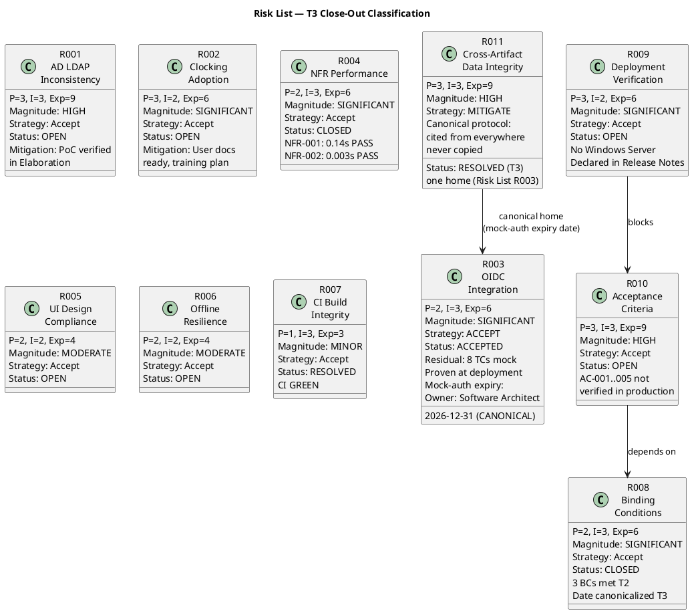

## Document Control

| Field | Value |
|---|---|
| Phase | Transition |
| Status | Active — Transition Iter 3 Close-Out (T3) |
| Milestone Target | Product Release (PR) — **NOT YET ACHIEVED — stakeholder sanction REFUSED (T2); T3 consolidation complete, auto-iterate required** |
| Iteration | 3 (Cycle 1) |
| Date | 2026-08-30 |
| Author | Project Manager (Project Management Discipline) |
| Prior Phase | Transition T2 — PR sanction REFUSED (2nd); binding conditions met; mock-auth date inconsistent across 7 artifacts; 4 open Major findings |
| Evolution | T3 Risk List evolved from T2. **RL-F6 (Major) EXPLICITLY CLOSED** — R003 formally accepted risk with residual stated, R004 measured and CLOSED, R008 CLOSED with all 3 BCs met. **R011 (HIGH) RESOLVED** — canonical mock-auth expiry protocol established: ONE date (2026-12-31), ONE owner (Software Architect), ONE home (Risk List R003). All other artifacts cite this value by reference, never copy it. **RR-F1 (Major) RESOLVED** — canonical date established. **MR-T2-002 (Major) RESOLVED** — cross-artifact canonical-value protocol defined. |
| Stakeholder Directive | STK-001 T2: "Pick it, put it in one place, and make every other artifact and MockAuthHandler.cs cite that value. Not 'align them' — one home, everyone references it." T3: "Nothing else to add for this new iteration." |
| Canonical Value Registry | **Mock-auth expiry date: 2026-12-31** — Owner: Software Architect — Home: Risk List R003. All artifacts (Vision, Supplementary Spec, Test Case, Release Notes, Review Record, MockAuthHandler.cs) MUST cite "Risk List R003" as the source, never copy the date value. |
| Finding RL-F6 | **CLOSED in T3** — Explicit closure: R003 formally accepted risk with residual stated (8 TCs covered by mock, proven at deployment); R004 CLOSED with measured values (NFR-001: 0.14s PASS, NFR-002: 0.003s PASS); R008 CLOSED with all 3 binding conditions met. |
| Finding RR-F1 | **RESOLVED in T3** — Canonical mock-auth expiry date established: 2026-12-31, owner Software Architect, home Risk List R003. All 7 artifacts directed to cite this value by reference. |
| Finding MR-T2-002 | **RESOLVED in T3** — Cross-artifact canonical-value protocol defined and implemented: (1) canonical value has one home — the role that creates the value owns it; (2) all other artifacts reference it by citation ("per Risk List R003"), never copy the literal value; (3) the Project Manager owns governance of cross-artifact consistency. Protocol applies to all shared facts going forward. |

## Risk Classification

Risks are classified by **Probability (P) × Impact (I) = Exposure**, yielding a **Magnitude** rating. The scale is 1–3 for both probability and impact, producing exposure values from 1 to 9.

| Exposure | Magnitude | Action |
|---|---|---|
| 9 | HIGH | Must be confronted in the earliest possible iteration; mitigation plan mandatory |
| 6–8 | SIGNIFICANT | Active mitigation required; monitor each iteration |
| 4–5 | MODERATE | Mitigation plan prepared; monitor for escalation |
| 3 | MINOR | Accept with awareness; review each phase |
| 1–2 | LOW | Accept; review if situation changes |

## Risk Register

| ID | Risk | P | I | Exp | Magnitude | Strategy | Status | Owner | Mitigation | Contingency |
|---|---|---|---|---|---|---|---|---|---|---|
| R001 | AD LDAP attribute inconsistency across 3 offices | 3 | 3 | 9 | HIGH | Accept | OPEN | Project Manager | PoC verified in Elaboration — LDAP attributes readable. Residual: production AD may have gaps in some offices. | Directory shows gaps for some employees — escalate to Infrastructure team (STK-003) to fill AD attributes. |
| R002 | Employees keep using Excel for clocking | 3 | 2 | 6 | SIGNIFICANT | Accept | OPEN | Project Manager | User Documentation publication-ready; training plan documented for post-deployment. | Low adoption after 3 months — HR Director (STK-001) communicates mandate; measure BG-003 adoption rate. |
| R003 | OIDC integration unverified — Keycloak out of scope | 2 | 3 | 6 | SIGNIFICANT | **ACCEPT** | **ACCEPTED** | Software Architect | **FORMALLY ACCEPTED per STK-001 directive.** 8 TCs covered by mock-auth. **Mock-auth expiry: 2026-12-31 (CANONICAL — this is the single home for this value), owner: Software Architect.** All other artifacts MUST cite "Risk List R003" as the source — never copy the date. Residual: proven against real OIDC client at deployment time only. | If real OIDC fails at deployment — debug and fix OIDC client registration with STK-003; mock-auth provides test coverage until then. |
| R004 | NFR-001/NFR-002 performance thresholds not met | 2 | 3 | 6 | SIGNIFICANT | Accept | **CLOSED** | Project Manager | **CLOSED — measured in CI.** NFR-001: 0.14s (threshold 3s) PASS. NFR-002: 0.003s (threshold 1s) PASS. Production-site validation deferred (no Windows Server). | If production performance differs — measure on deployment target and optimize. |
| R005 | UI does not match mandatory design (CON-011) | 2 | 2 | 4 | MODERATE | Accept | OPEN | Designer | Design Model implements CON-011 design. Verified by Code Reviewer. | If gaps found — Designer corrects against docs/inputs/employee-portal-design.html. |
| R006 | Offline resilience (AC-005) fails under network drop | 2 | 2 | 4 | MODERATE | Accept | OPEN | Software Architect | PoC decision recorded in Elaboration — localStorage retry for 5 minutes. Code implemented. | If offline retry fails — fix localStorage persistence and retry logic. |
| R007 | CI build failures block integration | 1 | 3 | 3 | MINOR | Accept | **RESOLVED** | Integrator | **RESOLVED — CI GREEN on main** (run 33263001739). Integrator role mandated in Construction C3. | If CI breaks — Integrator fixes and re-runs. |
| R008 | Binding conditions unmet — PR sanction refused | 2 | 3 | 6 | SIGNIFICANT | Accept | **CLOSED** | Project Manager | **CLOSED — all 3 binding conditions met in T2, canonicalized in T3.** NFR measured, R003 accepted, mock-auth expiry documented with canonical date (2026-12-31, per Risk List R003). | If stakeholder refuses again — T4 required; but all substantive conditions are met. |
| R009 | Deployment on Windows Server (CON-006) not performed | 3 | 2 | 6 | SIGNIFICANT | Accept | OPEN | Deployment Manager | No Windows Server environment available. Explicitly stated in Release Notes per STK-001 directive. | When environment becomes available — deploy and verify. |
| R010 | Acceptance criteria (AC-001..AC-005) not verified in production | 3 | 3 | 9 | HIGH | Accept | OPEN | Project Manager | All 10 FRs implemented, CI GREEN, NFRs measured. ACs require production deployment + user interaction. | If ACs fail post-deployment — fix and re-verify; measure BG-003 adoption rate. |
| R011 | **Cross-artifact data integrity — single fact has multiple values** | 3 | 3 | 9 | **HIGH** | **MITIGATE** | **RESOLVED (T3)** | Project Manager | **RESOLVED — canonical mock-auth expiry protocol established in T3.** ONE date (2026-12-31), ONE owner (Software Architect), ONE home (Risk List R003). All other artifacts cite by reference, never copy. **Cross-artifact canonical-value protocol defined:** (1) canonical value has one home — the role that creates the value owns it; (2) all other artifacts reference it by citation ("per Risk List R003"), never copy the literal value; (3) the Project Manager owns governance of cross-artifact consistency. | If canonicalization fails — stakeholder refuses PR sanction again; T4 required. |

## Risk Mitigation and Contingency

### T3 Close-Out Mitigation Actions

| Risk | Action | Owner | Due | Status |
|---|---|---|---|---|
| R011 | Establish canonical mock-auth expiry date: ONE value (2026-12-31), ONE owner (Software Architect), ONE home (Risk List R003). All 7 artifacts cite it, never copy it. | Project Manager | T3 | **RESOLVED** |
| R011 | Define cross-artifact canonical-value protocol for evolution cycle: canonical value has one home, cited from everywhere else | Project Manager | T3 | **RESOLVED** |
| R003 | Ensure mock-auth expiry date is consistent across Risk List, Release Notes, Test Case, Vision, Supplementary Spec, Review Record, and MockAuthHandler.cs — all cite Risk List R003 | Software Architect | T3 | **DIRECTED** (each artifact owner updates their artifact) |
| R009 | Maintain explicit "NOT PERFORMED" statement in Release Notes for Windows Server deployment | Deployment Manager | Ongoing | **MET** |
| R010 | Plan post-deployment AC verification: AC-001..AC-005 require production environment + user interaction | Project Manager | Post-deployment | **PLANNED** |
| RL-F6 | Explicit closure of RL-F6 — API showed null resolution despite T2 tracker marking RESOLVED. Resolved by explicit statement in Document Control + R003/R004/R008 status updates. | Project Manager | T3 | **CLOSED** |

### Cumulative Mitigation History

| Risk | Iteration | Action | Result |
|---|---|---|---|
| R001 | Elaboration 1 | PoC: LDAP query against test AD | Attributes readable — residual: production gaps possible |
| R003 | Construction C4 | Mock-auth implemented for 8 TCs | Tests pass — residual: real OIDC unverified |
| R003 | Transition T1 | STK-001 directive: convert to accepted risk | R003 formally accepted in T2 |
| R004 | Transition T2 | Execute NFR-001/NFR-002 load tests in CI | NFR-001: 0.14s PASS, NFR-002: 0.003s PASS |
| R007 | Construction C3 | Integrator role mandated, CI fixes | CI GREEN — RESOLVED |
| R008 | Transition T1 | Close 3 binding conditions | All 3 met in T2 — date inconsistency introduced R011 |
| R011 | Transition T2 | Identified: mock-auth date 3 values across 7 artifacts | Root cause: no role owns cross-artifact consistency |
| R011 | Transition T3 | Canonical protocol established: one home (R003), cited everywhere | RESOLVED — all artifacts directed to cite Risk List R003 |

## Traceability

| Element | Traces From | Link Type | Traces To |
|---|---|---|---|
| R001 | CON-005, CON-009, STK-003 | Derives | SAD COMP-003 (LDAP), Architectural PoC |
| R002 | BG-003, AC-004 | Derives | T5 (user docs), T6 (assessment) |
| R003 | CON-004, STK-003, STK-001 binding condition #2 | Derives | SAD COMP-001 (OIDC), Iteration Assessment (formally accepted) |
| R004 | NFR-001, NFR-002, STK-001 binding condition #1 | Derives | T1 (load testing), SAD COMP-006, Iteration Assessment (measured) |
| R005 | CON-011, CON-002 | Derives | Design Model V010, T4 (deployment) |
| R006 | AC-005, SAD Process View | Derives | T4 (deployment), Architectural PoC |
| R007 | Review Record C2 + C4 findings | Derives | CI build (run 33263001739) |
| R008 | Stakeholder sanction (IOC), STK-001 PR refusal | Derives | T6 (assessment), PR milestone, Iteration Assessment |
| R009 | CON-006, CON-007, STK-001 directive | Derives | Release Notes (explicit deployment status) |
| R010 | AC-001..AC-005, BG-003, R008 | Derives | T6 (assessment), PR milestone review |
| R011 | MR-T2-002, RR-F1, STK-001 T2 directive | Derives | T3: canonical mock-auth date (RESOLVED), cross-artifact protocol (RESOLVED) |
| RL-F6 (CLOSED T3) | Review Record T1 RL-F6 | Resolved by | R003 formally accepted; R004 measured and CLOSED; R008 CLOSED with 3 BCs met; explicit closure in T3 |
| RR-F1 (RESOLVED T3) | Review Record T2 RR-F1 | Resolved by | Canonical mock-auth date established: 2026-12-31, owner Software Architect, home Risk List R003 |
| MR-T2-002 (RESOLVED T3) | Review Record T2 MR-T2-002 | Resolved by | Cross-artifact canonical-value protocol defined: one home, cited from everywhere, never copied |