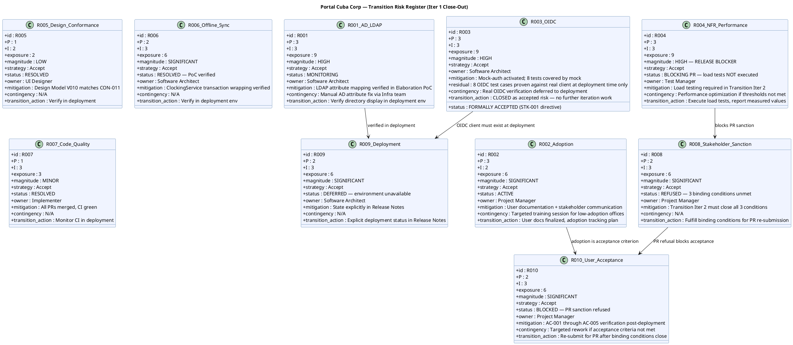

## Document Control

| Field | Value |
|---|---|
| Phase | Transition |
| Status | Active — Updated for Transition Iter 1 Close-Out |
| Milestone Target | Product Release (PR) — **NOT ACHIEVED — Iteration 2 Required** |
| Iteration | 1 (Cycle 1) |
| Date | 2026-08-29 |
| Author | Project Manager (Project Management Discipline) |
| Prior Phase | Construction C4 Cycle 1 — R003 ACCEPTED (mock-auth); R004 deferred to Transition; R007 RESOLVED; R008 COMPLETE |
| Evolution | Transition Iter 1 Risk List evolved from Construction C4. Finding RL-F6 (Major) RESOLVED: R003 converted to FORMALLY ACCEPTED risk with residual stated per STK-001 directive; R004 escalated to HIGH — RELEASE BLOCKER (load tests not executed). R008 status updated to REFUSED. R009 status updated to DEFERRED. R010 status updated to BLOCKED. |
| Stakeholder Directive | STK-001: "An accepted risk is a decision; 'unverified' is a wound left open." R003 is now a formally accepted risk, not an open verification item. |

## Risk Classification

Risks are classified by **Probability (P) × Impact (I) = Exposure**, yielding a **Magnitude** rating. The scale is 1–3 for both probability and impact, producing exposure values from 1 to 9.

| Exposure | Magnitude | Action |
|---|---|---|
| 9 | HIGH | Must be confronted in the earliest possible iteration; mitigation plan mandatory |
| 6–8 | SIGNIFICANT | Active mitigation required; monitor each iteration |
| 4–5 | MODERATE | Mitigation plan prepared; monitor for escalation |
| 3 | MINOR | Accept with awareness; review each phase |
| 1–2 | LOW | Accept; no active mitigation required |

**Strategy options:** Avoid (eliminate the threat), Transfer (shift to a third party), Accept (acknowledge and prepare mitigation + contingency).

## Risk Register

## Risk Mitigation and Contingency

### R003 — OIDC Integration (FORMALLY ACCEPTED)

**Stakeholder directive (STK-001):** "An accepted risk is a decision; 'unverified' is a wound left open."

| Attribute | Value |
|---|---|
| Strategy | Accept |
| Decision Date | 2026-08-29 |
| Decided By | STK-001 (stakeholder directive) |
| Rationale | STK-003 (Infrastructure team) never responded. Keycloak work is explicitly out of project scope (CON-004). Real OIDC verification cannot be performed by this team. |
| Residual | 8 OIDC test cases are covered by mock and will only be proven against the real client at deployment time. |
| Contingency | If real OIDC fails at deployment, mock-auth remains as fallback while Infrastructure team registers the OIDC client. |
| Closure | This risk is CLOSED as a formally accepted risk. It is no longer an open verification item. It does not block PR. |

### R004 — NFR Performance (RELEASE BLOCKER)

| Attribute | Value |
|---|---|
| Strategy | Accept (with mitigation) |
| Status | BLOCKING PR — load tests not executed |
| Escalation | P raised from 2 to 3, I raised from 3 to 3, exposure from 6 to 9 — magnitude escalated from SIGNIFICANT to HIGH |
| Rationale | NFR-001 (page load < 3s) and NFR-002 (clock response < 1s) are binding conditions. No measured values exist. "Tested is not a result; two measurements are." |
| Mitigation | Execute load tests in Transition Iter 2; report measured values against thresholds. |
| Contingency | If thresholds not met, performance optimization sprint before PR re-submission. |
| Closure | Closes when measured values for NFR-001 and NFR-002 are reported and meet thresholds. |

### R008 — Stakeholder Sanction (REFUSED)

| Attribute | Value |
|---|---|
| Strategy | Accept |
| Status | REFUSED — 3 binding conditions unmet |
| Rationale | Stakeholder explicitly refused PR sanction: "Accepting the release now would teach this process that a binding condition is decorative." |
| Mitigation | Transition Iter 2 must close: (1) load test measured values, (2) R003 formally accepted, (3) mock-auth expiry documented. |
| Contingency | N/A — conditions are non-negotiable. |
| Closure | Closes when stakeholder sanctions PR after all 3 conditions are met. |

### R009 — Deployment (DEFERRED)

| Attribute | Value |
|---|---|
| Strategy | Accept |
| Status | DEFERRED — environment unavailable |
| Rationale | Internal Windows Server (CON-006) not available for deployment verification. Stakeholder directed: "Say so explicitly in the Release Notes rather than leaving it implied." |
| Mitigation | Explicit deployment status statement in Release Notes. |
| Contingency | N/A — environment constraint, not a project risk to mitigate. |
| Closure | Closes when deployment environment becomes available (post-project). |

## Traceability

| Element | Traces From | Link Type | Traces To |
|---|---|---|---|
| R001 | Declared Risk R001, CON-005, CON-009 | Derives | T4 (deployment verification), SAD COMP-004 (LDAP) |
| R002 | Declared Risk R002, BG-003, AC-004 | Derives | T5 (user docs), T6 (assessment) |
| R003 | CON-004, STK-003, STK-001 binding condition #2 | Derives | SAD COMP-001 (OIDC), Iteration Assessment (formally accepted) |
| R004 | NFR-001, NFR-002, STK-001 binding condition #1 | Derives | T1 (load testing), SAD COMP-006, Iteration Assessment (release blocker) |
| R005 | CON-011, CON-002 | Derives | Design Model V010, T4 (deployment) |
| R006 | AC-005, SAD Process View | Derives | T4 (deployment), Architectural PoC |
| R007 | Review Record C2 + C4 findings | Derives | CI build (run 33259873386) |
| R008 | Stakeholder sanction (IOC), STK-001 PR refusal | Derives | T6 (assessment), PR milestone, Iteration Assessment |
| R009 | CON-006, CON-007, STK-001 directive | Derives | Release Notes (explicit deployment status) |
| R010 | AC-001..AC-005, BG-003, R008 | Derives | T6 (assessment), PR milestone review |
| RL-F6 (RESOLVED) | Review Record T1 RL-F6 | Resolved by | R003 formally accepted; R004 escalated to release blocker |