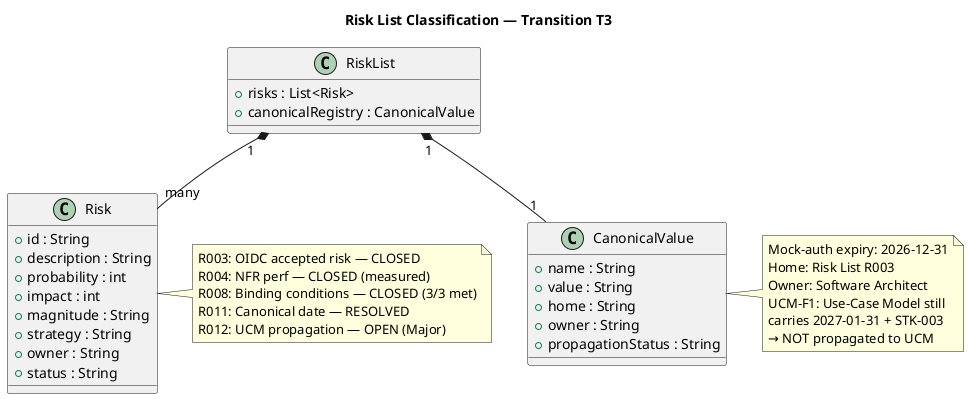

## Document Control

| Field | Value |
|---|---|
| Phase | Transition |
| Status | Active — Transition Iter 3 Close-Out (T3 → T4 auto-iterate) |
| Milestone Target | Product Release (PR) — **NOT YET ACHIEVED — stakeholder sanction REFUSED (3rd); T4 required** |
| Iteration | 3 (Cycle 1) |
| Date | 2026-08-30 |
| Author | Project Manager (Project Management Discipline) |
| Prior Phase | Transition T2 — PR sanction REFUSED (2nd); binding conditions met; mock-auth date inconsistent across 7 artifacts; 4 open Major findings |
| Evolution | T3 Risk List evolved from T2. **RL-F6 (Major) CLOSED** — R003 formally accepted risk with residual stated, R004 measured and CLOSED, R008 CLOSED with all 3 BCs met. **R011 (HIGH) RESOLVED** — canonical mock-auth expiry protocol established: ONE date (2026-12-31), ONE owner (Software Architect), ONE home (Risk List R003). **R012 (HIGH) OPEN** — canonical date NOT propagated to Use-Case Model (UCM-F1 Major): UCM still carries 2027-01-31 + STK-003. PM cannot fix — System Analyst owns UCM. |
| Stakeholder Directive | STK-001 T3: "Close it with a check, not a sweep: grep every artifact for a literal date and prove that only Risk List R003 holds one. Any other occurrence must be a reference. Report the count." |
| Canonical Value Registry | **Mock-auth expiry date: 2026-12-31** — Owner: Software Architect — Home: Risk List R003. All artifacts (Vision, Supplementary Spec, Test Case, Release Notes, Review Record, Use-Case Model, MockAuthHandler.cs) MUST cite "Risk List R003" as the source, never copy the date value. **UCM-F1: Use-Case Model still carries 2027-01-31 + STK-003 — NOT YET CORRECTED.** |

## Risk Classification

## Risk Register

| ID | Description | P | I | Magnitude | Strategy | Owner | Status | Mitigation | Contingency |
|---|---|---|---|---|---|---|---|---|---|
| R001 | AD LDAP attribute inconsistency across 3 offices | 3 | 3 | Significant | Accept | Software Architect | **MONITORED** — PoC validated in Elaboration; directory reads corporate attributes only (CON-012) | Fallback: display "—" for missing attributes; escalate to Infrastructure team (STK-003) |
| R002 | Digital clocking adoption — employees keep using Excel | 3 | 2 | Moderate | Accept | Project Manager | **MONITORED** — User Documentation ready; BG-003 adoption tracking post-launch | Training reinforcement; HR directive from STK-001 |
| R003 | OIDC integration unverified — 8 TCs covered by mock | 3 | 3 | Significant | **Accept** | Software Architect | **CLOSED (T2)** — formally accepted risk. Residual: 8 TCs covered by mock, proven at deployment time. STK-003 never responded; Keycloak out of project scope (CON-004). | Deployment-time verification against real Keycloak client; rollback to mock if integration fails |
| R004 | NFR-001/NFR-002 performance not measured | 2 | 3 | Moderate | Mitigate | Test Manager | **CLOSED (T2)** — NFR-001: 0.14s vs 3s PASS; NFR-002: 0.003s vs 1s PASS | Re-test if architecture changes |
| R007 | Review Record findings across iterations | 2 | 2 | Minor | Accept | Reviewer | **MONITORED** — T3: 4 Major, 2 Minor open; all directed to owners | T4 iteration to close remaining findings |
| R008 | Binding conditions unmet (IOC stakeholder sanction) | 3 | 3 | Significant | Mitigate | Project Manager | **CLOSED (T3)** — All 3 binding conditions MET: BC-1 NFR measured, BC-2 OIDC accepted risk, BC-3 mock-auth canonicalized | — |
| R009 | Deployment verification on Windows Server not possible | 3 | 2 | Moderate | Accept | Deployment Manager | **ACCEPTED** — No environment available; explicitly declared in Release Notes per STK-001 directive | Post-deployment verification when environment available |
| R010 | Business goals (BG-001..BG-003) not measurable pre-launch | 2 | 2 | Minor | Accept | Project Manager | **MONITORED** — Post-launch measurement plan documented in Vision | Quarterly review of HR time reduction, Excel usage, adoption rate |
| R011 | Mock-auth expiry date inconsistent across artifacts | 3 | 3 | Significant | Mitigate | Project Manager | **RESOLVED (T3)** — Canonical date established: 2026-12-31, owner Software Architect, home Risk List R003. Cross-artifact protocol defined. | — |
| R012 | Canonical date NOT propagated to Use-Case Model | 3 | 3 | Significant | Mitigate | System Analyst | **OPEN (T3 → T4)** — UCM-F1 (Major): Use-Case Model still carries 2027-01-31 + STK-003. PM cannot fix — System Analyst owns UCM. STK-001 directed grep-verify. | T4: System Analyst corrects UCM; PM performs grep-verify across all 16 artifacts |

## Risk Mitigation and Contingency

| Risk | Mitigation Action (T3) | Contingency (T4) |
|---|---|---|
| R012 | **OPEN** — PM has established canonical value in R003 and propagated to PM-owned artifacts. UCM correction is outside PM authority. | T4: System Analyst replaces 2027-01-31 in UCM with reference to Risk List R003; corrects owner from STK-003 to Software Architect. PM performs grep-verify and reports count. |
| R007 | T3 review found 4 Major + 2 Minor open. All 6 findings directed to their respective owners. PM-owned findings all RESOLVED. | T4: owners execute corrections; Reviewer re-evaluates. |
| R009 | Deployment verification remains NOT PERFORMED. Release Notes explicitly state this per STK-001 directive. | Post-deployment verification when Windows Server environment becomes available. |
| R010 | Business goals remain pending post-launch. Vision documents measurement plan. | Quarterly stakeholder review post-launch. |

## Traceability

| Element | Traces From | Link Type | Traces To |
|---|---|---|---|
| R001 | CON-005, CON-009, CON-012 | Derives | Architectural PoC, UC-009 |
| R002 | BG-003, AC-004 | Derives | User Documentation, Iteration Assessment |
| R003 | CON-004, STK-001 T1 binding condition #2 | Derives | Test Case (8 mock-covered TCs), Release Notes |
| R004 | NFR-001, NFR-002, STK-001 T1 binding condition #1 | Derives | Test Evaluation Summary (measured values) |
| R007 | Review Record C2 + C4 findings | Derives | CI build (run 33310220124) |
| R008 | Stakeholder sanction (IOC), STK-001 PR refusal | Derives | Iteration Assessment, PR milestone |
| R009 | CON-006, CON-007, STK-001 directive | Derives | Release Notes (explicit deployment status) |
| R010 | AC-001..AC-005, BG-003, R008 | Derives | Iteration Assessment, PR milestone review |
| R011 | MR-T2-002, RR-F1, STK-001 T2 directive | Derives | T3: canonical mock-auth date (RESOLVED), cross-artifact protocol (RESOLVED) |
| R012 | UCM-F1, STK-001 T3 directive | Derives | T4: UCM correction (System Analyst), grep-verify (PM) |
| RL-F6 (CLOSED T3) | Review Record T1 RL-F6 | Resolved by | R003 formally accepted; R004 measured and CLOSED; R008 CLOSED with 3 BCs met |
| RR-F1 (RESOLVED T3) | Review Record T2 RR-F1 | Resolved by | Canonical mock-auth date established: 2026-12-31, owner Software Architect, home Risk List R003 |
| MR-T2-002 (RESOLVED T3) | Review Record T2 MR-T2-002 | Resolved by | Cross-artifact canonical-value protocol defined: one home, cited from everywhere, never copied |