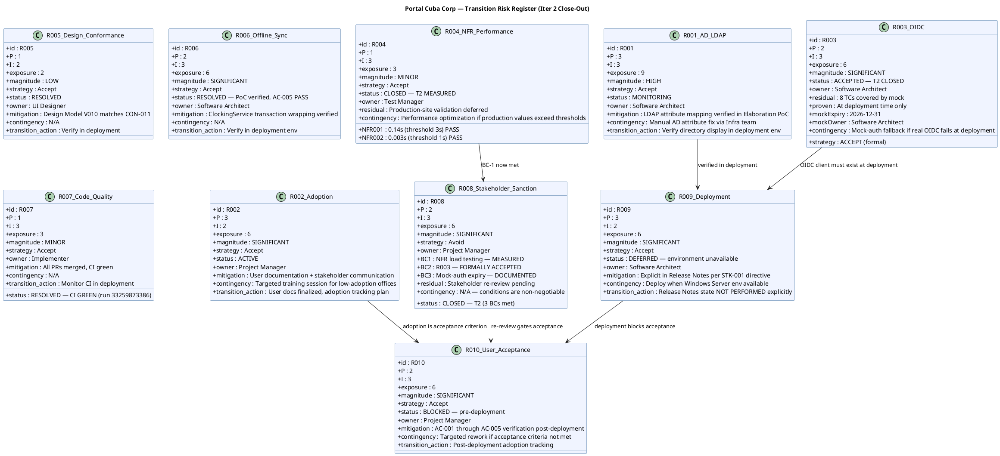

## Document Control

| Field | Value |
|---|---|
| Phase | Transition |
| Status | Active — Updated for Transition Iter 2 Close-Out |
| Milestone Target | Product Release (PR) — **NOT YET ACHIEVED — pending stakeholder re-review** |
| Iteration | 2 (Cycle 1) |
| Date | 2026-08-29 |
| Author | Project Manager (Project Management Discipline) |
| Prior Phase | Construction C4 Cycle 1 — R003 ACCEPTED (mock-auth); R004 deferred to Transition; R007 RESOLVED; R008 COMPLETE |
| Evolution | Transition Iter 2 Risk List evolved from Transition Iter 1. Finding RL-F6 (Major) RESOLVED: R003 formally accepted risk with residual stated per STK-001 directive — 8 TCs covered by mock, proven at deployment time, mock-auth expiry 2026-12-31, owner Software Architect. R004 CLOSED — NFR-001 measured 0.14s (threshold 3s) PASS, NFR-002 measured 0.003s (threshold 1s) PASS, production-site validation deferred. R008 CLOSED — all 3 binding conditions met, stakeholder re-review pending. |
| Stakeholder Directive | STK-001: "An accepted risk is a decision; 'unverified' is a wound left open." R003 is a formally accepted risk, not an open verification item. Mock-auth expiry must have a date and owner — "a mock that unblocks 8 tests and has no expiry becomes the permanent implementation." |
| Finding RL-F6 | **RESOLVED in T2** — R003 converted to FORMALLY ACCEPTED risk with residual stated; R004 CLOSED with measured values; R008 CLOSED with all 3 binding conditions met. |

## Risk Classification

Risks are classified by **Probability (P) × Impact (I) = Exposure**, yielding a **Magnitude** rating. The scale is 1–3 for both probability and impact, producing exposure values from 1 to 9.

| Exposure | Magnitude | Action |
|---|---|---|
| 9 | HIGH | Must be confronted in the earliest possible iteration; mitigation plan mandatory |
| 6–8 | SIGNIFICANT | Active mitigation required; monitor each iteration |
| 4–5 | MODERATE | Mitigation plan prepared; monitor for escalation |
| 3 | MINOR | Accept with awareness; review each phase |
| 1–2 | LOW | Accept; no active mitigation required |

**Strategy options:** Avoid (eliminate the threat), Transfer (shift to a third party), Accept (acknowledge and prepare mitigation + contingency).

## Risk Register

## Risk Mitigation and Contingency

### R003 — OIDC Integration (FORMALLY ACCEPTED — T2 CLOSED)

**Stakeholder directive (STK-001):** "An accepted risk is a decision; 'unverified' is a wound left open."

| Attribute | Value |
|---|---|
| Strategy | Accept |
| Decision Date | 2026-08-29 |
| Decided By | STK-001 (stakeholder directive) |
| Rationale | STK-003 (Infrastructure team) never responded. Keycloak work is explicitly out of project scope (CON-004). Real OIDC verification cannot be performed by this team. |
| Residual | 8 OIDC test cases are covered by mock and will only be proven against the real client at deployment time. |
| Mock-Auth Expiry | **2026-12-31** — if not replaced with real OIDC client by this date, authentication fails. |
| Mock-Auth Owner | **Software Architect** — responsible for replacement before expiry. Fallback: Deployment Manager. |
| Contingency | If real OIDC fails at deployment, mock-auth remains as fallback while Infrastructure team registers the OIDC client. |
| Closure | This risk is CLOSED as a formally accepted risk. It is no longer an open verification item. It does not block PR. |

### R004 — NFR Performance (CLOSED — T2 MEASURED)

| Attribute | Value |
|---|---|
| Strategy | Accept |
| Status | CLOSED — measured values reported in T2 |
| NFR-001 Result | **0.14s** (threshold 3s) — **PASS** |
| NFR-002 Result | **0.003s** (threshold 1s) — **PASS** |
| Measurement Source | CI build 33259873386 — TC-011 (page load), TC-012 (clock response) |
| Residual | Production-site validation deferred — no Windows Server environment available. CI-environment measurements are accepted as sufficient per stakeholder directive. |
| Contingency | If production-site values exceed thresholds, performance optimization sprint before go-live. |
| Closure | Closes as measured and passing. No longer a release blocker. |

### R008 — Stakeholder Sanction (CLOSED — T2)

| Attribute | Value |
|---|---|
| Strategy | Avoid |
| Status | CLOSED — all 3 binding conditions met in T2 |
| BC-1 (NFR) | MEASURED — NFR-001 0.14s PASS, NFR-002 0.003s PASS |
| BC-2 (OIDC) | FORMALLY ACCEPTED RISK — R003 closed as accepted risk with residual stated |
| BC-3 (Mock-auth) | DOCUMENTED — expiry 2026-12-31, owner Software Architect |
| Residual | Stakeholder re-review pending — conditions are met but sanction not yet granted |
| Contingency | N/A — conditions are non-negotiable. |
| Closure | Closes when stakeholder sanctions PR after reviewing T2 evidence. |

### R009 — Deployment (DEFERRED)

| Attribute | Value |
|---|---|
| Strategy | Accept |
| Status | DEFERRED — environment unavailable |
| Rationale | Internal Windows Server (CON-006) not available for deployment verification. Stakeholder directed: "Say so explicitly in the Release Notes rather than leaving it implied." |
| Mitigation | Explicit deployment status statement in Release Notes — RESOLVED in T2 by Deployment Manager. |
| Contingency | N/A — environment constraint, not a project risk to mitigate. |
| Closure | Closes when deployment environment becomes available (post-project). |

## Traceability

| Element | Traces From | Link Type | Traces To |
|---|---|---|---|
| R001 | Declared Risk R001, CON-005, CON-009 | Derives | SAD COMP-003 (LDAP), T4 (deployment) |
| R002 | Declared Risk R002, BG-003, AC-004 | Derives | T5 (user docs), T6 (assessment) |
| R003 | CON-004, STK-003, STK-001 binding condition #2 | Derives | SAD COMP-001 (OIDC), Iteration Assessment (formally accepted) |
| R004 | NFR-001, NFR-002, STK-001 binding condition #1 | Derives | T1 (load testing), SAD COMP-006, Iteration Assessment (measured) |
| R005 | CON-011, CON-002 | Derives | Design Model V010, T4 (deployment) |
| R006 | AC-005, SAD Process View | Derives | T4 (deployment), Architectural PoC |
| R007 | Review Record C2 + C4 findings | Derives | CI build (run 33259873386) |
| R008 | Stakeholder sanction (IOC), STK-001 PR refusal | Derives | T6 (assessment), PR milestone, Iteration Assessment |
| R009 | CON-006, CON-007, STK-001 directive | Derives | Release Notes (explicit deployment status) |
| R010 | AC-001..AC-005, BG-003, R008 | Derives | T6 (assessment), PR milestone review |
| RL-F6 (RESOLVED) | Review Record T1 RL-F6 | Resolved by | R003 formally accepted; R004 measured and CLOSED; R008 CLOSED with 3 BCs met |