## Document Control
| Field | Value |
|---|---|
| Phase | Construction |
| Status | Active |
| Milestone Target | End-of-Construction (IOC) — **CONDITIONAL GO — stakeholder sanction GRANTED** |
| Iteration | 4 (Cycle 1) |
| Date | 2026-08-29 |
| Prior Phase | Construction C3 Cycle 1 — PR #29 APPROVED; 0 Critical/0 Major code; 31/39 tests pass, 8 BLOCKED (R003); load test NOT EXECUTED; stakeholder sanction REFUSED 3rd time |
| Evolution | C4 Cycle 1 Risk List evolved (post-review): R003 ACCEPTED — STK-001 approved mock-auth contingency activation; R004 deferred to Transition Iter 1 per stakeholder condition (measured values required); R007 RESOLVED — PR #32 + #33 MERGED to main, 0 open PRs, CI GREEN; R008 COMPLETE; R001/R002/R005/R006 status unchanged; stakeholder sanction GRANTED with 3 binding conditions; IOC CONDITIONAL GO |
| Finding RL-F2 | RESOLVED — R008 contingency activated and COMPLETE (rework succeeded) |
| Finding RL-F5 | RESOLVED — R003 ACCEPTED per STK-001 decision. Mock-auth contingency activated. Real OIDC is Transition work item. 8 tests covered-by-mock. Mock-auth has expiry date. |
## Risk Classification

Risks are classified by **Probability (P) × Impact (I) = Exposure**, yielding a **Magnitude** rating. The scale is 1–3 for both probability and impact, producing exposure values from 1 to 9.

| Exposure | Magnitude | Action |
|---|---|---|
| 9 | HIGH | Must be confronted in the earliest possible iteration; mitigation plan mandatory |
| 6–8 | SIGNIFICANT | Active mitigation required; monitor each iteration |
| 4–5 | MODERATE | Mitigation plan prepared; monitor for escalation |
| 3 | MINOR | Accept with awareness; review each phase |
| 1–2 | LOW | Accept; no active mitigation required |

**Strategy options:** Avoid (eliminate the threat), Transfer (shift to a third party), Accept (acknowledge and prepare mitigation + contingency).

```plantuml
@startuml
title Portal Cuba Corp — Construction Risk Register (C4 Cycle 1)

skinparam classAttributeIconSize 0

class R001_AD_LDAP {
  + id : R001
  + category : TECHNICAL
  + P : 3
  + I : 3
  + exposure : 9
  + magnitude : HIGH
  + strategy : ACCEPT
  + status : MITIGATED
  + owner : Software Architect
  + action : LdapGateway delivered (C2);
    NovellLdapConnectionAdapter stub
    deferred to integration testing
}

class R002_Adoption {
  + id : R002
  + category : BUSINESS
  + P : 3
  + I : 2
  + exposure : 6
  + magnitude : SIGNIFICANT
  + strategy : ACCEPT
  + status : ACTIVE
  + owner : Project Manager
  + action : Transition communication plan
}

class R003_OIDC {
  + id : R003
  + category : EXTERNAL
  + P : 3
  + I : 3
  + exposure : 9
  + magnitude : HIGH
  + strategy : ACCEPT
  + status : ESCALATED (5th cycle - FINAL)
  + owner : Software Architect
  + action : HARD DEADLINE enforced (RL-F5);
    mock-auth contingency to
    stakeholder for binding decision;
    8 of 39 tests BLOCKED
}

class R004_Performance {
  + id : R004
  + category : TECHNICAL
  + P : 2
  + I : 2
  + exposure : 4
  + magnitude : MODERATE
  + strategy : ACCEPT
  + status : ACTIVE (C4 execution)
  + owner : Software Architect
  + action : Load testing DECOUPLED
    from merge (IP-F5 RESOLVED);
    executes against any CI-green branch
}

class R005_UI_Conformance {
  + id : R005
  + category : TECHNICAL
  + P : 2
  + I : 2
  + exposure : 4
  + magnitude : MODERATE
  + strategy : ACCEPT
  + status : MITIGATED
  + owner : UI Designer
  + action : PR #32 approved;
    design conformance verified
}

class R006_Offline_Retry {
  + id : R006
  + category : TECHNICAL
  + P : 2
  + I : 3
  + exposure : 6
  + magnitude : SIGNIFICANT
  + strategy : ACCEPT
  + status : MITIGATED
  + owner : Software Architect
  + action : C4-2 transaction wrapping
    RESOLVED in PR #32;
    retry mechanism functional
}

class R007_PR_Findings {
  + id : R007
  + category : SCHEDULE
  + P : 1
  + I : 3
  + exposure : 3
  + magnitude : MINOR
  + strategy : AVOID
  + status : RESOLVED
  + owner : Implementer
  + action : All C2 + C4 findings
    RESOLVED in PR #32
}

class R008_Rework_Cycle {
  + id : R008
  + category : SCHEDULE
  + P : 1
  + I : 2
  + exposure : 2
  + magnitude : LOW
  + strategy : ACCEPT
  + status : COMPLETE
  + owner : Project Manager
  + action : Rework succeeded;
    C4 is consolidation iteration
}

R001_AD_LDAP --|> "HIGH"
R002_Adoption --|> "SIGNIFICANT"
R003_OIDC --|> "HIGH"
R004_Performance --|> "MODERATE"
R005_UI_Conformance --|> "MODERATE"
R006_Offline_Retry --|> "SIGNIFICANT"
R007_PR_Findings --|> "RESOLVED"
R008_Rework_Cycle --|> "COMPLETE"

@enduml
```

## Risk Register
| ID | Category | Description | P | I | Exposure | Magnitude | Strategy | Status | Owner | Mitigation | Contingency |
|---|---|---|---|---|---|---|---|---|---|---|---|
| R001 | Technical | AD LDAP attribute inconsistency across 3 offices — job title, extension may not be filled consistently | 3 | 3 | 9 | HIGH | Accept | **MITIGATED** | Software Architect | PoC decision recorded (CR-001). LdapGateway delivered in C2. NovellLdapConnectionAdapter methods throw NotImplementedException — deferred to integration testing with real AD server. Missing attributes default to "N/A". | If >30% of AD records show missing attributes during integration testing, escalate to STK-003 for AD data cleanup before directory goes live. |
| R002 | Business | Digital clocking adoption — employees may keep using Excel out of habit | 3 | 2 | 6 | SIGNIFICANT | Accept | ACTIVE | Project Manager | Plan Transition communication strategy: announce portal launch, provide quick-start guide, HR director endorsement (STK-001). | If adoption <50% after 1 month post-launch, schedule mandatory clocking training session and disable Excel template sharing. |
| R003 | External | OIDC client registration with Keycloak — STK-003 must provide registration before login testing. **STAKEHOLDER DECISION: mock-auth contingency ACTIVATED. R003 ACCEPTED.** | 3 | 3 | 9 | HIGH | Accept | **ACCEPTED** | Software Architect | **STK-001 approved mock-auth contingency activation (2026-08-29).** R003 transitions from ESCALATED to ACCEPTED. 8 tests marked covered-by-mock, NOT passing. Real OIDC integration is a named work item in Transition with an owner. Mock-auth has an expiry date documented in the Transition Iteration Plan. Five escalations to STK-003 across 4 iterations — this is the process working: it detected the dependency, chased it, and prepared the alternative. STK-003 owes this iteration nothing; OIDC registration is Infrastructure's, and this project's scope explicitly excludes all Keycloak work. | Real OIDC integration is a Transition work item. 8 tests stay covered-by-mock until they run against the real client. Mock-auth has an expiry date — if real OIDC is not integrated by that date, escalate to STK-001 for a binding decision on whether to extend mock-auth or delay deployment. |
| R004 | Technical | Page load performance (NFR-001: <3s) and clocking response time (NFR-002: <1s) | 2 | 2 | 4 | MODERATE | Accept | **ACTIVE — deferred to Transition Iter 1** | Software Architect | SAD specifies connection pooling, indexed queries (8 indexes justified by UC/NFR). **IP-F5 RESOLVED:** Load testing decoupled from merge dependency. **Stakeholder condition:** NFR-001/NFR-002 load testing is Transition Iter 1 exit criterion. Measured values required — not "tested", the numbers. Page load under 3 seconds and clock response under 1 second are acceptance criteria that depend on nobody outside the team. | If load test exceeds thresholds, optimize queries first, then consider caching layer. Report measured values against thresholds. |
| R005 | Technical | UI conformance with mandatory design (CON-011: employee-portal-design.html) | 2 | 2 | 4 | MODERATE | Accept | **MITIGATED** | UI Designer | Design Model V001–V010 aligned with CON-011. PR #32 approved and merged to main — presentation layer conformance verified by Code Reviewer. | If Reviewer flags visual divergence, UI Designer updates Razor Pages to match design source. |
| R006 | Technical | Offline clocking retry — AC-005 requires 5-minute network drop tolerance with data sync on recovery | 2 | 3 | 6 | SIGNIFICANT | Accept | **MITIGATED** | Software Architect | PoC decision recorded (CR-002). ClockingService implements localStorage retry with idempotency key. C2-MAJ-2 (antiforgery) fix RESOLVED. C4-2 (transaction wrapping) RESOLVED in PR #32 (MERGED to main) — all write operations wrapped in `ExecuteInTransactionAsync`, ensuring atomic retry. Offline retry mechanism functional. | If localStorage retry fails to recover clocking data after 5-min drop in >10% of test cases, narrow AC-005 scope with stakeholder. |
| R007 | Schedule | PR review findings blocking merge — **ALL C2 + C4 findings RESOLVED in PR #32. PR #32 + #33 MERGED to main.** PR #29, PR #19, and PR #8 superseded and closed. | 1 | 3 | 3 | MINOR | Avoid | **RESOLVED** | Implementer | All C2 findings (1 Critical, 2 Major, 4 Minor) and C4 findings (2 Major: isFeatured, transaction wrapping) resolved in PR #32. Code Reviewer approved. PR #32 + #33 MERGED to main. 0 open PRs. CI GREEN on main (run 33256627567). | N/A — risk retired. If new findings emerge on merged main, re-open as new risk. |
| R008 | Schedule | **Rework cycle COMPLETE.** C2 Cycle 3 succeeded — PR #28 approved with all findings resolved. C3 Cycle 1 is the integration/IOC iteration. C4 is the final consolidation iteration. | 1 | 2 | 2 | LOW | Accept | **COMPLETE** | Project Manager | Rework succeeded. C4 Cycle 1 complete — PRs merged, R003 ACCEPTED, stakeholder sanction GRANTED. IOC CONDITIONAL GO. | N/A — rework cycle closed. |
## Risk Mitigation and Contingency
### R001 — AD LDAP Attribute Consistency (HIGH, MITIGATED)

**Mitigation status:** PoC decision recorded in Architectural Proof-of-Concept artifact. CR-001 concurred. LdapGateway delivered in C2. NovellLdapConnectionAdapter methods throw NotImplementedException — documented as `[DEFERRED — requires integration testing with real AD server (R001)]` (C2-MIN-1). Missing AD attributes default to "N/A" per PoC decision.

**Contingency trigger:** >30% of AD records show missing attributes during integration testing.
**Contingency action:** Escalate to STK-003 (Infrastructure team) for AD data cleanup. Portal directory launch may be delayed until AD data quality is acceptable.

### R002 — Digital Clocking Adoption (SIGNIFICANT, ACTIVE)

**Mitigation status:** Transition phase planning. Not actionable in Construction — adoption tracking begins post-launch.
**Contingency trigger:** Adoption <50% after 1 month.
**Contingency action:** Mandatory training + disable Excel template sharing.

### R003 — OIDC Registration (HIGH, ACCEPTED) — STAKEHOLDER DECISION: MOCK-AUTH ACTIVATED

**Mitigation status:** STK-001 approved mock-auth contingency activation (2026-08-29). R003 transitions from ESCALATED to ACCEPTED. This is not a process failure — five escalations to an external party detected the dependency, chased it, and prepared the alternative. STK-003 owes this iteration nothing; OIDC registration is Infrastructure's, and this project's scope explicitly excludes all Keycloak work (CON-004).

**Stakeholder decision (binding):**
- Mock-auth contingency is ACTIVATED. Portal proceeds to Transition with mock auth.
- Real OIDC integration is a named work item in Transition with an owner.
- 8 tests stay marked as covered-by-mock — NOT passing — until they run against the real client.
- Mock-auth has an expiry date documented in the Transition Iteration Plan.

**Escalation history:** 5 cycles of escalation to STK-003 with no confirmation. 8 tests covered-by-mock. This is the critical path for IOC — now retired by stakeholder decision.

**Contingency action:** Real OIDC integration is a Transition work item. If real OIDC is not integrated by the mock-auth expiry date, escalate to STK-001 for a binding decision on whether to extend mock-auth or delay deployment.

### R004 — Performance (MODERATE, ACTIVE — DEFERRED TO TRANSITION ITER 1)

**Mitigation status:** SAD specifies 8 indexed queries, connection pooling. **IP-F5 RESOLVED:** Load testing decoupled from merge dependency. **Stakeholder condition:** NFR-001/NFR-002 load testing is Transition Iter 1 exit criterion. Measured values required — not "tested", the numbers. Page load under 3 seconds and clock response under 1 second are acceptance criteria that depend on nobody outside the team. Sanctioning operational capability without measuring them is sanctioning on faith.
**Contingency trigger:** Load test exceeds NFR-001 (3s page load) or NFR-002 (1s clocking response).
**Contingency action:** Query optimization → caching layer → stakeholder consultation on threshold adjustment. Report measured values against thresholds.

### R005 — UI Conformance (MODERATE, MITIGATED)

**Mitigation status:** Design Model V001–V010 aligned with CON-011. PR #32 approved and merged to main — presentation layer conformance verified by Code Reviewer.
**Contingency trigger:** Reviewer flags visual divergence from employee-portal-design.html.
**Contingency action:** UI Designer updates Razor Pages to match design source exactly.

### R006 — Offline Retry (SIGNIFICANT, MITIGATED)

**Mitigation status:** PoC decision recorded (CR-002 concurred). ClockingService implements localStorage retry with idempotency key. C2-MAJ-2 (antiforgery token) fix RESOLVED. C4-2 (transaction wrapping) RESOLVED in PR #32 (MERGED to main) — all write operations wrapped in `ExecuteInTransactionAsync`, ensuring atomic retry. Offline retry mechanism functional.

**Contingency trigger:** localStorage retry fails in >10% of 5-minute network drop test cases.
**Contingency action:** Narrow AC-005 scope with stakeholder — reduce retry window or accept manual re-clocking after extended outages.

### R007 — PR Review Findings (MINOR, RESOLVED)

**Mitigation status:** All C2 findings (C2-CRIT-1, C2-MAJ-1, C2-MAJ-2, C2-MIN-1..4) and C4 findings (C4-1 isFeatured, C4-2 transaction wrapping) RESOLVED in PR #32. Code Reviewer approved. PR #32 + #33 MERGED to main. 0 open PRs. CI GREEN on main (run 33256627567).

**Contingency trigger:** N/A — risk retired.
**Contingency action:** If new Critical/Major findings emerge on merged main, register as a new risk.

### R008 — Rework Cycle Schedule Risk (LOW, COMPLETE)

**Mitigation status:** Rework cycle COMPLETE. C2 Cycle 3 succeeded — PR #28 approved with all 7 findings resolved. C3 Cycle 1 is the integration/IOC iteration. C4 is the final consolidation iteration. The rework cycle spanned C2 Cycles 2-3 (2 cycles) due to a process failure (zero-execution in C2 Cycle 2), which was corrected by adding the Integrator role and mid-iteration checkpoints (IP-F4). C4 Cycle 1 complete — stakeholder sanction GRANTED, IOC CONDITIONAL GO.

**Contingency trigger:** N/A — rework cycle closed.
**Contingency action:** If C4 re-review produces new Critical/Major findings, a new rework risk would be registered with a focused mitigation plan.
## Traceability

| Element | Traces From | Link Type | Traces To |
|---|---|---|---|
| R001 | Work Order R001 | Refines | SAD COMP-005, ADR-003, Architectural PoC (PoC-R001), LdapGateway (C2 delivered), NovellLdapConnectionAdapter (DEFERRED) |
| R002 | Work Order R002 | Refines | User Documentation (Transition), Iteration Plan |
| R003 | CON-004 (Keycloak OIDC) | Derives | SAD COMP-007, ADR-005, Architectural PoC (PoC-R003), 8 BLOCKED tests, STK-001 escalation (C4 Cycle 1 — 5th and FINAL cycle), RL-F5 hard deadline (end of C4), mock-auth contingency to stakeholder for binding decision |
| R004 | NFR-001, NFR-002 | Derives | SAD COMP-006, ADR-002, C4 load test (IP-F5 RESOLVED — decoupled from merge, executes against feature/C4-rework) |
| R005 | CON-011, CON-002 | Derives | Design Model V001–V010, PR #32 (APPROVED) |
| R006 | AC-005 | Derives | SAD Process View, COMP-002, Architectural PoC (PoC-R006), ClockingService, PR #32 (C4-2 transaction wrapping RESOLVED) |
| R007 | Review Record C2 + C4 findings (ALL RESOLVED) | Derives | PR #32 (APPROVED), Iteration Plan C4 Item 1 (merge) |
| R008 | Stakeholder sanction refusal (C2), rework cycles | Derives | C3 Cycle 1 Iteration Plan; C4 is consolidation, not rework |
| RL-F5 (RESOLVED) | Review Record RL-F5, R003, STK-003, CON-004 | Resolved by | Hard deadline enforced (5th and FINAL cycle); mock-auth contingency formally presented to STK-001 for binding decision |
| IP-F5 (RESOLVED) | Review Record IP-F5, NFR-001, NFR-002 | Resolved by | Load testing decoupled from merge dependency; executes against any CI-green branch |