## Document Control

| Field | Value |
|---|---|
| Phase | Construction |
| Status | Active |
| Milestone Target | End-of-Construction (IOC) — NOT YET ACHIEVED |
| Iteration | 3 (Cycle 1) |
| Date | 2026-08-29 |
| Prior Phase | Construction C2 Cycle 3 — PR #28 APPROVED (all 7 C2 code-level findings RESOLVED); stakeholder sanction REFUSED 2nd time |
| Evolution | C2 Cycle 3 Risk List evolved for C3 Cycle 1: R007 RESOLVED (all 7 C2 findings resolved in PR #28); R008 rework cycle COMPLETE (C3 is now the integration/IOC iteration, not a rework cycle); R003 ESCALATED (4th cycle — STK-003 still unconfirmed); R001/R005/R006 status updated with PR #28 resolution; R004 load testing scheduled this iteration |
| Finding RL-F2 | RESOLVED — R008 contingency activated and now COMPLETE (rework succeeded) |

## Risk Classification

Risks are classified by **Probability (P) × Impact (I) = Exposure**, yielding a **Magnitude** rating. The scale is 1–3 for both probability and impact, producing exposure values from 1 to 9.

| Exposure | Magnitude | Action |
|---|---|---|
| 9 | HIGH | Must be confronted in the earliest possible iteration; mitigation plan mandatory |
| 6–8 | SIGNIFICANT | Active mitigation required; monitor each iteration |
| 4–5 | MODERATE | Mitigation plan prepared; monitor for escalation |
| 3 | MINOR | Accept with awareness; review each phase |
| 1–2 | LOW | Accept; no active mitigation required |

**Strategy options:** Avoid (eliminate the threat), Transfer (shift to a third party), Accept (acknowledge and prepare mitigation + contingency).

```plantuml
@startuml
title Portal Cuba Corp — Construction Risk Register (C3 Cycle 1)

skinparam classAttributeIconSize 0

class R001_AD_LDAP {
  + id : R001
  + category : TECHNICAL
  + P : 3
  + I : 3
  + exposure : 9
  + magnitude : HIGH
  + strategy : ACCEPT
  + status : MITIGATED
  + owner : Software Architect
  + action : LdapGateway delivered (C2);
    NovellLdapConnectionAdapter stub
    deferred to integration testing
}

class R002_Adoption {
  + id : R002
  + category : BUSINESS
  + P : 3
  + I : 2
  + exposure : 6
  + magnitude : SIGNIFICANT
  + strategy : ACCEPT
  + status : ACTIVE
  + owner : Project Manager
  + action : Transition communication plan
}

class R003_OIDC {
  + id : R003
  + category : EXTERNAL
  + P : 3
  + I : 3
  + exposure : 9
  + magnitude : HIGH
  + strategy : ACCEPT
  + status : ESCALATED (4th cycle)
  + owner : Software Architect
  + action : Mock auth active;
    STK-003 unconfirmed 4 cycles;
    8 of 30 tests BLOCKED
}

class R004_Performance {
  + id : R004
  + category : TECHNICAL
  + P : 2
  + I : 2
  + exposure : 4
  + magnitude : MODERATE
  + strategy : ACCEPT
  + status : MITIGATING
  + owner : Software Architect
  + action : Load testing scheduled
    C3 Cycle 1
}

class R005_UI_Conformance {
  + id : R005
  + category : TECHNICAL
  + P : 2
  + I : 2
  + exposure : 4
  + magnitude : MODERATE
  + strategy : ACCEPT
  + status : MITIGATED
  + owner : UI Designer
  + action : PR #28 approved;
    design conformance verified
}

class R006_Offline_Retry {
  + id : R006
  + category : TECHNICAL
  + P : 2
  + I : 3
  + exposure : 6
  + magnitude : SIGNIFICANT
  + strategy : ACCEPT
  + status : MITIGATED
  + owner : Software Architect
  + action : Antiforgery fix RESOLVED
    in PR #28; retry functional
}

class R007_PR_Findings {
  + id : R007
  + category : SCHEDULE
  + P : 1
  + I : 3
  + exposure : 3
  + magnitude : MINOR
  + strategy : AVOID
  + status : RESOLVED
  + owner : Implementer
  + action : All 7 C2 findings
    RESOLVED in PR #28
}

class R008_Rework_Cycle {
  + id : R008
  + category : SCHEDULE
  + P : 1
  + I : 2
  + exposure : 2
  + magnitude : LOW
  + strategy : ACCEPT
  + status : COMPLETE
  + owner : Project Manager
  + action : Rework succeeded;
    C3 is integration/IOC iteration
}

R001_AD_LDAP --|> "HIGH"
R002_Adoption --|> "SIGNIFICANT"
R003_OIDC --|> "HIGH"
R004_Performance --|> "MODERATE"
R005_UI_Conformance --|> "MODERATE"
R006_Offline_Retry --|> "SIGNIFICANT"
R007_PR_Findings --|> "RESOLVED"
R008_Rework_Cycle --|> "COMPLETE"

@enduml
```

## Risk Register

| ID | Category | Description | P | I | Exposure | Magnitude | Strategy | Status | Owner | Mitigation | Contingency |
|---|---|---|---|---|---|---|---|---|---|---|---|
| R001 | Technical | AD LDAP attribute inconsistency across 3 offices — job title, extension may not be filled consistently | 3 | 3 | 9 | HIGH | Accept | **MITIGATED** | Software Architect | PoC decision recorded (CR-001). LdapGateway delivered in C2. NovellLdapConnectionAdapter methods throw NotImplementedException — deferred to integration testing with real AD server. Missing attributes default to "N/A". | If >30% of AD records show missing attributes during integration testing, escalate to STK-003 for AD data cleanup before directory goes live. |
| R002 | Business | Digital clocking adoption — employees may keep using Excel out of habit | 3 | 2 | 6 | SIGNIFICANT | Accept | ACTIVE | Project Manager | Plan Transition communication strategy: announce portal launch, provide quick-start guide, HR director endorsement (STK-001). | If adoption <50% after 1 month post-launch, schedule mandatory clocking training session and disable Excel template sharing. |
| R003 | External | OIDC client registration with Keycloak — STK-003 must provide registration before login testing. **Escalation deadline PASSED — 4th cycle.** | 3 | 3 | 9 | HIGH | Accept | **ESCALATED (4th cycle)** | Software Architect | Mock auth contingency active for development. **Escalate to STK-001 (sponsor) again this cycle** — STK-003 has not confirmed OIDC registration across 4 cycles. 8 of 30 tests remain BLOCKED. This is the critical path for IOC achievement. | If STK-003 cannot provide OIDC registration by end of C3 Cycle 1, portal launches with mock auth and manual user-mapping — a scope reduction requiring stakeholder approval. This would block IOC achievement. |
| R004 | Technical | Page load performance (NFR-001: <3s) and clocking response time (NFR-002: <1s) | 2 | 2 | 4 | MODERATE | Accept | MITIGATING | Software Architect | SAD specifies connection pooling, indexed queries (8 indexes justified by UC/NFR). **Load testing scheduled for C3 Cycle 1** (Item 3 in Iteration Plan). | If load test exceeds thresholds, optimize queries first, then consider caching layer. |
| R005 | Technical | UI conformance with mandatory design (CON-011: employee-portal-design.html) | 2 | 2 | 4 | MODERATE | Accept | **MITIGATED** | UI Designer | Design Model V001–V010 aligned with CON-011. PR #28 approved — presentation layer conformance verified by Code Reviewer. | If Reviewer flags visual divergence, UI Designer updates Razor Pages to match design source. |
| R006 | Technical | Offline clocking retry — AC-005 requires 5-minute network drop tolerance with data sync on recovery | 2 | 3 | 6 | SIGNIFICANT | Accept | **MITIGATED** | Software Architect | PoC decision recorded (CR-002). ClockingService implements localStorage retry with idempotency key. C2-MAJ-2 (antiforgery) fix RESOLVED in PR #28 — POST now succeeds, retry mechanism functional. | If localStorage retry fails to recover clocking data after 5-min drop in >10% of test cases, narrow AC-005 scope with stakeholder. |
| R007 | Schedule | PR review findings blocking merge — **ALL 7 C2 findings RESOLVED in PR #28 (APPROVED).** PR #19 and PR #8 superseded. | 1 | 3 | 3 | MINOR | Avoid | **RESOLVED** | Implementer | All 7 C2 findings (1 Critical, 2 Major, 4 Minor) resolved in PR #28. Code Reviewer approved. Integrator to merge to main in C3 Cycle 1. | N/A — risk retired. If new findings emerge on merged main, re-open as new risk. |
| R008 | Schedule | **Rework cycle COMPLETE.** C2 Cycle 3 succeeded — PR #28 approved with all findings resolved. C3 Cycle 1 is the integration/IOC iteration, not a rework cycle. | 1 | 2 | 2 | LOW | Accept | **COMPLETE** | Project Manager | Rework succeeded. C3 Cycle 1 focuses on merge, integration testing, load testing, and IOC achievement. No rework scope. | N/A — rework cycle closed. If C3 re-review produces new Critical/Major, a new rework risk would be registered. |

## Risk Mitigation and Contingency

### R001 — AD LDAP Attribute Consistency (HIGH, MITIGATED)

**Mitigation status:** PoC decision recorded in Architectural Proof-of-Concept artifact. CR-001 concurred. LdapGateway delivered in C2. NovellLdapConnectionAdapter methods throw NotImplementedException — documented as `[DEFERRED — requires integration testing with real AD server (R001)]` (C2-MIN-1). Missing AD attributes default to "N/A" per PoC decision.

**Contingency trigger:** >30% of AD records show missing attributes during integration testing.
**Contingency action:** Escalate to STK-003 (Infrastructure team) for AD data cleanup. Portal directory launch may be delayed until AD data quality is acceptable.

### R002 — Digital Clocking Adoption (SIGNIFICANT, ACTIVE)

**Mitigation status:** Transition phase planning. Not actionable in Construction — adoption tracking begins post-launch.
**Contingency trigger:** Adoption <50% after 1 month.
**Contingency action:** Mandatory training + disable Excel template sharing.

### R003 — OIDC Registration (HIGH, ESCALATED) — 4TH CYCLE ESCALATION

**Mitigation status:** Mock auth active for development. STK-003 has NOT confirmed OIDC client registration. **Escalation deadline has PASSED across 4 cycles.** 8 of 30 tests remain BLOCKED by infrastructure dependencies. Probability remains 3 (deadline passed, no confirmation received). Impact remains 3 (portal cannot go to IOC without real authentication). Exposure 9, magnitude HIGH.

**Escalation action this cycle:** Project Manager escalates to STK-001 (Laura Gómez, HR Director — project sponsor) to pressure STK-003 (Infrastructure team) for OIDC client registration. This is the critical path for 8 blocked tests and for IOC achievement. **This is the 4th escalation — if unconfirmed by end of C3 Cycle 1, the contingency plan (mock auth + manual user-mapping) must be presented to the stakeholder for a scope reduction decision.**

**Contingency action:** If STK-003 cannot provide OIDC registration, portal launches with mock auth and a manual user-mapping table — a scope reduction requiring stakeholder approval. This would block IOC achievement and extend Construction.

### R004 — Performance (MODERATE, MITIGATING)

**Mitigation status:** SAD specifies 8 indexed queries, connection pooling. **Load testing scheduled for C3 Cycle 1** (Item 3 in Iteration Plan). First opportunity to test on merged main with all fixes applied.
**Contingency trigger:** Load test exceeds NFR-001 (3s page load) or NFR-002 (1s clocking response).
**Contingency action:** Query optimization → caching layer → stakeholder consultation on threshold adjustment.

### R005 — UI Conformance (MODERATE, MITIGATED)

**Mitigation status:** Design Model V001–V010 aligned with CON-011. PR #28 approved — presentation layer conformance verified by Code Reviewer.
**Contingency trigger:** Reviewer flags visual divergence from employee-portal-design.html.
**Contingency action:** UI Designer updates Razor Pages to match design source exactly.

### R006 — Offline Retry (SIGNIFICANT, MITIGATED)

**Mitigation status:** PoC decision recorded (CR-002 concurred). ClockingService implements localStorage retry with idempotency key. C2-MAJ-2 (antiforgery token) fix RESOLVED in PR #28 — POST now succeeds, completing the retry mechanism. Integration testing on merged main will verify end-to-end offline retry behavior.

**Contingency trigger:** localStorage retry fails in >10% of 5-minute network drop test cases.
**Contingency action:** Narrow AC-005 scope with stakeholder — reduce retry window or accept manual re-clocking after extended outages.

### R007 — PR Review Findings (MINOR, RESOLVED)

**Mitigation status:** All 7 C2 findings (C2-CRIT-1, C2-MAJ-1, C2-MAJ-2, C2-MIN-1..4) RESOLVED in PR #28. Code Reviewer approved PR #28. PR #19 and PR #8 superseded (REQUEST_CHANGES). Integrator to merge PR #28 to main in C3 Cycle 1.

**Contingency trigger:** N/A — risk retired.
**Contingency action:** If new Critical/Major findings emerge on merged main during C3 Cycle 1 re-review, register as a new risk.

### R008 — Rework Cycle Schedule Risk (LOW, COMPLETE)

**Mitigation status:** Rework cycle COMPLETE. C2 Cycle 3 succeeded — PR #28 approved with all 7 findings resolved. C3 Cycle 1 is the integration/IOC iteration, not a rework cycle. The rework cycle spanned C2 Cycles 2-3 (2 cycles) due to a process failure (zero-execution in C2 Cycle 2), which was corrected by adding the Integrator role and mid-iteration checkpoints (IP-F4).

**Contingency trigger:** N/A — rework cycle closed.
**Contingency action:** If C3 Cycle 1 re-review produces new Critical/Major findings, a new rework risk would be registered with a focused mitigation plan.

## Traceability

| Element | Traces From | Link Type | Traces To |
|---|---|---|---|
| R001 | Work Order R001 | Refines | SAD COMP-005, ADR-003, Architectural PoC (PoC-R001), LdapGateway (C2 delivered), NovellLdapConnectionAdapter (DEFERRED) |
| R002 | Work Order R002 | Refines | User Documentation (Transition), Iteration Plan |
| R003 | CON-004 (Keycloak OIDC) | Derives | SAD COMP-007, ADR-005, Architectural PoC (PoC-R003), 8 BLOCKED tests, STK-001 escalation (C3 Cycle 1 — 4th cycle) |
| R004 | NFR-001, NFR-002 | Derives | SAD COMP-006, ADR-002, C3 Cycle 1 load test (Item 3) |
| R005 | CON-011, CON-002 | Derives | Design Model V001–V010, PR #28 (APPROVED) |
| R006 | AC-005 | Derives | SAD Process View, COMP-002, Architectural PoC (PoC-R006), ClockingService, PR #28 (antiforgery RESOLVED) |
| R007 | Review Record C2 findings (ALL 7 RESOLVED) | Derives | PR #28 (APPROVED), Iteration Plan C3 Cycle 1 Item 1 (merge) |
| R008 | Stakeholder sanction refusal (C2), rework cycles | Derives | C3 Cycle 1 Iteration Plan (integration/IOC focus) |