## Document Control

| Field | Value |
|---|---|
| Phase | Elaboration |
| Status | Draft |
| Milestone Target | End-of-Elaboration (LCA) |
| Iteration | 1 (Cycle 1) |
| Date | 2026-08-28 |
| Prior Phase | Inception (LCO achieved, 0 open findings, stakeholder sanction GRANTED) |
| Evolution | Inception Risk List evolved with Elaboration status updates, owner reassignment, and PoC-driven mitigation actions |

## Risk Classification

Risks are classified by **Probability (P) × Impact (I) = Exposure**, yielding a **Magnitude** rating. The scale is 1–3 for both probability and impact, producing exposure values from 1 to 9.

| Exposure | Magnitude | Action |
|---|---|---|
| 9 | HIGH | Must be confronted in the earliest possible iteration; mitigation plan mandatory |
| 6–8 | SIGNIFICANT | Active mitigation required; monitor each iteration |
| 4–5 | MODERATE | Mitigation plan prepared; monitor for escalation |
| 3 | MINOR | Accept with awareness; review each phase |
| 1–2 | LOW | Accept; no active mitigation required |

**Strategy options:** Avoid (eliminate the threat), Transfer (shift to a third party), Accept (acknowledge and prepare mitigation + contingency).

```plantuml
@startuml
title Portal Cuba Corp — Elaboration Risk Register (Magnitude Matrix + Strategy)

skinparam classAttributeIconSize 0

class RiskList {
  + projectId : String
  + phase : Elaboration
  + lastUpdated : 2026-08-28
}

class R001_AD_LDAP_Attribute_Consistency {
  + id : R001
  + category : TECHNICAL
  + probability : 3
  + impact : 3
  + exposure : 9
  + magnitude : HIGH
  + strategy : ACCEPT
  + status : MITIGATING
  + owner : Software Architect
  + elaborationAction : LDAP PoC across 3 offices
}

class R002_Clocking_Adoption {
  + id : R002
  + category : ADOPTION
  + probability : 3
  + impact : 2
  + exposure : 6
  + magnitude : SIGNIFICANT
  + strategy : ACCEPT
  + status : OPEN
  + owner : Project Manager
  + elaborationAction : Monitor, Transition-phase mitigation
}

class R003_Keycloak_OIDC_Registration {
  + id : R003
  + category : EXTERNAL
  + probability : 2
  + impact : 3
  + exposure : 6
  + magnitude : SIGNIFICANT
  + strategy : ACCEPT
  + status : MITIGATING
  + owner : Software Architect
  + elaborationAction : Confirm OIDC client registered with STK-003
}

class R004_Performance_Concurrent_Load {
  + id : R004
  + category : TECHNICAL
  + probability : 2
  + impact : 2
  + exposure : 4
  + magnitude : MODERATE
  + strategy : ACCEPT
  + status : OPEN
  + owner : Software Architect
  + elaborationAction : Deferred to Construction load testing
}

class R005_UI_Design_Compliance {
  + id : R005
  + category : TECHNICAL
  + probability : 2
  + impact : 2
  + exposure : 4
  + magnitude : MODERATE
  + strategy : ACCEPT
  + status : MITIGATING
  + owner : UI Designer
  + elaborationAction : Verify CON-011 design compliance
}

class R006_Offline_Retry_Mechanism {
  + id : R006
  + category : TECHNICAL
  + probability : 2
  + impact : 3
  + exposure : 6
  + magnitude : SIGNIFICANT
  + strategy : ACCEPT
  + status : MITIGATING
  + owner : Software Architect
  + elaborationAction : Offline retry PoC for clocking POST
}

enum Magnitude {
  HIGH = 9
  SIGNIFICANT = 6..8
  MODERATE = 4..5
  MINOR = 3
  LOW = 1..2
}

enum Strategy {
  AVOID
  TRANSFER
  ACCEPT
}

enum Status {
  OPEN
  MITIGATING
  RETIRED
}

RiskList "1" *-- "6" R001_AD_LDAP_Attribute_Consistency
RiskList "1" *-- "1" R002_Clocking_Adoption
RiskList "1" *-- "1" R003_Keycloak_OIDC_Registration
RiskList "1" *-- "1" R004_Performance_Concurrent_Load
RiskList "1" *-- "1" R005_UI_Design_Compliance
RiskList "1" *-- "1" R006_Offline_Retry_Mechanism

R001_AD_LDAP_Attribute_Consistency --> Magnitude : HIGH
R002_Clocking_Adoption --> Magnitude : SIGNIFICANT
R003_Keycloak_OIDC_Registration --> Magnitude : SIGNIFICANT
R004_Performance_Concurrent_Load --> Magnitude : MODERATE
R005_UI_Design_Compliance --> Magnitude : MODERATE
R006_Offline_Retry_Mechanism --> Magnitude : SIGNIFICANT

R001_AD_LDAP_Attribute_Consistency --> Strategy : ACCEPT
R002_Clocking_Adoption --> Strategy : ACCEPT
R003_Keycloak_OIDC_Registration --> Strategy : ACCEPT
R004_Performance_Concurrent_Load --> Strategy : ACCEPT
R005_UI_Design_Compliance --> Strategy : ACCEPT
R006_Offline_Retry_Mechanism --> Strategy : ACCEPT

R001_AD_LDAP_Attribute_Consistency --> Status : MITIGATING
R002_Clocking_Adoption --> Status : OPEN
R003_Keycloak_OIDC_Registration --> Status : MITIGATING
R004_Performance_Concurrent_Load --> Status : OPEN
R005_UI_Design_Compliance --> Status : MITIGATING
R006_Offline_Retry_Mechanism --> Status : MITIGATING

note right of R001_AD_LDAP_Attribute_Consistency
  **Elaboration Iter 1 — PRIMARY TARGET**
  PoC: query AD across 3 offices,
  map LDAP attributes (jobTitle,
  department, office, email, extension).
  STK-003 must provide test AD access.
end note

note right of R006_Offline_Retry_Mechanism
  **Elaboration Iter 1 — PRIMARY TARGET**
  PoC: localStorage clocking POST
  retry for 5-min network drop.
  SAD Process View baselined.
  Idempotency key prevents dupes.
end note

note right of R003_Keycloak_OIDC_Registration
  STK-003 must register OIDC client
  before login testing can proceed.
  Blocking dependency for UC-001.
end note

@enduml
```

## Risk Register

| ID | Description | Category | P | I | Exposure | Magnitude | Strategy | Owner | Status | Elaboration Update |
|---|---|---|---|---|---|---|---|---|---|---|
| R001 | Active Directory LDAP attributes (job title, extension) may not be filled consistently across the 3 offices. If not tested early the directory shows gaps. | TECHNICAL | 3 | 3 | 9 | HIGH | ACCEPT | Software Architect | MITIGATING | **PoC triggered.** SAD baselined COMP-005 (LDAP Directory Service) with ADR-003 (Novell.Directory.Ldap). Elaboration Iter 1 executes LDAP attribute query across 3 offices. STK-003 must provide test AD access. |
| R002 | Digital clocking adoption: some employees may keep using Excel out of habit if the change is not communicated well. | ADOPTION | 3 | 2 | 6 | SIGNIFICANT | ACCEPT | Project Manager | OPEN | No Elaboration action — mitigation deferred to Transition phase (user documentation, communication plan). BG-003 (80% adoption in 3 months) is the success metric. Monitored. |
| R003 | Keycloak OIDC client registration may not be ready when login testing begins. STK-003 operates Keycloak and must register the portal as an OIDC client before any login flow can be tested. | EXTERNAL | 2 | 3 | 6 | SIGNIFICANT | ACCEPT | Software Architect | MITIGATING | **External dependency active.** SAD baselined COMP-007 (OIDC Authentication Service) with ADR-005. STK-003 must confirm OIDC client registration before Elaboration Iter 2 login testing. Mock auth used until registered. |
| R004 | PostgreSQL on internal Windows Server may have configuration or performance issues under concurrent load (200 users clocking in the same 7:00–9:00 window). | TECHNICAL | 2 | 2 | 4 | MODERATE | ACCEPT | Software Architect | OPEN | No Elaboration action — load testing deferred to Construction. SAD baselined COMP-006 (PostgreSQL Persistence) with ADR-002 (Npgsql). Clocking endpoint designed for minimal write latency (single-row insert). |
| R005 | The mandatory custom UI design (CON-011) may contain elements that are difficult to implement with Razor Pages server-side rendering, requiring design compromises. | TECHNICAL | 2 | 2 | 4 | MODERATE | ACCEPT | UI Designer | MITIGATING | **UI compliance verification in progress.** SAD baselined CON-011 mandatory design. UI Designer reviews design against Razor Pages capabilities during Elaboration. Identify elements requiring client-side JS augmentation. |
| R006 | AC-005 requires temporary offline operation with data sync on network recovery. This is a non-trivial requirement for a server-rendered intranet app. | TECHNICAL | 2 | 3 | 6 | SIGNIFICANT | ACCEPT | Software Architect | MITIGATING | **PoC triggered.** SAD Process View baselined offline retry mechanism: localStorage clocking POST retry for 5-min network drop, idempotency key prevents duplicates. Elaboration Iter 1 executes PoC. Stakeholder decision recorded: server-side fault tolerance + bounded client-side localStorage retry, no PWA/service worker. |

## Risk Mitigation and Contingency

### R001 — AD LDAP Attribute Inconsistency (HIGH, Exposure=9)

**Declared risk from Work Order.**

- **Mitigation:** Execute LDAP PoC in Elaboration Iteration 1 — query AD across all 3 offices to verify that job title, department, office, email, and extension fields are populated. SAD baselined COMP-005 (LDAP Directory Service) using Novell.Directory.Ldap (ADR-003). Identify gaps and coordinate with STK-003 (Infrastructure team) to fill missing attributes in AD. The Architectural PoC trigger is now FIRED for this risk.
- **Contingency:** If attributes are inconsistent and cannot be remediated in AD, the directory view degrades gracefully — display "Not available" for missing fields rather than showing blank rows. This is a fallback, not the target state.
- **Trigger for contingency:** LDAP audit reveals >10% of records with missing mandatory fields AND Infrastructure team cannot remediate within the Elaboration phase.

### R002 — Digital Clocking Adoption (SIGNIFICANT, Exposure=6)

**Declared risk from Work Order.**

- **Mitigation:** Plan for user documentation and a communication plan as part of Transition phase activities. The portal UI (CON-011 mandatory design) must make clocking prominent and obvious on the main screen. BG-003 (80% adoption in 3 months) is the success metric.
- **Contingency:** If adoption falls below 60% after 6 weeks, escalate to STK-001 (HR Director) for a mandatory communication campaign. Consider disabling the Excel sheet sharing to force migration.
- **Trigger for contingency:** Adoption tracking shows <60% of employees have clocked at least once after 6 weeks post-launch.

### R003 — Keycloak OIDC Client Registration Delay (SIGNIFICANT, Exposure=6)

- **Mitigation:** Request OIDC client registration from STK-003 (Infrastructure team) at the start of Elaboration, before any login-dependent testing is scheduled. Track as an external dependency in the Iteration Plan. The portal can be developed with mock authentication until the client is registered. SAD baselined COMP-007 (OIDC Authentication Service) with ADR-005.
- **Contingency:** If the OIDC client is not registered by Elaboration Iteration 2, develop and test with a local mock identity provider. Switch to Keycloak when registration completes. This adds rework but does not block development.
- **Trigger for contingency:** STK-003 has not confirmed client registration by the start of Elaboration Iteration 2.

### R004 — PostgreSQL Concurrent Load (MODERATE, Exposure=4)

- **Mitigation:** Design the clocking endpoint for minimal write latency (single-row insert). Plan a load test in Construction that simulates 200 concurrent clock-in requests within a 2-hour window (7:00–9:00). NFR-002 (1-second response) is the pass criterion. SAD baselined COMP-006 (PostgreSQL Persistence) with ADR-002 (Npgsql).
- **Contingency:** If load testing reveals latency >1s, add connection pooling tuning and consider a write-optimized index strategy. Worst case, queue clocking requests with a lightweight in-memory buffer.
- **Trigger for contingency:** Load test P95 latency exceeds 1 second for the clock-in endpoint.

### R005 — Mandatory UI Design Implementation (MODERATE, Exposure=4)

- **Mitigation:** The UI Designer reviews the mandatory design (CON-011) against Razor Pages capabilities during Elaboration. Any elements requiring client-side interactivity are identified early and implemented with minimal JavaScript augmentations to the server-rendered pages.
- **Contingency:** If specific design elements cannot be faithfully reproduced in Razor Pages, document the deviation and escalate to STK-001 for acceptance. The design is mandatory but the implementation technology is constrained to Razor Pages (CON-002).
- **Trigger for contingency:** UI Designer identifies >3 design elements that cannot be implemented with Razor Pages + minimal JS.

### R006 — Offline Operation Requirement (SIGNIFICANT, Exposure=6)

- **Mitigation:** AC-005 requires the system to work temporarily offline (5-minute network drop) with data sync on recovery. SAD Process View baselined the mechanism: localStorage clocking POST retry for 5-min network drop, idempotency key prevents duplicates. Stakeholder decision recorded: server-side fault tolerance + bounded client-side localStorage retry, no PWA/service worker. Elaboration Iter 1 executes PoC to validate the mechanism empirically.
- **Contingency:** If the PoC reveals the localStorage retry mechanism is insufficient for the 5-minute drop scenario, propose a reduced scope: clocking operations show a "network error — please try again" message after 3 retries, and the stakeholder accepts a narrower interpretation of AC-005. This is a scope reduction, not a technical fallback.
- **Trigger for contingency:** PoC reveals localStorage retry fails to recover clocking data after a 5-minute network drop in >10% of test cases.

## Traceability

| Element | Traces From | Link Type | Traces To |
|---|---|---|---|
| R001 | Work Order R001 | Refines | SAD COMP-005, ADR-003, Elaboration PoC (LDAP attribute query) |
| R002 | Work Order R002 | Refines | User Documentation (Transition), Iteration Plan |
| R003 | CON-004 (Keycloak OIDC) | Derives | SAD COMP-007, ADR-005, Iteration Plan (external dependency) |
| R004 | NFR-002, NFR-003 | Derives | SAD COMP-006, ADR-002, Construction Load Test |
| R005 | CON-011, CON-002 | Derives | UI Design artifacts, Iteration Plan |
| R006 | AC-005 | Derives | SAD Process View, COMP-002, Elaboration PoC (offline retry) |