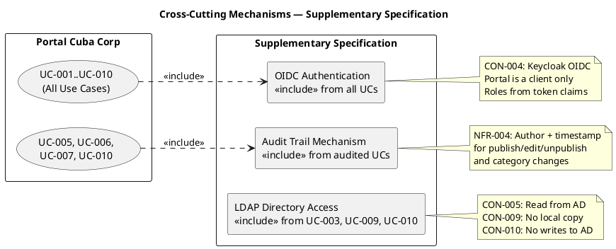
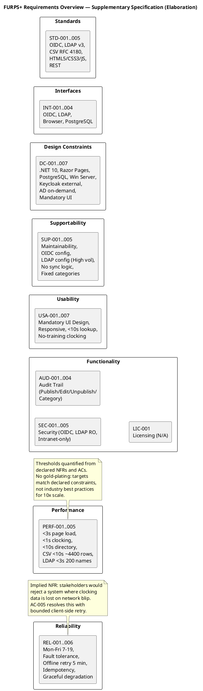

## Document Control
| Field | Value |
|---|---|
| Phase | Construction |
| Status | Draft |
| Milestone Target | End of Construction |
| Iteration | 2 (Cycle 1) |
| Date | 2026-08-28 |
| Prior Phase | Elaboration (LCA achieved — 0 Critical, 0 Major open; stakeholder sanction GRANTED) |
| Evolution | Construction Iter 1: NFR baseline preserved — no approved CR introduces new quality attributes. All FURPS+ categories addressed in Elaboration baseline. Document Control updated to Construction phase. Construction Iter 2: NFR baseline preserved — CR-010 (IsFeatured flag) is a derived field within UC-005/UC-006, not a new quality attribute. No FURPS+ category changes required. |
## Functionality

### Security

| ID | Requirement | Source | Volatility |
|---|---|---|---|
| SEC-001 | Authentication via Keycloak OIDC — portal is a client only; no local user store | CON-004 | Low |
| SEC-002 | Authorization via OIDC token role claims — HR role gates UC-003 through UC-007 and UC-010 | CON-004 | Medium |
| SEC-003 | No access from outside the corporate network | CON-007 | Low |
| SEC-004 | Employee directory displays corporate data only (name, job title, department, office, email, extension) — no private personal information | CON-012 | Low |
| SEC-005 | Portal does not write to Active Directory — read-only LDAP access | CON-010 | Low |

### Licensing

| ID | Requirement | Source | Volatility |
|---|---|---|---|
| LIC-001 | N/A — internal intranet application using open-source stack (.NET 10, PostgreSQL, Keycloak). No third-party commercial licensing identified. | — | Low |

### Audit Trail (Cross-Cutting Mechanism)

| ID | Requirement | Source | Volatility |
|---|---|---|---|
| AUD-001 | Every news publish, edit, and unpublish records author identity + timestamp | NFR-004, FR-005, FR-006, FR-007 | Low |
| AUD-002 | Every worker category change records author identity + timestamp | NFR-004, FR-010 | Low |
| AUD-003 | News items are never hard-deleted — unpublishing preserves the record for audit | CON-013, FR-007 | Low |
| AUD-004 | Employee fields are read-only from AD — no audit needed for directory data | NFR-004 | Low |

**Cross-cutting mechanism diagram:**

## Usability

| ID | Requirement | Source | Volatility |
|---|---|---|---|
| USA-001 | The portal MUST implement the custom design at `docs/inputs/employee-portal-design.html` — authoritative for UI visual layer, not just structure | CON-011 | Low |
| USA-002 | Responsive web design — works in Chrome and Edge on desktop; no native mobile app | CON-002, CON-008 | Low |
| USA-003 | Employee can find a colleague's phone/email in under 10 seconds | AC-003 | Medium |
| USA-004 | 80% of employees complete at least one clocking with no prior training | AC-004 | Medium |
| USA-005 | Employee can clock in/out without help from HR or dev team | AC-001 | Low |
| USA-006 | HR can publish a news item without technical assistance | AC-002 | Low |
## Reliability

| ID | Requirement | Source | Volatility |
|---|---|---|---|
| REL-001 | System available during extended working hours: Monday–Friday 7:00–19:00 | NFR-003 | Low |
| REL-002 | Fault tolerance within the corporate network — 24/7 not required | NFR-003 | Low |
| REL-003 | AC-005 offline tolerance (resolved): Server-side fault tolerance plus one bounded client-side mechanism for clocking only. The clocking button keeps the press in the browser (localStorage) and retries its POST for up to 5 minutes. The server accepts the timestamp the client sends — the moment the employee pressed — and rejects duplicates by an idempotency key. This is a page-level script on an already-rendered Razor page (CON-002 stands — no SPA, no client-side router). This is not the excluded sync work: the scope-out forbids synchronising copies of employee data, not retrying one POST. One action, one queue, one entity — nothing to reconcile. Everything else stays offline-dead: directory and news show a "no connection" message when the network is down. No PWA, no service worker, no client cache of anything else. Beyond 5 minutes the employee reports the clocking to HR. | AC-005 | Low |
| REL-004 | Idempotency key on clocking POST prevents duplicate records when the client retries after a network interruption | AC-005 | Medium |
| REL-005 | Implied NFR — stakeholders would reject a system where clocking data is lost on a network blip. The offline retry mechanism (REL-003) addresses this: the clocking is queued client-side and retried, not dropped. | AC-005 | Low |
| REL-006 | Implied NFR — if AD is unavailable, the directory shows "Directory unavailable" and clocking views show employee id instead of name. The system does not crash; it degrades gracefully. | CON-005 | Medium |

## Performance

| ID | Requirement | Source | Volatility |
|---|---|---|---|
| PERF-001 | Page load under 3 seconds on the corporate network (measured from request to full render including LDAP/DB queries) | NFR-001 | Low |
| PERF-002 | Clock in/out operation responds in under 1 second (measured from button press to confirmation display, excluding offline retry) | NFR-002 | Low |
| PERF-003 | LDAP directory query returns results fast enough for AC-003: total time from search submission to result display under 10 seconds (includes LDAP round-trip + rendering) | AC-003, FR-009 | Medium |
| PERF-004 | CSV export of monthly clocking report completes in under 10 seconds for maximum dataset (~200 employees × ~22 working days ≈ 4,400 records) | FR-004 | Low |
| PERF-005 | LDAP query for employee name resolution in UC-003 (all clockings view) must complete within the 3-second page load budget for up to 200 employees | CON-005, NFR-001 | Medium |

## Supportability

| ID | Requirement | Source | Volatility |
|---|---|---|---|
| SUP-001 | Maintainability — .NET 10 backend with REST API; standard maintainable architecture | CON-001 | Low |
| SUP-002 | Configurability — OIDC client settings (Keycloak URL, client id, realm) must be configurable via appsettings.json without code changes | CON-004 | Medium |
| SUP-003 | Configurability — LDAP connection settings (AD server URL, base DN, attribute mappings for job title, department, office, email, extension) must be configurable via appsettings.json without code changes. This is High volatility because LDAP attribute names may differ across AD environments (R001). | CON-005, R001 | High |
| SUP-004 | No synchronization or reconciliation logic to maintain — portal reads AD on demand | CON-009 | Low |
| SUP-005 | Configurability — news categories (General, HR, IT, Events) defined as a fixed enumeration in code; changeable only via code deployment | FR-005, FR-008 | Low |

## Design Constraints

| ID | Constraint | Source |
|---|---|---|
| DC-001 | Backend: .NET 10, REST API | CON-001 |
| DC-002 | Frontend: Razor Pages (no SPA) | CON-002 |
| DC-003 | Database: PostgreSQL | CON-003 |
| DC-004 | Hosting: internal Windows Server (no cloud) | CON-006 |
| DC-005 | Keycloak is external — portal is OIDC client only; no Keycloak deployment/provisioning | CON-004 |
| DC-006 | Employee data read from AD on demand; only AD user id → category stored locally | CON-009 |
| DC-007 | UI design from `employee-portal-design.html` is mandatory | CON-011 |

## Interfaces

| ID | Interface | Type | Direction | Source |
|---|---|---|---|---|
| INT-001 | Keycloak OIDC | External system | Portal → Keycloak (auth request, token validation) | CON-004 |
| INT-002 | Active Directory LDAP | External system | Portal → AD (read corporate attributes) | CON-005, CON-009 |
| INT-003 | Browser (Chrome/Edge) | User agent | Portal → Browser (HTML/CSS/JS via Razor Pages) | CON-002, CON-008 |
| INT-004 | PostgreSQL | Database | Portal → PostgreSQL (clocking, news, audit, worker category) | CON-003 |

## Applicable Standards

| ID | Standard | Applicability |
|---|---|---|
| STD-001 | OIDC (OpenID Connect) protocol | INT-001 — Keycloak integration |
| STD-002 | LDAP v3 protocol | INT-002 — Active Directory access |
| STD-003 | CSV format (RFC 4180) | UC-004 — clocking report export |
| STD-004 | HTML5 / CSS3 / JavaScript (ES6+) | INT-003 — browser compatibility |
| STD-005 | REST API conventions (HTTP verbs, JSON) | CON-001 — backend API |

## FURPS+ Overview

## Traceability

| Element | Traces From | Link Type | Traces To |
|---|---|---|---|
| SEC-001 | CON-004 | Refines | INT-001, All UCs |
| SEC-002 | CON-004 | Refines | UC-003..UC-007, UC-010 |
| SEC-003 | CON-007 | Refines | All UCs |
| SEC-004 | CON-012 | Refines | UC-009 |
| SEC-005 | CON-010 | Refines | INT-002, UC-009, UC-010 |
| AUD-001 | NFR-004, FR-005, FR-006, FR-007 | Refines | UC-005, UC-006, UC-007 |
| AUD-002 | NFR-004, FR-010 | Refines | UC-010 |
| AUD-003 | CON-013, FR-007 | Refines | UC-007 |
| AUD-004 | NFR-004 | Refines | UC-009 |
| USA-001 | CON-011 | Refines | (UI Design) |
| USA-002 | CON-002, CON-008 | Refines | (UI Design) |
| USA-003 | AC-003 | Refines | UC-009 |
| USA-004 | AC-004 | Refines | UC-001 |
| USA-005 | AC-001 | Refines | UC-001 |
| USA-006 | AC-002 | Refines | UC-005 |
| USA-007 | FR-005, FR-008 | Refines | UC-005, UC-008 |
| REL-001 | NFR-003 | Refines | All UCs |
| REL-002 | NFR-003 | Refines | All UCs |
| REL-003 | AC-005 | Refines | UC-001 (offline retry) |
| REL-004 | AC-005 | Refines | UC-001 (idempotency key) |
| REL-005 | AC-005 | Refines | UC-001 |
| REL-006 | CON-005 | Refines | UC-009, UC-003 |
| PERF-001 | NFR-001 | Refines | All UCs |
| PERF-002 | NFR-002 | Refines | UC-001 |
| PERF-003 | AC-003, FR-009 | Refines | UC-009 |
| PERF-004 | FR-004 | Refines | UC-004 |
| PERF-005 | CON-005, NFR-001 | Refines | UC-003 |
| SUP-001 | CON-001 | Refines | (Architecture) |
| SUP-002 | CON-004 | Refines | INT-001 |
| SUP-003 | CON-005, R001 | Refines | INT-002 |
| SUP-004 | CON-009 | Refines | (Architecture) |
| SUP-005 | FR-005, FR-008 | Refines | UC-005, UC-008 |
| DC-001 | CON-001 | Refines | (Architecture) |
| DC-002 | CON-002 | Refines | (Architecture) |
| DC-003 | CON-003 | Refines | (Architecture) |
| DC-004 | CON-006 | Refines | (Architecture) |
| DC-005 | CON-004 | Refines | INT-001 |
| DC-006 | CON-009 | Refines | INT-002, UC-010 |
| DC-007 | CON-011 | Refines | (UI Design) |
| INT-001 | CON-004 | Derives | SEC-001, SEC-002 |
| INT-002 | CON-005, CON-009 | Derives | SEC-004, SEC-005 |
| INT-004 | CON-003 | Derives | UC-001..UC-004, UC-005..UC-007, UC-010 |