## Document Control
| Field | Value |
|---|---|
| Phase | Construction |
| Status | Draft |
| Milestone Target | End of Construction |
| Iteration | 2 (Cycle 1) |
| Date | 2026-08-28 |
| Prior Phase | Elaboration (LCA achieved — 0 Critical, 0 Major open; stakeholder sanction GRANTED) |
| Evolution | Construction Iter 1: Requirements baseline preserved — no approved CR affects scope or NFRs. All Elaboration implementation decisions (offline retry with idempotency key in UC-001, audit trail in UC-005/006/007/010, AD read-only in UC-009/010) already reflected in Elaboration baseline. Document Control updated to Construction phase. Construction Iter 2: CR-010 (IsFeatured flag) applied to UC-005 and UC-006 — IsFeatured is [DERIVED — from FR-008, awaiting stakeholder confirmation] enabling the featured news banner in UC-008. Use-Case Diagram title updated to Construction. |
## Use-Case Diagram
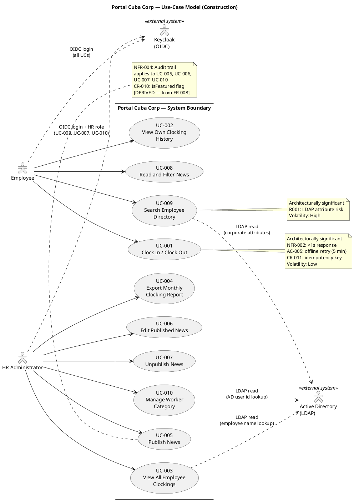
## Actors

| ID | Actor | Type | Description | Source |
|---|---|---|---|---|
| ACT-001 | Employee | Human (primary) | Any authenticated Cuba Corp employee (200 across 3 offices). Uses the portal for clocking, news reading, and directory search. | STK-004 |
| ACT-002 | HR Administrator | Human (primary) | HR staff member with elevated permissions (determined by OIDC role claims from Keycloak). Manages news, views all clockings, exports reports, manages worker categories. | STK-001 |
| ACT-003 | Active Directory (LDAP) | External system | Corporate directory accessed via LDAP for read-only employee data (name, job title, department, office, email, extension). System of record for employee attributes. | CON-005, CON-009 |
| ACT-004 | Keycloak (OIDC) | External system | Identity provider for authentication and authorization. Portal is an OIDC client only — no provisioning or management. | CON-004 |

## Use-Case Survey

| UC ID | Name | Source | Primary Actor | MoSCoW | Volatility | Architecturally Significant | Detail Level |
|---|---|---|---|---|---|---|---|
| UC-001 | Clock In / Clock Out | FR-001 | Employee | Must | Low | Yes (NFR-002: <1s, AC-005: offline retry) | Detailed |
| UC-002 | View Own Clocking History | FR-002 | Employee | Must | Low | No | Detailed |
| UC-003 | View All Employee Clockings | FR-003 | HR Administrator | Must | Low | No | Detailed |
| UC-004 | Export Monthly Clocking Report | FR-004 | HR Administrator | Must | Low | No | Detailed |
| UC-005 | Publish News | FR-005 | HR Administrator | Must | Medium | No | Detailed |
| UC-006 | Edit Published News | FR-006 | HR Administrator | Must | Medium | No | Detailed |
| UC-007 | Unpublish News | FR-007 | HR Administrator | Must | Low | No | Detailed |
| UC-008 | Read and Filter News | FR-008 | Employee | Must | Medium | No | Detailed |
| UC-009 | Search Employee Directory | FR-009 | Employee | Must | High | Yes (R001: LDAP risk) | Detailed |
| UC-010 | Manage Worker Category | FR-010 | HR Administrator | Must | Medium | No | Detailed |

## Use-Case Specifications
### UC-001: Clock In / Clock Out — DETAILED

| Field | Value |
|---|---|
| Source | FR-001 |
| Primary Actor | Employee (ACT-001) |
| Trigger | Employee opens the portal main page |
| Preconditions | Employee is authenticated via Keycloak OIDC |
| Postconditions | Clocking record persisted in PostgreSQL with employee id, client-side timestamp, clock direction (in/out), and idempotency key; confirmation displayed |
| MoSCoW | Must |
| Volatility | Low |

**Main Flow:**
1. Employee navigates to the portal main page.
2. System retrieves the employee's current clocking status from the database (authenticated employee id from OIDC token).
3. System displays a "Clock In" or "Clock Out" button depending on current status.
4. Employee presses the button.
5. Client records the press timestamp and generates an idempotency key in localStorage.
6. Client sends POST request to server with timestamp and idempotency key.
7. Server records the clocking entry (employee id, client timestamp, direction, idempotency key) in PostgreSQL.
8. Server returns confirmation with the recorded time.
9. Employee sees confirmation on screen.

**Alternative Flows:**
- **A1: Network error during POST (offline retry — AC-005 resolved):** Client stores the press in localStorage and retries the POST for up to 5 minutes. When the network is restored, the server accepts the original client-side timestamp (the moment the employee pressed) and rejects duplicates by idempotency key. This is a page-level script on an already-rendered Razor page — no SPA, no client-side router (CON-002 stands). This is not the excluded sync work: one action, one queue, one entity, nothing to reconcile.
- **A2: Network not restored within 5 minutes:** Client stops retrying and displays "Clocking not recorded — report to HR." The employee reports the clocking to HR manually.
- **A3: Duplicate POST received (idempotency):** Server detects the idempotency key already exists in the clocking table and returns the original confirmation without creating a duplicate record.

**Activity Diagram:**

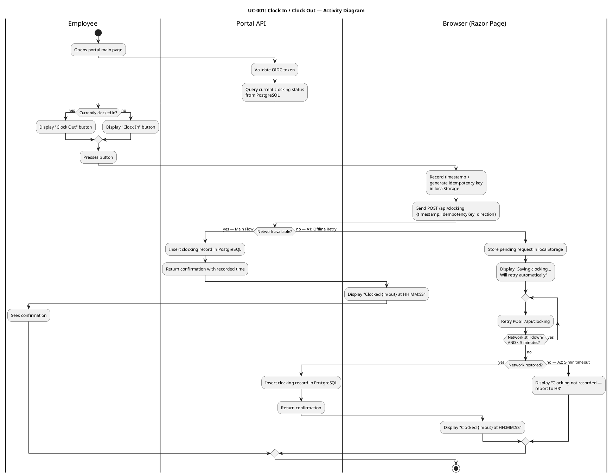

**Sequence Diagram (Key Realization — Main + Offline Retry + Idempotency):**

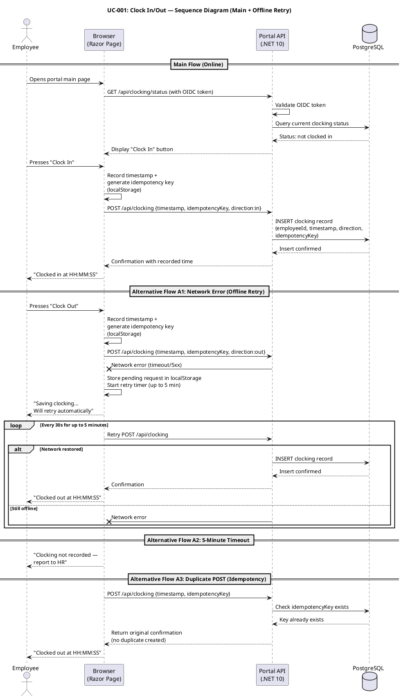

### UC-002: View Own Clocking History — DETAILED

| Field | Value |
|---|---|
| Source | FR-002 |
| Primary Actor | Employee (ACT-001) |
| Trigger | Employee selects "My Clocking History" |
| Preconditions | Employee is authenticated via Keycloak OIDC |
| Postconditions | Employee's clocking history for the current month is displayed |
| MoSCoW | Must |
| Volatility | Low |

**Main Flow:**
1. Employee navigates to "My Clocking History" page.
2. System queries the database for the employee's clocking records for the current month.
3. System displays the clocking history in a table (date, time in, time out).
4. Employee reviews their history.

**Alternative Flows:**
- **A1: No clocking records for current month:** System displays "No clocking records for this month yet."

**Activity Diagram:**

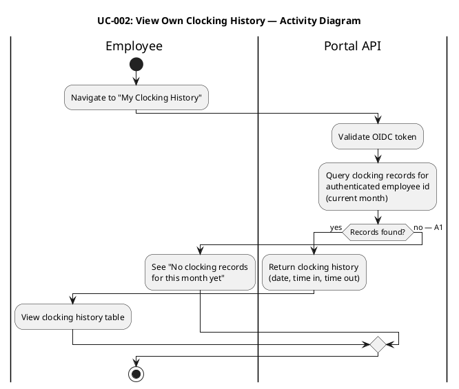

### UC-003: View All Employee Clockings — DETAILED

| Field | Value |
|---|---|
| Source | FR-003 |
| Primary Actor | HR Administrator (ACT-002) |
| Trigger | HR selects "All Employee Clockings" |
| Preconditions | HR Administrator is authenticated with HR role via Keycloak OIDC |
| Postconditions | All employees' clockings are displayed with employee names resolved from AD |
| MoSCoW | Must |
| Volatility | Low |

**Main Flow:**
1. HR Administrator navigates to "All Employee Clockings" page.
2. System verifies HR role from OIDC token.
3. System queries the database for all clocking records.
4. System resolves employee names from Active Directory via LDAP (using employee id from clocking records).
5. System displays clockings in a table (employee name, date, time in, time out).

**Alternative Flows:**
- **A1: AD unavailable for name resolution:** System displays employee id instead of name and shows a warning "AD unavailable — showing employee IDs."

**Activity Diagram:**

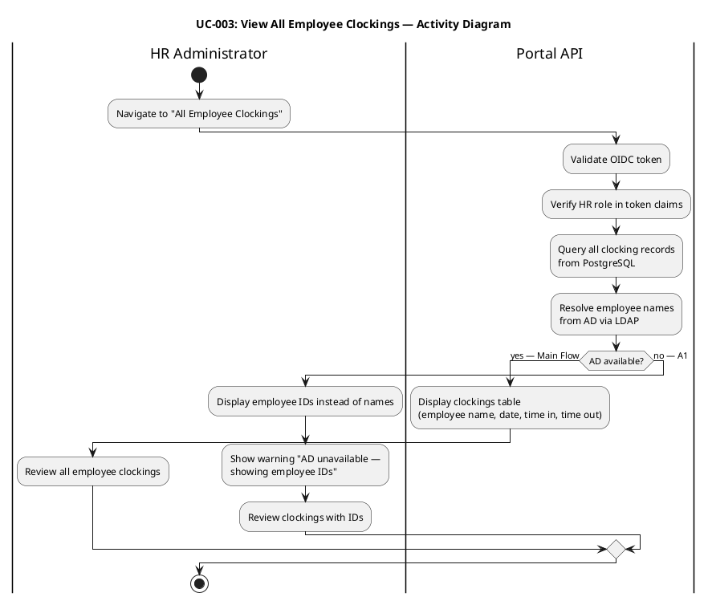

### UC-004: Export Monthly Clocking Report — DETAILED

| Field | Value |
|---|---|
| Source | FR-004 |
| Primary Actor | HR Administrator (ACT-002) |
| Trigger | HR selects "Export Monthly Report" |
| Preconditions | HR Administrator is authenticated with HR role; clocking data exists for the selected month |
| Postconditions | CSV file is downloaded to the HR Administrator's machine |
| MoSCoW | Must |
| Volatility | Low |

**Main Flow:**
1. HR Administrator selects month and clicks "Export CSV."
2. System queries the database for all clocking records for the selected month.
3. System resolves employee names from AD via LDAP.
4. System generates a CSV file (RFC 4180 compliant) with columns: employee name, employee id, date, time in, time out.
5. System sends the CSV file as a download response.
6. HR Administrator receives the CSV file.

**Alternative Flows:**
- **A1: No clocking data for selected month:** System displays "No clocking data for the selected month."
- **A2: AD unavailable during export:** System exports with employee IDs instead of names and includes a note in the CSV header.

**Activity Diagram:**

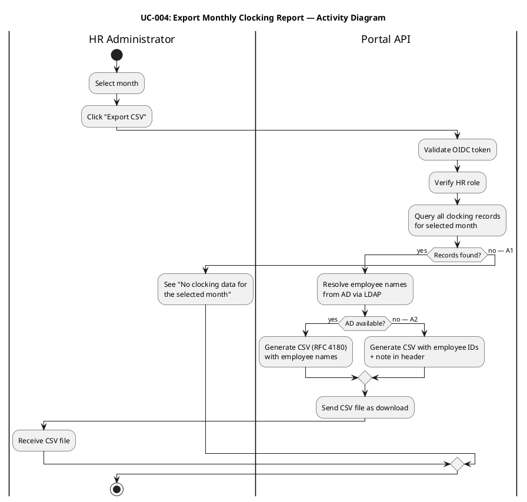

### UC-005: Publish News — DETAILED

| Field | Value |
|---|---|
| Source | FR-005, NFR-004 |
| Primary Actor | HR Administrator (ACT-002) |
| Trigger | HR selects "Publish News" |
| Preconditions | HR Administrator is authenticated with HR role via Keycloak OIDC |
| Postconditions | News item is published and visible to employees; audit record created (author + timestamp) |
| MoSCoW | Must |
| Volatility | Medium |

**Main Flow:**
1. HR Administrator navigates to "Publish News" page.
2. System displays a form with fields: title, body, date, category (General, HR, IT, Events), featured flag.
3. HR Administrator fills in the form and clicks "Publish."
4. System validates the form (title and body are required).
5. System persists the news item in PostgreSQL with status=published.
6. System creates an audit record: author identity (from OIDC token), timestamp, action=published.
7. System displays "News published successfully."

**Alternative Flows:**
- **A1: Validation error (missing title or body):** System displays validation error and does not persist.

**Activity Diagram:**

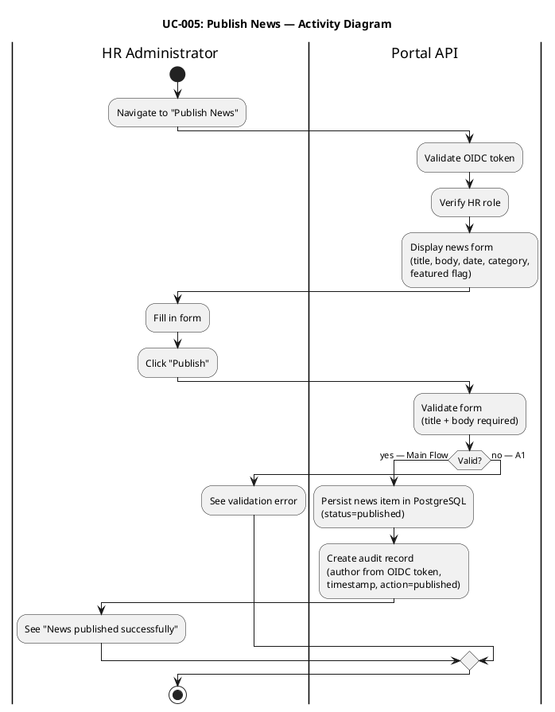

### UC-006: Edit Published News — DETAILED

| Field | Value |
|---|---|
| Source | FR-006, NFR-004 |
| Primary Actor | HR Administrator (ACT-002) |
| Trigger | HR selects a published news item to edit |
| Preconditions | HR Administrator is authenticated with HR role; news item exists and is published |
| Postconditions | News item is updated; audit record created (author + timestamp) |
| MoSCoW | Must |
| Volatility | Medium |

**Main Flow:**
1. HR Administrator navigates to the news management list.
2. System displays all news items (published and unpublished).
3. HR Administrator selects a published news item and clicks "Edit."
4. System displays the edit form pre-populated with current values.
5. HR Administrator modifies fields and clicks "Save."
6. System validates the form.
7. System updates the news item in PostgreSQL.
8. System creates an audit record: author identity, timestamp, action=edited.
9. System displays "News updated successfully."

**Alternative Flows:**
- **A1: Validation error:** System displays validation error and does not update.

**Activity Diagram:**

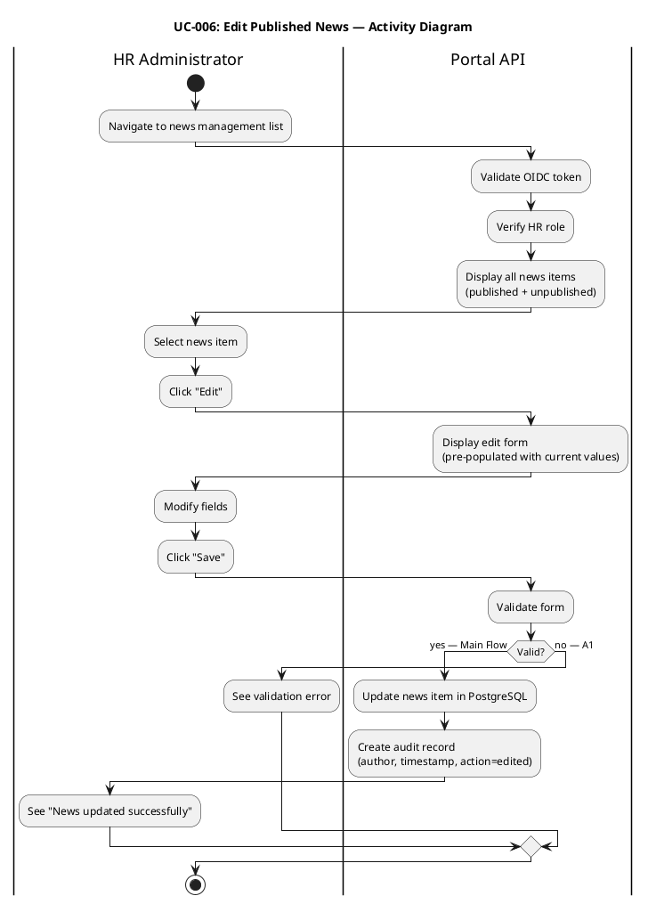

### UC-007: Unpublish News — DETAILED

| Field | Value |
|---|---|
| Source | FR-007, CON-013, NFR-004 |
| Primary Actor | HR Administrator (ACT-002) |
| Trigger | HR selects a published news item to unpublish |
| Preconditions | HR Administrator is authenticated with HR role; news item is published |
| Postconditions | News item status changed to unpublished (hidden from employees, record preserved); audit record created |
| MoSCoW | Must |
| Volatility | Low |

**Main Flow:**
1. HR Administrator navigates to the news management list.
2. System displays all news items.
3. HR Administrator selects a published news item and clicks "Unpublish."
4. System changes the news item status to unpublished in PostgreSQL (record is NOT deleted — CON-013).
5. System creates an audit record: author identity, timestamp, action=unpublished.
6. System displays "News unpublished successfully."

**Alternative Flows:**
- **A1: News item already unpublished:** System displays "This news item is already unpublished."

**Activity Diagram:**

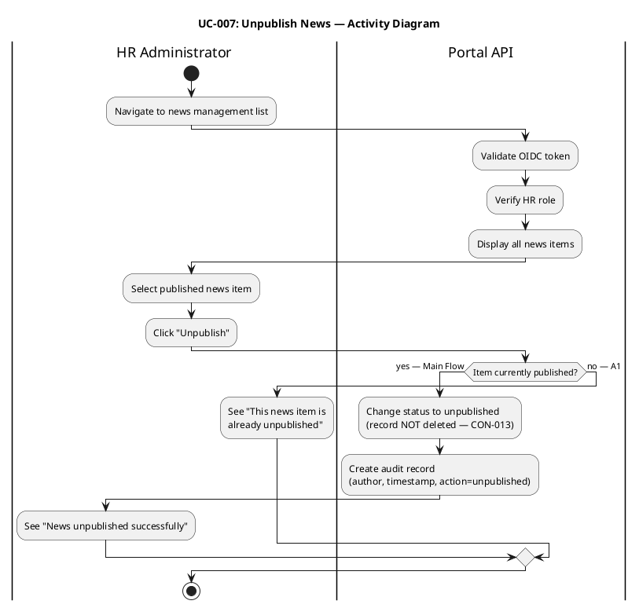

### UC-008: Read and Filter News — DETAILED

| Field | Value |
|---|---|
| Source | FR-008 |
| Primary Actor | Employee (ACT-001) |
| Trigger | Employee opens the portal main page |
| Preconditions | Employee is authenticated via Keycloak OIDC |
| Postconditions | News items are displayed, sorted by date, with optional category filter and featured banners |
| MoSCoW | Must |
| Volatility | Medium |

**Main Flow:**
1. Employee navigates to the portal main page.
2. System queries the database for published news items.
3. System displays featured news items with a banner at the top.
4. System displays remaining news items sorted by date (newest first).
5. Employee can select a category filter (General, HR, IT, Events).
6. System filters the displayed news items by the selected category.

**Alternative Flows:**
- **A1: No published news items:** System displays "No news items available."
- **A2: No news items in selected category:** System displays "No news items in this category."

**Activity Diagram:**

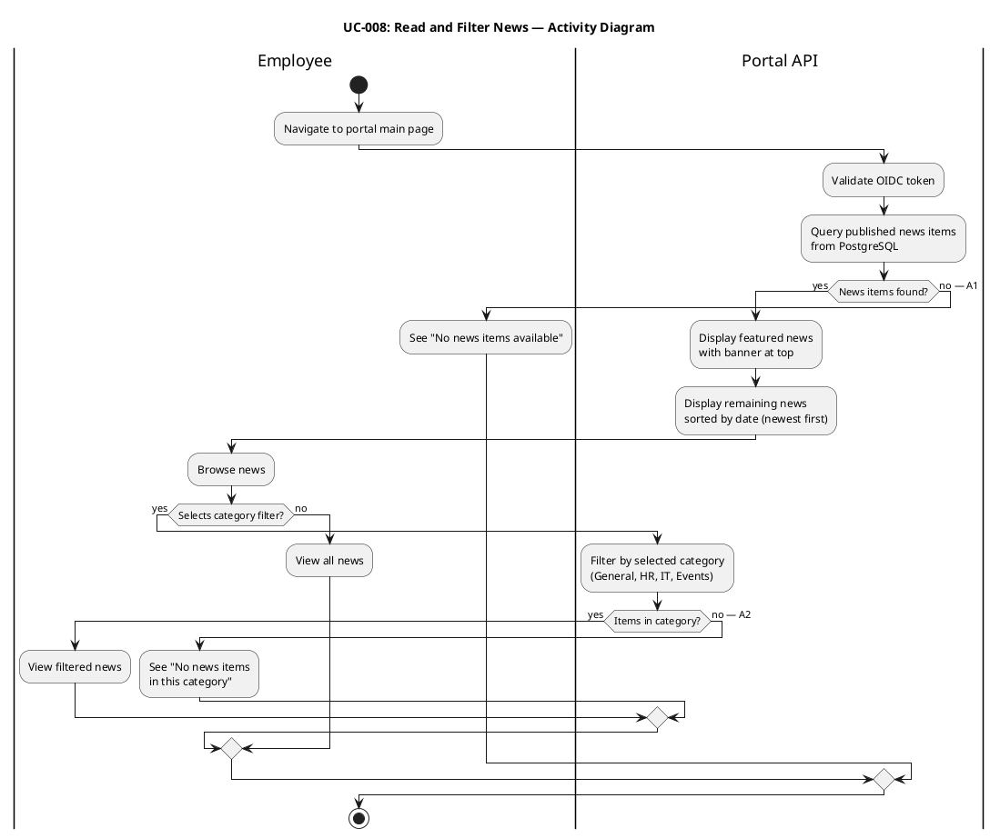

### UC-009: Search Employee Directory — DETAILED

| Field | Value |
|---|---|
| Source | FR-009, CON-005, CON-012 |
| Primary Actor | Employee (ACT-001) |
| Trigger | Employee enters a search term in the directory search field |
| Preconditions | Employee is authenticated via Keycloak OIDC |
| Postconditions | Matching employee entries are displayed with corporate data only |
| MoSCoW | Must |
| Volatility | High (R001: LDAP attribute consistency risk) |

**Main Flow:**
1. Employee navigates to the "Directory" page.
2. System displays a search field.
3. Employee enters a search term (name, department, or office).
4. System queries Active Directory via LDAP with the search term.
5. AD returns matching entries with corporate attributes (name, job title, department, office, email, extension).
6. System displays the results in a list.
7. Employee reviews the results.

**Alternative Flows:**
- **A1: AD unavailable:** System displays "Directory unavailable — please try again later."
- **A2: Partial LDAP attributes (R001):** Some entries have missing attributes (e.g., extension phone not filled). System displays "Not available" for missing fields instead of hiding the entry.
- **A3: No results found:** System displays "No colleagues found matching your search."

**Activity Diagram:**

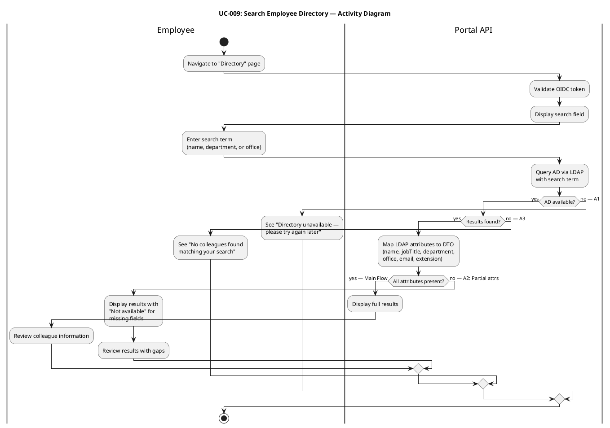

**Sequence Diagram (Key Realization — with AD degradation):**

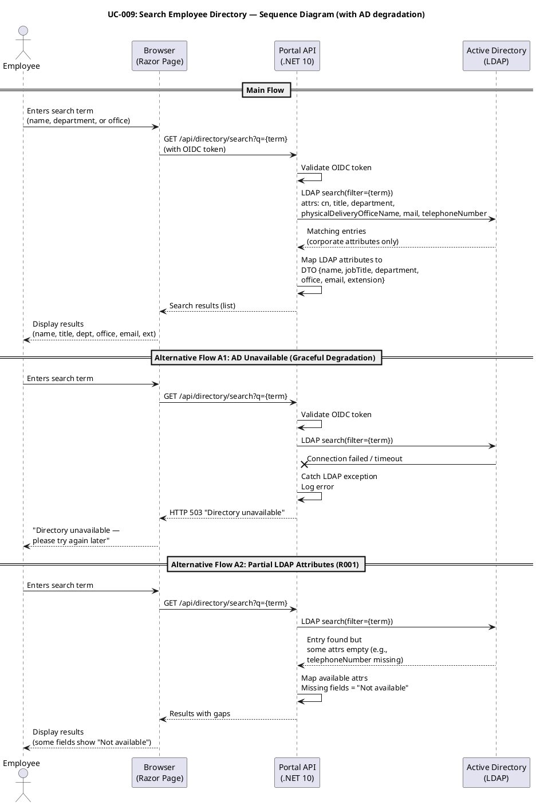

### UC-010: Manage Worker Category — DETAILED

| Field | Value |
|---|---|
| Source | FR-010, CON-009, NFR-004 |
| Primary Actor | HR Administrator (ACT-002) |
| Trigger | HR selects "Manage Worker Categories" |
| Preconditions | HR Administrator is authenticated with HR role via Keycloak OIDC |
| Postconditions | Worker category link (AD user id → category) is created or updated; audit record created |
| MoSCoW | Must |
| Volatility | Medium |

**Main Flow:**
1. HR Administrator navigates to "Manage Worker Categories" page.
2. System verifies HR role from OIDC token.
3. System displays current worker category assignments (AD user id, category).
4. HR selects an employee (looks up AD user id via LDAP).
5. System confirms the employee exists in AD.
6. HR assigns or updates the category.
7. System validates the category value.
8. System persists the worker category link (AD user id, category) in the local table.
9. System creates an audit record: author identity from OIDC token, timestamp, action=CategoryChanged.
10. System displays "Category updated successfully."

**Alternative Flows:**
- **A1: Employee not found in AD:** System displays "Employee not found in AD."
- **A2: Invalid category value:** System displays a validation error.

**Activity Diagram:**

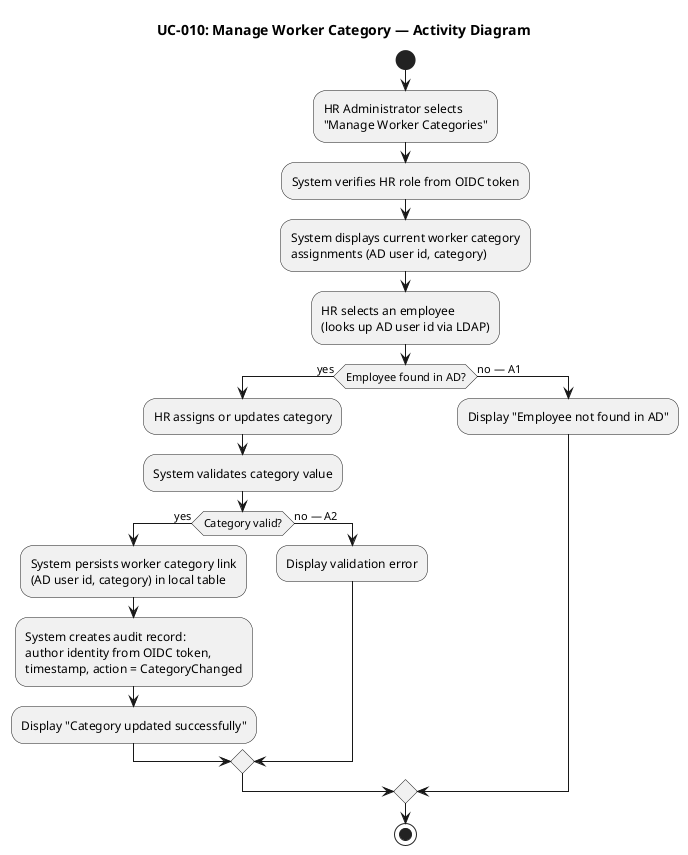
## Traceability
### Consolidated Requirements Traceability Flow

The following diagram shows the complete traceability chain from stakeholder needs (business goals) through declared features (FR-NNN) to use cases (UC-NNN) and acceptance criteria (AC-NNN). This consolidated view fulfills the Work Order's instruction to produce a consolidated requirements specification from all use cases and supplementary requirements.

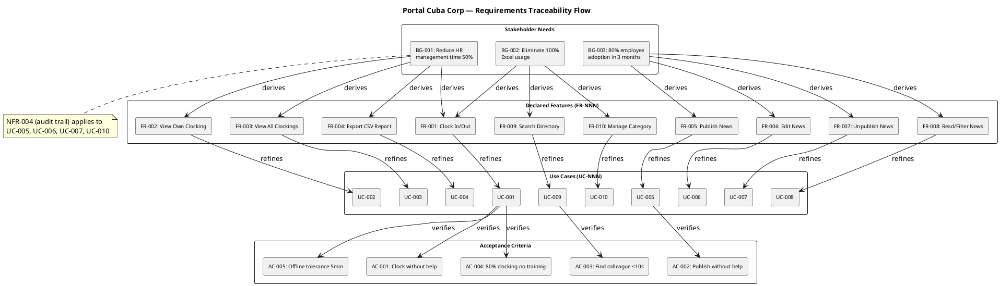

### Traceability Table

| Element | Traces From | Link Type | Traces To |
|---|---|---|---|
| UC-001 | FR-001, AC-005 | Refines | REQ-001, REL-003, REL-004, PERF-002, AC-001, AC-004, AC-005 |
| UC-002 | FR-002 | Refines | REQ-002 |
| UC-003 | FR-003 | Refines | REQ-003, PERF-005, REL-006 |
| UC-004 | FR-004 | Refines | REQ-004, PERF-004, STD-003 |
| UC-005 | FR-005, NFR-004 | Refines | REQ-005, AUD-001, AC-002 |
| UC-006 | FR-006, NFR-004 | Refines | REQ-006, AUD-001 |
| UC-007 | FR-007, CON-013, NFR-004 | Refines | REQ-007, AUD-001, AUD-003 |
| UC-008 | FR-008 | Refines | REQ-008, USA-001 |
| UC-009 | FR-009, CON-005, CON-012 | Refines | REQ-009, SEC-004, SEC-005, PERF-003, SUP-003, R001, AC-003 |
| UC-010 | FR-010, CON-009, NFR-004 | Refines | REQ-010, AUD-002, DC-006 |
| ACT-001 | STK-004 | Derives | UC-001, UC-002, UC-008, UC-009 |
| ACT-002 | STK-001 | Derives | UC-003..UC-007, UC-010 |
| ACT-003 | CON-005, CON-009 | Derives | UC-003, UC-009, UC-010 |
| ACT-004 | CON-004 | Derives | All UCs (auth) |
| UC-001..UC-004 | BG-001, BG-002 | Derives | (Business Goals) |
| UC-005..UC-008 | BG-003 | Derives | (Business Goals) |
| UC-009 | BG-002 | Derives | (Business Goals) |
| UC-009 | R001 | DependsOn | (LDAP attribute consistency) |
